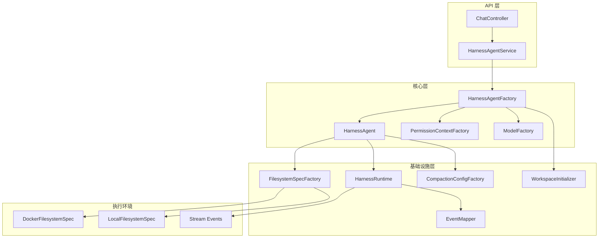
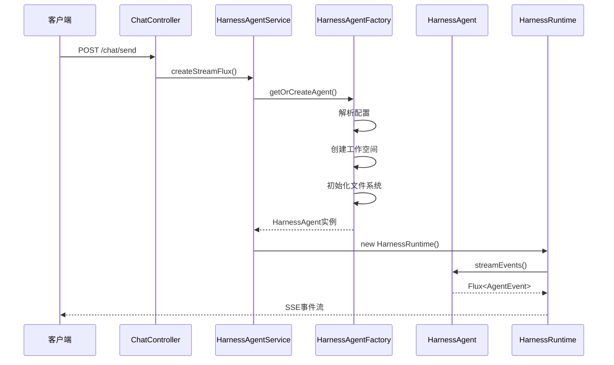
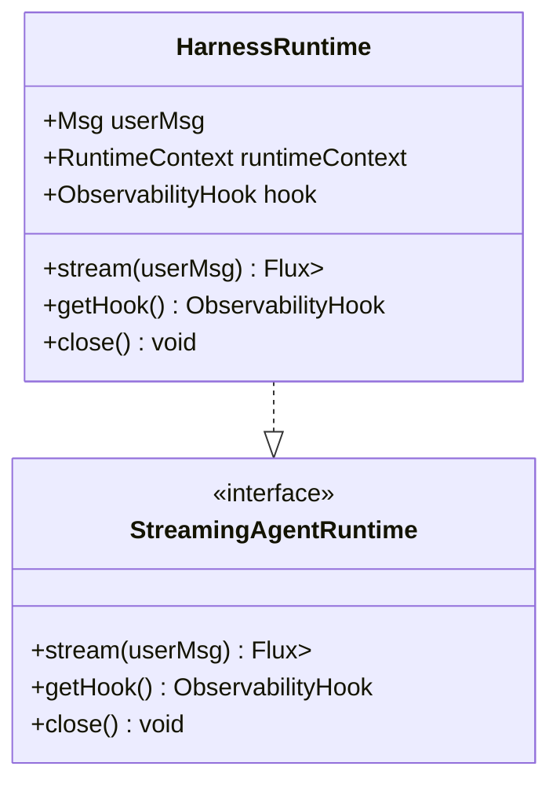
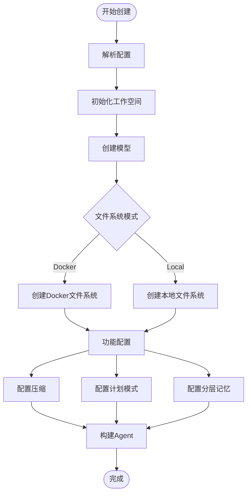

# Harness Agent 框架技术文档

<cite>
**本文档引用的文件**   
- [HarnessRuntime.java](file://src/main/java/com/skloda/agentscope/harness/HarnessRuntime.java)
- [HarnessAgentFactory.java](file://src/main/java/com/skloda/agentscope/harness/HarnessAgentFactory.java)
- [HarnessAgentService.java](file://src/main/java/com/skloda/agentscope/harness/HarnessAgentService.java)
- [HarnessConfig.java](file://src/main/java/com/skloda/agentscope/agent/HarnessConfig.java)
- [CompactionConfigFactory.java](file://src/main/java/com/skloda/agentscope/harness/CompactionConfigFactory.java)
- [FilesystemSpecFactory.java](file://src/main/java/com/skloda/agentscope/harness/FilesystemSpecFactory.java)
- [WorkspaceInitializer.java](file://src/main/java/com/skloda/agentscope/harness/WorkspaceInitializer.java)
- [AgentConfig.java](file://src/main/java/com/skloda/agentscope/agent/AgentConfig.java)
- [PermissionContextFactory.java](file://src/main/java/com/skloda/agentscope/permission/PermissionContextFactory.java)
- [harness-agents.yml](file://src/main/resources/config/harness-agents.yml)
- [README.md](file://README.md)
</cite>

## 目录
1. [项目概述](#项目概述)
2. [架构设计](#架构设计)
3. [核心组件分析](#核心组件分析)
4. [沙箱隔离机制](#沙箱隔离机制)
5. [内存管理与上下文压缩](#内存管理与上下文压缩)
6. [文件系统抽象与权限控制](#文件系统抽象与权限控制)
7. [计划模式与任务管理](#计划模式与任务管理)
8. [技能学习系统](#技能学习系统)
9. [企业级部署指南](#企业级部署指南)
10. [故障排除与监控](#故障排除与监控)
11. [总结](#总结)

## 项目概述

Harness Agent 框架是基于 AgentScope 构建的企业级智能代理运行时环境。该框架提供完整的沙箱隔离、权限控制、工作空间管理和可扩展的任务执行能力。它支持多种执行模式（Claw 模式、Builder 模式）、Docker 容器化运行、以及多层次的安全控制机制。

### 核心特性

- **多模式执行**: 支持 Claw（传统模式）、Builder（沙箱隔离模式）
- **资源隔离**: Docker 容器化执行环境，CPU 和内存限制
- **工作空间管理**: 模板化的工作空间初始化和管理
- **权限控制**: 细粒度的工具调用权限管理
- **内存优化**: 智能的上下文压缩和内存管理机制
- **可观测性**: 完整的日志记录和性能监控

**章节来源**
- [README.md:1-50](file://README.md#L1-L50)
- [HarnessAgentFactory.java:42-120](file://src/main/java/com/skloda/agentscope/harness/HarnessAgentFactory.java#L42-L120)

## 架构设计

### 整体架构图



**图示来源**
- [HarnessAgentFactory.java:27-120](file://src/main/java/com/skloda/agentscope/harness/HarnessAgentFactory.java#L27-L120)
- [HarnessRuntime.java:31-74](file://src/main/java/com/skloda/agentscope/harness/HarnessRuntime.java#L31-L74)

### 数据流架构



**图示来源**
- [HarnessAgentService.java:37-95](file://src/main/java/com/skloda/agentscope/harness/HarnessAgentService.java#L37-L95)

**章节来源**
- [HarnessAgentService.java:19-95](file://src/main/java/com/skloda/agentscope/harness/HarnessAgentService.java#L19-L95)

## 核心组件分析

### 运行时管理器 (HarnessRuntime)

HarnessRuntime 是核心的流式运行时组件，负责将 Agent 事件转换为 SSE 流格式，提供给前端使用。

#### 关键功能

- **事件流处理**: 使用 `streamEvents()` API 接收原始事件流
- **事件映射**: 通过 `AgentEventMapper` 将内部事件转换为统一的 Map 结构
- **错误处理**: 异常捕获并返回错误事件
- **状态管理**: 维护会话和用户标识符

#### 实现特点



**图示来源**
- [HarnessRuntime.java:31-74](file://src/main/java/com/skloda/agentscope/harness/HarnessRuntime.java#L31-L74)

**章节来源**
- [HarnessRuntime.java:15-74](file://src/main/java/com/skloda/agentscope/harness/HarnessRuntime.java#L15-L74)

### Agent 工厂 (HarnessAgentFactory)

HarnessAgentFactory 是 Agent 创建的中央工厂，负责根据配置组装所有必要的组件。

#### 主要职责

1. **配置解析**: 从 YAML 配置中提取设置
2. **工作空间初始化**: 创建和管理 Agent 的工作目录
3. **模型创建**: 统一通过 ModelFactory 创建 AI 模型
4. **文件系统配置**: 根据模式选择本地或 Docker 文件系统
5. **功能开关**: 按需启用各种高级功能

#### 创建流程



**图示来源**
- [HarnessAgentFactory.java:42-120](file://src/main/java/com/skloda/agentscope/harness/HarnessAgentFactory.java#L42-L120)

**章节来源**
- [HarnessAgentFactory.java:22-120](file://src/main/java/com/skloda/agentscope/harness/HarnessAgentFactory.java#L22-L120)

## 沙箱隔离机制

### 安全执行环境

Harness 框架提供了完整的安全沙箱环境，确保 Agent 代码的可控执行。

#### 隔离级别

| 特性 | 本地模式 | Docker 模式 |
|------|----------|-------------|
| 进程隔离 | ❌ | ✅ |
| 文件系统隔离 | ⚠️ 受限 | ✅ 完全隔离 |
| 网络访问 | ❌ 受控 | ⚠️ 可配置 |
| 资源限制 | ❌ | ✅ CPU/内存 |
| 快照恢复 | ❌ | ✅ |

#### Docker 沙箱配置

DockerFilesystemSpec 提供完整的容器化执行环境：

- **镜像管理**: 默认使用 `python:3.11-slim`，可自定义
- **资源限制**: CPU 和内存配额控制
- **环境变量**: 自动配置 Python 和执行环境
- **工作区挂载**: `/workspace` 作为共享目录

**章节来源**
- [FilesystemSpecFactory.java:17-46](file://src/main/java/com/skloda/agentscope/harness/FilesystemSpecFactory.java#L17-L46)
- [HarnessConfig.java:63-69](file://src/main/java/com/skloda/agentscope/agent/HarnessConfig.java#L63-L69)

## 内存管理与上下文压缩

### 智能压缩策略

框架实现了多层次的内存管理机制，有效控制系统在长对话中的内存使用。

#### 压缩配置选项

| 参数 | 默认值 | 说明 |
|------|--------|------|
| triggerMessages | 50 | 触发压缩的消息数 |
| triggerTokens | 100000 | 触发压缩的Token阈值 |
| keepMessages | 10 | 保留的消息数量 |
| keepTokens | 50000 | 保留的Token数量 |
| flushBeforeCompact | true | 压缩前是否先刷新 |
| offloadBeforeCompact | true | 压缩前是否卸载历史 |

#### 工具结果回收

ToolResultEvictionConfig 专门管理工具调用的内存使用：

- **最大结果大小**: 50000 字符
- **预览长度**: 1000 字符用于快速查看
- **自动回收**: 超出限制的内容被裁剪

**章节来源**
- [CompactionConfigFactory.java:11-46](file://src/main/java/com/skloda/agentscope/harness/CompactionConfigFactory.java#L11-L46)
- [HarnessConfig.java:48-54](file://src/main/java/com/skloda/agentscope/agent/HarnessConfig.java#L48-L54)

## 文件系统抽象与权限控制

### 统一文件操作接口

FileSystemSpecFactory 提供了统一的文件系统抽象，支持不同后端实现。

#### 支持的存储后端

1. **SANDBOXED 模式**: 安全的沙箱文件系统，适合生产环境
2. **UNRESTRICTED 模式**: 不受限制的本地文件访问，适合开发调试
3. **DOCKER 模式**: Docker 容器内的文件隔离

### 权限控制系统

#### 细粒度权限管理

权限控制基于 PermissionContextState，支持三种模式：

- **bypass**: 绕过权限检查（不推荐生产使用）
- **accept_edits**: 接受编辑但需要确认
- **deny**: 拒绝所有未授权操作

#### 工具级权限控制

| 工具类型 | denyTools 列表 | askTools 列表 | 行为 |
|----------|----------------|---------------|------|
| 危险工具 | execute | - | 直接拒绝 |
| 文件编辑 | - | write_text_file, edit_docx | 需要用户确认 |
| 搜索工具 | - | - | 允许执行 |

**章节来源**
- [PermissionContextFactory.java:10-38](file://src/main/java/com/skloda/agentscope/permission/PermissionContextFactory.java#L10-L38)
- [FilesystemSpecFactory.java:17-32](file://src/main/java/com/skloda/agentscope/harness/FilesystemSpecFactory.java#L17-L32)

## 计划模式与任务管理

### Plan Mode 功能

Plan Mode 为复杂任务提供了规划和分析能力，支持生成详细的执行计划。

#### 核心特性

- **计划存储**: 将计划保存到指定目录（默认 plans/）
- **Shell 访问**: 可选的 Shell 命令执行能力
- **任务分解**: 自动将大任务分解为子步骤

#### 配置选项

```yaml
plan:
  enabled: true
  fileDirectory: "plans"
  allowShell: false
```

### Task List 管理

Task List 提供任务优先级管理和进度跟踪：

- **自动生成**: 基于用户输入智能生成任务列表
- **优先级排序**: 动态调整任务优先级
- **状态跟踪**: 实时跟踪任务执行状态
- **依赖管理**: 处理任务间依赖关系

**章节来源**
- [HarnessConfig.java:71-77](file://src/main/java/com/skloda/agentscope/agent/HarnessConfig.java#L71-L77)

## 技能学习系统

### 自适应学习能力

框架支持技能的自我进化和学习，使 Agent 能够在使用过程中不断优化能力。

#### 技能生命周期

1. **提议阶段**: Agent 发现新需求并提议新技能
2. **审查阶段**: 安全扫描和人工审核
3. **推广阶段**: 经过审批后部署到生产环境
4. **归档阶段**: 自动归档过时技能

#### 配置选项

```yaml
skillLearning:
  manageToolEnabled: true      # 启用技能管理工具
  autoPromote: false           # 自动推广模式
  securityScan: true          # 安全检查
  curatorEnabled: true        # 自动化维护
```

**章节来源**
- [HarnessConfig.java:108-132](file://src/main/java/com/skloda/agentscope/agent/HarnessConfig.java#L108-L132)

## 工作空间初始化

### 模板驱动初始化

WorkspaceInitializer 负责根据模板自动创建工作空间结构和文件。

#### 预置模板

框架提供了丰富的预设模板：

- **complaint-reviewer**: 投诉复盘分析师
- **finance-intel-tracker**: 金融情报追踪器  
- **root-cause-analyst**: 根因分析师
- **strategy-optimizer**: 策略优化器

#### 文件结构

每个工作空间包含：
- `AGENTS.md`: Agent 配置文件
- `knowledge/`: 领域知识文件
- `skills/`: 技能定义文件
- `subagents/`: 子 Agent 配置

**章节来源**
- [WorkspaceInitializer.java:18-52](file://src/main/java/com/skloda/agentscope/harness/WorkspaceInitializer.java#L18-L52)

## 企业级部署指南

### 安全配置建议

#### 1. 沙箱配置

推荐使用 Docker 模式进行生产部署：

```yaml
harnessConfig:
  filesystemMode: "DOCKER"
  sandbox:
    image: "python:3.11-slim"
    memorySizeBytes: 2_000_000_000  # 2GB 内存限制
    cpuCount: 2                     # 2个CPU核心
```

#### 2. 权限策略

```yaml
permissionConfig:
  defaultMode: "accept_edits"     # 推荐的生产模式
  denyTools:
    - execute                    # 拒绝直接的shell执行
  askTools:
    - write_text_file            # 文件写入需要确认
    - edit_docx                  # 文档编辑需要确认
```

### 资源限制配置

#### Docker 资源配置

- **内存限制**: 建议设置为实际物理内存的 75%
- **CPU 配额**: 根据并发数合理分配
- **磁盘配额**: 为每个 Agent 预留足够的存储空间
- **超时设置**: 设置合理的执行超时时间防止资源占用

#### JVM 参数调优

```bash
-Xms2g -Xmx4g 
-XX:MetaspaceSize=256m
-XX:+UseG1GC
-XX:MaxGCPauseMillis=200
```

### 监控告警配置

#### 关键指标

1. **性能指标**
   - 响应时间 P95/P99
   - 吞吐量 QPS
   - 错误率统计
   - 资源使用率（CPU/Memory/Disk）

2. **业务指标**
   - Agent 调用频率
   - 任务完成率
   - Token 使用量
   - 工具调用统计

#### 日志收集

建议使用结构化日志格式，集成日志采集服务（如 ELK Stack）：

```yaml
logging:
  level:
    io.agentscope: INFO
    com.skloda.agentscope: DEBUG
  pattern:
    console: "%d{yyyy-MM-dd HH:mm:ss.SSS} [%thread] %-5level %logger{36} - %msg%n"
```

### 故障恢复机制

#### 健康检查

```yaml
management:
  health:
    show-details: always
  endpoints:
    web:
      exposure:
        include: health,info
```

#### 优雅重启

```java
// 应用关闭时清理资源
@PreDestroy
public void cleanup() {
    agentCache.clear();
    eventSink.close();
}
```

**章节来源**
- [HarnessConfig.java:63-69](file://src/main/java/com/skloda/agentscope/agent/HarnessConfig.java#L63-L69)
- [AgentConfig.java:100-106](file://src/main/java/com/skloda/agentscope/agent/AgentConfig.java#L100-L106)

## 故障排除与监控

### 常见问题诊断

#### 1. 网络连接问题

**症状**: 无法连接到外部 API
**解决方案**:
- 检查防火墙和网络配置
- 验证代理服务器设置
- 确认 API Key 有效性

#### 2. 内存溢出错误

**症状**: OutOfMemoryError 频繁出现
**解决方案**:
- 调整 JVM 堆内存大小
- 优化上下文压缩策略
- 减少单次处理的数据量

#### 3. 权限相关错误

**症状**: 工具调用被拒绝
**解决方案**:
- 检查权限配置设置
- 确认工具的权限级别
- 验证用户角色和权限组

### 监控仪表板

#### 关键监控视图

1. **系统健康度**: CPU、内存、磁盘使用情况
2. **API 性能**: 响应时间、吞吐量、错误率
3. **业务指标**: Agent 调用次数、任务完成状态
4. **资源消耗**: Token 使用量、工具调用统计

#### 告警规则

建议配置以下告警：

- CPU 使用率持续超过 80%
- 内存使用率超过 90%
- API 错误率超过 5%
- 响应时间 P99 超过 5秒
- 磁盘空间不足 10%

### 性能优化建议

#### 连接池优化

```java
// 数据库连接池配置
spring.datasource.hikari.maximum-pool-size=20
spring.datasource.hikari.minimum-idle=5
spring.datasource.hikari.idle-timeout=600000
```

#### 缓存策略

1. **一级缓存**: 本地对象缓存（ConcurrentHashMap）
2. **二级缓存**: Redis 分布式缓存
3. **查询优化**: 合理使用分页和条件查询

#### 异步化处理

使用 @Async 注解标记耗时操作，提高系统响应性：

```java
@Async
public CompletableFuture<String> processDocument(File file) {
    // 异步处理逻辑
    return CompletableFuture.completedFuture(result);
}
```

**章节来源**
- [HarnessAgentService.java:59-62](file://src/main/java/com/skloda/agentscope/harness/HarnessAgentService.java#L59-L62)

## 总结

Harness Agent 框架提供了一个完整的企业级智能代理运行时平台。通过精心设计的架构和丰富的功能特性，它能够满足各种复杂的业务场景需求。

### 核心优势

1. **安全可靠**: 完善的沙箱隔离和权限控制系统
2. **高度可扩展**: 插件化的架构设计，支持自定义扩展
3. **性能优异**: 优化的内存管理和并发处理机制
4. **易于运维**: 完善的监控和故障恢复能力

### 适用场景

- **企业知识库助手**: 结合 RAG 技术的智能问答
- **数据分析平台**: 自动化数据处理和报告生成
- **业务流程自动化**: 端到端的业务流程编排
- **客户服务机器人**: 智能化的客户支持和咨询

### 未来发展方向

1. **云原生支持**: 更好的 Kubernetes 集成和微服务支持
2. **AI 增强**: 引入更多的 AI 能力和智能优化
3. **生态建设**: 丰富的第三方工具和插件生态
4. **国际化**: 更好的多语言支持和本地化能力

该框架为企业构建智能应用程序提供了坚实的基础设施，通过持续迭代和优化，将继续引领 AI Agent 平台的发展方向。

**章节来源**
- [README.md:100-200](file://README.md#L100-L200)
- [harness-agents.yml:1-87](file://src/main/resources/config/harness-agents.yml#L1-L87)