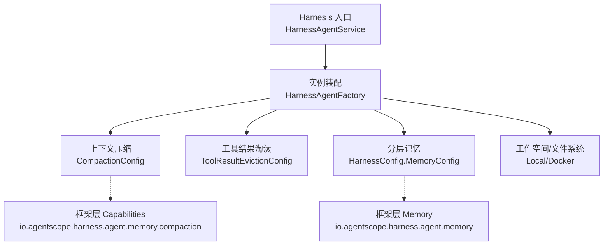
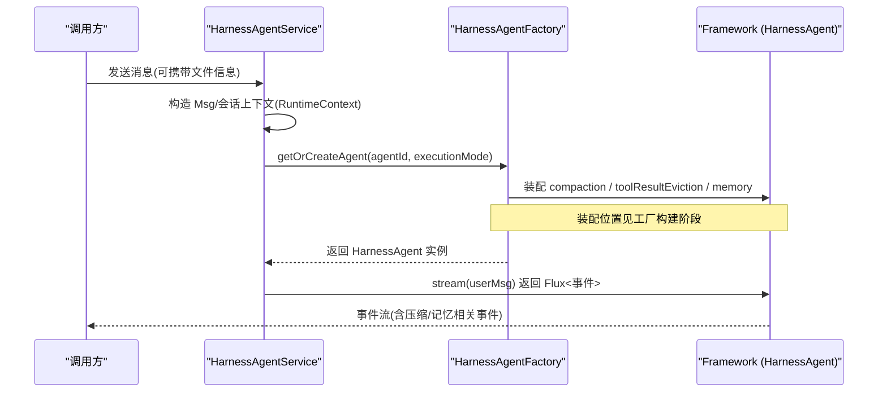
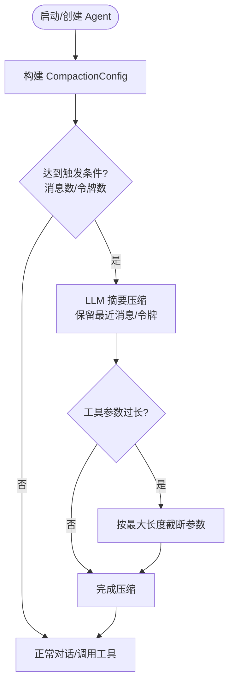
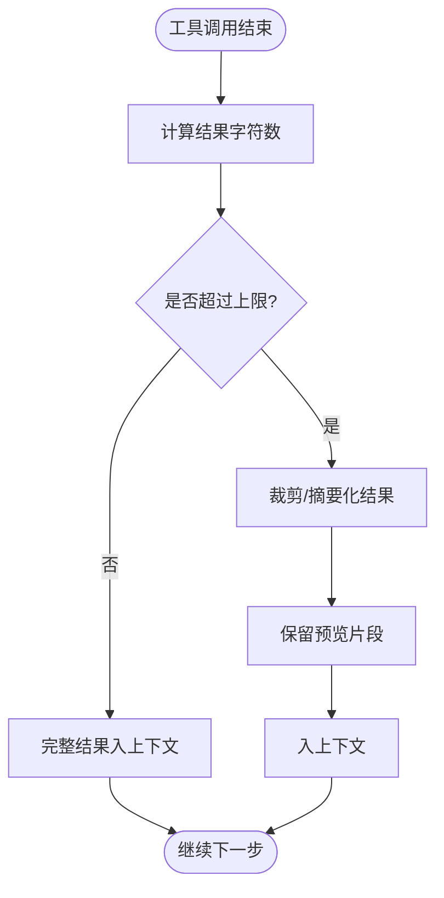
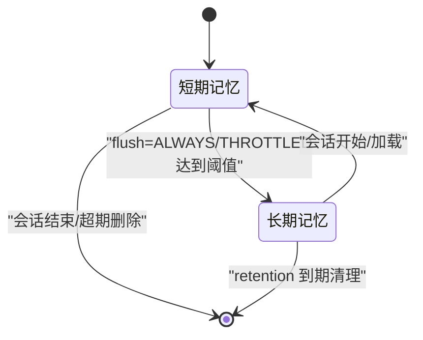
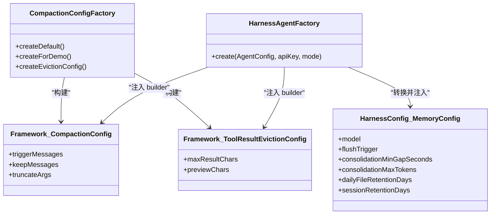
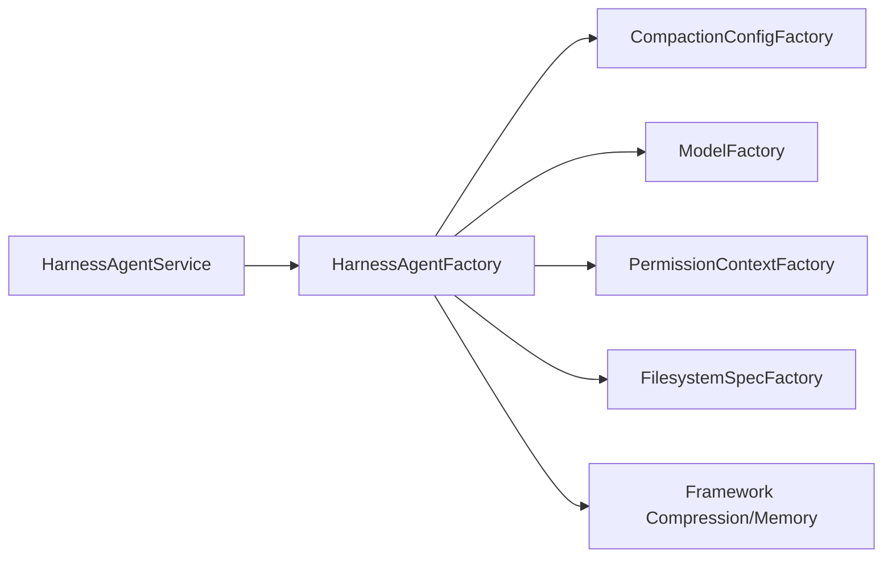

# 内存压缩与上下文管理

<cite>
**本文引用的文件**
- [CompactionConfigFactory.java](file://src/main/java/com/skloda/agentscope/harness/CompactionConfigFactory.java)
- [HarnessAgentFactory.java](file://src/main/java/com/skloda/agentscope/harness/HarnessAgentFactory.java)
- [HarnessAgentService.java](file://src/main/java/com/skloda/agentscope/harness/HarnessAgentService.java)
- [HarnessConfig.java](file://src/main/java/com/skloda/agentscope/agent/HarnessConfig.java)
- [AgentConfig.java](file://src/main/java/com/skloda/agentscope/agent/AgentConfig.java)
- [AgentFactory.java](file://src/main/java/com/skloda/agentscope/agent/AgentFactory.java)
- [ROADMAP.md](file://ROADMAP.md)
- [AGENTS.md](file://AGENTS.md)
</cite>

## 目录
1. [简介](#简介)
2. [项目结构](#项目结构)
3. [核心组件](#核心组件)
4. [架构总览](#架构总览)
5. [详细组件分析](#详细组件分析)
6. [依赖关系分析](#依赖关系分析)
7. [性能考虑](#性能考虑)
8. [故障排查指南](#故障排查指南)
9. [结论](#结论)
10. [附录](#附录)（必要时）

## 简介
本技术文档聚焦 AgentScope Harness 的“内存压缩与上下文管理”能力，围绕以下主题展开：
- CompactionConfigFactory 的上下文压缩算法入口与策略配置（消息保留、令牌阈值、参数截断等）。
- ToolResultEvictionConfig 的工具结果淘汰策略、监控与自动清理触发机制。
- 分层记忆系统的短期（会话/事件流）、长期（MEMORY.md + daily fact log）、会话（session）记忆的切换逻辑。
- 性能优化建议：压缩阈值调优、内存使用监控、缓存策略配置。
- 常见问题诊断与修复：压缩失效、内存泄漏、性能下降。

## 项目结构
内存压缩与上下文管理相关代码集中在 harness 与 agent 配置层：
- CompactionConfigFactory：提供 CompactionConfig 和 ToolResultEvictionConfig 的默认与演示配置。
- HarnessAgentFactory：装配 HarnessAgent，并接入 compaction、ToolResultEviction、分层 memory 等能力。
- HarnessConfig：定义 Harness 级别配置项（含 compaction 和 MemoryConfig）。
- AgentConfig/AgentFactory：保留 v1 LongTermMemory 兼容路径与警告提示；当前推荐使用 Harness MemoryConfig。
- HarnessAgentService/HarnessRuntime：运行时承载事件流与会话上下文，驱动实际执行。

图示来源
- [HarnessAgentFactory.java:42-119](file://src/main/java/com/skloda/agentscope/harness/HarnessAgentFactory.java#L42-L119)
- [CompactionConfigFactory.java:11-46](file://src/main/java/com/skloda/agentscope/harness/CompactionConfigFactory.java#L11-L46)

小节来源
- [AGENTS.md](file://AGENTS.md)

## 核心组件
- CompactionConfigFactory
  - 提供 default/demo 两种级别的 CompactionConfig 创建方法。
  - 暴露 createEvictionConfig() 用于构建 ToolResultEvictionConfig（限制结果字符上限、预览长度等）。
- HarnessAgentFactory
  - 将 CompactionConfig 与 ToolResultEvictionConfig 注入到 HarnessAgent.Builder。
  - 将 HarnessConfig.MemoryConfig 转换为框架 MemoryConfig 并启用分层记忆（flush/consolidation/retention）。
- HarnessConfig.MemoryConfig
  - flushTrigger 支持 ALWAYS / THROTTLED / NEVER。
  - consolidationMinGapSeconds、consolidationMaxTokens、dailyFileRetentionDays、sessionRetentionDays。
- 运行时支撑
  - HarnessAgentService 基于 RuntimeContext 构造会话，并通过 HarnessRuntime 返回事件流，便于观察压缩/记忆过程在事件中的映射。

小节来源
- [CompactionConfigFactory.java:11-46](file://src/main/java/com/skloda/agentscope/harness/CompactionConfigFactory.java#L11-L46)
- [HarnessAgentFactory.java:105-181](file://src/main/java/com/skloda/agentscope/harness/HarnessAgentFactory.java#L105-L181)
- [HarnessConfig.java:93-106](file://src/main/java/com/skloda/agentscope/agent/HarnessConfig.java#L93-L106)
- [HarnessAgentService.java:37-58](file://src/main/java/com/skloda/agentscope/harness/HarnessAgentService.java#L37-L58)

## 架构总览
下图展示了从请求进入服务到生成事件流的端到端流程，其中包含压缩、工具结果淘汰与分层记忆的配置装配点。

图示来源
- [HarnessAgentService.java:37-58](file://src/main/java/com/skloda/agentscope/harness/HarnessAgentService.java#L37-L58)
- [HarnessAgentFactory.java:42-181](file://src/main/java/com/skloda/agentscope/harness/HarnessAgentFactory.java#L42-L181)

小节来源
- [HarnessAgentService.java:37-58](file://src/main/java/com/skloda/agentscope/harness/HarnessAgentService.java#L37-L58)
- [HarnessAgentFactory.java:42-181](file://src/main/java/com/skloda/agentscope/harness/HarnessAgentFactory.java#L42-L181)

## 详细组件分析

### CompactionConfigFactory：上下文压缩配置工厂
- 默认与演示配置
  - 默认配置提供较大的触发与保留阈值，降低频繁压缩带来的开销。
  - 演示配置降低阈值，便于在短会话中观测压缩行为。
- 关键参数
  - 触发条件：按消息条数与令牌数双重阈值触发压缩。
  - 保留策略：仅保留最近 N 条消息与 M 个令牌，减少上下文膨胀。
  - 参数截断：对工具/函数调用的长参数进行截断（最大字符数、替换文本），避免单次调用占用过多上下文。
  - 压缩前行为：是否先 flush/offload 以减少运行态峰值内存。

图示来源
- [CompactionConfigFactory.java:11-38](file://src/main/java/com/skloda/agentscope/harness/CompactionConfigFactory.java#L11-L38)

小节来源
- [CompactionConfigFactory.java:11-38](file://src/main/java/com/skloda/agentscope/harness/CompactionConfigFactory.java#L11-L38)

### ToolResultEvictionConfig：工具结果淘汰策略
- 设计目标
  - 控制工具执行结果的大小，防止超大结果挤占上下文并引发 OOM。
- 关键特性
  - 结果上限：限制工具结果的最大字符数（超过则裁剪或保留摘要）。
  - 预览片段：在不影响上下文稳定性的前提下，尽量展示有用信息的开头片段。
  - 自动清理：超出阈值的冗余内容不再常驻上下文，按需回退读取。
- 集成状态
  - 已在工厂侧通过 CompactionConfigFactory.createEvictionConfig() 生成配置。
  - 已在 HarnessAgentFactory 中注入到 HarnessAgent.Builder，使工具结果受控。

图示来源
- [CompactionConfigFactory.java:41-46](file://src/main/java/com/skloda/agentscope/harness/CompactionConfigFactory.java#L41-L46)
- [HarnessAgentFactory.java:115-119](file://src/main/java/com/skloda/agentscope/harness/HarnessAgentFactory.java#L115-L119)

小节来源
- [CompactionConfigFactory.java:41-46](file://src/main/java/com/skloda/agentscope/harness/CompactionConfigFactory.java#L41-L46)
- [HarnessAgentFactory.java:115-119](file://src/main/java/com/skloda/agentscope/harness/HarnessAgentFactory.java#L115-L119)

### 分层记忆系统：短期/长期/会话记忆切换逻辑
- 分层设计
  - 短期记忆：由事件流与压缩共同维护，保证当前轮次的高效推理。
  - 长期记忆：通过 MemoryConfig 启用 flush/consolidation，沉淀为 MEMORY.md 及每日事实日志（daily fact log），并可设置 retention 天数。
  - 会话记忆：session 级别的生命周期管理，配合 session retention 控制历史持久范围。
- 切换与控制
  - flushTrigger=ALWAYS：每次交互后尝试刷写短期事实到长期存储。
  - flushTrigger=THROTTLED：以最小间隔节流合并，减少写入压力。
  - flushTrigger=NEVER：仅维持短期压缩后的上下文，不持久化长期记忆。
- 与旧版长期记忆的兼容性
  - AgentFactory 仍保留对 v1 LongTermMemory 的配置读取与警告，推荐迁移至 Harness MemoryConfig。

图示来源
- [HarnessConfig.java:93-106](file://src/main/java/com/skloda/agentscope/agent/HarnessConfig.java#L93-L106)
- [HarnessAgentFactory.java:143-181](file://src/main/java/com/skloda/agentscope/harness/HarnessAgentFactory.java#L143-L181)

小节来源
- [HarnessConfig.java:93-106](file://src/main/java/com/skloda/agentscope/agent/HarnessConfig.java#L93-L106)
- [HarnessAgentFactory.java:143-181](file://src/main/java/com/skloda/agentscope/harness/HarnessAgentFactory.java#L143-L181)
- [AgentFactory.java:161-182](file://src/main/java/com/skloda/agentscope/agent/AgentFactory.java#L161-L182)

### 配置装配与调用链：工厂如何注入压缩与淘汰策略
- 装配步骤
  1) 读取 HarnessConfig.CompactionConfig 构建框架 CompactionConfig。
  2) 通过 CompactionConfigFactory 创建 ToolResultEvictionConfig 并注入。
  3) 将 HarnessConfig.MemoryConfig 转换为框架 MemoryConfig，设置 flush 策略与 retention。
- 输出
  - 最终 HarnessAgent 具备上下文压缩、工具结果大小控制、分层记忆能力。

图示来源
- [CompactionConfigFactory.java:11-46](file://src/main/java/com/skloda/agentscope/harness/CompactionConfigFactory.java#L11-L46)
- [HarnessAgentFactory.java:105-181](file://src/main/java/com/skloda/agentscope/harness/HarnessAgentFactory.java#L105-L181)

小节来源
- [HarnessAgentFactory.java:105-181](file://src/main/java/com/skloda/agentscope/harness/HarnessAgentFactory.java#L105-L181)
- [CompactionConfigFactory.java:11-46](file://src/main/java/com/skloda/agentscope/harness/CompactionConfigFactory.java#L11-L46)

## 依赖关系分析
- 组件耦合
  - HarnessAgentFactory 同时依赖 CompactionConfigFactory、ModelFactory、PermissionContextFactory、FilesystemSpecFactory，负责统一装配。
  - HarnessAgentService 通过 RuntimeContext 建立会话边界，结合 HarnessRuntime 输出事件。
- 外部依赖
  - 使用框架层的压缩与记忆 API（io.agentscope.harness.agent.memory.*）。
- 潜在循环/冲突
  - Factory 内部为单向装配，未见循环引用风险。

图示来源
- [HarnessAgentService.java:37-58](file://src/main/java/com/skloda/agentscope/harness/HarnessAgentService.java#L37-L58)
- [HarnessAgentFactory.java:27-40](file://src/main/java/com/skloda/agentscope/harness/HarnessAgentFactory.java#L27-L40)

小节来源
- [HarnessAgentService.java:37-58](file://src/main/java/com/skloda/agentscope/harness/HarnessAgentService.java#L37-L58)
- [HarnessAgentFactory.java:27-40](file://src/main/java/com/skloda/agentscope/harness/HarnessAgentFactory.java#L27-L40)

## 性能考虑
- 压缩阈值调优
  - 缩短高频触发的压缩间隔会带来更多 LLM 摘要成本；适当提高 triggerMessages/triggerTokens 可降低压缩频率。
  - keepMessages/keepTokens 决定保留粒度：过小可能损失上下文，过大无法有效缓解上下文膨胀。
- 工具结果控制
  - maxResultChars 应与典型工具输出规模匹配；对大模型输出或文件解析类工具尤为关键。
  - previewChars 应平衡“可读性”与“上下文占用”，过小会影响调试。
- 记忆写入节流
  - THROTTLED 模式下的 consolidationMinGapSeconds 需根据业务时延容忍度调整；过小会导致频繁落盘。
  - consolidationMaxTokens 影响单份 consolidated memory 的尺寸；过大会增加后续检索与上下文负载。
- 缓存策略
  - HarnessAgentService 缓存了 HarnessAgent 实例，应避免过于细粒度的缓存键以免放大内存；建议在多会话场景下关注实例数量上限与过期策略。

[本节提供通用指导，无需特定文件源码]

## 故障排查指南
- 压缩未生效
  - 检查是否设置了合理的 trigger 阈值；过高的阈值可能令压缩从未触发。
  - 确认 flushBeforeCompact/offloadBeforeCompact 等开关是否与期望一致。
  - 参考默认与演示配置的差异，快速验证配置是否被正确应用。
- 工具结果过大导致上下文暴涨
  - 调整 ToolResultEvictionConfig 的 maxResultChars；必要时缩小 previewChars。
  - 对超大输出工具进行分批或异步处理，减少一次性传入上下文的量。
- 性能下降
  - 观察频繁的 compression/mem-flush 日志；提高 consolidationMinGapSeconds，降低合并频率。
  - 评估 keepMessages/keepTokens 过高导致的上下文膨胀问题；逐步下调并观测指标。
- 分层记忆异常
  - 确认 flushTrigger 是否正确映射（ALWAYS/THROTTLED/NEVER），以及 consolidation 参数是否合理。
  - 若涉及旧版 LongTermMemory，注意其已标记弃用，建议迁移到 Harness MemoryConfig。

小节来源
- [CompactionConfigFactory.java:11-46](file://src/main/java/com/skloda/agentscope/harness/CompactionConfigFactory.java#L11-L46)
- [HarnessConfig.java:93-106](file://src/main/java/com/skloda/agentscope/agent/HarnessConfig.java#L93-L106)
- [AgentFactory.java:161-182](file://src/main/java/com/skloda/agentscope/agent/AgentFactory.java#L161-L182)
- [ROADMAP.md](file://ROADMAP.md)

## 结论
- CompactionConfigFactory 提供了可配置的上下文压缩与工具结果淘汰能力，并与 HarnessAgentFactory 紧密集成，确保在运行时对上下文体积进行有效控制。
- HarnessConfig.MemoryConfig 实现了短期/长期/会话三层记忆的可观测、可配置、可控清理机制，适合在多轮复杂对话场景中稳定运行。
- 生产部署应关注：压缩/落盘的频率与尺寸、工具结果大小上限、实例缓存生命周期，并结合事件流监控持续调优。

[本节为总结性内容，无需特定文件源码]

## 附录
- 关键路径速查
  - 配置创建：CompactionConfigFactory
  - 装配注入：HarnessAgentFactory
  - 运行时承载：HarnessAgentService → HarnessRuntime
  - 分层记忆：HarnessConfig.MemoryConfig → 框架 MemoryConfig
- 参考与实践
  - 使用默认与演示配置对比快速验证功能。
  - 通过事件流定位压缩/记忆行为，结合日志调参。

[本节为附加说明，无需特定文件源码]