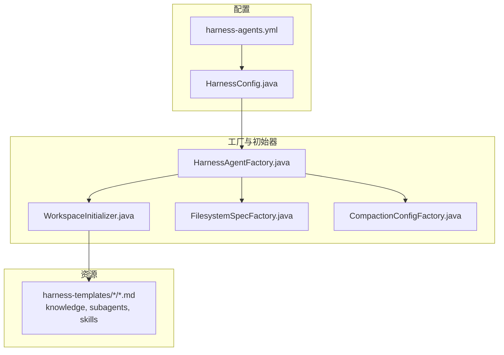
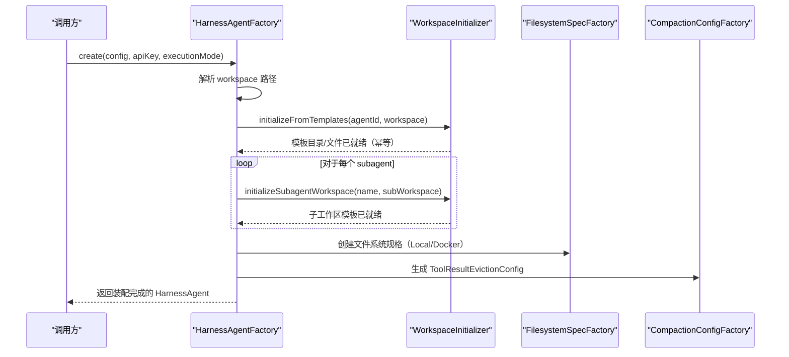
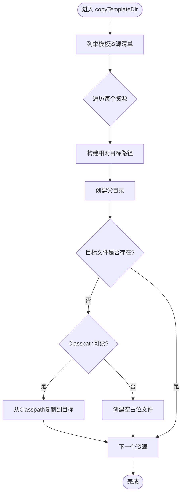
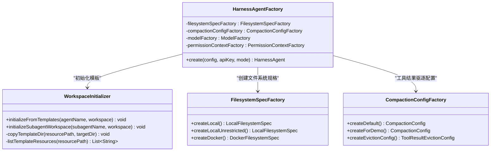
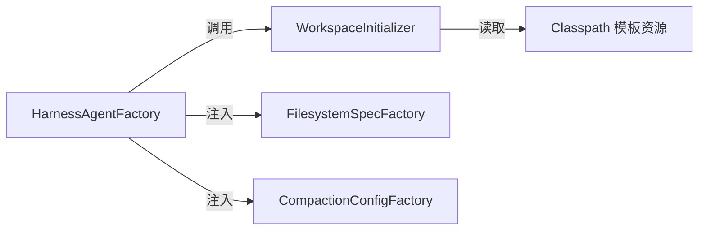

# 工作区初始化与管理

<cite>
**本文引用的文件**   
- [WorkspaceInitializer.java](file://src/main/java/com/skloda/agentscope/harness/WorkspaceInitializer.java)
- [HarnessAgentFactory.java](file://src/main/java/com/skloda/agentscope/harness/HarnessAgentFactory.java)
- [FilesystemSpecFactory.java](file://src/main/java/com/skloda/agentscope/harness/FilesystemSpecFactory.java)
- [CompactionConfigFactory.java](file://src/main/java/com/skloda/agentscope/harness/CompactionConfigFactory.java)
- [HarnessConfig.java](file://src/main/java/com/skloda/agentscope/agent/HarnessConfig.java)
- [harness-agents.yml](file://src/main/resources/config/harness-agents.yml)
- [WorkspaceInitializerTest.java](file://src/test/java/com/skloda/agentscope/harness/WorkspaceInitializerTest.java)
- [AGENTS.md (complaint-reviewer)](file://src/main/resources/harness-templates/complaint-reviewer/AGENTS.md)
- [AGENTS.md (root-cause-analyst)](file://src/main/resources/harness-templates/root-cause-analyst/AGENTS.md)
</cite>

## 目录
1. [简介](#简介)
2. [项目结构（与工作区相关）](#项目结构与工作区相关)
3. [核心组件](#核心组件)
4. [架构总览](#架构总览)
5. [详细组件分析](#详细组件分析)
6. [依赖关系分析](#依赖关系分析)
7. [性能与存储优化](#性能与存储优化)
8. [故障排除指南](#故障排除指南)
9. [扩展开发指南](#扩展开发指南)
10. [结论](#结论)

## 简介
本技术文档聚焦 AgentScope Demo 中的“工作区初始化与管理”机制，系统化说明以下要点：
- WorkspaceInitializer 的模板引擎机制、目录结构生成和文件内容处理逻辑。
- Agent 工作区、子 Agent 工作区以及 Skills 工作区的初始化流程，覆盖幂等性保证、冲突处理与错误恢复。
- 工作区生命周期管理、清理策略与存储优化方案。
- 如何扩展：自定义模板创建、工作区布局定制、环境变量注入。
- 故障排除：初始化失败、权限问题、路径冲突等常见问题的定位与解决。

该子系统服务于 Harness 模式下的多 Agent 场景，确保每个 Agent 及其子 Agent 在运行时具备一致、可预期、幂等的工作区环境。

## 项目结构（与工作区相关）
与“工作区初始化与管理”直接相关的资源与代码分布如下：
- 模板资源位于 resources/harness-templates，以 Agent ID 为根组织，包含 AGENTS.md、knowledge 目录、subagents 或 skills 等目录。
- HarnessAgentFactory 负责解析配置并创建 HarnessAgent，并在过程中调用工作区初始化。
- WorkspaceInitializer 提供基于 Classpath 资源清单的模板复制逻辑，实现幂等的目录与文件填充。
- FilesystemSpecFactory 提供本地/沙箱工作区文件系统规格，影响实际的文件读写位置与隔离范围。
- CompactionConfigFactory 提供记忆压缩和工具结果驱逐策略，间接影响工作区中持久化的内存文件大小增长。

图表来源
- [HarnessAgentFactory.java:42-66](file://src/main/java/com/skloda/agentscope/harness/HarnessAgentFactory.java#L42-L66)
- [WorkspaceInitializer.java:13-101](file://src/main/java/com/skloda/agentscope/harness/WorkspaceInitializer.java#L13-L101)
- [FilesystemSpecFactory.java:14-47](file://src/main/java/com/skloda/agentscope/harness/FilesystemSpecFactory.java#L14-L47)
- [CompactionConfigFactory.java:8-47](file://src/main/java/com/skloda/agentscope/harness/CompactionConfigFactory.java#L8-L47)
- [HarnessConfig.java:11-46](file://src/main/java/com/skloda/agentscope/agent/HarnessConfig.java#L11-L46)
- [harness-agents.yml:1-87](file://src/main/resources/config/harness-agents.yml#L1-L87)

章节来源
- [HarnessAgentFactory.java:42-66](file://src/main/java/com/skloda/agentscope/harness/HarnessAgentFactory.java#L42-L66)
- [WorkspaceInitializer.java:13-101](file://src/main/java/com/skloda/agentscope/harness/WorkspaceInitializer.java#L13-L101)
- [FilesystemSpecFactory.java:14-47](file://src/main/java/com/skloda/agentscope/harness/FilesystemSpecFactory.java#L14-L47)
- [CompactionConfigFactory.java:8-47](file://src/main/java/com/skloda/agentscope/harness/CompactionConfigFactory.java#L8-L47)
- [HarnessConfig.java:11-46](file://src/main/java/com/skloda/agentscope/agent/HarnessConfig.java#L11-L46)
- [harness-agents.yml:1-87](file://src/main/resources/config/harness-agents.yml#L1-L87)

## 核心组件
- WorkspaceInitializer：基于硬编码的模板清单，从 Classpath 的资源目录复制到目标工作区；幂等复制，缺失资源时创建空占位文件以保证目录结构完整。
- HarnessAgentFactory：装配 HarnessAgent 时，先根据 Agent 与子 Agent 的配置解析工作区路径，并逐个初始化其工作区；随后组装模型、文件系统、记忆压缩、技能仓库等能力。
- FilesystemSpecFactory：定义本地或 Docker 沙箱两种工作区文件系统的运行参数（目录、超时、内存、CPU、镜像与环境变量）。
- CompactionConfigFactory：生成记忆压缩与工具结果驱逐策略，控制持久化文件的大小与刷新频率，从而影响工作区存储空间消耗。

章节来源
- [WorkspaceInitializer.java:13-101](file://src/main/java/com/skloda/agentscope/harness/WorkspaceInitializer.java#L13-L101)
- [HarnessAgentFactory.java:42-66](file://src/main/java/com/skloda/agentscope/harness/HarnessAgentFactory.java#L42-L66)
- [FilesystemSpecFactory.java:14-47](file://src/main/java/com/skloda/agentscope/harness/FilesystemSpecFactory.java#L14-L47)
- [CompactionConfigFactory.java:8-47](file://src/main/java/com/skloda/agentscope/harness/CompactionConfigFactory.java#L8-L47)

## 架构总览
工作区初始化发生在 Harness 模式的 Agent 创建阶段，遵循如下主流程：
- 构建或解析工作区路径（支持用户配置与默认值）。
- 对主 Agent 执行模板初始化；遍历配置的子 Agent 列表，分别对其工作区进行初始化。
- 按配置挂载文件系统（本地/沙箱），设定约束与隔离策略。
- 应用压缩与工具结果驱逐配置，减少工作区中日志与临时文件规模。
- 将工作区路径注入到最终创建的 HarnessAgent 中，供后续 IO 操作使用。

图表来源
- [HarnessAgentFactory.java:42-66](file://src/main/java/com/skloda/agentscope/harness/HarnessAgentFactory.java#L42-L66)
- [WorkspaceInitializer.java:13-101](file://src/main/java/com/skloda/agentscope/harness/WorkspaceInitializer.java#L13-L101)
- [FilesystemSpecFactory.java:14-47](file://src/main/java/com/skloda/agentscope/harness/FilesystemSpecFactory.java#L14-L47)
- [CompactionConfigFactory.java:8-47](file://src/main/java/com/skloda/agentscope/harness/CompactionConfigFactory.java#L8-L47)

## 详细组件分析

### WorkspaceInitializer：模板引擎与文件处理逻辑
- 模板来源：内部维护了 templates/resourcePath 清单（如 complaint-reviewer/knowledge、subagents 等），在调用 listTemplateResources 后过滤出匹配指定前缀的资源列表。
- 复制策略：
  - 对每个模板资源，构造目标相对路径，并创建父目录（确保目录树存在）。
  - 若目标文件不存在，尝试从 Classpath 读取并拷贝；如 Classpath 无对应文件，则创建空占位文件以保持目录结构完整（延迟填充），避免初始化期间抛错。
  - 如果目标已存在，跳过写入（保持现有内容），从而实现幂等性。
- 错误恢复：
  - 缺失的模板资源不会导致失败，而是创建空文件，待后续添加 Classpath 资源后自动填充。
  - 通过日志记录复制与占位创建过程，便于定位缺失模板。

图表来源
- [WorkspaceInitializer.java:30-52](file://src/main/java/com/skloda/agentscope/harness/WorkspaceInitializer.java#L30-L52)
- [WorkspaceInitializer.java:54-102](file://src/main/java/com/skloda/agentscope/harness/WorkspaceInitializer.java#L54-L102)

章节来源
- [WorkspaceInitializer.java:13-101](file://src/main/java/com/skloda/agentscope/harness/WorkspaceInitializer.java#L13-L101)
- [WorkspaceInitializerTest.java:11-55](file://src/test/java/com/skloda/agentscope/harness/WorkspaceInitializerTest.java#L11-L55)

#### 幂等性与冲突处理
- 当工作区已存在且含已有文件（例如 AGENTS.md 已被用户编辑），初始化阶段不会覆盖原有内容，保证了用户数据不被丢失。
- 对不存在的目标文件才进行写入或创建占位，从而避免重复写入带来的不必要 I/O。

章节来源
- [WorkspaceInitializerTest.java:27-36](file://src/test/java/com/skloda/agentscope/harness/WorkspaceInitializerTest.java#L27-L36)
- [WorkspaceInitializer.java:36-48](file://src/main/java/com/skloda/agentscope/harness/WorkspaceInitializer.java#L36-L48)

#### 目录结构与文件内容
- 典型工作区包含 AGENTS.md 作为 Agent 的行为与职责说明；knowledge 存放知识文档；subagents 描述子 Agent；skills 存放可扩展的技能元信息与脚本（由 SkillRepository 驱动）。
- 模板中的示例展示了投诉复盘与根因分析的场景编排，体现工作区内容的可组合性。

章节来源
- [AGENTS.md (complaint-reviewer):1-26](file://src/main/resources/harness-templates/complaint-reviewer/AGENTS.md#L1-L26)
- [AGENTS.md (root-cause-analyst):1-5](file://src/main/resources/harness-templates/root-cause-analyst/AGENTS.md#L1-L5)

### HarnessAgentFactory：工作区装配与生命周期起点
- 工作区解析：根据 HarnessConfig 中的 workspace 字段解析工作区路径，若未显式设置则结合 AgentID 决定默认位置。
- 模板初始化：在主工作区创建完成后，迭代 subagents 配置，计算子工作区路径并调用对应的初始化方法。
- 文件系统：支持 Local 与 Docker 两种模式；Docker 模式下可通过 SandboxConfig 调整镜像、内存与 CPU 配额；Local 模式支持受限（SANDBOXED）与非受限（UNRESTRICTED）模式。
- 压缩与驱逐：通过 CompactionConfigFactory 生成工具结果驱逐策略，减少持久化体积，间接保护工作区空间。
- 其他能力：计划模式、任务清单、权限上下文、技能仓库、额外上下文文件、分层记忆等均在此处集成。

图表来源
- [HarnessAgentFactory.java:22-66](file://src/main/java/com/skloda/agentscope/harness/HarnessAgentFactory.java#L22-L66)
- [WorkspaceInitializer.java:13-101](file://src/main/java/com/skloda/agentscope/harness/WorkspaceInitializer.java#L13-L101)
- [FilesystemSpecFactory.java:14-47](file://src/main/java/com/skloda/agentscope/harness/FilesystemSpecFactory.java#L14-L47)
- [CompactionConfigFactory.java:8-47](file://src/main/java/com/skloda/agentscope/harness/CompactionConfigFactory.java#L8-L47)

章节来源
- [HarnessAgentFactory.java:22-199](file://src/main/java/com/skloda/agentscope/harness/HarnessAgentFactory.java#L22-L199)
- [HarnessConfig.java:11-46](file://src/main/java/com/skloda/agentscope/agent/HarnessConfig.java#L11-L46)

### FilesystemSpecFactory：文件系统隔离与环境变量
- 本地受限模式：适合容器内或沙箱化运行，限制执行时长、输出大小，可继承环境变量（继承宿主进程的环境）。
- 本地非受限模式：更适合调试与 Builder 模式，放开更多限制但需谨慎评估风险。
- Docker 沙箱：定义基础镜像（默认 python:3.11-slim）、工作区根目录（/workspace）、内存/CPU、环境变量（如 PYTHONUNBUFFERED=1, TZ=Asia/Shanghai）及快照策略（NoopSnapshotSpec 表示不保留快照）。

章节来源
- [FilesystemSpecFactory.java:14-47](file://src/main/java/com/skloda/agentscope/harness/FilesystemSpecFactory.java#L14-L47)
- [harness-agents.yml:11-33](file://src/main/resources/config/harness-agents.yml#L11-L33)
- [harness-agents.yml:50-87](file://src/main/resources/config/harness-agents.yml#L50-L87)

### 模板资源与 Skilss 工作区
- 模板资源位于 resources/harness-templates，按 Agent ID 组织；每个 Agent 的工作区均包含 AGENTS.md（角色与职责）、knowledge（领域知识）、skills（可复用的能力单元，内含 SKILL.md 等）和可选的 subagents。
- Skills 工作区由 SkillRepository 识别与加载（ClasspathSkillRepository 在装配阶段注册），配合工作区内的 SKILL.md 声明，可在运行时被 Agent 发现并调用。
- 子 Agent 工作区：在 HarnessAgentFactory 中针对每个 SubAgentRef 独立初始化，形成“一主多子”的多工作区结构，确保职责边界清晰。

章节来源
- [WorkspaceInitializer.java:54-101](file://src/main/java/com/skloda/agentscope/harness/WorkspaceInitializer.java#L54-L101)
- [harness-agents.yml:34-47](file://src/main/resources/config/harness-agents.yml#L34-L47)
- [harness-agents.yml:71-87](file://src/main/resources/config/harness-agents.yml#L71-L87)

## 依赖关系分析
- WorkspaceInitializer 依赖 Spring 类路径下的静态模板资源，依赖 java.nio.file 进行文件操作，依赖 SLF4J 记录行为日志。
- HarnessAgentFactory 依赖多个子组件（文件系统、压缩配置、模型工厂、权限上下文工厂）进行装配，并通过配置解耦不同执行模式。
- FilesystemSpecFactory 提供可插拔的文件系统规格，使得同一套初始化逻辑能够适配 Local/Docker 多种运行环境。
- 测试用例覆盖了初始化成功、幂等不覆盖、子工作区、缺失模板占位等关键路径。

图表来源
- [WorkspaceInitializer.java:30-52](file://src/main/java/com/skloda/agentscope/harness/WorkspaceInitializer.java#L30-L52)
- [HarnessAgentFactory.java:42-66](file://src/main/java/com/skloda/agentscope/harness/HarnessAgentFactory.java#L42-L66)
- [FilesystemSpecFactory.java:14-47](file://src/main/java/com/skloda/agentscope/harness/FilesystemSpecFactory.java#L14-L47)
- [CompactionConfigFactory.java:8-47](file://src/main/java/com/skloda/agentscope/harness/CompactionConfigFactory.java#L8-L47)

章节来源
- [WorkspaceInitializerTest.java:11-55](file://src/test/java/com/skloda/agentscope/harness/WorkspaceInitializerTest.java#L11-L55)
- [HarnessAgentFactory.java:42-66](file://src/main/java/com/skloda/agentscope/harness/HarnessAgentFactory.java#L42-L66)

## 性能与存储优化
- 幂等复制减少重复 I/O：仅对不存在的目标文件进行写入，避免覆盖已有数据引发的不必要同步。
- 占位文件策略：即使 Classpath 缺少某模板文件，也会创建空占位以确保目录树完整，避免后续路径解析异常导致的分支错误，降低冷启动时的异常开销。
- 工具结果驱逐：通过 CompactionConfigFactory 设置 maxResultChars、previewChars 等阈值，避免过大的工具执行结果常驻内存或被持久化，控制工作区磁盘占用。
- 记忆压缩与留存：可根据 HarnessConfig.MemoryConfig 配置 flush 触发器、合并间隙、会话与每日文件留存天数，平衡查询性能与存储成本。
- 文件系统模式选择：本地受限模式适合生产环境的快速隔离与最小化影响；Docker 沙箱模式适合强隔离与可复现执行，通过镜像与环境变量标准化执行生态。

章节来源
- [CompactionConfigFactory.java:41-46](file://src/main/java/com/skloda/agentscope/harness/CompactionConfigFactory.java#L41-L46)
- [HarnessConfig.java:91-106](file://src/main/java/com/skloda/agentscope/agent/HarnessConfig.java#L91-L106)
- [FilesystemSpecFactory.java:17-46](file://src/main/java/com/skloda/agentscope/harness/FilesystemSpecFactory.java#L17-L46)

## 故障排除指南
- 初始化失败/权限不足
  - 现象：无法创建工作目录或复制文件失败。
  - 排查：检查工作区根目录的写权限；确认 Java 进程拥有对 targetDir 的写入权限（尤其是 Windows 下可能被安全软件拦截）。
  - 建议：优先使用系统临时目录或用户家目录下专用路径，避免系统级敏感路径。

- 模板资源缺失
  - 现象：部分目录为空或文件为空。
  - 机制解释：若 Classpath 没有对应资源，会创建空占位文件以维持目录结构。
  - 修复：确保 harness-templates 对应路径下存在所需 .md/SKILL.md 等资源，重新打包部署。

- 路径冲突/覆盖保护
  - 现象：期望覆盖但内容未变。
  - 机制解释：初始化阶段不会覆盖已存在的文件，属于设计上的幂等策略。
  - 处理：如需强制覆盖，请先清理旧工作区再初始化；或通过外部脚本替换模板文件。

- Docker 沙箱环境问题
  - 现象：容器内执行超时、输出过大、缺少命令或变量。
  - 排查：核对镜像名是否可用、环境变量是否正确传入（如 PYTHONUNBUFFERED、TZ）、执行超时与最大输出字节限制是否合理。
  - 建议：适当增大 executeTimeoutSeconds、maxOutputBytes，或在 SandboxConfig 中调优 memorySizeBytes 与 cpuCount。

- 记忆膨胀导致工作区增大
  - 现象：memory/daily、MEMORY.md 等文件持续增长。
  - 排查：关注 MemoryConfig.flushTrigger、consolidationMinGapSeconds、sessionRetentionDays、dailyFileRetentionDays 等参数的合理性。
  - 优化：调整为节流刷盘或定期归档，避免频繁落盘；必要时增加清理周期与上限策略。

- Agent 未初始化工作区导致运行期错误
  - 现象：子 Agent 找不到其工作区或必要指令。
  - 排查：确认 HarnessConfig.subagents 列表是否完整，HAF 是否正确遍历并调用 initializeSubagentWorkspace。
  - 修复：补充缺失的 subagents 条目，确保每个子 Agent 在工作区层面都有模板支撑。

章节来源
- [WorkspaceInitializerTest.java:17-55](file://src/test/java/com/skloda/agentscope/harness/WorkspaceInitializerTest.java#L17-L55)
- [FilesystemSpecFactory.java:17-46](file://src/main/java/com/skloda/agentscope/harness/FilesystemSpecFactory.java#L17-L46)
- [HarnessConfig.java:91-106](file://src/main/java/com/skloda/agentscope/agent/HarnessConfig.java#L91-L106)

## 扩展开发指南
- 创建自定义模板
  - 在 resources/harness-templates/<your-agent-id> 下放置 AGENTS.md、knowledge/*.md 与必要的 skills 或 subagents。
  - 如在 WorkspaceInitializer.listTemplateResources 中尚未包含新模板路径，可考虑按需扩展清单（或将其纳入新的模板前缀过滤规则）。
  - 更新 harness-agents.yml 中对应 agentId 的 harnessConfig.workspace 指向目标路径。

- 定制化工作区布局
  - 通过调整 FilesystemSpecFactory 的参数（mode、project、executeTimeoutSeconds、maxOutputBytes）与 Docker 镜像环境（image、environment、workspaceRoot、snapshotSpec）实现不同的存储与运行语义。
  - 对 Builder 模式可采用本地非受限模式，便于调试；生产建议使用受限模式或 Docker 沙箱。

- 环境变量注入
  - Docker 模式下：通过 FilesystemSpecFactory.createDocker 的 environment 键值对注入运行环境变量（如语言、时区、缓存开关）。
  - 本地模式：可通过 inheritEnv(true) 继承宿主机环境变量，或在前置中间件/钩子上统一注入业务需要的变量。

- 生命周期与清理策略
  - 利用 MemoryConfig 的控制项（flush 触发器、合并间隔、会话/每日文件保留天数）自动压缩与归档记忆文件，避免无限增长。
  - 借助 ToolResultEvictionConfig 限制工具结果的大小与预览长度，减少工作区占用。
  - 若需要定时清理，建议在应用层增加 Job（例如按月清理 history/memory/history_YYYYMM 等），或在运维侧对 /tmp 目录做统一治理。

- 工作区隔离策略
  - isolationScope 为 USER 时建议在不同用户目录下区分 workspace；在多租户场景中可结合租户ID拼接路径，避免跨租户污染。
  - Docker 沙箱通过镜像与卷挂载进一步隔离执行环境与数据。

章节来源
- [harness-agents.yml:11-33](file://src/main/resources/config/harness-agents.yml#L11-L33)
- [harness-agents.yml:50-87](file://src/main/resources/config/harness-agents.yml#L50-L87)
- [FilesystemSpecFactory.java:17-46](file://src/main/java/com/skloda/agentscope/harness/FilesystemSpecFactory.java#L17-L46)
- [HarnessConfig.java:91-106](file://src/main/java/com/skloda/agentscope/agent/HarnessConfig.java#L91-L106)

## 结论
工作区初始化与管理工作区是 Harness Agent 体系的基础设施，承担着“模板驱动、幂等装配、可控隔离、存储优化”的职责。通过 WorkspaceInitializer 与 HarnessAgentFactory 的协同，实现了：
- 稳定且幂等的工作区搭建：不因重复初始化而破坏用户数据。
- 灵活的运行环境：支持本地/沙箱切换，适应开发与生产的不同需求。
- 可观测与可持续的存储：通过压缩、驱逐与留存策略，平衡运行质量与磁盘压力。

在实际项目中，建议按照“明确模板边界、规范环境变量、细化留存策略”的原则开展工作区治理，从而保障长周期的稳定性与可维护性。