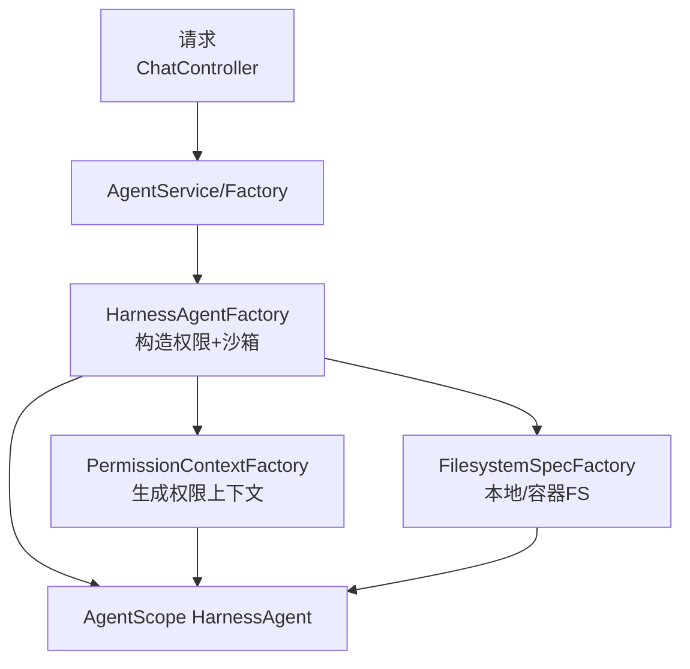
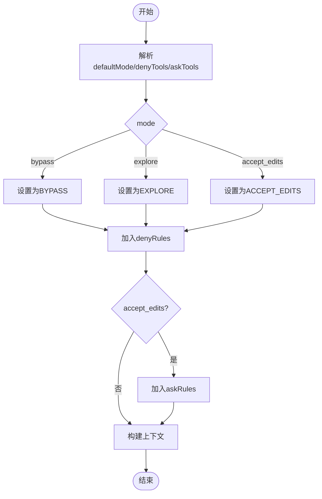
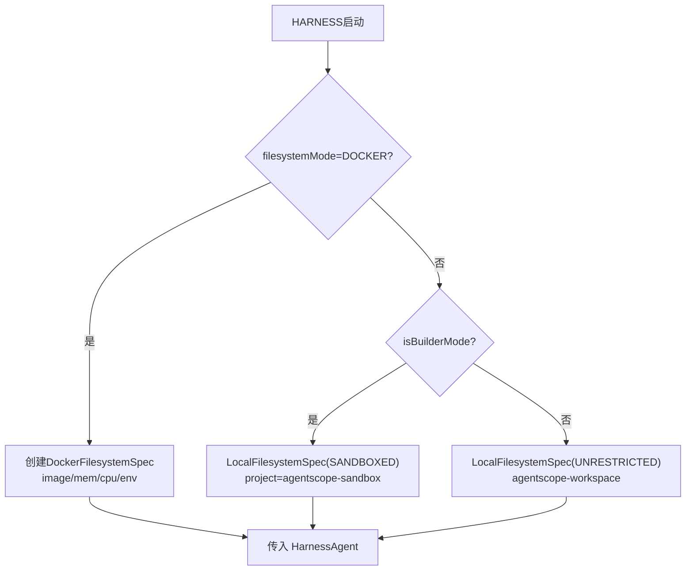
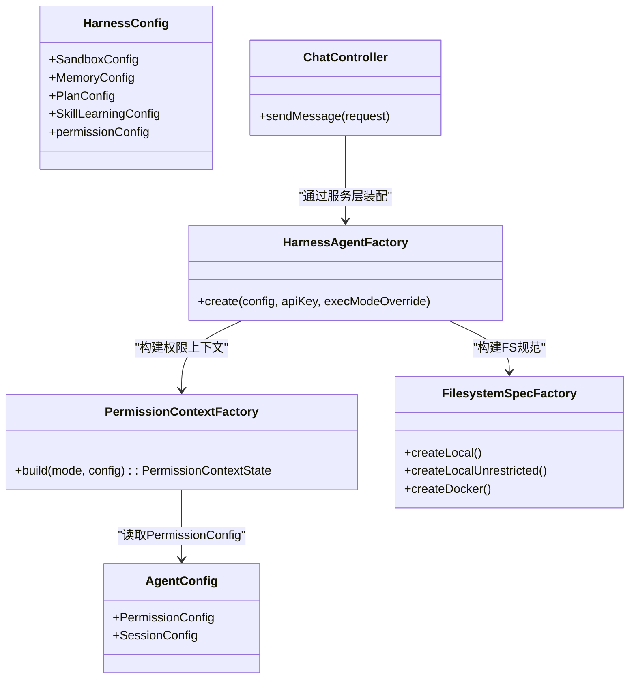

# 权限与安全控制

<cite>
**本文引用的文件**
- [PermissionContextFactory.java](file://src/main/java/com/skloda/agentscope/permission/PermissionContextFactory.java)
- [AgentConfig.java](file://src/main/java/com/skloda/agentscope/agent/AgentConfig.java)
- [HarnessConfig.java](file://src/main/java/com/skloda/agentscope/agent/HarnessConfig.java)
- [HarnessAgentFactory.java](file://src/main/java/com/skloda/agentscope/harness/HarnessAgentFactory.java)
- [FilesystemSpecFactory.java](file://src/main/java/com/skloda/agentscope/harness/FilesystemSpecFactory.java)
- [ChatController.java](file://src/main/java/com/skloda/agentscope/controller/ChatController.java)
- [PermissionContextFactoryTest.java](file://src/test/java/com/skloda/agentscope/permission/PermissionContextFactoryTest.java)
- [agents.yml](file://src/main/resources/config/agents.yml)
- [harness-agents.yml](file://src/main/resources/config/harness-agents.yml)
</cite>

## 目录
1. [简介](#简介)
2. [项目结构与安全相关位置](#项目结构与安全相关位置)
3. [核心组件总览](#核心组件总览)
4. [架构总览](#架构总览)
5. [详细组件分析](#详细组件分析)
6. [依赖关系与调用链分析](#依赖关系与调用链分析)
7. [性能与可扩展性考虑](#性能与可扩展性考虑)
8. [常见问题排查](#常见问题排查)
9. [结论与安全最佳实践](#结论与安全最佳实践)
10. [附录：安全策略清单](#附录：安全策略清单)

## 简介
本章节面向 AgentScope 演示应用的“权限与安全控制”主题，聚焦以下目标：
- PermissionContextState 的权限模型设计与访问控制流程：模式（bypass/explore/accept_edits）、规则（denyRules/askRules）如何生效。
- 文件系统与沙箱隔离：LocalFilesystemSpec、DockerFilesystemSpec、执行超时与输出限制等边界。
- 网络访问控制与工具调用权限：工具白名单/黑名单、Ask 交互机制、审批流集成。
- SandboxConfig 的安全边界：镜像、内存、CPU 等资源限额配置与覆盖方式。
- 用户身份传播、会话隔离与审计日志建议。
- 威胁防护策略：路径遍历、权限提升、资源滥用等的检测与防御手段。

## 项目结构与安全相关位置
与权限和安全相关的源码主要分布在如下包与文件：
- 权限上下文工厂：com.skloda.agentscope.permission.PermissionContextFactory
- 代理配置与权限配置：com.skloda.agentscope.agent.AgentConfig, HarnessConfig
- Harness 构建器与沙箱/文件系统：com.skloda.agentscope.harness.HarnessAgentFactory, FilesystemSpecFactory
- 入口控制器与会话/权限参数透传：com.skloda.agentscope.controller.ChatController
- 配置样例与 Agent YAML：src/main/resources/config/agents.yml, harness-agents.yml
- 单元测试：src/test/java/com/skloda/agentscope/permission/PermissionContextFactoryTest.java



**图表来源**
- [ChatController.java:122-152](file://src/main/java/com/skloda/agentscope/controller/ChatController.java#L122-L152)
- [HarnessAgentFactory.java:42-190](file://src/main/java/com/skloda/agentscope/harness/HarnessAgentFactory.java#L42-L190)
- [PermissionContextFactory.java:10-39](file://src/main/java/com/skloda/agentscope/permission/PermissionContextFactory.java#L10-L39)
- [FilesystemSpecFactory.java:17-46](file://src/main/java/com/skloda/agentscope/harness/FilesystemSpecFactory.java#L17-L46)

**章节来源**
- [ChatController.java:122-152](file://src/main/java/com/skloda/agentscope/controller/ChatController.java#L122-L152)
- [HarnessAgentFactory.java:42-190](file://src/main/java/com/skloda/agentscope/harness/HarnessAgentFactory.java#L42-L190)
- [PermissionContextFactory.java:10-39](file://src/main/java/com/skloda/agentscope/permission/PermissionContextFactory.java#L10-L39)
- [FilesystemSpecFactory.java:17-46](file://src/main/java/com/skloda/agentscope/harness/FilesystemSpecFactory.java#L17-L46)

## 核心组件总览
- 权限上下文（PermissionContextState）
  - 由 PermissionContextFactory 根据模式与配置构建；支持 deny 规则和 ask 规则，并绑定不同权限模式（bypass/explore/accept_edits）。
- 权限配置（AgentConfig.PermissionConfig / HarnessConfig）
  - 提供默认模式、denyTools、askTools，以及 sandbox 资源限制等。
- 沙箱与文件系统
  - LocalFilesystemSpec：受控模式 SANDBOXED 或无限制 UNRESTRICTED，可配置项目目录、执行超时、最大输出字节。
  - DockerFilesystemSpec：基于容器的受限执行环境，可设置镜像、内存、CPU、环境变量、快照策略。
- 控制器与运行时装配
  - ChatController 接收 userId/sessionId/permissionMode，并通过 AgentService -> HarnessAgentFactory 将权限上下文注入到实际执行的 HarnessAgent。
  - HarnessAgentFactory 负责组装文件系统、权限上下文、计划/任务/内存等功能。

**章节来源**
- [PermissionContextFactory.java:10-39](file://src/main/java/com/skloda/agentscope/permission/PermissionContextFactory.java#L10-L39)
- [AgentConfig.java:100-106](file://src/main/java/com/skloda/agentscope/agent/AgentConfig.java#L100-L106)
- [HarnessConfig.java:11-24](file://src/main/java/com/skloda/agentscope/agent/HarnessConfig.java#L11-L24)
- [HarnessAgentFactory.java:183-189](file://src/main/java/com/skloda/agentscope/harness/HarnessAgentFactory.java#L183-L189)

## 架构总览
权限与安全的关键调用时序如下：

```mermaid
sequenceDiagram
    participant C as "客户端"
    participant Ctrl as "ChatController"
    participantSvc as "AgentService/Factory"
    participant HF as "HarnessAgentFactory"
    participant PCF as "PermissionContextFactory"
    participant FS as "FilesystemSpecFactory"
    participant HA as "HarnessAgent(运行)"

    C->>Ctrl: POST /chat/send<br/>携带userId/sessionId/permissionMode
    Ctrl->>Svc: createStreamFlux(...)
    Svc->>HF: 创建/获取 HarnessAgent
    HF->>PCF: build(mode, permissionConfig)
    HF->>FS: createLocal/createDocker()
    HF->>HA: 装配 workspace/filesystem/permission
    HA-->>Ctrl: 事件流(SSE)
    Ctrl-->>C: 消息/审批/完成事件
```

**图表来源**
- [ChatController.java:122-152](file://src/main/java/com/skloda/agentscope/controller/ChatController.java#L122-L152)
- [HarnessAgentFactory.java:42-190](file://src/main/java/com/skloda/agentscope/harness/HarnessAgentFactory.java#L42-L190)
- [PermissionContextFactory.java:10-39](file://src/main/java/com/skloda/agentscope/permission/PermissionContextFactory.java#L10-L39)
- [FilesystemSpecFactory.java:17-46](file://src/main/java/com/skloda/agentscope/harness/FilesystemSpecFactory.java#L17-L46)

## 详细组件分析

### 1) 权限模型设计：PermissionContextState
- 模式说明
  - bypass：默认放行（可配合 deny 规则进行最小拦截）。
  - explore：探索模式，便于审阅但不自动修改。
  - accept_edits：允许编辑但按 ask 规则触发确认（适合生产环境的可控操作）。
- 规则类型
  - denyRules：对指定工具强制拒绝（与模式无关，始终生效）。
  - askRules：对指定工具发起交互审批（仅在 accept_edits 模式下应用）。
- 构建流程
  - 从 AgentConfig.PermissionConfig 读取 defaultMode、denyTools、askTools；按条件装配规则与模式。



**图表来源**
- [PermissionContextFactory.java:10-39](file://src/main/java/com/skloda/agentscope/permission/PermissionContextFactory.java#L10-L39)
- [AgentConfig.java:100-106](file://src/main/java/com/skloda/agentscope/agent/AgentConfig.java#L100-L106)

**章节来源**
- [PermissionContextFactory.java:10-39](file://src/main/java/com/skloda/agentscope/permission/PermissionContextFactory.java#L10-L39)
- [PermissionContextFactoryTest.java:16-57](file://src/test/java/com/skloda/agentscope/permission/PermissionContextFactoryTest.java#L16-L57)

### 2) 访问控制列表与权限继承
- ACL 即“规则表”：denyTools 和 askTools 构成当前 agent 的工具级白/黑名单。
- 权限继承
  - Agent 实例通过 HarnessAgentFactory 把 PermissionContextState 注入到具体运行的 HarnessAgent，因此后续所有工具调用都受该上下文控制。
  - 若多个 agent 共享同一份配置（如 agents.yml），应确保每个 agentId 的 PermissionConfig 明确定义 deny/ask 集合，避免跨 agent 误继承。

**章节来源**
- [HarnessAgentFactory.java:183-189](file://src/main/java/com/skloda/agentscope/harness/HarnessAgentFactory.java#L183-L189)
- [AgentConfig.java:94-106](file://src/main/java/com/skloda/agentscope/agent/AgentConfig.java#L94-L106)

### 3) 文件系统权限与资源隔离
- 本地受限模式（SANDBOXED）
  - 项目目录限定在 tmpdir/agentscope-sandbox，防止越界访问宿主机目录。
  - 执行超时默认 120s，最大输出限制 10MB，抑制长轮询或超大响应泄露。
- 本地无限制模式（UNRESTRICTED）
  - 用于开发调试场景，不建议线上启用。
- 容器化沙箱（DockerFilesystemSpec）
  - 使用固定基础镜像（例如 python:3.11-slim），工作空间在容器内统一挂载至 /workspace。
  - 资源配额：memorySizeBytes、cpuCount，并可扩展环境变量与快照策略。
  - 通过 HarnessConfig.SandboxConfig 可对镜像、内存、CPU 进行覆盖，便于按需调优。



**图表来源**
- [FilesystemSpecFactory.java:17-46](file://src/main/java/com/skloda/agentscope/harness/FilesystemSpecFactory.java#L17-L46)
- [HarnessAgentFactory.java:81-103](file://src/main/java/com/skloda/agentscope/harness/HarnessAgentFactory.java#L81-L103)
- [HarnessConfig.java:63-69](file://src/main/java/com/skloda/agentscope/agent/HarnessConfig.java#L63-L69)

**章节来源**
- [FilesystemSpecFactory.java:17-46](file://src/main/java/com/skloda/agentscope/harness/FilesystemSpecFactory.java#L17-L46)
- [HarnessConfig.java:63-69](file://src/main/java/com/skloda/agentscope/agent/HarnessConfig.java#L63-L69)
- [HarnessAgentFactory.java:81-103](file://src/main/java/com/skloda/agentscope/harness/HarnessAgentFactory.java#L81-L103)

### 4) 网络访问控制与工具调用权限
- 工具调用权限
  - denyTools：在任何模式下都会拒绝对应工具的调用。
  - askTools：在 accept_edits 模式下触发审批（人机协同），用于高敏感工具。
- 与审批流的集成
  - ChatController 暴露 /chat/approve 端点，供中间件或业务在 RequireUserConfirmEvent 发生时协调用户决策，实现“需确认”的操作闭环。
- 网络访问基线
  - 当前仓库未内置显式的网络域名/端口白名单；若涉及出站 HTTP，建议在工具层或网络库层面增加域名白名单与证书校验。

**章节来源**
- [PermissionContextFactory.java:10-39](file://src/main/java/com/skloda/agentscope/permission/PermissionContextFactory.java#L10-L39)
- [ChatController.java:155-186](file://src/main/java/com/skloda/agentscope/controller/ChatController.java#L155-L186)
- [PermissionContextFactoryTest.java:16-57](file://src/test/java/com/skloda/agentscope/permission/PermissionContextFactoryTest.java#L16-L57)

### 5) 用户身份验证与会话隔离
- 请求入参与传播
  - ChatController.receive 的参数包含 userId、sessionId，并在创建流式执行时透传。
- 隔离语义
  - 结合 AgentStateStore（进程内存或持久化后端）与 RuntimeContext，可实现以 (userId, sessionId) 为键的会话隔离。
- 鉴权建议
  - 当前代码侧重“运行时隔离”，外部网关/反向代理应负责真实身份认证与令牌校验，再下发可信的 userId 至本系统。

**章节来源**
- [ChatController.java:122-152](file://src/main/java/com/skloda/agentscope/controller/ChatController.java#L122-L152)

### 6) 审批流与最小权限
- 审批能力
  - 当配置 askTools 或使用系统级的 approvalTools（如银行发票生成），可通过中间件暂停并要求用户审批后恢复执行。
- 最小权限原则落地
  - 使用 denyTools 禁用高危工具；使用 askTools 仅对必要工具开启交互审批；尽量降低默认模式到 explore/accept_edits，减少自动写能力。

**章节来源**
- [AgentConfig.java:48-53](file://src/main/java/com/skloda/agentscope/agent/AgentConfig.java#L48-L53)
- [ChatController.java:155-186](file://src/main/java/com/skloda/agentscope/controller/ChatController.java#L155-L186)

### 7) SandboxConfig 安全边界配置
- 字段与作用
  - image：约束容器镜像源与版本，锁定已知安全的运行基座。
  - memorySizeBytes、cpuCount：限制进程可用内存与 CPU，抵御资源耗尽攻击。
- 覆盖策略
  - HarnessAgentFactory 会从 HarnessConfig.SandboxConfig 读取并覆盖默认值，使不同 agent 可按风险等级差异化配置。

**章节来源**
- [HarnessConfig.java:63-69](file://src/main/java/com/skloda/agentscope/agent/HarnessConfig.java#L63-L69)
- [HarnessAgentFactory.java:81-103](file://src/main/java/com/skloda/agentscope/harness/HarnessAgentFactory.java#L81-L103)

## 依赖关系与调用链分析



**图表来源**
- [PermissionContextFactory.java:10-39](file://src/main/java/com/skloda/agentscope/permission/PermissionContextFactory.java#L10-L39)
- [AgentConfig.java:94-106](file://src/main/java/com/skloda/agentscope/agent/AgentConfig.java#L94-L106)
- [HarnessConfig.java:11-24](file://src/main/java/com/skloda/agentscope/agent/HarnessConfig.java#L11-L24)
- [HarnessAgentFactory.java:42-190](file://src/main/java/com/skloda/agentscope/harness/HarnessAgentFactory.java#L42-L190)
- [FilesystemSpecFactory.java:17-46](file://src/main/java/com/skloda/agentscope/harness/FilesystemSpecFactory.java#L17-L46)
- [ChatController.java:122-152](file://src/main/java/com/skloda/agentscope/controller/ChatController.java#L122-L152)

**章节来源**
- [HarnessAgentFactory.java:42-190](file://src/main/java/com/skloda/agentscope/harness/HarnessAgentFactory.java#L42-L190)
- [PermissionContextFactory.java:10-39](file://src/main/java/com/skloda/agentscope/permission/PermissionContextFactory.java#L10-L39)

## 性能与可扩展性考虑
- 小步快审：在 accept_edits 下对关键工具启用 ask，可降低批量恶意操作的损失面。
- 沙箱资源上限：合理设置内存/CPU 上限与执行超时，避免资源滥用影响其他任务。
- 规则维护：定期审查 denyTools/askTools，保持最小权限集；按环境（开发/预发/生产）差异化配置。
- 观测与审计：对 ask/deny/审批事件补充集中日志/指标上报，形成可追踪的安全基线。

[本节为通用指导，不直接引用具体代码]

## 常见问题排查
- 现象：某些工具被意外拒绝
  - 检查 PermissionConfig.defaultMode 与实际请求的 permissionMode 是否一致。
  - 确认 denyTools 是否命中；必要时将工具名从黑名单移除并转为 ask。
  - 参考测试用例验证规则装配是否符合预期。
- 现象：沙箱内文件无法写入或 IO 很慢
  - 核对 LocalFsMode 是否为 SANDBOXED；确认 project 目录是否在允许的 tmpdir 子目录。
  - 增大 executeTimeoutSeconds 或 maxOutputBytes 视实际负载调优。
- 现象：容器沙箱资源不足
  - 通过 SandboxConfig 提高 memorySizeBytes/cpuCount；选择更合适的镜像。
- 现象：审批无法恢复
  - 确认前端正确提交 /chat/approve，且审批中心已释放 PendingApproval；关注中间件是否正确挂起/恢复。

**章节来源**
- [PermissionContextFactoryTest.java:16-57](file://src/test/java/com/skloda/agentscope/permission/PermissionContextFactoryTest.java#L16-L57)
- [FilesystemSpecFactory.java:17-46](file://src/main/java/com/skloda/agentscope/harness/FilesystemSpecFactory.java#L17-L46)
- [HarnessAgentFactory.java:81-103](file://src/main/java/com/skloda/agentscope/harness/HarnessAgentFactory.java#L81-L103)
- [ChatController.java:155-186](file://src/main/java/com/skloda/agentscope/controller/ChatController.java#L155-L186)

## 结论与安全最佳实践
- 采用默认拒绝的 denyRules 加可选的 askRules，实现最小权限。
- 线上默认关闭“完全写权限”，优先使用 explore/accept_edits。
- 通过 SandboxConfig 限定运行基线与资源上限，容器镜像统一溯源与加固。
- 使用独立的 session isolation（sessionId）与用户标识（userId）确保多租户安全。
- 将网络访问纳入工具层白名单管理，并在网关侧完成强身份认证与鉴权。
- 建立完善的审计日志与监控告警，覆盖批准、拒绝、超时时长的异常行为。

[本节总结性内容，不直接引用具体代码]

## 附录：安全策略清单
- 身份与接入
  - 网关层鉴权：OAuth2/JWT 等，下发可信 userId。
  - 通道鉴权：API Key、IP 白名单、速率限制。
- 权限与访问控制
  - 启用 denyRules 禁高风险工具；用 askRules 管控敏感变更。
  - 禁止在无审批状态下执行破坏性操作（删除/覆写/网络外发等）。
- 文件系统与沙箱
  - 优先使用 SANDBOXED；容器镜像版本固定、漏洞扫描。
  - 限制执行超时、最大输出字节、内存/CPU 上限。
  - 严格限制路径范围，拒绝路径穿越；对外部输入做白名单校验与规范化。
- 网络与工具
  - 工具层实现出站 URL 白名单、证书校验与超时控制。
  - 限制并发连接数与重试次数，防止资源滥用。
- 审计与合规
  - 记录审批结果、拒绝原因、耗时与资源用量。
  - 定期审计报告与异常趋势；对高频失败/拒绝进行告警。
- 密钥与配置
  - API Key 仅通过安全渠道注入，禁止硬编码；启用最小可见范围。
  - 配置分环境管理与发布审批；敏感信息加密存储。

[本节为通用清单，不直接引用具体代码]