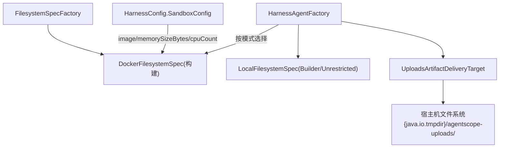
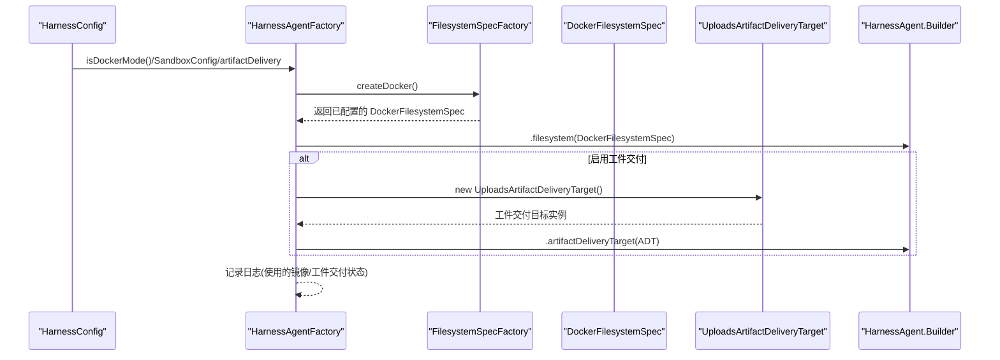
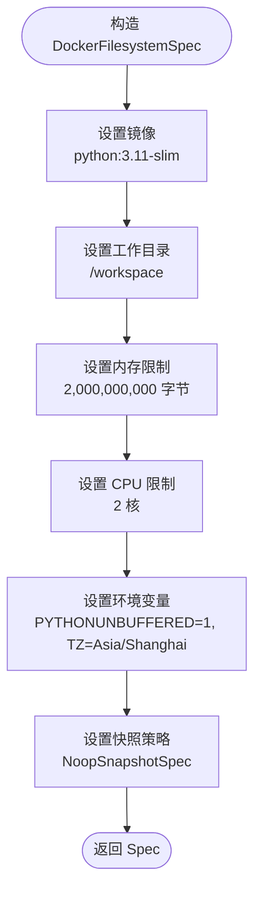
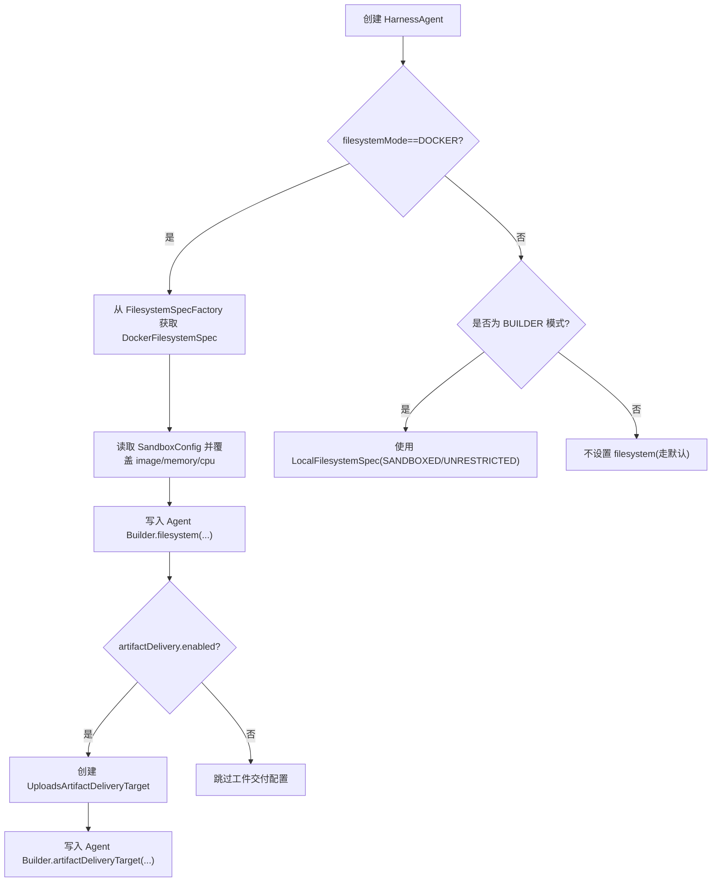
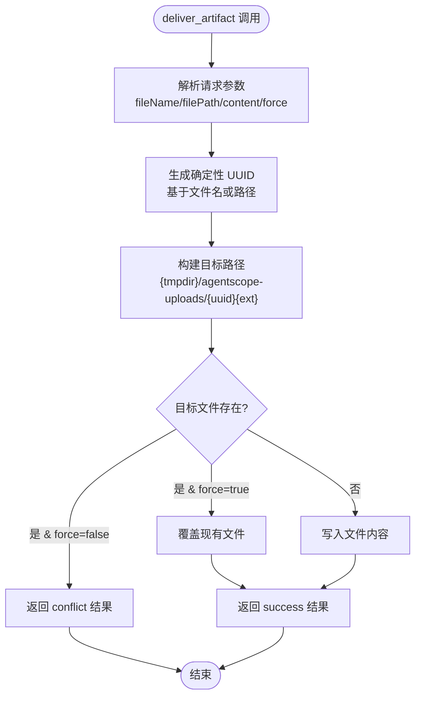
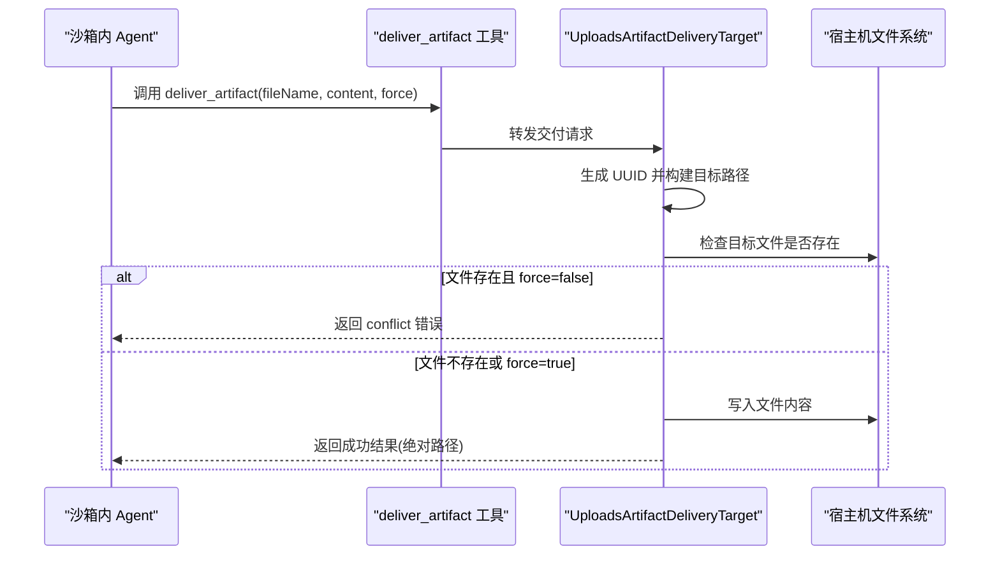

# Docker 沙箱模式

<cite>
**本文引用的文件**   
- [FilesystemSpecFactory.java](file://src/main/java/com/skloda/agentscope/harness/FilesystemSpecFactory.java)
- [HarnessAgentFactory.java](file://src/main/java/com/skloda/agentscope/harness/HarnessAgentFactory.java)
- [UploadsArtifactDeliveryTarget.java](file://src/main/java/com/skloda/agentscope/harness/UploadsArtifactDeliveryTarget.java)
- [HarnessConfig.java](file://src/main/java/com/skloda/agentscope/agent/HarnessConfig.java)
- [harness-agents.yml](file://src/main/resources/config/harness-agents.yml)
- [HarnessAgentFactoryModeTest.java](file://src/test/java/com/skloda/agentscope/harness/HarnessAgentFactoryModeTest.java)
</cite>

## 更新摘要
**所做更改**   
- 新增工件交付系统章节，详细说明 UploadsArtifactDeliveryTarget 实现
- 更新 HarnessAgentFactory 以集成新的工件交付功能
- 添加 artifactDelivery.enabled 配置选项说明
- 扩展故障排查指南以包含工件交付相关问题
- 更新安全最佳实践以涵盖工件交付的安全考虑

## 目录
1. [引言](#引言)
2. [项目结构（与沙箱相关）](#项目结构与沙箱相关)
3. [核心组件](#核心组件)
4. [架构总览](#架构总览)
5. [关键组件详解](#关键组件详解)
6. [工件交付系统](#工件交付系统)
7. [依赖关系分析](#依赖关系分析)
8. [性能考量](#性能考量)
9. [故障排查指南](#故障排查指南)
10. [安全最佳实践](#安全最佳实践)
11. [结论](#结论)
12. [附录：配置速查](#附录：配置速查)

## 引言
本技术文档聚焦项目的 Docker 沙箱模式，围绕以下目标展开：
- 深入解释 DockerFilesystemSpec 的实现原理与配置项：镜像、工作目录、内存/CPU 限制、环境变量、快照等。
- 说明 DockerSandboxClient 在容器生命周期管理中的角色与隔离边界。
- **新增**：详细解析工件交付系统（Artifact Delivery System），包括 UploadsArtifactDeliveryTarget 的实现原理和 deliver_artifact SPI 的使用。
- 解析环境变量 PYTHONUNBUFFERED、TZ 的作用及影响。
- 提供常见故障定位与排错流程（启动失败、镜像拉取超时、资源超限、工件交付失败）。
- 给出性能调优建议与安全最佳实践（最小权限、只读文件系统、网络访问控制、工件交付安全）。

注意：本项目通过在工厂类中构造并配置 DockerFilesystemSpec 来启用沙箱能力，实际容器运行时由底层 DockerSandboxClient 驱动，当前仓库未包含客户端源码，因此下文对客户端能力的描述均基于使用侧的配置和调用链路推断。

## 项目结构（与沙箱相关）
- 工厂层：通过 FilesystemSpecFactory 提供本地与 Docker 两种文件系统规范。
- 装配层：HarnessAgentFactory 根据执行模式动态选择文件系统实现，支持通过配置覆盖镜像与资源限制。
- **新增**：工件交付层：UploadsArtifactDeliveryTarget 实现 ArtifactDeliveryTarget SPI，提供沙箱产物到宿主机的安全传输。
- 配置层：HarnessConfig 定义默认镜像、内存、CPU 等沙箱参数，支持按 Agent 维度覆盖，包括工件交付开关。



图示来源
- [FilesystemSpecFactory.java:34-46](file://src/main/java/com/skloda/agentscope/harness/FilesystemSpecFactory.java#L34-L46)
- [HarnessAgentFactory.java:81-114](file://src/main/java/com/skloda/agentscope/harness/HarnessAgentFactory.java#L81-L114)
- [UploadsArtifactDeliveryTarget.java:35-64](file://src/main/java/com/skloda/agentscope/harness/UploadsArtifactDeliveryTarget.java#L35-L64)
- [HarnessConfig.java:63-69](file://src/main/java/com/skloda/agentscope/agent/HarnessConfig.java#L63-L69)

章节来源
- [FilesystemSpecFactory.java:17-46](file://src/main/java/com/skloda/agentscope/harness/FilesystemSpecFactory.java#L17-L46)
- [HarnessAgentFactory.java:42-114](file://src/main/java/com/skloda/agentscope/harness/HarnessAgentFactory.java#L42-L114)
- [HarnessConfig.java:40-46](file://src/main/java/com/skloda/agentscope/agent/HarnessConfig.java#L40-L46)

## 核心组件
- FilesystemSpecFactory：集中创建不同模式的文件系统规范。Docker 模式下返回带环境、资源限制、工作目录的 DockerFilesystemSpec；同时提供本地 sandboxed/unrestricted 模式便于对比与开发调试。
- HarnessAgentFactory：装配 HarnessAgent，根据配置与运行模式选择文件系统。**新增**：当启用工件交付时，自动挂载 UploadsArtifactDeliveryTarget 以支持 deliver_artifact 工具。
- **新增**：UploadsArtifactDeliveryTarget：实现 ArtifactDeliveryTarget SPI，负责将沙箱内生成的文件安全传输到宿主机的 {java.io.tmpdir}/agentscope-uploads/ 目录。
- HarnessConfig.SandboxConfig：定义默认镜像名、内存字节数、CPU 核数，作为"基准参数"可被上层覆盖。
- **新增**：HarnessConfig.ArtifactDeliveryConfig：控制工件交付功能的开关。

章节来源
- [FilesystemSpecFactory.java:34-46](file://src/main/java/com/skloda/agentscope/harness/FilesystemSpecFactory.java#L34-L46)
- [HarnessAgentFactory.java:81-114](file://src/main/java/com/skloda/agentscope/harness/HarnessAgentFactory.java#L81-L114)
- [UploadsArtifactDeliveryTarget.java:35-102](file://src/main/java/com/skloda/agentscope/harness/UploadsArtifactDeliveryTarget.java#L35-L102)
- [HarnessConfig.java:63-69](file://src/main/java/com/skloda/agentscope/agent/HarnessConfig.java#L63-L69)
- [HarnessConfig.java:146-152](file://src/main/java/com/skloda/agentscope/agent/HarnessConfig.java#L146-L152)

## 架构总览
下面的时序图展示了从 Agent 构建到沙箱启用的完整路径，**新增**了工件交付的生命周期：应用侧通过配置文件生成 HarnessConfig，工厂判断执行/文件系统模式，然后创建 DockerFilesystemSpec，**新增**可选的 UploadsArtifactDeliveryTarget，最后将其装配到 Agent。



图示来源
- [HarnessAgentFactory.java:42-114](file://src/main/java/com/skloda/agentscope/harness/HarnessAgentFactory.java#L42-L114)
- [FilesystemSpecFactory.java:34-46](file://src/main/java/com/skloda/agentscope/harness/FilesystemSpecFactory.java#L34-L46)
- [UploadsArtifactDeliveryTarget.java:35-64](file://src/main/java/com/skloda/agentscope/harness/UploadsArtifactDeliveryTarget.java#L35-L64)

## 关键组件详解

### FilesystemSpecFactory 与 DockerFilesystemSpec
- 镜像：默认 python:3.11-slim。用于运行 Python 工作负载的最小化镜像，降低攻击面与体积。
- 工作目录：/workspace。将 Agent 工作区映射至该目录，确保进程以受控路径访问文件。
- 资源限制：memorySizeBytes=2GB，cpuCount=2。约束容器运行时的最大可用资源，避免宿主过载。
- 环境变量：PYTHONUNBUFFERED=1、TZ=Asia/Shanghai。前者禁用 Python 输出缓冲，后者统一时区。
- 快照：NoopSnapshotSpec。当前未启用持久快照能力，可通过替换为其他实现开启。



图示来源
- [FilesystemSpecFactory.java:34-46](file://src/main/java/com/skloda/agentscope/harness/FilesystemSpecFactory.java#L34-L46)

章节来源
- [FilesystemSpecFactory.java:34-46](file://src/main/java/com/skloda/agentscope/harness/FilesystemSpecFactory.java#L34-L46)

### HarnessAgentFactory：容器生命周期与模式切换
- 工作空间初始化：无论模式如何，先确保 Agent 的工作区存在并可写，且子 agent 工作区也会被初始化。
- 模式判断：若配置文件或传入参数指定 filesystemMode=DOCKER，则采用 DockerFilesystemSpec；否则可能回到 BUILDER 模式下的 LocalFilesystemSpec。
- 覆盖策略：SandboxConfig 中的 image、memorySizeBytes、cpuCount 会逐项覆盖默认值，从而实现"基线 + 场景化覆盖"。
- **新增**：工件交付集成：当 artifactDelivery.enabled=true 时，自动挂载 UploadsArtifactDeliveryTarget，使 harness 注册 deliver_artifact 工具。
- 日志与可观测性：记录最终使用的镜像名称和工件交付状态，便于运行期观察和告警。



图示来源
- [HarnessAgentFactory.java:42-114](file://src/main/java/com/skloda/agentscope/harness/HarnessAgentFactory.java#L42-L114)

章节来源
- [HarnessAgentFactory.java:42-114](file://src/main/java/com/skloda/agentscope/harness/HarnessAgentFactory.java#L42-L114)
- [HarnessConfig.java:40-46](file://src/main/java/com/skloda/agentscope/agent/HarnessConfig.java#L40-L46)

### DockerSandboxClient 的能力边界（基于使用侧推断）
- 容器生命周期：负责容器的创建、启动、资源挂接、日志收集、停止与清理。上述能力由上层 Spec 触发，本次未直接调用源码。
- 资源隔离：通过 memory、cpu 限制保障单任务资源上限，避免相互干扰。
- 安全边界：工作目录隔离（/workspace）、受限的系统接口暴露、按需的网络与权限开关（由框架与宿主机共同保证）。
- **新增**：工件交付支持：通过 deliver_artifact SPI 机制，允许沙箱内的 agent 在销毁前将生成的文件安全传输到宿主机。
- 可移植性：只要宿主机具备兼容的 Docker 引擎，即可在不同环境中复现一致的运行效果。

（本节为概念性分析，未直接绑定具体源代码片段）

### 环境变量 PYTHONUNBUFFERED 与 TZ
- PYTHONUNBUFFERED=1：关闭 Python 标准输出缓冲，使得 log 与交互式输出更实时，便于调试与观测。
- TZ=Asia/Shanghai：将容器时区设置为北京时间，避免时间戳不一致导致的跨时区问题，尤其是日志与定时任务。

章节来源
- [FilesystemSpecFactory.java:41-44](file://src/main/java/com/skloda/agentscope/harness/FilesystemSpecFactory.java#L41-L44)

## 工件交付系统

### UploadsArtifactDeliveryTarget 实现原理
UploadsArtifactDeliveryTarget 实现了 AgentScope 2.0.3 新增的 ArtifactDeliveryTarget SPI，提供了完整的工件交付功能：

- **SPI 集成**：通过 HarnessAgent.Builder.artifactDeliveryTarget(...) 挂载后，harness 会自动注册 deliver_artifact 工具并在 workspace 提示词中引用它。
- **存储位置**：将交付内容写到 {java.io.tmpdir}/agentscope-uploads/{uuid}{ext}，与 ChatController 的 /chat/upload 落盘约定保持一致。
- **UUID 命名**：由 fileName（缺省时 filePath）确定性推导 UUID（UUID.nameUUIDFromBytes），因此同名产物多次交付会落到同一路径。
- **冲突处理**：目标已存在且 force=false → conflict；force=true → 覆盖。
- **IO 异常处理**：捕获 IOException 并返回 fail 结果。



图示来源
- [UploadsArtifactDeliveryTarget.java:42-64](file://src/main/java/com/skloda/agentscope/harness/UploadsArtifactDeliveryTarget.java#L42-L64)
- [UploadsArtifactDeliveryTarget.java:75-83](file://src/main/java/com/skloda/agentscope/harness/UploadsArtifactDeliveryTarget.java#L75-L83)

章节来源
- [UploadsArtifactDeliveryTarget.java:18-102](file://src/main/java/com/skloda/agentscope/harness/UploadsArtifactDeliveryTarget.java#L18-L102)

### 工件交付配置与启用
工件交付功能通过 HarnessConfig.ArtifactDeliveryConfig 进行配置：

- **配置开关**：artifactDelivery.enabled = true 启用工件交付功能。
- **自动注册**：启用后，HarnessAgentFactory 会自动调用 builder.artifactDeliveryTarget(new UploadsArtifactDeliveryTarget())。
- **工具注入**：harness 随之自动注册 deliver_artifact 工具并在 workspace 提示词中引用。
- **示例配置**：在 harness-agents.yml 中提供了完整的 sandbox-artifact-demo 示例。

```yaml
# 工件交付配置示例
harnessConfig:
  filesystemMode: DOCKER
  artifactDelivery:
    enabled: true
  sandbox:
    image: python:3.11-slim
    memorySizeBytes: 2000000000
    cpuCount: 2
```

章节来源
- [HarnessConfig.java:137-152](file://src/main/java/com/skloda/agentscope/agent/HarnessConfig.java#L137-L152)
- [HarnessAgentFactory.java:105-114](file://src/main/java/com/skloda/agentscope/harness/HarnessAgentFactory.java#L105-L114)
- [harness-agents.yml:88-123](file://src/main/resources/config/harness-agents.yml#L88-L123)

### 工件交付工作流程
1. **沙箱内生成文件**：Docker 沙箱中的 agent 执行代码生成需要的文件。
2. **调用 deliver_artifact**：agent 调用 deliver_artifact 工具，传入文件名、内容和可选的 force 标志。
3. **UUID 生成**：系统根据文件名或路径生成确定性 UUID，确保同名文件映射到相同路径。
4. **冲突检测**：检查目标文件是否存在，根据 force 标志决定覆盖或返回冲突。
5. **文件写入**：将文件内容写入宿主机的 {java.io.tmpdir}/agentscope-uploads/ 目录。
6. **结果返回**：返回成功结果（包含绝对路径）或错误信息。



图示来源
- [UploadsArtifactDeliveryTarget.java:42-64](file://src/main/java/com/skloda/agentscope/harness/UploadsArtifactDeliveryTarget.java#L42-L64)
- [UploadsArtifactDeliveryTarget.java:75-100](file://src/main/java/com/skloda/agentscope/harness/UploadsArtifactDeliveryTarget.java#L75-L100)

## 依赖关系分析
- 工厂耦合点：HarnessAgentFactory 强依赖 FilesystemSpecFactory 以取得文件系统 Spec，并通过 HarnessConfig 提供覆盖参数。
- **新增**：工件交付耦合点：HarnessAgentFactory 通过 HarnessConfig.ArtifactDeliveryConfig 控制 UploadsArtifactDeliveryTarget 的挂载。
- 外部依赖：底层 Docker 引擎（通过 DockerSandboxClient 间接驱动），以及 AgentScope 的 HarnessAgent 框架。
- **新增**：SPI 依赖：UploadsArtifactDeliveryTarget 依赖 AgentScope 2.0.3 的 ArtifactDeliveryTarget SPI。
- 可测试性：单元测试覆盖了工作空间解析、模式识别等行为，确保工厂行为稳定。

```mermaid
classDiagram
class HarnessAgentFactory {
+create(config, apiKey, mode)
-filesystemSpecFactory
-compactionConfigFactory
-modelFactory
-permissionContextFactory
}
class FilesystemSpecFactory {
+createDocker()
+createLocal()
+createLocalUnrestricted()
}
class UploadsArtifactDeliveryTarget {
+deliver(ctx, request)
+uploadsDir()
-resolveFileId(fileName, filePath)
-resolveExtension(fileName, filePath)
}
class HarnessConfig_SandboxConfig {
+image : String
+memorySizeBytes : long
+cpuCount : long
}
class HarnessConfig_ArtifactDeliveryConfig {
+enabled : boolean
}
class DockerFilesystemSpec {
+image
+workspaceRoot
+memorySizeBytes
+cpuCount
+environment
+snapshotSpec
}
HarnessAgentFactory --> FilesystemSpecFactory : "获取 Spec"
HarnessAgentFactory --> UploadsArtifactDeliveryTarget : "可选挂载"
FilesystemSpecFactory --> DockerFilesystemSpec : "构造并配置"
HarnessAgentFactory --> HarnessConfig_SandboxConfig : "读取覆盖参数"
HarnessAgentFactory --> HarnessConfig_ArtifactDeliveryConfig : "读取工件交付配置"
FilesystemSpecFactory -.uses.-> DockerFilesystemSpec : "实例化"
```

图示来源
- [HarnessAgentFactory.java:42-114](file://src/main/java/com/skloda/agentscope/harness/HarnessAgentFactory.java#L42-L114)
- [UploadsArtifactDeliveryTarget.java:35-102](file://src/main/java/com/skloda/agentscope/harness/UploadsArtifactDeliveryTarget.java#L35-L102)
- [FilesystemSpecFactory.java:34-46](file://src/main/java/com/skloda/agentscope/harness/FilesystemSpecFactory.java#L34-L46)
- [HarnessConfig.java:63-69](file://src/main/java/com/skloda/agentscope/agent/HarnessConfig.java#L63-L69)
- [HarnessConfig.java:146-152](file://src/main/java/com/skloda/agentscope/agent/HarnessConfig.java#L146-L152)

章节来源
- [HarnessAgentFactoryModeTest.java:104-112](file://src/test/java/com/skloda/agentscope/harness/HarnessAgentFactoryModeTest.java#L104-L112)

## 性能考量
- 镜像体积与冷启动：python:3.11-slim 体积小但功能精简，必要时可自定义 base 镜像以预装常用依赖，缩短首次运行时间。
- 资源上限：
  - 内存 2GB 适用于一般文本/脚本任务；涉及大数据处理可上调，但需评估宿主容量。
  - CPU 2 核适合中等并发；高吞吐场景可增加配额，但需注意宿主竞争与调度策略。
- 环境输出：开启 PYTHONUNBUFFERED 有助于更快发现瓶颈，但在极高 I/O 下可能有轻微额外开销，可根据稳定性需求权衡。
- 快照：当前 NoopSnapshotSpec 意味着无中间态保留；如需审计或复用中间结果，可替换为具象快照实现并注意 IO 成本。
- **新增**：工件交付性能：
  - UUID 生成和文件 IO 操作会增加少量开销，但对于大多数应用场景可忽略不计。
  - 大文件交付时需要考虑磁盘 I/O 带宽和存储空间。
  - 建议在批量交付场景中使用适当的批处理和异步处理机制。

（本节为通用优化建议，无需特定代码片段）

## 故障排查指南

### 容器启动失败
- 症状：Agent 无法获得文件系统，日志中出现与 Docker 相关的错误。
- 检查清单：
  - 宿主机 Docker 服务状态与版本是否满足要求。
  - 是否具有必要的挂载与命名空间权限。
  - 是否正确设置了镜像与工作目录。
- 快速修复：
  - 临时降级为 BUILDER 模式（LOCAL SANDBOXED/UNRESTRICTED）验证业务逻辑是否仍通过。
  - 核对工作区是否存在且可读/写。

章节来源
- [HarnessAgentFactoryModeTest.java:104-112](file://src/test/java/com/skloda/agentscope/harness/HarnessAgentFactoryModeTest.java#L104-L112)

### 镜像拉取超时/失败
- 症状：启动时报 pull 相关错误或长时间等待。
- 可能原因：镜像名不可达、内网镜像仓库未配置、DNS/代理问题。
- 建议：
  - 优先拉取成功后再运行 Agent，或在 CI/CD 阶段预热缓存。
  - 如企业内网，配置镜像加速或私有 Registry，并在环境中配置可信域名。
  - 若需要更强可控性，可构建内部镜像并以固定 tag 引用。

章节来源
- [FilesystemSpecFactory.java:37-38](file://src/main/java/com/skloda/agentscope/harness/FilesystemSpecFactory.java#L37-L38)
- [HarnessAgentFactory.java:98-99](file://src/main/java/com/skloda/agentscope/harness/HarnessAgentFactory.java#L98-L99)

### 资源超限（内存/CPU）
- 症状：任务在执行中被终止、性能抖动明显、OOM 或 CPU throttling。
- 排查：
  - 查看上层日志中记录的镜像与资源配置，确认与实际部署期望一致。
  - 针对重任务适当提高 memorySizeBytes、cpuCount；同时评估宿主机水位。
- 治理：
  - 为不同业务粒度设定不同的 SandboxConfig 覆盖策略，避免一刀切。
  - 对不稳定任务引入重试与熔断保护，避免雪崩。

章节来源
- [HarnessAgentFactory.java:85-96](file://src/main/java/com/skloda/agentscope/harness/HarnessAgentFactory.java#L85-L96)
- [HarnessConfig.java:63-69](file://src/main/java/com/skloda/agentscope/agent/HarnessConfig.java#L63-L69)

### 环境与时区异常
- 症状：日志时间异常或某些脚本行为受缓冲区影响。
- 对策：
  - 保持 PYTHONUNBUFFERED=1 以获得即时输出。
  - 明确设置 TZ=Asia/Shanghai，确保所有任务一致的时间语义。

章节来源
- [FilesystemSpecFactory.java:41-44](file://src/main/java/com/skloda/agentscope/harness/FilesystemSpecFactory.java#L41-L44)

### **新增**：工件交付失败
- 症状：deliver_artifact 工具调用失败，返回错误信息。
- 可能原因：
  - 工件交付功能未启用（artifactDelivery.enabled=false）。
  - 目标文件存在且 force=false，导致冲突。
  - 宿主机磁盘空间不足或权限问题。
  - IO 异常（文件系统损坏、权限不足等）。
- 排查步骤：
  - 检查 harness-agents.yml 中是否正确配置 artifactDelivery.enabled=true。
  - 查看日志中的工件交付相关错误信息。
  - 验证 {java.io.tmpdir}/agentscope-uploads/ 目录是否存在且可写。
  - 对于冲突情况，重新调用时携带 force=true 参数。
- 解决方案：
  - 启用工件交付功能：在 harnessConfig 中添加 artifactDelivery.enabled=true。
  - 处理冲突：使用 force=true 覆盖现有文件或修改文件名。
  - 清理临时文件：定期清理 {java.io.tmpdir}/agentscope-uploads/ 目录。

章节来源
- [UploadsArtifactDeliveryTarget.java:42-64](file://src/main/java/com/skloda/agentscope/harness/UploadsArtifactDeliveryTarget.java#L42-L64)
- [HarnessAgentFactory.java:105-114](file://src/main/java/com/skloda/agentscope/harness/HarnessAgentFactory.java#L105-L114)

## 安全最佳实践
- 最小权限原则
  - 仅在容器中授予完成工作所需的最小工具与库集合。
  - 避免将敏感信息注入镜像或工作区，尽量通过安全的环境变量或密钥管理服务传递。
- 文件系统安全
  - 仅挂载必要目录到 /workspace，其余文件系统应受限。
  - 对关键目录采取只读挂载，防止恶意写入破坏环境。
- 网络访问控制
  - 仅开放必要端口与域名，阻断出站泛洪或非法访问。
  - 对外部依赖进行白名单或镜像源校验，降低供应链风险。
- 资源约束与隔离
  - 严格设置 memory 与 cpu 上限，结合操作系统级 cgroup/cpuset 加强硬隔离。
  - 多租户场景通过独立的用户命名空间或隔离账号降低横向越权风险。
- 镜像与依赖治理
  - 固定镜像版本与标签，建立扫描机制（CVE/依赖漏洞）。
  - 优先使用精简 base 镜像（当前已采用 slim 系列），定期更新并验证兼容性。
- **新增**：工件交付安全
  - 验证工件内容：在接收端对交付的文件进行类型检查和内容验证。
  - 限制文件大小：设置合理的文件大小限制，防止拒绝服务攻击。
  - 路径遍历防护：确保工件文件名不包含路径遍历序列。
  - 访问控制：对 {java.io.tmpdir}/agentscope-uploads/ 目录实施适当的访问控制。
  - 审计日志：记录所有工件交付操作，包括文件名、大小、时间戳和操作结果。
  - 定期清理：建立工件文件的自动清理机制，避免磁盘空间耗尽。

（本节为通用安全指引，未绑定具体代码行）

## 结论
本项目通过 FilesystemSpecFactory 与 HarnessAgentFactory 的组合实现了灵活的 Docker 沙箱模式：默认以 python:3.11-slim 镜像、限定工作目录为 /workspace、并施加 2GB 内存与 2 核 CPU 的硬性限制，辅以 PYTHONUNBUFFERED 与 TZ 环境变量增强可观测性与一致性。**新增**的工件交付系统通过 UploadsArtifactDeliveryTarget 实现了安全的沙箱产物传输机制，使 Docker 沙箱内的 agent 能够在销毁前将生成的文件传递到宿主机。通过 HarnessConfig.SandboxConfig 可在不改动代码的前提下对镜像和资源进行覆盖适配，而 artifactDelivery.enabled 配置则提供了细粒度的工件交付控制。配合合理的排障与加固策略，可在生产环境中安全、稳定地运行不受信任或半可信的任务。

## 附录：配置速查
- 启用方式
  - 将文件系统的 execution/filesystem 模式设置为 DOCKER；或在 harnessConfig 中设置 filesystemMode=DOCKER。
- 默认参数
  - 镜像：python:3.11-slim
  - 工作目录：/workspace
  - 内存：2,000,000,000 字节（约 2GB）
  - CPU：2 核
  - 环境变量：PYTHONUNBUFFERED=1、TZ=Asia/Shanghai
  - 快照：NoopSnapshotSpec（可替换）
- 覆盖位置
  - 通过 HarnessConfig.SandboxConfig.image/memorySizeBytes/cpuCount 逐项覆盖默认值。
- **新增**：工件交付配置
  - 启用工件交付：harnessConfig.artifactDelivery.enabled=true
  - 工件存储位置：{java.io.tmpdir}/agentscope-uploads/
  - 冲突处理：force=true 覆盖现有文件，force=false 返回冲突错误
  - UUID 生成：基于文件名或路径的确定性 UUID

章节来源
- [FilesystemSpecFactory.java:34-46](file://src/main/java/com/skloda/agentscope/harness/FilesystemSpecFactory.java#L34-L46)
- [HarnessAgentFactory.java:85-114](file://src/main/java/com/skloda/agentscope/harness/HarnessAgentFactory.java#L85-L114)
- [HarnessConfig.java:63-69](file://src/main/java/com/skloda/agentscope/agent/HarnessConfig.java#L63-L69)
- [HarnessConfig.java:146-152](file://src/main/java/com/skloda/agentscope/agent/HarnessConfig.java#L146-L152)
- [UploadsArtifactDeliveryTarget.java:35-102](file://src/main/java/com/skloda/agentscope/harness/UploadsArtifactDeliveryTarget.java#L35-L102)
- [harness-agents.yml:88-123](file://src/main/resources/config/harness-agents.yml#L88-L123)