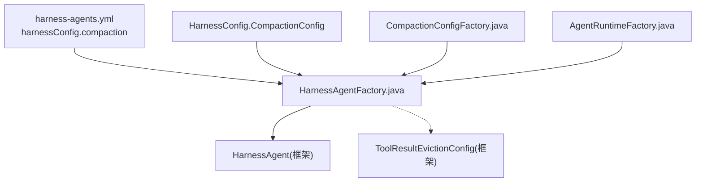
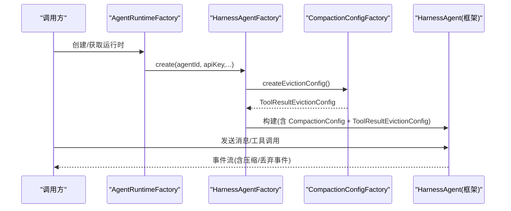
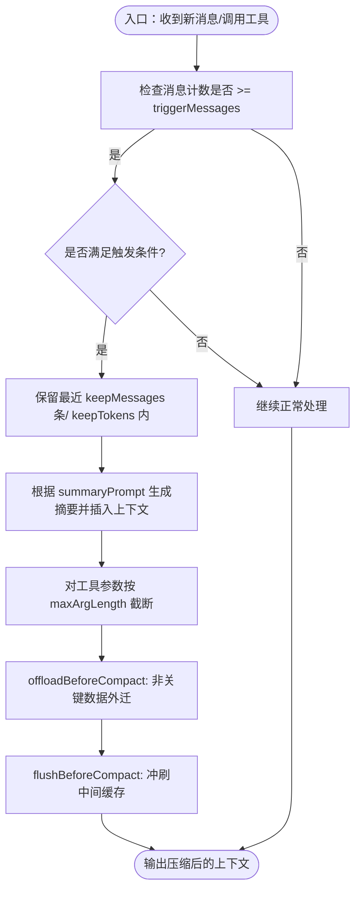

# 内存压缩与回收

<cite>
**本文引用的文件**
- [CompactionConfigFactory.java](file://src/main/java/com/skloda/agentscope/harness/CompactionConfigFactory.java)
- [HarnessAgentFactory.java](file://src/main/java/com/skloda/agentscope/harness/HarnessAgentFactory.java)
- [HarnessConfig.java](file://src/main/java/com/skloda/agentscope/agent/HarnessConfig.java)
- [harness-agents.yml](file://src/main/resources/config/harness-agents.yml)
- [application.yml](file://src/main/resources/application.yml)
- [AgentRuntimeFactory.java](file://src/main/java/com/skloda/agentscope/runtime/AgentRuntimeFactory.java)
</cite>

## 目录
1. [简介](#简介)
2. [项目结构](#项目结构)
3. [核心组件](#核心组件)
4. [架构总览](#架构总览)
5. [关键组件详解](#关键组件详解)
6. [依赖关系分析](#依赖关系分析)
7. [性能考量](#性能考量)
8. [故障排查指南](#故障排查指南)
9. [结论](#结论)
10. [附录：配置项速查](#附录配置项速查)

## 简介
本章节聚焦 Harness Agent 的内存压缩与工具结果回收机制。通过 CompactionConfig 控制上下文压缩触发条件、保留策略与摘要生成；通过 ToolResultEvictionConfig 限制大工具结果的体积并截断预览，降低上下文溢出风险。本文将结合代码与配置说明默认演示场景的差异、调优建议、性能影响与常见问题排障方法。

## 项目结构
- 配置定义层
  - HarnessConfig.CompactionConfig：YAML 可配置的轻量版本（triggerMessages、keepMessages、flushBeforeCompact）。
  - CompactionConfigFactory：提供标准与演示用 CompactionConfig（含更丰富参数如 triggerTokens、summaryPrompt、truncateArgs），以及 ToolResultEvictionConfig（maxResultChars=50000、previewChars=1000）。
- 装配与生效层
  - HarnessAgentFactory：读取 YAML 中的 harnessConfig.compaction 并构建框架级 CompactionConfig，注入 HarnessAgent；同时从 CompactionConfigFactory 获取 ToolResultEvictionConfig 并启用。
  - AgentRuntimeFactory：创建具体运行时，最终落入 HarnessAgentFactory 的 HarnessAgent 构建流程。
- 配置文件
  - harness-agents.yml：两个 HARNESS 类型 Agent 均配置了 compaction 段落。
  - application.yml：全局 memory.max-history 等基础设置，对 Harness Agent 不直接覆盖 CompactionConfig。



图表来源
- [HarnessAgentFactory.java:105-119](file://src/main/java/com/skloda/agentscope/harness/HarnessAgentFactory.java#L105-L119)
- [CompactionConfigFactory.java:11-46](file://src/main/java/com/skloda/agentscope/harness/CompactionConfigFactory.java#L11-L46)
- [HarnessConfig.java:50-54](file://src/main/java/com/skloda/agentscope/agent/HarnessConfig.java#L50-L54)
- [harness-agents.yml:30-33](file://src/main/resources/config/harness-agents.yml#L30-L33)

章节来源
- [HarnessAgentFactory.java:105-119](file://src/main/java/com/skloda/agentscope/harness/HarnessAgentFactory.java#L105-L119)
- [CompactionConfigFactory.java:11-46](file://src/main/java/com/skloda/agentscope/harness/CompactionConfigFactory.java#L11-L46)
- [HarnessConfig.java:50-54](file://src/main/java/com/skloda/agentscope/agent/HarnessConfig.java#L50-L54)
- [harness-agents.yml:30-33](file://src/main/resources/config/harness-agents.yml#L30-L33)
- [application.yml:44-49](file://src/main/resources/application.yml#L44-L49)
- [AgentRuntimeFactory.java:163-180](file://src/main/java/com/skloda/agentscope/runtime/AgentRuntimeFactory.java#L163-L180)

## 核心组件
- CompactionConfigFactory
  - createDefault()：包含消息/Token 阈值、保留策略、摘要提示词、压缩前 flush/offload 开关、参数截断（maxArgLength=10000、truncationText）。
  - createForDemo()：更低的阈值以便演示快速触达压缩。
  - createEvictionConfig()：工具结果回收上限（最大字符数 50000）与预览长度（1000）。
- HarnessAgentFactory
  - 将 YAML 中 HarnessConfig.CompactionConfig 转换为框架 CompactionConfig（仅映射 triggerMessages、keepMessages、flushBeforeCompact）。
  - 引入 CompactionConfigFactory.createEvictionConfig()，启用工具结果回收。
- HarnessConfig.CompactionConfig
  - 承载 YAML 配置项，供 HarnessAgentFactory 读入。
- harness-agents.yml
  - 对多个 HARNESS Agent 开启 compaction 子段，统一使用相同的触发/保留策略。

章节来源
- [CompactionConfigFactory.java:11-46](file://src/main/java/com/skloda/agentscope/harness/CompactionConfigFactory.java#L11-L46)
- [HarnessAgentFactory.java:105-119](file://src/main/java/com/skloda/agentscope/harness/HarnessAgentFactory.java#L105-L119)
- [HarnessConfig.java:50-54](file://src/main/java/com/skloda/agentscope/agent/HarnessConfig.java#L50-L54)
- [harness-agents.yml:30-33](file://src/main/resources/config/harness-agents.yml#L30-L33)

## 架构总览
下图展示“用户消息 → Runtime 调度 → HarnessAgent 压缩与工具结果回收”的关键链路。注意：实际压缩触发和上下文管理在框架侧完成，本项目负责装配与参数传递。



图表来源
- [AgentRuntimeFactory.java:163-180](file://src/main/java/com/skloda/agentscope/runtime/AgentRuntimeFactory.java#L163-L180)
- [HarnessAgentFactory.java:105-119](file://src/main/java/com/skloda/agentscope/harness/HarnessAgentFactory.java#L105-L119)
- [CompactionConfigFactory.java:11-46](file://src/main/java/com/skloda/agentscope/harness/CompactionConfigFactory.java#L11-L46)

## 关键组件详解

### CompactionConfig：触发条件、保留策略、摘要与参数截断
- 触发条件
  - 消息数量阈值 triggerMessages：达到该历史消息条数后考虑压缩。
  - Token 数量阈值 triggerTokens：上下文 Token 超限时也可触发（由默认工厂提供）。
- 保留策略
  - keepMessages：压缩后最少保留最近多少条消息，避免对话历史被过度裁剪。
  - keepTokens：压缩后最多允许的 Token 规模，确保上下文不膨胀。
- 摘要生成
  - summaryPrompt：当触发压缩时用于让模型总结历史信息的提示词，减少冗余但保留关键事实与决策。
- 压缩时机与控制
  - flushBeforeCompact：压缩前先落盘/清理临时缓冲，降低峰值内存。
  - offloadBeforeCompact：压缩前卸载非关键上下文至外部存储（如有）。
- 参数截断机制（TruncateArgsConfig）
  - maxArgLength：对工具输入参数的单参数最大长度进行截断。
  - truncationText：截断处的标记文本，便于追踪是否发生截断。

实施要点
- YAML 只支持较小子集（triggerMessages、keepMessages、flushBeforeCompact），如需完整能力请使用 CompactionConfigFactory 的 createDefault()/createForDemo()。
- Demo 场景使用更低阈值更快触发压缩，便于观察效果。

章节来源
- [CompactionConfigFactory.java:11-39](file://src/main/java/com/skloda/agentscope/harness/CompactionConfigFactory.java#L11-L39)
- [HarnessAgentFactory.java:105-113](file://src/main/java/com/skloda/agentscope/harness/HarnessAgentFactory.java#L105-L113)
- [harness-agents.yml:30-33](file://src/main/resources/config/harness-agents.yml#L30-L33)

### ToolResultEvictionConfig：工具结果回收策略
- 目标：防止单个或批量工具返回的大结果撑爆上下文窗口并推高内存。
- 最大字符数限制 maxResultChars=50000：超过此长度的工具结果将被截断或丢弃尾部。
- 预览长度 previewChars=1000：即使内容很长，也仅在上下文中保留一段简短预览以维持可读性，同时显著降低占用的上下文与内存。

实施要点
- 所有启用 HarnessAgent 的流程都会加载此配置，无需为每个 Agent 单独设置。
- 若业务需要更大上限，可在工厂扩展阈值并在日志中观测效果。

章节来源
- [CompactionConfigFactory.java:41-46](file://src/main/java/com/skloda/agentscope/harness/CompactionConfigFactory.java#L41-L46)
- [HarnessAgentFactory.java:115-119](file://src/main/java/com/skloda/agentscope/harness/HarnessAgentFactory.java#L115-L119)

### YAML 到框架配置映射差异
- YAML HarnessConfig.CompactionConfig 仅提供基础字段（消息阈值、保留、压缩前 flush）。
- 如需更多能力（如 Token 阈值、摘要提示词、参数截断），可通过 CompactionConfigFactory 的默认/演示配置，或在将来扩展 YAML 解析器以支持更多键。

章节来源
- [HarnessConfig.java:50-54](file://src/main/java/com/skloda/agentscope/agent/HarnessConfig.java#L50-L54)
- [HarnessAgentFactory.java:105-113](file://src/main/java/com/skloda/agentscope/harness/HarnessAgentFactory.java#L105-L113)
- [CompactionConfigFactory.java:11-39](file://src/main/java/com/skloda/agentscope/harness/CompactionConfigFactory.java#L11-L39)

### 压缩算法工作流程（概念图示）
以下流程图帮助理解典型压缩逻辑（基于已暴露的配置点归纳）：



图表来源
- [CompactionConfigFactory.java:11-39](file://src/main/java/com/skloda/agentscope/harness/CompactionConfigFactory.java#L11-L39)
- [HarnessAgentFactory.java:105-119](file://src/main/java/com/skloda/agentscope/harness/HarnessAgentFactory.java#L105-L119)

## 依赖关系分析
- AgentRuntimeFactory 根据 agentId 选择运行时，针对 HARNESS 类型进入 HarnessAgentFactory.create(...)。
- HarnessAgentFactory 依赖三个关键对象：
  - FilesystemSpecFactory：决定文件系统（本地/Docker）。
  - ModelFactory：创建 LLM 模型实例。
  - CompactionConfigFactory：提供 CompactionConfig 与 ToolResultEvictionConfig。
- 配置链：harness-agents.yml → HarnessConfig.CompactionConfig → 框架 CompactionConfig；ToolResultEvictionConfig 始终来自 CompactionConfigFactory。

```mermaid
classDiagram
  class HarnessAgentFactory {
    +create(AgentConfig, String, String)
    -filesystemSpecFactory
    -compactionConfigFactory
    -modelFactory
    -permissionContextFactory
  }
  class CompactionConfigFactory {
    +createDefault()
    +createForDemo()
    +createEvictionConfig()
  }
  class HarnessConfig$CompactionConfig {
    +triggerMessages:int
    +keepMessages:int
    +flushBeforeCompact:boolean
  }
  class AgentRuntimeFactory {
    +createRuntime(String)
  }
  AgentRuntimeFactory --> HarnessAgentFactory : "调用创建 HarnessAgent"
  HarnessAgentFactory --> CompactionConfigFactory : "获取压缩/回收配置"
  HarnessAgentFactory --> HarnessConfig$CompactionConfig : "读取YAML映射"
```

图表来源
- [AgentRuntimeFactory.java:163-180](file://src/main/java/com/skloda/agentscope/runtime/AgentRuntimeFactory.java#L163-L180)
- [HarnessAgentFactory.java:22-40](file://src/main/java/com/skloda/agentscope/harness/HarnessAgentFactory.java#L22-L40)
- [HarnessAgentFactory.java:105-119](file://src/main/java/com/skloda/agentscope/harness/HarnessAgentFactory.java#L105-L119)
- [CompactionConfigFactory.java:9-46](file://src/main/java/com/skloda/agentscope/harness/CompactionConfigFactory.java#L9-L46)
- [HarnessConfig.java:50-54](file://src/main/java/com/skloda/agentscope/agent/HarnessConfig.java#L50-L54)

## 性能考量
- 触发频率
  - 较低阈值（如 demo 配置）会更快触发压缩，有助于缩短长会话响应时间，但可能增加摘要调用成本。
  - 较高阈值更适合低交互频次、高单轮深度的场景，可降低摘要次数，但需要更强的上下文裁剪与参数截断配合。
- 摘要质量 vs 开销
  - summaryPrompt 应聚焦事实与决策点，避免无关噪音；过于冗长的摘要会增加后续 Token 与延迟。
- 工具结果回收
  - maxResultChars=50000 能有效遏制超大结果导致的内存尖峰；对于只需浏览概要的工具（如搜索列表、报表头部），可将 previewChars=1000 视为良好起点，按需上调。
- I/O 与抖动
  - flushBeforeCompact 与 offloadBeforeCompact 会在压缩前后进行磁盘/外部存储写入，需评估吞吐与延迟；建议在批处理窗口或空闲时段运行。

[本节提供通用指导，不涉及特定文件实现细节]

## 故障排查指南
- 现象：压不断（内存持续增长）
  - 检查是否启用了 compaction：harness-agents.yml 中 compaction 字段是否存在。
  - 校验 threshold：若 triggerMessages/triggerTokens 设置过大，可能导致迟迟不触发；可用 createForDemo() 的较低阈值验证。
  - 确认 compress 前刷新：保持 flushBeforeCompact=true，确保中间态及时释放。
- 现象：摘要过多导致延迟升高
  - 提高触发阈值，或在业务高峰关闭 offload/flush 以降低额外开销。
  - 简化 summaryPrompt，仅保留关键词提示。
- 现象：上下文仍过长或被截断频繁
  - 调整 keepMessages/keepTokens，平衡完整度与体积。
  - 调小 tool result 的 maxResultChars 或 previewChars，优先保留关键头部信息。
- 现象：工具调用失败（参数过大/超时）
  - 检查 TruncateArgsConfig 的 maxArgLength；必要时拆分子任务或分页调用工具。
- 现象：生产环境未生效
  - 确认当前 Agent 类型是否为 HARNESS，且经过 HarnessAgentFactory 装配。
  - 查看日志：是否打印“configured with ToolResultEvictionConfig(...)”、“enabled Plan Mode”等相关行。

章节来源
- [CompactionConfigFactory.java:11-46](file://src/main/java/com/skloda/agentscope/harness/CompactionConfigFactory.java#L11-L46)
- [HarnessAgentFactory.java:105-119](file://src/main/java/com/skloda/agentscope/harness/HarnessAgentFactory.java#L105-L119)
- [harness-agents.yml:30-33](file://src/main/resources/config/harness-agents.yml#L30-L33)
- [application.yml:44-49](file://src/main/resources/application.yml#L44-L49)

## 结论
- CompactionConfigFactory 提供了两种典型配置：标准生产版与更低阈值的演示版，便于在不同阶段验证压缩行为。
- YAML 层的 HarnessConfig.CompactionConfig 实现了开箱即用的基本压缩策略；复杂场景可复用工厂方法或使用框架原生命令。
- ToolResultEvictionConfig 通过“上限+预览”的方式有效控制工具结果造成的上下文膨胀，建议结合业务工具的返回值特征微调参数。
- 建议在长会话场景中启用压缩与工具结果回收，并辅以监控指标观察压缩频率、触发阈值命中率与延迟影响，再逐步逼近最优参数组合。

[本节为总结陈述，不引用具体文件]

## 附录：配置项速查
- 触发条件
  - triggerMessages：达到指定历史消息数后尝试压缩（YAML/工厂均可配）。
  - triggerTokens：达到 Token 上限后尝试压缩（工厂默认提供）。
- 保留策略
  - keepMessages：最少保留最近消息条数。
  - keepTokens：保留后上下文 Token 预算。
- 摘要与截断
  - summaryPrompt：定义摘要生成的焦点。
  - TruncateArgsConfig.maxArgLength / truncationText：参数截断阈值与标记。
- 回收策略（工具结果）
  - ToolResultEvictionConfig.maxResultChars=50000：最大允许的工具结果大小。
  - ToolResultEvictionConfig.previewChars=1000：保留的片段预览长度。

章节来源
- [CompactionConfigFactory.java:11-46](file://src/main/java/com/skloda/agentscope/harness/CompactionConfigFactory.java#L11-L46)
- [harness-agents.yml:30-33](file://src/main/resources/config/harness-agents.yml#L30-L33)
- [HarnessConfig.java:50-54](file://src/main/java/com/skloda/agentscope/agent/HarnessConfig.java#L50-L54)