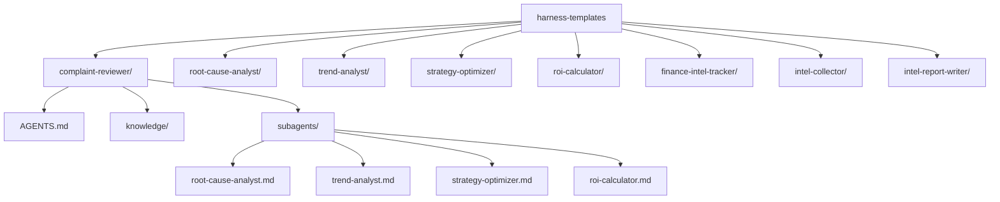
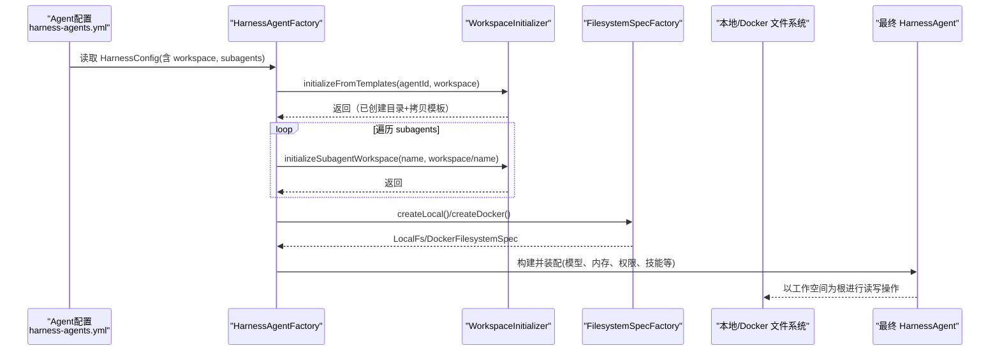
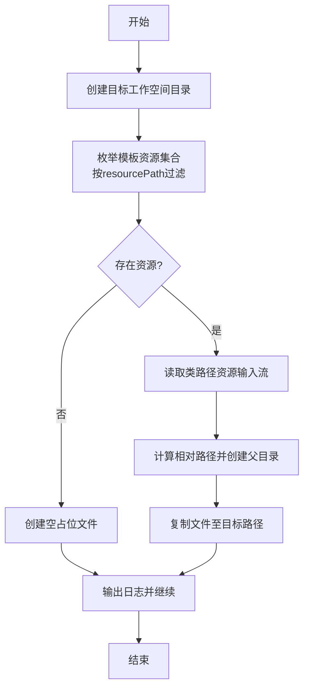
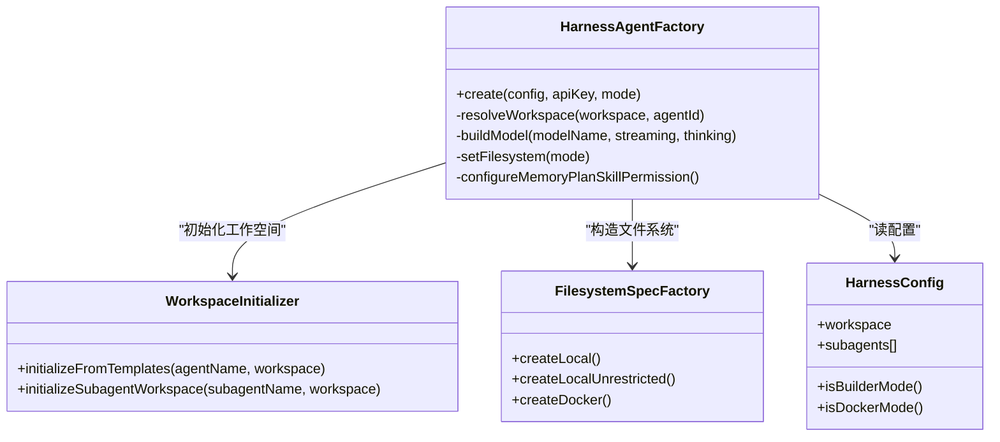
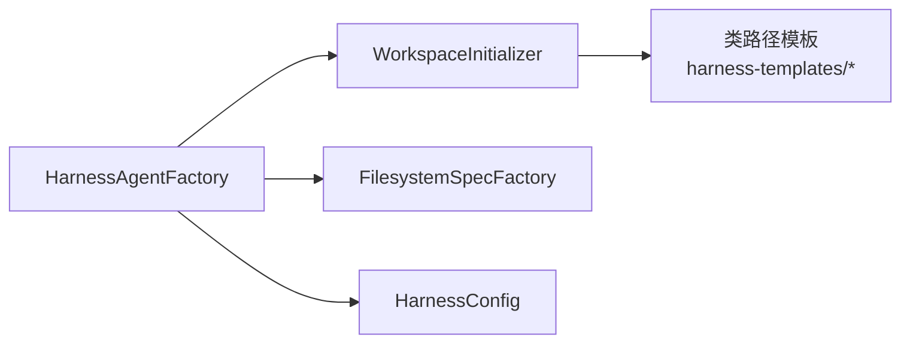

# 工作空间管理

<cite>
**本文引用的文件**
- [src/main/java/com/skloda/agentscope/harness/WorkspaceInitializer.java](file://src/main/java/com/skloda/agentscope/harness/WorkspaceInitializer.java)
- [src/main/resources/harness-templates/complaint-reviewer/AGENTS.md](file://src/main/resources/harness-templates/complaint-reviewer/AGENTS.md)
- [src/main/resources/harness-templates/complaint-reviewer/knowledge/complaint-taxonomy.md](file://src/main/resources/harness-templates/complaint-reviewer/knowledge/complaint-taxonomy.md)
- [src/main/resources/harness-templates/complaint-reviewer/subagents/root-cause-analyst.md](file://src/main/resources/harness-templates/complaint-reviewer/subagents/root-cause-analyst.md)
- [src/main/java/com/skloda/agentscope/harness/HarnessAgentFactory.java](file://src/main/java/com/skloda/agentscope/harness/HarnessAgentFactory.java)
- [src/main/java/com/skloda/agentscope/harness/FilesystemSpecFactory.java](file://src/main/java/com/skloda/agentscope/harness/FilesystemSpecFactory.java)
- [src/main/java/com/skloda/agentscope/agent/HarnessConfig.java](file://src/main/java/com/skloda/agentscope/agent/HarnessConfig.java)
- [src/main/resources/config/harness-agents.yml](file://src/main/resources/config/harness-agents.yml)
- [src/test/java/com/skloda/agentscope/harness/WorkspaceInitializerTest.java](file://src/test/java/com/skloda/agentscope/harness/WorkspaceInitializerTest.java)
</cite>

## 目录
1. [简介](#简介)
2. [项目结构](#项目结构)
3. [核心组件](#核心组件)
4. [架构总览](#架构总览)
5. [详细组件分析](#详细组件分析)
6. [依赖关系分析](#依赖关系分析)
7. [性能与扩展性](#性能与扩展性)
8. [故障诊断与排错](#故障诊断与排错)
9. [自定义模板开发指南](#自定义模板开发指南)
10. [结论](#结论)
11. [附录](#附录)

## 简介
本章节聚焦 AgentScope Demo 中的工作空间管理系统，围绕 WorkspaceInitializer 的模板复制机制展开，覆盖以下关键点：
- 基于资源路径的模板发现与拷贝（包含 AGENTS.md、knowledge 目录、skills 目录）
- 子 Agent 工作空间的初始化流程
- 多 Agent 协作下工作空间的隔离与资源共享策略
- 自定义模板开发与版本管理方法
- 生命周期管理与常见问题诊断

## 项目结构
系统的工作空间模板集中在类路径下的 harness-templates 目录；每个模板代表一个 Agent 或 SubAgent 的最小可运行工作空间，包含：
- AGENTS.md：Agent 的行为契约、职责定义和分析链约定
- knowledge/：业务知识、领域术语、规则与案例
- skills/：技能描述与脚本（SKILL.md + assets/scripts）
- subagents/：子 Agent 的定义文件（name、description、workspace 引用等）

图表来源
- [src/main/java/com/skloda/agentscope/harness/WorkspaceInitializer.java:54-102](file://src/main/java/com/skloda/agentscope/harness/WorkspaceInitializer.java#L54-L102)
- [src/main/resources/config/harness-agents.yml:3-42](file://src/main/resources/config/harness-agents.yml#L3-L42)

部分来源
- [src/main/java/com/skloda/agentscope/harness/WorkspaceInitializer.java:13-103](file://src/main/java/com/skloda/agentscope/harness/WorkspaceInitializer.java#L13-L103)
- [src/main/resources/config/harness-agents.yml:1-85](file://src/main/resources/config/harness-agents.yml#L1-L85)

## 核心组件
- WorkspaceInitializer：按 agentName 或 subagentName 从类路径解析模板资源，创建目标工作空间并复制必要文件。对于缺失模板资源只创建空占位，保证目录结构完整。
- HarnessAgentFactory：根据配置构建 HarnessAgent，调用 WorkspaceInitializer 初始化主 Agent 及所有子 Agent 工作空间，同时注入文件系统、内存、计划模式、技能仓库、权限上下文等能力。
- FilesystemSpecFactory：提供本地无受限/沙箱化文件系统与 Docker 环境规范，配合工作空间实现隔离。
- HarnessConfig：声明工作空间、执行模式、子 Agent 列表、沙箱、计划/记忆/权限等运行时选项，驱动工厂装配行为。

部分来源
- [src/main/java/com/skloda/agentscope/harness/WorkspaceInitializer.java:13-103](file://src/main/java/com/skloda/agentscope/harness/WorkspaceInitializer.java#L13-L103)
- [src/main/java/com/skloda/agentscope/harness/HarnessAgentFactory.java:22-200](file://src/main/java/com/skloda/agentscope/harness/HarnessAgentFactory.java#L22-L200)
- [src/main/java/com/skloda/agentscope/harness/FilesystemSpecFactory.java:14-47](file://src/main/java/com/skloda/agentscope/harness/FilesystemSpecFactory.java#L14-L47)
- [src/main/java/com/skloda/agentscope/agent/HarnessConfig.java:11-133](file://src/main/java/com/skloda/agentscope/agent/HarnessConfig.java#L11-L133)

## 架构总览
下图展示工作空间初始化的端到端流程：从 Agent 配置到模板解析、目录创建、文件复制，以及子 Agent 工作空间的初始化。

图表来源
- [src/main/java/com/skloda/agentscope/harness/HarnessAgentFactory.java:42-67](file://src/main/java/com/skloda/agentscope/harness/HarnessAgentFactory.java#L42-L67)
- [src/main/java/com/skloda/agentscope/harness/WorkspaceInitializer.java:18-52](file://src/main/java/com/skloda/agentscope/harness/WorkspaceInitializer.java#L18-L52)
- [src/main/java/com/skloda/agentscope/harness/FilesystemSpecFactory.java:17-46](file://src/main/java/com/skloda/agentscope/harness/FilesystemSpecFactory.java#L17-L46)

部分来源
- [src/main/java/com/skloda/agentscope/harness/HarnessAgentFactory.java:42-67](file://src/main/java/com/skloda/agentscope/harness/HarnessAgentFactory.java#L42-L67)
- [src/main/resources/config/harness-agents.yml:3-42](file://src/main/resources/config/harness-agents.yml#L3-L42)

## 详细组件分析

### WorkspaceInitializer：模板复制机制
- 入口方法：initializeFromTemplates(agentName, workspace)，创建目标目录并调用内部复制逻辑。
- 子 Agent 初始化：initializeSubagentWorkspace(subagentName, workspace)，对相对路径下的子工作空间执行相同逻辑。
- 资源路径解析：listTemplateResources 在类路径中以 harness-templates/ 为前缀列举已知模板资源，并按 resourcePath 过滤出当前子树。
- 文件复制策略：
  - 若资源存在：以字节流复制到工作空间对应相对路径，覆盖已有文件。
  - 若资源不存在：创建空占位文件，保留目录结构，以便后续补充资源后生效。
- 幂等设计：不覆盖已存在的用户定制文件，保留工作空间“演进”能力。

图表来源
- [src/main/java/com/skloda/agentscope/harness/WorkspaceInitializer.java:18-52](file://src/main/java/com/skloda/agentscope/harness/WorkspaceInitializer.java#L18-L52)
- [src/main/java/com/skloda/agentscope/harness/WorkspaceInitializer.java:54-102](file://src/main/java/com/skloda/agentscope/harness/WorkspaceInitializer.java#L54-L102)

部分来源
- [src/main/java/com/skloda/agentscope/harness/WorkspaceInitializer.java:13-103](file://src/main/java/com/skloda/agentscope/harness/WorkspaceInitializer.java#L13-L103)
- [src/test/java/com/skloda/agentscope/harness/WorkspaceInitializerTest.java:17-54](file://src/test/java/com/skloda/agentscope/harness/WorkspaceInitializerTest.java#L17-L54)

### HarnessAgentFactory：工作空间与运行装配
- 工作空间解析：从 HarnessConfig.workspace 解析为 Path，确保每次启动均基于该路径工作。
- 模板初始化：先初始化主 Agent 工作空间，再循环初始化配置的 subagents 工作空间（位于 workspace/<subagentName>/）。
- 文件系统模式：支持 Docker 沙箱（默认镜像 python:3.11-slim）、本地沙箱化或未受限模式，影响工作空间的可见性与执行隔离。
- 其他能力：计划模式、分层记忆、权限上下文、技能仓库等与工作空间共同构成 Agent 运行环境。

图表来源
- [src/main/java/com/skloda/agentscope/harness/HarnessAgentFactory.java:42-103](file://src/main/java/com/skloda/agentscope/harness/HarnessAgentFactory.java#L42-L103)
- [src/main/java/com/skloda/agentscope/harness/FilesystemSpecFactory.java:17-46](file://src/main/java/com/skloda/agentscope/harness/FilesystemSpecFactory.java#L17-L46)
- [src/main/java/com/skloda/agentscope/agent/HarnessConfig.java:11-79](file://src/main/java/com/skloda/agentscope/agent/HarnessConfig.java#L11-L79)

部分来源
- [src/main/java/com/skloda/agentscope/harness/HarnessAgentFactory.java:42-103](file://src/main/java/com/skloda/agentscope/harness/HarnessAgentFactory.java#L42-L103)
- [src/main/resources/config/harness-agents.yml:3-42](file://src/main/resources/config/harness-agents.yml#L3-L42)

### 资源路径解析与文件复制策略
- 资源前缀：harness-templates/
- 列表生成：通过硬编码模板清单映射到类路径资源名，再根据传入 resourcePath 做前缀匹配过滤。
- 文件复制：使用 ClassLoader.getResourceAsStream 获取输入流，复制到 targetDir.resolve(relative)。若资源不存在则创建空文件，以保持目录结构不变。
- 幂等：已存在的目标文件不会被覆盖（仅在第一次复制时写入，除非资源再次提供新内容）。

部分来源
- [src/main/java/com/skloda/agentscope/harness/WorkspaceInitializer.java:16-52](file://src/main/java/com/skloda/agentscope/harness/WorkspaceInitializer.java#L16-L52)
- [src/main/java/com/skloda/agentscope/harness/WorkspaceInitializer.java:54-102](file://src/main/java/com/skloda/agentscope/harness/WorkspaceInitializer.java#L54-L102)

### 多 Agent 协作下的隔离与共享
- 隔离：
  - 每个 HarnessAgent 拥有独立的 workspace 目录。
  - Docker 模式下通过容器文件系统与 /workspace 根进一步隔离执行环境。
- 共享：
  - 可通过 Blackboard（跨 Agent 共享状态）在流程中进行协作与结果汇总（例如 complaint-reviewer 四步分析链的结果传递）。
  - 知识文件（knowledge/*.md）由模板复制到各自工作空间，便于独立演进与检索引用。
- 子 Agent 管理：
  - HarnessConfig.subagents 列出需要初始化的子 Agent，工厂会在工作空间同级目录下创建对应的子工作空间并复制模板。

部分来源
- [src/main/java/com/skloda/agentscope/harness/HarnessAgentFactory.java:56-67](file://src/main/java/com/skloda/agentscope/harness/HarnessAgentFactory.java#L56-L67)
- [src/main/resources/config/harness-agents.yml:34-42](file://src/main/resources/config/harness-agents.yml#L34-L42)

## 依赖关系分析
- HarnessAgentFactory 依赖：
  - WorkspaceInitializer：工作空间初始化
  - FilesystemSpecFactory：文件系统抽象与后端选择
  - HarnessConfig：运行时配置聚合
- 模板资源由 Spring 类路径打包加载（maven resources），在运行时随应用分发，保证部署一致性。
- 测试用例对工作空间初始化断言关键结构的存在性与幂等性。

图表来源
- [src/main/java/com/skloda/agentscope/harness/HarnessAgentFactory.java:42-103](file://src/main/java/com/skloda/agentscope/harness/HarnessAgentFactory.java#L42-L103)
- [src/main/java/com/skloda/agentscope/harness/WorkspaceInitializer.java:16-52](file://src/main/java/com/skloda/agentscope/harness/WorkspaceInitializer.java#L16-L52)

部分来源
- [src/test/java/com/skloda/agentscope/harness/WorkspaceInitializerTest.java:17-54](file://src/test/java/com/skloda/agentscope/harness/WorkspaceInitializerTest.java#L17-L54)

## 性能与扩展性
- 初次启动开销：模板枚举与流式复制属于轻量 I/O，通常可忽略。
- 重复初始化成本极低：仅检查文件是否存在，避免重复写入。
- 可扩展点：
  - 增加新 Agent/子 Agent 仅需在模板与清单中注册，无需修改核心逻辑。
  - 通过替换 FilesystemSpecFactory 适配更多存储后端或网络文件系统。

[本节提供一般性指导，无需特定文件引用]

## 故障诊断与排错
- 模板文件缺失
  - 现象：目标目录下存在占位空文件但内容为空。
  - 排查：确认模板资源存在于 harness-templates 对应目录，且未被 maven 资源过滤排除。
  - 依据：复制逻辑在资源缺失时会创建空占位文件以维持目录结构。
- 权限不足
  - 现象：无法创建工作目录或复制文件失败。
  - 排查：确保进程对目标 workspace 有读写权限；Linux 环境下注意 SELinux/ACL 限制。
- 路径冲突
  - 现象：已存在文件未被覆盖导致预期未更新。
  - 排查：如需强制更新，可删除现有工作空间重新初始化。
- Docker 模式异常
  - 现象：工作空间在容器中不可见，或镜像拉取失败。
  - 排查：检查镜像配置与 docker 引擎可用性；确认 workspaceRoot 挂载正确。
- API Key 错误导致的上游失败
  - 虽不属于模板本身，但若配置错误会导致整体初始化流程失败。
  - 排查：查看日志中的 API Key 解析错误信息。

部分来源
- [src/main/java/com/skloda/agentscope/harness/WorkspaceInitializer.java:30-52](file://src/main/java/com/skloda/agentscope/harness/WorkspaceInitializer.java#L30-L52)
- [src/main/java/com/skloda/agentscope/harness/HarnessAgentFactory.java:82-103](file://src/main/java/com/skloda/agentscope/harness/HarnessAgentFactory.java#L82-L103)
- [src/test/java/com/skloda/agentscope/harness/WorkspaceInitializerTest.java:27-54](file://src/test/java/com/skloda/agentscope/harness/WorkspaceInitializerTest.java#L27-L54)

## 自定义模板开发指南
- 模板组织结构建议
  - AGENTS.md：定义角色、任务边界、分析链与输出格式。
  - knowledge/：存放领域知识、分类体系、政策与最佳实践。
  - skills/：每个技能一个子目录，内含 SKILL.md 与 assets/scripts 等。
  - subagents/：子 Agent 定义文件，说明名称、描述与工作空间路径引用。
- 资源与副本策略
  - 新增模板需在资源清单中添加条目（与内置模板相同的注册方式），并在 harness-templates 放置实际内容。
  - 首次启动会将模板复制到用户工作区；后续变更不会自动覆盖已有文件，便于版本演进与个性化定制。
- 模板版本管理
  - 建议使用 Git 管理 harness-templates 内容，按版本号或分支发布不同模板集。
  - 在生产环境采用锁定版本或制品化管理（如内部分发包），确保一致性。
- 工作空间生命周期
  - 启动期：创建目录、复制模板（幂等）。
  - 运行期：Agent 在工作空间中读写、产生中间产物。
  - 清理期：按策略删除历史产物或归档（可通过上层服务管理）。

部分来源
- [src/main/resources/harness-templates/complaint-reviewer/AGENTS.md:1-26](file://src/main/resources/harness-templates/complaint-reviewer/AGENTS.md#L1-L26)
- [src/main/resources/harness-templates/complaint-reviewer/knowledge/complaint-taxonomy.md:1-22](file://src/main/resources/harness-templates/complaint-reviewer/knowledge/complaint-taxonomy.md#L1-L22)
- [src/main/resources/harness-templates/complaint-reviewer/subagents/root-cause-analyst.md:1-20](file://src/main/resources/harness-templates/complaint-reviewer/subagents/root-cause-analyst.md#L1-L20)
- [src/main/resources/config/harness-agents.yml:34-42](file://src/main/resources/config/harness-agents.yml#L34-L42)
- [src/main/java/com/skloda/agentscope/harness/WorkspaceInitializer.java:54-102](file://src/main/java/com/skloda/agentscope/harness/WorkspaceInitializer.java#L54-L102)

## 结论
工作空间管理以“模板 + 幂等复制”为核心，结合灵活的文件系统抽象与运行时配置，实现了：
- 可复用的 Agent 工作空间定义
- 子 Agent 的一键初始化与目录隔离
- 多 Agent 协作时的知识共享与产物隔离
通过对工作空间的统一管理，系统具备了良好的可扩展性与运维友好度。

[本节为总结性内容，无需特定文件引用]

## 附录
- 典型模板内容参考
  - AGENTS.md：定义 Agent 职责与分析链约束
  - knowledge/*.md：行业知识与规范
  - subagents/*.md：子 Agent 的结构化描述与工作空间绑定
- 相关配置文件
  - harness-agents.yml：定义 Harness 类型 Agent 及子 Agent 列表
  - application*.yml：API Key、沙箱与环境变量配置

[本节为参考资料说明，无需特定文件引用]