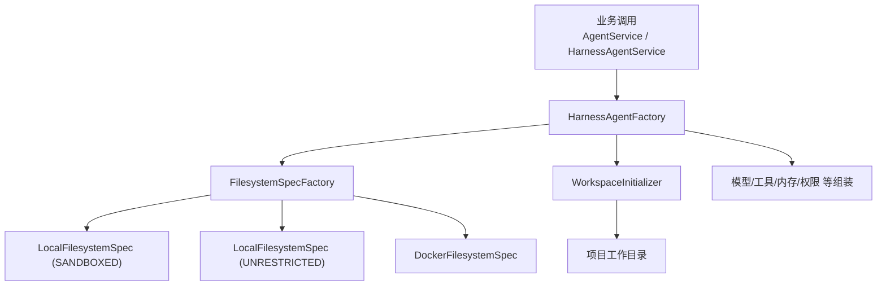
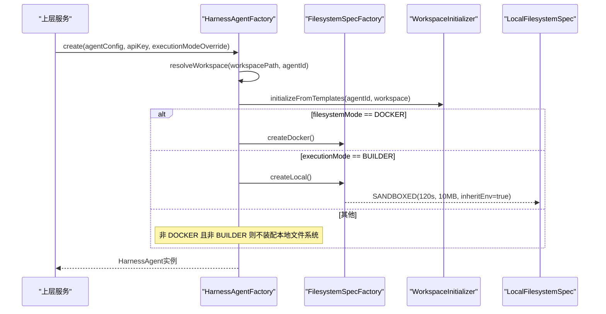
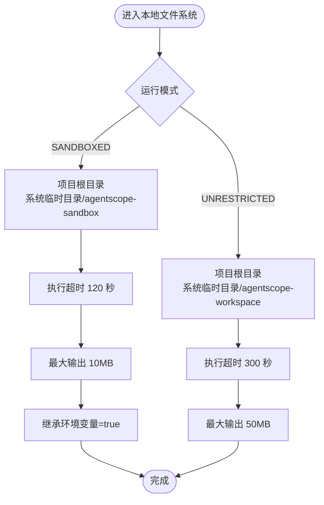
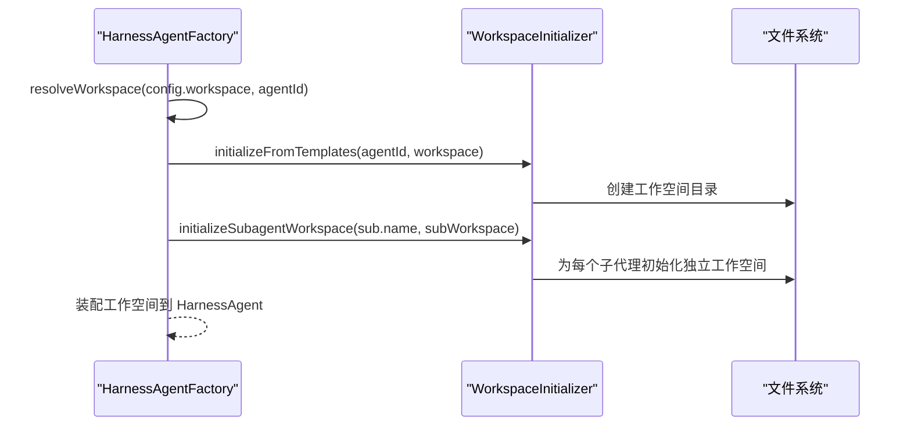
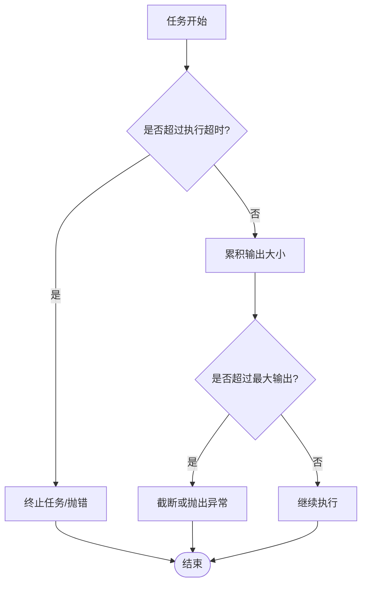
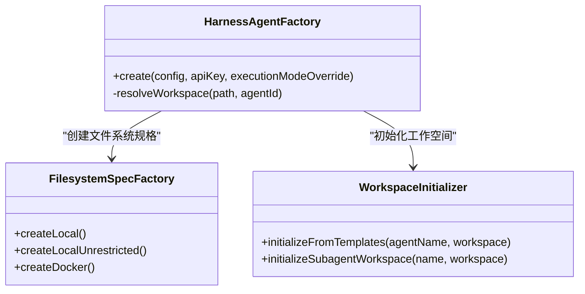

# 本地文件系统模式

<cite>
**本文引用的文件**   
- [FilesystemSpecFactory.java](file://src/main/java/com/skloda/agentscope/harness/FilesystemSpecFactory.java)
- [HarnessAgentFactory.java](file://src/main/java/com/skloda/agentscope/harness/HarnessAgentFactory.java)
- [HarnessConfig.java](file://src/main/java/com/skloda/agentscope/agent/HarnessConfig.java)
- [harness-agents.yml](file://src/main/resources/config/harness-agents.yml)
- [application.yml](file://src/main/resources/application.yml)
- [WorkspaceInitializer.java](file://src/main/java/com/skloda/agentscope/harness/WorkspaceInitializer.java)
- [HarnessAgentFactoryModeTest.java](file://src/test/java/com/skloda/agentscope/harness/HarnessAgentFactoryModeTest.java)
</cite>

## 目录
1. [简介](#简介)
2. [项目结构](#项目结构)
3. [核心组件](#核心组件)
4. [架构总览](#架构总览)
5. [详细组件分析](#详细组件分析)
6. [依赖关系分析](#依赖关系分析)
7. [性能考量](#性能考量)
8. [故障排查指南](#故障排查指南)
9. [结论](#结论)
10. [附录](#附录)

## 简介
本技术文档聚焦于 AgentScope Harness 的“本地文件系统模式”，详细说明 LocalFilesystemSpec 的两种运行模式 SANDBOXED（受控沙箱）与 UNRESTRICTED（不受限工作区），包括其区别、应用场景、项目目录结构、执行超时限制、最大输出字节限制以及环境变量继承策略。并结合路径解析逻辑、临时目录管理、文件权限控制等实现细节，提供性能对比分析与安全风险评估，帮助开发者选择合适模式与配置。

## 项目结构
- FilesystemSpecFactory：负责创建不同“文件系统规范”（LocalFilesystemSpec、DockerFilesystemSpec）。在此仓库中定义了 SANDBOXED 与 UNRESTRICTED 两套默认局部文件系统规格，包含不同的项目根目录、执行超时、输出大小上限与环境变量继承设置。
- HarnessAgentFactory：根据 agent 配置与 execution mode（BUILDER/CLAW）、filesystem mode（LOCAL/DOCKER）决定使用哪种文件系统实现；并统一初始化工作空间与子代理工作空间。
- HarnessConfig：定义 harness 运行相关参数，如 workspace、filesystemMode、executionMode、隔离域、compaction、plan、memory、sandbox 等。
- WorkspaceInitializer：负责将模板复制至工作空间，确保子代理工作目录的结构一致性。
- harness-agents.yml：演示 agent 的 harnessConfig，展示执行模式与 filesystemMode 如何影响运行时文件系统选择。
- application.yml：全局应用配置（含上传文件大小限制等），与本模式的资源消耗有关联。

图示来源
- [HarnessAgentFactory.java:42-103](file://src/main/java/com/skloda/agentscope/harness/HarnessAgentFactory.java#L42-L103)
- [FilesystemSpecFactory.java:17-46](file://src/main/java/com/skloda/agentscope/harness/FilesystemSpecFactory.java#L17-L46)

章节来源
- [FilesystemSpecFactory.java:1-46](file://src/main/java/com/skloda/agentscope/harness/FilesystemSpecFactory.java#L1-L46)
- [HarnessAgentFactory.java:42-103](file://src/main/java/com/skloda/agentscope/harness/HarnessAgentFactory.java#L42-L103)
- [HarnessConfig.java:11-46](file://src/main/java/com/skloda/agentscope/agent/HarnessConfig.java#L11-L46)

## 核心组件
- LocalFilesystemSpec（SANDBOXED 模式）
  - 运行场景：受控执行环境，适合默认的安全优先场景。
  - 关键参数：项目根目录为系统临时目录下的专用子目录；执行超时为 120 秒；最大输出为 10MB；继承环境变量为 true。
- LocalFilesystemSpec（UNRESTRICTED 模式）
  - 运行场景：宽松的工作区模式，适合开发调试或需要更大吞吐量的自动化流程。
  - 关键参数：项目根目录为系统临时目录下的另一专用子目录；执行超时为 300 秒；最大输出为 50MB；未显式设置继承环境变量（遵循框架默认）。
- HarnessAgentFactory 的选择逻辑
  - Docker 模式优先于本地模式；当 filesystemMode=LOCAL 且执行模式为 BUILDER 时，使用 LocalFilesystemSpec；否则在 DOCKER 模式下使用容器化实现。

章节来源
- [FilesystemSpecFactory.java:17-31](file://src/main/java/com/skloda/agentscope/harness/FilesystemSpecFactory.java#L17-L31)
- [HarnessAgentFactory.java:81-103](file://src/main/java/com/skloda/agentscope/harness/HarnessAgentFactory.java#L81-L103)
- [HarnessConfig.java:11-46](file://src/main/java/com/skloda/agentscope/agent/HarnessConfig.java#L11-L46)

## 架构总览
下图展示了从 agent 配置到本地文件系统实例化的整体流程，以及两种模式的关键差异点。

图示来源
- [HarnessAgentFactory.java:42-103](file://src/main/java/com/skloda/agentscope/harness/HarnessAgentFactory.java#L42-L103)
- [FilesystemSpecFactory.java:17-31](file://src/main/java/com/skloda/agentscope/harness/FilesystemSpecFactory.java#L17-L31)
- [WorkspaceInitializer.java:18-27](file://src/main/java/com/skloda/agentscope/harness/WorkspaceInitializer.java#L18-L27)

## 详细组件分析

### LocalFilesystemSpec：两种模式的区别与应用场景
- SANDBOXED 模式
  - 目标：在默认临时目录下提供受限执行环境。
  - 特点：较短的执行超时（120 秒）与较低的最大输出上限（10MB），减少恶意或低效脚本对系统资源的占用风险；默认继承进程环境变量便于快速验证依赖环境。
  - 适用：默认安全的开发/测试流程、外部脚本或工具调用。
- UNRESTRICTED 模式
  - 目标：在默认临时目录下提供更宽松的工作区。
  - 特点：更长的执行超时（300 秒）和更高的输出上限（50MB），允许更长时间运行与更大数据吞吐；未显式设置环境变量继承（走框架默认行为）。
  - 适用：需要更大吞吐量、较长计算的内部流程，或可信度较高的自动化任务。

图示来源
- [FilesystemSpecFactory.java:17-31](file://src/main/java/com/skloda/agentscope/harness/FilesystemSpecFactory.java#L17-L31)

章节来源
- [FilesystemSpecFactory.java:17-31](file://src/main/java/com/skloda/agentscope/harness/FilesystemSpecFactory.java#L17-L31)

### 项目目录结构与工作空间初始化
- 工作空间根路径
  - SANDBOXED：基于系统临时目录的 agentscope-sandbox。
  - UNRESTRICTED：基于系统临时目录的 agentscope-workspace。
- 模板初始化
  - WorkspaceInitializer 会将内置模板复制到对应工作空间，并为所有子代理生成独立工作空间，确保知识文件与子 agent 结构的完整性。
- 多用户与隔离
  - 通过 executionMode（BUILDER 触发本地文件系统）结合文件系统模式与配置项，可以在同一进程中区分不同用途的工作区。配合隔离域（isolationScope）等配置可进一步区分访问范围。

图示来源
- [HarnessAgentFactory.java:56-66](file://src/main/java/com/skloda/agentscope/harness/HarnessAgentFactory.java#L56-L66)
- [WorkspaceInitializer.java:18-27](file://src/main/java/com/skloda/agentscope/harness/WorkspaceInitializer.java#L18-L27)

章节来源
- [HarnessAgentFactory.java:56-66](file://src/main/java/com/skloda/agentscope/harness/HarnessAgentFactory.java#L56-L66)
- [WorkspaceInitializer.java:18-27](file://src/main/java/com/skloda/agentscope/harness/WorkspaceInitializer.java#L18-L27)
- [HarnessConfig.java:11-46](file://src/main/java/com/skloda/agentscope/agent/HarnessConfig.java#L11-L46)

### 执行超时与最大输出配置
- SANDBOXED 模式
  - 执行超时：120 秒
  - 最大输出：10MB
- UNRESTRICTED 模式
  - 执行超时：300 秒
  - 最大输出：50MB
- 说明
  - 这些阈值直接由 LocalFilesystemSpec 的配置决定，用于限制单次任务的资源消耗，防止长时间挂起或过大输出带来的性能风险。
- 关联配置
  - 上传文件大小限制由 application.yml 的 multipart 配置控制（例如 50MB），这会影响文件输入端点的资源占用峰值。

图示来源
- [FilesystemSpecFactory.java:17-31](file://src/main/java/com/skloda/agentscope/harness/FilesystemSpecFactory.java#L17-L31)
- [application.yml:10-12](file://src/main/resources/application.yml#L10-L12)

章节来源
- [FilesystemSpecFactory.java:17-31](file://src/main/java/com/skloda/agentscope/harness/FilesystemSpecFactory.java#L17-L31)
- [application.yml:10-12](file://src/main/resources/application.yml#L10-L12)

### 环境变量继承策略与安全模型
- SANDBOXED 模式
  - 明确启用继承当前进程的环境变量（inheritEnv=true），便于利用宿主环境的 SDK、工具链与凭据。
  - 由于处于受控超时与输出限制内，适合日常开发验证。
- UNRESTRICTED 模式
  - 未显式设置环境变量继承（遵循框架默认值），在默认情况下可能不会无差别继承全部进程环境；若需与 SANDBOXED 等效，请通过框架或上层逻辑显式启用。
- 安全模型（LocalFsMode）
  - 安全强度对比：SANDBOXED < UNRESTRICTED
  - SANDBOXED：以较短超时、较小输出上限与明确的继承策略构建最小攻击面，适用于默认安全策略。
  - UNRESTRICTED：放宽超时与输出限制，提高吞吐能力；需谨慎评估信任边界与控制入口。
- 建议
  - 对外暴露的交互面优先采用 SANDBOXED；仅在内部可控环境中开启 UNRESTRICTED。
  - 对敏感环境变量的使用应做最小化暴露与审计。

章节来源
- [FilesystemSpecFactory.java:17-31](file://src/main/java/com/skloda/agentscope/harness/FilesystemSpecFactory.java#L17-L31)

### 路径解析逻辑与权限控制
- 工作区路径解析
  - 支持展开 user.home 占位符（如 ${user.home}/.agentscope/<agentId>），并在空或空白字符串时回退到默认路径。
  - 测试结果覆盖了解析展开、默认回退与空白处理三种情况。
- 文件权限与隔离
  - 项目工作空间位于系统临时目录之下，天然具备进程隔离性；结合超时的执行约束降低风险。
  - 实际文件系统权限受宿主 OS 文件系统权限控制；建议在操作系统层面限制临时目录的访问与清理策略。

章节来源
- [HarnessAgentFactoryModeTest.java:30-67](file://src/test/java/com/skloda/agentscope/harness/HarnessAgentFactoryModeTest.java#L30-L67)
- [FilesystemSpecFactory.java:17-31](file://src/main/java/com/skloda/agentscope/harness/FilesystemSpecFactory.java#L17-L31)

## 依赖关系分析
- HarnessAgentFactory 依赖
  - FilesystemSpecFactory：产出具体的文件系统规格（Local/Docker）。
  - WorkspaceInitializer：初始化工作空间与子代理工作空间。
  - ModelFactory 等：用于模型与工具装配。
- 配置文件作用
  - harness-agents.yml：声明 agent 类型、执行模式与文件系统模式。示例中通过 filesystemMode=LOCAL 和 executionMode=BUILDER/CLAW 决定运行时是否启用本地文件系统。
  - application.yml：控制请求大小限制（影响上传/下载等文件操作的性能与安全性）。

图示来源
- [HarnessAgentFactory.java:42-103](file://src/main/java/com/skloda/agentscope/harness/HarnessAgentFactory.java#L42-L103)
- [FilesystemSpecFactory.java:17-46](file://src/main/java/com/skloda/agentscope/harness/FilesystemSpecSpecFactory.java#L17-L46)
- [WorkspaceInitializer.java:18-27](file://src/main/java/com/skloda/agentscope/harness/WorkspaceInitializer.java#L18-L27)

章节来源
- [HarnessAgentFactory.java:42-103](file://src/main/java/com/skloda/agentscope/harness/HarnessAgentFactory.java#L42-L103)
- [FilesystemSpecFactory.java:17-46](file://src/main/java/com/skloda/agentscope/harness/FilesystemSpecFactory.java#L17-L46)
- [harness-agents.yml:1-87](file://src/main/resources/config/harness-agents.yml#L1-L87)
- [application.yml:10-12](file://src/main/resources/application.yml#L10-L12)

## 性能考量
- SANDBOXED 模式
  - 短超时（120 秒）与小输出上限（10MB）可降低内存与 CPU 峰值占用，适合高频调用与对外接口。
  - 对大文件或长时任务的容忍度有限，可能导致提前中断。
- UNRESTRICTED 模式
  - 较长超时（300 秒）与大输出上限（50MB）提升吞吐能力，适合批处理或大型文件处理场景。
  - 需注意宿主资源竞争与潜在的单租户阻塞问题。
- 关联上传限制
  - 应用级上传限制（如 50MB）会直接影响请求体大小与内存占用，需与文件系统输出限制协同设计。

[本节为通用指导，无需特定文件引用]

## 故障排查指南
- 常见问题与定位
  - 工作空间路径未正确展开：检查配置中 ${user.home} 是否能解析为有效路径；确认回退逻辑是否生效。
  - 任务超时被中断：确认使用的是 SANDBOXED 还是 UNRESTRICTED；适当调整执行模式或考虑 Docker 沙箱以更好隔离。
  - 输出过大导致限制：检查输出是否接近上限（10MB/50MB），必要时调整模式或优化输出体积。
  - 环境变量缺失：SANDBOXED 默认继承进程环境变量；如需保持一致性请确保宿主环境变量可用。
- 参考测试用例
  - 工作空间路径解析（用户主目录展开、默认回退、空白处理）可用于验证本地配置。

章节来源
- [HarnessAgentFactoryModeTest.java:30-67](file://src/test/java/com/skloda/agentscope/harness/HarnessAgentFactoryModeTest.java#L30-L67)

## 结论
- 选择建议
  - SANDBOXED：默认安全、短时限制、小输出上限，适合作为默认策略保护系统稳定性。
  - UNRESTRICTED：宽松限时、大输出上限，适合内部可控环境与大规模数据处理。
- 安全与性能平衡
  - 在外露接口或不可信代码场景优先使用 SANDBOXED；对于内部可信管道可使用 UNRESTRICTED 以获得更高吞吐。
- 实施要点
  - 合理设定工作空间路径、超时与输出限制；利用 WorkspaceInitializer 保证结构与隔离；结合 application.yml 的上传限制规避峰值风险。

[本节为总结性内容，无需特定文件引用]

## 附录
- 典型配置要点
  - executionMode=BUILDER 时，会使用 LocalFilesystemSpec（SANDBOXED 的默认工厂方法）；filesystemMode=LOCAL 是本地模式的前提。
  - 可通过 harnessConfig.sandbox 覆盖 Docker 镜像与资源限制（当使用 DOCKER 模式时）。
- 相关配置文件位置
  - 默认 agent 配置与文件系统模式定义位于 harness-agents.yml。
  - 应用级上传与内存限制位于 application.yml。

章节来源
- [HarnessAgentFactory.java:81-103](file://src/main/java/com/skloda/agentscope/harness/HarnessAgentFactory.java#L81-L103)
- [harness-agents.yml:1-87](file://src/main/resources/config/harness-agents.yml#L1-L87)
- [application.yml:10-12](file://src/main/resources/application.yml#L10-L12)