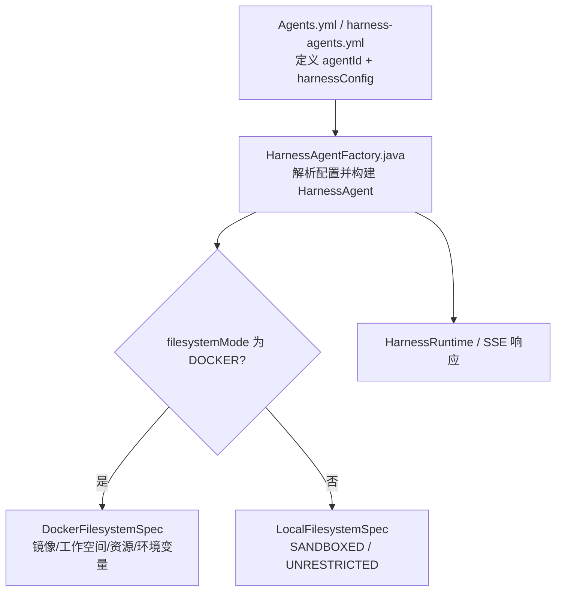
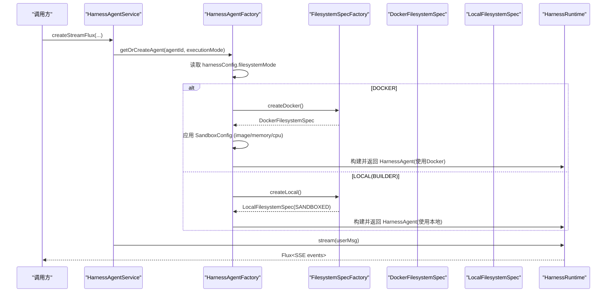
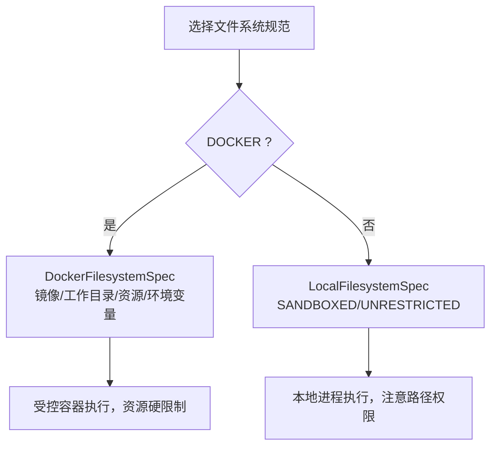
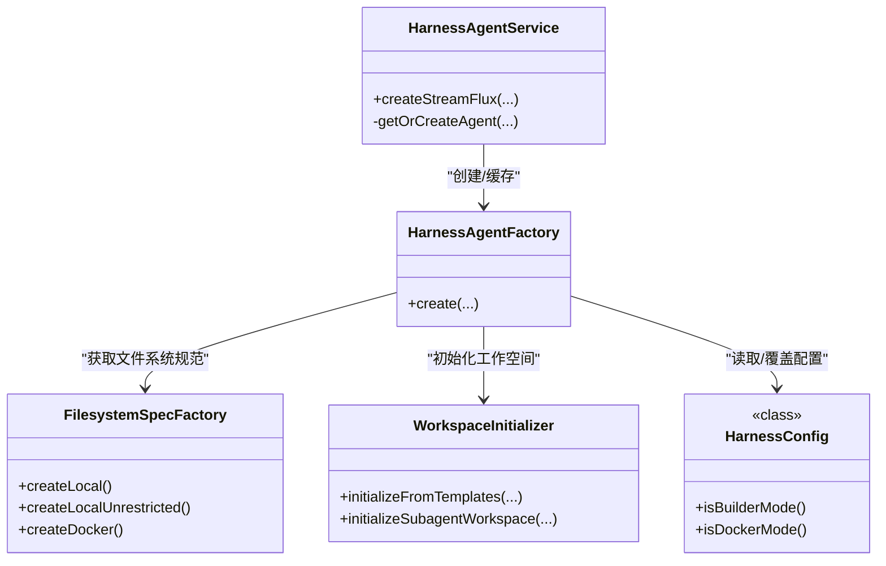

# 沙箱环境隔离

<cite>
**本文引用的文件**
- [FilesystemSpecFactory.java](file://src/main/java/com/skloda/agentscope/harness/FilesystemSpecFactory.java)
- [HarnessConfig.java](file://src/main/java/com/skloda/agentscope/agent/HarnessConfig.java)
- [HarnessAgentFactory.java](file://src/main/java/com/skloda/agentscope/harness/HarnessAgentFactory.java)
- [HarnessAgentService.java](file://src/main/java/com/skloda/agentscope/harness/HarnessAgentService.java)
- [WorkspaceInitializer.java](file://src/main/java/com/skloda/agentscope/harness/WorkspaceInitializer.java)
- [harness-agents.yml](file://src/main/resources/config/harness-agents.yml)
- [agents.yml](file://src/main/resources/config/agents.yml)
</cite>

## 目录
1. [引言](#引言)
2. [项目结构](#项目结构)
3. [核心组件](#核心组件)
4. [架构总览](#架构总览)
5. [详细组件分析](#详细组件分析)
6. [依赖关系分析](#依赖关系分析)
7. [性能与安全考量](#性能与安全考量)
8. [故障排查指南](#故障排查指南)
9. [结论](#结论)

## 引言
本章节聚焦于 AgentScope Demo 中基于 Docker 的沙箱运行能力，解释如何通过文件系统抽象与容器化隔离实现安全、可控的 Agent 执行环境。重点覆盖：
- 容器隔离机制（进程、网络、资源限制）
- 文件系统访问控制与工作目录映射
- LocalFilesystemSpec 与 DockerFilesystemSpec 的实现差异
- 镜像管理、工作目录、权限策略、内存/CPU 资源限流配置
- 安全最佳实践（最小权限、只读文件系统、敏感信息防护）
- 故障排查（启动失败、权限拒绝、资源超限等）

## 项目结构
本项目的沙箱能力由 harness 层提供，围绕“文件系统抽象”将本地模式与 Docker 模式统一接入到 HarnessAgent 的构建流程中，并通过配置驱动切换。

图表来源
- [HarnessAgentFactory.java:42-103](file://src/main/java/com/skloda/agentscope/harness/HarnessAgentFactory.java#L42-L103)
- [FilesystemSpecFactory.java:17-46](file://src/main/java/com/skloda/agentscope/harness/FilesystemSpecFactory.java#L17-L46)
- [agents.yml:1888-1896](file://src/main/resources/config/agents.yml#L1888-L1896)

章节来源
- [agents.yml:1888-1896](file://src/main/resources/config/agents.yml#L1888-L1896)
- [FilesystemSpecFactory.java:17-46](file://src/main/java/com/skloda/agentscope/harness/FilesystemSpecFactory.java#L17-L46)

## 核心组件
- FilesystemSpecFactory：负责根据运行需求创建不同的文件系统规范（本地受限/不限/容器）。
- HarnessAgentFactory：统一装配 HarnessAgent，依据 filesystemMode 选择 Docker 或本地文件系统，并支持 SandboxConfig 覆盖默认值。
- HarnessConfig.HarnessConfig.SandboxConfig：集中定义容器镜像、内存、CPU 等运行时约束。
- HarnessAgentService：会话级入口，负责建立运行上下文与流式输出。
- WorkspaceInitializer：初始化智能体的工作空间模板，确保执行前具备必要结构。

章节来源
- [FilesystemSpecFactory.java:17-46](file://src/main/java/com/skloda/agentscope/harness/FilesystemSpecFactory.java#L17-L46)
- [HarnessAgentFactory.java:42-103](file://src/main/java/com/skloda/agentscope/harness/HarnessAgentFactory.java#L42-L103)
- [HarnessConfig.java:63-69](file://src/main/java/com/skloda/agentscope/agent/HarnessConfig.java#L63-L69)
- [HarnessAgentService.java:37-63](file://src/main/java/com/skloda/agentscope/harness/HarnessAgentService.java#L37-L63)
- [WorkspaceInitializer.java:18-51](file://src/main/java/com/skloda/agentscope/harness/WorkspaceInitializer.java#L18-L51)

## 架构总览
下面的架构图展示了从请求到沙箱运行的关键链路：用户请求经服务层进入后，通过工厂类解析配置，按 filesystemMode 选择合适的文件系统实现（本地 vs Docker），并由框架驱动实际运行（在 Docker 内以独立进程方式执行 Python 工具脚本等）。

图表来源
- [HarnessAgentService.java:37-63](file://src/main/java/com/skloda/agentscope/harness/HarnessAgentService.java#L37-L63)
- [HarnessAgentFactory.java:42-103](file://src/main/java/com/skloda/agentscope/harness/HarnessAgentFactory.java#L42-L103)
- [FilesystemSpecFactory.java:17-46](file://src/main/java/com/skloda/agentscope/harness/FilesystemSpecFactory.java#L17-L46)

章节来源
- [HarnessAgentService.java:37-63](file://src/main/java/com/skloda/agentscope/harness/HarnessAgentService.java#L37-L63)
- [HarnessAgentFactory.java:42-103](file://src/main/java/com/skloda/agentscope/harness/HarnessAgentFactory.java#L42-L103)

## 详细组件分析

### 1) Docker 容器隔离机制（总体）
- 进程与网络：容器内执行 Python 运行时和 Agent/工具逻辑，宿主与其隔离；本项目未显式启用只读根文件系统或禁用网络端口暴露，容器隔离主要依赖 Docker 自身。
- 资源限制：通过 memorySizeBytes 与 cpuCount 控制容器可用内存与 CPU 份额；默认 2GiB 内存、2 核。
- 工作目录映射：workspaceRoot 指定容器内统一工作空间路径，便于工具脚本读写数据。
- 环境变量注入：例如设置 PYTHONUNBUFFERED=1 与 TZ=Asia/Shanghai，确保日志缓冲与时区一致性。

章节来源
- [FilesystemSpecFactory.java:34-46](file://src/main/java/com/skloda/agentscope/harness/FilesystemSpecFactory.java#L34-L46)
- [HarnessAgentFactory.java:81-99](file://src/main/java/com/skloda/agentscope/harness/HarnessAgentFactory.java#L81-L99)
- [HarnessConfig.java:63-69](file://src/main/java/com/skloda/agentscope/agent/HarnessConfig.java#L63-L69)

### 2) LocalFilesystemSpec vs DockerFilesystemSpec 实现差异
- LocalFilesystemSpec（本地模式）
  - SANDBOXED：对执行进行基础时间/输出大小等限制，项目目录位于宿主临时目录下。
  - UNRESTRICTED：更高自由度执行，适合开发调试场景。
  - 优点：低开销；风险：直接访问宿主机文件系统，需配合白名单/最小权限。
- DockerFilesystemSpec（容器模式）
  - 通过 client 封装与容器引擎交互；image 指定运行镜像；workspaceRoot 指定容器内工作路径。
  - 支持 memorySizeBytes、cpuCount 等资源限制；可注入 environment 变量；可选 snapshot 策略（本实现 NoopSnapshotSpec）。
  - 优点：强隔离；成本：镜像下载与容器生命周期开销。

图表来源
- [FilesystemSpecFactory.java:17-46](file://src/main/java/com/skloda/agentscope/harness/FilesystemSpecFactory.java#L17-L46)

章节来源
- [FilesystemSpecFactory.java:17-46](file://src/main/java/com/skloda/agentscope/harness/FilesystemSpecFactory.java#L17-L46)

### 3) 镜像管理与工作目录映射
- 镜像管理
  - 默认镜像为 python:3.11-slim，可通过 harnessConfig.sandbox.image 覆盖，适配不同依赖与环境。
  - 首次拉取可能耗时，建议在 CI/CD 阶段预拉镜像并缓存到集群或节点。
- 工作目录
  - 容器内统一 workspaceRoot（默认 /workspace），用于写入中间产物，确保可复用与易定位。
  - 本地模式的工作目录由 FilesystemSpec 工厂创建路径决定（如 /tmp 下子目录）。

章节来源
- [FilesystemSpecFactory.java:34-46](file://src/main/java/com/skloda/agentscope/harness/FilesystemSpecFactory.java#L34-L46)
- [HarnessAgentFactory.java:81-99](file://src/main/java/com/skloda/agentscope/harness/HarnessAgentFactory.java#L81-L99)
- [HarnessConfig.java:63-69](file://src/main/java/com/skloda/agentscope/agent/HarnessConfig.java#L63-L69)

### 4) 文件权限控制策略
- 容器内：建议遵循最小权限原则，仅授予执行需要的文件路径读写权。可结合只读根文件系统+可写卷的方式提高安全性。
- 本地模式：
  - SANDBOXED：限制执行范围，但仍能接触宿主文件系统，需限定 project 路径并严格校验输入。
  - UNRESTRICTED：适用于可信环境，需自行做好边界管控。

章节来源
- [FilesystemSpecFactory.java:17-33](file://src/main/java/com/skloda/agentscope/harness/FilesystemSpecFactory.java#L17-L33)
- [WorkspaceInitializer.java:18-51](file://src/main/java/com/skloda/agentscope/harness/WorkspaceInitializer.java#L18-L51)

### 5) 内存/CPU 资源限制配置
- 容器资源由 SandboxConfig 覆盖默认值：
  - image: 容器镜像
  - memorySizeBytes: 默认 2GiB
  - cpuCount: 默认 2
- 这些值经由 FilesystemSpecFactory.createDocker 设定并在 HarnessAgentFactory 中按配置覆盖，最终由容器运行时生效。

章节来源
- [HarnessConfig.java:63-69](file://src/main/java/com/skloda/agentscope/agent/HarnessConfig.java#L63-L69)
- [FilesystemSpecFactory.java:34-46](file://src/main/java/com/skloda/agentscope/harness/FilesystemSpecFactory.java#L34-L46)
- [agents.yml:1888-1896](file://src/main/resources/config/agents.yml#L1888-L1896)

### 6) 配置驱动的运行模式
- agents.yml/harness-agents.yml 中通过 filesystemMode: LOCAL 或 DOCKER 驱动实际运行时。
- 示例：存在一个 agent 将 filesystemMode 设为 DOCKER，并声明 sandbox 镜像与资源上限，体现多租户下的隔离需求。

章节来源
- [agents.yml:1888-1896](file://src/main/resources/config/agents.yml#L1888-L1896)
- [harness-agents.yml:11-28](file://src/main/resources/config/harness-agents.yml#L11-L28)

## 依赖关系分析
下图展示关键类的协作关系：Service 负责入口调度，Factory 负责组装 Agent，FilesystemSpecFactory 提供文件系统规格，WorkspaceInitializer 提供模板初始化。

图表来源
- [HarnessAgentService.java:37-76](file://src/main/java/com/skloda/agentscope/harness/HarnessAgentService.java#L37-L76)
- [HarnessAgentFactory.java:42-103](file://src/main/java/com/skloda/agentscope/harness/HarnessAgentFactory.java#L42-L103)
- [FilesystemSpecFactory.java:17-46](file://src/main/java/com/skloda/agentscope/harness/FilesystemSpecFactory.java#L17-L46)
- [WorkspaceInitializer.java:18-51](file://src/main/java/com/skloda/agentscope/harness/WorkspaceInitializer.java#L18-L51)
- [HarnessConfig.java:40-69](file://src/main/java/com/skloda/agentscope/agent/HarnessConfig.java#L40-L69)

章节来源
- [HarnessAgentService.java:37-76](file://src/main/java/com/skloda/agentscope/harness/HarnessAgentService.java#L37-L76)
- [HarnessAgentFactory.java:42-103](file://src/main/java/com/skloda/agentscope/harness/HarnessAgentFactory.java#L42-L103)
- [FilesystemSpecFactory.java:17-46](file://src/main/java/com/skloda/agentscope/harness/FilesystemSpecFactory.java#L17-L46)
- [WorkspaceInitializer.java:18-51](file://src/main/java/com/skloda/agentscope/harness/WorkspaceInitializer.java#L18-L51)
- [HarnessConfig.java:40-69](file://src/main/java/com/skloda/agentscope/agent/HarnessConfig.java#L40-L69)

## 性能与安全考量
- 性能
  - Docker 模式首次镜像拉取与容器启动会带来延迟，建议镜像预热、使用轻量 base image（如 slim）、减少不必要的系统包安装。
  - 合理设置执行超时与最大输出字节数，避免慢任务阻塞资源池。
  - 本地模式下若无需强隔离，可降低启动代价，但必须加强权限与输入校验。
- 安全
  - 最小权限：仅在必要时授予写权限；将只读目录挂载为只读卷，避免篡改。
  - 只读根文件系统：尽可能将容器根文件系统设为只读，并将必要的可变目录挂载为可写卷，降低攻击面。
  - 敏感信息保护：避免在镜像或容器中硬编码密钥；优先通过环境变量或受信任密钥管理服务注入。
  - 网络限制：如需禁止外部网络，可通过容器网络策略进一步收敛。
  - 输入净化：对来自用户的文件路径/参数做严格校验，防止路径穿越或恶意脚本。

[本节为通用指导，不直接引用具体源码]

## 故障排查指南
- 容器启动失败
  - 现象：无法创建容器、镜像拉取失败、权限拒绝
  - 排查要点：
    - 确认 docker 守护进程状态及宿主机磁盘空间
    - 验证镜像是否存在或可被拉取（如 python:3.11-slim）
    - 检查是否已授予足够的权限（Linux 上访问 /var/run/docker.sock 的权限）
  - 参考点：
    - 镜像与默认资源配置：[FilesystemSpecFactory.java:34-46](file://src/main/java/com/skloda/agentscope/harness/FilesystemSpecFactory.java#L34-L46)
    - 配置注入位置（SandboxConfig）：[HarnessAgentFactory.java:81-99](file://src/main/java/com/skloda/agentscope/harness/HarnessAgentFactory.java#L81-L99)
- 权限拒绝（Permission Denied）
  - 现象：容器内脚本无法写入工作目录或被拒绝访问某些路径
  - 排查要点：
    - 确认 workspaceRoot 指向的路径存在且可写
    - 本地模式需核对 SANDBOXED 模式的目录边界与目标 project 路径
    - 如启用了只读根文件系统，确认可写卷挂载正确
  - 参考点：
    - 本地文件系统规范（受限/非受限）：[FilesystemSpecFactory.java:17-33](file://src/main/java/com/skloda/agentscope/harness/FilesystemSpecFactory.java#L17-L33)
    - 工作空间模板初始化：[WorkspaceInitializer.java:18-51](file://src/main/java/com/skloda/agentscope/harness/WorkspaceInitializer.java#L18-L51)
- 资源超限（Out of Memory / CPU Throttling）
  - 现象：容器 OOM Kill、任务被限速导致超时
  - 排查要点：
    - 调大 SandboxConfig.memorySizeBytes 与 cpuCount
    - 检查 Agent 输出的大小限制与执行超时设置
    - 对长耗时任务拆分或使用外部存储加速
  - 参考点：
    - 资源限制字段与默认值：[HarnessConfig.java:63-69](file://src/main/java/com/skloda/agentscope/agent/HarnessConfig.java#L63-L69)
    - 默认资源与镜像参数：[FilesystemSpecFactory.java:34-46](file://src/main/java/com/skloda/agentscope/harness/FilesystemSpecFactory.java#L34-L46)
- 流式输出/连接问题
  - 现象：事件断流、错误信息未返回
  - 排查要点：
    - 查看异常捕获与 SSE 返回（服务层会包装错误信息）
  - 参考点：
    - 服务层异常捕获与回传：[HarnessAgentService.java:37-63](file://src/main/java/com/skloda/agentscope/harness/HarnessAgentService.java#L37-L63)

章节来源
- [FilesystemSpecFactory.java:17-46](file://src/main/java/com/skloda/agentscope/harness/FilesystemSpecFactory.java#L17-L46)
- [HarnessAgentFactory.java:81-99](file://src/main/java/com/skloda/agentscope/harness/HarnessAgentFactory.java#L81-L99)
- [HarnessConfig.java:63-69](file://src/main/java/com/skloda/agentscope/agent/HarnessConfig.java#L63-L69)
- [WorkspaceInitializer.java:18-51](file://src/main/java/com/skloda/agentscope/harness/WorkspaceInitializer.java#L18-L51)
- [HarnessAgentService.java:37-63](file://src/main/java/com/skloda/agentscope/harness/HarnessAgentService.java#L37-L63)

## 结论
本项目通过文件系统抽象将“本地受限/开放”与“Docker 容器化”两种执行范式统一到 HarnessAgent 的构建链路中，并以 YAML 配置灵活切换。容器模式凭借进程与资源隔离满足生产安全诉求，本地模式便于快速开发与迭代。通过严格的权限控制、只读根文件系统、最小镜像与敏感信息管理等实践，可有效降低安全风险并提升稳定性。针对常见故障，可从镜像、权限、资源三大维度逐步定位与修复。