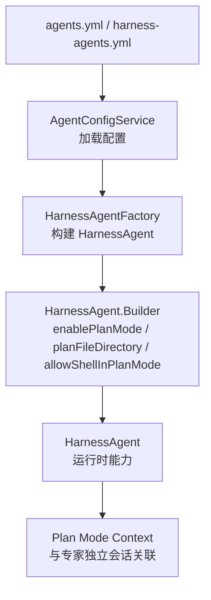
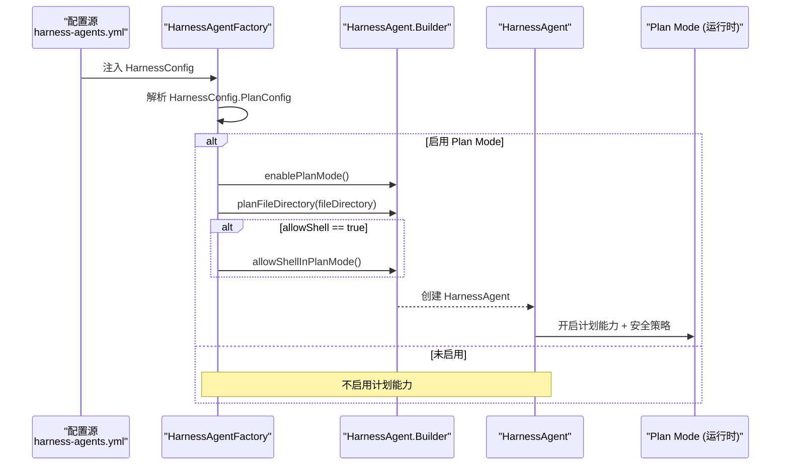
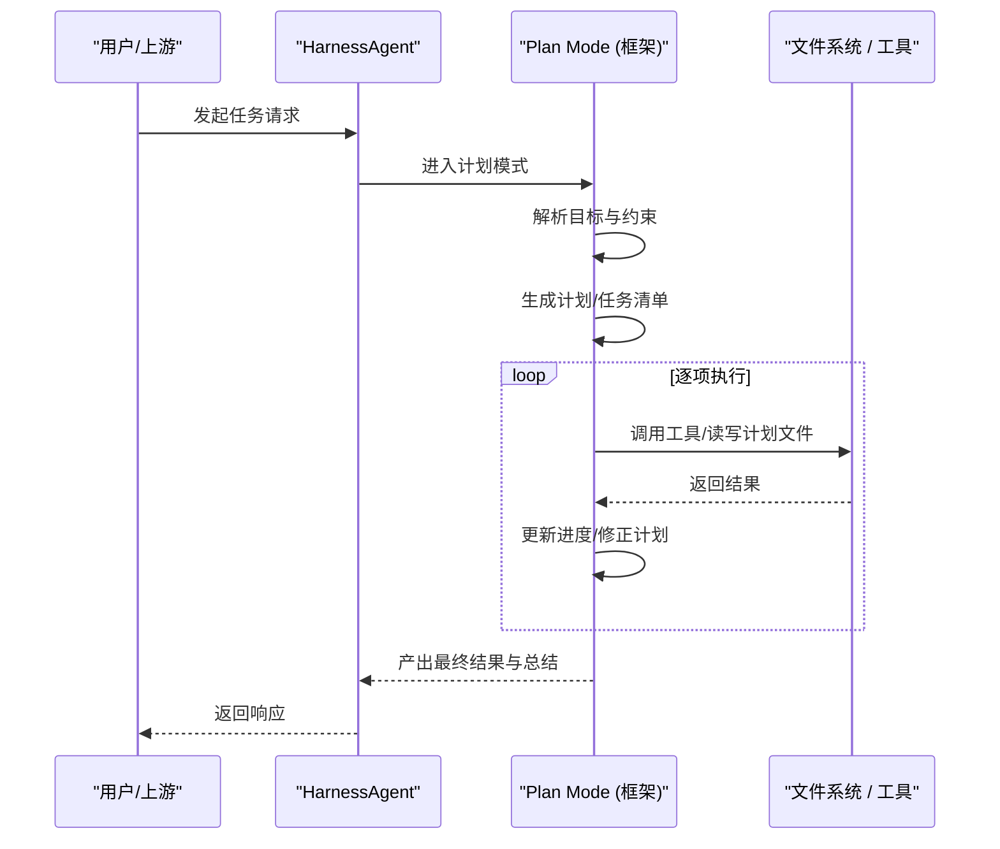
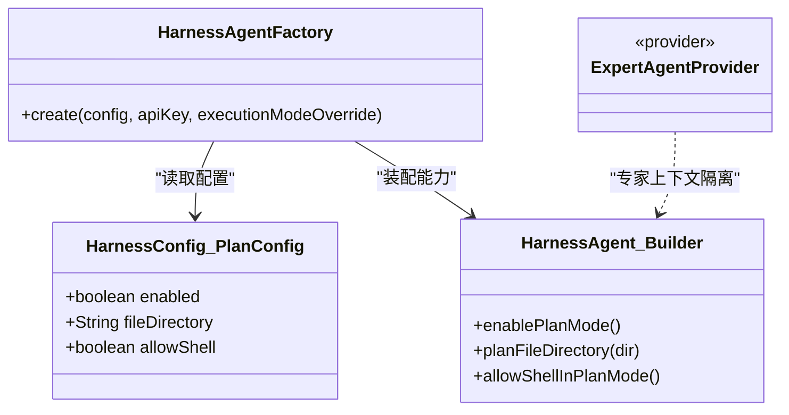

# Plan Mode 任务规划

<cite>
**本文引用的文件**
- [HarnessConfig.java](file://src/main/java/com/skloda/agentscope/agent/HarnessConfig.java)
- [HarnessAgentFactory.java](file://src/main/java/com/skloda/agentscope/harness/HarnessAgentFactory.java)
- [AgentConfig.java](file://src/main/java/com/skloda/agentscope/agent/AgentConfig.java)
- [ExpertAgentProvider.java](file://src/main/java/com/skloda/agentscope/blackboard/ExpertAgentProvider.java)
- [supervisor-shared-blackboard-design.md](file://docs/supervisor-shared-blackboard-design.md)
- [application.yml](file://src/main/resources/application.yml)
- [harness-agents.yml](file://src/main/resources/config/harness-agents.yml)
</cite>

## 目录
1. [简介](#简介)
2. [项目结构](#项目结构)
3. [核心组件](#核心组件)
4. [架构总览](#架构总览)
5. [详细组件分析](#详细组件分析)
6. [依赖关系分析](#依赖关系分析)
7. [性能考虑](#性能考虑)
8. [故障排除指南](#故障排除指南)
9. [结论](#结论)
10. [附录：配置与用例](#附录配置与用例)

## 简介
Plan Mode（计划模式）是 Harness Agent 在复杂、多步骤任务执行场景下提供“先计划、再执行”的能力。它通过结构化规划文档与工具链协作，实现任务分解、依赖分析与顺序执行；结合 Task List 等能力，可将计划以可追踪的任务清单形式呈现与推进。该仓库在 Harness 构建阶段支持读取计划模式的配置项（启用、计划文件存储目录、是否允许 Shell），并在运行时注入对应的上下文与能力开关。

## 项目结构
本次关注的代码主要位于以下位置：
- 配置模型：HarnessConfig.PlanConfig 描述计划模式的可用开关与默认行为
- 工厂组装：HarnessAgentFactory 根据 HarnessConfig 调用 HarnessAgent.Builder 开启 Plan Mode
- 专家上下文隔离：ExpertAgentProvider 将 PlanModeContext 作为专家私有上下文的一部分进行隔离
- 设计文档：supervisor-shared-blackboard-design.md 中对 PlanModeContext 的归属与生命周期有说明



图示来源
- [HarnessAgentFactory.java:127-141](file://src/main/java/com/skloda/agentscope/harness/HarnessAgentFactory.java#L127-L141)
- [HarnessConfig.java:71-77](file://src/main/java/com/skloda/agentscope/agent/HarnessConfig.java#L71-L77)
- [ExpertAgentProvider.java:27-29](file://src/main/java/com/skloda/agentscope/blackboard/ExpertAgentProvider.java#L27-L29)
- [supervisor-shared-blackboard-design.md:26](file://docs/supervisor-shared-blackboard-design.md#L26)

章节来源
- [HarnessConfig.java:11-38](file://src/main/java/com/skloda/agentscope/agent/HarnessConfig.java#L11-L38)
- [HarnessAgentFactory.java:121-141](file://src/main/java/com/skloda/agentscope/harness/HarnessAgentFactory.java#L121-L141)
- [ExpertAgentProvider.java:27-84](file://src/main/java/com/skloda/agentscope/blackboard/ExpertAgentProvider.java#L27-L84)
- [supervisor-shared-blackboard-design.md:26](file://docs/supervisor-shared-blackboard-design.md#L26)

## 核心组件
- HarnessConfig.PlanConfig
  - enabled：是否启用 Plan Mode（默认 false）
  - fileDirectory：计划文件存储目录（默认 "plans"）。注意字段名为 fileDirectory，并非 planFileDirectory
  - allowShell：在执行计划时是否允许调用 Shell 命令（默认 false）

- HarnessAgentFactory
  - 当检测到 HarnessConfig.PlanConfig.enabled == true 时，按如下顺序设置 Builder：
    - enablePlanMode()
    - planFileDirectory(...)（当配置非空）
    - allowShellInPlanMode()（当 allowShell == true）
  - 打印日志记录 dir 与 allowShell 有效值，便于排障

- ExpertAgentProvider 与 Supervisor Blackboard
  - 专家上下文包含 PlanModeContext，且与 Supervisor 会话状态隔离，确保专家私有计划上下文不泄漏到其他会话或轮次中

章节来源
- [HarnessConfig.java:71-77](file://src/main/java/com/skloda/agentscope/agent/HarnessConfig.java#L71-L77)
- [HarnessAgentFactory.java:127-141](file://src/main/java/com/skloda/agentscope/harness/HarnessAgentFactory.java#L127-L141)
- [ExpertAgentProvider.java:27-84](file://src/main/java/com/skloda/agentscope/blackboard/ExpertAgentProvider.java#L27-L84)
- [supervisor-shared-blackboard-design.md:26](file://docs/supervisor-shared-blackboard-design.md#L26)

## 架构总览
Plan Mode 的能力由 HarnessAgent 暴露，应用侧通过 HarnessAgentFactory 基于 HarnessConfig 启用。配置生效后，Agent 在运行期获得计划相关的工具、持久化目录与安全策略（如 shell 开关）以及独立的计划上下文。下图展示了从配置到运行期的装配流程。



图示来源
- [HarnessConfig.java:71-77](file://src/main/java/com/skloda/agentscope/agent/HarnessConfig.java#L71-L77)
- [HarnessAgentFactory.java:127-141](file://src/main/java/com/skloda/agentscope/harness/HarnessAgentFactory.java#L127-L141)

## 详细组件分析

### PlanConfig 配置详解
- enabled
  - 作用：控制是否对当前 Agent 开启计划能力
  - 默认：false
  - 触发行为：在 HarnessAgentFactory 中通过 enablePlanMode() 打开计划模式

- fileDirectory
  - 作用：指定计划文件的存储根目录
  - 默认："plans"
  - 装配：当配置非空时写入 builder.planFileDirectory(...)
  - 说明：字段名为 fileDirectory，不是 planFileDirectory

- allowShell
  - 作用：在执行计划时是否允许调用 Shell 命令（安全边界）
  - 默认：false（生产环境建议保持关闭）
  - 装配：仅当为真时调用 allowShellInPlanMode()

章节来源
- [HarnessConfig.java:71-77](file://src/main/java/com/skloda/agentscope/agent/HarnessConfig.java#L71-L77)
- [HarnessAgentFactory.java:127-141](file://src/main/java/com/skloda/agentscope/harness/HarnessAgentFactory.java#L127-L141)

### 装配与生命周期（创建→验证→执行→结果）
- 创建：HarnessAgentFactory 构造 HarnessAgent 时检查 HarnessConfig.PlanConfig
- 验证：Builder 会在内部完成计划能力的初始校验（例如路径有效性、安全策略），本仓库通过日志输出关键开关信息用于定位问题
- 执行：开启后，Agent 在执行链路中使用计划相关工具，产出并维护计划文档与任务列表
- 结果追踪：计划相关的执行事件将通过统一事件流对外暴露（由框架层处理），本仓库通过事件映射与前端渲染展示

章节来源
- [HarnessAgentFactory.java:127-141](file://src/main/java/com/skloda/agentscope/harness/HarnessAgentFactory.java#L127-L141)
- [ExpertAgentProvider.java:27-84](file://src/main/java/com/skloda/agentscope/blackboard/ExpertAgentProvider.java#L27-L84)
- [supervisor-shared-blackboard-design.md:210](file://docs/supervisor-shared-blackboard-design.md#L210)

### 执行流程（算法原理视角）
以下为基于现有装配逻辑推导的计划执行时序图。实际计划生成与子任务编排由 AgentScope 框架内置能力完成；本仓库负责装配与开关。



[此图为概念性流程图，展示典型计划生命周期；具体实现细节受框架能力约束]

### 专家上下文与隔离
- 专家级别的 PlanModeContext 属于专家私有序列上下文的一部分，随专家生命周期存在，不会泄漏给 Supervisor 或其他专家
- 这保证了不同任务/专家在计划层面的隔离性与幂等性

章节来源
- [ExpertAgentProvider.java:27-84](file://src/main/java/com/skloda/agentscope/blackboard/ExpertAgentProvider.java#L27-L84)
- [supervisor-shared-blackboard-design.md:26](file://docs/supervisor-shared-blackboard-design.md#L26)

### 与其他能力的组合
- Task List：Plan Mode 与 Task List 能力天然互补，计划被切分为可追踪任务
- 分层 Memory：可与 MemoryConfig 配合，将计划产物、历史执行摘要沉淀至持久化记忆
- 权限/中间件：可通过 PermissionConfig 和 Middleware 对计划中的高敏操作进行拦截或审批

章节来源
- [HarnessAgentFactory.java:121-177](file://src/main/java/com/skloda/agentscope/harness/HarnessAgentFactory.java#L121-L177)

## 依赖关系分析
- HarnessConfig.PlanConfig → HarnessAgentFactory → HarnessAgent.Builder
- 运行时 PlanModeContext 随专家会话管理，不跨会话泄漏
- application.yml 定义全局运行参数（不影响 PlanConfig 的结构，但影响整体运行环境）



图示来源
- [HarnessConfig.java:71-77](file://src/main/java/com/skloda/agentscope/agent/HarnessConfig.java#L71-L77)
- [HarnessAgentFactory.java:127-141](file://src/main/java/com/skloda/agentscope/harness/HarnessAgentFactory.java#L127-L141)
- [ExpertAgentProvider.java:27-84](file://src/main/java/com/skloda/agentscope/blackboard/ExpertAgentProvider.java#L27-L84)

章节来源
- [HarnessConfig.java:71-77](file://src/main/java/com/skloda/agentscope/agent/HarnessConfig.java#L71-L77)
- [HarnessAgentFactory.java:127-141](file://src/main/java/com/skloda/agentscope/harness/HarnessAgentFactory.java#L127-L141)
- [ExpertAgentProvider.java:27-84](file://src/main/java/com/skloda/agentscope/blackboard/ExpertAgentProvider.java#L27-L84)

## 性能考虑
- 计划粒度：过细的子任务会放大 I/O 与 LLM 调用开销；建议在业务侧引导生成适中粒度的步骤
- Shell 能力：allowShell=true 可能带来系统调用开销与安全扫描成本，生产应谨慎开启
- 目录策略：fileDirectory 建议使用独立挂载盘以提升磁盘 I/O；避免与高频缓存目录混用
- 并发与锁：若存在多任务并行写计划文件的场景，需在外部保证互斥或落盘幂等
- 记忆协同：与分层 Memory 配合时，关注 consolidation 频率与 token 预算

[本节为通用性能建议，不直接引用具体源码行]

## 故障排除指南
- 现象：日志中出现计划目录或 allowShell 信息，但与预期不一致
  - 排查：确认 YAML 中 harnessConfig.plan.enabled/fileDirectory/allowShell 是否正确；观察 HarnessAgentFactory 对应日志段
- 现象：Shell 未被允许或意外被拒绝
  - 排查：检查 allowShell 是否为 true；必要时结合审批中间件调整
- 现象：专家间计划上下文串扰
  - 排查：确认是否在同一会话/专家上下文中操作；PlanModeContext 与 Supervisor 会话状态是隔离的

章节来源
- [HarnessAgentFactory.java:127-141](file://src/main/java/com/skloda/agentscope/harness/HarnessAgentFactory.java#L127-L141)
- [ExpertAgentProvider.java:27-84](file://src/main/java/com/skloda/agentscope/blackboard/ExpertAgentProvider.java#L27-L84)
- [supervisor-shared-blackboard-design.md:210](file://docs/supervisor-shared-blackboard-design.md#L210)

## 结论
- Plan Mode 通过 HarnessConfig.PlanConfig 实现“开关可控”的计划能力接入
- 默认安全策略保守：需显式开启才生效；allowShell 默认关闭
- 计划文件目录、Shell 开关在工厂装配阶段即确定，便于前置审计与监控
- 建议在生产环境结合审批中间件与最小权限原则，分步放开高风险能力

[本节为总结性内容，不引用具体源码]

## 附录：配置与用例

### 配置选项对照表
- enabled：布尔，是否启用 Plan Mode，默认 false
- fileDirectory：字符串，计划文件存储目录，默认 "plans"
- allowShell：布尔，是否允许在执行计划时调用 Shell，默认 false

提示：字段名是 fileDirectory，不是 planFileDirectory；后者是 Builder 方法名。

章节来源
- [HarnessConfig.java:71-77](file://src/main/java/com/skloda/agentscope/agent/HarnessConfig.java#L71-L77)
- [HarnessAgentFactory.java:127-141](file://src/main/java/com/skloda/agentscope/harness/HarnessAgentFactory.java#L127-L141)

### 示例：在 YAML 中为某个 Harness Agent 启用 Plan Mode
```yaml
agents:
  - agentId: your-harness-agent
    type: HARNESS
    harnessConfig:
      executionMode: ...          # 根据需要选择 CLAW / BUILDER
      plan:
        enabled: true
        fileDirectory: plans     # 自定义计划存放目录
        allowShell: false        # 按需开启
```
说明：
- 仅当 enabled 为 true 时，工厂才会进入计划模式装配流程
- fileDirectory 会被写入计划模块的文件系统根路径
- allowShell 决定是否在执行计划过程中放行 Shell 命令

章节来源
- [HarnessAgentFactory.java:127-141](file://src/main/java/com/skloda/agentscope/harness/HarnessAgentFactory.java#L127-L141)

### 示例场景
- 复杂工作流自动化：计划拆分采集→清洗→建模→报告生成各阶段，子步骤串行/半并行执行，失败可重试与局部回滚
- 多步骤文档处理：将 PDF/Docx/Xlsx 解析→抽取→归档→索引→通知形成闭环，计划文档承载数据契约与变更日志
- 合规与安全：通过审批中间件对危险步骤（如删除/重命名）前置拦截，并结合 allowShell=false 限制系统命令调用范围

[场景为概念说明，不直接映射到特定源码]

### 运维与环境
- 依赖注入：无需新增类；通过现有 HarnessAgentFactory 装配
- 运行时参数：application.yml 控制全局行为；Plan Mode 开关在 agents/harness-agents.yml 层面更贴合单 Agent 维度
- 诊断：关注 HarnessAgentFactory 关于 Plan Mode 的日志，快速确认 dir 与 allowShell 取值

章节来源
- [application.yml](file://src/main/resources/application.yml)
- [harness-agents.yml](file://src/main/resources/config/harness-agents.yml)
- [HarnessAgentFactory.java:127-141](file://src/main/java/com/skloda/agentscope/harness/HarnessAgentFactory.java#L127-L141)