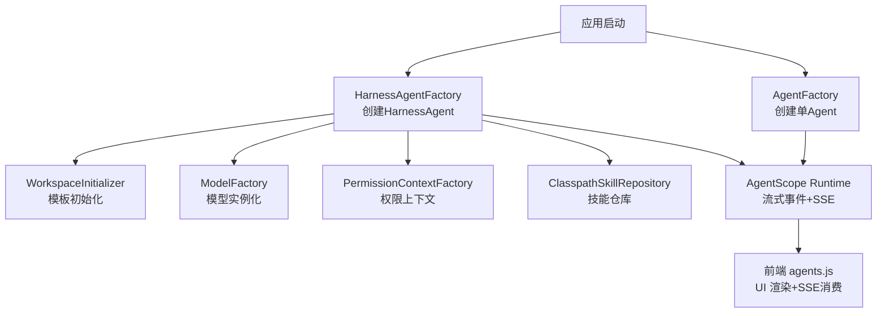
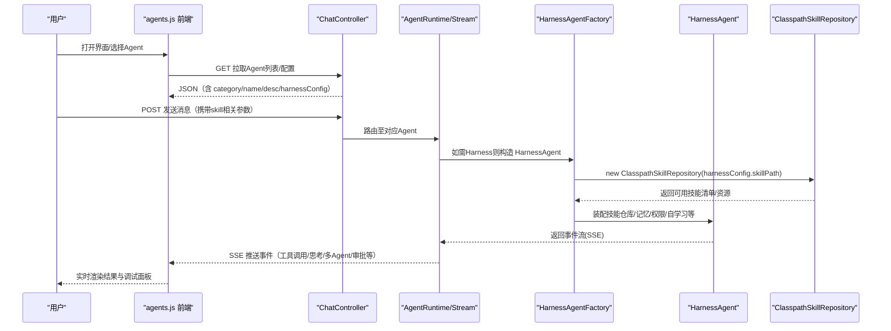
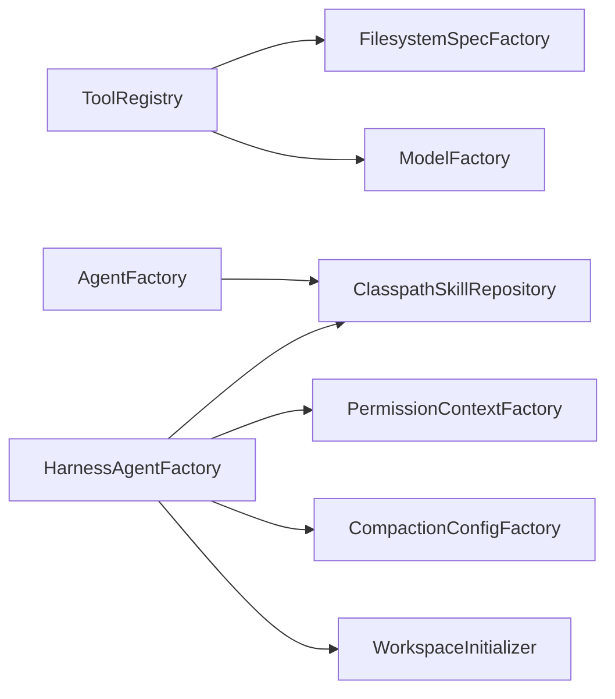

# Skill 学习系统

<cite>
**本文引用的文件 **
- [pom.xml](file://pom.xml)
- [README.md](file://README.md)
- [ClasspathSkillRepositoryTest.java](file://src/test/java/com/skloda/agentscope/ClasspathSkillRepositoryTest.java)
- [JarEnvironmentDiagnostic.java](file://src/main/java/com/skloda/agentscope/config/JarEnvironmentDiagnostic.java)
- [SkillFileSystemHelperDiagnosticRunner.java](file://src/main/java/com/skloda/agentscope/config/SkillFileSystemHelperDiagnosticRunner.java)
- [CorrectSkillDiagnostic.java](file://src/main/java/com/skloda/agentscope/config/CorrectSkillDiagnostic.java)
- [ToolRegistry.java](file://src/main/java/com/skloda/agentscope/tool/ToolRegistry.java)
- [AgentFactory.java](file://src/main/java/com/skloda/agentscope/agent/AgentFactory.java)
- [HarnessAgentFactory.java](file://src/main/java/com/skloda/agentscope/harness/HarnessAgentFactory.java)
- [HarnessConfig.java](file://src/main/java/com/skloda/agentscope/agent/HarnessConfig.java)
- [SKILL.md (docx)](file://src/main/resources/skills/docx/SKILL.md)
- [SKILL.md (pdf)](file://src/main/resources/skills/pdf/SKILL.md)
- [SKILL.md (xlsx)](file://src/main/resources/skills/xlsx/SKILL.md)
- [SKILL.md (bank_invoice_java)](file://src/main/resources/skills/bank_invoice_java/SKILL.md)
- [agents.js](file://src/main/resources/static/scripts/modules/agents.js)
</cite>

## 目录
1. [简介](#简介)
2. [项目结构](#项目结构)
3. [核心组件](#核心组件)
4. [架构总览](#架构总览)
5. [详细组件分析](#详细组件分析)
6. [依赖关系分析](#依赖关系分析)
7. [性能考量](#性能考量)
8. [故障排查指南](#故障排查指南)
9. [结论](#结论)
10. [附录](#附录)

## 简介
本文件面向“Skill 学习系统”的技术实现，聚焦以下目标：
- 深入解释技能发现机制：ClasspathSkillRepository 的使用、在 JAR 环境下的行为与扩展方式；
- 详细说明技能评估算法：结合 ToolRegistry 的 SKILL.md frontmatter 解析、技能到工具的映射与“匹配度/可用性”判断；
- 版本管理与动态升级：基于 harness 的工作区（workspace）隔离、模板初始化、Curator 过期归档策略；
- 动态加载机制：运行时通过 SkillRepository 和 Harness 配置启用技能，支持热插拔与不中断现有功能；
- 企业场景：专业技能库管理、知识共享生态、智能推荐（以技能元数据驱动的提示增强）；
- 安全与审计：权限上下文、HITL 审批中间件、可观测性埋点；
- 前端交互：agents.js 对 agent/skill 管理界面的组织与交互。

[无具体源码文件直接分析引用]

## 项目结构
- 后端（Java/Spring Boot + AgentScope 2.x）：围绕 Agent 运行期、工具注册、技能发现（ClasspathSkillRepository）、Harness 工作空间与技能自学习生命周期构成体系；
- 资源层：skills 目录中的每个子目录是一个技能单元，包含 SKILL.md 描述与可选 assets/scripts 等资源；
- 前端：静态资源 scripts 模块化，提供 agent 列表渲染、选择、配置展示等交互逻辑。

图表来源
- [AgentFactory.java](file://src/main/java/com/skloda/agentscope/agent/AgentFactory.java)
- [HarnessAgentFactory.java:42-243](file://src/main/java/com/skloda/agentscope/harness/HarnessAgentFactory.java#L42-L243)
- [AgentFactory.java:294-298](file://src/main/java/com/skloda/agentscope/agent/AgentFactory.java#L294-L298)

章节来源
- [pom.xml:28-167](file://pom.xml#L28-L167)
- [README.md:1-50](file://README.md#L1-L50)

## 核心组件
- 技能仓库与诊断：
  - ClasspathSkillRepository：基于 classpath 扫描 skills 路径，支持 JAR 内资源访问与关闭管理；
  - JarEnvironmentDiagnostic / SkillFileSystemHelperDiagnosticRunner / CorrectSkillDiagnostic / ClasspathSkillRepositoryTest：验证与诊断 JAR 环境与资源路径处理；
- 工具注册与技能映射：
  - ToolRegistry：自动扫描 @Tool 注解方法、注册系统工具、并从 resources/skills/*/SKILL.md 中解析 frontmatter，将“技能名”映射到已注册的工具类，并存储元信息供上层使用；
- Agent 工厂：
  - AgentFactory：为普通 Agent 创建 ClasspathSkillRepository（默认 base 为 “skills”），配合 AgentScope 内部动态技能中间件管理；
  - HarnessAgentFactory：负责 HarnessAgent 构建，支持文件系统模式、内存压缩、计划模式、分层记忆、权限、技能仓库注入、技能自学习（propose/review/promote）、curator 归档等；
- 配置项：
  - HarnessConfig：提供 skillPath（用于自定义技能基目录）、SkillLearningConfig（管理工具开关、安全扫描、curator 行为）；
- 前端：
  - agents.js：加载 agent 列表、分组渲染、切换 agent、展示权限/会话控制等 UI 状态；

章节来源
- [ToolRegistry.java:23-200](file://src/main/java/com/skloda/agentscope/tool/ToolRegistry.java#L23-L200)
- [AgentFactory.java:294-298](file://src/main/java/com/skloda/agentscope/agent/AgentFactory.java#L294-L298)
- [HarnessAgentFactory.java:42-243](file://src/main/java/com/skloda/agentscope/harness/HarnessAgentFactory.java#L42-L243)
- [HarnessConfig.java:22-132](file://src/main/java/com/skloda/agentscope/agent/HarnessConfig.java#L22-L132)
- [agents.js:16-98](file://src/main/resources/static/scripts/modules/agents.js#L16-L98)

## 架构总览
技能学习系统围绕“技能即文档 + 工具即能力 + Harness 作为编排容器”展开：
- 技能元数据（SKILL.md frontmatter）驱动“技能名→工具集合”的绑定；
- ClasspathSkillRepository 提供跨环境（IDE/JAR）的统一技能读取能力；
- HarnessAgent 暴露统一入口，支持沙箱文件系统、工作区模板、分层记忆、权限与安全策略、技能自学习与 Curator 管理；
- 前端以模块化脚本提供可视化管理能力（如权限模式选择、会话类型选择等）。

图表来源
- [HarnessAgentFactory.java:192-243](file://src/main/java/com/skloda/agentscope/harness/HarnessAgentFactory.java#L192-L243)
- [ToolRegistry.java:155-200](file://src/main/java/com/skloda/agentscope/tool/ToolRegistry.java#L155-L200)
- [AgentFactory.java:294-298](file://src/main/java/com/skloda/agentscope/agent/AgentFactory.java#L294-L298)

## 详细组件分析

### 技能发现与仓库（ClasspathSkillRepository）
- 设计要点
  - 使用统一类路径读取方式，屏蔽 IDE 开发与打包后 JAR 的差异；
  - 在 JAR 环境下，通过 URI scheme = jar，借助 NIO FileSystems 创建虚拟文件系统并以正确斜杠格式定位目录；
  - 提供 getAllSkillNames() 与 getSkill(name)、getAllSkills() 等访问接口，并通过 close() 释放底层资源；
- JAR 环境兼容
  - 诊断 Runner/Test 覆盖提取 path 片段、尝试不同前缀（"/" 与否），确认存在且 isDirectory 为真；
  - 通过 SkillFileSystemHelper.getAllSkillNames/loadSkill 做端到端校验；
- 扩展建议
  - 在 HarnessAgentFactory 中以 harnessConfig.skillPath 指向自定义目录（可以是外部挂载的路径），实现企业级“专业仓库”；
  - 若需远程仓库或数据库持久化，可在 HarnessAgentFactory 中抽象 Repository 接口并提供替换实现（当前使用 ClasspathSkillRepository）。

章节来源
- [ClasspathSkillRepositoryTest.java:17-165](file://src/test/java/com/skloda/agentscope/ClasspathSkillRepositoryTest.java#L17-L165)
- [JarEnvironmentDiagnostic.java:34-178](file://src/main/java/com/skloda/agentscope/config/JarEnvironmentDiagnostic.java#L34-L178)
- [SkillFileSystemHelperDiagnosticRunner.java:31-138](file://src/main/java/com/skloda/agentscope/config/SkillFileSystemHelperDiagnosticRunner.java#L31-L138)
- [CorrectSkillDiagnostic.java:23-77](file://src/main/java/com/skloda/agentscope/config/CorrectSkillDiagnostic.java#L23-L77)

### 技能匹配与评估（基于 SKILL.md 与工具注册）
- 元数据解析
  - ToolRegistry 通过 PathMatchingResourcePatternResolver 扫描 classpath:skills/*/SKILL.md；
  - 解析 YAML frontmatter 的 name、description、tools[]，并将“技能名”映射到工具类（基于首工具反查已注册的 class key）；
- 匹配逻辑
  - 未找到工具时发出警告并跳过该技能；
  - 记录 SkillMetadata 供上层（如 AgentConfigService/Agent 提示词增强）进行更精准的技能推荐与检索；
- 评估维度
  - 可用度：工具是否成功注册；
  - 描述质量：由 description 文本长度/关键词质量衡量（由上层策略决定）；
  - 运行时有效性：通过工具实际执行成功率/失败码/耗时等指标回写（框架外扩展位点）。

章节来源
- [ToolRegistry.java:23-200](file://src/main/java/com/skloda/agentscope/tool/ToolRegistry.java#L23-L200)
- [SKILL.md (docx):1-37](file://src/main/resources/skills/docx/SKILL.md#L1-L37)
- [SKILL.md (pdf):1-7](file://src/main/resources/skills/pdf/SKILL.md#L1-L7)
- [SKILL.md (xlsx):1-7](file://src/main/resources/skills/xlsx/SKILL.md#L1-L7)
- [SKILL.md (bank_invoice_java):1-10](file://src/main/resources/skills/bank_invoice_java/SKILL.md#L1-L10)

### 版本管理与动态升级（工作区与 Curator）
- 版本与隔离
  - HarnessAgentFactory 在构建 HarnessAgent 前，通过 WorkspaceInitializer 将“模板内容”初始化到工作区（idempotent），保障每次运行的稳定快照；
  - 子智能体工作区也会独立初始化，便于领域细分；
- 向后兼容与滚动更新
  - 通过将新技能放在新的子目录或新增版本号目录（如 v1/v2），通过 skillPath 与 CURATOR 策略组合，维持老版本仍可被引用；
  - 在业务侧，通过 Agent 配置切换 skillPath 或工具别名，实现平滑迁移；
- 动态升级策略
  - 利用 Curator 定期任务：超过 staleAfterDays 的技能标记为“过期”，archiveAfterDays 后进行归档；
  - 管理员可通过 SkillManageTool 手动 promote/retire，或启用 autoPromote 全自动推广；
  - 升级过程不影响现有会话：旧会话沿用当时使用的技能版本与新会话可选择新版本。

章节来源
- [HarnessAgentFactory.java:56-66](file://src/main/java/com/skloda/agentscope/harness/HarnessAgentFactory.java#L56-L66)
- [HarnessAgentFactory.java:215-243](file://src/main/java/com/skloda/agentscope/harness/HarnessAgentFactory.java#L215-L243)
- [HarnessConfig.java:117-132](file://src/main/java/com/skloda/agentscope/agent/HarnessConfig.java#L117-L132)

### 动态加载机制（热插拔、不影响现有功能）
- 启动期发现
  - AgentFactory 默认创建 ClasspathSkillRepository(base="skills")，交由 AgentScope 内部的 DynamicSkillMiddleware 进行管理生命周期；
  - HarnessAgentFactory 根据 harnessConfig.skillPath 按需装配不同的 SkillRepository；
- 运行时扩展
  - 通过 SkillManageTool 的 propose_skill / skill_manage 流程，在不重启服务的前提下提交新技能，经审批或自动推广后生效；
  - Curator 定时检查与归档，保证资源不会无限膨胀；
- 不影响现有功能
  - 采用“模板初始化 + 版本目录 + Curator 归档”组合策略，避免在部署过程中对既有 workspace 造成破坏；
  - 前端仅渲染配置变化后的 UI，不会触发不必要的重新执行。

章节来源
- [AgentFactory.java:294-298](file://src/main/java/com/skloda/agentscope/agent/AgentFactory.java#L294-L298)
- [HarnessAgentFactory.java:192-243](file://src/main/java/com/skloda/agentscope/harness/HarnessAgentFactory.java#L192-L243)
- [HarnessConfig.java:117-132](file://src/main/java/com/skloda/agentscope/agent/HarnessConfig.java#L117-L132)

### 安全策略、权限控制与审计日志
- 权限上下文
  - 通过 PermissionContextFactory 构建 PermissionContextState，并在 HarnessAgent 中注入，限制敏感操作（例如 Shell、写文件范围等）；
- 人工审批（HITL）
  - 结合 ApprovalMiddleware，对需要确认的操作（如高危工具调用、文件覆盖等）进行拦截与人工审批；
- 审计与观测
  - ObservabilityHook、AuditLoggingMiddleware、DetailedAuditMiddleware、MetricsCollectorMiddleware 等中间件提供可观测性与审计痕迹；
  - 调试面板（右侧）展示 Agent 生命周期、Token 用量、工具执行状态与耗时等信息，便于问题定位与合规核查。

章节来源
- [HarnessAgentFactory.java:183-190](file://src/main/java/com/skloda/agentscope/harness/HarnessAgentFactory.java#L183-L190)
- [README.md:39-62](file://README.md#L39-L62)

### 前端 agents.js 的技能管理界面交互
- 加载与分组渲染
  - 从服务端获取 Agent 列表后按 category 分组，渲染出卡片组；
- 切换与清理
  - 切换 Agent 时会中止正在进行的流式响应（AbortController）、清理本轮会话状态，避免资源泄漏；
- 模式与权限控制
  - 针对 HARNESS 类型的 Agent，显示“Builder/Claw”模式切换按钮，并在 Builder 模式下显示“builderUserSelector”；
  - 显示/隐藏“权限模式选择器”和“会话类型选择器”，由后端配置决定；
- 技能与工具的关联
  - 虽然前端不直接持有 skill 元数据，但会随 Agent 配置联动渲染，间接影响技能可见范围与执行约束。

章节来源
- [agents.js:16-98](file://src/main/resources/static/scripts/modules/agents.js#L16-L98)
- [agents.js:102-200](file://src/main/resources/static/scripts/modules/agents.js#L102-L200)

## 依赖关系分析
- 关键依赖
  - Spring Boot 3.5.14：提供 Web、Thymeleaf、条件装配（@Profile）；
  - AgentScope 2.x：核心运行时、Harness 能力、RAG 扩展、A2A、AG-UI、分布式状态存储等；
  - 文件格式解析：Apache POI（DOCX/XLSX）、PDFBox（PDF）；
- 组件耦合
  - ToolRegistry 与 AgentScope 工具包存在运行时反射发现；
  - HarnessAgentFactory 强依赖 ModelFactory、PermissionContextFactory、FilesystemSpecFactory、CompactionConfigFactory；
  - 前端与后端通过 REST + SSE 解耦；

图表来源
- [ToolRegistry.java:73-151](file://src/main/java/com/skloda/agentscope/tool/ToolRegistry.java#L73-L151)
- [HarnessAgentFactory.java:42-243](file://src/main/java/com/skloda/agentscope/harness/HarnessAgentFactory.java#L42-L243)
- [AgentFactory.java:294-298](file://src/main/java/com/skloda/agentscope/agent/AgentFactory.java#L294-L298)

章节来源
- [pom.xml:28-167](file://pom.xml#L28-L167)

## 性能考量
- 技能发现开销
  - ToolRegistry 在启动期扫描 classpath:skills 与框架内置工具包，建议在生产启动时合并缓存（框架内部已使用 ConcurrentMap）；
  - ClasspathSkillRepository 应尽快复用，避免重复创建；AgentFactory 与 HarnessAgentFactory 均已体现长生命周期管理（或在中枢托管）；
- 工作区与模板初始化
  - 使用幂等初始化策略，避免重复 IO；大规模模板时可考虑增量同步；
- 流式事件与 SSE
  - 大量并发下注意 Backpressure 与线程池容量；AgentScope 的 native streamEvents 提供了较优的事件背压模型；
- 记忆压缩与工具结果驱逐
  - CompactionConfig 与 ToolResultEvictionConfig 控制内存增长，生产建议开启节流（THROTTLED）并设置合理的保留策略；

[无具体源码文件直接分析引用]

## 故障排查指南
- 技能无法被发现
  - 在 JAR 环境下检查 classpath resource 是否存在；可使用 JarEnvironmentDiagnostic 或 ClasspathSkillRepositoryTest 进行断言；
  - 核对 SKILL.md 所在目录结构与 name/frontmatter；
  - 若 ToolRegistry 提示“技能绑定的工具未注册”，请确保工具类已被扫描或在 system tools fallback 中被加载；
- 技能加载报错（JAR 内路径异常）
  - 对比示例中的提取路径规则（去掉/添加前导斜杠）并使用 FileSystems.newFileSystem(uri) 进行验证；
  - 使用 SkillFileSystemHelperDiagnosticRunner 校验 getAllSkillNames/loadSkill；
- 权限拦截与审批阻断
  - 检查 PermissionContextFactory 构建的模式与 HarnessConfig.permissionConfig；
  - 查看审批中间件的拦截与放行日志；
- 性能问题定位
  - 通过 MetricsCollectorMiddleware 观察工具调用耗时与 Token 用量；
  - 调节 memory.compaction/flush trigger，降低高频写入；

章节来源
- [JarEnvironmentDiagnostic.java:34-178](file://src/main/java/com/skloda/agentscope/config/JarEnvironmentDiagnostic.java#L34-L178)
- [ClasspathSkillRepositoryTest.java:17-165](file://src/test/java/com/skloda/agentscope/ClasspathSkillRepositoryTest.java#L17-L165)
- [SkillFileSystemHelperDiagnosticRunner.java:31-138](file://src/main/java/com/skloda/agentscope/config/SkillFileSystemHelperDiagnosticRunner.java#L31-L138)
- [ToolRegistry.java:155-200](file://src/main/java/com/skloda/agentscope/tool/ToolRegistry.java#L155-L200)

## 结论
该项目以 AgentScope 2.x 为核心，构建了完整的 Skill 学习体系：通过 SKILL.md frontmatter 声明式定义技能，依托 ClasspathSkillRepository 实现在本地与 JAR 环境中的一致发现；借助 ToolRegistry 将技能绑定至工具类，形成“描述驱动 + 工具可执行”的稳定链路；HarnessAgent 则提供了企业级所需的沙箱隔离、权限控制、记忆压缩、计划模式与工作区管理，并通过 Curator 完成生命周期治理。前端 agents.js 提供了直观的配置与交互体验。整体方案兼顾了可扩展性、稳定性与可观测性，适合作为企业级 AI Agent 平台的底座。

[无具体源码文件直接分析引用]

## 附录
- 企业级应用场景
  - 专业技能库管理：基于 skillPath 指向受控目录，结合 Curator 的过期归档与审批流程（SkillManageTool），实现发布流水线；
  - 知识共享生态：同一套 SKILL.md 在不同团队/产品中复用，仅需差异化工具与权限策略；
  - 智能技能推荐：利用 ToolRegistry 记录的 SkillMetadata（name/description/tools）向 LLM 提供更精准的 Prompt，提升命中率；
- 安全与合规建议
  - 默认拒绝未知工具的调用；严格管控 sandbox 的文件与网络访问；
  - 所有关键动作（技能上线、提权、覆盖文件）必须进入 HITL 流程并落盘审计日志；
  - 对输出进行内容安全过滤与水印登记；
- 运维建议
  - 将 skills 与 agents.yml 纳入版本库管理，变更走 PR/审核；
  - 生产环境启用分布式状态存储（Redis/MySQL/Postgres profile）与可观测链路（OTel）；
  - 定期对 Curator 归档历史，控制磁盘与内存占用。

[无具体源码文件直接分析引用]