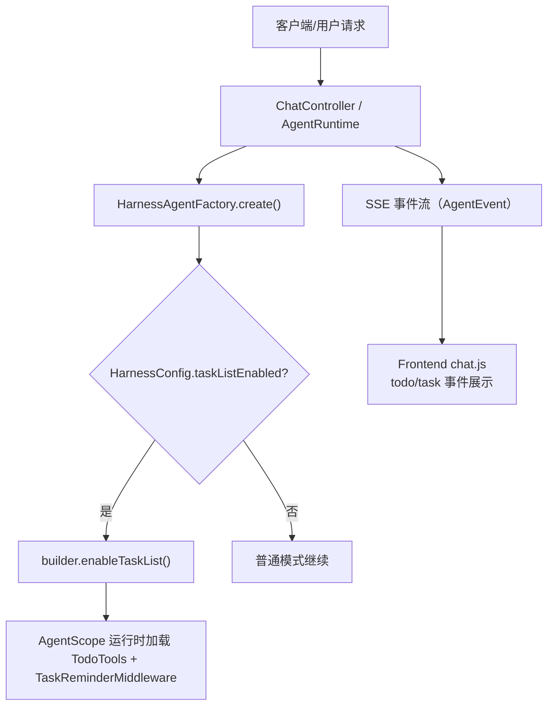
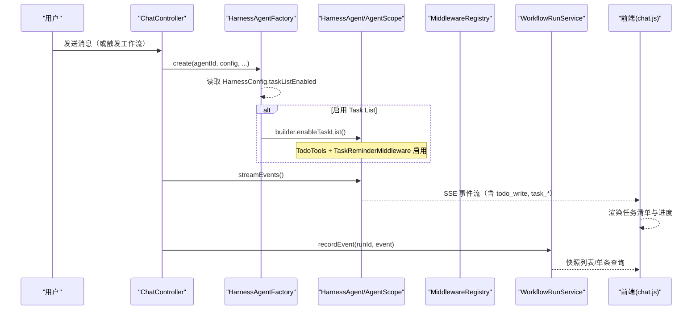
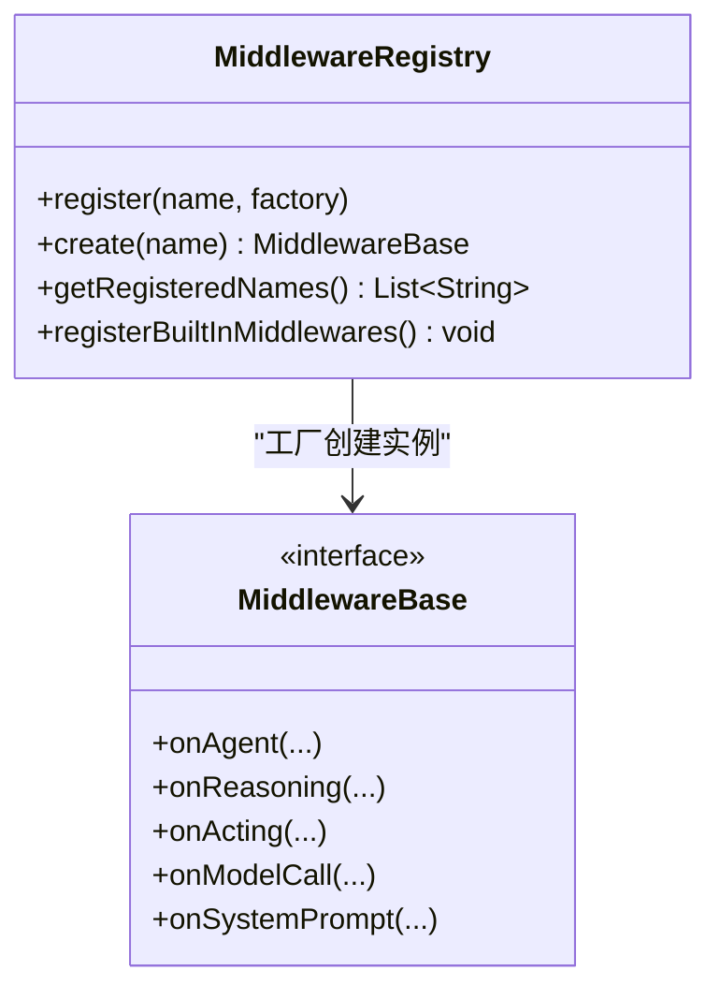
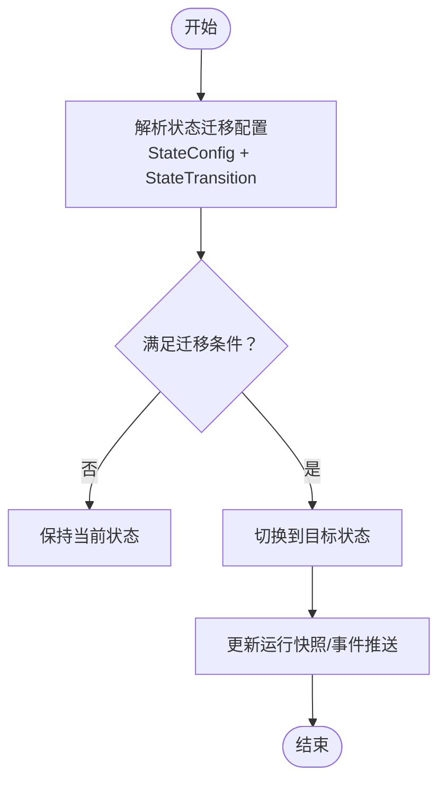
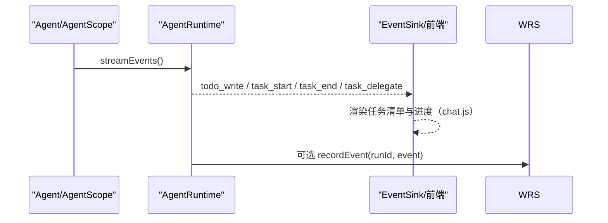
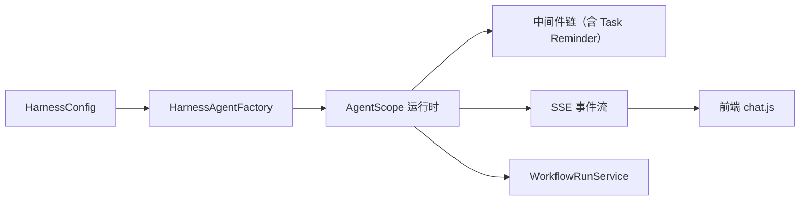

# Task List 任务列表

<cite>
**本文引用的文件 **
- [HarnessAgentFactory.java](file://src/main/java/com/skloda/agentscope/harness/HarnessAgentFactory.java)
- [HarnessConfig.java](file://src/main/java/com/skloda/agentscope/agent/HarnessConfig.java)
- [MiddlewareRegistry.java](file://src/main/java/com/skloda/agentscope/middleware/MiddlewareRegistry.java)
- [WorkflowRunService.java](file://src/main/java/com/skloda/agentscope/service/WorkflowRunService.java)
- [WorkflowRunSnapshot.java](file://src/main/java/com/skloda/agentscope/model/WorkflowRunSnapshot.java)
- [AuditLoggingMiddleware.java](file://src/main/java/com/skloda/agentscope/middleware/AuditLoggingMiddleware.java)
- [StateConfig.java](file://src/main/java/com/skloda/agentscope/agent/StateConfig.java)
- [StateTransition.java](file://src/main/java/com/skloda/agentscope/agent/StateTransition.java)
- [chat.js](file://src/main/resources/static/scripts/chat.js)
- [debug.js](file://src/main/resources/static/scripts/modules/debug.js)
- [ROADMAP.md](file://ROADMAP.md)
</cite>

## 目录
1. [简介](#简介)
2. [项目结构](#项目结构)
3. [核心组件](#核心组件)
4. [架构总览](#架构总览)
5. [详细组件分析](#详细组件分析)
6. [依赖关系分析](#依赖关系分析)
7. [性能考虑](#性能考虑)
8. [故障排查指南](#故障排查指南)
9. [结论](#结论)
10. [附录](#附录)

## 简介
本文件面向“Task List 任务列表”功能的启用机制与工作原理，聚焦以下方面：
- 如何启用 Task List（TodoTools + TaskReminderMiddleware）；
- 任务的优先级与状态管理（待办、进行中、已完成、已取消等）；
- 任务间依赖与自动调度；
- 中断恢复与进度同步；
- 队列管理、错误重试与性能优化；
- 结合工作流运行记录与事件追踪的落地场景。

该功能通过 HarnessAgent 构建流程显式开启，并与前端 SSE 事件管线衔接，用于在长任务、多阶段任务中提供可观察性与可控的执行轨迹。

**章节来源**
- [ROADMAP.md:47-69](file://ROADMAP.md#L47-L69)

## 项目结构
Task List 在本项目的启用点位于 Harness 的 Agent 构建链路中。关键位置包括：
- 配置开关：`HarnessConfig.taskListEnabled`
- 构建调用：`HarnessAgentFactory.create()` 中依据配置调用 `builder.enableTaskList()`
- 中间件注册：`MiddlewareRegistry` 内置中间件注册器（含审计、指标、限流、上下文增强以及 OTel 追踪等）
- 前端消费：`chat.js` 对 `todo_write`、`task_start/end/delegate` 等事件进行可视化处理

**图示来源**
- [HarnessAgentFactory.java:121-125](file://src/main/java/com/skloda/agentscope/harness/HarnessAgentFactory.java#L121-L125)
- [ROADMAP.md:47-69](file://ROADMAP.md#L47-L69)
- [chat.js:296-333](file://src/main/resources/static/scripts/chat.js#L296-L333)

**章节来源**
- [HarnessAgentFactory.java:42-141](file://src/main/java/com/skloda/agentscope/harness/HarnessAgentFactory.java#L42-L141)
- [HarnessConfig.java:13-35](file://src/main/java/com/skloda/agentscope/agent/HarnessConfig.java#L13-L35)

## 核心组件
- HarnessAgentFactory：负责装配 HarnessAgent 的各项能力，包含是否启用 Task List 的决策与注入。
- HarnessConfig：承载 HarnessAgent 的配置项，其中 `taskListEnabled` 控制是否开启 Task List。
- MiddlewareRegistry：统一注册与管理所有中间件的入口，支持扩展中间件链，Task Reminder 随 enableTaskList 隐式生效（根据设计说明）。
- WorkflowRunService/WorkflowRunSnapshot：提供执行期运行快照与事件录制，便于查看批量任务编排过程中的状态变化与进度回溯。
- 前端事件处理（chat.js、debug.js）：订阅并渲染任务类事件（todo_write、task_start/end/delegate 等），支撑可视化展示与调试。

**章节来源**
- [HarnessAgentFactory.java:121-141](file://src/main/java/com/skloda/agentscope/harness/HarnessAgentFactory.java#L121-L141)
- [HarnessConfig.java:13-35](file://src/main/java/com/skloda/agentscope/agent/HarnessConfig.java#L13-L35)
- [MiddlewareRegistry.java:26-54](file://src/main/java/com/skloda/agentscope/middleware/MiddlewareRegistry.java#L26-L54)
- [WorkflowRunService.java:35-73](file://src/main/java/com/skloda/agentscope/service/WorkflowRunService.java#L35-L73)
- [chat.js:296-333](file://src/main/resources/static/scripts/chat.js#L296-L333)
- [debug.js:514-527](file://src/main/resources/static/scripts/modules/debug.js#L514-L527)

## 架构总览
下图展示了 Task List 从启用到执行、记录与可视化的全链路交互：

**图示来源**
- [HarnessAgentFactory.java:121-141](file://src/main/java/com/skloda/agentscope/harness/HarnessAgentFactory.java#L121-L141)
- [chat.js:633-657](file://src/main/resources/static/scripts/chat.js#L633-L657)
- [WorkflowRunService.java:42-73](file://src/main/java/com/skloda/agentscope/service/WorkflowRunService.java#L42-L73)

## 详细组件分析

### 启用机制与工作原理
- 配置层：`HarnessConfig.taskListEnabled` 为布尔开关，默认 false。配置可通过 agents.yml 或其他 YAML 驱动装配。
- 构建层：当 `isTaskListEnabled()` 返回 true 时，`HarnessAgentFactory.create()` 会调用 `builder.enableTaskList()`，从而启用 Task List 相关能力（包括内置工具与中间件能力）。
- 执行层：由 AgentScope 内部负责将任务管理工具（TodoTools）与提醒/调度逻辑（TaskReminderMiddleware）挂载到 agent 的中间件链中，使后续步骤可按任务清单推进。

提示：
- 官方路线图指出该能力随 enableTaskList 启用的同时，TaskReminderMiddleware 会隐式生效（无独立 UI 开关），并由 AgentScope 框架层集成。

**章节来源**
- [HarnessConfig.java:19](file://src/main/java/com/skloda/agentscope/agent/HarnessConfig.java#L19)
- [HarnessAgentFactory.java:121-125](file://src/main/java/com/skloda/agentscope/harness/HarnessAgentFactory.java#L121-L125)
- [ROADMAP.md:47-69](file://ROADMAP.md#L47-L69)

### 中间件体系与扩展点
- 现有注册表：`MiddlewareRegistry.registerBuiltInMiddlewares()` 内置了审计日志、速率限制、上下文增强、详细审计、指标采集和 OpenTelemetry 追踪。
- 任务相关：Task Reminder 随 enableTaskList 隐式启用；未来如需独立展示或定制化行为，可在 Registry 中增加新的中间件名称并实现对应钩子。
- 可扩展：遵循 `MiddlewareBase` 生命周期钩子（如 onAgent/onReasoning/onActing 等）接入自定义逻辑。

**图示来源**
- [MiddlewareRegistry.java:26-54](file://src/main/java/com/skloda/agentscope/middleware/MiddlewareRegistry.java#L26-L54)
- [AuditLoggingMiddleware.java:19-68](file://src/main/java/com/skloda/agentscope/middleware/AuditLoggingMiddleware.java#L19-L68)

**章节来源**
- [MiddlewareRegistry.java:26-54](file://src/main/java/com/skloda/agentscope/middleware/MiddlewareRegistry.java#L26-L54)
- [AuditLoggingMiddleware.java:19-68](file://src/main/java/com/skloda/agentscope/middleware/AuditLoggingMiddleware.java#L19-L68)

### 任务状态管理与状态机
- 基础状态模型：工作流运行快照 `WorkflowRunSnapshot.Status` 提供 RUNNING/COMPLETED/FAILED 三类状态，适用于顶层任务/批次的生命周期跟踪。
- 细粒度状态：任务级更细的状态（如待办、进行中、已完成、已取消）通常在 TodoTools 内部维护，并通过 SSE 事件向前端广播（如 todo_write）。
- 组合状态机：本项目还提供了 StateConfig/StateTransition 作为通用状态机模型（可用于复杂业务编排中的状态迁移），可与 Task List 一起使用以实现更精细的控制面。

**图示来源**
- [StateConfig.java:13-17](file://src/main/java/com/skloda/agentscope/agent/StateConfig.java#L13-L17)
- [StateTransition.java:12-15](file://src/main/java/com/skloda/agentscope/agent/StateTransition.java#L12-L15)
- [WorkflowRunSnapshot.java:14-18](file://src/main/java/com/skloda/agentscope/model/WorkflowRunSnapshot.java#L14-L18)

**章节来源**
- [WorkflowRunSnapshot.java:14-18](file://src/main/java/com/skloda/agentscope/model/WorkflowRunSnapshot.java#L14-L18)
- [StateConfig.java:13-17](file://src/main/java/com/skloda/agentscope/agent/StateConfig.java#L13-L17)
- [StateTransition.java:12-15](file://src/main/java/com/skloda/agentscope/agent/StateTransition.java#L12-L15)

### 事件流与前端展示
- 后端事件：通过 `AgentRuntime.streamEvents()` 输出丰富类型的事件，Task List 相关的事件包含 `todo_write`、`task_start`、`task_end`、`task_delegate`、`task_result`、`task_aggregate` 等。
- 前端消费：`chat.js` 针对上述事件进行分支处理，在时间线/思考框中渲染任务清单与进度；`debug.js` 提供任务委派与结束的诊断行展示。
- 事件持久化：可将关键事件通过 `WorkflowRunService.recordEvent` 写入运行快照，便于离线分析与回放。

**图示来源**
- [chat.js:296-333](file://src/main/resources/static/scripts/chat.js#L296-L333)
- [chat.js:633-657](file://src/main/resources/static/scripts/chat.js#L633-L657)
- [debug.js:514-527](file://src/main/resources/static/scripts/modules/debug.js#L514-L527)
- [WorkflowRunService.java:42-73](file://src/main/java/com/skloda/agentscope/service/WorkflowRunService.java#L42-L73)

**章节来源**
- [chat.js:296-333](file://src/main/resources/static/scripts/chat.js#L296-L333)
- [chat.js:633-657](file://src/main/resources/static/scripts/chat.js#L633-L657)
- [debug.js:514-527](file://src/main/resources/static/scripts/modules/debug.js#L514-L527)

### 批处理与异步编排
- 批处理编排：利用 Task List 的能力将多个子任务以清单形式组织，按优先级或依赖顺序执行；配合并行/串行运行时可实现不同吞吐策略。
- 异步监控：通过 SSE 事件持续推送到前端，实时反映每个子任务的生命周期与聚合汇总。
- 结果聚合：`task_aggregate` 事件可展示已完成任务计数，便于宏观监控。

（本节为概念性说明，用于解释 Task List 的适用场景与收益。）

### 中断恢复与进度同步
- 能力基础：框架暴露了任务恢复相关的 API 能力说明（例如待工具调用挂起的恢复），具体细节遵循框架版本约定。
- 实践建议：借助 `WorkflowRunService` 定期拍快照（记录事件、状态），配合前端的增量渲染，可在进程重启或服务异常后恢复到最近一致状态，继续消费待完成任务。
- 分布式场景：需要引入外部状态存储（如 Redis/MySQL/Postgres）持久化 AgentStateStore，以支持跨实例恢复。

**章节来源**
- [WorkflowRunService.java:35-73](file://src/main/java/com/skloda/agentscope/service/WorkflowRunService.java#L35-L73)
- [WorkflowRunService.java:123-150](file://src/main/java/com/skloda/agentscope/service/WorkflowRunService.java#L123-L150)

## 依赖关系分析
- 构建期依赖：`HarnessAgentFactory` 依赖于 `HarnessConfig`，在构建 HarnessAgent 时将 `enableTaskList` 转换为框架内能力的启用。
- 运行期依赖：AgentScope 运行时通过中间件链装配 TodoTools 与 TaskReminderMiddleware；事件流经 AgentRuntime 到达前端。
- 观测性依赖：`WorkflowRunService` 接收事件记录，提供快照查询；中间件（如 AuditLoggingMiddleware）对关键节点进行埋点。

**图示来源**
- [HarnessAgentFactory.java:121-141](file://src/main/java/com/skloda/agentscope/harness/HarnessAgentFactory.java#L121-L141)
- [WorkflowRunService.java:42-73](file://src/main/java/com/skloda/agentscope/service/WorkflowRunService.java#L42-L73)

**章节来源**
- [HarnessAgentFactory.java:121-141](file://src/main/java/com/skloda/agentscope/harness/HarnessAgentFactory.java#L121-L141)
- [WorkflowRunService.java:42-73](file://src/main/java/com/skloda/agentscope/service/WorkflowRunService.java#L42-L73)

## 性能考虑
- 事件节流：在高并发任务场景下，合理合并与节流任务事件，避免前端过载。
- 快照容量：`WorkflowRunService` 默认保留最近若干运行记录，需结合内存与磁盘空间调整；对热路径减少不必要的 detail。
- 中间件开销：审计/指标中间件会带来额外 CPU/IO 开销，按需启用并在生产环境选择合适的级别。
- 批处理吞吐：通过并行/串行运行时组合与合理的批次大小，平衡延迟与吞吐。
- 存储优化：对外部持久化（Redis/MySQL/Postgres）的场景，建议使用压缩与分片策略，并关注读写放大问题。

[本节为通用指导，不直接分析具体代码文件]

## 故障排查指南
- Task List 未生效：
  - 确认 `HarnessConfig.taskListEnabled` 是否设置为 true，并确保 `HarnessAgentFactory.create()` 被执行（参考配置与装配链路）。
  - 检查路由/会话是否存在，且 Agent 已成功创建。
- 前端不显示任务：
  - 检查事件是否到达（浏览器网络面板），确认 `todo_write`、`task_*` 等事件是否存在于流中。
  - 核对 `chat.js` 分支是否匹配事件名与数据结构。
- 无法回溯历史：
  - 确认 `WorkflowRunService` 是否正确记录了事件，查询接口是否能拉取到记录。
- 中间件未生效：
  - 检查 `MiddlewareRegistry` 中是否注册了对应中间件（名称与构造函数），是否在 Agent 初始化时被应用。

**章节来源**
- [HarnessAgentFactory.java:121-141](file://src/main/java/com/skloda/agentscope/harness/HarnessAgentFactory.java#L121-L141)
- [chat.js:296-333](file://src/main/resources/static/scripts/chat.js#L296-L333)
- [chat.js:633-657](file://src/main/resources/static/scripts/chat.js#L633-L657)
- [WorkflowRunService.java:42-73](file://src/main/java/com/skloda/agentscope/service/WorkflowRunService.java#L42-L73)
- [MiddlewareRegistry.java:26-54](file://src/main/java/com/skloda/agentscope/middleware/MiddlewareRegistry.java#L26-L54)

## 结论
- Task List 的启用由 `HarnessConfig.taskListEnabled` 与 `HarnessAgentFactory.create()` 共同决定；启用后将加载 TodoTools 与 TaskReminderMiddleware。
- 任务生命周期可通过运行快照与工作流记录进行追踪，前端基于 SSE 事件渲染任务清单与进度。
- 对于复杂编排，可结合 StateConfig/StateTransition 实现更精细的状态迁移控制。
- 在生产环境中，建议结合外部存储提升中断恢复能力，并关注事件与快照的性能与成本。

[本节总结前述内容，不新增代码引用]

## 附录

### API 与数据模型概览（与 Task List 相关）
- 运行快照状态：RUNNING / COMPLETED / FAILED
- 任务事件（前端渲染）：todo_write、task_start、task_end、task_delegate、task_result、task_aggregate

**章节来源**
- [WorkflowRunSnapshot.java:14-18](file://src/main/java/com/skloda/agentscope/model/WorkflowRunSnapshot.java#L14-L18)
- [chat.js:296-333](file://src/main/resources/static/scripts/chat.js#L296-L333)
- [chat.js:633-657](file://src/main/resources/static/scripts/chat.js#L633-L657)

### 实际应用场景示例
- 批处理任务编排：将大作业拆分为子任务，逐个提交到任务清单并按依赖调度；通过任务聚合事件监控完成度。
- 异步任务监控：前端实时展示各子任务状态，结合审计中间件输出执行耗时与错误信息。
- 工作流进度展示：结合状态机（StateConfig/StateTransition）对整条流水线做里程碑标记与告警。

[本节为概念应用说明，不涉及具体文件实现]