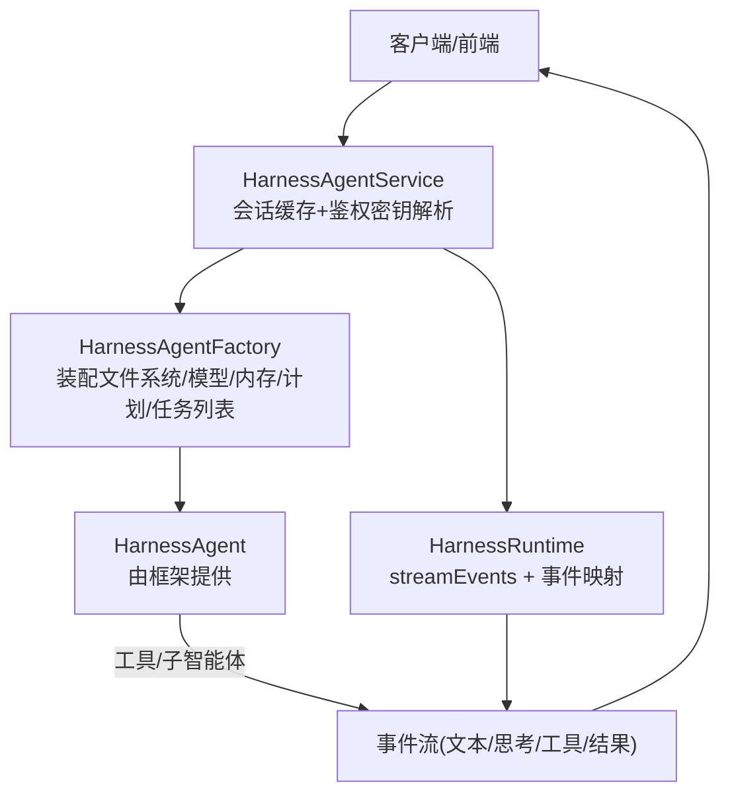
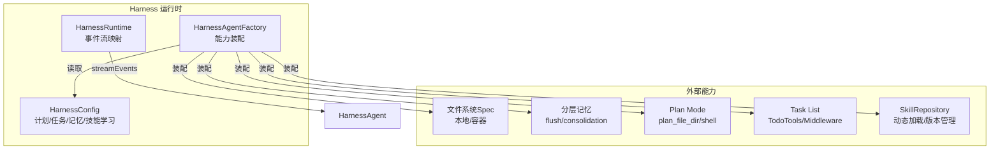
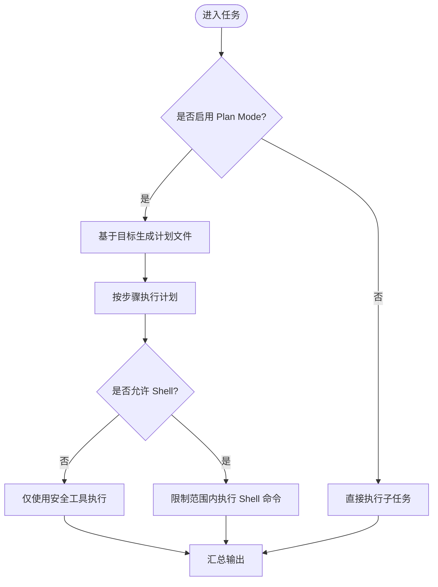
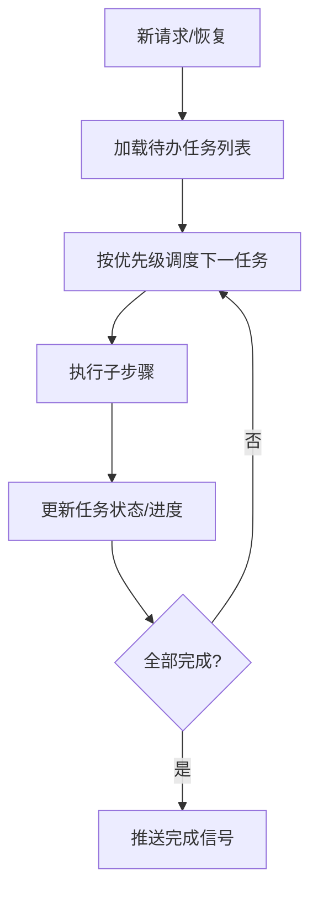
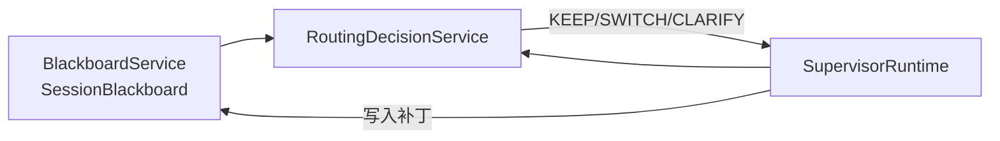

# 高级特性

<cite>
**本文引用的文件**   
- [HarnessConfig.java](file://src/main/java/com/skloda/agentscope/agent/HarnessConfig.java)
- [HarnessAgentFactory.java](file://src/main/java/com/skloda/agentscope/harness/HarnessAgentFactory.java)
- [HarnessAgentService.java](file://src/main/java/com/skloda/agentscope/harness/HarnessAgentService.java)
- [HarnessRuntime.java](file://src/main/java/com/skloda/agentscope/harness/HarnessRuntime.java)
- [LoopRuntime.java](file://src/main/java/com/skloda/agentscope/runtime/LoopRuntime.java)
- [SupervisorRuntime.java](file://src/main/java/com/skloda/agentscope/blackboard/SupervisorRuntime.java)
- [BlackboardService.java](file://src/main/java/com/skloda/agentscope/blackboard/BlackboardService.java)
- [RoutingDecisionService.java](file://src/main/java/com/skloda/agentscope/blackboard/RoutingDecisionService.java)
- [AgentRuntime.java](file://src/main/java/com/skloda/agentscope/runtime/AgentRuntime.java)
- [agents.yml](file://src/main/resources/config/agents.yml)
</cite>

## 目录
1. [简介](#简介)
2. [项目结构与入口](#项目结构与入口)
3. [核心组件总览](#核心组件总览)
4. [架构概览](#架构概览)
5. [详细组件分析](#详细组件分析)
6. [依赖关系分析](#依赖关系分析)
7. [性能与可扩展性](#性能与可扩展性)
8. [故障诊断指南](#故障诊断指南)
9. [企业级应用场景](#企业级应用场景)
10. [结论](#结论)

## 简介
本章节从 Harness Agent 的视角，系统性阐述其高级能力：Plan Mode 的任务规划、Task List 的优先级管理与状态跟踪、Skill 学习系统的自适应生命周期。文档聚焦实现要点（配置、编排、流式事件）与工程实践（并发、容错、可观测），并以可视化方式帮助读者快速理解。

## 项目结构与入口
Harness Agent 由工厂构建运行时，服务层负责接入与会话上下文，Runtime 负责将事件标准化并推送到前端。典型调用路径为：
- HTTP/WS 接口 → HarnessAgentService → HarnessAgentFactory → HarnessRuntime
- 通过 HarnessConfig 开启 Plan Mode、Task List、分层记忆、权限、技能仓库等能力



图示来源
- [HarnessAgentService.java:37-63](file://src/main/java/com/skloda/agentscope/harness/HarnessAgentService.java#L37-L63)
- [HarnessAgentFactory.java:42-141](file://src/main/java/com/skloda/agentscope/harness/HarnessAgentFactory.java#L42-L141)
- [HarnessRuntime.java:49-63](file://src/main/java/com/skloda/agentscope/harness/HarnessRuntime.java#L49-L63)

本节来源
- [HarnessAgentService.java:37-95](file://src/main/java/com/skloda/agentscope/harness/HarnessAgentService.java#L37-L95)
- [HarnessAgentFactory.java:42-141](file://src/main/java/com/skloda/agentscope/harness/HarnessAgentFactory.java#L42-L141)
- [HarnessRuntime.java:49-74](file://src/main/java/com/skloda/agentscope/harness/HarnessRuntime.java#L49-L74)

## 核心组件总览
- HarnessConfig：统一承载 Plan Mode、Task List、分层 Memory、Sandbox、Skill Learning 等配置项
- HarnessAgentFactory：根据配置装配文件系统（本地/容器）、压缩策略、工具结果驱逐、权限上下文、技能仓库，以及计划模式、任务列表与分层记忆的开关与参数
- HarnessRuntime：桥接 AgentScope 2.0 的 streamEvents 事件流与 SSE 适配
- LoopRuntime：writer-critic 迭代闭环，用于“写-审-改”的模式化生成流程
- Supervisor/Blackboard：路由决策（规则/LLM）、专家隔离、共享黑板的读写权限与版本控制
- AgentRuntime：单智能体生命周期、中断恢复、待审批恢复与事件合并

本节来源
- [HarnessConfig.java:11-133](file://src/main/java/com/skloda/agentscope/agent/HarnessConfig.java#L11-L133)
- [HarnessAgentFactory.java:42-141](file://src/main/java/com/skloda/agentscope/harness/HarnessAgentFactory.java#L42-L141)
- [HarnessRuntime.java:49-74](file://src/main/java/com/skloda/agentscope/harness/HarnessRuntime.java#L49-L74)
- [LoopRuntime.java:14-166](file://src/main/java/com/skloda/agentscope/runtime/LoopRuntime.java#L14-L166)
- [SupervisorRuntime.java:134-156](file://src/main/java/com/skloda/agentscope/blackboard/SupervisorRuntime.java#L134-L156)
- [BlackboardService.java:39-143](file://src/main/java/com/skloda/agentscope/blackboard/BlackboardService.java#L39-L143)
- [RoutingDecisionService.java:48-137](file://src/main/java/com/skloda/agentscope/blackboard/RoutingDecisionService.java#L48-L137)
- [AgentRuntime.java:67-142](file://src/main/java/com/skloda/agentscope/runtime/AgentRuntime.java#L67-L142)

## 架构概览
下图展示 Harness 高级模式的关键交互：计划模式与任务列表作为可选能力，可在同一 Agent 实例中组合启用；分层记忆在 turn 粒度 flush 并在后台合并；权限上下文与技能仓库在服务启动时注入。



图示来源
- [HarnessConfig.java:71-133](file://src/main/java/com/skloda/agentscope/agent/HarnessConfig.java#L71-L133)
- [HarnessAgentFactory.java:105-197](file://src/main/java/com/skloda/agentscope/harness/HarnessAgentFactory.java#L105-L197)
- [HarnessRuntime.java:49-63](file://src/main/java/com/skloda/agentscope/harness/HarnessRuntime.java#L49-L63)

## 详细组件分析

### Plan Mode（任务规划）
- 触发条件：HarnessConfig.PlanConfig.enabled=true，可选指定 plan 文件目录，按需允许 shell 执行
- 行为要点：
  - 在构建期通过 builder.enablePlanMode() 开启计划能力
  - 可通过 fileDirectory 定制计划文件落盘位置
  - allowShellInPlanMode() 控制是否在计划模式下允许 shell 工具，适用于自动化脚本类工作负载
- 适用场景：需要先把复杂目标拆解成有序步骤的阶段型任务（如代码重构、多阶段部署、多文件批量处理）

本节来源
- [HarnessConfig.java:71-78](file://src/main/java/com/skloda/agentscope/agent/HarnessConfig.java#L71-L78)
- [HarnessAgentFactory.java:127-141](file://src/main/java/com/skloda/agentscope/harness/HarnessAgentFactory.java#L127-L141)



图示来源
- [HarnessAgentFactory.java:127-141](file://src/main/java/com/skloda/agentscope/harness/HarnessAgentFactory.java#L127-L141)
- [HarnessConfig.java:71-78](file://src/main/java/com/skloda/agentscope/agent/HarnessConfig.java#L71-L78)

### Task List（任务列表、优先级、状态跟踪、进度同步）
- 触发条件：HarnessConfig.taskListEnabled=true，开启后会启用内置 TodoTools 与 TaskReminderMiddleware，便于在多步任务中记录待办、优先级与完成度
- 功能要素：
  - 任务持久化与可见性：以任务条目的形式暴露给前端与中间件
  - 优先级与状态：支持标记重要程度、当前状态与进度
  - 中断恢复：即使对话中断，后续请求仍能继续推进未完成任务
  - 进度同步：每轮事件更新任务状态，使 UI 能够实时反映完成比例与剩余工作

本节来源
- [HarnessConfig.java:11-24](file://src/main/java/com/skloda/agentscope/agent/HarnessConfig.java#L11-L24)
- [HarnessAgentFactory.java:121-126](file://src/main/java/com/skloda/agentscope/harness/HarnessAgentFactory.java#L121-L126)



图示来源
- [HarnessAgentFactory.java:121-126](file://src/main/java/com/skloda/agentscope/harness/HarnessAgentFactory.java#L121-L126)
- [HarnessConfig.java:11-24](file://src/main/java/com/skloda/agentscope/agent/HarnessConfig.java#L11-L24)

### Skill 学习系统（自适应、评估、版本管理与动态加载）
- 触发条件：HarnessConfig.SkillLearningConfig.manageToolEnabled=true；可选 autoPromote、securityScan、curatorEnabled 等
- 生命周期：
  - propose_skill：智能体在实践中发现新模式/知识，自动生成技能草案
  - review/promote：安全扫描与审阅（可自动通过）提升为可用版本
  - curator：周期性归档陈旧技能，降低维护成本
- 集成点：ClasspathSkillRepository 支持从 classpath 动态加载 skill，结合 permissionContext 控制访问范围

本节来源
- [HarnessConfig.java:108-133](file://src/main/java/com/skloda/agentscope/agent/HarnessConfig.java#L108-L133)
- [HarnessAgentFactory.java:192-197](file://src/main/java/com/skloda/agentscope/harness/HarnessAgentFactory.java#L192-L197)

```mermaid
sequenceDiagram
  U as "用户/业务系统"
  H as "HarnessAgentService"
  F as "HarnessAgentFactory"
  R as "SkillRepository"
  U->>H: 发起对话
  H->>F: 创建/复用 HarnessAgent
  F->>R: 注册 ClasspathSkillRepository
  Note over H,R: SkillRepository 暴露动态技能加载接口
  H-->>U: 流式事件（含工具/技能使用痕迹）
  Note over H: 若启用学习，建议配合外部审阅流程实现 promote
```

图示来源
- [HarnessAgentFactory.java:192-197](file://src/main/java/com/skloda/agentscope/harness/HarnessAgentFactory.java#L192-L197)
- [HarnessConfig.java:108-133](file://src/main/java/com/skloda/agentscope/agent/HarnessConfig.java#L108-L133)
- [HarnessAgentService.java:65-75](file://src/main/java/com/skloda/agentscope/harness/HarnessAgentService.java#L65-L75)

### 分层记忆（Flush、Consolidation、保留策略）
- 配置项：MemoryConfig 控制 flush 触发策略（ALWAYS/NEVER/THROTTLED）、合并后的 tokens 上限、日/会话文件保留天数等
- 行为要点：
  - Per-turn Flush：逐轮抽取事实写入日期文件
  - Throttled Consolidation：按时间间隔合并为 MEMORY.md，减少上下文膨胀
  - 工具侧支持 memory_search/get/save
- 与 Plan Mode、Task List 的关系：三者可共存且互不干扰，Plan Mode 侧重“步骤规划”，Task List 侧重“工作项状态”，记忆侧重“跨会话事实沉淀”

本节来源
- [HarnessConfig.java:79-106](file://src/main/java/com/skloda/agentscope/agent/HarnessConfig.java#L79-L106)
- [HarnessAgentFactory.java:143-181](file://src/main/java/com/skloda/agentscope/harness/HarnessAgentFactory.java#L143-L181)

### Writer-Critic 迭代（LoopRuntime）与任务终止策略
- 目的：在内容生成类任务中实现“写→审→改”的闭环质量保障
- 机制：
  - Writer 先产出初稿，Critic 判断是否通过或给出修改意见
  - 达到最大迭代次数后，仍会尽可能输出最后的有效内容，避免空返回
  - 所有中间事件以统一 SSE 格式流式推送至前端

本节来源
- [LoopRuntime.java:29-166](file://src/main/java/com/skloda/agentscope/runtime/LoopRuntime.java#L29-L166)

```mermaid
sequenceDiagram
  U as "用户"
  L as "LoopRuntime"
  W as "Writer 智能体"
  C as "Critic 智能体"
  U->>L: 原始需求
  L->>W: 首次撰写提示
  W-->>L: 初稿
  L->>C: 评审输入
  C-->>L: 审核结果(批准/修改)
  alt 批准
    L-->>U: 文本=初稿 + done
  else 未批准
    L->>W: 带反馈的重写提示
    W-->>L: 新版本
    L->>C: 再次评审
    opt 达到最大迭代
      L-->>U: 最佳可用内容 + done
    end
  end
```

图示来源
- [LoopRuntime.java:52-135](file://src/main/java/com/skloda/agentscope/runtime/LoopRuntime.java#L52-L135)
- [LoopRuntime.java:137-160](file://src/main/java/com/skloda/agentscope/runtime/LoopRuntime.java#L137-L160)

### Supervisor / Blackboard（路由与共享状态）
- 路由策略：规则（关键词匹配、显式转派优先）或 LLM 策略（预留扩展）
- 共享黑版：每个 (userId, sessionId) 一组会话级状态，串行写入与版本化，确保并发安全
- 专家隔离：专家的 AgentState 独立于 Supervisor，避免状态污染
- 事件：每次路由输出 routing_event（包含动作、原因、置信度、时间戳）

本节来源
- [RoutingDecisionService.java:48-137](file://src/main/java/com/skloda/agentscope/blackboard/RoutingDecisionService.java#L48-L137)
- [BlackboardService.java:93-143](file://src/main/java/com/skloda/agentscope/blackboard/BlackboardService.java#L93-L143)
- [SupervisorRuntime.java:134-200](file://src/main/java/com/skloda/agentscope/blackboard/SupervisorRuntime.java#L134-L200)



图示来源
- [SupervisorRuntime.java:158-200](file://src/main/java/com/skloda/agentscope/blackboard/SupervisorRuntime.java#L158-L200)
- [RoutingDecisionService.java:48-137](file://src/main/java/com/skloda/agentscope/blackboard/RoutingDecisionService.java#L48-L137)
- [BlackboardService.java:116-133](file://src/main/java/com/skloda/agentscope/blackboard/BlackboardService.java#L116-L133)

## 依赖关系分析
- HarnessAgentFactory 强依赖 ModelFactory、PermissionContextFactory、CompactionConfigFactory、FilesystemSpecFactory
- HarnessRuntime 依赖 AgentEventMapper 进行事件类型到 SSE 的转换
- LoopRuntime、AgentRuntime 均依赖 ObservabilityHook 与 EventSink 完成可观测性
- SupervisorRuntime 依赖 BlackboardService 与 RoutingDecisionService 完成协作式路由

本节来源
- [HarnessAgentFactory.java:22-40](file://src/main/java/com/skloda/agentscope/harness/HarnessAgentFactory.java#L22-L40)
- [HarnessRuntime.java:31-74](file://src/main/java/com/skloda/agentscope/harness/HarnessRuntime.java#L31-L74)
- [LoopRuntime.java:14-51](file://src/main/java/com/skloda/agentscope/runtime/LoopRuntime.java#L14-L51)
- [AgentRuntime.java:26-44](file://src/main/java/com/skloda/agentscope/runtime/AgentRuntime.java#L26-L44)
- [SupervisorRuntime.java:60-99](file://src/main/java/com/skloda/agentscope/blackboard/SupervisorRuntime.java#L60-L99)

## 性能与可扩展性
- 事件流与背压：所有运行时统一通过 Reactor Flux 推送事件，利用 backpressure 防止阻塞
- 并发控制：Blackboard per-slot ReentrantLock 串行写入，避免竞争
- 上下文治理：CompactionConfig + ToolResultEviction 控制消息与工具结果体积，降低 LLM 负担
- 资源隔离：DockerFilesystemSpec + SandboxConfig（镜像/内存/CPU）提供执行环境隔离
- 可插拔路由：规则/Llm 两种策略可扩展，当前默认规则匹配保证稳定性与可解释性

本节来源
- [HarnessAgentFactory.java:82-119](file://src/main/java/com/skloda/agentscope/harness/HarnessAgentFactory.java#L82-L119)
- [BlackboardService.java:178-197](file://src/main/java/com/skloda/agentscope/blackboard/BlackboardService.java#L178-L197)
- [RoutingDecisionService.java:55-137](file://src/main/java/com/skloda/agentscope/blackboard/RoutingDecisionService.java#L55-L137)

## 故障诊断指南
- 无 API Key：若未设置 agentscope.model.dashscope.api-key 或环境变量 DASHSCOPE_API_KEY，服务创建时会抛出异常提示补齐
- 流卡住/done 未到达：历史上因 sink 未正确完成的合并导致前端“永远在发送”，现已在 doFinally 中关闭 EventSink 避免循环等待
- 计划/任务/记忆未生效：确认 HarnessConfig 对应开关已开启，并由 HarnessAgentFactory 成功装配日志输出
- 路由错误：检查路由触发词、defaultKeep 配置与黑名单中的 agentId 是否匹配预期
- 审批挂起：ApprovalMiddleware 触发后需审批才能继续，使用 ApprovalService 续跑审批链路与事件恢复

本节来源
- [HarnessAgentService.java:78-95](file://src/main/java/com/skloda/agentscope/harness/HarnessAgentService.java#L78-L95)
- [AgentRuntime.java:82-142](file://src/main/java/com/skloda/agentscope/runtime/AgentRuntime.java#L82-L142)

## 企业级应用场景
- 自动化代码生成
  - 使用 Plan Mode 将大需求拆分为模块设计→代码生成→单元测试→静态检查的步骤，Task List 跟踪各步骤状态
  - 对涉及敏感操作的步骤启用审批（Approval Middleware），确保安全
- 智能运维脚本编写
  - 在 DOCKER 沙箱内执行受限 Shell 命令（Plan 模式允许 shell）
  - 结合 ToolResultEviction 与 Compaction，保持运行环境稳定与响应速度
- 配置文件模板化
  - 利用 Skill 系统收集不同环境的模板片段，通过 ClasspathSkillRepository 动态加载
  - 分层记忆记录历史变更与偏好，持续沉淀团队最佳实践

本节来源
- [HarnessAgentFactory.java:82-141](file://src/main/java/com/skloda/agentscope/harness/HarnessAgentFactory.java#L82-L141)
- [HarnessAgentFactory.java:192-197](file://src/main/java/com/skloda/agentscope/harness/HarnessAgentFactory.java#L192-L197)
- [HarnessConfig.java:63-133](file://src/main/java/com/skloda/agentscope/agent/HarnessConfig.java#L63-L133)

## 结论
Harness Agent 的高级特性以“配置即能力”的方式提供了任务规划、任务列表、分层记忆、技能学习与沙箱隔离的一体化解决方案。通过统一的流式事件管道与严谨的状态并发控制，既保证了开发效率，又满足了企业级的安全与可观测要求。建议在复杂生产场景中优先采用 Plan Mode + Task List + 审批链的组合，并将记忆与技能库纳入长期演进，形成自进化的能力中心。