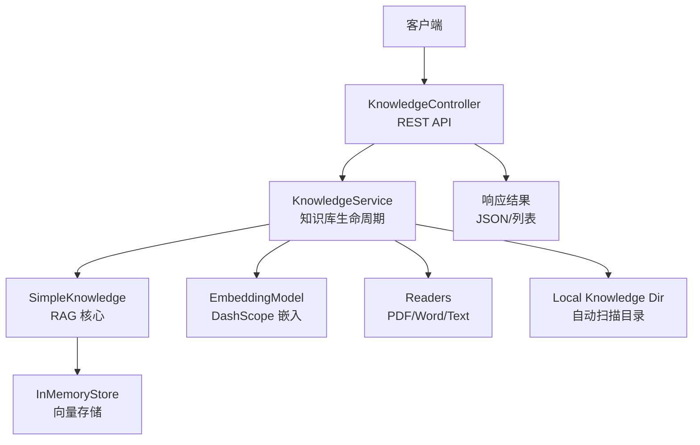
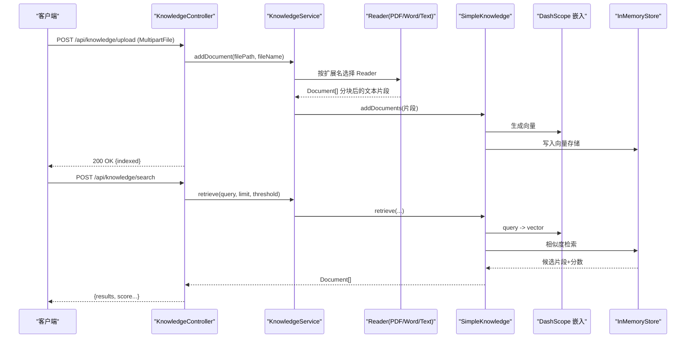
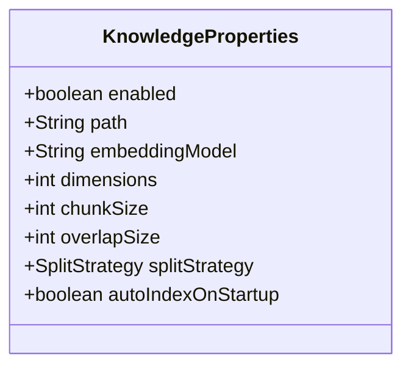
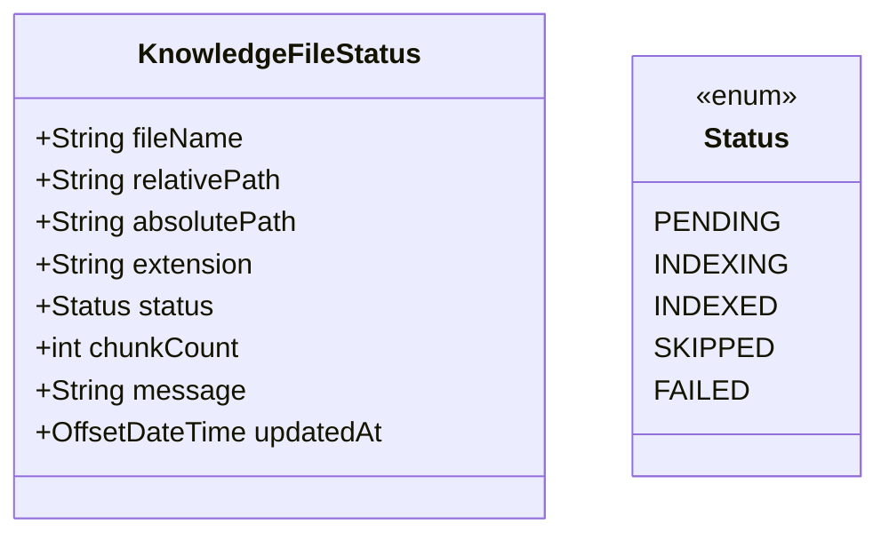
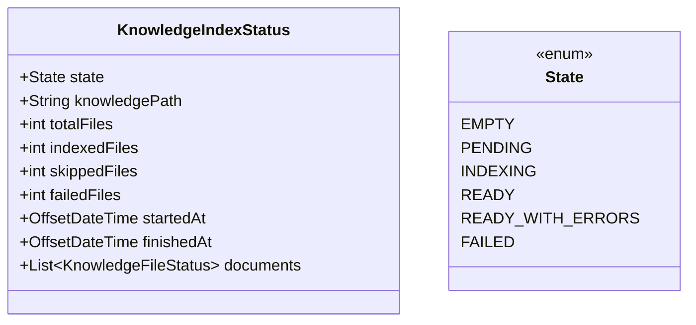
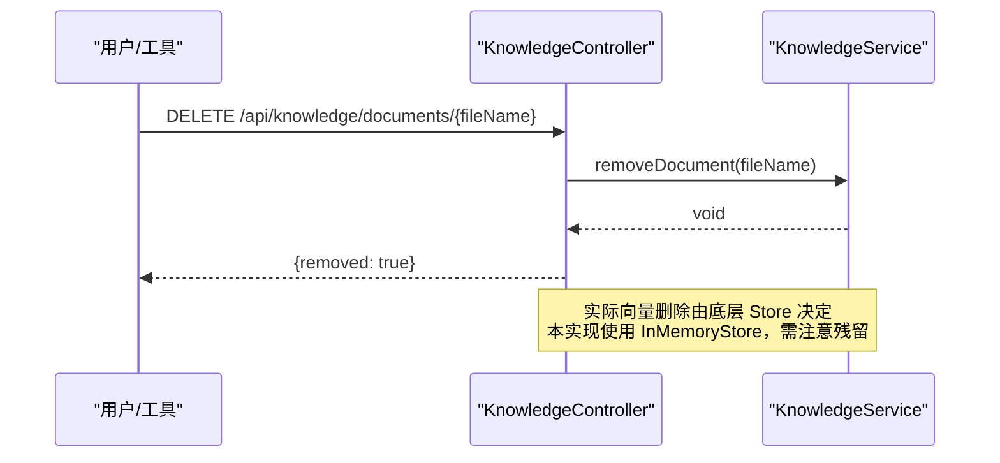
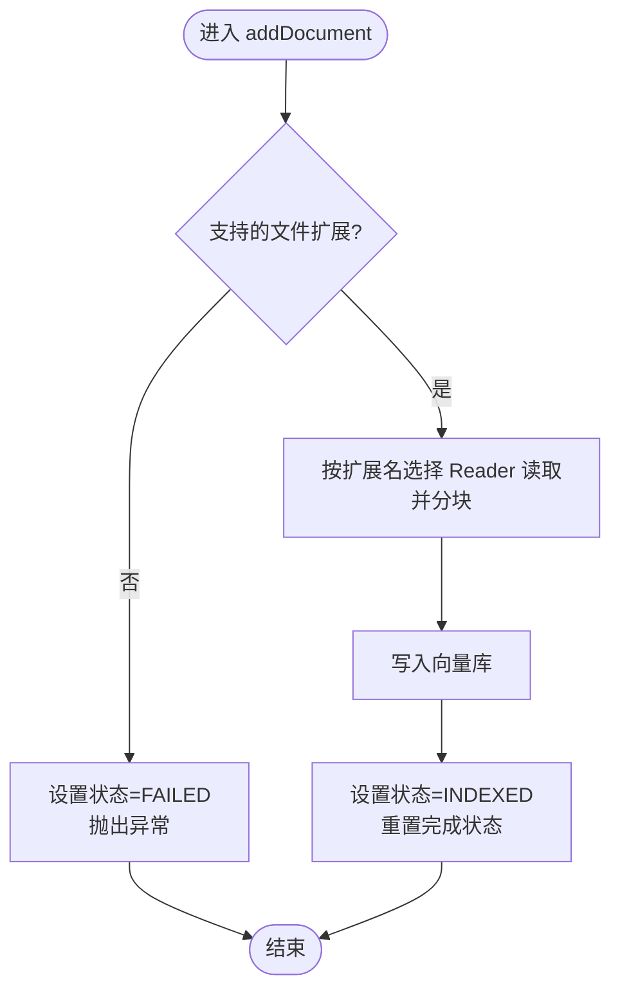
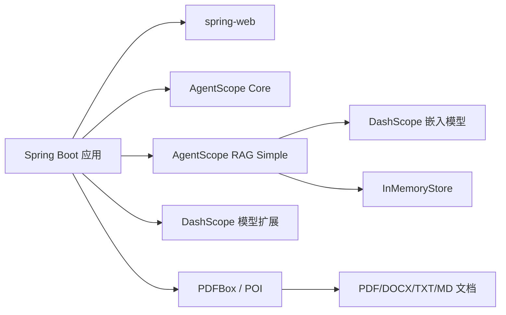

# RAG 知识库系统

<cite>
**本文引用的文件**
- [KnowledgeProperties.java](file://src/main/java/com/skloda/agentscope/service/KnowledgeProperties.java)
- [KnowledgeFileStatus.java](file://src/main/java/com/skloda/agentscope/model/KnowledgeFileStatus.java)
- [KnowledgeIndexStatus.java](file://src/main/java/com/skloda/agentscope/model/KnowledgeIndexStatus.java)
- [KnowledgeController.java](file://src/main/java/com/skloda/agentscope/controller/KnowledgeController.java)
- [KnowledgeService.java](file://src/main/java/com/skloda/agentscope/service/KnowledgeService.java)
- [application.yml](file://src/main/resources/application.yml)
- [pom.xml](file://pom.xml)
- [README.md](file://README.md)
</cite>

## 目录
1. [引言](#引言)
2. [项目结构](#项目结构)
3. [核心组件](#核心组件)
4. [架构总览](#架构总览)
5. [详细组件分析](#详细组件分析)
6. [依赖关系分析](#依赖关系分析)
7. [性能考虑与优化](#性能考虑与优化)
8. [故障排查指南](#故障排查指南)
9. [结论](#结论)

## 引言
本项目基于 AgentScope 实现了可本地自动索引的知识库（RAG），支持 PDF、DOCX、TXT、MD 等格式解析，采用 DashScope 文本嵌入模型生成向量并在内存向量存储中相似度检索，提供 REST API 用于上传、删除、查询及查看索引状态。系统在启动后可扫描指定目录完成自动索引，并通过后台单线程任务驱动增量处理；在运行期暴露了统一的知识库管理接口，便于集成前端或外部工具调用。

## 项目结构
- 控制器层：REST 接口集中在 /api/knowledge，承担上传、列表、搜索、删除和状态查询。
- 服务层：封装 SimpleKnowledge、读取器选择、嵌入配置、后台索引流程与状态快照。
- 模型层：定义知识库文件状态与索引总览状态的数据结构。
- 配置层：通过 Spring Boot 配置注入属性（是否启用、路径、嵌入模型、分块策略等）。
- 依赖层：AgentScope Core/RAG 扩展、DashScope 嵌入模型提供者、PDFBox/POI 文档解析。

图表来源
- [KnowledgeController.java:1-131](file://src/main/java/com/skloda/agentscope/controller/KnowledgeController.java#L1-L131)
- [KnowledgeService.java:50-138](file://src/main/java/com/skloda/agentscope/service/KnowledgeService.java#L50-L138)

小节来源
- [KnowledgeController.java:1-131](file://src/main/java/com/skloda/agentscope/controller/KnowledgeController.java#L1-L131)
- [KnowledgeService.java:50-138](file://src/main/java/com/skloda/agentscope/service/KnowledgeService.java#L50-L138)
- [application.yml:61-71](file://src/main/resources/application.yml#L61-L71)

## 核心组件
- KnowledgeProperties：集中承载知识库的配置项，包括启用开关、目录、嵌入模型名、向量维度、分块大小与重叠、分块策略以及启动自动索引。
- KnowledgeFileStatus：单个文件的索引结果与进度，包含文件标识、路径、扩展名、状态、分块数量与错误信息等。
- KnowledgeIndexStatus：一次索引的总览状态，包括整体状态、开始/结束时间、统计计数与详情列表。
- KnowledgeService：知识库服务，负责初始化嵌入与向量存储、扫描本地目录、解析文档、写入向量存储、异步后台索引、上传增量处理与状态快照。
- KnowledgeController：对外暴露知识库管理的 REST 接口（上传、列举、删除、搜索、状态）。

小节来源
- [KnowledgeProperties.java:8-21](file://src/main/java/com/skloda/agentscope/service/KnowledgeProperties.java#L8-L21)
- [KnowledgeFileStatus.java:8-28](file://src/main/java/com/skloda/agentscope/model/KnowledgeFileStatus.java#L8-L28)
- [KnowledgeIndexStatus.java:9-59](file://src/main/java/com/skloda/agentscope/model/KnowledgeIndexStatus.java#L9-L59)
- [KnowledgeService.java:50-138](file://src/main/java/com/skloda/agentscope/service/KnowledgeService.java#L50-L138)
- [KnowledgeController.java:1-131](file://src/main/java/com/skloda/agentscope/controller/KnowledgeController.java#L1-L131)

## 架构总览
- 入口：Spring Boot Web 应用加载时注册 KnowledgeController。
- 启动：应用就绪事件触发后台索引器扫描配置的知识库目录。
- 索引管线：识别文件扩展名 -> 选择合适的 Reader（PDF/Word/Text）-> 按配置的 SplitStrategy 切分文本 -> 调用 DashScope 嵌入 -> 写入 InMemoryStore。
- 查询：检索时将用户问题嵌入后执行相似度搜索，返回片段与分数。
- 状态追踪：每次索引过程记录每个文件的处理结果，并汇总为索引状态对象供 API 获取。

图表来源
- [KnowledgeController.java:37-130](file://src/main/java/com/skloda/agentscope/controller/KnowledgeController.java#L37-L130)
- [KnowledgeService.java:140-196](file://src/main/java/com/skloda/agentscope/service/KnowledgeService.java#L140-L196)

小节来源
- [KnowledgeService.java:140-196](file://src/main/java/com/skloda/agentscope/service/KnowledgeService.java#L140-L196)

## 详细组件分析

### 配置属性 KnowledgeProperties
- 作用：集中管理知识库行为，避免魔法值，便于不同环境切换。
- 关键属性：enabled、path、embeddingModel、dimensions、chunkSize、overlapSize、splitStrategy、autoIndexOnStartup。
- 使用位置：KnowledgeService 构造时创建 EmbeddingModel 与 SimpleKnowledge 实例；ApplicationReady 回调根据 autoIndexOnStartup 决定是否启动后台索引。

图表来源
- [KnowledgeProperties.java:8-21](file://src/main/java/com/skloda/agentscope/service/KnowledgeProperties.java#L8-L21)

小节来源
- [KnowledgeProperties.java:8-21](file://src/main/java/com/skloda/agentscope/service/KnowledgeProperties.java#L8-L21)
- [application.yml:61-71](file://src/main/resources/application.yml#L61-L71)

### 文件状态 KnowledgeFileStatus
- 枚举 Status：PENDING、INDEXING、INDEXED、SKIPPED、FAILED。
- 字段：fileName、relativePath、absolutePath、extension、status、chunkCount、message、updatedAt。
- 用途：在批量索引或上传过程中对每个文件进行细粒度跟踪，便于上层 UI 或运维面板展示。

图表来源
- [KnowledgeFileStatus.java:8-28](file://src/main/java/com/skloda/agentscope/model/KnowledgeFileStatus.java#L8-L28)

小节来源
- [KnowledgeFileStatus.java:8-28](file://src/main/java/com/skloda/agentscope/model/KnowledgeFileStatus.java#L8-L28)

### 索引总览 KnowledgeIndexStatus
- 枚举 State：EMPTY、PENDING、INDEXING、READY、READY_WITH_ERRORS、FAILED。
- 聚合：totalFiles、indexedFiles、skippedFiles、failedFiles、startedAt、finishedAt、documents。
- 语义：一次性索引作业的“元信息”，便于客户端轮询进度与结果。

图表来源
- [KnowledgeIndexStatus.java:9-59](file://src/main/java/com/skloda/agentscope/model/KnowledgeIndexStatus.java#L9-L59)

小节来源
- [KnowledgeIndexStatus.java:9-59](file://src/main/java/com/skloda/agentscope/model/KnowledgeIndexStatus.java#L9-L59)

### 后端 API：KnowledgeController
- 上传文档：POST /api/knowledge/upload
  - 接受 multipart file，校验为空、文件名、扩展名（仅 .pdf/.docx/.txt/.md）
  - 将文件保存到临时目录，并调用 service.addDocument 完成索引
  - 返回标准化 JSON
- 列出已索引文档：GET /api/knowledge/documents
- 获取索引状态：GET /api/knowledge/status
- 检索测试：POST /api/knowledge/search
  - 参数：query、可选 limit、threshold
  - 返回片段摘要与相似度分数
- 删除文档：DELETE /api/knowledge/documents/{fileName}
  - 当前实现调用 knowledge.removeDocument（注意：InMemoryStore 可能无法真正移除向量，存在残留风险，见下文故障排查）

图表来源
- [KnowledgeController.java:123-131](file://src/main/java/com/skloda/agentscope/controller/KnowledgeController.java#L123-L131)
- [KnowledgeService.java:50-89](file://src/main/java/com/skloda/agentscope/service/KnowledgeService.java#L50-L89)

小节来源
- [KnowledgeController.java:37-131](file://src/main/java/com/skloda/agentscope/controller/KnowledgeController.java#L37-L131)

### 知识索引服务：KnowledgeService
- 初始化：读取 agentscope.model.dashscope.api-key，结合 properties 构建 DashScope 嵌入模型与 InMemoryStore 维度的 SimpleKnowledge。
- 后台索引：监听 ApplicationReady 事件，若 enabled 且 autoIndexOnStartup，则提交后台线程扫描本地知识库目录并逐个文件解析、分块、向量化、入库。
- 上传增量：addDocument 接收上传文件的路径与文件名，检查扩展名合法性，按扩展名选择 Reader 读取并得到文档片段，再写入向量库，更新单文件状态并最终计算总体状态。
- 状态快照：getIndexStatus 汇总所有文件的状态，排序并返回包含总数、各状态计数的对象。

图表来源
- [KnowledgeService.java:140-196](file://src/main/java/com/skloda/agentscope/service/KnowledgeService.java#L140-L196)
- [KnowledgeService.java:323-397](file://src/main/java/com/skloda/agentscope/service/KnowledgeService.java#L323-L397)

小节来源
- [KnowledgeService.java:50-89](file://src/main/java/com/skloda/agentscope/service/KnowledgeService.java#L50-L89)
- [KnowledgeService.java:140-196](file://src/main/java/com/skloda/agentscope/service/KnowledgeService.java#L140-L196)
- [KnowledgeService.java:323-397](file://src/main/java/com/skloda/agentscope/service/KnowledgeService.java#L323-L397)

### 文档解析与分块策略
- 解析器：
  - PDF：使用 PDFReader
  - DOCX/DOC：使用 WordReader（表格输出为 Markdown 格式）
  - TXT/MD：使用 TextReader
- 分块策略：通过 properties.splitStrategy 控制分块方式；chunkSize 与 overlapSize 控制分块长度与重叠度。
- 影响：分块质量直接影响检索召回与相关性；过大会丢失上下文，过小会增加噪声。

小节来源
- [KnowledgeService.java:323-333](file://src/main/java/com/skloda/agentscope/service/KnowledgeService.java#L323-L333)
- [KnowledgeProperties.java:15-19](file://src/main/java/com/skloda/agentscope/service/KnowledgeProperties.java#L15-L19)
- [application.yml:61-71](file://src/main/resources/application.yml#L61-L71)

### 向量存储与检索
- 嵌入模型：DashScope Text Embedding，模型名、API Key、向量维度均来自配置。
- 存储：默认使用 InMemoryStore，适合演示与轻量场景；生产环境建议替换为持久化向量库以支持高可用与横向扩展。
- 检索：retrieve(query, limit, threshold) 将查询转为向量后进行相似度检索，并按阈值与条数返回结果；控制器将其包装为统一的 JSON 响应。

小节来源
- [KnowledgeService.java:73-85](file://src/main/java/com/skloda/agentscope/service/KnowledgeService.java#L73-L85)
- [KnowledgeController.java:96-121](file://src/main/java/com/skloda/agentscope/controller/KnowledgeController.java#L96-L121)

### 本地自动索引机制
- 触发时机：ApplicationReadyEvent 后，依据 properties.enabled 与 autoIndexOnStartup 决定是否开启后台索引。
- 并发与安全：使用单线程 Daemon 线程避免阻塞主流程，使用 AtomicBoolean 防止重复调度；在销毁钩子里优雅关闭线程池。
- 目录扫描：递归遍历知识库根目录，按扩展名白名单过滤；不支持类型标记为 SKIPPED；失败记录到 Failed 并继续后续文件。

小节来源
- [KnowledgeService.java:91-138](file://src/main/java/com/skloda/agentscope/service/KnowledgeService.java#L91-L138)
- [KnowledgeService.java:214-316](file://src/main/java/com/skloda/agentscope/service/KnowledgeService.java#L214-L316)

### 知识库管理 API 参考
- 上传文档
  - 方法/路径：POST /api/knowledge/upload
  - 请求：multipart/form-data，字段 file
  - 校验：非空、扩展名为 .pdf/.docx/.txt/.md
  - 返回：{fileName, status}
- 列出文档
  - GET /api/knowledge/documents
  - 返回：字符串数组
- 获取索引状态
  - GET /api/knowledge/status
  - 返回：KnowledgeIndexStatus
- 检索测试
  - POST /api/knowledge/search
  - 请求体：{query, limit?, threshold?}
  - 返回：{query, count, results:[{content, score}]}
- 删除文档
  - DELETE /api/knowledge/documents/{fileName}
  - 返回：{removed: true}
  - 注意：当前底层为 InMemoryStore，删除向量可能不生效，存在历史残留。

小节来源
- [KnowledgeController.java:37-131](file://src/main/java/com/skloda/agentscope/controller/KnowledgeController.java#L37-L131)

## 依赖关系分析
- Spring Boot 3.x Web 栈提供 HTTP 服务能力。
- AgentScope Core + RAG Simple：提供 SimpleKnowledge、Reader 系列（PDF、Word、Text）、Embedding 抽象与 InMemoryStore。
- DashScope 扩展：通过 Model Provider 接入 DashScope 文本嵌入模型。
- 文档解析：Apache POI（.docx）、Apache PDFBox（.pdf）。
- 运行时注入：application.yml 中 agentscope.model.dashscope.api-key 与 agentscope.knowledge.* 控制行为。

图表来源
- [pom.xml:28-96](file://pom.xml#L28-L96)
- [application.yml:25-43](file://src/main/resources/application.yml#L25-L43)

小节来源
- [pom.xml:28-96](file://pom.xml#L28-L96)
- [application.yml:25-43](file://src/main/resources/application.yml#L25-L43)

## 性能考虑与优化
- 分块策略调整
  - chunkSize 与 overlapSize：针对长文档适当增大分块，保留上下文；但过大增加无关内容导致检索降序降低。
  - splitStrategy：段落式更适合结构化文档；如需更细粒度可按句或固定 token 切分。
- 嵌入模型与维度
  - 维度越高精度可能越好但内存占用和计算成本上升；按模型支持与硬件条件权衡。
  - 确保 DashScope API Key 有效、限流与重试策略合理。
- 存储选型
  - InMemoryStore 易失且不适合生产；迁移至高性能向量数据库以提升可靠性、容量与检索吞吐。
- 批量导入
  - 当前背景索引为单线程；生产可增加批处理与并发度，注意 CPU/GPU/网络限制。
- 查询优化
  - threshold 与 limit：调大阈值可减少误召回；limit 控制返回数量以平衡耗时与结果丰富度。
- 资源回收
  - 预关注 PreDestroy 钩子；如引入持久化存储需补充连接池与句柄释放。

[本节为通用优化建议，不直接引用具体代码文件]

## 故障排查指南
- 上传报错“不支持的格式”
  - 检查文件名扩展是否为 .pdf/.docx/.txt/.md；非法类型会被拒绝。
  - 相关逻辑位于上传校验与扩展名判定处。
- 索引失败
  - 查看日志中的异常信息与消息字段；可能是文件损坏或解析异常。
  - 对应状态会被设置为 FAILED，可通过状态接口查看详细信息。
- 删除文档无效（向量仍被命中）
  - 当前使用 InMemoryStore，删除操作未保证从向量库物理剔除；因此可能出现残留命中。
  - 解决方案：切换到支持删除能力的向量库并实现相应清理逻辑。
- 检索结果为空或过多噪音
  - 调整 threshold（默认约 0.5）提高精确度；调整 limit 控制返回量。
  - 检查分块策略与分块大小是否合适；必要时重新索引。
- API Key 未配置或不可用
  - 检查环境变量 DASHSCOPE_API_KEY 或 application.yml 中的 api-key。
  - 确认模型名、维度配置与实际服务要求一致。
- 自动索引未触发
  - 检查 agentscope.knowledge.enabled 与 autoIndexOnStartup 是否均为 true。
  - 确认知识库路径存在且可读。

小节来源
- [KnowledgeController.java:40-56](file://src/main/java/com/skloda/agentscope/controller/KnowledgeController.java#L40-L56)
- [KnowledgeService.java:156-174](file://src/main/java/com/skloda/agentscope/service/KnowledgeService.java#L156-L174)
- [KnowledgeService.java:50-89](file://src/main/java/com/skloda/agentscope/service/KnowledgeService.java#L50-L89)

## 结论
本系统实现了面向本地的 RAG 知识库，具备启动自动索引、多格式文档解析、向量相似度检索与完整状态追踪能力。通过简洁的配置与清晰的 API 分层，能够快速集成到对话与智能体工作流中。建议在正式生产中替换为持久化向量存储，并根据业务规模调整分块策略与查询阈值，以获得更稳定与高效的检索体验。