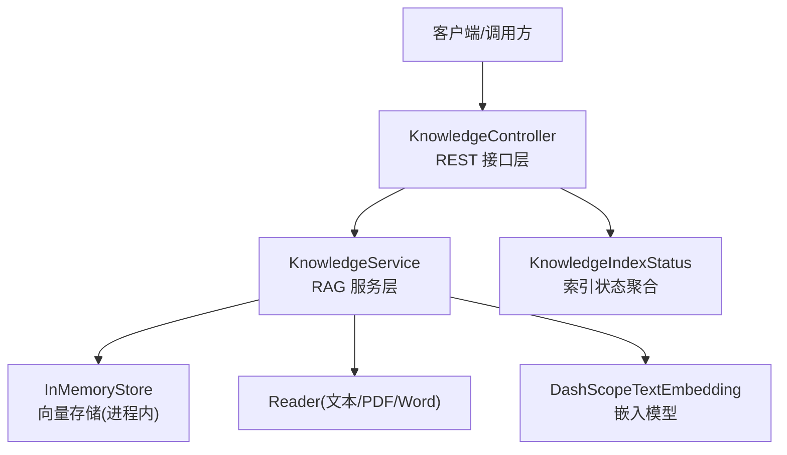
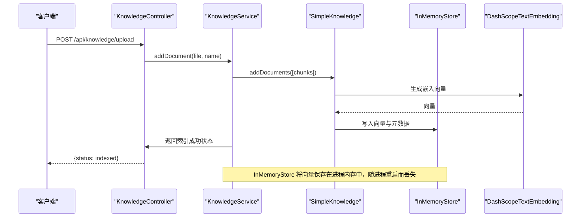
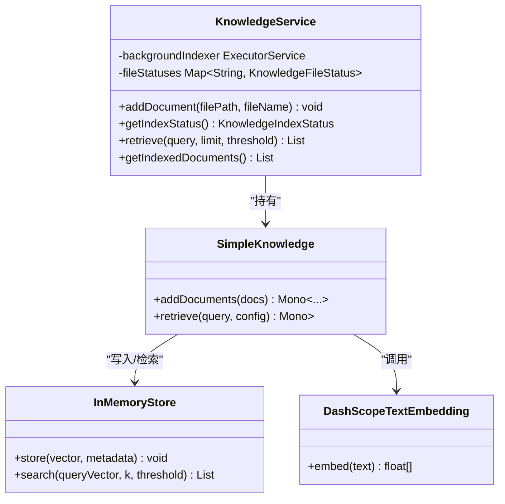
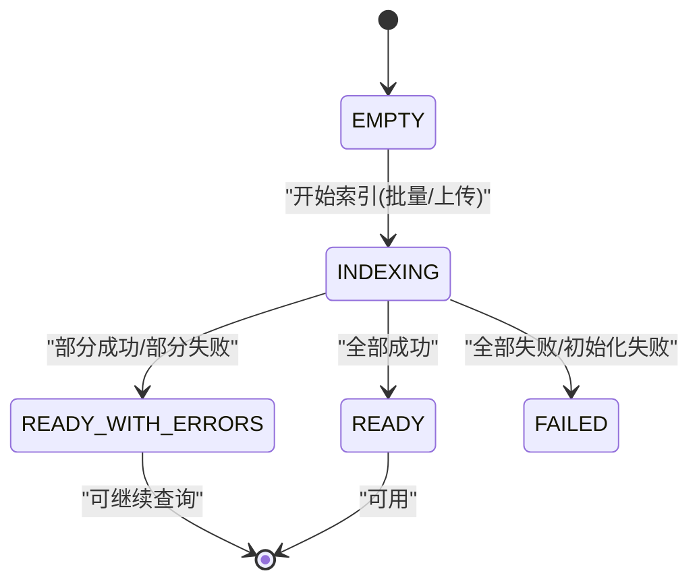
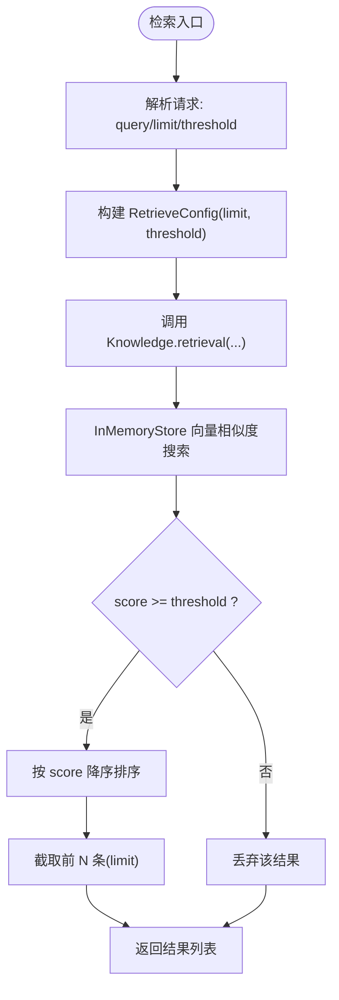
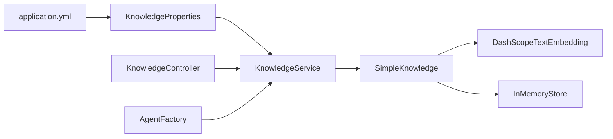

# 向量存储管理

<cite>
**本文引用的文件**
- [KnowledgeService.java](file://src/main/java/com/skloda/agentscope/service/KnowledgeService.java)
- [KnowledgeIndexStatus.java](file://src/main/java/com/skloda/agentscope/model/KnowledgeIndexStatus.java)
- [KnowledgeController.java](file://src/main/java/com/skloda/agentscope/controller/KnowledgeController.java)
- [KnowledgeProperties.java](file://src/main/java/com/skloda/agentscope/service/KnowledgeProperties.java)
- [application.yml](file://src/main/resources/application.yml)
- [AgentFactory.java](file://src/main/java/com/skloda/agentscope/agent/AgentFactory.java)
</cite>

## 目录
1. [简介](#简介)
2. [项目结构](#项目结构)
3. [核心组件](#核心组件)
4. [架构总览](#架构总览)
5. [详细组件分析](#详细组件分析)
6. [依赖关系分析](#依赖关系分析)
7. [性能考量](#性能考量)
8. [故障排查指南](#故障排查指南)
9. [结论](#结论)
10. [附录](#附录)

## 简介
本技术文档聚焦于 RAG 知识库的向量存储管理，重点解析 InMemoryStore 的实现原理、内存管理机制与容量限制；说明向量的存储结构与元数据管理及生命周期控制；阐述 KnowledgeIndexStatus 状态机设计与状态转换逻辑；对向量相似度搜索的参数配置（阈值与排序）和结果相关性评分进行规范化的文档化说明；并提供存储后端替换指南（含持久化存储方案、分布式部署架构与性能调优策略），以及内存使用监控、垃圾回收优化和大规模数据集处理的最佳实践。

## 项目结构
本仓库采用 Spring Boot + AgentScope 框架，RAG 知识库相关能力集中在 service、model、controller 三个层次：
- service：提供知识索引、检索、状态管理与后台任务执行
- model：定义索引状态聚合与文件级状态
- controller：暴露 REST API，包含上传、检索、状态查询与移除

图表来源
- [KnowledgeController.java:27-131](file://src/main/java/com/skloda/agentscope/controller/KnowledgeController.java#L27-L131)
- [KnowledgeService.java:73-88](file://src/main/java/com/skloda/agentscope/service/KnowledgeService.java#L73-L88)
- [ApplicationConfiguration.yml:62-70](file://src/main/resources/application.yml#L62-L70)

章节来源
- [KnowledgeController.java:27-131](file://src/main/java/com/skloda/agentscope/controller/KnowledgeController.java#L27-L131)
- [KnowledgeService.java:39-88](file://src/main/java/com/skloda/agentscope/service/KnowledgeService.java#L39-L88)
- [application.yml:62-70](file://src/main/resources/application.yml#L62-L70)

## 核心组件
- KnowledgeService：构建 SimpleKnowledge，注入 DashScopeTextEmbedding 与 InMemoryStore；负责本地知识目录扫描、上传文件索引、相似度检索与后台调度；维护文件级别的状态与全局索引状态。
- KnowledgeIndexStatus：描述整个索引任务的聚合状态与统计信息，包含文件清单与计数汇总。
- KnowledgeController：暴露 /api/knowledge/upload、/api/knowledge/documents、/api/knowledge/status、/api/knowledge/search、/api/knowledge/documents/{fileName} 等 REST 端点。
- KnowledgeProperties：RAG 相关配置项，如 embeddingModel、dimensions、chunkSize、overlapSize、splitStrategy、autoIndexOnStartup 等。
- AgentFactory：在 Agent 启动时通过 RetrieveConfig 注入检索限制与分数阈值，统一为 Agent 侧检索提供一致参数。

章节来源
- [KnowledgeService.java:60-88](file://src/main/java/com/skloda/agentscope/service/KnowledgeService.java#L60-L88)
- [KnowledgeIndexStatus.java:10-58](file://src/main/java/com/skloda/agentscope/model/KnowledgeIndexStatus.java#L10-L58)
- [KnowledgeController.java:27-131](file://src/main/java/com/skloda/agentscope/controller/KnowledgeController.java#L27-L131)
- [KnowledgeProperties.java:8-21](file://src/main/java/com/skloda/agentscope/service/KnowledgeProperties.java#L8-L21)
- [AgentFactory.java:164-172](file://src/main/java/com/skloda/agentscope/agent/AgentFactory.java#L164-L172)

## 架构总览
知识库从“本地目录/用户上传”到“向量检索”的全流程如下：
- 应用启动：触发后台索引线程扫描本地知识目录（可配置开关）。
- 文件入库：支持 .txt/.md/.pdf/.docx 格式的文档读取分块，计算向量并写入 InMemoryStore。
- 检索入口：API 或 Agent（通过 RetrieveConfig）发起检索，InMemoryStore 按维度向量空间进行相似度匹配，返回带相关性的文档片段。
- 状态跟踪：KnowledgeIndexStatus 与文件状态（索引中、已索引、跳过、失败）贯穿整个生命周期。

图表来源
- [KnowledgeController.java:40-78](file://src/main/java/com/skloda/agentscope/controller/KnowledgeController.java#L40-L78)
- [KnowledgeService.java:143-177](file://src/main/java/com/skloda/agentscope/service/KnowledgeService.java#L143-L177)
- [KnowledgeService.java:76-88](file://src/main/java/com/skloda/agentscope/service/KnowledgeService.java#L76-L88)

## 详细组件分析

### 向量存储与内存机制（InMemoryStore）
- 构建与注入：KnowledgeService 使用 SimpleKnowledge.builder().embeddingStore(InMemoryStore.builder().dimensions(...).build()).build() 完成绑定，向量化维度由配置 KnowledgeProperties.dimensions 决定。
- 向量数据结构：向量以浮点数数组（维度=dimensions）形式存储在进程中，关联 Document 的元数据（内容切片、路径信息等）。
- 生命周期：存储属于进程内驻留对象，应用重启后数据不持久；删除操作仅会清理索引列表中的文件名条目，不会从 InMemoryStore 实际移除底层向量（存在旧向量残留风险）。
- 容量限制：未暴露内置容量上限与淘汰策略；生产建议设置 JVM 堆大小、启用 GC 监控并结合外部持久化后端规避内存风险。
- 元数据管理：Document 保存了原文切块文本与来源路径；检索时可输出内容片段与相似度得分。

图表来源
- [KnowledgeService.java:60-88](file://src/main/java/com/skloda/agentscope/service/KnowledgeService.java#L60-L88)
- [KnowledgeService.java:143-177](file://src/main/java/com/skloda/agentscope/service/KnowledgeService.java#L143-L177)
- [KnowledgeService.java:247-259](file://src/main/java/com/skloda/agentscope/service/KnowledgeService.java#L247-L259)

章节来源
- [KnowledgeService.java:60-88](file://src/main/java/com/skloda/agentscope/service/KnowledgeService.java#L60-L88)
- [KnowledgeService.java:278-285](file://src/main/java/com/skloda/agentscope/service/KnowledgeService.java#L278-L285)
- [application.yml:62-70](file://src/main/resources/application.yml#L62-L70)

### 索引状态机（KnowledgeIndexStatus）
- 状态集合：EMPTY、PENDING、INDEXING、READY、READY_WITH_ERRORS、FAILED。
- 语义说明：
  - EMPTY：无文件或未开始扫描。
  - PENDING：准备阶段（当前代码中主要体现为空/未就绪态）。
  - INDEXING：正在索引中（添加文档/后台扫描期间）。
  - READY：全部文件均成功索引。
  - READY_WITH_ERRORS：部分失败但其余已就绪（例如图片需 OCR、格式不支持等）。
  - FAILED：整体失败（例如无法创建索引实例）。
- 计数汇总：totalFiles/indexedFiles/skippedFiles/failedFiles 由文件级状态自动计算。
- 时间戳：startedAt/finishedAt 标记任务起止。

图表来源
- [KnowledgeIndexStatus.java:10-58](file://src/main/java/com/skloda/agentscope/model/KnowledgeIndexStatus.java#L10-L58)
- [KnowledgeService.java:143-177](file://src/main/java/com/skloda/agentscope/service/KnowledgeService.java#L143-L177)

章节来源
- [KnowledgeIndexStatus.java:10-58](file://src/main/java/com/skloda/agentscope/model/KnowledgeIndexStatus.java#L10-L58)
- [KnowledgeService.java:143-196](file://src/main/java/com/skloda/agentscope/service/KnowledgeService.java#L143-L196)

### 向量化检索与阈值、排序机制
- 检索流程：
  - 客户端调用 /api/knowledge/search，请求体携带 query、limit、threshold。
  - KnowledgeController 解析阈值与限制数量（默认 threshold=0.5，默认 limit=3）。
  - 通过 KnowledgeService.retrieve() 构造 RetrieveConfig.limit/threshold，交由 SimpleKnowledge/Knowledge 与 InMemoryStore 执行相似度检索。
- 阈值与排序：
  - threshold：向量余弦相似度得分截断阈值，默认 0.5；低于该阈值的片段将被过滤。
  - limit：返回的最多结果条数；在满足阈值的前提下按相似度降序排序。
- 结果结构：每个 Document 包含内容片段与 getScore() 相似度分值，可用于前端展示与进一步二次筛选。

图表来源
- [KnowledgeController.java:99-120](file://src/main/java/com/skloda/agentscope/controller/KnowledgeController.java#L99-L120)
- [KnowledgeService.java:247-259](file://src/main/java/com/skloda/agentscope/service/KnowledgeService.java#L247-L259)

章节来源
- [KnowledgeController.java:99-120](file://src/main/java/com/skloda/agentscope/controller/KnowledgeController.java#L99-L120)
- [KnowledgeService.java:247-259](file://src/main/java/com/skloda/agentscope/service/KnowledgeService.java#L247-L259)
- [AgentFactory.java:164-172](file://src/main/java/com/skloda/agentscope/agent/AgentFactory.java#L164-L172)

### 后台索引与生命周期控制
- 后台索引器：基于单线程守护线程池，避免阻塞主流程。
- 启动事件：监听 ApplicationReadyEvent，若开启 enabled 且 autoIndexOnStartup=true 则开始扫描本地 knowledge 目录。
- 并发防护：AtomicBoolean 防止重复索引任务同时运行。
- 资源释放：@PreDestroy 优雅关闭后台线程。
- 异常与恢复：单个文件失败不影响其他文件的索引，汇总状态变为 READY_WITH_ERRORS。

章节来源
- [KnowledgeService.java:62-68](file://src/main/java/com/skloda/agentscope/service/KnowledgeService.java#L62-L68)
- [KnowledgeService.java:91-125](file://src/main/java/com/skloda/agentscope/service/KnowledgeService.java#L91-L125)
- [KnowledgeService.java:127-137](file://src/main/java/com/skloda/agentscope/service/KnowledgeService.java#L127-L137)

### 配置文件与 Agent 集成
- KnowledgeProperties 默认值可通过 application.yml 覆盖：路径、嵌入模型名、向量维度、分块大小、重叠大小、分块策略、是否自启动索引等。
- Agent 侧检索：AgentFactory 为每个 Agent 注入 Knowledge 实例与 RetrieveConfig，支持通过 agents.yml 的 ragRetrieveLimit 与 ragScoreThreshold 控制检索行为。

章节来源
- [KnowledgeProperties.java:8-21](file://src/main/java/com/skloda/agentscope/service/KnowledgeProperties.java#L8-L21)
- [application.yml:62-70](file://src/main/resources/application.yml#L62-L70)
- [AgentFactory.java:164-172](file://src/main/java/com/skloda/agentscope/agent/AgentFactory.java#L164-L172)
- [AgentFactory.java:233-241](file://src/main/java/com/skloda/agentscope/agent/AgentFactory.java#L233-L241)

## 依赖关系分析
- 组件耦合：KnowledgeService 依赖 SimpleKnowledge、InMemoryStore、DashScopeTextEmbedding；与外部系统（向量模型提供方）解耦良好。
- 控制器与服务的职责边界清晰，状态聚合集中在 model 层，便于前后端协作。
- Agent 侧对检索参数的注入方式与 Web 侧保持一致，统一了检索行为。

图表来源
- [application.yml:62-70](file://src/main/resources/application.yml#L62-L70)
- [KnowledgeProperties.java:8-21](file://src/main/java/com/skloda/agentscope/service/KnowledgeProperties.java#L8-L21)
- [KnowledgeService.java:76-88](file://src/main/java/com/skloda/agentscope/service/KnowledgeService.java#L76-L88)
- [AgentFactory.java:164-172](file://src/main/java/com/skloda/agentscope/agent/AgentFactory.java#L164-L172)

章节来源
- [KnowledgeService.java:60-88](file://src/main/java/com/skloda/agentscope/service/KnowledgeService.java#L60-L88)
- [AgentFactory.java:164-172](file://src/main/java/com/skloda/agentscope/agent/AgentFactory.java#L164-L172)

## 性能考量
- 内存占用：InMemoryStore 将全量向量驻留进程内存，随文档量线性增长；请评估 dimensions（默认 1024）与分块规模，合理设置 JVM 堆大小。
- 检索性能：阈值过滤可减少无效结果；limit 控制返回规模；建议结合业务场景调整。
- 后台索引：单线程顺序索引降低 CPU 争用；如需更高吞吐可扩展为有界线程池并分片并行（注意进程内锁与内存峰值）。
- 资源释放：确保 @PreDestroy 正常关闭线程；在生产环境配合进程健康检查与优雅停机。

## 故障排查指南
- 上传失败：
  - 检查文件格式限制（.txt/.md/.pdf/.docx），非受支持格式会被拒绝。
  - 查看日志中 addDocument 抛出的异常栈与消息。
- 索引状态异常：
  - 空目录：状态为 EMPTY，确认 knowledge.path 配置正确。
  - READY_WITH_ERRORS：部分文件失败（例如图片需要 OCR），需单独处理该文件。
  - 失败后重试：修复问题后重新上传或重新扫描本地目录。
- 检索结果为空：
  - 提高 threshold 放宽匹配；增大 limit 获取更多候选；确认已向库中添加有效文档。
- InMemoryStore 数据保留：
  - 删除仅清理名称映射，底层向量不会被释放；可通过重启进程释放内存，或替换为具备删除能力的持久化后端。

章节来源
- [KnowledgeController.java:40-78](file://src/main/java/com/skloda/agentscope/controller/KnowledgeController.java#L40-L78)
- [KnowledgeService.java:278-285](file://src/main/java/com/skloda/agentscope/service/KnowledgeService.java#L278-L285)

## 结论
本项目实现了面向演示与快速集成的 RAG 知识库能力，基于 InMemoryStore 提供零依赖的快速向量检索体验；通过 KnowledgeIndexStatus 对索引生命周期进行精细刻画；统一的检索参数体系使 Agent 与 API 共享一致的检索行为。对于生产环境，建议根据数据规模引入持久化向量存储（如 Redis、Milvus 等）、增加容量与淘汰策略、完善删除与一致性保证，并加强内存监控与 GC 调优。

## 附录

### 存储后端替换指南
- 目标
  - 实现可持久化的向量存储后端（磁盘/数据库/专用向量引擎），替代 InMemoryStore。
  - 支持多节点共享状态，满足横向扩展与高可用需求。
- 关键改造点
  - 在 KnowledgeService 中将 InMemoryStore 抽象为接口，提供 FilesystemStore/RedisStore/MilvusStore 等多实现。
  - 适配 SimpleKnowledge 的 embeddingStore 接口契约（插入/查询/删除/统计等）。
  - 确保幂等的索引写入（去重键由相对路径或唯一 ID 标识）。
  - 提供迁移工具，将 InMemoryStore 向量导出为目标后端并校验一致性。
- 分布式架构建议
  - 选择支持集群模式的向量存储（如 Milvus/Elastic/Kafka+LSM 引擎等）。
  - 使用只写一次、多次读取的架构；热点向量可增加缓存层（如本地缓存/CDN）。
  - 对检索做分层：先粗筛（向量近似最近邻）再精排（规则/关键词/BM25）。
- 性能调优
  - 向量化批处理：合并多个 chunk 一次调用嵌入模型，降低 RTT。
  - 索引刷新：延迟写 + 定期合并，减少频繁 I/O。
  - 分页与游标检索：大结果集时分页拉取。
  - 度量与可观测性：采集插入/检索耗时、QPS、命中率、GC 停顿、内存水位。

[本节为概念性指导，不直接分析具体源码文件]

### 向量检索参数与最佳实践
- threshold：默认 0.5；提升阈值减少噪声召回，降低阈值扩大召回面。
- limit：默认 3；结合阈值与业务反馈做联合调参。
- 多维度特征融合：可在检索后引入 TF-IDF/BM25/领域词典规则再次打分。
- 指标监控：建立 P95/P99 响应耗时、错误率、TOP-K 准确率指标看板。

[本节为通用实践总结，不直接分析具体源码文件]

### 内存使用监控、GC 优化与大规模数据策略
- 监控
  - 监控堆使用、Full GC 次数与停顿、对象分配速率；关注向量数组内存增长曲线。
  - 记录索引任务耗时与内存峰值，定位瓶颈。
- GC 调优
  - 针对大对象（长向量数组）选择合适的 Young/Old 区比例；必要时调整 MaxTenuringThreshold。
  - 开启 G1GC 或 ZGC（取决于版本与硬件），设置合理的分区与延时目标。
- 大规模数据
  - 将 InMemoryStore 替换为持久化后端，避免全量驻留内存。
  - 分库/分表或分桶（基于文件目录、租户、主题）以降低单次 IO 压力。
  - 增量索引：仅更新变更的 chunk，避免全量重建。
  - 异步化与背压：控制写入与检索并发度，保护 OOM 风险。

[本节为通用工程实践，不直接分析具体源码文件]