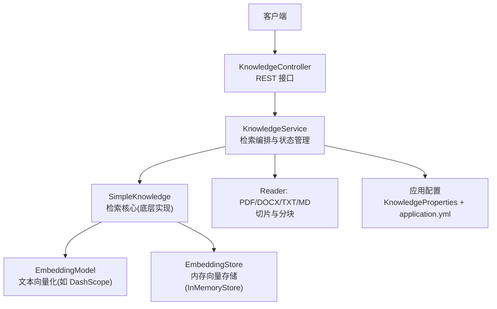
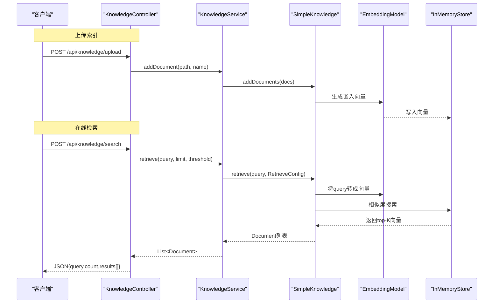
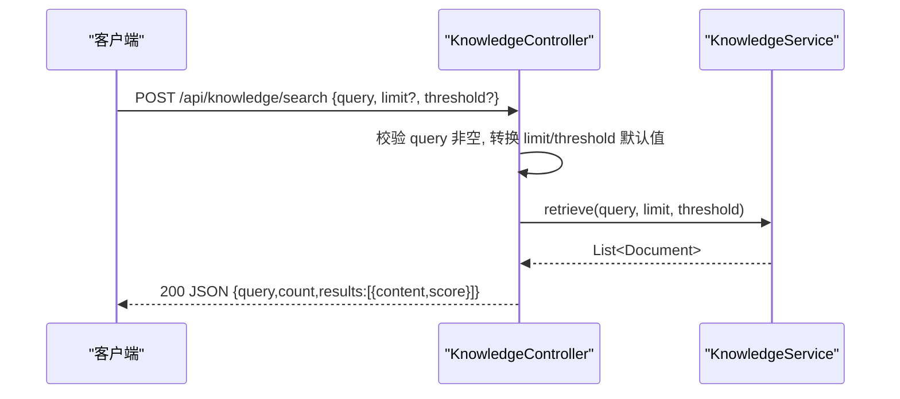
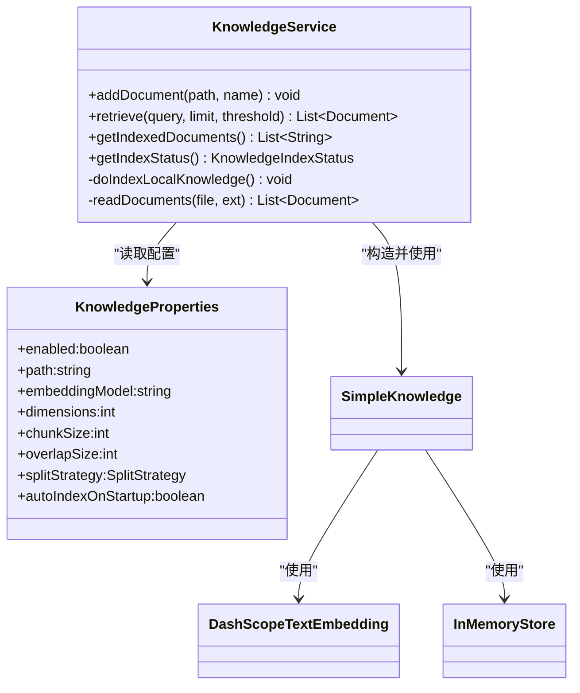
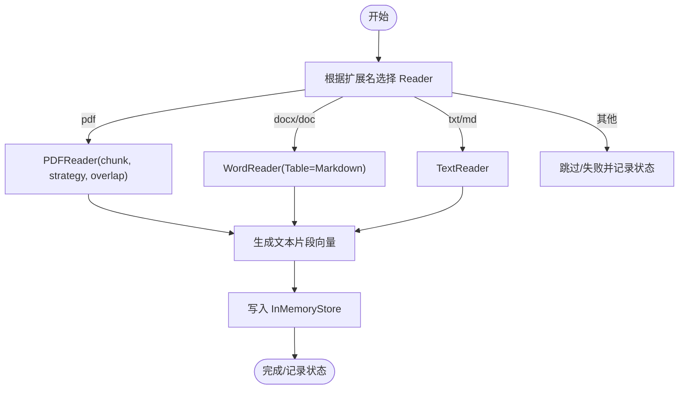
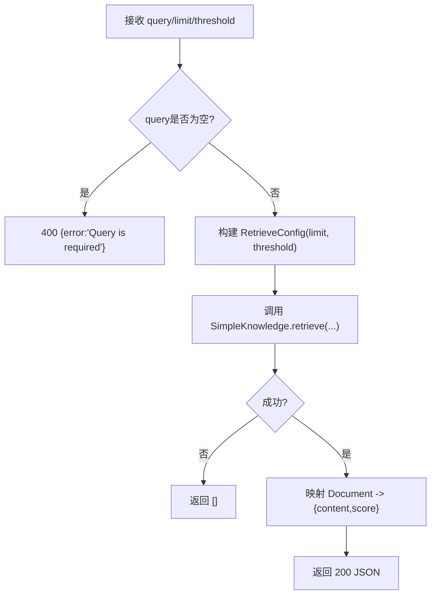
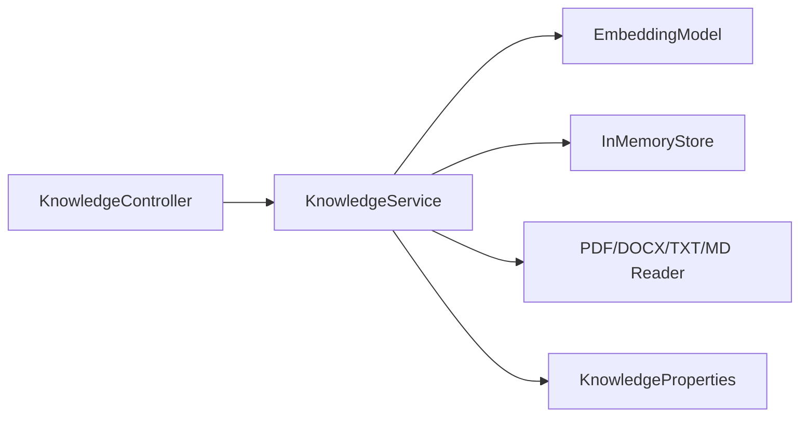

# 检索系统

<cite>
**本文档中引用的文件**
- [KnowledgeController.java](file://src/main/java/com/skloda/agentscope/controller/KnowledgeController.java)
- [KnowledgeService.java](file://src/main/java/com/skloda/agentscope/service/KnowledgeService.java)
- [KnowledgeProperties.java](file://src/main/java/com/skloda/agentscope/service/KnowledgeProperties.java)
- [KnowledgeIndexStatus.java](file://src/main/java/com/skloda/agentscope/model/KnowledgeIndexStatus.java)
- [KnowledgeFileStatus.java](file://src/main/java/com/skloda/agentscope/model/KnowledgeFileStatus.java)
- [application.yml](file://src/main/resources/application.yml)
- [KnowledgeControllerTest.java](file://src/test/java/com/skloda/agentscope/controller/KnowledgeControllerTest.java)
- [KnowledgeServiceStatusTest.java](file://src/test/java/com/skloda/agentscope/service/KnowledgeServiceStatusTest.java)
</cite>

## 目录
1. [简介](#简介)
2. [项目结构](#项目结构)
3. [核心组件](#核心组件)
4. [架构总览](#架构总览)
5. [详细组件分析](#详细组件分析)
6. [依赖关系分析](#依赖关系分析)
7. [性能考量](#性能考量)
8. [故障排查指南](#故障排查指南)
9. [结论](#结论)
10. [附录](#附录)

## 简介
本技术文档聚焦于项目的 RAG（检索增强生成）知识库检索子系统，围绕查询理解、向量相似度计算、候选文档排序与结果融合策略等关键环节进行系统化说明；并详尽文档化 /api/knowledge/search 接口规范（请求参数校验、响应结构与错误处理）、检索优化选项（RetrieveConfig 配置项、阈值与上限控制）、多文档类型检索策略、查询优化、缓存策略、批量查询方法、效果评估与持续改进实践等，以便研发和运维人员高效定位问题、优化检索质量与性能。

## 项目结构
RAG 检索能力由控制器、服务、模型与配置共同构成，遵循典型分层设计：
- 控制器层：暴露 REST 接口，负责入参校验与返回封装
- 服务层：组装检索流程（读取文档→构建检索配置→调用底层 Knowledge 进行检索），管理本地知识扫描与索引状态
- 模型层：表达索引任务与文件级别的状态与元数据
- 配置层：提供嵌入模型、维度、分块策略、是否启用、启动自动索引等开关

图表来源
- [KnowledgeController.java:27-130](file://src/main/java/com/skloda/agentscope/controller/KnowledgeController.java#L27-L130)
- [KnowledgeService.java:73-89](file://src/main/java/com/skloda/agentscope/service/KnowledgeService.java#L73-L89)
- [KnowledgeService.java:323-335](file://src/main/java/com/skloda/agentscope/service/KnowledgeService.java#L323-L335)
- [KnowledgeProperties.java:8-21](file://src/main/java/com/skloda/agentscope/service/KnowledgeProperties.java#L8-L21)
- [application.yml:62-70](file://src/main/resources/application.yml#L62-L70)

章节来源
- [KnowledgeController.java:27-130](file://src/main/java/com/skloda/agentscope/controller/KnowledgeController.java#L27-L130)
- [KnowledgeService.java:60-89](file://src/main/java/com/skloda/agentscope/service/KnowledgeService.java#L60-L89)
- [KnowledgeProperties.java:8-21](file://src/main/java/com/skloda/agentscope/service/KnowledgeProperties.java#L8-L21)
- [application.yml:62-70](file://src/main/resources/application.yml#L62-L70)

## 核心组件
- 控制器(KnowledgeController)：定义 /api/knowledge 下的上传、列表、状态查询、检索与删除接口，承担请求校验与简单结果映射。
- 服务(KnowledgeService)：维护 SimpleKnowledge 实例（含 EmbeddingModel 与 InMemoryStore），支持本地知识目录扫描、后台索引、增量/手动索引、检索与状态快照。
- 配置(KnowledgeProperties)：通过 spring.config.properties 注入知识功能开关、路径、嵌入模型名、维度、切分策略、chunk/overlap 等。
- 状态模型(KnowledgeIndexStatus、KnowledgeFileStatus)：描述整体索引任务进度与各文件解析/向量化子任务状态。

关键职责与边界
- 控制器负责“安全入库”的入口校验（空文件、扩展名白名单）与统一异常包装。
- 服务负责“可扩展的分片/切片读取器”与“统一的检索封装”，对外屏蔽底层 Reader/Store 细节。
- 配置用于“可插拔地切换嵌入模型与存储容量限制”。

章节来源
- [KnowledgeController.java:37-130](file://src/main/java/com/skloda/agentscope/controller/KnowledgeController.java#L37-L130)
- [KnowledgeService.java:73-89](file://src/main/java/com/skloda/agentscope/service/KnowledgeService.java#L73-L89)
- [KnowledgeProperties.java:10-21](file://src/main/java/com/skloda/agentscope/service/KnowledgeProperties.java#L10-L21)
- [KnowledgeIndexStatus.java:9-59](file://src/main/java/com/skloda/agentscope/model/KnowledgeIndexStatus.java#L9-L59)
- [KnowledgeFileStatus.java:8-28](file://src/main/java/com/skloda/agentscope/model/KnowledgeFileStatus.java#L8-L28)

## 架构总览
检索流水线分为两条主线：索引与检索。索引为离线或热更新准备向量，检索为在线快速召回相似段落。

图表来源
- [KnowledgeController.java:99-121](file://src/main/java/com/skloda/agentscope/controller/KnowledgeController.java#L99-L121)
- [KnowledgeService.java:247-259](file://src/main/java/com/skloda/agentscope/service/KnowledgeService.java#L247-L259)
- [KnowledgeService.java:143-178](file://src/main/java/com/skloda/agentscope/service/KnowledgeService.java#L143-L178)
- [KnowledgeService.java:82-89](file://src/main/java/com/skloda/agentscope/service/KnowledgeService.java#L82-L89)

## 详细组件分析

### 组件A：KnowledgeController（接口与校验）
- 职责：暴露 REST API，做参数校验与错误封装；把搜索结果转换为轻量 JSON 返回。
- 关键流程：
  - 上传：校验文件非空、扩展名在白名单，落盘到临时目录后调服务索引
  - 搜索：从 Body 取 query/limit/threshold，默认值分别为空串/3/0.5，调用服务检索并截取 content 片段
  - 状态：返回列表/当前索引任务状态

图表来源
- [KnowledgeController.java:99-121](file://src/main/java/com/skloda/agentscope/controller/KnowledgeController.java#L99-L121)

章节来源
- [KnowledgeController.java:37-130](file://src/main/java/com/skloda/agentscope/controller/KnowledgeController.java#L37-L130)
- [KnowledgeControllerTest.java:27-48](file://src/test/java/com/skloda/agentscope/controller/KnowledgeControllerTest.java#L27-L48)

### 组件B：KnowledgeService（检索编排与索引状态）
- 职责：构造 SimpleKnowledge（嵌入模型+内存向量存储），提供本地知识库扫描与后台索引、单次上传索引、检索与状态查询能力。
- 检索实现：使用 RetrieveConfig 指定 topK 与 scoreThreshold，屏蔽同步阻塞细节（.block）。
- 文档读取：按扩展名选择 PDFReader/WordReader/TextReader，统一使用 chunkSize、splitStrategy、overlapSize。

图表来源
- [KnowledgeService.java:60-89](file://src/main/java/com/skloda/agentscope/service/KnowledgeService.java#L60-L89)
- [KnowledgeService.java:247-259](file://src/main/java/com/skloda/agentscope/service/KnowledgeService.java#L247-L259)
- [KnowledgeProperties.java:10-21](file://src/main/java/com/skloda/agentscope/service/KnowledgeProperties.java#L10-L21)

章节来源
- [KnowledgeService.java:60-89](file://src/main/java/com/skloda/agentscope/service/KnowledgeService.java#L60-L89)
- [KnowledgeService.java:140-178](file://src/main/java/com/skloda/agentscope/service/KnowledgeService.java#L140-L178)
- [KnowledgeService.java:247-259](file://src/main/java/com/skloda/agentscope/service/KnowledgeService.java#L247-L259)
- [KnowledgeService.java:323-335](file://src/main/java/com/skloda/agentscope/service/KnowledgeService.java#L323-L335)

### 组件C：文档类型与检索策略
- 支持的输入文档类型及读取方式：
  - PDF：PDFReader 按 chunkSize 与 splitStrategy 分块，保留 overlapSize 以平滑语义断点
  - DOCX/DOC：WordReader 使用 TableFormat.MARKDOWN 解析表格为 Markdown，便于后续嵌入匹配
  - TXT/MD：TextReader 直接文本分块
- 对图片等多模态内容：当前实现不包含 OCR 分支，遇到图片会被跳过；可在扩展中引入 OCR 后再走相同向量流程
- 嵌入模型与维度：通过 KnowledgeProperties.embeddingModel 与 dimensions 控制，当前配置指向 DashScope 提供的文本嵌入

图表来源
- [KnowledgeService.java:323-335](file://src/main/java/com/skloda/agentscope/service/KnowledgeService.java#L323-L335)
- [KnowledgeServiceStatusTest.java:99-117](file://src/test/java/com/skloda/agentscope/service/KnowledgeServiceStatusTest.java#L99-L117)

章节来源
- [KnowledgeService.java:323-335](file://src/main/java/com/skloda/agentscope/service/KnowledgeService.java#L323-L335)
- [KnowledgeServiceStatusTest.java:99-117](file://src/test/java/com/skloda/agentscope/service/KnowledgeServiceStatusTest.java#L99-L117)

### 检索工作流程与配置项详解（RetrieveConfig、阈值、上限）
- 检索工作流：
  1) 接收请求参数 query/limit/threshold
  2) 构建 RetrieveConfig(limit, scoreThreshold)
  3) 调用 SimpleKnowledge.retrieve 进行相似度检索
  4) 过滤或交由上层决定最终返回（当前为直接使用检索返回列表）
- 参数说明：
  - query：必填字符串，空白时返回 400
  - limit：整数，默认 3
  - threshold：双精度，默认 0.5，作为分数阈值过滤
- 行为特性：
  - 若检索过程中异常，返回空列表并记录日志，不会向上抛出
  - 结果以轻量对象返回：content 为原文片段的前 200 字符，score 为浮点分数字符串

图表来源
- [KnowledgeController.java:99-121](file://src/main/java/com/skloda/agentscope/controller/KnowledgeController.java#L99-L121)
- [KnowledgeService.java:247-259](file://src/main/java/com/skloda/agentscope/service/KnowledgeService.java#L247-L259)

章节来源
- [KnowledgeController.java:99-121](file://src/main/java/com/skloda/agentscope/controller/KnowledgeController.java#L99-L121)
- [KnowledgeService.java:247-259](file://src/main/java/com/skloda/agentscope/service/KnowledgeService.java#L247-L259)

## 依赖关系分析
- 控制器与服务：单一职责分离，控制器只做参数校验与结果映射，业务编排下沉至服务
- 服务与底层：
  - EmbeddingModel：用于将文本片段与查询转为向量（DashScope）
  - InMemoryStore：内存版向量库，适合演示与本地开发，注意重启即清空
  - Reader：按类型加载文本并分块
- 配置耦合：KnowledgeProperties 影响嵌入维度、分块大小与重叠度，需与嵌入模型匹配

图表来源
- [KnowledgeController.java:27-130](file://src/main/java/com/skloda/agentscope/controller/KnowledgeController.java#L27-L130)
- [KnowledgeService.java:73-89](file://src/main/java/com/skloda/agentscope/service/KnowledgeService.java#L73-L89)
- [KnowledgeProperties.java:10-21](file://src/main/java/com/skloda/agentscope/service/KnowledgeProperties.java#L10-L21)

章节来源
- [KnowledgeController.java:27-130](file://src/main/java/com/skloda/agentscope/controller/KnowledgeController.java#L27-L130)
- [KnowledgeService.java:60-89](file://src/main/java/com/skloda/agentscope/service/KnowledgeService.java#L60-L89)
- [KnowledgeProperties.java:10-21](file://src/main/java/com/skloda/agentscope/service/KnowledgeProperties.java#L10-L21)

## 性能考量
- 向量存储：InMemoryStore 适合本地开发与演示；生产环境建议替换为持久化向量库以提升稳定性与规模
- 分块与重叠：chunkSize 过小导致语义碎片、过大可能稀释重点；overlapSize 有助于缓解边界信息丢失
- 嵌入维度：需与所选嵌入模型保持一致，过大增加内存占用，过小影响召回准确率
- 检索阈值与TopK：threshold 越高越严格，recall 降低但 precision 提升；limit 控制开销与前端展示长度
- 并发与线程：上传/本地索引在后台单线程执行，避免阻塞主线程；高吞吐场景可考虑并行分块与索引队列

[本节不直接分析具体文件]

## 故障排查指南
- 常见问题与现象
  - 上传报错“不支持的文件类型”：扩展名不在白名单；请检查文件名后缀或使用 .pdf/.docx/.txt/.md
  - 检索结果为空：可能因未构建索引、阈值过高或文档分块不当；可通过 /api/knowledge/status 查看状态
  - 本地知识库为空：autoIndexOnStartup 关闭或未配置 knowledge.path；确认目录与权限
  - 图片类文档无法检索：当前未实现 OCR 分支，会被跳过一个标记为 SKIP；需要扩展 OCR
  - 删除文档后仍出现旧结果：InMemoryStore 删除暂不支持，存在陈旧向量可能
- 排查步骤
  1) 调用 GET /api/knowledge/documents 确认已索引清单
  2) 调用 GET /api/knowledge/status 查看每个文件的解析/索引状态与错误信息
  3) 检查 application.yml 中 agentscope.knowledge.* 配置是否与嵌入模型一致
  4) 针对失败文件尝试手动上传，核对扩展名与内容完整性

章节来源
- [KnowledgeController.java:40-78](file://src/main/java/com/skloda/agentscope/controller/KnowledgeController.java#L40-L78)
- [KnowledgeService.java:169-175](file://src/main/java/com/skloda/agentscope/service/KnowledgeService.java#L169-L175)
- [KnowledgeServiceStatusTest.java:99-117](file://src/test/java/com/skloda/agentscope/service/KnowledgeServiceStatusTest.java#L99-L117)
- [KnowledgeServiceStatusTest.java:120-133](file://src/test/java/com/skloda/agentscope/service/KnowledgeServiceStatusTest.java#L120-L133)
- [KnowledgeService.java:278-284](file://src/main/java/com/skloda/agentscope/service/KnowledgeService.java#L278-L284)

## 结论
该 RAG 检索系统在 Spring Boot 应用中提供了开箱即用的文档索引与检索能力：通过 SimpleKnowledge 统一管理嵌入与相似度检索，结合多种 Reader 对不同文档类型进行标准化分块，并通过简洁的 /api/knowledge/* 接口暴露能力。通过合理的阈值与 TopK 配置、合适的分块策略、以及从 InMemory 向持久化向量库的演进，可以在保证易用性的同时获得更稳定与高效的检索体验。

## 附录

### API 规范：/api/knowledge/search
- 方法与路径
  - POST /api/knowledge/search
- 请求体（JSON）
  - query: string，必填
  - limit: integer，可选，默认 3
  - threshold: number，可选，默认 0.5
- 成功响应
  - HTTP 200，结构示例：
    - query: string
    - count: integer
    - results: array of object
      - content: string（截断到前若干字符）
      - score: string（相似度分值）
- 错误处理
  - query 为空或空白：HTTP 400，响应体包含 error 字段
  - 检索内部异常：返回 200 且 results 为空数组（记录服务端日志）
- 行为约定
  - 所有字段缺失时使用默认值
  - content 为片段摘要（不超过固定长度），便于前端快速展示
  - score 采用数值类型序列化为字符串返回

章节来源
- [KnowledgeController.java:99-121](file://src/main/java/com/skloda/agentscope/controller/KnowledgeController.java#L99-L121)
- [KnowledgeService.java:247-259](file://src/main/java/com/skloda/agentscope/service/KnowledgeService.java#L247-L259)

### 查询优化技巧
- 合理设置 threshold：提高以提升精确率，降低以提高召回率；可按场景灰度对比不同阈值的效果
- 调整 limit：结合前端分页/截断能力，避免一次性返回过多造成网络与渲染开销
- 预查与缓存：对高频 query 可以做去重缓存（键可为规范化后的 query），命中直接返回
- 查询重写：在上游做同义词扩展、停用词移除、拼写纠错与术语归一化，可显著提升召回

[本节不直接分析具体文件]

### 批量查询处理方法
- 推荐做法
  - 前端聚合多次请求为一次批量请求，服务端新增批量接口或复用同一逻辑分批处理
  - 服务端侧使用批处理嵌入与并行检索（注意限流与后端压力）
  - 对重复查询进行结果缓存与 TTL 控制，避免冗余计算

[本节不直接分析具体文件]

### 检索效果评估与持续改进
- 评估指标
  - 命中率（Recall@K）、精确率（Precision@K）、平均倒数排名（MRR）、nDCG 等
- A/B 测试框架
  - 上线新策略（如改变 threshold/chunk 策略/嵌入模型）时，将流量按比例划分，记录点击、采纳与停留时长等埋点
  - 通过对照实验观察指标差异，结合人工抽检进行二次校准
- 持续改进
  - 收集 bad cases 并进行关键词/段落级别的根因分析
  - 逐步完善多模态内容（OCR、图表解析）的抽取与对齐
  - 引入更优的检索器（如跨语言/领域适配的嵌入模型）与持久化存储

[本节不直接分析具体文件]

### 应用配置参考（agentscope.knowledge）
以下为 application.yml 中与 RAG 相关的关键配置项说明与默认含义（实际值以配置文件为准）：
- agentscope.knowledge.enabled：是否启用知识功能
- agentscope.knowledge.path：本地知识库目录路径
- agentscope.knowledge.embedding-model：嵌入模型名称（例如 DashScope 文本嵌入）
- agentscope.knowledge.dimensions：向量维度
- agentscope.knowledge.chunk-size：分块大小
- agentscope.knowledge.overlap-size：分块重叠量
- agentscope.knowledge.split-strategy：分块策略（如 PARAGRAPH）
- agentscope.knowledge.auto-index-on-startup：启动时自动扫描索引

章节来源
- [application.yml:62-70](file://src/main/resources/application.yml#L62-L70)
- [KnowledgeProperties.java:10-21](file://src/main/java/com/skloda/agentscope/service/KnowledgeProperties.java#L10-L21)