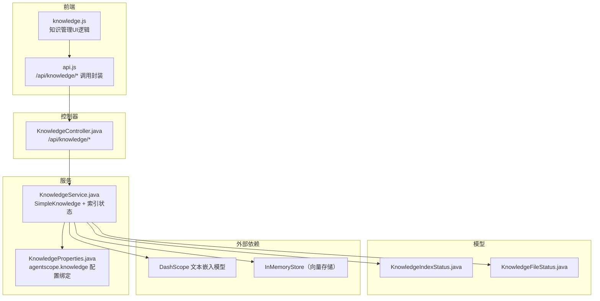
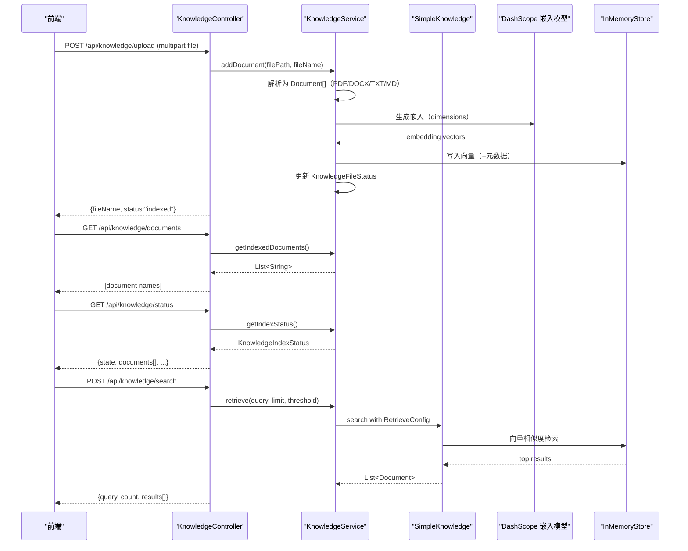
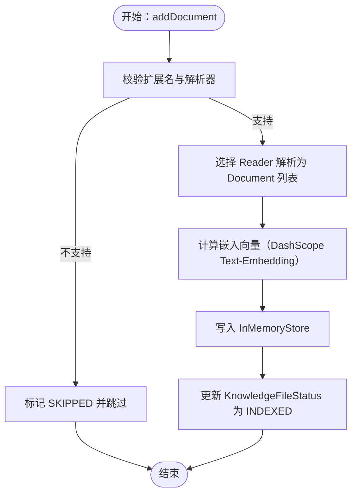
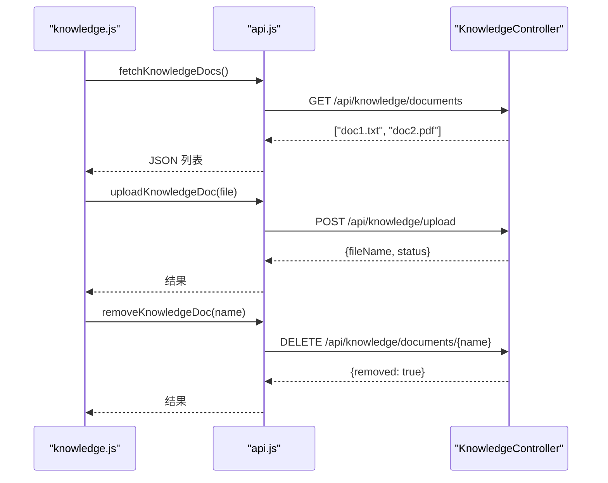
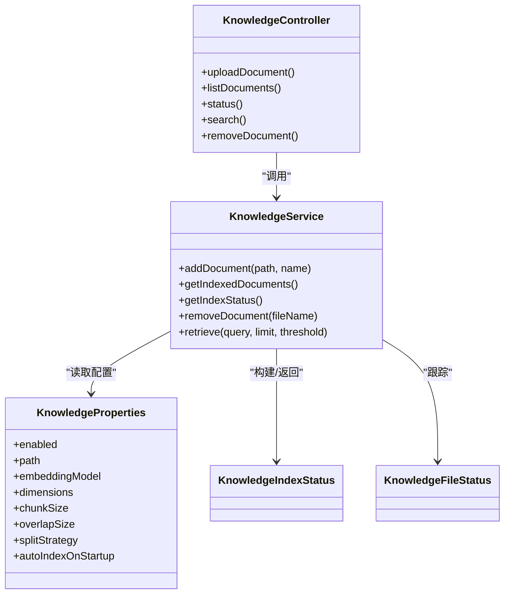

# 知识库管理

<cite>
**本文引用的文件**
- [KnowledgeController.java](file://src/main/java/com/skloda/agentscope/controller/KnowledgeController.java)
- [KnowledgeService.java](file://src/main/java/com/skloda/agentscope/service/KnowledgeService.java)
- [KnowledgeProperties.java](file://src/main/java/com/skloda/agentscope/service/KnowledgeProperties.java)
- [KnowledgeIndexStatus.java](file://src/main/java/com/skloda/agentscope/model/KnowledgeIndexStatus.java)
- [KnowledgeFileStatus.java](file://src/main/java/com/skloda/agentscope/model/KnowledgeFileStatus.java)
- [application.yml](file://src/main/resources/application.yml)
- [knowledge.js](file://src/main/resources/static/scripts/modules/knowledge.js)
- [api.js](file://src/main/resources/static/scripts/api.js)
- [2026-04-29-generic-rag-local-knowledge-design.md](file://docs/superpowers/specs/2026-04-29-generic-rag-local-knowledge-design.md)
- [2026-04-29-generic-rag-local-knowledge.md](file://docs/superpowers/plans/2026-04-29-generic-rag-local-knowledge.md)
- [KnowledgeControllerTest.java](file://src/test/java/com/skloda/agentscope/controller/KnowledgeControllerTest.java)
</cite>

## 目录
1. [简介](#简介)
2. [项目结构](#项目结构)
3. [核心组件](#核心组件)
4. [架构总览](#架构总览)
5. [详细组件分析](#详细组件分析)
6. [依赖关系分析](#依赖关系分析)
7. [性能考量](#性能考量)
8. [故障排查指南](#故障排查指南)
9. [结论](#结论)
10. [附录](#附录)

## 简介
本文件针对仓库中的 RAG 知识库管理能力进行系统化技术文档说明，覆盖文档上传、索引构建、版本控制与删除的生命周期管理；对 KnowledgeController 的 RESTful API（/upload、/documents、/status、/search、/documents/{fileName}）进行完整接口规范说明；梳理 KnowledgeProperties 的配置机制与默认值；并结合前端模块给出集成示例。同时提供运维侧的备份恢复、迁移升级、性能监控与故障排查建议，以及批量操作脚本与管理界面定制方案。

## 项目结构
知识库相关的代码集中在 controller、service、model 三层，并配合前端静态脚本完成交互：
- Controller 层：统一暴露 /api/knowledge/* 端点，承载上传、查询、检索、状态及删除等操作。
- Service 层：封装 SimpleKnowledge 实例、嵌入模型与 InMemoryStore 初始化、后台自动索引、逐文件索引状态维护等。
- Model 层：定义全局索引状态 KnowledgeIndexStatus 与单文件状态 KnowledgeFileStatus。
- 配置层：application.yml 中 agentscope.knowledge 字段控制行为；KnowledgeProperties 提供 typed 绑定。
- 前端层：knowledge.js、api.js 通过 /api/knowledge/documents、/api/knowledge/upload、/api/knowledge/status 等接口与后端联动。

图表来源
- [KnowledgeController.java:27-131](file://src/main/java/com/skloda/agentscope/controller/KnowledgeController.java#L27-L131)
- [KnowledgeService.java:51-88](file://src/main/java/com/skloda/agentscope/service/KnowledgeService.java#L51-L88)
- [KnowledgeProperties.java:8-21](file://src/main/java/com/skloda/agentscope/service/KnowledgeProperties.java#L8-L21)
- [KnowledgeIndexStatus.java:9-59](file://src/main/java/com/skloda/agentscope/model/KnowledgeIndexStatus.java#L9-L59)
- [KnowledgeFileStatus.java:8-28](file://src/main/java/com/skloda/agentscope/model/KnowledgeFileStatus.java#L8-L28)

章节来源
- [KnowledgeController.java:27-131](file://src/main/java/com/skloda/agentscope/controller/KnowledgeController.java#L27-L131)
- [KnowledgeService.java:51-88](file://src/main/java/com/skloda/agentscope/service/KnowledgeService.java#L51-L88)
- [KnowledgeProperties.java:8-21](file://src/main/java/com/skloda/agentscope/service/KnowledgeProperties.java#L8-L21)
- [application.yml:62-70](file://src/main/resources/application.yml#L62-L70)

## 核心组件
- KnowledgeController：REST 控制器，暴露 /api/knowledge 下上传、列表、状态、搜索与删除接口。
- KnowledgeService：RAG 生命周期核心服务，负责创建 SimpleKnowledge、InMemoryStore，处理上传文件的解析与向量化索引，跟踪每个文件的索引状态并暴露聚合状态快照。
- KnowledgeProperties：应用配置属性，控制是否启用、知识目录路径、嵌入模型、维度、分块策略等。
- KnowledgeIndexStatus 与 KnowledgeFileStatus：描述整体索引进度和单个文件处理的细粒度状态，供前端展示与管理。

章节来源
- [KnowledgeController.java:27-131](file://src/main/java/com/skloda/agentscope/controller/KnowledgeController.java#L27-L131)
- [KnowledgeService.java:51-196](file://src/main/java/com/skloda/agentscope/service/KnowledgeService.java#L51-L196)
- [KnowledgeProperties.java:8-21](file://src/main/java/com/skloda/agentscope/service/KnowledgeProperties.java#L8-L21)
- [KnowledgeIndexStatus.java:9-59](file://src/main/java/com/skloda/agentscope/model/KnowledgeIndexStatus.java#L9-L59)
- [KnowledgeFileStatus.java:8-28](file://src/main/java/com/skloda/agentscope/model/KnowledgeFileStatus.java#L8-L28)

## 架构总览
RAG 知识库的工作流如下：
- 启动阶段：若启用且配置为自动索引，则在 ApplicationReadyEvent 后以守护线程异步扫描本地知识目录并增量索引支持的文件类型。
- 用户操作：
  - 上传文件：前端 POST /api/knowledge/upload，服务端保存到临时目录，触发 addDocument 将文件解析为若干 chunks，写入 SimpleKnowledge 的 InMemoryStore，并更新单文件状态。
  - 查看已索引文件：GET /api/knowledge/documents。
  - 获取当前索引状态：GET /api/knowledge/status，返回聚合的索引进度与每个文件的状态。
  - 检索增强：POST /api/knowledge/search，按 query 使用 retrieve 返回 Top-N 片段及相似度得分。
  - 删除文件：DELETE /api/knowledge/documents/{fileName}。

图表来源
- [KnowledgeController.java:40-131](file://src/main/java/com/skloda/agentscope/controller/KnowledgeController.java#L40-L131)
- [KnowledgeService.java:143-196](file://src/main/java/com/skloda/agentscope/service/KnowledgeService.java#L143-L196)
- [KnowledgeService.java:73-88](file://src/main/java/com/skloda/agentscope/service/KnowledgeService.java#L73-L88)

## 详细组件分析

### REST API 规范（KnowledgeController）
- POST /api/knowledge/upload
  - 请求体：multipart/form-data，参数名 file
  - 校验：非空、文件名存在、扩展名仅允许 pdf/docx/txt/md
  - 处理：保存至系统临时目录 agentscope-knowledge，调用服务层 addDocument
  - 返回：成功时包含 fileName 与 status；失败时 error 信息
  - 错误处理：为空/非法格式/IO异常分别返回相应错误响应体
- GET /api/knowledge/documents
  - 返回已索引文档名称列表（String[]）
- GET /api/knowledge/status
  - 返回聚合状态 KnowledgeIndexStatus，包含整体 state、时间戳、文件清单与计数统计
- POST /api/knowledge/search
  - 请求体：{"query": "...", "limit": Number?, "threshold": Number?}
  - 校验：query 必填
  - 返回：{query, count, results[{content, score}]}
- DELETE /api/knowledge/documents/{fileName}
  - 删除指定文档的索引记录，并返回 removed 标志
- 权限与安全
  - 当前实现未内置基于角色的访问控制或 IP 白名单
  - 若需启用权限控制，建议结合 Spring Security 在 Controller 层面增加注解或 Filter
  - 审计日志可通过拦截器或中间件记录关键操作（如上传、删除、检索）

章节来源
- [KnowledgeController.java:27-131](file://src/main/java/com/skloda/agentscope/controller/KnowledgeController.java#L27-L131)

### 生命周期与索引策略（KnowledgeService）
- 初始化
  - 根据 KnowledgeProperties 构建 DashScopeTextEmbedding（模型名与维度可配）与 InMemoryStore
  - 构造 SimpleKnowledge 实例（InMemoryStore 作为向量存储）
- 后台索引（自动）
  - 监听 ApplicationReadyEvent，若 enabled=true 且 autoIndexOnStartup=true，则以守护线程扫描本地 knowledge 目录并索引支持的文件
  - 并发控制：AtomicBoolean 防止重复启动同一轮索引
  - 线程安全：后台执行器 SingleThreadExecutor，关闭时优雅停机
- 逐文件索引
  - addDocument：校验扩展名、选择 Reader 解析为 Document，写入 SimpleKnowledge，追踪 KnowledgeFileStatus（PENDING/INDEXING/INDEXED/SKIPPED/FAILED）
  - 错误不影响其他文件继续索引
- 状态快照
  - getIndexStatus：聚合 KnowledgeIndexStatus，统计 totalFiles/indexedFiles/skippedFiles/failedFiles 并携带 startedAt/finishedAt 与文档列表
- 删除语义
  - removeDocument：从“已索引列表”角度进行移除（实际向量库 InMemoryStore 当前无法可靠删除，设计备注可能残留向量）
- 文件读取与分块
  - 支持的 reader：pdf/pdfbox、docx/word、txt/text、markdown
  - 分块：chunkSize、overlapSize、splitStrategy（段落/标记符等）来自配置

图表来源
- [KnowledgeService.java:91-125](file://src/main/java/com/skloda/agentscope/service/KnowledgeService.java#L91-L125)
- [KnowledgeService.java:143-178](file://src/main/java/com/skloda/agentscope/service/KnowledgeService.java#L143-L178)

章节来源
- [KnowledgeService.java:51-196](file://src/main/java/com/skloda/agentscope/service/KnowledgeService.java#L51-L196)
- [2026-04-29-generic-rag-local-knowledge-design.md:30-148](file://docs/superpowers/specs/2026-04-29-generic-rag-local-knowledge-design.md#L30-L148)

### 配置属性（KnowledgeProperties）
- 作用域：application.yml 中 agentscope.knowledge.* 绑定到 KnowledgeProperties
- 关键属性
  - enabled：是否启用知识库功能（默认 true）
  - path：本地知识目录路径（默认 knowledge），用于自动索引根目录
  - embeddingModel：嵌入模型名称（默认 text-embedding-v3）
  - dimensions：向量维度（默认 1024）
  - chunkSize：分块大小（默认 512）
  - overlapSize：重叠大小（默认 50）
  - splitStrategy：分块策略（默认 PARAGRAPH）
  - autoIndexOnStartup：应用启动后自动索引本地知识（默认 true）
- 验证与生效
  - 构造函数直接使用该属性实例化 DashScopeTextEmbedding 与 InMemoryStore
  - ApplicationReadyEvent 后依据 enabled 与 autoIndexOnStartup 决定是否触发自检索引任务

章节来源
- [KnowledgeProperties.java:8-21](file://src/main/java/com/skloda/agentscope/service/KnowledgeProperties.java#L8-L21)
- [application.yml:62-70](file://src/main/resources/application.yml#L62-L70)
- [KnowledgeService.java:73-88](file://src/main/java/com/skloda/agentscope/service/KnowledgeService.java#L73-L88)
- [KnowledgeService.java:91-125](file://src/main/java/com/skloda/agentscope/service/KnowledgeService.java#L91-L125)

### 数据模型
- KnowledgeIndexStatus
  - 字段：state（EMPTY/PENDING/INDEXING/READY/READY_WITH_ERRORS/FAILED）、knowledgePath、startedAt、finishedAt、documents 列表
  - 自动统计：totalFiles、indexedFiles、skippedFiles、failedFiles
- KnowledgeFileStatus
  - 字段：fileName、relativePath、absolutePath、extension、status（PENDING/INDEXING/INDEXED/SKIPPED/FAILED）、chunkCount、message、updatedAt

章节来源
- [KnowledgeIndexStatus.java:9-59](file://src/main/java/com/skloda/agentscope/model/KnowledgeIndexStatus.java#L9-L59)
- [KnowledgeFileStatus.java:8-28](file://src/main/java/com/skloda/agentscope/model/KnowledgeFileStatus.java#L8-L28)

### 前端集成与交互
- 列举文档：调用 /api/knowledge/documents，渲染文档条目并提供删除按钮
- 上传文件：调用 /api/knowledge/upload，上传成功后刷新文档列表
- 删除文档：调用 /api/knowledge/documents/{fileName}，删除后刷新列表
- 状态获取：可调用 /api/knowledge/status 拉取聚合索引状态并展示（计划由 UI 轮询）

图表来源
- [knowledge.js:5-59](file://src/main/resources/static/scripts/modules/knowledge.js#L5-L59)
- [api.js:83-103](file://src/main/resources/static/scripts/api.js#L83-L103)
- [KnowledgeController.java:40-131](file://src/main/java/com/skloda/agentscope/controller/KnowledgeController.java#L40-L131)

章节来源
- [knowledge.js:5-59](file://src/main/resources/static/scripts/modules/knowledge.js#L5-L59)
- [api.js:83-103](file://src/main/resources/static/scripts/api.js#L83-L103)
- [KnowledgeController.java:40-131](file://src/main/java/com/skloda/agentscope/controller/KnowledgeController.java#L40-L131)

## 依赖关系分析
- Controller → Service：所有操作委托给 KnowledgeService
- Service → AgentScope RAG：SimpleKnowledge、Reader、RetrieveConfig、InMemoryStore
- Service → 嵌入模型：DashScopeTextEmbedding（apiKey、modelName、dimensions）
- 配置：通过 @Value 注入 DASHSCOPE_API_KEY；通过 KnowledgeProperties 注入 agentscope.knowledge.*
- 测试：KnowledgeControllerTest 验证 status 方法的行为

图表来源
- [KnowledgeController.java:27-131](file://src/main/java/com/skloda/agentscope/controller/KnowledgeController.java#L27-L131)
- [KnowledgeService.java:51-196](file://src/main/java/com/skloda/agentscope/service/KnowledgeService.java#L51-L196)
- [KnowledgeProperties.java:8-21](file://src/main/java/com/skloda/agentscope/service/KnowledgeProperties.java#L8-L21)
- [KnowledgeIndexStatus.java:9-59](file://src/main/java/com/skloda/agentscope/model/KnowledgeIndexStatus.java#L9-L59)
- [KnowledgeFileStatus.java:8-28](file://src/main/java/com/skloda/agentscope/model/KnowledgeFileStatus.java#L8-L28)

章节来源
- [KnowledgeControllerTest.java:18-49](file://src/test/java/com/skloda/agentscope/controller/KnowledgeControllerTest.java#L18-L49)

## 性能考量
- 后台索引采用守护线程，避免阻塞应用启动；但需注意长时间大文件可能占用 CPU/内存峰值
- 使用 InMemoryStore 意味着向量存储在进程重启后会丢失，不适合持久化部署
- 合理设置 chunkSize 与 overlapSize，平衡检索精度与检索成本
- 限制搜索返回数量与阈值，降低网络传输与大对象序列化开销
- 高并发上传场景应考虑限流、队列化与磁盘缓冲策略（当前为同步落盘）
- 生产环境建议评估切换至持久化向量数据库（如 Redis、MySQL、PostgreSQL）并评估迁移代价

[本节为通用优化建议，不涉及具体文件]

## 故障排查指南
- 启动后无自动索引
  - 检查 KnowledgeProperties.enabled 与 autoIndexOnStartup 是否为 true
  - 确认 knowledge.path 指向有效的本地目录，包含受支持的文档
  - 参考设计规划文档对后台索引条件说明
- 上传失败
  - 确保文件格式为 pdf/docx/txt/md
  - 检查临时目录权限与服务端日志错误栈
- 搜索结果为空或质量不佳
  - 调整 threshold 与 limit
  - 检查 chunkSize、overlapSize、splitStrategy 是否合适
  - 关注嵌入模型是否可用且维度匹配
- 删除无效或不生效
  - 当前 InMemoryStore 删除不在设计范围内，删除仅移除“已知索引列表”，向量可能存在残留
  - 如需彻底删除，需替换为具备删除能力的向量存储后端

章节来源
- [KnowledgeService.java:73-125](file://src/main/java/com/skloda/agentscope/service/KnowledgeService.java#L73-L125)
- [2026-04-29-generic-rag-local-knowledge-design.md:51-108](file://docs/superpowers/specs/2026-04-29-generic-rag-local-knowledge-design.md#L51-L108)

## 结论
本项目实现了轻量级 RAG 知识库能力，包括文件上传与解析、后台自动索引、状态可视化与相似检索。由于使用 InMemoryStore，其适合演示与开发调试；生产环境应评估持久化向量存储、权限控制与审计日志等增强能力。通过合理的配置与前端联动，可快速搭建知识库问答体验。

[本节为总结性内容，不涉及具体文件]

## 附录

### API 清单与规格
- POST /api/knowledge/upload
  - 输入：MultipartFile file（pdf/docx/txt/md）
  - 返回：{fileName, status} 或 {error}
- GET /api/knowledge/documents
  - 返回：字符串数组（已索引文件名称）
- GET /api/knowledge/status
  - 返回：KnowledgeIndexStatus（state、statistics、time ranges、documents[]）
- POST /api/knowledge/search
  - 输入：{"query": "...", "limit"?: int, "threshold"?: double}
  - 返回：{query, count, results[{content, score}]}
- DELETE /api/knowledge/documents/{fileName}
  - 返回：{removed: true}

章节来源
- [KnowledgeController.java:40-131](file://src/main/java/com/skloda/agentscope/controller/KnowledgeController.java#L40-L131)

### 配置项速查（agentscope.knowledge.*）
- enabled：布尔，默认 true
- path：字符串，默认 knowledge
- embedding-model：字符串，默认 text-embedding-v3
- dimensions：整数，默认 1024
- chunk-size：整数，默认 512
- overlap-size：整数，默认 50
- split-strategy：枚举，默认 PARAGRAPH
- auto-index-on-startup：布尔，默认 true

章节来源
- [application.yml:62-70](file://src/main/resources/application.yml#L62-L70)
- [KnowledgeProperties.java:8-21](file://src/main/java/com/skloda/agentscope/service/KnowledgeProperties.java#L8-L21)

### 前端集成要点
- 列出文档：knowledge.js → api.js.fetchKnowledgeDocs → /api/knowledge/documents
- 上传文件：knowledge.js.uploadToKnowledge → api.js.uploadKnowledgeDoc → /api/knowledge/upload
- 删除文档：knowledge.js.removeKnowledgeDoc → api.js.removeKnowledgeDoc → /api/knowledge/documents/{fileName}
- 拉取状态：api.js.fetchKnowledgeStatus → /api/knowledge/status（可在 UI 轮询显示进度）

章节来源
- [knowledge.js:5-59](file://src/main/resources/static/scripts/modules/knowledge.js#L5-L59)
- [api.js:83-103](file://src/main/resources/static/scripts/api.js#L83-L103)

### 运维建议（备份/迁移/监控/排障）
- 备份与恢复
  - 使用 InMemoryStore 无法直接导出向量；生产建议替换为支持导出的向量后端，并以批命令导出/导入
  - 知识目录下的源文件可由文件系统工具备份（如 scp/rsync/cron）
- 迁移与升级
  - 切换到持久化向量存储需改造 KnowledgeService 的 store 构造与删除/检索接口
  - 升级嵌入模型时需确保 dimensions 与新模型一致，避免查询失败
- 性能监控
  - 关注 JVM GC 与堆内存使用（向量累积会导致增长）
  - 观察嵌入模型调用耗时与失败率
  - 记录每次搜索的 query、topN 与耗时指标
- 权限与审计
  - 建议在网关或 Spring 层启用鉴权与审计日志（记录上传、删除、检索请求与结果摘要）
  - 对外暴露的管理接口应纳入最小权限原则

[本节为通用运营指导，不涉及具体文件]