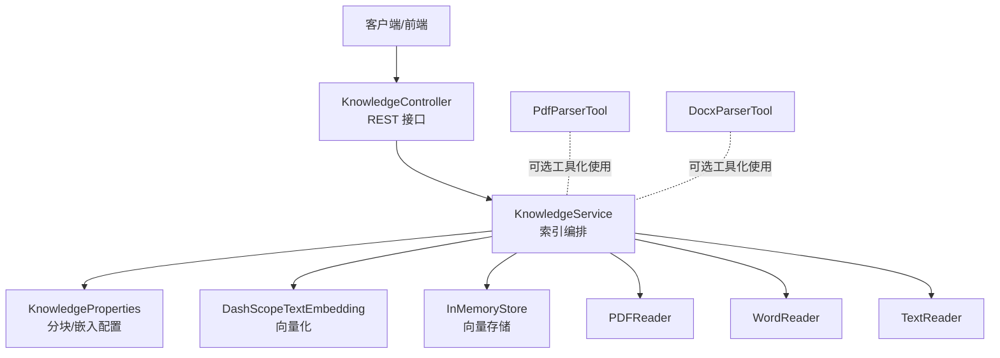
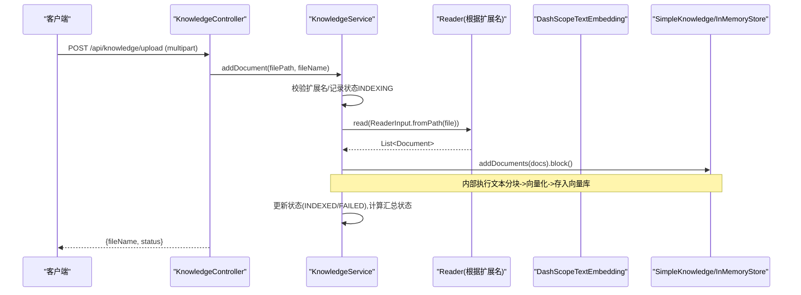
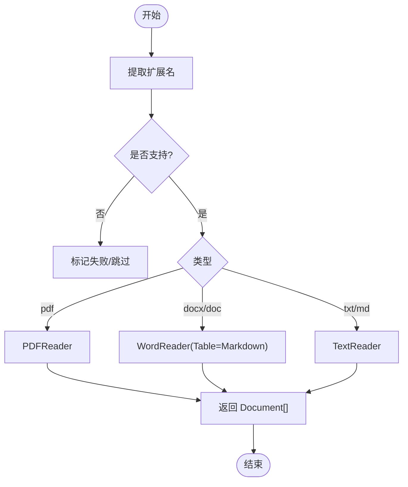
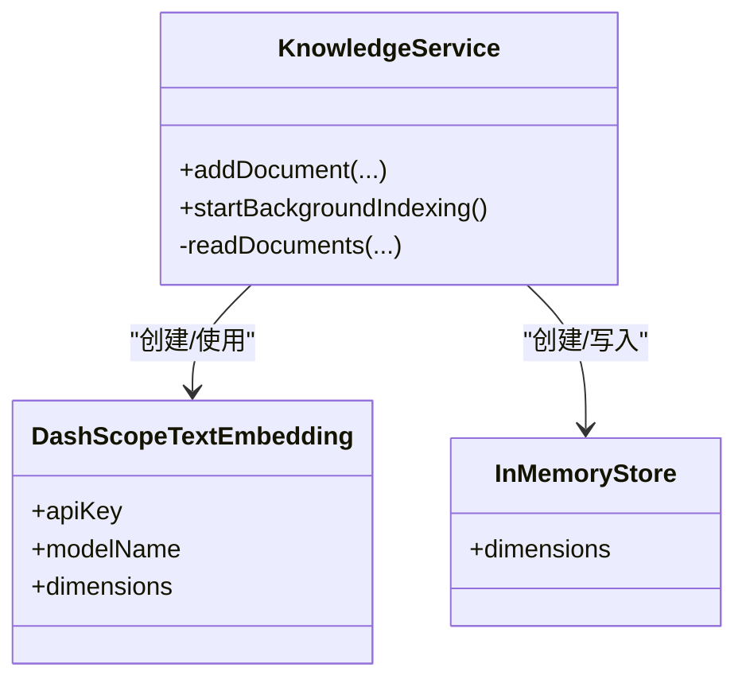
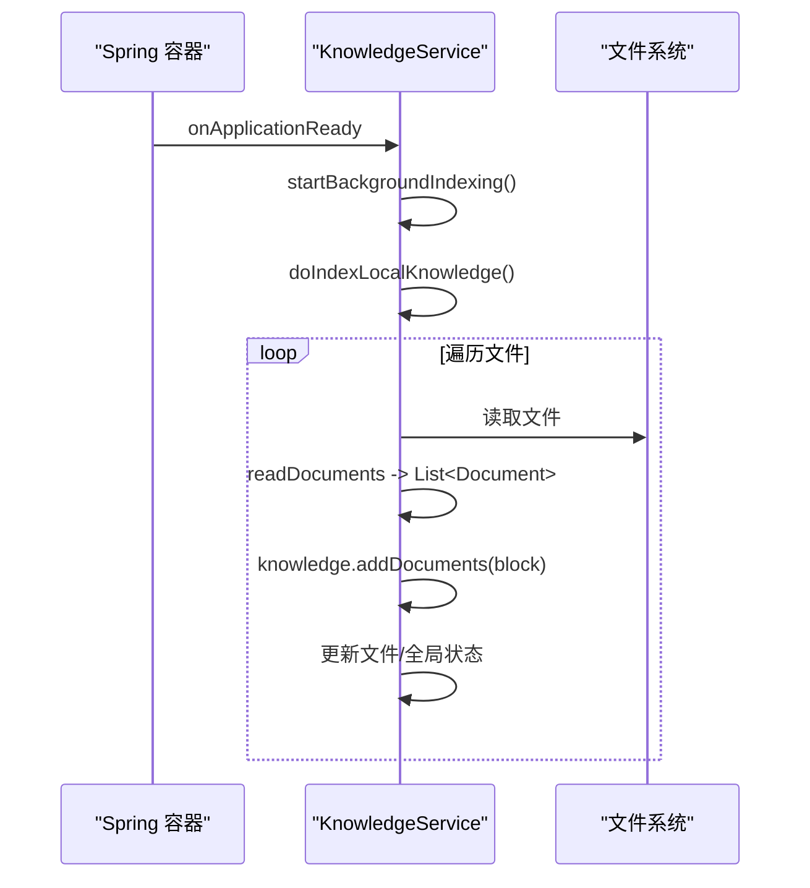
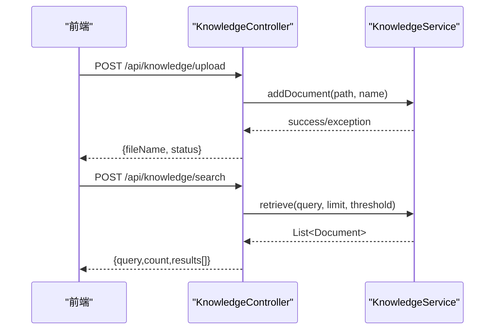
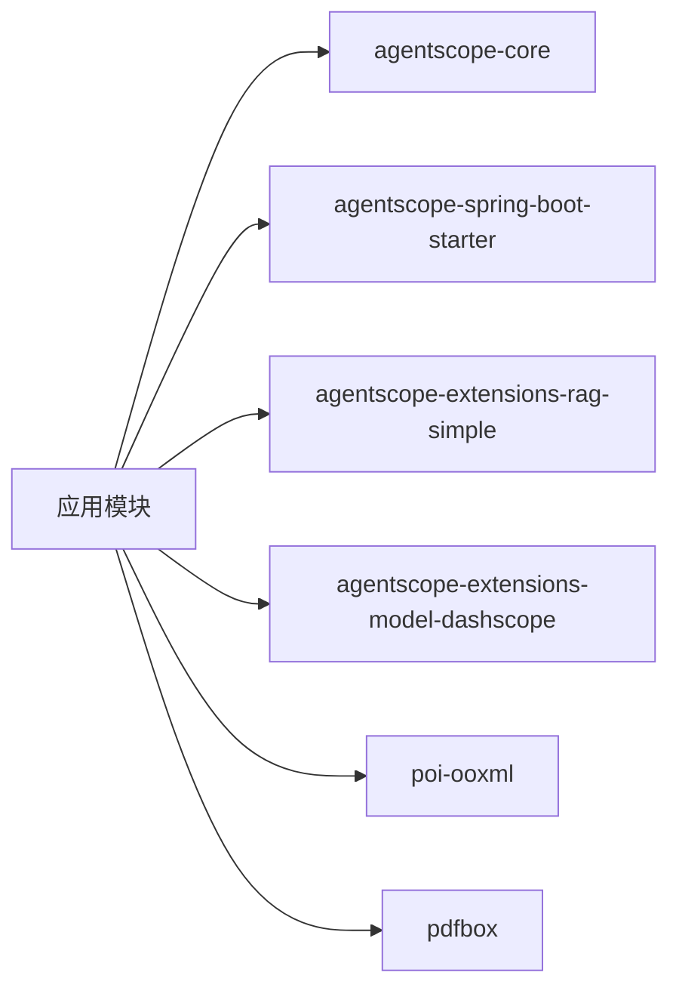

# 索引引擎

<cite>
**本文引用的文件**
- [KnowledgeService.java](file://src/main/java/com/skloda/agentscope/service/KnowledgeService.java)
- [KnowledgeProperties.java](file://src/main/java/com/skloda/agentscope/service/KnowledgeProperties.java)
- [KnowledgeController.java](file://src/main/java/com/skloda/agentscope/controller/KnowledgeController.java)
- [PdfParserTool.java](file://src/main/java/com/skloda/agentscope/tool/PdfParserTool.java)
- [DocxParserTool.java](file://src/main/java/com/skloda/agentscope/tool/DocxParserTool.java)
- [KnowledgeFileStatus.java](file://src/main/java/com/skloda/agentscope/model/KnowledgeFileStatus.java)
- [KnowledgeIndexStatus.java](file://src/main/java/com/skloda/agentscope/model/KnowledgeIndexStatus.java)
- [application.yml](file://src/main/resources/application.yml)
- [pom.xml](file://pom.xml)
</cite>

## 目录
1. [简介](#简介)
2. [项目结构](#项目结构)
3. [核心组件](#核心组件)
4. [架构总览](#架构总览)
5. [详细组件分析](#详细组件分析)
6. [依赖分析](#依赖分析)
7. [性能考虑](#性能考虑)
8. [故障排查指南](#故障排查指南)
9. [结论](#结论)
10. [附录](#附录) 

## 简介
本章节描述 RAG 知识库索引引擎的整体目标与设计要点。系统通过 KnowledgeService 提供文件的解析、文本分块、向量化与索引构建能力，支持 PDF、DOCX、TXT、MD 四种常见文档格式，并使用 DashScopeTextEmbedding 作为嵌入模型、InMemoryStore 作为向量存储（演示用）。系统以 Spring Boot 为承载，暴露统一的 REST API 用于上传、查询与管理索引状态。启动时可按配置自动扫描本地知识目录进行批量索引。

## 项目结构
RAG 索引相关代码主要分布于 service、controller、model、tool 等包中：
- service：KnowledgeService（编排流程）、KnowledgeProperties（分块/嵌入参数）
- controller：KnowledgeController（REST API 入口）
- model：KnowledgeFileStatus、KnowledgeIndexStatus（索引进度/状态）
- tool：PDF/DOCX 解析工具类（辅助工具）
- resources：application.yml 统一配置
- pom.xml：引入 agentscope-extensions-rag-simple、DashScope 模型扩展等

图表来源
- [KnowledgeController.java:27-131](file://src/main/java/com/skloda/agentscope/controller/KnowledgeController.java#L27-L131)
- [KnowledgeService.java:73-88](file://src/main/java/com/skloda/agentscope/service/KnowledgeService.java#L73-L88)

章节来源
- [KnowledgeController.java:27-131](file://src/main/java/com/skloda/agentscope/controller/KnowledgeController.java#L27-L131)
- [KnowledgeService.java:60-88](file://src/main/java/com/skloda/agentscope/service/KnowledgeService.java#L60-L88)
- [application.yml:26-70](file://src/main/resources/application.yml#L26-L70)

## 核心组件
- KnowledgeService：负责生命周期管理、后台自动索引、单文件入库、状态快照、读取并调用读者将文档转换为 Document 列表、调用 SimpleKnowledge 完成分块、向量化与写入向量库。
- KnowledgeProperties：集中承载 knowledge.enabled/path/embedding-model/dimensions/chunk-size/overlap-size/split-strategy/auto-index-on-startup 等可配项。
- KnowledgeController：对外暴露 /api/knowledge/upload、/documents、/search、/status、/documents/{fileName} 等接口。
- 状态模型：KnowledgeIndexStatus（总体索引状态及时间、汇总计数），KnowledgeFileStatus（每个文件的处理状态、chunk 数、错误信息等）。
- 读者组件：PDFReader、WordReader、TextReader；分别对应 PDF、DOCX/DOC、TXT/MD 的解析与分块策略。

章节来源
- [KnowledgeService.java:49-89](file://src/main/java/com/skloda/agentscope/service/KnowledgeService.java#L49-L89)
- [KnowledgeProperties.java:8-21](file://src/main/java/com/skloda/agentscope/service/KnowledgeProperties.java#L8-L21)
- [KnowledgeController.java:27-131](file://src/main/java/com/skloda/agentscope/controller/KnowledgeController.java#L27-L131)
- [KnowledgeIndexStatus.java:9-59](file://src/main/java/com/skloda/agentscope/model/KnowledgeIndexStatus.java#L9-L59)
- [KnowledgeFileStatus.java:8-28](file://src/main/java/com/skloda/agentscope/model/KnowledgeFileStatus.java#L8-L28)

## 架构总览
知识索引的关键链路如下：
- 应用就绪事件触发后台索引线程，按配置扫描本地知识目录逐文件解析、分块、向量化并写入 InMemoryStore。
- 用户通过 REST 接口上传文件或直接检索；上传后在后台或同步路径中进行处理，更新文件级与全局索引状态。
- 向量维度与模型来自配置，由 DashScopeTextEmbedding 提供，存储在 InMemoryStore 并受同维约束。

图表来源
- [KnowledgeController.java:40-78](file://src/main/java/com/skloda/agentscope/controller/KnowledgeController.java#L40-L78)
- [KnowledgeService.java:143-178](file://src/main/java/com/skloda/agentscope/service/KnowledgeService.java#L143-L178)
- [KnowledgeService.java:323-337](file://src/main/java/com/skloda/agentscope/service/KnowledgeService.java#L323-L337)

## 详细组件分析

### 文件解析与读者适配
- 支持扩展名：pdf、docx/doc、txt、md。通过 extensionOf/isSupportedExtension 识别扩展名后选择对应 Reader。
- PDFReader：使用 PDF 专用 reader，传入 chunkSize、SplitStrategy.PARAGRAPH、overlapSize，读取输入后阻塞返回 Document 列表。
- WordReader：对 DOCX/DOC 进行处理，额外传入 TableFormat.MARKDOWN，保持表格内容以 Markdown 形式嵌入片段，利于检索对齐。
- TextReader：适用于 TXT/MD 的纯文本分块。
- 工具层 PdfParserTool、DocxParserTool 提供独立的解析能力（可作为工具被 Agent 调用），但与 RAG 索引管线无耦合，便于在对话场景下做一次性读取。

图表来源
- [KnowledgeService.java:323-337](file://src/main/java/com/skloda/agentscope/service/KnowledgeService.java#L323-L337)
- [KnowledgeService.java:392-396](file://src/main/java/com/skloda/agentscope/service/KnowledgeService.java#L392-L396)

章节来源
- [KnowledgeService.java:323-337](file://src/main/java/com/skloda/agentscope/service/KnowledgeService.java#L323-L337)
- [KnowledgeService.java:392-396](file://src/main/java/com/skloda/agentscope/service/KnowledgeService.java#L392-L396)
- [PdfParserTool.java:15-72](file://src/main/java/com/skloda/agentscope/tool/PdfParserTool.java#L15-L72)
- [DocxParserTool.java:17-57](file://src/main/java/com/skloda/agentscope/tool/DocxParserTool.java#L17-L57)

### 文本分块策略与配置优化
- 拆分策略：SplitStrategy.PARAGRAPH，按段落切分，适合大多数自然语言文档，能尽量保留语义连贯性。
- 分块大小：chunkSize=512（字符/token 粒度取决于读者实现），在检索质量与上下文长度间取得平衡。
- 重叠大小：overlapSize=50，在相邻切片间保留少量重叠以提升检索召回率，降低边界信息丢失风险。
- 表格式输出：WordReader 将表格转为 Markdown，增强结构化信息的可读性与检索命中概率。
- 调优建议：
  - 若检索命中率偏低且答案偏片段化，可适当增大 overlapSize；若超出模型上下文且响应变慢，适当减小 chunkSize。
  - 对于包含大量公式/表格的专业文档，优先使用 WordReader + TableFormat.MARKDOWN 获取更清晰的结构。

章节来源
- [KnowledgeProperties.java:13-21](file://src/main/java/com/skloda/agentscope/service/KnowledgeProperties.java#L13-L21)
- [application.yml:62-70](file://src/main/resources/application.yml#L62-L70)
- [KnowledgeService.java:323-333](file://src/main/java/com/skloda/agentscope/service/KnowledgeService.java#L323-L333)

### 向量化处理与模型配置
- 嵌入模型：DashScopeTextEmbedding，通过 properties.getEmbeddingModel() 指定模型名；默认 application.yml 配置了具体的 embedding-model 值。
- 维度设置：properties.getDimensions() 默认 1024，创建 InMemoryStore.builder().dimensions(...) 时必须匹配，否则向量写入会失败。
- 性能影响：
  - 高维度（如 1024）通常能提升检索表达力，但增加网络请求量与向量存储占用。
  - 若模型/服务有吞吐限制，可在生产环境中采用批量提交与缓存策略以降低延迟。
  - 注意 API Key、模型名与维度一致的配置必须生效。

图表来源
- [KnowledgeService.java:73-88](file://src/main/java/com/skloda/agentscope/service/KnowledgeService.java#L73-L88)
- [KnowledgeService.java:82-85](file://src/main/java/com/skloda/agentscope/service/KnowledgeService.java#L82-L85)

章节来源
- [KnowledgeService.java:73-88](file://src/main/java/com/skloda/agentscope/service/KnowledgeService.java#L73-L88)
- [application.yml:62-70](file://src/main/resources/application.yml#L62-L70)
- [pom.xml:43-48](file://pom.xml#L43-L48)

### 索引构建流程（本地知识目录扫描）
- 启动事件 ApplicationReadyEvent 触发 startBackgroundIndexing，在独立守护线程中执行 doIndexLocalKnowledge。
- 扫描配置的本地知识目录，遍历所有文件，逐个执行：
  - 检查扩展名是否支持
  - 解析为 Document 列表（含分块）
  - 调用 knowledge.addDocuments(...).block() 写入向量库
  - 更新文件级状态 INDEXED/FAILED/SKIPPED，并最终汇总全局状态 READY/READY_WITH_ERRORS/FAILED
- 支持“增量”视角：新增文件会被重新加入；删除或替换旧文件时，InMemoryStore 未清理历史向量（见注释提示可能存在陈旧向量）。

图表来源
- [KnowledgeService.java:91-125](file://src/main/java/com/skloda/agentscope/service/KnowledgeService.java#L91-L125)
- [KnowledgeService.java:214-321](file://src/main/java/com/skloda/agentscope/service/KnowledgeService.java#L214-L321)

章节来源
- [KnowledgeService.java:91-125](file://src/main/java/com/skloda/agentscope/service/KnowledgeService.java#L91-L125)
- [KnowledgeService.java:214-321](file://src/main/java/com/skloda/agentscope/service/KnowledgeService.java#L214-L321)

### 上传与检索接口
- 上传：POST /api/knowledge/upload，保存临时文件并调用 addDocument；仅允许 .pdf/.docx/.txt/.md。
- 查询：POST /api/knowledge/search，接受 query/limit/threshold，返回带得分的前 K 条片段摘要。
- 状态：GET /api/knowledge/status，返回整体状态、起止时间、各文件详情与统计计数。
- 列举：GET /api/knowledge/documents，返回已入库的文件名列表。
- 删除：DELETE /api/knowledge/documents/{fileName}，标记移除（向量层可能仍有陈旧向量，需结合后续存储演进）。

图表来源
- [KnowledgeController.java:40-131](file://src/main/java/com/skloda/agentscope/controller/KnowledgeController.java#L40-L131)

章节来源
- [KnowledgeController.java:40-131](file://src/main/java/com/skloda/agentscope/controller/KnowledgeController.java#L40-L131)

### 错误处理与日志
- 异常捕获：单文件处理过程中 catch(Exception e) 立即标记 FAILED，并记录错误消息；最终汇总状态反映是否存在错误。
- 日志级别：logging.level.io.agentscope=INFO（可调整为 DEBUG 以查看 RAG/向量细节）。
- 幂等/重试：当前未内置自动重试，可根据业务需求在 Controller/Service 层面增加重试逻辑。
- 向量陈旧提示：InMemoryStore 删除不在当前范围，存在历史残留的风险。

章节来源
- [KnowledgeService.java:143-178](file://src/main/java/com/skloda/agentscope/service/KnowledgeService.java#L143-L178)
- [KnowledgeService.java:305-321](file://src/main/java/com/skloda/agentscope/service/KnowledgeService.java#L305-L321)
- [application.yml:81-89](file://src/main/resources/application.yml#L81-L89)

## 依赖分析
- 框架：Spring Boot 3.5.14
- 模型：AgentScope 2.0.x（core、harness、dashscope provider）
- RAG：agentscope-extensions-rag-simple（SimpleKnowledge、Reader 组件、InMemoryStore）
- 文档解析：Apache POI（DOCX）、Apache PDFBox（PDF）
- 这些依赖使索引功能具备跨格式的解析能力和低耦合的读者扩展点。

图表来源
- [pom.xml:28-95](file://pom.xml#L28-L95)

章节来源
- [pom.xml:28-95](file://pom.xml#L28-L95)

## 性能考虑
- 单线程后台索引：backgroundIndexer 为单 executor，避免并发写导致的资源争用，适合单机演示场景。生产环境可升级为多 Executor 并配合限流/队列。
- 向量维度 1024：在检索质量和存储/传输成本之间折中；若 QPS 较高，可评估更低维度与缓存策略。
- 分块与重叠：PARAGRAPH + 512 + 50 的组合在通用中文文档上有良好表现；长文档可结合表格/标题等预处理提升检索效果。
- I/O 与网络：本地文件解析较快；向量化依赖外部 API，需关注超时、重试、速率限制与熔断降级策略。
- 进程内存储：InMemoryStore 随进程重启丢失，生产部署需要持久化存储方案。

[本节为通用性能建议]

## 故障排查指南
- 无法解析文件
  - 确认扩展名属于支持的集合（md/txt/pdf/docx/doc）；检查 isSupportedExtension 分支。
  - 针对扫描件 PDF 等不可读文本，工具会返回“空/无文本”，需 OCR 或其他预处理。
- 向量化失败
  - 检查 DASHSCOPE_API_KEY 及 agentscope.model.dashscope.api-key 是否正确注入。
  - 检查 embedding-model 名称与 dimensions 配置一致。
- 上传被拒绝
  - 仅允许 .pdf/.docx/.txt/.md；其他后缀会拒绝请求。
- 删除文档不生效
  - 向量层尚未实现删除，可能有陈旧向量残留；需在后续版本完善删除/覆写机制。
- 监控与日志
  - 将 io.agentscope 日志级别调整为 DEBUG 查看内部流程。
  - 关注 /api/knowledge/status 返回的 state、startedAt、finishedAt、documents 列表中的 message。

章节来源
- [KnowledgeService.java:143-178](file://src/main/java/com/skloda/agentscope/service/KnowledgeService.java#L143-L178)
- [KnowledgeService.java:214-321](file://src/main/java/com/skloda/agentscope/service/KnowledgeService.java#L214-L321)
- [KnowledgeController.java:40-131](file://src/main/java/com/skloda/agentscope/controller/KnowledgeController.java#L40-L131)
- [application.yml:81-89](file://src/main/resources/application.yml#L81-L89)

## 结论
该索引引擎以简单可靠的方式实现了 RAG 所需的“文件解析 → 文本分块 → 向量化 → 向量存储”闭环，具备多格式支持和可调的分块/重叠策略；通过 KnowledgeService 的单线程后台任务，实现在启动时对本地知识目录的自动索引，并通过 REST API 提供上传、检索和状态查询能力。生产化需重点解决持久化向量存储、删除/增量更新的幂等一致性、失败重试与可观测性等问题。

[本节总结，无需具体文件引用]

## 附录

### 配置文件速查
- 启用/禁用、知识目录、自启动索引：knowledge.enabled/path/auto-index-on-startup
- 嵌入模型与维度：knowledge.embedding-model/dimensions
- 分块与重叠：knowledge.chunk-size/overlap-size、split-strategy
- 模型密钥：agentscope.model.dashscope.api-key

章节来源
- [application.yml:62-70](file://src/main/resources/application.yml#L62-L70)
- [application.yml:26-40](file://src/main/resources/application.yml#L26-L40)