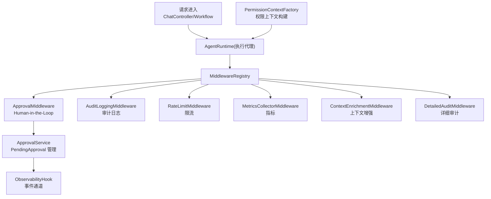
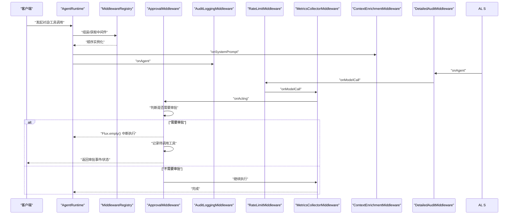
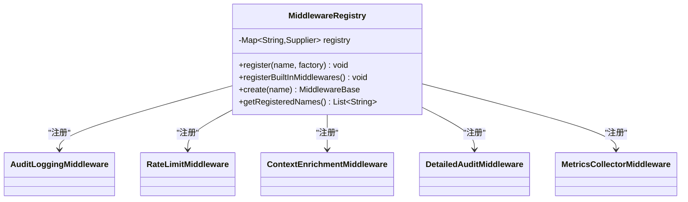
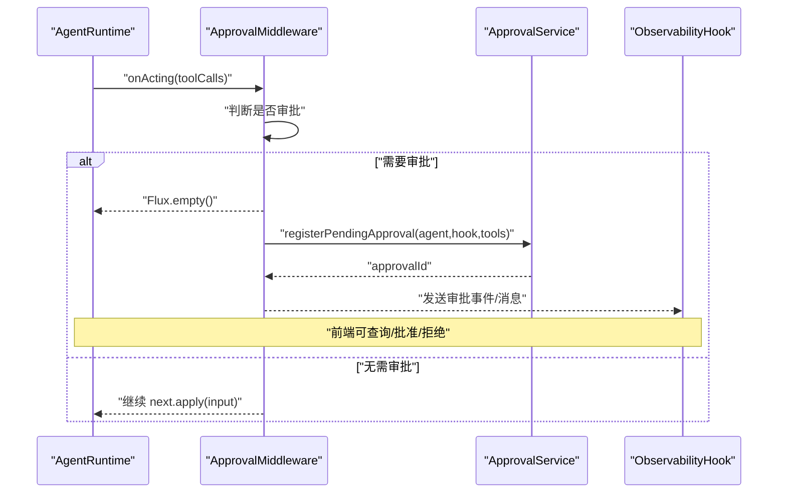
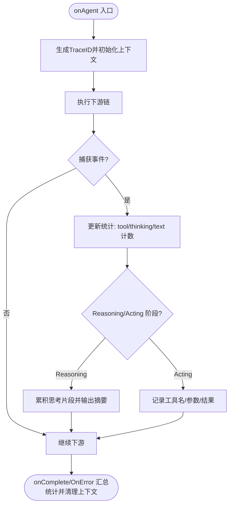
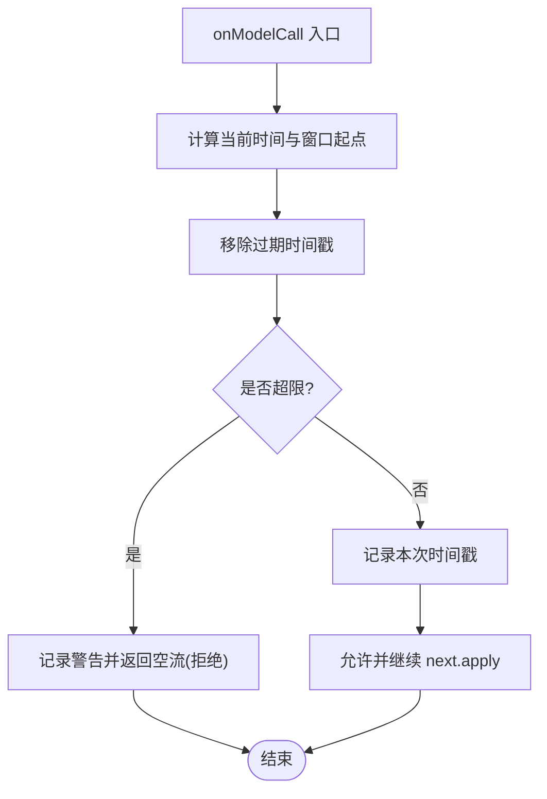
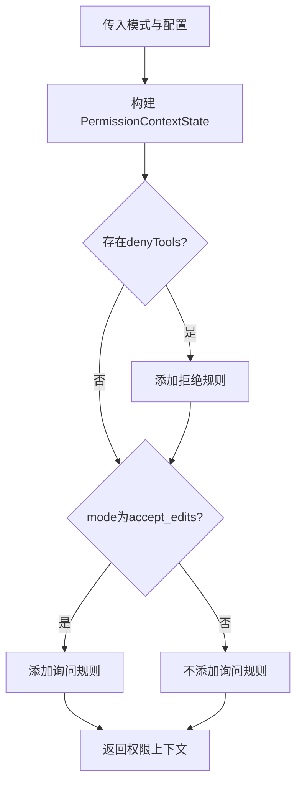
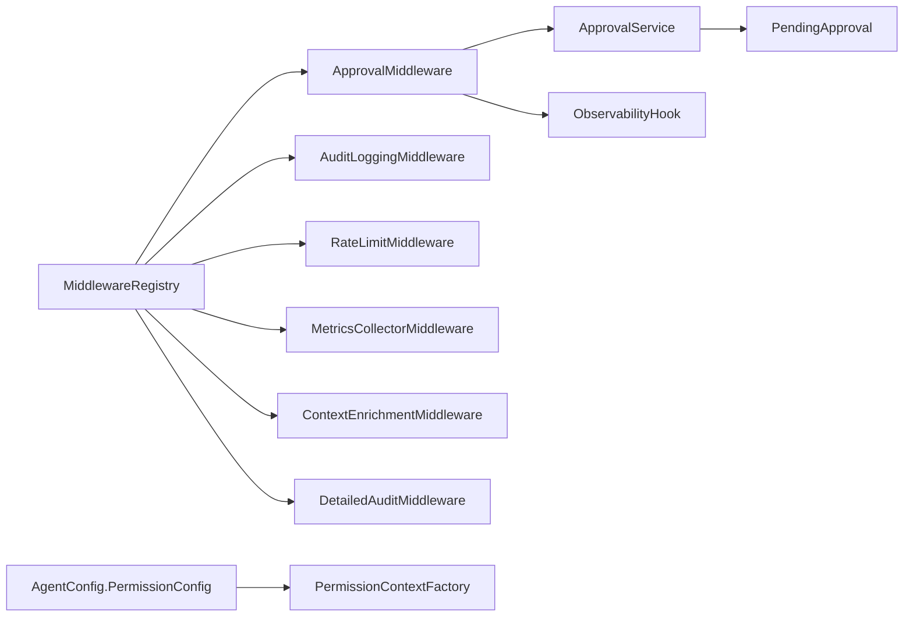

# 中间件与安全

<cite>
**本文引用的文件**
- [MiddlewareRegistry.java](file://src/main/java/com/skloda/agentscope/middleware/MiddlewareRegistry.java)
- [ApprovalMiddleware.java](file://src/main/java/com/skloda/agentscope/middleware/ApprovalMiddleware.java)
- [AuditLoggingMiddleware.java](file://src/main/java/com/skloda/agentscope/middleware/AuditLoggingMiddleware.java)
- [RateLimitMiddleware.java](file://src/main/java/com/skloda/agentscope/middleware/RateLimitMiddleware.java)
- [DetailedAuditMiddleware.java](file://src/main/java/com/skloda/agentscope/middleware/DetailedAuditMiddleware.java)
- [MetricsCollectorMiddleware.java](file://src/main/java/com/skloda/agentscope/middleware/MetricsCollectorMiddleware.java)
- [ContextEnrichmentMiddleware.java](file://src/main/java/com/skloda/agentscope/middleware/ContextEnrichmentMiddleware.java)
- [PermissionContextFactory.java](file://src/main/java/com/skloda/agentscope/permission/PermissionContextFactory.java)
- [AgentConfig.java](file://src/main/java/com/skloda/agentscope/agent/AgentConfig.java)
- [ApprovalService.java](file://src/main/java/com/skloda/agentscope/service/ApprovalService.java)
- [PendingApproval.java](file://src/main/java/com/skloda/agentscope/model/PendingApproval.java)
- [ApprovalRequest.java](file://src/main/java/com/skloda/agentscope/model/ApprovalRequest.java)
- [ObservabilityHook.java](file://src/main/java/com/skloda/agentscope/hook/ObservabilityHook.java)
- [MiddlewareRegistryTest.java](file://src/test/java/com/skloda/agentscope/middleware/MiddlewareRegistryTest.java)
- [PermissionContextFactoryTest.java](file://src/test/java/com/skloda/agentscope/permission/PermissionContextFactoryTest.java)
</cite>

## 目录
1. [简介](#简介)
2. [项目结构与职责](#项目结构与职责)
3. [核心组件](#核心组件)
4. [架构总览](#架构总览)
5. [关键组件详解](#关键组件详解)
6. [依赖关系分析](#依赖关系分析)
7. [性能考量](#性能考量)
8. [故障排查指南](#故障排查指南)
9. [中间件开发指南](#中间件开发指南)
10. [企业安全与合规最佳实践](#企业安全与合规最佳实践)
11. [结论](#结论)

## 简介
本文件围绕 AgentScope 项目的“中间件与安全系统”进行深入说明。重点包括：
- 中间件注册表设计与执行链装配机制
- 横切关注点（审批、审计、限流、指标采集、上下文增强）解耦实现
- Human-in-the-Loop 审批流程、详细审计记录、流量控制策略
- 权限控制系统（上下文构建、访问决策、审计跟踪）
- 中间件开发指南与企业级安全最佳实践

## 项目结构与职责
中间件模块位于 middleware 包，提供可插拔式拦截器；权限系统在 permission 包中负责构建基于配置的访问策略。运行时通过 MiddlewareRegistry 进行统一注册与创建；具体中间件分别处理审批、审计、速率限制、指标统计与上下文增强等横切关注点。相关模型与存储服务位于 model 与 service 包，用于支持人类审批的工作流。

图表来源
- [MiddlewareRegistry.java:23-40](file://src/main/java/com/skloda/agentscope/middleware/MiddlewareRegistry.java#L23-L40)
- [ApprovalMiddleware.java:58-77](file://src/main/java/com/skloda/agentscope/middleware/ApprovalMiddleware.java#L58-L77)
- [AuditLoggingMiddleware.java:19-68](file://src/main/java/com/skloda/agentscope/middleware/AuditLoggingMiddleware.java#L19-L68)
- [RateLimitMiddleware.java:31-52](file://src/main/java/com/skloda/agentscope/middleware/RateLimitMiddleware.java#L31-L52)
- [MetricsCollectorMiddleware.java:50-91](file://src/main/java/com/skloda/agentscope/middleware/MetricsCollectorMiddleware.java#L50-L91)
- [ContextEnrichmentMiddleware.java:18-27](file://src/main/java/com/skloda/agentscope/middleware/ContextEnrichmentMiddleware.java#L18-L27)
- [DetailedAuditMiddleware.java:45-108](file://src/main/java/com/skloda/agentscope/middleware/DetailedAuditMiddleware.java#L45-L108)
- [PermissionContextFactory.java:12-24](file://src/main/java/com/skloda/agentscope/permission/PermissionContextFactory.java#L12-L24)

小节来源
- [MiddlewareRegistry.java:15-55](file://src/main/java/com/skloda/agentscope/middleware/MiddlewareRegistry.java#L15-L55)
- [AgentConfig.java:91-96](file://src/main/java/com/skloda/agentscope/agent/AgentConfig.java#L91-L96)
- [PermissionContextFactory.java:1-39](file://src/main/java/com/skloda/agentscope/permission/PermissionContextFactory.java#L1-L39)

## 核心组件
- 中间件注册表：维护名称到工厂的映射，启动时自动注册内置中间件，并提供按需创建能力。
- 审批中间件：在工具调用阶段拦截，若需要审批则挂起执行并准备待审批的工具调用集。
- 审计日志中间件：对 Agent 生命周期、推理阶段、工具调用进行基础审计。
- 详细审计中间件：使用 ThreadLocal 追踪 ID、全量事件、思考与文本输出摘要、错误详情。
- 限流中间件：滑动窗口计数，超限时拒绝后续调用。
- 指标采集中间件：统计工具耗时、次数、错误率、Token 用量、成本估算。
- 上下文增强中间件：注入时间戳与用户身份到系统提示中。
- 权限上下文工厂：根据配置构建权限模式与规则（拒绝/询问）。

小节来源
- [MiddlewareRegistry.java:18-50](file://src/main/java/com/skloda/agentscope/middleware/MiddlewareRegistry.java#L18-L50)
- [ApprovalMiddleware.java:42-123](file://src/main/java/com/skloda/agentscope/middleware/ApprovalMiddleware.java#L42-L123)
- [AuditLoggingMiddleware.java:15-68](file://src/main/java/com/skloda/agentscope/middleware/AuditLoggingMiddleware.java#L15-L68)
- [DetailedAuditMiddleware.java:28-108](file://src/main/java/com/skloda/agentscope/middleware/DetailedAuditMiddleware.java#L28-L108)
- [RateLimitMiddleware.java:16-52](file://src/main/java/com/skloda/agentscope/middleware/RateLimitMiddleware.java#L16-L52)
- [MetricsCollectorMiddleware.java:21-91](file://src/main/java/com/skloda/agentscope/middleware/MetricsCollectorMiddleware.java#L21-L91)
- [ContextEnrichmentMiddleware.java:13-27](file://src/main/java/com/skloda/agentscope/middleware/ContextEnrichmentMiddleware.java#L13-L27)
- [PermissionContextFactory.java:12-24](file://src/main/java/com/skloda/agentscope/permission/PermissionContextFactory.java#L12-L24)

## 架构总览
执行链由中间件按注册顺序构成，每个中间件可以选择继续链或中断（返回空 Flux）以实现拦截。审批中间件在工具调用阶段截停，将等待人类确认的调用存入服务，前端可查询并批复后恢复执行。权限上下文基于 Agent 配置构建，贯穿 Agent 的执行路径以确保受控访问。

图表来源
- [ApprovalMiddleware.java:58-77](file://src/main/java/com/skloda/agentscope/middleware/ApprovalMiddleware.java#L58-L77)
- [AuditLoggingMiddleware.java:19-68](file://src/main/java/com/skloda/agentscope/middleware/AuditLoggingMiddleware.java#L19-L68)
- [RateLimitMiddleware.java:31-52](file://src/main/java/com/skloda/agentscope/middleware/RateLimitMiddleware.java#L31-L52)
- [MetricsCollectorMiddleware.java:50-91](file://src/main/java/com/skloda/agentscope/middleware/MetricsCollectorMiddleware.java#L50-L91)
- [ContextEnrichmentMiddleware.java:18-27](file://src/main/java/com/skloda/agentscope/middleware/ContextEnrichmentMiddleware.java#L18-L27)
- [DetailedAuditMiddleware.java:45-108](file://src/main/java/com/skloda/agentscope/middleware/DetailedAuditMiddleware.java#L45-L108)

## 关键组件详解

### 中间件注册表与设计
- 提供 Map<String, Supplier<MiddlewareBase>> 维护已注册中间件的工厂；PostConstruct 自动注册内置项，确保容器启动即可用。
- create 方法根据名称延迟创建中间件实例，getRegisteredNames 提供可读的清单。
- 测试覆盖自动注册与命名清单行为。

图表来源
- [MiddlewareRegistry.java:12-55](file://src/main/java/com/skloda/agentscope/middleware/MiddlewareRegistry.java#L12-L55)
- [AuditLoggingMiddleware.java:15-68](file://src/main/java/com/skloda/agentscope/middleware/AuditLoggingMiddleware.java#L15-L68)
- [RateLimitMiddleware.java:16-52](file://src/main/java/com/skloda/agentscope/middleware/RateLimitMiddleware.java#L16-L52)
- [ContextEnrichmentMiddleware.java:13-27](file://src/main/java/com/skloda/agentscope/middleware/ContextEnrichmentMiddleware.java#L13-L27)
- [DetailedAuditMiddleware.java:38-108](file://src/main/java/com/skloda/agentscope/middleware/DetailedAuditMiddleware.java#L38-L108)
- [MetricsCollectorMiddleware.java:31-91](file://src/main/java/com/skloda/agentscope/middleware/MetricsCollectorMiddleware.java#L31-L91)

小节来源
- [MiddlewareRegistry.java:18-55](file://src/main/java/com/skloda/agentscope/middleware/MiddlewareRegistry.java#L18-L55)
- [MiddlewareRegistryTest.java:17-52](file://src/test/java/com/skloda/agentscope/middleware/MiddlewareRegistryTest.java#L17-L52)

### 审批中间件（Human-in-the-Loop）
- 拦截 onActing，扫描 ToolUseBlock，当满足审批条件（全局要求或工具名命中）时，设置 pendingToolUseBlocks，返回空 Flux 以跳过工具执行，触发人类介入。
- 对外暴露 isApprovalTriggered、getPendingToolUseBlocksForSse 等方法，供上层路由到审批工作流。
- 配合 ApprovalService 缓存 PendingApproval（含 agent、hook、工具列表、超时清理），并通过 ObservabilityHook 与前端交互。

图表来源
- [ApprovalMiddleware.java:58-123](file://src/main/java/com/skloda/agentscope/middleware/ApprovalMiddleware.java#L58-L123)
- [ApprovalService.java:22-76](file://src/main/java/com/skloda/agentscope/service/ApprovalService.java#L22-L76)
- [PendingApproval.java:13-39](file://src/main/java/com/skloda/agentscope/model/PendingApproval.java#L13-L39)
- [ObservabilityHook.java:未展示源码但被引用](file://src/main/java/com/skloda/agentscope/hook/ObservabilityHook.java)

小节来源
- [ApprovalMiddleware.java:42-123](file://src/main/java/com/skloda/agentscope/middleware/ApprovalMiddleware.java#L42-L123)
- [ApprovalService.java:17-76](file://src/main/java/com/skloda/agentscope/service/ApprovalService.java#L17-L76)
- [PendingApproval.java:13-39](file://src/main/java/com/skloda/agentscope/model/PendingApproval.java#L13-L39)
- [ApprovalRequest.java:8-20](file://src/main/java/com/skloda/agentscope/model/ApprovalRequest.java#L8-L20)

### 审计日志中间件
- onAgent/onReasoning/onActing 三阶段均记录开始、结束及耗时，工具调用参数摘要打印。
- 适用于基线审计需求，日志包含 Agent、消息数、调用耗时等关键维度。

小节来源
- [AuditLoggingMiddleware.java:15-68](file://src/main/java/com/skloda/agentscope/middleware/AuditLoggingMiddleware.java#L15-L68)

### 详细审计中间件
- 引入 TraceContext（ThreadLocal）携带 traceId，完整记录执行链路、工具输入输出、思考块与文本块内容摘要、错误详情。
- 在 Reasoning 阶段累积 Token 和文本流片段；Acting 阶段逐个记录工具名称、ID 与参数预览。
- 适合深度排障与合规审计场景。

图表来源
- [DetailedAuditMiddleware.java:45-108](file://src/main/java/com/skloda/agentscope/middleware/DetailedAuditMiddleware.java#L45-L108)
- [DetailedAuditMiddleware.java:111-179](file://src/main/java/com/skloda/agentscope/middleware/DetailedAuditMiddleware.java#L111-L179)

小节来源
- [DetailedAuditMiddleware.java:28-179](file://src/main/java/com/skloda/agentscope/middleware/DetailedAuditMiddleware.java#L28-L179)

### 限流中间件
- 使用队列保存最近一分钟内调用的时间戳；当计数达到阈值时直接返回空 Flux 拒绝请求。
- 轻量、无状态（会话内），适合单机保护，避免外部依赖。

图表来源
- [RateLimitMiddleware.java:31-52](file://src/main/java/com/skloda/agentscope/middleware/RateLimitMiddleware.java#L31-L52)

小节来源
- [RateLimitMiddleware.java:16-52](file://src/main/java/com/skloda/agentscope/middleware/RateLimitMiddleware.java#L16-L52)

### 指标采集中间件
- 收集工具调用次数与耗时（最小/最大）、Agent 调用总数与耗时、Token 用量与成本估算（基于模型定价近似值）。
- 通过 ThreadLocal 维持单次执行的局部度量，完成后汇总至静态聚合结构，便于导出。

小节来源
- [MetricsCollectorMiddleware.java:21-91](file://src/main/java/com/skloda/agentscope/middleware/MetricsCollectorMiddleware.java#L21-L91)
- [MetricsCollectorMiddleware.java:94-162](file://src/main/java/com/skloda/agentscope/middleware/MetricsCollectorMiddleware.java#L94-L162)
- [MetricsCollectorMiddleware.java:187-200](file://src/main/java/com/skloda/agentscope/middleware/MetricsCollectorMiddleware.java#L187-L200)

### 上下文增强中间件
- 在系统提示前注入当前时间与固定用户标识等上下文信息，利于调试与审计追溯。

小节来源
- [ContextEnrichmentMiddleware.java:13-27](file://src/main/java/com/skloda/agentscope/middleware/ContextEnrichmentMiddleware.java#L13-L27)

### 权限控制系统
- PermissionContextFactory 读取 AgentConfig.PermissionConfig，根据 mode（bypass/explore/accept_edits）构建 PermissionContextState，并应用 deny/ask 规则。
- denyTools 总是生效，askTools 在 accept_edits 模式下应用，从而实现不同粒度的访问控制与人工确认策略。

图表来源
- [PermissionContextFactory.java:12-39](file://src/main/java/com/skloda/agentscope/permission/PermissionContextFactory.java#L12-L39)
- [AgentConfig.java:100-106](file://src/main/java/com/skloda/agentscope/agent/AgentConfig.java#L100-L106)

小节来源
- [PermissionContextFactory.java:1-39](file://src/main/java/com/skloda/agentscope/permission/PermissionContextFactory.java#L1-L39)
- [AgentConfig.java:91-106](file://src/main/java/com/skloda/agentscope/agent/AgentConfig.java#L91-L106)
- [PermissionContextFactoryTest.java:16-57](file://src/test/java/com/skloda/agentscope/permission/PermissionContextFactoryTest.java#L16-L57)

## 依赖关系分析
- 中间件之间彼此独立，通过 Pipeline 组合耦合度低；注册表集中维护扩展点。
- 审批中间件依赖于 ApprovalService 与 ObservabilityHook，形成临时协作关系（存储与事件推送）。
- 权限上下文构建依赖 AgentConfig 中的 PermissionConfig，实现声明式策略。
- 指标与详细审计共享 ThreadLocal 上下文，保证并发安全与一次执行隔离。

图表来源
- [MiddlewareRegistry.java:12-55](file://src/main/java/com/skloda/agentscope/middleware/MiddlewareRegistry.java#L12-L55)
- [ApprovalMiddleware.java:42-123](file://src/main/java/com/skloda/agentscope/middleware/ApprovalMiddleware.java#L42-L123)
- [ApprovalService.java:17-76](file://src/main/java/com/skloda/agentscope/service/ApprovalService.java#L17-L76)
- [PendingApproval.java:13-39](file://src/main/java/com/skloda/agentscope/model/PendingApproval.java#L13-L39)
- [PermissionContextFactory.java:1-39](file://src/main/java/com/skloda/agentscope/permission/PermissionContextFactory.java#L1-L39)
- [AgentConfig.java:91-106](file://src/main/java/com/skloda/agentscope/agent/AgentConfig.java#L91-L106)

小节来源
- [MiddlewareRegistry.java:12-55](file://src/main/java/com/skloda/agentscope/middleware/MiddlewareRegistry.java#L12-L55)
- [ApprovalService.java:17-76](file://src/main/java/com/skloda/agentscope/service/ApprovalService.java#L17-L76)

## 性能考量
- 限流采用内存队列维护最近分钟窗口，O(n) 清理操作在高吞吐下需评估 n 增长；可通过滑动时间轮优化。
- 详细审计与指标收集使用 ThreadLocal 与原子计数器，减少锁竞争；但字符串拼接与日志输出存在 IO 开销，建议生产环境分级日志与采样。
- 审批中间件在触发时返回空流会提前结束本轮执行，减少不必要开销；但频繁 HITL 会增加前后端往返。
- 指标聚合使用静态结构，注意多租户/多实例时的导出隔离（如区分租户键）。

[本节为通用性能讨论，不直接分析具体文件]

## 故障排查指南
- 审批流程卡住
  - 检查 ApprovalMiddleware 是否正确识别工具调用与审批标记，查看 PendingApproval 是否被正确登记与清理。
  - 验证 ObservabilityHook 是否将审批事件转发给前端，以便用户批复。
- 审计缺失或不全
  - 确认 DetailedAuditMiddleware 与 AuditLoggingMiddleware 均已被注册；检查日志级别与输出目标。
  - 使用 Trace ID 串联跨阶段日志，便于定位断点。
- 限流过严导致业务失败
  - 调整 maxCallsPerMinute，或通过上游网关配合做分布式限流。
- 指标失真
  - 检查 ModelCallEndEvent 是否有 Usage；若为空，估算成本可能不准。

小节来源
- [ApprovalMiddleware.java:58-123](file://src/main/java/com/skloda/agentscope/middleware/ApprovalMiddleware.java#L58-L123)
- [ApprovalService.java:59-76](file://src/main/java/com/skloda/agentscope/service/ApprovalService.java#L59-L76)
- [DetailedAuditMiddleware.java:45-108](file://src/main/java/com/skloda/agentscope/middleware/DetailedAuditMiddleware.java#L45-L108)
- [RateLimitMiddleware.java:31-52](file://src/main/java/com/skloda/agentscope/middleware/RateLimitMiddleware.java#L31-L52)
- [MetricsCollectorMiddleware.java:144-162](file://src/main/java/com/skloda/agentscope/middleware/MetricsCollectorMiddleware.java#L144-L162)

## 中间件开发指南
- 过滤器模式
  - 实现 MiddlewareBase 的各个回调（onAgent/onReasoning/onActing/onModelCall/onSystemPrompt），选择性地调用 next 以传递或拦截。
- 拦截器实现
  - 在合适阶段（如 acting 阶段处理工具调用、model call 阶段限流、agent 阶段统一审计）注入逻辑；注意不要阻塞长时任务。
- 错误传播
  - 使用 onErrorReturn/onErrorResume 等响应式手段处理异常，保持链路完整性。
- 性能优化
  - 使用只读数据与不可变结构；避免大对象拷贝；合理使用线程局部变量（注意清理）。
  - 避免在热路径中进行重 I/O；将日志异步化或采样；对大数据输出做截断与脱敏。

小节来源
- [ApprovalMiddleware.java:58-101](file://src/main/java/com/skloda/agentscope/middleware/ApprovalMiddleware.java#L58-L101)
- [AuditLoggingMiddleware.java:19-68](file://src/main/java/com/skloda/agentscope/middleware/AuditLoggingMiddleware.java#L19-L68)
- [RateLimitMiddleware.java:31-52](file://src/main/java/com/skloda/agentscope/middleware/RateLimitMiddleware.java#L31-L52)
- [MetricsCollectorMiddleware.java:50-91](file://src/main/java/com/skloda/agentscope/middleware/MetricsCollectorMiddleware.java#L50-L91)
- [ContextEnrichmentMiddleware.java:18-27](file://src/main/java/com/skloda/agentscope/middleware/ContextEnrichmentMiddleware.java#L18-L27)
- [DetailedAuditMiddleware.java:45-108](file://src/main/java/com/skloda/agentscope/middleware/DetailedAuditMiddleware.java#L45-L108)

## 企业安全与合规最佳实践
- 默认拒绝：权限模式默认 bypass，应在高敏感环境中显式设置为更严格模式（如 explore/accept_edits），并通过 denyTools/askTools 约束高危工具。
- 最小权限：仅授权必要工具，结合 ask 模式进行二次确认。
- 审计留存：启用详细审计与审计日志，保留足够长的轨迹（Trace ID）用于事后稽核。
- 人机在环：对关键写操作、资金类工具必须启用审批中间件，建立审批留痕与时效（PendingApproval 超时清理）。
- 流量治理：配置合理的限流阈值，防止滥用与资源耗尽。
- 数据安全：对日志中的输入参数进行脱敏；避免持久化敏感内容；传输过程加密。
- 监控告警：接入指标采集并对接监控系统，设定错误率、延迟、Token 用量阈值告警。
- 可回滚：中间件开关配置化、可动态调整，问题出现时可快速降级。

[本节为通用安全与合规指导，不直接分析具体文件]

## 结论
本项目提供了完善的可插拔中间件体系，将横切关注点从业务逻辑中解耦，既保障了安全性（权限、审批、限流、审计），又提升了可观测性与性能治理能力。权限系统与审批机制形成了企业级的安全闭环，建议在生产环境启用详细审计与审批流程，并配套指标监控与告警策略。

[本节为总结性内容，不直接分析具体文件]