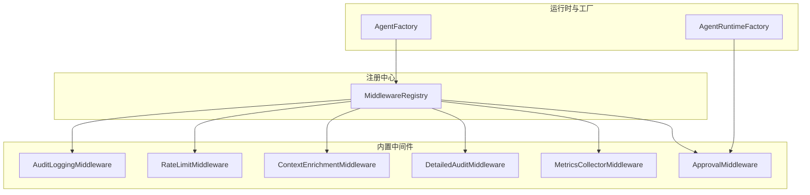
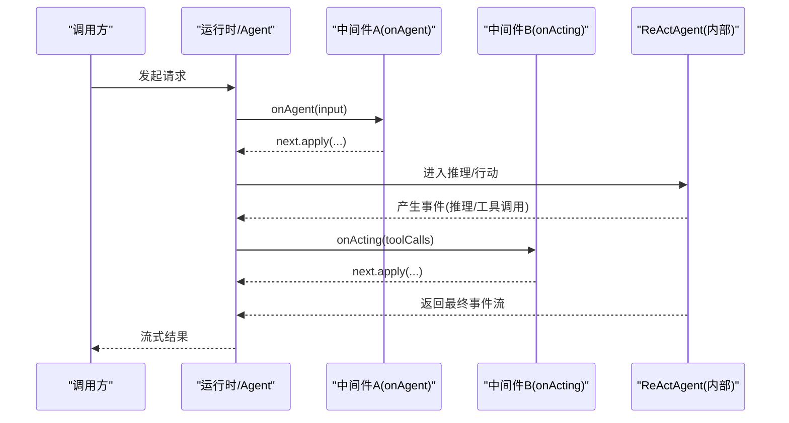
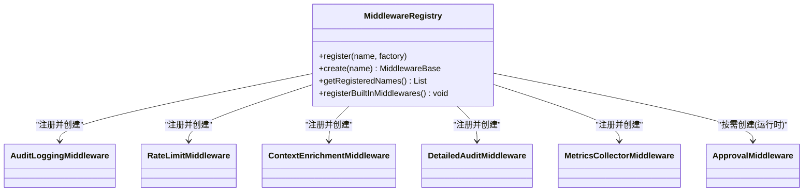
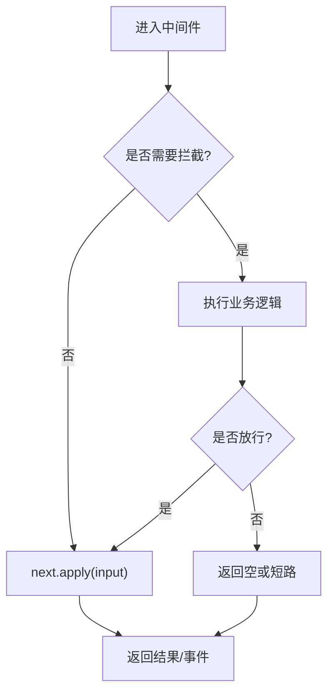
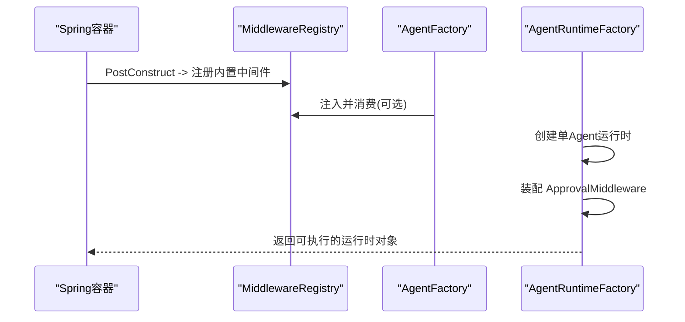
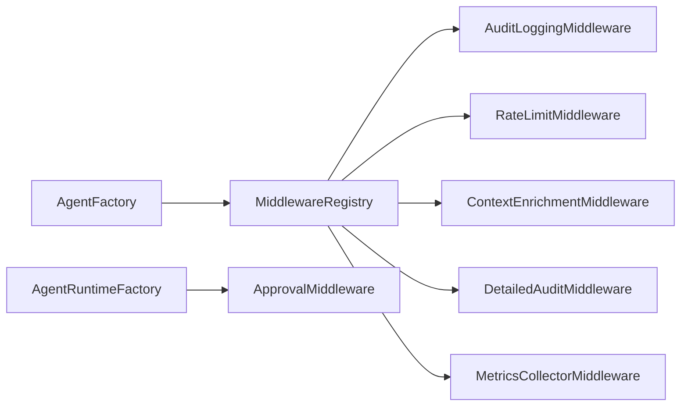

# 中间件框架

<cite>
**本文引用的文件**
- [MiddlewareRegistry.java](file://src/main/java/com/skloda/agentscope/middleware/MiddlewareRegistry.java)
- [AuditLoggingMiddleware.java](file://src/main/java/com/skloda/agentscope/middleware/AuditLoggingMiddleware.java)
- [RateLimitMiddleware.java](file://src/main/java/com/skloda/agentscope/middleware/RateLimitMiddleware.java)
- [ContextEnrichmentMiddleware.java](file://src/main/java/com/skloda/agentscope/middleware/ContextEnrichmentMiddleware.java)
- [DetailedAuditMiddleware.java](file://src/main/java/com/skloda/agentscope/middleware/DetailedAuditMiddleware.java)
- [MetricsCollectorMiddleware.java](file://src/main/java/com/skloda/agentscope/middleware/MetricsCollectorMiddleware.java)
- [ApprovalMiddleware.java](file://src/main/java/com/skloda/agentscope/middleware/ApprovalMiddleware.java)
- [AgentRuntimeFactory.java](file://src/main/java/com/skloda/agentscope/runtime/AgentRuntimeFactory.java)
- [AgentFactory.java](file://src/main/java/com/skloda/agentscope/agent/AgentFactory.java)
- [MetricsController.java](file://src/main/java/com/skloda/agentscope/controller/MetricsController.java)
- [application.yml](file://src/main/resources/application.yml)
- [MiddlewareRegistryTest.java](file://src/test/java/com/skloda/agentscope/middleware/MiddlewareRegistryTest.java)
</cite>

## 目录
1. [简介](#简介)
2. [项目结构](#项目结构)
3. [核心组件](#核心组件)
4. [架构总览](#架构总览)
5. [组件详解](#组件详解)
6. [依赖关系分析](#依赖关系分析)
7. [性能考虑](#性能考虑)
8. [故障诊断与排错](#故障诊断与排错)
9. [结论](#结论)
10. [附录：自定义中间件开发指南](#附录自定义中间件开发指南)

## 简介
本技术文档聚焦于 AgentScope Demo 中的中间件框架。重点阐述以下方面：
- 中间件注册机制（工厂模式与依赖注入）、自动发现与运行时实例化、生命周期管理
- 执行链的组装原理（拦截器模式）、请求处理的管道设计
- 内置中间件的发现与注册策略、配置管理
- 自定义中间件规范、错误处理、性能考量与最佳实践
- 调试、监控与测试方法

## 项目结构
中间件相关代码集中在 middleware 包内，围绕一个统一注册表进行装配和调度，并通过工厂/运行时管线与 Agent 执行流程集成：
- 注册表：负责名称到工厂的映射、自动注册内置中间件、按名称创建实例
- 中间件实现：审计、限流、上下文增强、详细审计、指标采集、审批控制等
- 集成点：Agent 构建与运行时装配阶段，将中间件织入执行链路

**图示来源**
- [MiddlewareRegistry.java:12-55](file://src/main/java/com/skloda/agentscope/middleware/MiddlewareRegistry.java#L12-L55)
- [AgentFactory.java:36-71](file://src/main/java/com/skloda/agentscope/agent/AgentFactory.java#L36-L71)
- [AgentRuntimeFactory.java:184-195](file://src/main/java/com/skloda/agentscope/runtime/AgentRuntimeFactory.java#L184-L195)

**章节来源**
- [MiddlewareRegistry.java:12-55](file://src/main/java/com/skloda/agentscope/middleware/MiddlewareRegistry.java#L12-L55)
- [AgentFactory.java:36-71](file://src/main/java/com/skloda/agentscope/agent/AgentFactory.java#L36-L71)
- [AgentRuntimeFactory.java:184-195](file://src/main/java/com/skloda/agentscope/runtime/AgentRuntimeFactory.java#L184-L195)

## 核心组件
- 中间件注册表（MiddlewareRegistry）：基于 Map 维护“名称→工厂”的注册关系；提供自动注册内置中间件的初始化能力；按名称通过 Supplier 创建实例；提供已注册名称列表查询。
- 内置中间件：
  - 审计日志（AuditLoggingMiddleware）：记录 Agent/推理/工具调用阶段的开始、耗时与错误
  - 速率限制（RateLimitMiddleware）：按分钟滑动窗口限流模型调用次数
  - 上下文增强（ContextEnrichmentMiddleware）：在系统提示词中注入时间/身份上下文片段
  - 详细审计（DetailedAuditMiddleware）：带追踪 ID 的全链路事件统计（推理轮次、思考内容、文本输出、工具调用等）
  - 指标采集（MetricsCollectorMiddleware）：汇总 Agent/工具级别耗时、Token 用量、成本估算、错误率等
  - 审批中间件（ApprovalMiddleware）：基于工具或 Agent 配置，暂停敏感工具执行并支持后续恢复
- 运行期集成：
  - AgentRuntimeFactory：创建具体运行时，并在需要时装配 ApprovalMiddleware
  - AgentFactory：作为中间件注册的入口之一，依赖 MiddlewareRegistry 完成工厂模式的装配

**章节来源**
- [MiddlewareRegistry.java:18-55](file://src/main/java/com/skloda/agentscope/middleware/MiddlewareRegistry.java#L18-L55)
- [AuditLoggingMiddleware.java:15-68](file://src/main/java/com/skloda/agentscope/middleware/AuditLoggingMiddleware.java#L15-L68)
- [RateLimitMiddleware.java:16-53](file://src/main/java/com/skloda/agentscope/middleware/RateLimitMiddleware.java#L16-L53)
- [ContextEnrichmentMiddleware.java:13-28](file://src/main/java/com/skloda/agentscope/middleware/ContextEnrichmentMiddleware.java#L13-L28)
- [DetailedAuditMiddleware.java:28-108](file://src/main/java/com/skloda/agentscope/middleware/DetailedAuditMiddleware.java#L28-L108)
- [MetricsCollectorMiddleware.java:21-162](file://src/main/java/com/skloda/agentscope/middleware/MetricsCollectorMiddleware.java#L21-L162)
- [ApprovalMiddleware.java:22-124](file://src/main/java/com/skloda/agentscope/middleware/ApprovalMiddleware.java#L22-L124)
- [AgentRuntimeFactory.java:184-195](file://src/main/java/com/skloda/agentscope/runtime/AgentRuntimeFactory.java#L184-L195)
- [AgentFactory.java:36-71](file://src/main/java/com/skloda/agentscope/agent/AgentFactory.java#L36-L71)

## 架构总览
中间件框架采用拦截器式管道设计，借助 Reactor 的 Flux/Mono 组合多个钩子方法（onAgent、onReasoning、onActing、onModelCall、onSystemPrompt），在各阶段对输入/输出/事件进行拦截与增强。

- 拦截器模式：每个中间件接收 next Function，选择是否调用以进入下一环节
- 管道组成：由框架在 Agent 构建时依据配置与工厂组装
- 数据流向：请求/事件经过一系列中间件处理后到达 Agent，结果逆向流经各层中间件

该图展示了通用中间件管道；实际项目中，审批、限流、审计、指标等中间件可在不同阶段介入。

**章节来源**
- [AuditLoggingMiddleware.java:15-68](file://src/main/java/com/skloda/agentscope/middleware/AuditLoggingMiddleware.java#L15-L68)
- [DetailedAuditMiddleware.java:28-108](file://src/main/java/com/skloda/agentscope/middleware/DetailedAuditMiddleware.java#L28-L108)
- [MetricsCollectorMiddleware.java:21-162](file://src/main/java/com/skloda/agentscope/middleware/MetricsCollectorMiddleware.java#L21-L162)

## 组件详解

### 1) 中间件注册表与工厂模式
- 设计要点
  - 使用 LinkedHashMap 保存“名称→Supplier”的顺序保持映射，确保可预测的创建顺序
  - @PostConstruct 阶段统一自动注册内置中间件（审计、限流、上下文增强、详细审计、指标采集、OpenTelemetry 追踪）
  - 通过 create(name) 根据名称解析工厂并调用 Supplier.get() 生成中间件实例
  - 未找到名称时记录告警并返回 null
- 集成方式
  - AgentFactory 通过构造函数注入 MiddlewareRegistry，从而能在构建 Agent 时将中间件接入执行链路
- 扩展性
  - 新增中间件只需在 registerBuiltInMiddlewares 中追加一行注册，或在业务启动逻辑中调用 register(name, factory)

**图示来源**
- [MiddlewareRegistry.java:12-55](file://src/main/java/com/skloda/agentscope/middleware/MiddlewareRegistry.java#L12-L55)

**章节来源**
- [MiddlewareRegistry.java:18-55](file://src/main/java/com/skloda/agentscope/middleware/MiddlewareRegistry.java#L18-L55)
- [AgentFactory.java:36-71](file://src/main/java/com/skloda/agentscope/agent/AgentFactory.java#L36-L71)

### 2) 中间件执行链与拦截器模式
- 各中间件均实现统一的 MiddlewareBase 接口，并在对应阶段（onAgent/onReasoning/onActing/onModelCall/onSystemPrompt）注入切面逻辑
- 典型模式：
  - 在 next.apply(input) 前后埋点，计算耗时、累计统计、捕获异常
  - 对事件流进行过滤/替换/旁路（如限流返回空流、审批跳过工具调用）
  - 在 onSystemPrompt 中改写/增强系统提示词（如注入时间与用户信息）

示例流程图（通用拦截）：

**章节来源**
- [AuditLoggingMiddleware.java:15-68](file://src/main/java/com/skloda/agentscope/middleware/AuditLoggingMiddleware.java#L15-L68)
- [RateLimitMiddleware.java:32-52](file://src/main/java/com/skloda/agentscope/middleware/RateLimitMiddleware.java#L32-L52)
- [ContextEnrichmentMiddleware.java:18-27](file://src/main/java/com/skloda/agentscope/middleware/ContextEnrichmentMiddleware.java#L18-L27)
- [DetailedAuditMiddleware.java:45-108](file://src/main/java/com/skloda/agentscope/middleware/DetailedAuditMiddleware.java#L45-L108)
- [ApprovalMiddleware.java:58-77](file://src/main/java/com/skloda/agentscope/middleware/ApprovalMiddleware.java#L58-L77)

### 3) 内置中间件详解

#### 审计日志（AuditLoggingMiddleware）
- 关注点：Agent/推理/工具调用的起止耗时、消息数量、工具调用参数摘要、失败错误
- 特点：无状态，仅日志记录与计时

**章节来源**
- [AuditLoggingMiddleware.java:15-68](file://src/main/java/com/skloda/agentscope/middleware/AuditLoggingMiddleware.java#L15-L68)

#### 速率限制（RateLimitMiddleware）
- 关注点：按最近 1 分钟的调用次数限制（默认阈值）
- 机制：线程安全队列维护时间戳窗口，超出阈值直接返回空事件流

**章节来源**
- [RateLimitMiddleware.java:16-53](file://src/main/java/com/skloda/agentscope/middleware/RateLimitMiddleware.java#L16-L53)

#### 上下文增强（ContextEnrichmentMiddleware）
- 关注点：在系统提示词中注入时间与身份信息片段
- 机制：改写 onSystemPrompt 返回值

**章节来源**
- [ContextEnrichmentMiddleware.java:13-28](file://src/main/java/com/skloda/agentscope/middleware/ContextEnrichmentMiddleware.java#L13-L28)

#### 详细审计（DetailedAuditMiddleware）
- 关注点：全链路追踪（TraceId）、事件分类计数、思考内容与文本输出增量聚合、工具参数打印
- 机制：ThreadLocal 保存当前追踪上下文；基于事件类型更新计数器并分段输出

**章节来源**
- [DetailedAuditMiddleware.java:28-108](file://src/main/java/com/skloda/agentscope/middleware/DetailedAuditMiddleware.java#L28-L108)

#### 指标采集（MetricsCollectorMiddleware）
- 关注点：Agent/工具级别的调用次数、耗时、Token 统计、成本估算、错误率、全局汇总
- 机制：ThreadLocal 跟踪上下文，Atomic* 并发计数，静态聚合全局指标；提供 API 暴露汇总

**章节来源**
- [MetricsCollectorMiddleware.java:21-162](file://src/main/java/com/skloda/agentscope/middleware/MetricsCollectorMiddleware.java#L21-L162)
- [MetricsController.java:12-57](file://src/main/java/com/skloda/agentscope/controller/MetricsController.java#L12-L57)

#### 审批中间件（ApprovalMiddleware）
- 关注点：在敏感工具调用前暂停执行，支持按 Agent 开关或白名单工具
- 行为：触发后设置 pending 工具调用并返回空流（跳过工具执行），对外暴露查询与 SSE 转换接口

**章节来源**
- [ApprovalMiddleware.java:22-124](file://src/main/java/com/skloda/agentscope/middleware/ApprovalMiddleware.java#L22-L124)
- [AgentRuntimeFactory.java:184-195](file://src/main/java/com/skloda/agentscope/runtime/AgentRuntimeFactory.java#L184-L195)

### 4) 运行时装配与生命周期
- 启动期自动注册：@PostConstruct 阶段集中注册内置中间件
- 运行时装配：
  - AgentRuntimeFactory 为会话型单 Agent 路径创建 ApprovalMiddleware 并传入 CompositeAgentFactory，用于条件性停止工具执行
  - AgentFactory 在构造器注入 MiddlewareRegistry，便于在更上游的位置组织中间件链
- 事件流生命周期：Flux/Mono 由各个中间件串联，任一中间件可选择短路、过滤或透传

**图示来源**
- [MiddlewareRegistry.java:23-41](file://src/main/java/com/skloda/agentscope/middleware/MiddlewareRegistry.java#L23-L41)
- [AgentFactory.java:36-71](file://src/main/java/com/skloda/agentscope/agent/AgentFactory.java#L36-L71)
- [AgentRuntimeFactory.java:184-195](file://src/main/java/com/skloda/agentscope/runtime/AgentRuntimeFactory.java#L184-L195)

**章节来源**
- [MiddlewareRegistry.java:23-41](file://src/main/java/com/skloda/agentscope/middleware/MiddlewareRegistry.java#L23-L41)
- [AgentRuntimeFactory.java:184-195](file://src/main/java/com/skloda/agentscope/runtime/AgentRuntimeFactory.java#L184-L195)
- [AgentFactory.java:36-71](file://src/main/java/com/skloda/agentscope/agent/AgentFactory.java#L36-L71)

### 5) 配置管理
- 应用配置位于 application.yml，主要涉及：
  - AgentScope 基础配置（模型、内存、工具、会话、知识检索、MCP）
  - 日志等级（包括 METRICS 日志级别用于观察指标采集中间件的输出）
- 中间件本身的配置大多以内置默认值或构造参数形式存在（如限流阈值、审批开关/白名单），可通过上层服务装配阶段传入

**章节来源**
- [application.yml:1-90](file://src/main/resources/application.yml#L1-L90)
- [MetricsCollectorMiddleware.java:46-49](file://src/main/java/com/skloda/agentscope/middleware/MetricsCollectorMiddleware.java#L46-L49)
- [RateLimitMiddleware.java:20-29](file://src/main/java/com/skloda/agentscope/middleware/RateLimitMiddleware.java#L20-L29)
- [ApprovalMiddleware.java:44-52](file://src/main/java/com/skloda/agentscope/middleware/ApprovalMiddleware.java#L44-L52)

## 依赖关系分析
- 松耦合注册：中间件仅依赖公共接口，不感知彼此实现，通过注册表统一管理
- 运行期解耦：Agent 创建过程通过工厂注入中间件，避免强耦合
- 外部依赖：
  - Reactor（Flux/Mono）用于异步事件流
  - SLF4J 日志
  - AgentScope 核心（Agent/Event/Middleware 抽象）
  - Spring Boot（@Component/@PostConstruct）

**图示来源**
- [AgentFactory.java:36-71](file://src/main/java/com/skloda/agentscope/agent/AgentFactory.java#L36-L71)
- [AgentRuntimeFactory.java:184-195](file://src/main/java/com/skloda/agentscope/runtime/AgentRuntimeFactory.java#L184-L195)
- [MiddlewareRegistry.java:23-41](file://src/main/java/com/skloda/agentscope/middleware/MiddlewareRegistry.java#L23-L41)

**章节来源**
- [AgentFactory.java:36-71](file://src/main/java/com/skloda/agentscope/agent/AgentFactory.java#L36-L71)
- [AgentRuntimeFactory.java:184-195](file://src/main/java/com/skloda/agentscope/runtime/AgentRuntimeFactory.java#L184-L195)
- [MiddlewareRegistry.java:23-41](file://src/main/java/com/skloda/agentscope/middleware/MiddlewareRegistry.java#L23-L41)

## 性能考虑
- 无锁轻量：多数中间件基于本地变量与原子类，避免全局锁竞争
- 短周期任务：审计、指标采集尽量在非关键路径落盘，使用日志异步化建议配合后端 logback 配置
- 限流保护：RateLimitMiddleware 提供快速失败，降低模型调用风暴
- 采样与裁剪：详细审计会输出大量内容，生产建议按需开启或使用采样策略
- 内存占用：避免持有过大的中间态；例如对超长内容采取截断展示，减少内存压力

[本节为通用指导，不涉及特定文件]

## 故障诊断与排错
- 无法识别中间件名称：检查注册表中是否存在相应名称及大小写；参考 getRegisteredNames 输出
- 中间件无效：确认对应的 onXxx 是否被调用，以及 next.apply(input) 是否执行
- 限流命中：观察限流中间件的警告日志与返回空事件流的场景
- 审批未触发：检查 ApprovalMiddleware 的触发条件（Agent 级/工具级），必要时通过运行时查询 pending 列表
- 指标缺失：确认日志级别开启 METRICS；可通过 HTTP 端点打印/重置指标

常见排查手段：
- 查看审计日志与详细审计输出，定位失败点与耗时瓶颈
- 利用 MetricsController 提供的 /api/metrics/print 与 /api/metrics/reset 辅助观测

**章节来源**
- [MiddlewareRegistry.java:43-54](file://src/main/java/com/skloda/agentscope/middleware/MiddlewareRegistry.java#L43-L54)
- [RateLimitMiddleware.java:32-52](file://src/main/java/com/skloda/agentscope/middleware/RateLimitMiddleware.java#L32-L52)
- [ApprovalMiddleware.java:58-77](file://src/main/java/com/skloda/agentscope/middleware/ApprovalMiddleware.java#L58-L77)
- [MetricsController.java:12-57](file://src/main/java/com/skloda/agentscope/controller/MetricsController.java#L12-L57)

## 结论
该中间件框架以注册表为中心、以拦截器管道为核心，实现了高内聚低耦合的可插拔架构。通过工厂模式与依赖注入，天然支持在运行时组合、复用和扩展中间件。内置中间件覆盖了可观测性、治理与安全合规等核心需求，并通过统一的事件流形态与 Agent 执行阶段无缝集成，具备良好的扩展性和工程实用性。

[本节为总结性内容，不涉及特定文件]

## 附录：自定义中间件开发指南

### 1. 接口规范
- 实现标准中间件接口，覆盖所需阶段（Agent/Reasoning/Acting/ModelCall/SystemPrompt）
- 在每个阶段：
  - 读取输入/上下文信息
  - 可选地修改输入/上下文
  - 决定是否调用 next.apply(input) 继续链路
  - 对下游事件流进行加工（过滤/标记/度量/旁路）
- 遵循幂等与无副作用原则，尽量避免跨调用共享可变状态；如需线程局部状态需正确清理

参考接口与阶段签名参见：
- [AuditLoggingMiddleware.java:15-68](file://src/main/java/com/skloda/agentscope/middleware/AuditLoggingMiddleware.java#L15-L68)
- [DetailedAuditMiddleware.java:28-108](file://src/main/java/com/skloda/agentscope/middleware/DetailedAuditMiddleware.java#L28-L108)

### 2. 注册与装配
- 通过 MiddlewareRegistry.register 注册新的中间件名称与其工厂引用
- 若希望作为内置能力的一部分，请在自动注册阶段添加一行 register
- 在运行时根据配置（如 AgentConfig/HarnessConfig）动态启用/禁用

参考：
- [MiddlewareRegistry.java:18-41](file://src/main/java/com/skloda/agentscope/middleware/MiddlewareRegistry.java#L18-L41)

### 3. 错误处理策略
- 对于非致命问题：记录日志，保留链路继续（doOnError 中捕获异常）
- 对于阻断性问题（如鉴权失败）：返回空流或直接抛出异常
- 注意保证 downstream 资源清理（尤其在使用外部 I/O 时）

参考：
- [AuditLoggingMiddleware.java:29-35](file://src/main/java/com/skloda/agentscope/middleware/AuditLoggingMiddleware.java#L29-L35)
- [ApprovalMiddleware.java:58-77](file://src/main/java/com/skloda/agentscope/middleware/ApprovalMiddleware.java#L58-L77)

### 4. 性能与并发
- 优先使用不可变数据结构与原子类型做计数
- 避免在高频路径做重型计算或同步阻塞 IO
- 合理截断大对象日志输出，防止日志爆炸

参考：
- [DetailedAuditMiddleware.java:45-108](file://src/main/java/com/skloda/agentscope/middleware/DetailedAuditMiddleware.java#L45-L108)
- [MetricsCollectorMiddleware.java:36-162](file://src/main/java/com/skloda/agentscope/middleware/MetricsCollectorMiddleware.java#L36-L162)

### 5. 监控与调试
- 使用 SLF4J 输出结构化日志（含 TraceId、AgentName、ToolName 等）
- 针对指标类中间件提供聚合与导出（见 MetricsController）
- 在生产环境建议分级开启详细审计与指标日志

参考：
- [MetricsController.java:12-57](file://src/main/java/com/skloda/agentscope/controller/MetricsController.java#L12-L57)

### 6. 单元测试建议
- 构造最小化的输入与 next 函数，验证事件流长度、类型与预期变更
- 校验边界情况（空输入、未知中间件名、超阈限行径）
- 验证 ThreadLocal/计数器是否正确初始化与清理

参考：
- [MiddlewareRegistryTest.java:15-52](file://src/test/java/com/skloda/agentscope/middleware/MiddlewareRegistryTest.java#L15-L52)
- [AuditLoggingMiddlewareTest.java:23-75](file://src/test/java/com/skloda/agentscope/middleware/AuditLoggingMiddlewareTest.java#L23-L75)