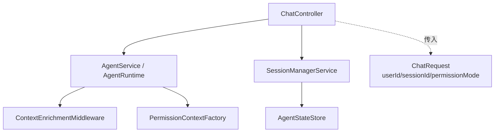
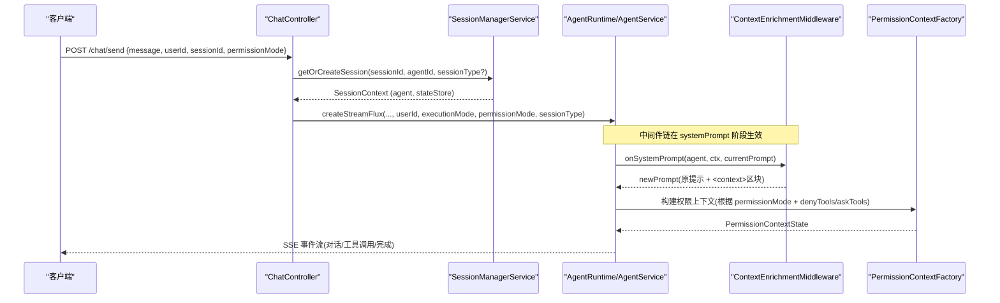
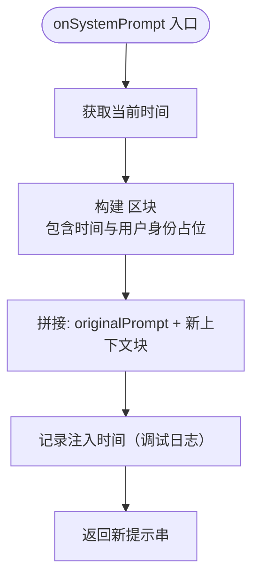
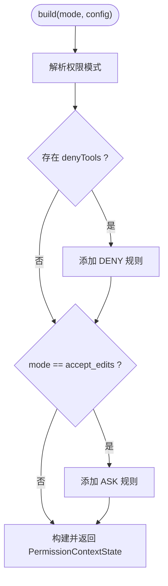
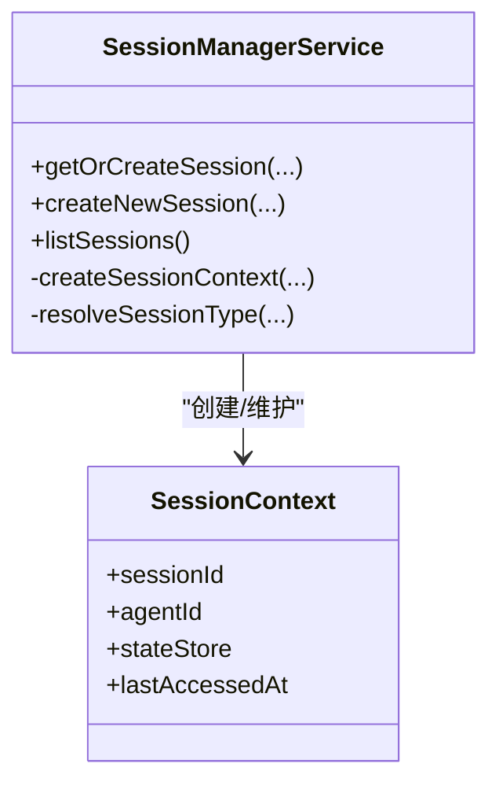
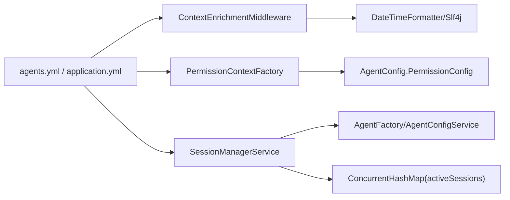

# 上下文增强中间件

<cite>
**本文引用的文件**
- [ContextEnrichmentMiddleware.java](file://src/main/java/com/skloda/agentscope/middleware/ContextEnrichmentMiddleware.java)
- [PermissionContextFactory.java](file://src/main/java/com/skloda/agentscope/permission/PermissionContextFactory.java)
- [SessionManagerService.java](file://src/main/java/com/skloda/agentscope/service/SessionManagerService.java)
- [ChatRequest.java](file://src/main/java/com/skloda/agentscope/model/ChatRequest.java)
- [SessionInfo.java](file://src/main/java/com/skloda/agentscope/model/SessionInfo.java)
- [AgentConfig.java](file://src/main/java/com/skloda/agentscope/agent/AgentConfig.java)
- [agents.yml](file://src/main/resources/config/agents.yml)
- [application.yml](file://src/main/resources/application.yml)
- [ContextEnrichmentMiddlewareTest.java](file://src/test/java/com/skloda/agentscope/middleware/ContextEnrichmentMiddlewareTest.java)
</cite>

## 目录
1. [简介](#简介)
2. [项目结构与定位](#项目结构与定位)
3. [核心组件总览](#核心组件总览)
4. [架构与数据流总览](#架构与数据流总览)
5. [详细组件分析](#详细组件分析)
6. [依赖关系与耦合分析](#依赖关系与耦合分析)
7. [性能考量与优化建议](#性能考量与优化建议)
8. [故障排查指南](#故障排查指南)
9. [结论](#结论)
10. [附录：企业级安全配置参考](#附录企业级安全配置参考)

## 简介
本文件面向“上下文增强中间件”的机制、权限上下文构建与管理、以及其对 AI 响应质量的影响，给出可落地的实现说明、运行流程与安全方案。内容覆盖系统提示词增强（含时间戳注入）、会话与用户身份上下文自动补充、环境变量与动态信息读取、敏感信息过滤策略、权限模式与工具访问控制、多租户隔离与企业审计，以及性能调优与最佳实践。

## 项目结构与定位
与“上下文增强中间件”最相关的代码位于：
- middleware：中间件切面实现（上下文增强、审计、指标、限速等）
- permission：权限上下文构造器
- service/session：会话上下文管理与生命周期
- model/chat-request：请求上下文传递入口（用户身份、会话、权限等）
- agent-config：代理及中间件、权限等静态配置

图表来源
- [ChatRequest.java:6-17](file://src/main/java/com/skloda/agentscope/model/ChatRequest.java#L6-L17)
- [ContextEnrichmentMiddleware.java:13-27](file://src/main/java/com/skloda/agentscope/middleware/ContextEnrichmentMiddleware.java#L13-L27)
- [PermissionContextFactory.java:9-24](file://src/main/java/com/skloda/agentscope/permission/PermissionContextFactory.java#L9-L24)
- [SessionManagerService.java:23-93](file://src/main/java/com/skloda/agentscope/service/SessionManagerService.java#L23-L93)

章节来源
- [ChatRequest.java:6-17](file://src/main/java/com/skloda/agentscope/model/ChatRequest.java#L6-L17)
- [ContextEnrichmentMiddleware.java:13-27](file://src/main/java/com/skloda/agentscope/middleware/ContextEnrichmentMiddleware.java#L13-L27)
- [PermissionContextFactory.java:9-24](file://src/main/java/com/skloda/agentscope/permission/PermissionContextFactory.java#L9-L24)
- [SessionManagerService.java:23-93](file://src/main/java/com/skloda/agentscope/service/SessionManagerService.java#L23-L93)

## 核心组件总览
- ContextEnrichmentMiddleware：对系统提示词进行“上下文增强”，在当前时间注入和用户身份信息占位的基础上封装 <context> 片段，保持原始提示不被修改并返回新字符串。
- PermissionContextFactory：基于请求/配置的权限模式（bypass/accept_edits/strict 等）与工具白/黑名单规则，生成运行时权限上下文状态。
- SessionManagerService：管理活跃会话，负责创建/迁移/回收会话、维护最后访问时间、暴露会话元信息；为上下文提供“会话ID、会话类型”等信息。
- ChatRequest：通过请求体携带 userId、sessionId、executionMode、permissionMode、sessionType 等上下文字段，贯穿后续处理链路。
- AgentConfig + agents.yml：集中声明 agents、中间件列表、权限默认模式等静态配置项。
- application.yml：模型 Provider、内存/会话存储路径等运行时环境变量注入点。

章节来源
- [ContextEnrichmentMiddleware.java:13-27](file://src/main/java/com/skloda/agentscope/middleware/ContextEnrichmentMiddleware.java#L13-L27)
- [PermissionContextFactory.java:9-24](file://src/main/java/com/skloda/agentscope/permission/PermissionContextFactory.java#L9-L24)
- [SessionManagerService.java:75-93](file://src/main/java/com/skloda/agentscope/service/SessionManagerService.java#L75-L93)
- [ChatRequest.java:6-17](file://src/main/java/com/skloda/agentscope/model/ChatRequest.java#L6-L17)
- [AgentConfig.java:91-113](file://src/main/java/com/skloda/agentscope/agent/AgentConfig.java#L91-L113)
- [agents.yml:1755-1770](file://src/main/resources/config/agents.yml#L1755-L1770)
- [application.yml:25-60](file://src/main/resources/application.yml#L25-L60)

## 架构与数据流总览
下图概述一次聊天请求从进入控制器到中间件增强系统提示的关键流转：

图表来源
- [SessionManagerService.java:75-93](file://src/main/java/com/skloda/agentscope/service/SessionManagerService.java#L75-L93)
- [ContextEnrichmentMiddleware.java:18-27](file://src/main/java/com/skloda/agentscope/middleware/ContextEnrichmentMiddleware.java#L18-L27)
- [PermissionContextFactory.java:12-24](file://src/main/java/com/skloda/agentscope/permission/PermissionContextFactory.java#L12-L24)

## 详细组件分析

### 上下文增强中间件：系统提示词增强
- 触发时机：在系统提示准备阶段拦截当前提示串。
- 注入内容：
  - 当前时间：使用本地时区格式化时间，便于下游推理具备“当前时间”基线。
  - 用户身份标识：以固定占位形式注入，示例中为“demo-user”。
- 输出结构：返回“原提示 + 分隔 + <context>...</context> 块”，确保原始提示未被就地修改。
- 可观测性：日志记录注入的时间点，便于追踪和排障。
- 扩展点：如需替换用户身份或扩展上下文字段，仅需在此处扩展格式化逻辑即可。

图表来源
- [ContextEnrichmentMiddleware.java:18-27](file://src/main/java/com/skloda/agentscope/middleware/ContextEnrichmentMiddleware.java#L18-L27)

章节来源
- [ContextEnrichmentMiddleware.java:18-27](file://src/main/java/com/skloda/agentscope/middleware/ContextEnrichmentMiddleware.java#L18-L27)
- [ContextEnrichmentMiddlewareTest.java:13-23](file://src/test/java/com/skloda/agentscope/middleware/ContextEnrichmentMiddlewareTest.java#L13-L23)

### 权限上下文构建与管理
- 输入来源：
  - 请求层：ChatRequest.permissionMode、executionMode、userId。
  - 配置层：AgentConfig.PermissionConfig.defaultMode、denyTools、askTools。
- 构建逻辑：
  - 将字符串 mode 解析为 PermissionMode（如 bypass、accept_edits、strict）。
  - 应用 denyRules：拒绝指定工具调用。
  - 当为 ask 模式时，应用 askRules：需确认的工具集合。
- 产物：PermissionContextState，用于运行时权限评估（在工具调用前后校验）。

图表来源
- [PermissionContextFactory.java:12-24](file://src/main/java/com/skloda/agentscope/permission/PermissionContextFactory.java#L12-L24)
- [AgentConfig.java:100-106](file://src/main/java/com/skloda/agentscope/agent/AgentConfig.java#L100-L106)

章节来源
- [PermissionContextFactory.java:12-24](file://src/main/java/com/skloda/agentscope/permission/PermissionContextFactory.java#L12-L24)
- [AgentConfig.java:91-106](file://src/main/java/com/skloda/agentscope/agent/AgentConfig.java#L91-L106)
- [ChatRequest.java:12-16](file://src/main/java/com/skloda/agentscope/model/ChatRequest.java#L12-L16)

### 会话上下文的自动补充
- 来源：
  - 请求体中的 sessionId、userId、sessionType。
  - 服务侧 SessionManagerService：查找或创建会话上下文、记录访问时间、推断有效会话类型。
- 职责：
  - 关联 ReActAgent 与 AgentStateStore。
  - 将会话元信息（会话 ID、会话类型、最后访问时间）暴露给上层。
- 影响：上下文增强的系统提示可以结合会话维度信息（例如结合 future 扩展，向提示注入“会话开始时间/累计消息数/活跃专家”等），提升问答的一致性与相关性。

图表来源
- [SessionManagerService.java:23-93](file://src/main/java/com/skloda/agentscope/service/SessionManagerService.java#L23-L93)
- [SessionManagerService.java:126-145](file://src/main/java/com/skloda/agentscope/service/SessionManagerService.java#L126-L145)
- [SessionInfo.java:9-20](file://src/main/java/com/skloda/agentscope/model/SessionInfo.java#L9-L20)

章节来源
- [SessionManagerService.java:75-145](file://src/main/java/com/skloda/agentscope/service/SessionManagerService.java#L75-L145)
- [SessionInfo.java:9-20](file://src/main/java/com/skloda/agentscope/model/SessionInfo.java#L9-L20)

### 上下文数据来源与处理方式
- 环境变量读取：
  - application.yml 中通过 ${...} 注入 API Key、存储路径等，运行时由框架注入。
- 动态信息注入：
  - 当前时间、用户身份标识通过中间件即时生成并拼接到系统提示中。
  - 权限模式来源于配置与请求参数，按模式匹配工具限制策略。
- 敏感数据过滤：
  - 示例未实现统一脱敏，建议在后续扩展中加入基于规则的脱敏（如身份证、手机号掩码）与基于 schema 的结构化验证，避免将敏感信息直接写入提示或日志。

章节来源
- [application.yml:25-60](file://src/main/resources/application.yml#L25-L60)
- [ContextEnrichmentMiddleware.java:18-27](file://src/main/java/com/skloda/agentscope/middleware/ContextEnrichmentMiddleware.java#L18-L27)
- [PermissionContextFactory.java:12-24](file://src/main/java/com/skloda/agentscope/permission/PermissionContextFactory.java#L12-L24)

### 对 AI 响应质量的影响
- 上下文完整性保证：
  - 通过 <context> 区块显式提供时间与用户身份，减少模型“猜测当前环境”带来的不稳定因素。
- 信息相关性优化：
  - 未来可叠加会话维度的元数据（如“最近话题、已确认事实、业务上下文摘要”），进一步提升答案相关度。
- 长度控制策略：
  - 当前 <context> 非常轻量；若增大上下文体积，应考虑在入口处进行裁剪、摘要或分片，并配合模型最大上下文窗口限制，避免浪费 Token 与增加延迟。

章节来源
- [ContextEnrichmentMiddleware.java:18-27](file://src/main/java/com/skloda/agentscope/middleware/ContextEnrichmentMiddleware.java#L18-L27)

## 依赖关系与耦合分析
- ContextEnrichmentMiddleware
  - 与 Agent 运行时解耦，仅对系统提示进行无副作用转换。
  - 依赖标准库时间与日志组件，无第三方框架耦合。
- PermissionContextFactory
  - 依赖 AgentConfig 的配置结构和枚举化的权限模式。
  - 与具体工具名弱耦合（仅字符串列表），便于扩展不同环境的规则集。
- SessionManagerService
  - 与 AgentFactory、AgentConfigService 协作，创建 Agent 与 StateStore。
  - 内部使用并发容器保存活跃会话，注意跨节点部署时应切换到外部存储。
- 配置文件
  - agents.yml 声明中间件列表与权限默认模式；application.yml 注入模型与存储路径等。

图表来源
- [ContextEnrichmentMiddleware.java:13-27](file://src/main/java/com/skloda/agentscope/middleware/ContextEnrichmentMiddleware.java#L13-L27)
- [PermissionContextFactory.java:9-24](file://src/main/java/com/skloda/agentscope/permission/PermissionContextFactory.java#L9-L24)
- [SessionManagerService.java:23-43](file://src/main/java/com/skloda/agentscope/service/SessionManagerService.java#L23-L43)
- [agents.yml:1755-1770](file://src/main/resources/config/agents.yml#L1755-L1770)
- [application.yml:25-60](file://src/main/resources/application.yml#L25-L60)

章节来源
- [SessionManagerService.java:23-43](file://src/main/java/com/skloda/agentscope/service/SessionManagerService.java#L23-L43)
- [agents.yml:1755-1770](file://src/main/resources/config/agents.yml#L1755-L1770)

## 性能考量与优化建议
- 中间件开销
  - 当前上下文增强仅做字符串拼接与时间格式化，开销极低；在高吞吐场景下也可接受。
- 会话管理
  - 活跃会话保存在进程内 Map 中，单实例低延迟；若水平扩展，应启用分布式 StateStore，并将会话元信息外置。
- Token 使用
  - 上下文片段尽量精简；必要时对会话历史或外部知识做摘要后再注入。
- 权限校验
  - deny/ask 规则应尽量前移，尽早拒绝危险工具调用，减少不必要的 LLM 交互与 I/O。
- 缓存
  - 对不常变化的上下文（如平台基础配置、合规条款）可做短生命周期缓存以减少重复处理。

[本节为通用性能建议，不直接分析具体文件]

## 故障排查指南
- 中间件未生效
  - 检查 agents.yml 中对应的 agent 是否启用了 context-enrichment 中间件。
- 用户身份未识别
  - 确保 ChatRequest.userId 被正确填充并通过运行链传入上下文。
- 权限误判
  - 核对 permissionMode 与 AgentConfig 中 denyTools/askTools 的设置是否符合预期。
- 会话异常
  - 确认 sessionId 是否正确传递；检查 SessionManagerService 的会话创建与迁移逻辑是否按预期执行。

章节来源
- [agents.yml:1755-1770](file://src/main/resources/config/agents.yml#L1755-L1770)
- [ContextEnrichmentMiddlewareTest.java:13-23](file://src/test/java/com/skloda/agentscope/middleware/ContextEnrichmentMiddlewareTest.java#L13-L23)

## 结论
上下文增强中间件通过对系统提示进行轻量但高价值的增强（时间、用户身份、可扩展会话元信息），在不侵入业务逻辑的前提下提升了 AI 行为的一致性与可控性；配合权限上下文工厂可实现细粒度的工具访问控制；结合会话管理层可获得更完整的对话上下文。在此基础上，可增加敏感数据过滤、会话外置存储、规则引擎与审计追踪，以满足企业级安全与合规要求。

## 附录：企业级安全配置参考
以下方案基于现有能力扩展，聚焦多租户隔离、数据隔离、审计跟踪与隐私保护：

- 多租户与隔离
  - 租户标识：在 ChatRequest 增加 tenantId；在 SessionContext 中记录 tenantId。
  - 权限上下文：按租户加载专属 deny/ask 规则；支持租户级黑白名单与审批流。
  - 存储隔离：StateStore 的 key 加入 tenantId 前缀，保证数据隔离。
- 敏感数据过滤
  - 在服务入参与输出端增加规则型脱敏（掩码/哈希/删除关键字段），并对日志进行过滤。
  - 对结构化输入进行 Schema 校验（如身份证号格式、邮箱格式），拒绝非法值。
- 审计与溯源
  - 结合已有的审计中间件思路，记录每次请求的 tenantId、userId、sessionId、权限模式、关键工具调用决策。
  - 对外暴露查询接口以检索某租户/会话的执行轨迹，满足审计合规。
- 配置与密钥安全
  - 所有敏感配置通过环境变量注入，不在仓库中明文存放。
  - 生产环境最小化开放中间件，按需启用（仅必要的 context/enrichment、audit、metrics）。

[本附录为概念性指导，不直接引用具体代码行]