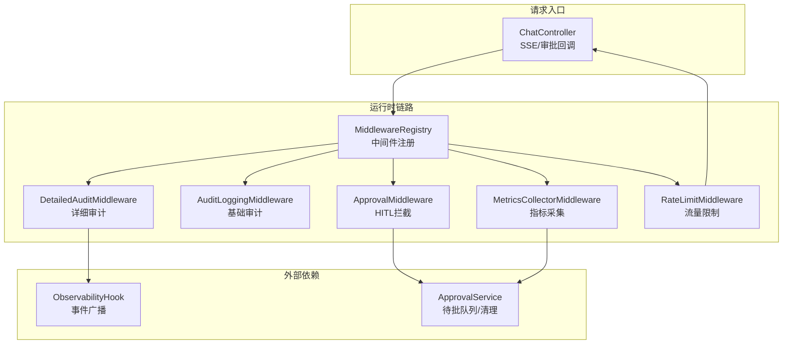
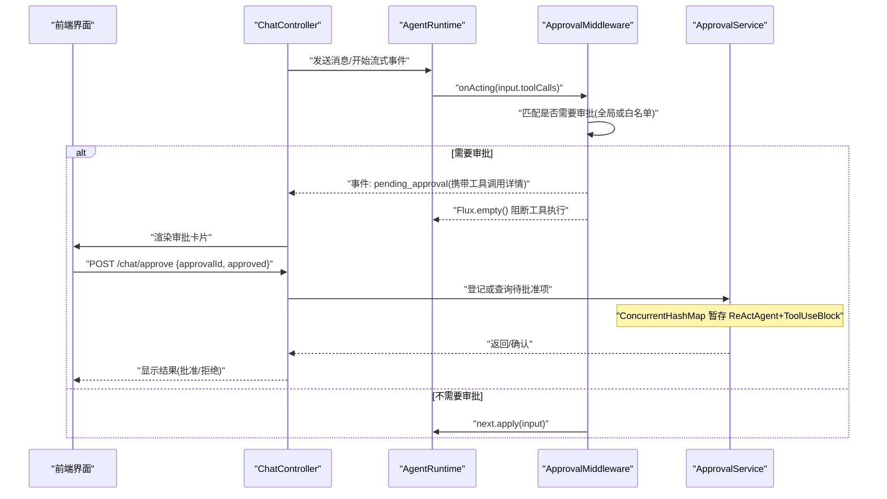
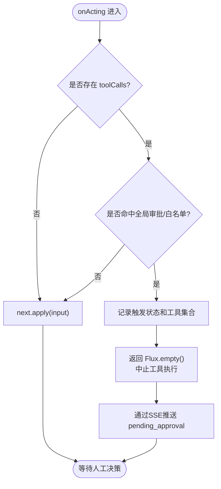
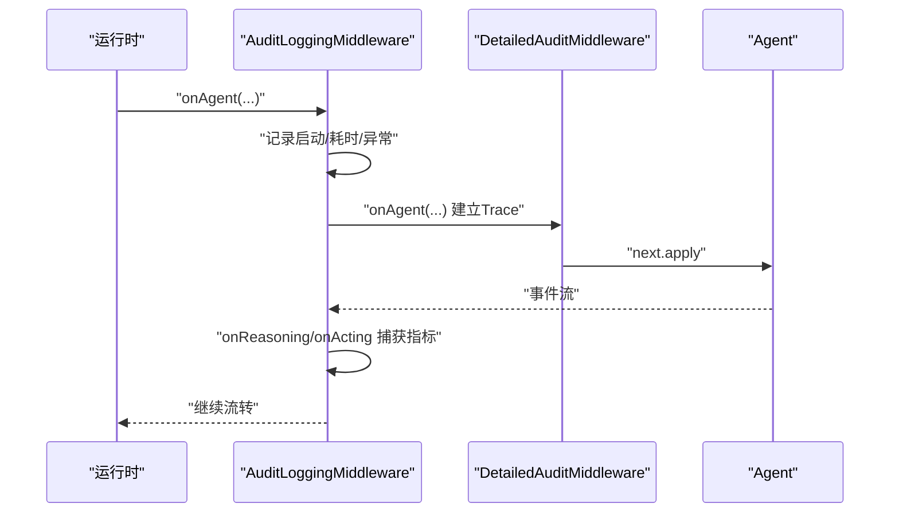
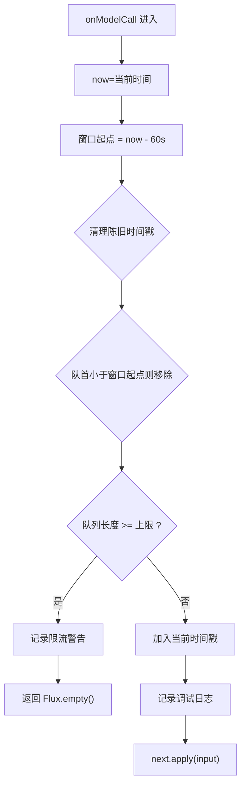
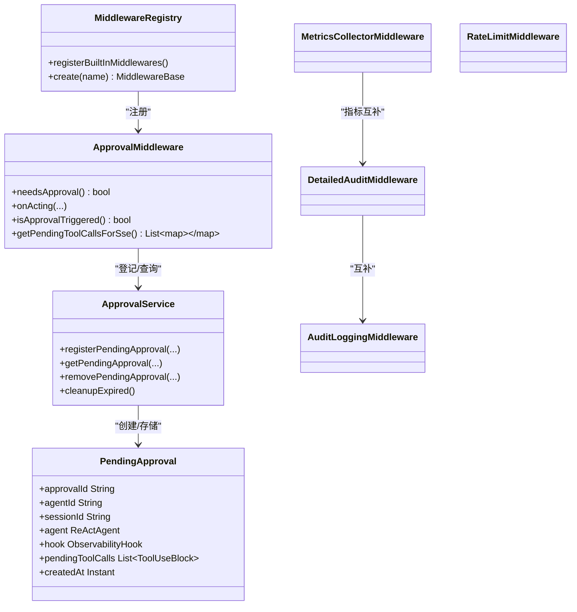

# 安全中间件

<cite>
**本文引用的文件**
- [ApprovalMiddleware.java](file://src/main/java/com/skloda/agentscope/middleware/ApprovalMiddleware.java)
- [AuditLoggingMiddleware.java](file://src/main/java/com/skloda/agentscope/middleware/AuditLoggingMiddleware.java)
- [DetailedAuditMiddleware.java](file://src/main/java/com/skloda/agentscope/middleware/DetailedAuditMiddleware.java)
- [MetricsCollectorMiddleware.java](file://src/main/java/com/skloda/agentscope/middleware/MetricsCollectorMiddleware.java)
- [RateLimitMiddleware.java](file://src/main/java/com/skloda/agentscope/middleware/RateLimitMiddleware.java)
- [MiddlewareRegistry.java](file://src/main/java/com/skloda/agentscope/middleware/MiddlewareRegistry.java)
- [ApprovalService.java](file://src/main/java/com/skloda/agentscope/service/ApprovalService.java)
- [ApprovalRequest.java](file://src/main/java/com/skloda/agentscope/model/ApprovalRequest.java)
- [PendingApproval.java](file://src/main/java/com/skloda/agentscope/model/PendingApproval.java)
- [ObservabilityHook.java](file://src/main/java/com/skloda/agentscope/hook/ObservabilityHook.java)
- [ChatController.java](file://src/main/java/com/skloda/agentscope/controller/ChatController.java)
- [agents.yml](file://src/main/resources/config/agents.yml)
- [ApprovalMiddlewareTest.java](file://src/test/java/com/skloda/agentscope/middleware/ApprovalMiddlewareTest.java)
- [AuditLoggingMiddlewareTest.java](file://src/test/java/com/skloda/agentscope/middleware/AuditLoggingMiddlewareTest.java)
- [RateLimitMiddlewareTest.java](file://src/test/java/com/skloda/agentscope/middleware/RateLimitMiddlewareTest.java)
</cite>

## 目录
1. [简介](#简介)
2. [项目结构](#项目结构)
3. [核心组件](#核心组件)
4. [架构总览](#架构总览)
5. [详细组件分析](#详细组件分析)
6. [依赖关系分析](#依赖关系分析)
7. [性能考虑](#性能考虑)
8. [故障排查指南](#故障排查指南)
9. [结论](#结论)
10. [附录](#附录)

## 简介
本文件聚焦于 AgentScope 的安全中间件体系，覆盖三类关键能力：
- 审批中间件的 Human-in-the-Loop（HITL）机制：工具调用拦截、触发条件、异步审批与状态管理。
- 审计日志中间件的全链路追踪：Agent 生命周期、推理过程、工具调用及事件细节记录。
- 限流中间件的流量控制策略：滑动窗口算法、令牌桶思想与并发保护。

并给出企业级安全场景下的最佳实践：中间件组合配置、降级策略、可观测性与性能优化建议。

## 项目结构
安全中间件位于 middleware 包内，通过统一的 MiddlewareRegistry 注册并在运行时按需装配；与 service、model、hook、controller 等模块协作，形成“拦截-审计-限流-审批-回放”的完整链路。

图表来源
- [MiddlewareRegistry.java:27-40](file://src/main/java/com/skloda/agentscope/middleware/MiddlewareRegistry.java#L27-L40)
- [ApprovalMiddleware.java:42-124](file://src/main/java/com/skloda/agentscope/middleware/ApprovalMiddleware.java#L42-L124)
- [AuditLoggingMiddleware.java:15-68](file://src/main/java/com/skloda/agentscope/middleware/AuditLoggingMiddleware.java#L15-L68)
- [DetailedAuditMiddleware.java:28-182](file://src/main/java/com/skloda/agentscope/middleware/DetailedAuditMiddleware.java#L28-L182)
- [MetricsCollectorMiddleware.java:21-161](file://src/main/java/com/skloda/agentscope/middleware/MetricsCollectorMiddleware.java#L21-L161)
- [RateLimitMiddleware.java:16-53](file://src/main/java/com/skloda/agentscope/middleware/RateLimitMiddleware.java#L16-L53)
- [ApprovalService.java:17-76](file://src/main/java/com/skloda/agentscope/service/ApprovalService.java#L17-L76)

章节来源
- [MiddlewareRegistry.java:27-55](file://src/main/java/com/skloda/agentscope/middleware/MiddlewareRegistry.java#L27-L55)

## 核心组件
- 审批中间件 ApprovalMiddleware：在 onActing 阶段拦截高危工具调用；支持按 Agent 开关或白名单控制；将待执行工具序列入 PendingApproval 并通过 SSE 返回前端。
- 审计日志中间件 AuditLoggingMiddleware：对 Agent/推理/工具三阶段进行计时与简要参数日志化，便于快速定位问题。
- 详细审计中间件 DetailedAuditMiddleware：基于 ThreadLocal 维护 TraceContext，聚合 Reasoning Round、Thinking/Text 输出片段、工具输入/输出统计与错误堆栈。
- 指标采集中间件 MetricsCollectorMiddleware：按工具维度统计调用次数、耗时分布、错误数与 Token/成本估算。
- 限流中间件 RateLimitMiddleware：以滑动窗口计数限制每分钟模型调用次数，超限时短路返回空 Flux。

章节来源
- [ApprovalMiddleware.java:22-124](file://src/main/java/com/skloda/agentscope/middleware/ApprovalMiddleware.java#L22-L124)
- [AuditLoggingMiddleware.java:15-68](file://src/main/java/com/skloda/agentscope/middleware/AuditLoggingMiddleware.java#L15-L68)
- [DetailedAuditMiddleware.java:28-182](file://src/main/java/com/skloda/agentscope/middleware/DetailedAuditMiddleware.java#L28-L182)
- [MetricsCollectorMiddleware.java:21-161](file://src/main/java/com/skloda/agentscope/middleware/MetricsCollectorMiddleware.java#L21-L161)
- [RateLimitMiddleware.java:16-53](file://src/main/java/com/skloda/agentscope/middleware/RateLimitMiddleware.java#L16-L53)

## 架构总览
审批 HITL 的关键在于“在工具调用前暂停执行，等待人工决策”。整体流程如下：

图表来源
- [ApprovalMiddleware.java:58-77](file://src/main/java/com/skloda/agentscope/middleware/ApprovalMiddleware.java#L58-L77)
- [ApprovalService.java:21-45](file://src/main/java/com/skloda/agentscope/service/ApprovalService.java#L21-L45)
- [ChatController.java:47-70](file://src/main/java/com/skloda/agentscope/controller/ChatController.java#L47-L70)

章节来源
- [ApprovalMiddleware.java:58-124](file://src/main/java/com/skloda/agentscope/middleware/ApprovalMiddleware.java#L58-L124)
- [ApprovalService.java:21-76](file://src/main/java/com/skloda/agentscope/service/ApprovalService.java#L21-L76)
- [ChatController.java:47-100](file://src/main/java/com/skloda/agentscope/controller/ChatController.java#L47-L100)

## 详细组件分析

### 审批中间件：Human-in-the-Loop 机制
- 触发点：onActing 阶段获取 ToolUseBlock 列表。
- 触发条件：
  - 全局开启 approvalRequired=true 时，任意工具调用都需审批。
  - 否则匹配 approvalTools 白名单中的工具名才需审批。
- 执行策略：
  - 若需审批：设置 approvalTriggered=true，保存 pendingToolUseBlocks，返回 Flux.empty() 阻止后续工具执行，并将待审批信息推送到 SSE。
  - 否则正常委托 next 继续执行。
- 数据结构：
  - ApprovalMiddleware：缓存是否触发与待执行工具列表，提供 getSSE 友好格式的 map。
  - PendingApproval：持有 agent、hook、toolCalls、时间戳，便于后续恢复执行。
  - ApprovalRequest：HTTP 审批请求体，包含 approvalId、approved、reason、modifiedParams、sessionId 等。
- 后端协作：
  - ApprovalService：以 ConcurrentMap 存储 PendingApproval，并定时清理过期记录（默认 5 分钟）。
  - ChatController：注入 ApprovalService，承接前端审批回调与消息广播（见控制器构造器）。

图表来源
- [ApprovalMiddleware.java:58-77](file://src/main/java/com/skloda/agentscope/middleware/ApprovalMiddleware.java#L58-L77)

章节来源
- [ApprovalMiddleware.java:22-124](file://src/main/java/com/skloda/agentscope/middleware/ApprovalMiddleware.java#L22-L124)
- [ApprovalService.java:17-76](file://src/main/java/com/skloda/agentscope/service/ApprovalService.java#L17-L76)
- [ApprovalRequest.java:1-20](file://src/main/java/com/skloda/agentscope/model/ApprovalRequest.java#L1-L20)
- [PendingApproval.java:1-39](file://src/main/java/com/skloda/agentscope/model/PendingApproval.java#L1-L39)
- [ApprovalMiddlewareTest.java:14-152](file://src/test/java/com/skloda/agentscope/middleware/ApprovalMiddlewareTest.java#L14-L152)

### 审计日志中间件：全生命周期记录
- Agent 生命周期：onAgent 记录消息数量、起止时间与成功/失败状态。
- 推理过程：onReasoning 记录推理轮次、模型名称、可用工具数、输入消息数，并累积 Thinking/Text 输出片段。
- 工具调用：onActing 记录每个工具的输入参数预览与执行时长。
- 增强审计：DetailedAuditMiddleware 提供线程内 Trace 上下文，汇总思考块/文本块/工具调用总数，并在完成/错误时输出结构化摘要。

图表来源
- [AuditLoggingMiddleware.java:19-68](file://src/main/java/com/skloda/agentscope/middleware/AuditLoggingMiddleware.java#L19-L68)
- [DetailedAuditMiddleware.java:45-107](file://src/main/java/com/skloda/agentscope/middleware/DetailedAuditMiddleware.java#L45-L107)
- [DetailedAuditMiddleware.java:110-179](file://src/main/java/com/skloda/agentscope/middleware/DetailedAuditMiddleware.java#L110-L179)

章节来源
- [AuditLoggingMiddleware.java:15-68](file://src/main/java/com/skloda/agentscope/middleware/AuditLoggingMiddleware.java#L15-L68)
- [DetailedAuditMiddleware.java:28-182](file://src/main/java/com/skloda/agentscope/middleware/DetailedAuditMiddleware.java#L28-L182)
- [AuditLoggingMiddlewareTest.java:23-75](file://src/test/java/com/skloda/agentscope/middleware/AuditLoggingMiddlewareTest.java#L23-L75)

### 限流中间件：流量控制算法
- 算法：滑动窗口计数。维护一个 Queue<Long> 保存最近一分钟内的调用时间戳，在进入模型调用前过滤掉窗口外的时间戳，当窗口内计数达到上限后直接短路。
- 行为：
  - 未超限：将当前时间戳入队，继续 next.apply。
  - 已超限：记录告警日志，返回 Flux.empty() 不触发下游模型调用。
- 测试验证：最多允许 N 次调用，超出后 next 不会被调用，符合限流预期。

图表来源
- [RateLimitMiddleware.java:16-53](file://src/main/java/com/skloda/agentscope/middleware/RateLimitMiddleware.java#L16-L53)
- [RateLimitMiddlewareTest.java:14-50](file://src/test/java/com/skloda/agentscope/middleware/RateLimitMiddlewareTest.java#L14-L50)

章节来源
- [RateLimitMiddleware.java:16-53](file://src/main/java/com/skloda/agentscope/middleware/RateLimitMiddleware.java#L16-L53)
- [RateLimitMiddlewareTest.java:14-50](file://src/test/java/com/skloda/agentscope/middleware/RateLimitMiddlewareTest.java#L14-L50)

### 指标与可见性：Metrics + Observability
- MetricsCollectorMiddleware 统计工具级别耗时、调用次数与错误率，并结合 ModelCallEndEvent 的 Token 用量估计成本，同时维护进程级聚合数据。
- ObservabilityHook 负责把多智能体事件（pipeline、routing、handoff、loop、graph 等）以 EventSink 方式发出，配合上层事件处理与可视化。

章节来源
- [MetricsCollectorMiddleware.java:21-161](file://src/main/java/com/skloda/agentscope/middleware/MetricsCollectorMiddleware.java#L21-L161)
- [ObservabilityHook.java:11-67](file://src/main/java/com/skloda/agentscope/hook/ObservabilityHook.java#L11-L67)

## 依赖关系分析
- 中间件注册中心：MiddlewareRegistry 在应用启动时集中注册内置中间件（审计、限流、上下文增强、详细审计、指标采集、OpenTelemetry 追踪）。
- 审批链路与服务：
  - ApprovalMiddleware 通过 ApprovalService 登记/查询 PendingApproval，使用 ConcurrentHashMap 保证并发安全。
  - PendingApproval 封装 ReActAgent 与待执行 ToolUseBlock，便于后续恢复执行。
- 审计与指标：
  - AuditLoggingMiddleware 与 DetailedAuditMiddleware 均依赖 AgentEvent 类型与子事件（如 Thinking/Text/ModelCallEnd），用于切片记录。
  - MetricsCollectorMiddleware 同样依赖 ModelCallEndEvent 抽取 Token 用量，估算成本。

图表来源
- [MiddlewareRegistry.java:27-55](file://src/main/java/com/skloda/agentscope/middleware/MiddlewareRegistry.java#L27-L55)
- [ApprovalMiddleware.java:58-124](file://src/main/java/com/skloda/agentscope/middleware/ApprovalMiddleware.java#L58-L124)
- [ApprovalService.java:21-76](file://src/main/java/com/skloda/agentscope/service/ApprovalService.java#L21-L76)
- [PendingApproval.java:16-39](file://src/main/java/com/skloda/agentscope/model/PendingApproval.java#L16-L39)
- [AuditLoggingMiddleware.java:19-68](file://src/main/java/com/skloda/agentscope/middleware/AuditLoggingMiddleware.java#L19-L68)
- [DetailedAuditMiddleware.java:45-107](file://src/main/java/com/skloda/agentscope/middleware/DetailedAuditMiddleware.java#L45-L107)
- [MetricsCollectorMiddleware.java:50-90](file://src/main/java/com/skloda/agentscope/middleware/MetricsCollectorMiddleware.java#L50-L90)
- [RateLimitMiddleware.java:16-53](file://src/main/java/com/skloda/agentscope/middleware/RateLimitMiddleware.java#L16-L53)

章节来源
- [MiddlewareRegistry.java:27-55](file://src/main/java/com/skloda/agentscope/middleware/MiddlewareRegistry.java#L27-L55)
- [ApprovalMiddleware.java:58-124](file://src/main/java/com/skloda/agentscope/middleware/ApprovalMiddleware.java#L58-L124)
- [ApprovalService.java:21-76](file://src/main/java/com/skloda/agentscope/service/ApprovalService.java#L21-L76)
- [PendingApproval.java:16-39](file://src/main/java/com/skloda/agentscope/model/PendingApproval.java#L16-L39)

## 性能考虑
- 审批路径短路与延迟：
  - 需要审批时直接返回空流以跳过工具执行，减少不必要开销，等待用户确认后再由上层恢复运行。
  - 使用不可变副本缓存待执行工具列表，避免竞争条件。
- 审计成本权衡：
  - 基础审计仅记录必要元信息与少量参数预览，降低 IO 压力。
  - 详细审计仅在开发或高价值会话启用，避免生产大规模写入导致的性能抖动。
- 指标采样：
  - 指标聚合采用原子操作与轻量内存表，注意在高吞吐下合理调整日志级别与刷新频率。
- 限流策略：
  - 滑动窗口 O(1) 均摊删除旧元素，但在极端长尾情况下可能出现瞬时积压；建议结合下游重试与退避。
  - 可在更高层增加令牌桶或漏桶统一整形，实现跨实例一致性控制（当前为本地滑动窗口）。
- 资源释放：
  - PendingApproval 默认 5 分钟过期自动清理，避免内存泄漏；可根据业务调优。

[本节为通用指导，无特定代码段落引用]

## 故障排查指南
- 问题：工具调用被意外阻止
  - 检查是否触发了全局审批或命中了白名单工具，必要时暂时放宽规则或关闭审批进行对比测试。
  - 验证前端是否正确上报 pending_approval 及审批响应。
- 问题：审计缺失或不完整
  - 确认详细审计中间件是否注册并按需启用；检查日志级别是否为 INFO/DEBUG。
  - 核对 ModelCallEndEvent 与 Thinking/Text 事件是否在流中正确发出。
- 问题：限流过严或过宽
  - 查看滑动窗口统计日志，评估 QPS 峰值，调整 maxCallsPerMinute。
  - 观察是否存在突发流量导致大量短期阻塞，考虑引入排队与熔断。
- 问题：内存增长
  - 检查 PendingApproval 清理任务是否如期执行；关注长时间挂起的审批请求，考虑缩短过期时间或强制回收。

章节来源
- [ApprovalMiddlewareTest.java:17-152](file://src/test/java/com/skloda/agentscope/middleware/ApprovalMiddlewareTest.java#L17-L152)
- [AuditLoggingMiddlewareTest.java:28-75](file://src/test/java/com/skloda/agentscope/middleware/AuditLoggingMiddlewareTest.java#L28-L75)
- [RateLimitMiddlewareTest.java:19-50](file://src/test/java/com/skloda/agentscope/middleware/RateLimitMiddlewareTest.java#L19-L50)
- [ApprovalService.java:59-76](file://src/main/java/com/skloda/agentscope/service/ApprovalService.java#L59-L76)

## 结论
该仓库提供了完善的企业级安全中间件基座：
- 审批中间件确保高风险操作可控、可追溯。
- 审计中间件实现从 Agent 到工具的全链路可视化。
- 限流中间件保护系统在高压下稳定运行。
建议在生产环境优先启用“基础审计 + 指标采集 + 限流”，并根据合规要求逐步引入详细审计与 HITL 审批，配合前端交互与企业工单系统，达成闭环治理。

[本节为总结内容，无需特定文件引用]

## 附录

### 审批触发配置要点（企业场景示例）
- Agent 级审批：针对特定代理开启 approvalRequired=true，覆盖所有工具调用，适用于强监管环境。
- 工具级白名单：指定高敏感工具名（如生成合同报告、发票等），精细化放行与拦截。
- 会话上下文：结合 sessionId 隔离不同会话的待批项，避免串扰。

章节来源
- [agents.yml:150-170](file://src/main/resources/config/agents.yml#L150-L170)
- [agents.yml:425-440](file://src/main/resources/config/agents.yml#L425-L440)
- [ApprovalRequest.java:1-20](file://src/main/java/com/skloda/agentscope/model/ApprovalRequest.java#L1-L20)
- [ApprovalService.java:21-45](file://src/main/java/com/skloda/agentscope/service/ApprovalService.java#L21-L45)