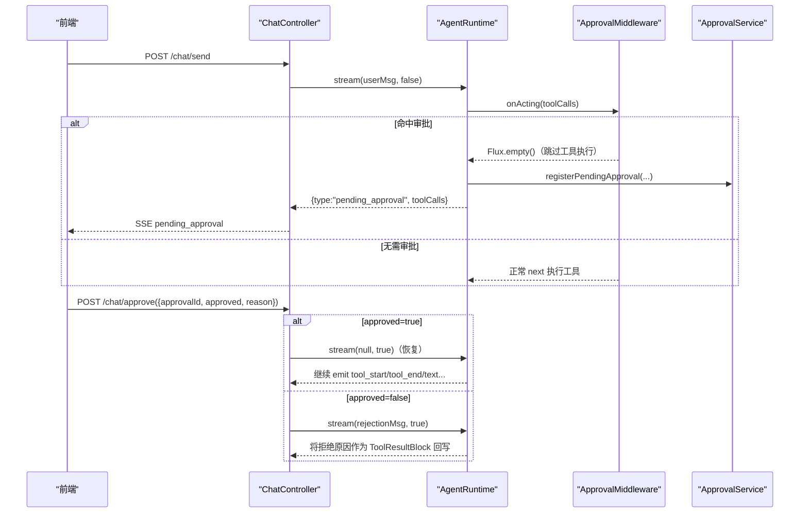
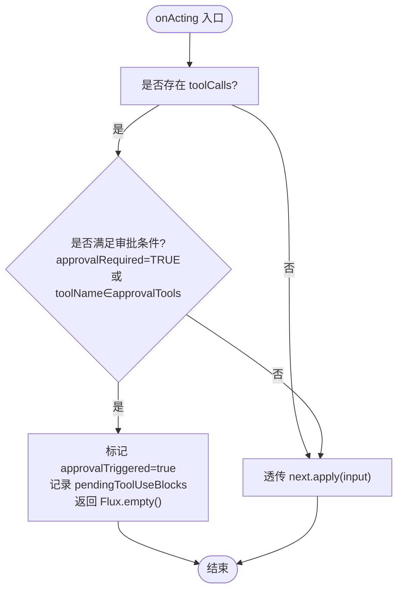
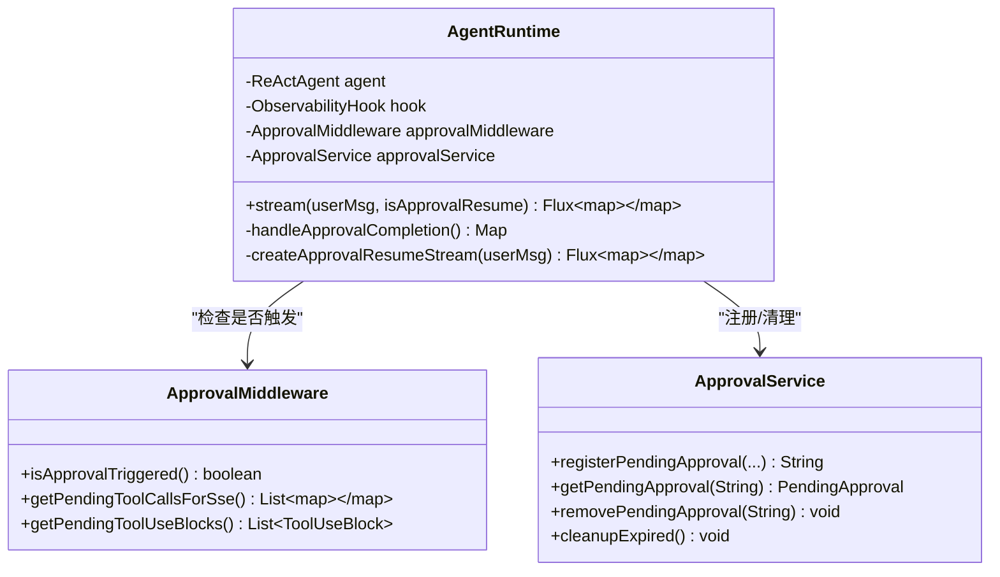
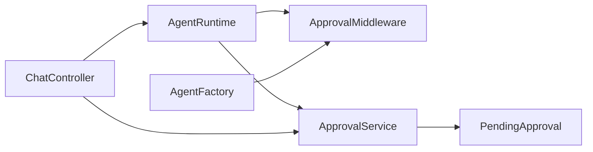
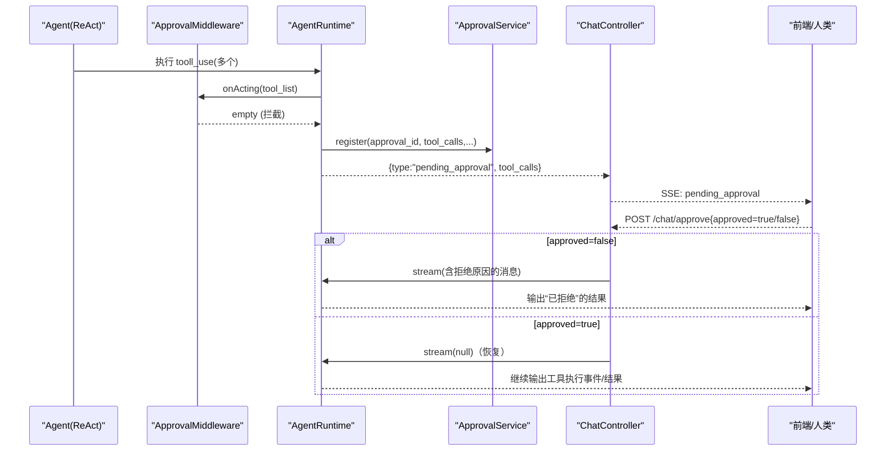

# 审批中间件

<cite>
**本文引用的文件**
- [ApprovalMiddleware.java](file://src/main/java/com/skloda/agentscope/middleware/ApprovalMiddleware.java)
- [ApprovalService.java](file://src/main/java/com/skloda/agentscope/service/ApprovalService.java)
- [PendingApproval.java](file://src/main/java/com/skloda/agentscope/model/PendingApproval.java)
- [ApprovalRequest.java](file://src/main/java/com/skloda/agentscope/model/ApprovalRequest.java)
- [AgentRuntime.java](file://src/main/java/com/skloda/agentscope/runtime/AgentRuntime.java)
- [ChatController.java](file://src/main/java/com/skloda/agentscope/controller/ChatController.java)
- [AgentConfig.java](file://src/main/java/com/skloda/agentscope/agent/AgentConfig.java)
- [AgentFactory.java](file://src/main/java/com/skloda/agentscope/agent/AgentFactory.java)
- [AgentRuntimeFactory.java](file://src/main/java/com/skloda/agentscope/runtime/AgentRuntimeFactory.java)
- [agents.yml](file://src/main/resources/config/agents.yml)
- [ApprovalMiddlewareTest.java](file://src/test/java/com/skloda/agentscope/middleware/ApprovalMiddlewareTest.java)
- [ApprovalServiceTest.java](file://src/test/java/com/skloda/agentscope/service/ApprovalServiceTest.java)
</cite>

## 目录
1. [简介](#简介)
2. [项目结构](#项目结构)
3. [核心组件](#核心组件)
4. [架构总览](#架构总览)
5. [详细组件分析](#详细组件分析)
6. [依赖关系分析](#依赖关系分析)
7. [性能考虑](#性能考虑)
8. [故障处理与最佳实践](#故障处理与最佳实践)
9. [结论](#结论)
10. [附录：端到端工作流示例](#附录端到端工作流示例)

## 简介
本文件深入说明 AgentScope 2.0 中的“审批中间件”能力，即 Human-in-the-Loop（HITL）机制在工具调用时的拦截与恢复。该实现以 MiddlewareBase 的 onActing 阶段为核心拦截点，结合运行时代码在 agent 事件流结束后发出 pending_approval SSE 事件、由前端触发审批接口，再选择拒绝或批准并恢复 agent 执行。支持 agent 级与 tool 级两种审批配置，并使用内存缓存管理 PendingApproval 的短时状态与超时清理。

## 项目结构
与审批相关的代码分布在以下包中：
- middleware：拦截逻辑
- runtime：运行态组装、事件流合并、完成时判断是否进入 HITL、以及恢复执行的 resume 路径
- model：待审批对象与 HTTP 请求体模型
- service：审批缓存与服务方法
- controller：SSE 流式 API（发送消息与审批回调）
- agent 与 runtime factory：将中间件装配到 agent
- resources：按 agentId 配置启用特定工具审批

```mermaid
graph TB
    A["前端<br/>chat.js / agui"] --> C["ChatController<br/>/chat/send 与 /chat/approve"]
    C --> D["AgentRuntime<br/>stream() + handleApprovalCompletion"]
    D --> E["ApprovalMiddleware<br/>onActing 拦截"]
    D --> F["ApprovalService<br/>注册/清理/查询 PendingApproval"]
    E -->|返回空流跳过工具执行| D
    D -->|产生 pending_approval SSE| C
    A -->|用户决策 POST /chat/approve| C
    C -->|拒绝: 注入 ToolResultBlock| D
    C -->|批准: 重新 stream(null)| D
```

图表来源
- [AgentRuntime.java:68-183](file://src/main/java/com/skloda/agentscope/runtime/AgentRuntime.java#L68-L183)
- [ApprovalMiddleware.java:58-77](file://src/main/java/com/skloda/agentscope/middleware/ApprovalMiddleware.java#L58-L77)
- [ApprovalService.java:21-76](file://src/main/java/com/skloda/agentscope/service/ApprovalService.java#L21-L76)
- [ChatController.java:155-186](file://src/main/java/com/skloda/agentscope/controller/ChatController.java#L155-L186)

小节来源
- [ApprovalMiddleware.java:22-77](file://src/main/java/com/skloda/agentscope/middleware/ApprovalMiddleware.java#L22-L77)
- [AgentRuntime.java:68-183](file://src/main/java/com/skloda/agentscope/runtime/AgentRuntime.java#L68-L183)
- [ChatController.java:122-186](file://src/main/java/com/skloda/agentscope/controller/ChatController.java#L122-L186)

## 核心组件
- ApprovalMiddleware：基于 MiddlewareBase 的 onActing 钩子，拦截工具调用列表，若命中则置位 approvalTriggered、记录 pendingToolUseBlocks，并返回空流，跳过实际工具执行。
- AgentRuntime：封装 ReActAgent 的事件流，完成时检查是否触发了审批；若触发则产出 pending_approval 事件并调用服务注册；恢复执行时通过 createApprovalResumeStream 继续原生命周期事件输出。
- ApprovalService：使用线程安全的并发 Map 缓存 PendingApproval，提供注册、查询、删除和定时清理超时会话的方法。
- PendingApproval：不可变值对象，保存审批上下文（agent、hook、会话、等待的工具调用集合等）。
- ApprovalRequest：HTTP 请求体，承载审批决定（同意/拒绝）及可选原因与修改参数。
- ChatController：/chat/send 暴露主流程，/chat/approve 暴露审批回调；拒绝时构造 ToolResultBlock 写入代理会话，同意后恢复 agent 执行。

小节来源
- [ApprovalMiddleware.java:42-124](file://src/main/java/com/skloda/agentscope/middleware/ApprovalMiddleware.java#L42-L124)
- [AgentRuntime.java:68-183](file://src/main/java/com/skloda/agentscope/runtime/AgentRuntime.java#L68-L183)
- [ApprovalService.java:17-76](file://src/main/java/com/skloda/agentscope/service/ApprovalService.java#L17-L76)
- [PendingApproval.java:13-39](file://src/main/java/com/skloda/agentscope/model/PendingApproval.java#L13-L39)
- [ApprovalRequest.java:8-20](file://src/main/java/com/skloda/agentscope/model/ApprovalRequest.java#L8-L20)
- [ChatController.java:122-199](file://src/main/java/com/skloda/agentscope/controller/ChatController.java#L122-L199)

## 架构总览
审批的关键在于将“工具调用的执行权从 Agent 自动执行转移到人类确认”，并在确认后安全恢复。其关键步骤如下：
- 当 agent 进入 acting 阶段且存在 ToolUseBlock 时，ApprovalMiddleware 依据配置决定是否拦截。
- 若拦截，AgentRuntime 在最终拼接完成事件处检测标记，产出 pending_approval SSE，并将待审工具调用序列化后下发前端。
- 前端收到 pending_approval 后展示 UI，用户点击审批或拒绝。
- ChatController 收到 /chat/approve 请求：
  - 拒绝：构造包含拒绝原因的 ToolResultBlock 作为结果消息发送给 agent，使其在原有会话上下文中生成“工具被拒绝”的输出。
  - 批准：直接 resume agent 的执行，借助 AgentScope 的“挂起工具恢复”机制继续执行之前的工具链。



图表来源
- [AgentRuntime.java:68-183](file://src/main/java/com/skloda/agentscope/runtime/AgentRuntime.java#L68-L183)
- [ApprovalMiddleware.java:58-77](file://src/main/java/com/skloda/agentscope/middleware/ApprovalMiddleware.java#L58-L77)
- [ChatController.java:155-186](file://src/main/java/com/skloda/agentscope/controller/ChatController.java#L155-L186)
- [ApprovalService.java:21-46](file://src/main/java/com/skloda/agentscope/service/ApprovalService.java#L21-L46)

## 详细组件分析

### ApprovalMiddleware：工具调用拦截器
- 拦截阶段：onActing。该阶段能拿到即将调用的工具调用列表（ToolUseBlock）。
- 触发条件：
  - agent 级别：approvalRequired = true 时，任何工具调用都触发审批。
  - tool 级别：当 tool name 在 approvalTools 列表中时触发。
- 行为：
  - 若需要审批：设置内部标志 approvalTriggered、记录 pendingToolUseBlocks，并返回空流以避免工具执行。
  - 否则：透传至下一步继续执行工具。
- 对外查询：
  - isApprovalTriggered()：供运行时判定是否进入 pending_approval 分支。
  - getPendingToolUseBlocks()/getPendingToolCallsForSse()：暴露给运行时与控制器进行序列化显示。



图表来源
- [ApprovalMiddleware.java:58-77](file://src/main/java/com/skloda/agentscope/middleware/ApprovalMiddleware.java#L58-L77)

小节来源
- [ApprovalMiddleware.java:22-77](file://src/main/java/com/skloda/agentscope/middleware/ApprovalMiddleware.java#L22-L77)
- [ApprovalMiddleware.java:103-124](file://src/main/java/com/skloda/agentscope/middleware/ApprovalMiddleware.java#L103-L124)
- [ApprovalMiddlewareTest.java:16-151](file://src/test/java/com/skloda/agentscope/middleware/ApprovalMiddlewareTest.java#L16-L151)

### PendingApproval：审批状态对象
- 作用：承载一次暂停的审批任务所需的完整信息，包括 agent、hook、sessionId、agentId、等待的工具调用集合、创建时间等。
- 辅助方法：getToolCallsForDisplay() 为展示层提供结构化输入数据。

小节来源
- [PendingApproval.java:13-39](file://src/main/java/com/skloda/agentscope/model/PendingApproval.java#L13-L39)

### ApprovalService：内存缓存与过期清理
- 缓存策略：ConcurrentHashMap<String, PendingApproval> 作为进程内内存缓存，key 为 approvalId。
- 生命周期：
  - 注册：registerPendingApproval 生成 16 位短 approvalId，写入缓存并记录日志。
  - 读取/删除：查询或移除时使用原子操作保证并发安全。
  - 清理：@Scheduled(fixedRate = 60000) 每分钟扫描，超过 5 分钟未处理的条目将被清理，防止内存泄漏。
- 性能考量：单次清理遍历一次 Map，符合 O(n) 复杂度；适合演示场景。

小节来源
- [ApprovalService.java:17-76](file://src/main/java/com/skloda/agentscope/service/ApprovalService.java#L17-L76)
- [ApprovalServiceTest.java:37-137](file://src/test/java/com/skloda/agentscope/service/ApprovalServiceTest.java#L37-L137)

### AgentRuntime：事件流控制与审批衔接
- 流式处理：接收 userMsg，合并 EventSink 与 agent.streamEvents，并在 doFinally 里完成 EventSink，避免流悬挂问题。
- 完成阶段：如果检测到 ApprovalMiddleware.isApprovalTriggered()，则：
  - 调用 ApprovalService.registerPendingApproval(...) 生成审批 ID；
  - 返回 type="pending_approval" 事件携带 toolCalls，交由控制器封装为 SSE。
- 恢复执行：createApprovalResumeStream 用于恢复模式：
  - 同意：传入空消息列表，依靠 AgentScope 的“挂起工具恢复”继续原先工具链；
  - 拒绝：传入包含拒绝原因的 ToolResultBlock，让 agent 在前文生成拒绝提示。
- 上下文清理：非恢复模式下会在开始流之前清理“残留挂起工具调用”的上下文，避免重复错误输出。



图表来源
- [AgentRuntime.java:31-183](file://src/main/java/com/skloda/agentscope/runtime/AgentRuntime.java#L31-L183)
- [ApprovalMiddleware.java:103-124](file://src/main/java/com/skloda/agentscope/middleware/ApprovalMiddleware.java#L103-L124)
- [ApprovalService.java:17-76](file://src/main/java/com/skloda/agentscope/service/ApprovalService.java#L17-L76)

小节来源
- [AgentRuntime.java:68-183](file://src/main/java/com/skloda/agentscope/runtime/AgentRuntime.java#L68-L183)

### ChatController：SSE 入口与审批回调
- /chat/send：转发给 AgentService/AgentRuntime 获取流；遇到 error 或完成则输出相应事件。
- /chat/approve：根据审批决定执行两条路径：
  - 拒绝：构造 ToolResultBlock 消息（内含拒绝原因），以 rejections 方式写入 agent 上下文；
  - 同意：resume 执行，使 agent 继续完成之前的工具链路。

小节来源
- [ChatController.java:122-199](file://src/main/java/com/skloda/agentscope/controller/ChatController.java#L122-L199)

### 配置体系：agent 级与 tool 级审批
- AgentConfig 字段：
  - approvalRequired：是否为所有工具启用全局审批。
  - approvalTools：指定哪些工具名称需要审批。
- 装配过程：
  - AgentRuntimeFactory 在创建各类运行时前，依据 AgentConfig 构建 ApprovalMiddleware，并注入 AgentFactory/CompositeAgentFactory。
  - AgentFactory 在构建 ReActAgent 时将中间件注册到 agent。

小节来源
- [AgentConfig.java:49-50](file://src/main/java/com/skloda/agentscope/agent/AgentConfig.java#L49-L50)
- [AgentRuntimeFactory.java:187-308](file://src/main/java/com/skloda/agentscope/runtime/AgentRuntimeFactory.java#L187-L308)
- [AgentFactory.java:186-209](file://src/main/java/com/skloda/agentscope/agent/AgentFactory.java#L186-L209)
- [agents.yml:150-165](file://src/main/resources/config/agents.yml#L150-L165)

## 依赖关系分析
- 低耦合：ApprovalMiddleware 只关注工具调用前的决策，不依赖存储实现；存储抽象由 ApprovalService 承担。
- 运行时整合：AgentRuntime 负责编排事件流与审批衔接；不直接持久化审批上下文，委托服务层处理。
- 控制器集成：ChatController 仅关注 SSE 协议与业务路径分支，不涉及具体拦截细节。



图表来源
- [AgentRuntime.java:31-183](file://src/main/java/com/skloda/agentscope/runtime/AgentRuntime.java#L31-L183)
- [ApprovalService.java:17-76](file://src/main/java/com/skloda/agentscope/service/ApprovalService.java#L17-L76)
- [AgentFactory.java:186-209](file://src/main/java/com/skloda/agentscope/agent/AgentFactory.java#L186-L209)

小节来源
- [AgentRuntime.java:31-183](file://src/main/java/com/skloda/agentscope/runtime/AgentRuntime.java#L31-L183)
- [ApprovalService.java:17-76](file://src/main/java/com/skloda/agentscope/service/ApprovalService.java#L17-L76)
- [AgentFactory.java:186-209](file://src/main/java/com/skloda/agentscope/agent/AgentFactory.java#L186-L209)

## 性能考虑
- 中间件开销极低：仅在 onActing 阶段进行一次工具列表的过滤判断与布尔计算，时间复杂度近似 O(m)，m 为工具调用数量。
- 缓存占用可控：PendingApproval 使用内存 Map，默认 5 分钟自动清理，避免长期驻留。
- 流式恢复优势：恢复执行通过原始 event stream 保持细粒度事件输出，避免一次性同步阻塞对体验的影响。
- 建议优化：
  - 在大规模并发下可考虑将内存缓存替换为带 TTL 的分布式缓存（如 Redis），提升多实例一致性。
  - 对高频工具可以评估是否放宽审批范围，减少 HITL 频率。

## 故障处理与最佳实践
- 超时清理：ApprovalService 每分钟定时清理超过 5 分钟的待审批项，避免脏数据堆积。（见清理方法）
- 流关闭与资源释放：AgentRuntime 在 finally 中确保 EventSink 完成，防止前端“只能聊一次”的问题。
- 拒绝路径稳健性：拒绝时明确写入 ToolResultBlock 并附带原因，便于前后端理解失败语义。
- 上下文完整性：启动新请求前先清理历史中可能残留的挂起工具消息，避免重复错误提示。
- 配置治理：
  - 谨慎开启 approvalRequired，以免对所有工具调用均造成阻断。
  - 推荐最小权限原则：仅将高风险工具名放入 approvalTools。

小节来源
- [ApprovalService.java:59-76](file://src/main/java/com/skloda/agentscope/service/ApprovalService.java#L59-L76)
- [AgentRuntime.java:90-92](file://src/main/java/com/skloda/agentscope/runtime/AgentRuntime.java#L90-L92)
- [AgentRuntime.java:125-141](file://src/main/java/com/skloda/agentscope/runtime/AgentRuntime.java#L125-L141)
- [ChatController.java:192-199](file://src/main/java/com/skloda/agentscope/controller/ChatController.java#L192-L199)

## 结论
审批中间件以轻量、高内聚的方式实现了 HITL 的核心诉求：在关键时刻暂停工具执行、将控制权交给人类，并在批准后无缝恢复。整体实现清晰分离了拦截、状态管理与恢复三个环节，并通过 SSE 流式交互保证了良好的用户体验。对于生产环境，建议在内存缓存之上增加分布式一致性与更灵活的过期策略，进一步降低单点限制并提升弹性。

## 附录：端到端工作流示例
- 审批请求注册：AgentRuntime 在事件流完成后检测是否需要审批，调用 ApprovalService 注册 PendingApproval，并向客户端推送 pending_approval。
- 前端展示：前端收到 pending_approval 事件后弹出审批面板，渲染工具名称与参数。
- 用户决策：用户在界面中选择“批准”或“拒绝”。
- 恢复执行：
  - 批准：后端通过 AgentRuntime.resume（传入空消息）恢复，AgentScope 将利用“挂起工具恢复”继续执行之前的工具。
  - 拒绝：后端构造包含拒绝原因的 ToolResultBlock，注入到 agent 会话中，输出拒绝结果并结束本次流程。



[本节为概念性工作流示意，不直接对应具体源码行]

小节来源
- [AgentRuntime.java:128-183](file://src/main/java/com/skloda/agentscope/runtime/AgentRuntime.java#L128-L183)
- [ChatController.java:155-186](file://src/main/java/com/skloda/agentscope/controller/ChatController.java#L155-L186)
- [ApprovalService.java:29-46](file://src/main/java/com/skloda/agentscope/service/ApprovalService.java#L29-L46)