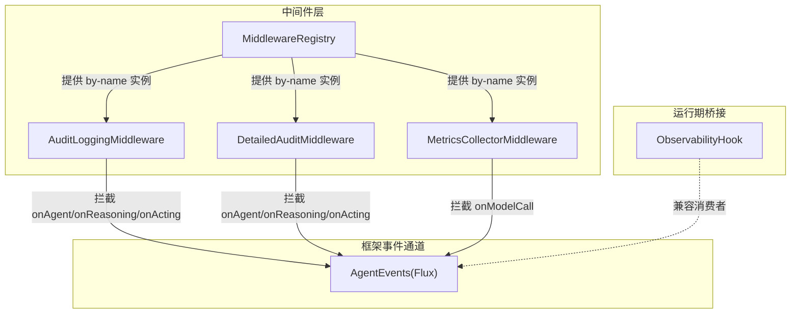
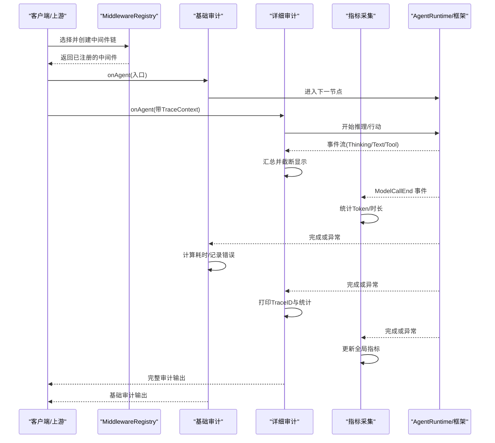
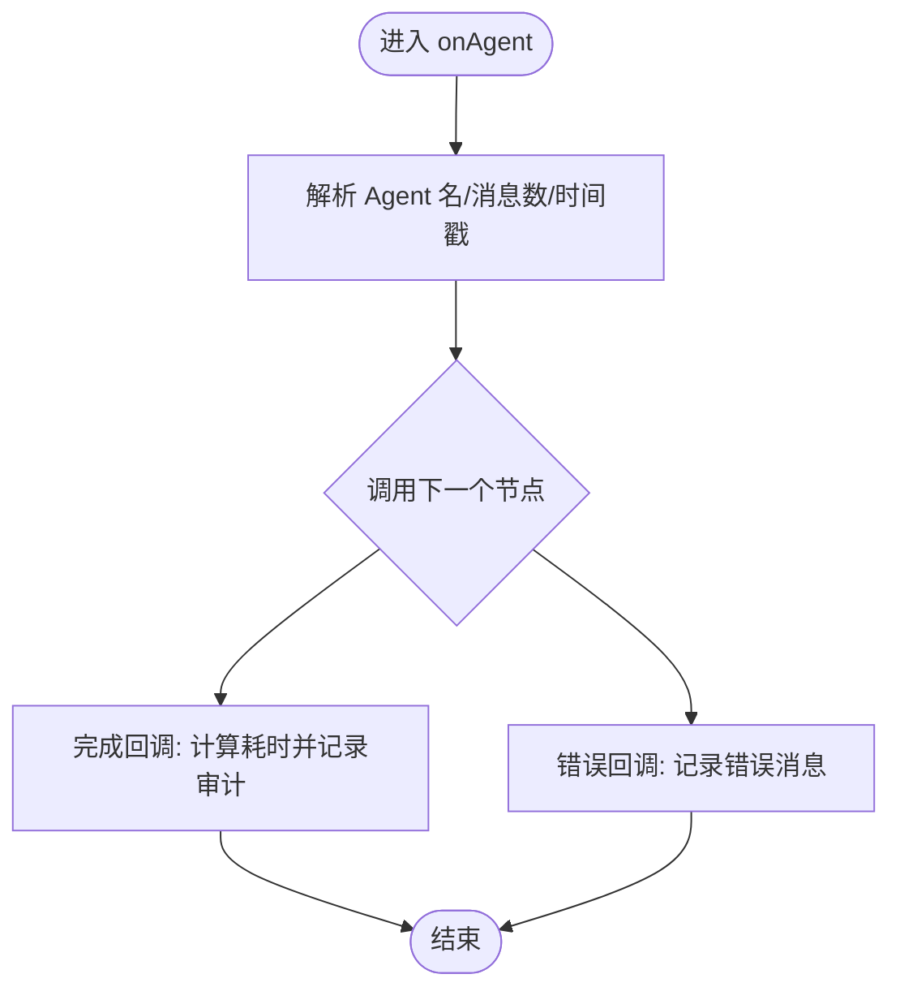
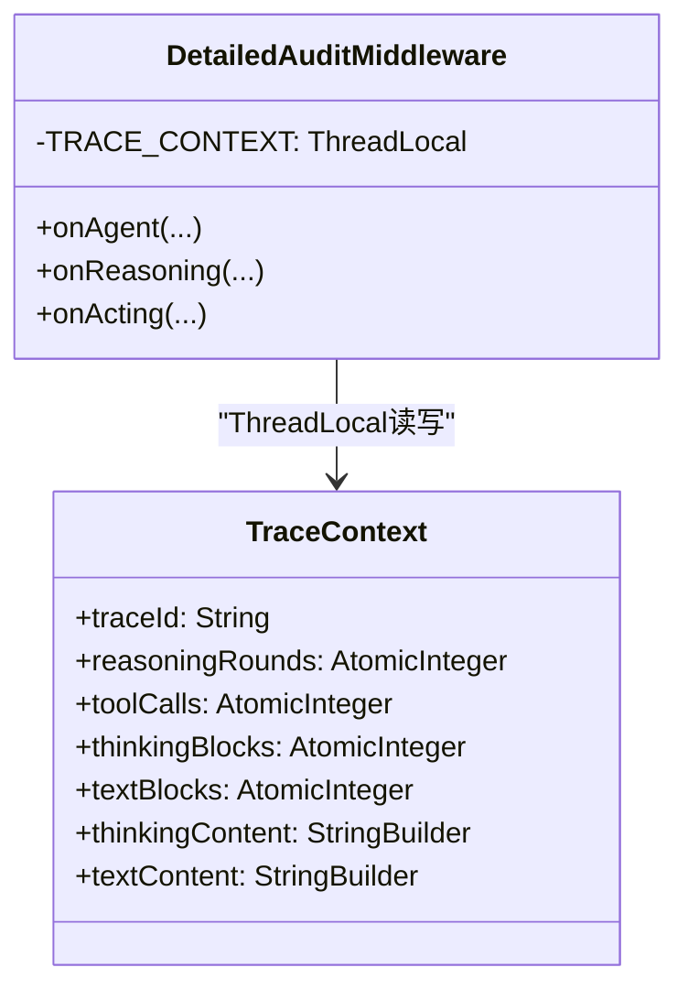
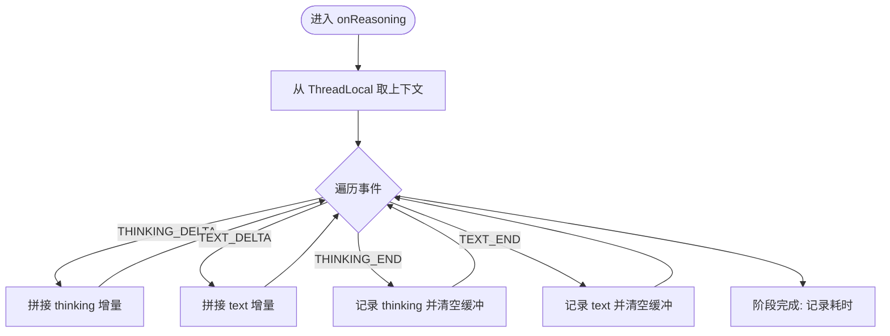
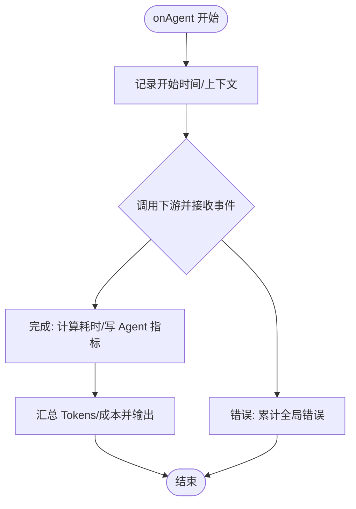
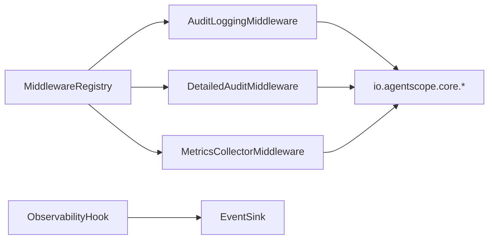

# 审计日志中间件

<cite>
**本文引用的文件**
- [AuditLoggingMiddleware.java](file://src/main/java/com/skloda/agentscope/middleware/AuditLoggingMiddleware.java)
- [DetailedAuditMiddleware.java](file://src/main/java/com/skloda/agentscope/middleware/DetailedAuditMiddleware.java)
- [MetricsCollectorMiddleware.java](file://src/main/java/com/skloda/agentscope/middleware/MetricsCollectorMiddleware.java)
- [MiddlewareRegistry.java](file://src/main/java/com/skloda/agentscope/middleware/MiddlewareRegistry.java)
- [ObservabilityHook.java](file://src/main/java/com/skloda/agentscope/hook/ObservabilityHook.java)
- [application.yml](file://src/main/resources/application.yml)
- [audit-test: AuditLoggingMiddlewareTest.java](file://src/test/java/com/skloda/agentscope/middleware/AuditLoggingMiddlewareTest.java)
- [middleware-registry-test: MiddlewareRegistryTest.java](file://src/test/java/com/skloda/agentscope/middleware/MiddlewareRegistryTest.java)
</cite>

## 目录
1. [简介](#简介)
2. [项目结构](#项目结构)
3. [核心组件](#核心组件)
4. [架构总览](#架构总览)
5. [详细组件分析](#详细组件分析)
6. [依赖关系分析](#依赖关系分析)
7. [性能考量](#性能考量)
8. [故障排查指南](#故障排查指南)
9. [结论](#结论)
10. [附录](#附录)

## 简介
本文件面向企业级 Agent 运行时，系统性地梳理与沉淀审计日志中间件的实现与实践方案。内容覆盖两类审计模式（Basic Audit Logging、Detailed Audit Logging），并围绕 Agent 生命周期追踪、推理过程监控、工具调用审计的全链路记录展开；同时说明各阶段钩子函数（onAgent、onReasoning、onActing）的触发时机与控制要点、性能计时机制、错误捕获与异常上报，以及日志格式标准化策略。文末提供日志聚合与分析最佳实践、告警规则建议、合规性审计要点，以及在企业部署环境下的日志轮转、安全脱敏、存储优化等运维注意事项。

## 项目结构
本项目在 Java 模块中使用 AgentScope 框架的通用 Middleware 接口，以插拔式中间件方式接入观测能力。审计日志相关代码集中于 middleware 包，并通过注册表统一管理；运行时事件桥接通过 hook 包暴露给上层消费。

- 审计中间件：基础与详细两套实现
  - 基础审计：轻量、标准输出、错误捕获
  - 详细审计：细粒度事件切片、流式内容收集、跟踪上下文
- 指标采集：独立中间件用于性能与成本统计
- 中间件注册：统一按名称创建与组合
- 运行期事件：与 SSE 事件管道打通的前置桥接

图表来源
- [MiddlewareRegistry.java:12-55](file://src/main/java/com/skloda/agentscope/middleware/MiddlewareRegistry.java#L12-L55)
- [AuditLoggingMiddleware.java:15-67](file://src/main/java/com/skloda/agentscope/middleware/AuditLoggingMiddleware.java#L15-L67)
- [DetailedAuditMiddleware.java:38-202](file://src/main/java/com/skloda/agentscope/middleware/DetailedAuditMiddleware.java#L38-L202)
- [MetricsCollectorMiddleware.java:31-204](file://src/main/java/com/skloda/agentscope/middleware/MetricsCollectorMiddleware.java#L31-L204)
- [ObservabilityHook.java:16-67](file://src/main/java/com/skloda/agentscope/hook/ObservabilityHook.java#L16-L67)

章节来源
- [MiddlewareRegistry.java:12-55](file://src/main/java/com/skloda/agentscope/middleware/MiddlewareRegistry.java#L12-L55)

## 核心组件
- 基础审计日志中间件（Basic Audit Logging）
  - 作用：在 Agent 生命周期的关键阶段打印审计信息，包括开始、完成、错误；对 Reasoning 阶段计数；对 Tool 调用参数进行预览记录；使用纳秒级耗时计算输出耗时。
  - 钩子点：onAgent、onReasoning、onActing
  - 关键点：统一采用结构化前缀标识日志级别与来源；错误路径不阻断正常事件流。

- 详细审计日志中间件（Detailed Audit Logging）
  - 作用：提供更细粒度的可观测能力，包含执行链 TraceID、逐阶段统计、Thinking/Text 内容的增量汇聚与截断显示、模型信息与可用工具数量、错误详情栈打印。
  - 线程上下文：使用 ThreadLocal 保存 TraceContext，贯穿一次请求的全链路。
  - 钩子点：onAgent、onReasoning、onActing（并配合事件类型判断收集 Thinking/Text）。

- 指标采集中间件（MetricsCollectorMiddleware）
  - 作用：集中收集 Agent/Tool 性能指标、Token 用量、估算成本、错误率；适合接入外部监控系统。
  - 钩子点：onAgent、onReasoning、onActing、onModelCall（读取 ModelCallEndEvent 中的 Token 使用量）。

- 中间件注册表（MiddlewareRegistry）
  - 作用：以字符串名称到工厂方法的方式管理所有内置及自定义中间件，支持扩展与按需启用。
  - 典型名称：audit-logging、detailed-audit、metrics-collector 等。

- 运行期事件桥接（ObservabilityHook）
  - 作用：将旧版 Hook 消费者迁移至基于 EventSink 的统一事件渠道；虽然不属于审计日志本身，但常用于串联前端调试与多 Agent 事件，便于关联审计轨迹。

章节来源
- [AuditLoggingMiddleware.java:15-67](file://src/main/java/com/skloda/agentscope/middleware/AuditLoggingMiddleware.java#L15-L67)
- [DetailedAuditMiddleware.java:28-202](file://src/main/java/com/skloda/agentscope/middleware/DetailedAuditMiddleware.java#L28-L202)
- [MetricsCollectorMiddleware.java:21-204](file://src/main/java/com/skloda/agentscope/middleware/MetricsCollectorMiddleware.java#L21-L204)
- [MiddlewareRegistry.java:12-55](file://src/main/java/com/skloda/agentscope/middleware/MiddlewareRegistry.java#L12-L55)
- [ObservabilityHook.java:16-67](file://src/main/java/com/skloda/agentscope/hook/ObservabilityHook.java#L16-L67)

## 架构总览
以下序列图展示一次 Agent 调用的完整审计与观测管线，涵盖三个关键阶段的钩子处理，以及详细审计的上下文传递。

图表来源
- [MiddlewareRegistry.java:12-55](file://src/main/java/com/skloda/agentscope/middleware/MiddlewareRegistry.java#L12-L55)
- [AuditLoggingMiddleware.java:15-67](file://src/main/java/com/skloda/agentscope/middleware/AuditLoggingMiddleware.java#L15-L67)
- [DetailedAuditMiddleware.java:45-108](file://src/main/java/com/skloda/agentscope/middleware/DetailedAuditMiddleware.java#L45-L108)
- [DetailedAuditMiddleware.java:110-179](file://src/main/java/com/skloda/agentscope/middleware/DetailedAuditMiddleware.java#L110-L179)
- [DetailedAuditMiddleware.java:181-202](file://src/main/java/com/skloda/agentscope/middleware/DetailedAuditMiddleware.java#L181-L202)
- [MetricsCollectorMiddleware.java:50-91](file://src/main/java/com/skloda/agentscope/middleware/MetricsCollectorMiddleware.java#L50-L91)
- [MetricsCollectorMiddleware.java:93-142](file://src/main/java/com/skloda/agentscope/middleware/MetricsCollectorMiddleware.java#L93-L142)
- [MetricsCollectorMiddleware.java:144-162](file://src/main/java/com/skloda/agentscope/middleware/MetricsCollectorMiddleware.java#L144-L162)

## 详细组件分析

### 基础审计日志（Basic Audit Logging）
- 设计要点
  - 入口与出口：onAgent 记录起止时间与成功/失败标记。
  - 推理阶段：onReasoning 记录输入消息数量与阶段耗时。
  - 工具调用：onActing 枚举工具调用，并截断过长参数避免日志过大。
  - 错误处理：doOnError 仅记录错误消息，不影响下游处理。

- 时序流程

图表来源
- [AuditLoggingMiddleware.java:19-35](file://src/main/java/com/skloda/agentscope/middleware/AuditLoggingMiddleware.java#L19-L35)

- 复杂度与开销
  - 时间：每阶段常量操作，I/O 为日志写入，开销低。
  - 空间：无额外持久化结构。

章节来源
- [AuditLoggingMiddleware.java:19-35](file://src/main/java/com/skloda/agentscope/middleware/AuditLoggingMiddleware.java#L19-L35)
- [AuditLoggingMiddleware.java:37-67](file://src/main/java/com/skloda/agentscope/middleware/AuditLoggingMiddleware.java#L37-L67)

### 详细审计日志（Detailed Audit Logging）
- 设计要点
  - 跟踪上下文：使用 ThreadLocal 维护 TraceID、各阶段计数与内容缓存。
  - 推理阶段：累计 Think/Text 增量块，设置上限截断，记录模型名与工具可用性。
  - 工具调用：记录调用 ID、参数摘要；支持格式化键值参数。
  - 错误处理：打印完整异常栈，标记 Success=false。

- 数据流与上下文传递

图表来源
- [DetailedAuditMiddleware.java:40-57](file://src/main/java/com/skloda/agentscope/middleware/DetailedAuditMiddleware.java#L40-L57)
- [DetailedAuditMiddleware.java:57-108](file://src/main/java/com/skloda/agentscope/middleware/DetailedAuditMiddleware.java#L57-L108)
- [DetailedAuditMiddleware.java:110-179](file://src/main/java/com/skloda/agentscope/middleware/DetailedAuditMiddleware.java#L110-L179)
- [DetailedAuditMiddleware.java:181-202](file://src/main/java/com/skloda/agentscope/middleware/DetailedAuditMiddleware.java#L181-L202)

- 事件过滤与拼装逻辑

图表来源
- [DetailedAuditMiddleware.java:110-179](file://src/main/java/com/skloda/agentscope/middleware/DetailedAuditMiddleware.java#L110-L179)

- 复杂度与开销
  - 时间：事件流上的增量拼接与字符串裁剪；总体线性于事件数。
  - 空间：StringBuilder 累积单轮思考/文本长度，存在可控的上限。

章节来源
- [DetailedAuditMiddleware.java:28-202](file://src/main/java/com/skloda/agentscope/middleware/DetailedAuditMiddleware.java#L28-L202)

### 指标采集（MetricsCollectorMiddleware）
- 设计要点
  - Agent 级：调用次数、总耗时、最小/最大耗时统计。
  - Tool 级：单次工具调用耗时、错误计数、调用次数统计。
  - Model Call：消费 ModelCallEndEvent 中的 usage 获取 token 总量，结合固定单价估算成本。
  - 全局：进程内原子计数器汇总总体调用次数、Token 总数、错误数。

- 流程图

图表来源
- [MetricsCollectorMiddleware.java:50-91](file://src/main/java/com/skloda/agentscope/middleware/MetricsCollectorMiddleware.java#L50-L91)
- [MetricsCollectorMiddleware.java:144-162](file://src/main/java/com/skloda/agentscope/middleware/MetricsCollectorMiddleware.java#L144-L162)
- [MetricsCollectorMiddleware.java:164-204](file://src/main/java/com/skloda/agentscope/middleware/MetricsCollectorMiddleware.java#L164-L204)

- 复杂度与开销
  - 时间：每个事件 O(1)，聚合统计为线程安全 CAS。
  - 空间：静态 Map+AtomicLong 常驻内存。

章节来源
- [MetricsCollectorMiddleware.java:21-204](file://src/main/java/com/skloda/agentscope/middleware/MetricsCollectorMiddleware.java#L21-L204)

### 中间件注册与装配
- 以名称映射到工厂，启动时自动注册常见中间件。
- 对外提供 create(name) 获取实例，便于配置驱动加载。

章节来源
- [MiddlewareRegistry.java:12-55](file://src/main/java/com/skloda/agentscope/middleware/MiddlewareRegistry.java#L12-L55)
- [middleware-registry-test: MiddlewareRegistryTest.java:17-52](file://src/test/java/com/skloda/agentscope/middleware/MiddlewareRegistryTest.java#L17-L52)

### 运行期事件桥接
- 通过 ObservabilityHook 向 EventSink 发射多 Agent 协作事件（流水线、路由、循环等），与审计日志共同构成可观测体系。

章节来源
- [ObservabilityHook.java:16-67](file://src/main/java/com/skloda/agentscope/hook/ObservabilityHook.java#L16-L67)

## 依赖关系分析
- 直接依赖
  - AgentScope Core：事件类型、中间件接口、消息与工具块等
  - Reactor Flux：非阻塞事件流处理
  - SLF4J：日志输出
- 内部依赖
  - MiddlewareRegistry：中间件命名注册中心
  - ObservabilityHook：与前端/SSE 事件消费方耦合较弱，属于横向补充

图表来源
- [AuditLoggingMiddleware.java:1-13](file://src/main/java/com/skloda/agentscope/middleware/AuditLoggingMiddleware.java#L1-L13)
- [DetailedAuditMiddleware.java:1-27](file://src/main/java/com/skloda/agentscope/middleware/DetailedAuditMiddleware.java#L1-L27)
- [MetricsCollectorMiddleware.java:1-20](file://src/main/java/com/skloda/agentscope/middleware/MetricsCollectorMiddleware.java#L1-L20)
- [MiddlewareRegistry.java:1-12](file://src/main/java/com/skloda/agentscope/middleware/MiddlewareRegistry.java#L1-L12)
- [ObservabilityHook.java:1-15](file://src/main/java/com/skloda/agentscope/hook/ObservabilityHook.java#L1-L15)

章节来源
- [AuditLoggingMiddleware.java:1-13](file://src/main/java/com/skloda/agentscope/middleware/AuditLoggingMiddleware.java#L1-L13)
- [DetailedAuditMiddleware.java:1-27](file://src/main/java/com/skloda/agentscope/middleware/DetailedAuditMiddleware.java#L1-L27)
- [MetricsCollectorMiddleware.java:1-20](file://src/main/java/com/skloda/agentscope/middleware/MetricsCollectorMiddleware.java#L1-L20)

## 性能考量
- 计时精度
  - 均使用 System.nanoTime() 计算毫秒级耗时，避免系统时钟漂移影响。
- I/O 压力
  - 基础审计只记录必要元数据；详细审计对长字段进行截断控制，防止日志膨胀。
  - 指标中间件聚合统计，仅在关键节点落盘或输出。
- 线程安全
  - 指标统计使用 AtomicInteger/AtomicLong 并发原子更新；详细审计使用 ThreadLocal 隔离每请求上下文。
- 建议
  - 高吞吐场景下优先开启基础审计，仅在需要时切换详细审计。
  - 合理控制日志滚动阈值与保留周期；考虑异步日志后端以提升吞吐。

[本节未直接分析具体文件]

## 故障排查指南
- 常见现象
  - 无审计输出：检查是否注册了对应中间件，是否被上游过滤或未生效。
  - 审计信息缺失：确认 onReasoning/onActing 钩子未被其他中间件短路。
  - 性能抖动：详细审计可能因大量流式事件拼接带来额外 CPU/内存消耗。
- 定位步骤
  - 核对中间件注册名与实际使用的名称一致。
  - 查看日志输出中是否存在错误堆栈，快速定位失败阶段。
  - 若需更深层分析，切换到详细审计并观察 Thinking/Text 与 Tool 调用链。
- 参考用例
  - 单元测试验证了 onAgent/onReasoning/onActing 的正常转发行为。

章节来源
- [AuditLoggingMiddlewareTest.java:28-74](file://src/test/java/com/skloda/agentscope/middleware/AuditLoggingMiddlewareTest.java#L28-L74)
- [AuditLoggingMiddleware.java:19-67](file://src/main/java/com/skloda/agentscope/middleware/AuditLoggingMiddleware.java#L19-L67)
- [DetailedAuditMiddleware.java:87-107](file://src/main/java/com/skloda/agentscope/middleware/DetailedAuditMiddleware.java#L87-L107)

## 结论
本项目提供了两套互补的审计中间件：基础审计满足常规审计需求，详细审计为复杂业务场景提供深度可观测能力；辅以独立的指标采集中间件形成完整的观测闭环。通过统一的中间件注册表进行装配与扩展，结合事件流处理实现了高吞吐、低侵入的可观测基础设施。生产环境可按需开关、滚动归档与脱敏输出，以满足稳定性、可观测性与合规性要求。

[本节未直接分析具体文件]

## 附录

### 日志记录的时机控制与最佳实践
- 触发阶段
  - onAgent：Agent 生命周期入口与出口，记录开始、完成、错误与总耗时。
  - onReasoning：推理回合计数、模型信息与输入规模、Thinking/Text 增量内容。
  - onActing：工具调用入参与结果概览、工具耗时与错误统计。
- 控制建议
  - 生产默认使用基础审计，仅在故障排查或重要链路启用详细审计。
  - 对大对象与敏感字段一律做截断或脱敏处理。
  - 使用统一日志格式（例如带 traceId、agentName、stage、durationMs 等字段）以便集中检索。

章节来源
- [AuditLoggingMiddleware.java:19-67](file://src/main/java/com/skloda/agentscope/middleware/AuditLoggingMiddleware.java#L19-L67)
- [DetailedAuditMiddleware.java:45-202](file://src/main/java/com/skloda/agentscope/middleware/DetailedAuditMiddleware.java#L45-L202)

### 日志聚合、查询与告警
- 聚合方案
  - 将应用日志输出至集中式日志平台（如 ELK/Loki），按 level/logger/tags 分索引与别名。
- 查询策略
  - 使用 traceId/agentName 进行全链路检索；对 toolName/phase 维度做聚合统计。
- 告警规则
  - 错误率突增：短时间内 error 日志增长超过阈值。
  - 耗时异常：单个 Agent 或 Tool 的中位数/分位耗时飙升。
  - Token 用量异常：单位时间 Token 使用量异常放大，提示成本风险。

[本节为通用实践建议]

### 合规性审计要求
- 必备要素
  - 用户与会话标识（可由上层注入）、Agent/工具调用清单、时间戳、结果状态。
  - 对敏感数据（如个人信息、密钥）进行脱敏。
- 审计留存
  - 依据法规要求设定保存期限与访问权限，限制导出与变更。

[本节为通用实践建议]

### 企业级运维：日志轮转、脱敏与存储优化
- 日志轮转
  - 按日/大小切分，保留策略与压缩归档；冷热分层。
- 安全脱敏
  - 针对请求体、工具参数与响应体统一脱敏规则；关键字段打码。
- 存储优化
  - 高吞吐服务建议使用异步写盘；合理设置缓冲区与批大小；避免热路径同步 IO。

[本节为通用实践建议]

### 与指标采集的结合
- 审计与指标互补：前者关注“发生了什么”，后者回答“表现如何”。
- 落地方式：将 Metrics 输出与审计日志对齐同一 TraceId，便于联合排障与复盘。

章节来源
- [MetricsCollectorMiddleware.java:50-204](file://src/main/java/com/skloda/agentscope/middleware/MetricsCollectorMiddleware.java#L50-L204)