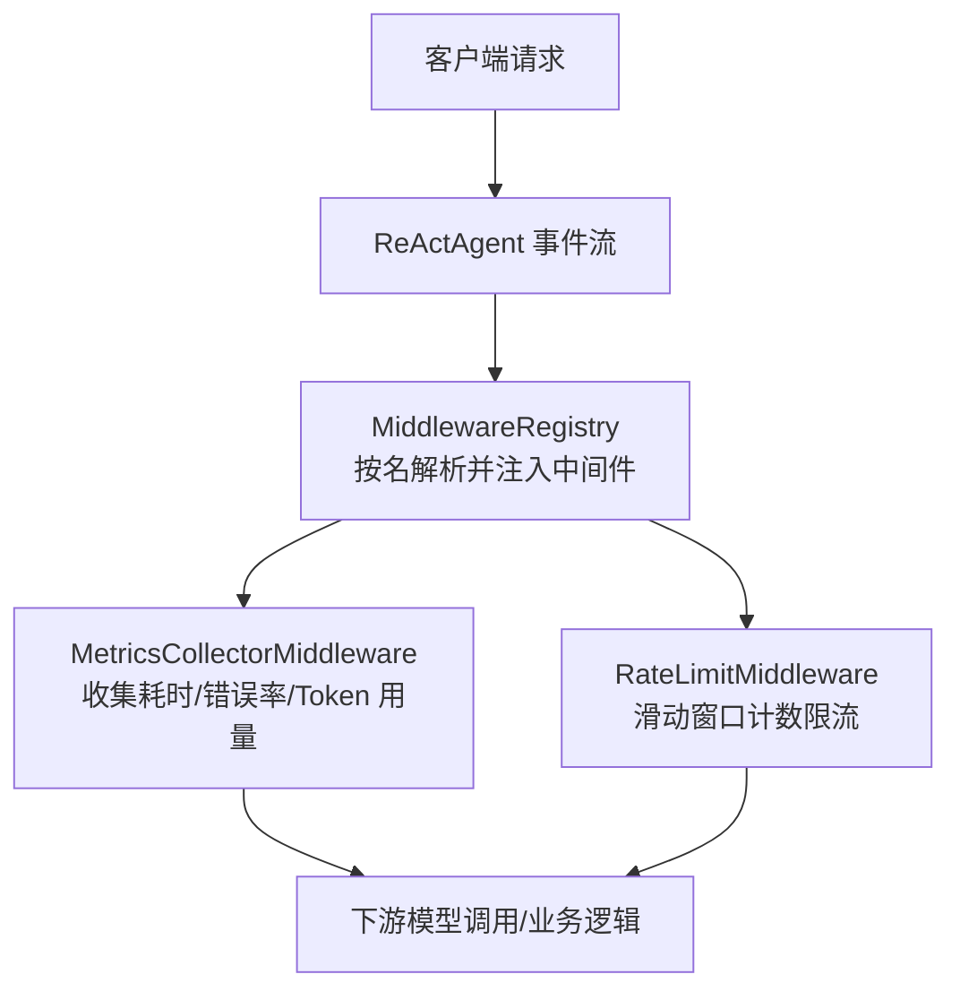
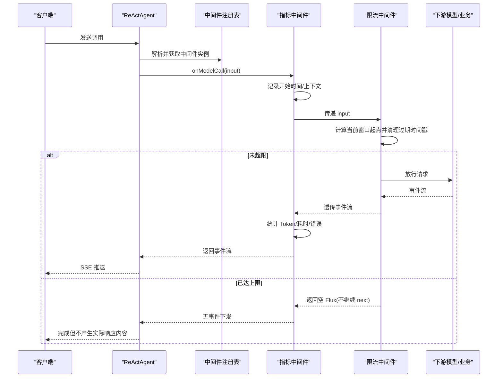
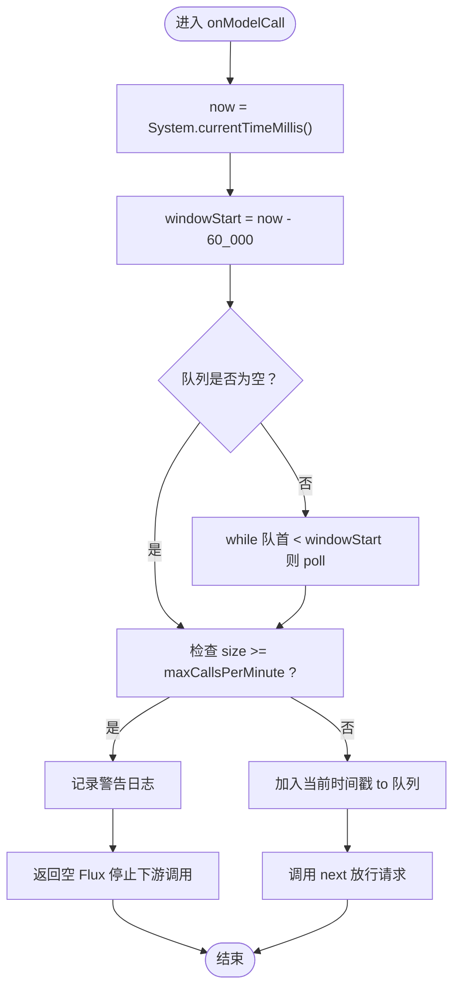
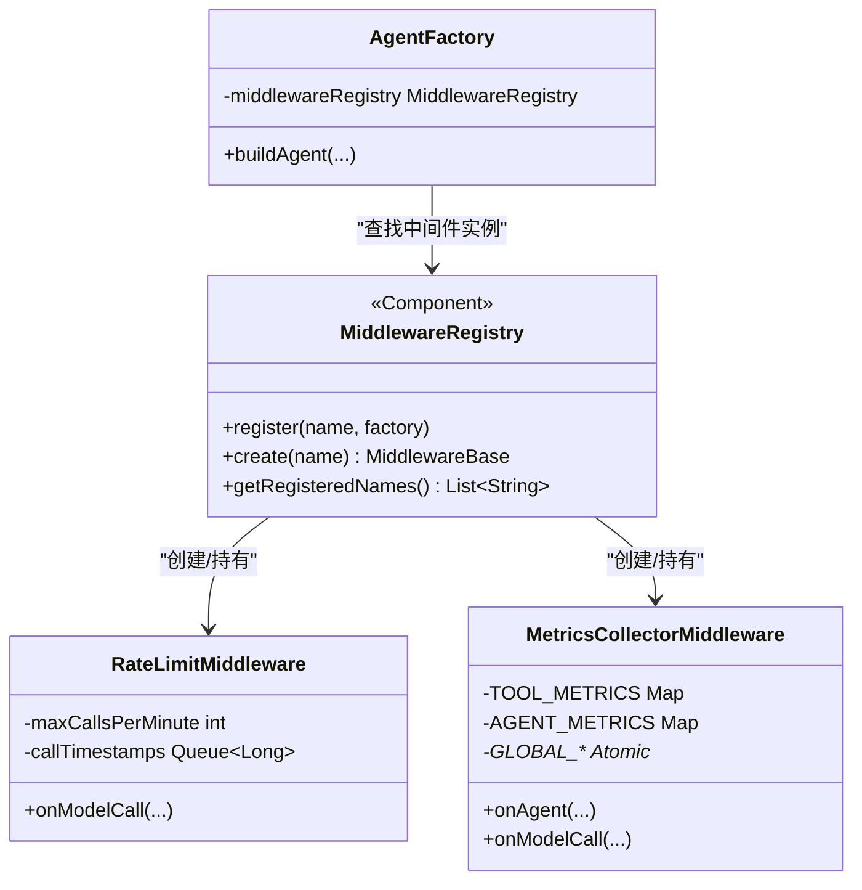

# 限流中间件

<cite>
**本文引用的文件列表**
- [RateLimitMiddleware.java](file://src/main/java/com/skloda/agentscope/middleware/RateLimitMiddleware.java)
- [MetricsCollectorMiddleware.java](file://src/main/java/com/skloda/agentscope/middleware/MetricsCollectorMiddleware.java)
- [MetricsController.java](file://src/main/java/com/skloda/agentscope/controller/MetricsController.java)
- [MiddlewareRegistry.java](file://src/main/java/com/skloda/agentscope/middleware/MiddlewareRegistry.java)
- [AgentConfig.java](file://src/main/java/com/skloda/agentscope/agent/AgentConfig.java)
- [AgentFactory.java](file://src/main/java/com/skloda/agentscope/agent/AgentFactory.java)
- [RateLimitMiddlewareTest.java](file://src/test/java/com/skloda/agentscope/middleware/RateLimitMiddlewareTest.java)
</cite>

## 目录
1. [简介](#简介)
2. [项目结构与定位](#项目结构与定位)
3. [核心组件总览](#核心组件总览)
4. [架构概览](#架构概览)
5. [详细组件分析](#详细组件分析)
6. [依赖关系与协作流程](#依赖关系与协作流程)
7. [性能与并发特性](#性能与并发特性)
8. [调优指南](#调优指南)
9. [与指标系统的集成](#与指标系统的集成)
10. [故障排查](#故障排查)
11. [结论与建议](#结论与建议)
12. [附录：配置示例与最佳实践](#附录配置示例与最佳实践)

## 简介
本文件聚焦 AgentScope 项目中的限流中间件，系统性剖析其实现原理、数据流、并发与可扩展性设计，并给出在 API 网关保护、外部服务调用限制、资源访问控制等企业场景下的落地方案。当前仓库已提供滑动时间窗口的限流中间件和指标采集中间件，以及它们在中间件链中的注册与接入方式。本文将结合源码与测试进行解释，并提供面向分布式环境的升级建议与优化方向。

## 项目结构与定位
- 限流能力由中间件机制承载，属于可插拔的横切关注点。
- 中间件通过名称注册的中央注册表统一装配，并在运行时注入到 ReActAgent 的事件处理链路中。
- 指标采集中间件与限流中间件可在同一链路共存，用于统计限流拦截次数、请求延迟等。

图表来源
- [MiddlewareRegistry.java:12-40](file://src/main/java/com/skloda/agentscope/middleware/MiddlewareRegistry.java#L12-L40)
- [AgentFactory.java:192-200](file://src/main/java/com/skloda/agentscope/agent/AgentFactory.java#L192-L200)

章节来源
- [MiddlewareRegistry.java:12-40](file://src/main/java/com/skloda/agentscope/middleware/MiddlewareRegistry.java#L12-L40)
- [AgentFactory.java:192-200](file://src/main/java/com/skloda/agentscope/agent/AgentFactory.java#L192-L200)

## 核心组件总览
- 限流中间件：基于滑动时间窗口，对单位时间内的模型调用进行配额限制，超过阈值则拒绝后续调用并返回空流，避免触发下游调用。
- 指标采集中间件：围绕 Agent/工具/模型调用生命周期收集耗时、错误率、Token 用量与成本估算，并暴露控制台接口以便查询。
- 中间件注册表：集中维护中间件名称到工厂的映射，支持按需组装不同组合（例如开启审计、限流、指标）。
- Agent 构建与装配：通过 AgentConfig 的 middlewares 列表声明启用哪些中间件，AgentFactory 在构建 ReActAgent 时将其按序挂载到模型调用链路。

章节来源
- [RateLimitMiddleware.java:16-52](file://src/main/java/com/skloda/agentscope/middleware/RateLimitMiddleware.java#L16-L52)
- [MetricsCollectorMiddleware.java:31-162](file://src/main/java/com/skloda/agentscope/middleware/MetricsCollectorMiddleware.java#L31-L162)
- [MiddlewareRegistry.java:12-40](file://src/main/java/com/skloda/agentscope/middleware/MiddlewareRegistry.java#L12-L40)
- [AgentConfig.java:91-92](file://src/main/java/com/skloda/agentscope/agent/AgentConfig.java#L91-L92)
- [AgentFactory.java:192-200](file://src/main/java/com/skloda/agentscope/agent/AgentFactory.java#L192-L200)

## 架构概览
以下序列图展示了“一次模型调用”在经过限流与指标采集时的端到端流程。

图表来源
- [RateLimitMiddleware.java:31-52](file://src/main/java/com/skloda/agentscope/middleware/RateLimitMiddleware.java#L31-L52)
- [MetricsCollectorMiddleware.java:144-162](file://src/main/java/com/skloda/agentscope/middleware/MetricsCollectorMiddleware.java#L144-L162)
- [MiddlewareRegistry.java:26-40](file://src/main/java/com/skloda/agentscope/middleware/MiddlewareRegistry.java#L26-L40)

## 详细组件分析

### 滑动窗口限流中间件
- 时间窗口管理
  - 采用固定 60 秒的时间窗口，基于“当前时间-60秒”作为窗口起点，移除窗口前的旧时间戳。
  - 使用双端队列维护最近一次调用发生的时间戳；每次进入时先清理窗口外的过期项。
- 请求计数与放行逻辑
  - 当队列长度达到每分钟最大调用次数时，直接记录告警日志并返回空 Flux，不再调用 next，即拒绝请求。
  - 未达限时将当前时间入队并放行。
- 并发与线程安全
  - 当前实现使用普通 LinkedList，非线程安全。对于单进程内多线程并发调用存在竞争风险。生产环境建议使用并发容器或加锁，或将状态迁移至 Redis 等共享存储以支持多实例。

图表来源
- [RateLimitMiddleware.java:31-52](file://src/main/java/com/skloda/agentscope/middleware/RateLimitMiddleware.java#L31-L52)

章节来源
- [RateLimitMiddleware.java:16-52](file://src/main/java/com/skloda/agentscope/middleware/RateLimitMiddleware.java#L16-L52)

### 指标采集中间件
- 覆盖范围
  - Agent 级别：调用次数、总耗时、最小/最大耗时。
  - 工具级：每次工具调用的耗时、错误计数。
  - 模型调用级：累计 Token 数、预估成本（按 Qwen-plus 定价常量）。
- 数据结构与并发
  - 全局聚合数据使用 ConcurrentHashMap 与原子计数器，保障多线程写安全。
  - ThreadLocal 维护每线程 MetricsContext，存放本次 Agent 调用的临时度量，避免上下文污染。
- 输出与运维
  - 控制台日志与 MetricsController 提供 /api/metrics 系列接口用于打印和重置指标。

章节来源
- [MetricsCollectorMiddleware.java:31-196](file://src/main/java/com/skloda/agentscope/middleware/MetricsCollectorMiddleware.java#L31-L196)
- [MetricsController.java:15-57](file://src/main/java/com/skloda/agentscope/controller/MetricsController.java#L15-L57)

### 中间件注册与装配
- 中间件注册表
  - 启动时自动注册多个内置中间件，包括 rate-limit、metrics-collector、audit-logging、context-enrichment、detailed-audit、otel-tracing。
- Agent 构建时装配
  - AgentConfig 新增 middlewares 字段（List<String>），描述要启用的中间件名称。
  - AgentFactory 在创建 ReActAgent 时，按配置的 middlewares 名称从 Registry 解析并插入对应中间件实例到模型调用链中。

章节来源
- [MiddlewareRegistry.java:12-40](file://src/main/java/com/skloda/agentscope/middleware/MiddlewareRegistry.java#L12-L40)
- [AgentConfig.java:91-92](file://src/main/java/com/skloda/agentscope/agent/AgentConfig.java#L91-L92)
- [AgentFactory.java:192-200](file://src/main/java/com/skloda/agentscope/agent/AgentFactory.java#L192-L200)

## 依赖关系与协作流程
- 组件耦合
  - RateLimitMiddleware 仅依赖 AgentScope 的中间件扩展点与 Java 集合；无外部依赖。
  - MetricsCollectorMiddleware 依赖 AgentEvent 类型事件及原子结构，用于统计指标。
  - 二者均无需互相感知，顺序可控，可同时生效。
- 运行期关系
  - 通过 MiddlewareRegistry 的名称-工厂映射，配合 AgentFactory 的装配逻辑，形成“名称 -> 实例 -> 链式调用”。

图表来源
- [MiddlewareRegistry.java:12-40](file://src/main/java/com/skloda/agentscope/middleware/MiddlewareRegistry.java#L12-L40)
- [AgentFactory.java:46-61](file://src/main/java/com/skloda/agentscope/agent/AgentFactory.java#L46-L61)
- [AgentFactory.java:192-200](file://src/main/java/com/skloda/agentscope/agent/AgentFactory.java#L192-L200)
- [RateLimitMiddleware.java:16-52](file://src/main/java/com/skloda/agentscope/middleware/RateLimitMiddleware.java#L16-L52)
- [MetricsCollectorMiddleware.java:31-162](file://src/main/java/com/skloda/agentscope/middleware/MetricsCollectorMiddleware.java#L31-L162)

## 性能与并发特性
- 时间复杂度
  - 滑动窗口清理：平均 O(1)，最坏 O(K)（K 为窗口内请求数），单次调用内为摊销成本。
  - 计数与判断：O(1)。
- 内存占用
  - 每个实例维护一个双向队列保存过去一分钟的请求时间戳；在高吞吐下需评估长期运行的内存压力，应确保定期清理（已在实现中按窗口起点清理）。
- 线程安全
  - 当前使用非线程安全的 LinkedList 作为时间戳队列，若在同一 JVM 内被多线程并发访问，需要加并发改造或使用线程隔离。
- 指标开销
  - 指标采集使用原子变量与线程本地上下文，对正常路径影响较小；大量短命高并发场景可考虑采样或异步上报。

[本节为一般性能讨论，不直接分析特定文件]

## 调优指南
- 分钟级调用限额
  - 通过构造函数参数配置每分钟最大调用次数；生产建议与上游配额一致。
- 峰值突发处理
  - 滑动窗口天然平滑突发；如需进一步削峰可叠加令牌桶（见扩展建议）。
- 分级限流
  - 可按用户、租户、模型或工具维度切分限流计数器；当前实现为全局单一配额，可通过扩展 Key 化策略实现分级。
- 并发扩容
  - 将时间窗口队列改为并发友好的数据结构（如 LongAdder + 队列+定时回收），或在多实例部署时将计数器迁至 Redis，保证跨节点一致性。

[本节为一般调优指导，不直接分析特定文件]

## 与指标系统的集成
- 埋点时机
  - 限流：在阻断处打日志，便于统计被拒绝的比例与频次。
  - 指标中间件：在 Agent/工具/模型调用全生命周期捕获指标，统计 Token、耗时、错误，并在完成后汇总。
- 输出与查询
  - 控制台输出：通过专用 metrics 日志器/系统输出查看聚合指标。
  - HTTP 接口：/api/metrics/print 打印完整摘要；/api/metrics/reset 重置全局指标；/api/metrics/status 查看接口说明。
- 告警联动
  - 可将 metrics 的输出持久化为时序数据库指标，设置告警规则：如限流通过率过低、模型调用耗时突增、错误率超标等。

章节来源
- [MetricsCollectorMiddleware.java:187-196](file://src/main/java/com/skloda/agentscope/middleware/MetricsCollectorMiddleware.java#L187-L196)
- [MetricsController.java:15-57](file://src/main/java/com/skloda/agentscope/controller/MetricsController.java#L15-L57)

## 故障排查
- 现象：部分请求未到达下游模型
  - 原因：限流达到每分钟上限，中间件直接返回空 Flux，不调用 next。
  - 定位：查看中间件日志中的 “rate-limit” 标记，确认是否频繁出现阻断信息。
- 现象：指标统计不完整
  - 原因：线程本地上下文异常清理或未处于期望的中间件链路位置。
  - 定位：使用 /api/metrics/status 确认指标接口可用，调用 print/reset 验证输出。
- 单元测试验证
  - 允许达到限阈值的请求，超出的下一请求不会触发 next 回调，符合预期。

章节来源
- [RateLimitMiddleware.java:31-52](file://src/main/java/com/skloda/agentscope/middleware/RateLimitMiddleware.java#L31-L52)
- [RateLimitMiddlewareTest.java:14-49](file://src/test/java/com/skloda/agentscope/middleware/RateLimitMiddlewareTest.java#L14-L49)

## 结论与建议
- 当前实现以轻量滑动窗口为核心，满足单实例基础限流需求，具备低侵入、易插拔的特点。
- 若要支持企业级多实例与精细化管控，建议逐步增强：
  - 并发安全：替换为非阻塞/并发容器或引入分布式锁/计数器。
  - 指标完善：增加限流命中/拒绝比率、分层维度（API/租户）指标。
  - 算法扩展：在多粒度场景下引入令牌桶（稳定速率）、漏桶（平滑流出）等。
  - 配置化管理：将限流阈值与开关纳入动态配置中心，支持运行时调整。
  - 可观测性：对接统一监控平台，打通指标、日志、追踪三件套。

[本节为总结性陈述，不直接分析特定文件]

## 附录：配置示例与最佳实践

- 启用限流与指标的组合中间件
  - 通过 AgentConfig 的 middlewares 字段选择“rate-limit”“metrics-collector”等，由 AgentFactory 装配。
- 不同业务场景的限流策略参考
  - API 网关保护：针对公开 API 设置较低的 QPS，结合指标中间件观察 P95/P99 延迟，必要时提高窗口清理频率或拆分限流维度。
  - 外部服务调用限制：对第三方 LLM/外部 API 增加更严格的每分钟配额，并关闭超限时快速失败降级，保护自身稳定性。
  - 资源访问控制：对高频敏感操作（如文档生成、大文件写入）叠加独立限流键，防止滥用。
- 分布式协调方案
  - 将时间窗口与计数器移至 Redis（ZSET/Counter），结合 TTL 实现多实例一致的滑动窗口限流。
  - 指标数据统一落库或发送至时序系统，配合报警规则进行主动干预。
- 性能优化建议
  - 降低日志级别或采样关键告警日志。
  - 对于极高并发下的高频小对象分配，采用对象池或复用缓存以减少 GC 压力。

章节来源
- [AgentConfig.java:91-92](file://src/main/java/com/skloda/agentscope/agent/AgentConfig.java#L91-L92)
- [AgentFactory.java:192-200](file://src/main/java/com/skloda/agentscope/agent/AgentFactory.java#L192-L200)
- [MetricsController.java:15-57](file://src/main/java/com/skloda/agentscope/controller/MetricsController.java#L15-L57)
- [MiddlewareRegistry.java:26-40](file://src/main/java/com/skloda/agentscope/middleware/MiddlewareRegistry.java#L26-L40)