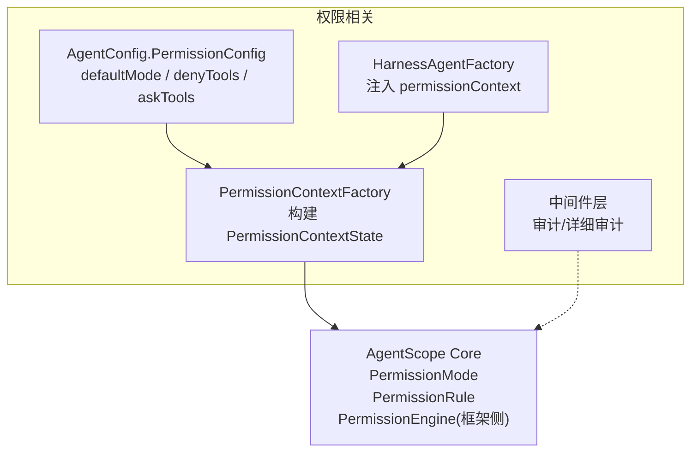
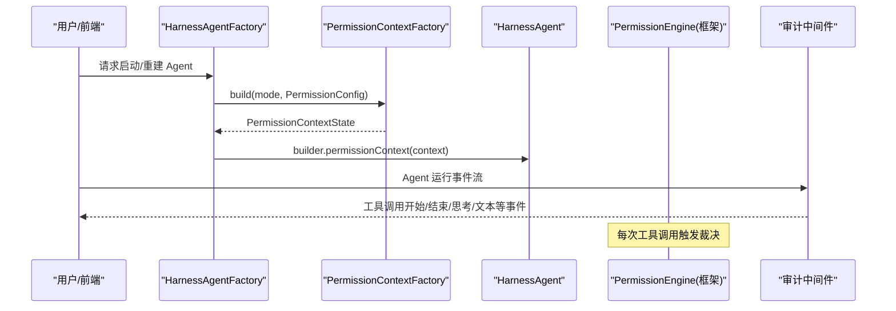
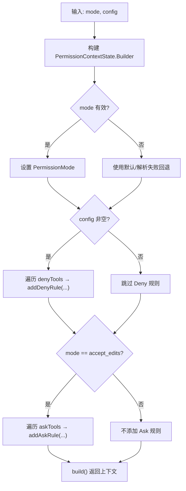
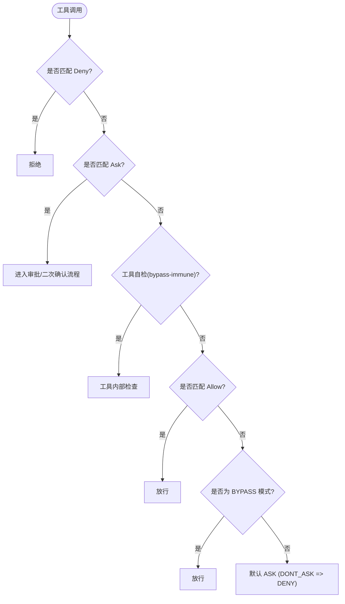
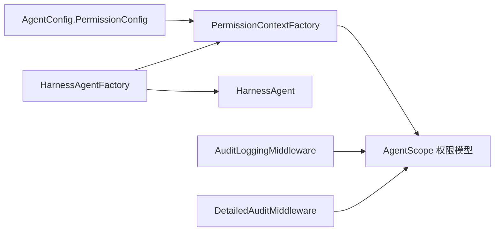

# 权限控制系统

<cite>
**本文引用的文件**
- [PermissionContextFactory.java](file://src/main/java/com/skloda/agentscope/permission/PermissionContextFactory.java)
- [AgentConfig.java](file://src/main/java/com/skloda/agentscope/agent/AgentConfig.java)
- [HarnessAgentFactory.java](file://src/main/java/com/skloda/agentscope/harness/HarnessAgentFactory.java)
- [PermissionContextFactoryTest.java](file://src/test/java/com/skloda/agentscope/permission/PermissionContextFactoryTest.java)
- [2026-06-11-permission-demo-design.md](file://docs/superpowers/specs/2026-06-11-permission-demo-design.md)
- [AuditLoggingMiddleware.java](file://src/main/java/com/skloda/agentscope/middleware/AuditLoggingMiddleware.java)
- [DetailedAuditMiddleware.java](file://src/main/java/com/skloda/agentscope/middleware/DetailedAuditMiddleware.java)
- [agents.yml](file://src/main/resources/config/agents.yml)
</cite>

## 目录
1. [简介](#简介)
2. [项目结构](#项目结构)
3. [核心组件](#核心组件)
4. [架构总览](#架构总览)
5. [详细组件分析](#详细组件分析)
6. [依赖关系分析](#依赖关系分析)
7. [性能考量](#性能考量)
8. [故障排查指南](#故障排查指南)
9. [结论](#结论)
10. [附录：扩展与合规方案](#附录：扩展与合规方案)

## 简介
本文档系统性阐述本项目基于 AgentScope 2.0 的权限控制系统，围绕以下目标展开：
- PermissionContextFactory 的设计思想、上下文构建机制及权限模式切换（bypass、accept_edits、explore 等）与动态规则应用。
- 工具访问控制的实现原理：Deny、Ask 规则的优先级与冲突处理策略，以及与工具自检（bypass-immune）和默认策略的关系。
- 权限上下文在 Agent 生命周期中的作用域管理、状态传递与缓存策略。
- 权限模型的扩展指南：自定义权限规则、细粒度访问控制、多租户隔离。
- 权限审计、违规检测与合规性报告的设计与实践。

## 项目结构
与本主题相关的代码主要分布在如下路径：
- permission：权限上下文工厂与核心构建逻辑
- agent：Agent 配置中嵌入权限配置 PermissionConfig
- harness：HarnessAgentFactory 在创建 HarnessAgent 时注入权限上下文
- middleware：审计日志中间件，可结合权限决策做审计追踪
- docs/specs：权限能力设计规格说明书

图示来源
- [PermissionContextFactory.java:10-39](file://src/main/java/com/skloda/agentscope/permission/PermissionContextFactory.java#L10-L39)
- [AgentConfig.java:100-106](file://src/main/java/com/skloda/agentscope/agent/AgentConfig.java#L100-L106)
- [HarnessAgentFactory.java:183-190](file://src/main/java/com/skloda/agentscope/harness/HarnessAgentFactory.java#L183-L190)
- [AuditLoggingMiddleware.java:15-68](file://src/main/java/com/skloda/agentscope/middleware/AuditLoggingMiddleware.java#L15-L68)
- [DetailedAuditMiddleware.java:28-108](file://src/main/java/com/skloda/agentscope/middleware/DetailedAuditMiddleware.java#L28-L108)

章节来源
- [PermissionContextFactory.java:10-39](file://src/main/java/com/skloda/agentscope/permission/PermissionContextFactory.java#L10-L39)
- [AgentConfig.java:100-106](file://src/main/java/com/skloda/agentscope/agent/AgentConfig.java#L100-L106)
- [HarnessAgentFactory.java:183-190](file://src/main/java/com/skloda/agentscope/harness/HarnessAgentFactory.java#L183-L190)
- [2026-06-11-permission-demo-design.md:15-22](file://docs/superpowers/specs/2026-06-11-permission-demo-design.md#L15-L22)
- [AuditLoggingMiddleware.java:15-68](file://src/main/java/com/skloda/agentscope/middleware/AuditLoggingMiddleware.java#L15-L68)
- [DetailedAuditMiddleware.java:28-108](file://src/main/java/com/skloda/agentscope/middleware/DetailedAuditMiddleware.java#L28-L108)

## 核心组件
- PermissionContextFactory：将 mode 字符串与 PermissionConfig 转换为框架级 PermissionContextState，并应用 Deny/Ask 规则。
- AgentConfig.PermissionConfig：声明默认权限模式与需要强制拒绝/询问的工具列表。
- HarnessAgentFactory：在构建 HarnessAgent 时按配置注入 PermissionContextState。
- 中间件：AudoitLoggingMiddleware/DetailedAuditMiddleware 用于全链路审计与关键事件留存。

章节来源
- [PermissionContextFactory.java:12-39](file://src/main/java/com/skloda/agentscope/permission/PermissionContextFactory.java#L12-L39)
- [AgentConfig.java:100-106](file://src/main/java/com/skloda/agentscope/agent/AgentConfig.java#L100-L106)
- [HarnessAgentFactory.java:183-190](file://src/main/java/com/skloda/agentscope/harness/HarnessAgentFactory.java#L183-L190)

## 架构总览
权限系统在“配置→上下文→运行时”三层协作完成工具访问控制：
- 配置层：agents.yml 或 AgentConfig 中定义 defaultMode 与 denyTools/askTools。
- 构造层：PermissionContextFactory 依据 mode 与配置生成 PermissionContextState。
- 运行时：框架内部 PermissionEngine 根据优先级对每次工具调用进行裁决；本项目通过中间件记录审计信息，形成可追溯闭环。

图示来源
- [HarnessAgentFactory.java:183-190](file://src/main/java/com/skloda/agentscope/harness/HarnessAgentFactory.java#L183-L190)
- [PermissionContextFactory.java:12-39](file://src/main/java/com/skloda/agentscope/permission/PermissionContextFactory.java#L12-L39)
- [AuditLoggingMiddleware.java:15-68](file://src/main/java/com/skloda/agentscope/middleware/AuditLoggingMiddleware.java#L15-L68)
- [DetailedAuditMiddleware.java:28-108](file://src/main/java/com/skloda/agentscope/middleware/DetailedAuditMiddleware.java#L28-L108)

## 详细组件分析

### PermissionContextFactory：权限上下文构建器
职责
- 解析 mode 为 PermissionMode（如 bypass、explore、accept_edits 等）。
- 若存在 PermissionConfig：
  - 始终应用 denyTools 到 Deny 规则（强拒绝，不受 mode 影响）。
  - 仅在 accept_edits 模式下，再应用 askTools 到 Ask 规则（危险工具需审批/确认）。

关键点
- 默认 mode 为 bypass，确保开发/调试期便利。
- Deny 规则在任何 mode 下均生效，体现“安全基线”理念。
- Ask 规则在编辑模式下激活，满足“最小权限 + 人工确认”。

图示来源
- [PermissionContextFactory.java:12-39](file://src/main/java/com/skloda/agentscope/permission/PermissionContextFactory.java#L12-L39)

章节来源
- [PermissionContextFactory.java:12-39](file://src/main/java/com/skloda/agentscope/permission/PermissionContextFactory.java#L12-L39)
- [PermissionContextFactoryTest.java:16-57](file://src/test/java/com/skloda/agentscope/permission/PermissionContextFactoryTest.java#L16-L57)

#### 单元测试覆盖要点
- bypass/explore/accept_edits 三种模式的正确设置。
- accept_edits 模式下 askTools 会注入 Ask 规则。
- denyTools 不论模式如何都会生效。
- null 配置情况下仅按 mode 生成上下文。

章节来源
- [PermissionContextFactoryTest.java:16-57](file://src/test/java/com/skloda/agentscope/permission/PermissionContextFactoryTest.java#L16-L57)

### AgentConfig.PermissionConfig：权限配置模型
字段说明
- defaultMode：默认模式（如 bypass、explore、accept_edits）。
- denyTools：必须拒绝的工具名列表。
- askTools：需要人工确认的工具名列表（在 accept_edits 生效）。

建议
- denyTools 用于统一红线（写入系统配置即全局生效）。
- askTools 用于危险能力（如 shell、写盘等）保留人工审批点。

章节来源
- [AgentConfig.java:100-106](file://src/main/java/com/skloda/agentscope/agent/AgentConfig.java#L100-L106)

### HarnessAgentFactory：上下文注入与装配
集成位置
- 在创建 HarnessAgent 阶段读取 PermissionConfig，调用 PermissionContextFactory 构建上下文，并通过 builder.permissionContext 注入。
- 支持从配置中取 defaultMode；未提供时采用约定值。

效果
- 每个 HarnessAgent 自包含其权限边界，便于实例级差异化和沙箱化部署。

章节来源
- [HarnessAgentFactory.java:183-190](file://src/main/java/com/skloda/agentscope/harness/HarnessAgentFactory.java#L183-L190)

### 工具访问控制：Deny/Ask 优先级与冲突解决
根据设计规格，PermissionEngine 裁决顺序如下（本项目沿用该策略）：
1. Deny 规则（最高优先级）：只要命中即为拒绝。
2. Ask 规则：进入人机交互或审批流程（由上层工作流决定）。
3. 工具自检（bypass-immune）：部分工具拥有内部安全检查，不会被权限绕过。
4. Allow 规则：显式允许集合中的工具直接放行。
5. BYPASS 模式兜底：BYPASS 下宽松放行。
6. 默认 ASK（DONT_ASK 模式下等价 DENY）：作为保守默认。

冲突解决策略
- 同一个工具既在 denyTools 又在 askTools？结果仍为 Deny（因为 Deny 优先级最高）。
- Accept_Edits 仅启用 Ask，不代表自动放开所有写操作；未被 allow 的规则不会因模式而自动放行。

图示来源
- [2026-06-11-permission-demo-design.md:15-22](file://docs/superpowers/specs/2026-06-11-permission-demo-design.md#L15-L22)

章节来源
- [2026-06-11-permission-demo-design.md:15-22](file://docs/superpowers/specs/2026-06-11-permission-demo-design.md#L15-L22)

### 权限上下文在 Agent 生命周期的作用域、状态传递与缓存
- 作用域：PermissionContextState 在创建 HarnessAgent 时注入，作用于整个 Agent 实例的生命周期。
- 状态传递：权限判定发生在框架层的 PermissionEngine 中，贯穿所有工具调用阶段。
- 缓存策略：当前实现由 HarnessAgentFactory 在 Agent 构建时注入，建议在服务层对“同参数同模式”的上下文做缓存以降低开销（例如以 agentId + permissionMode 为键），并结合模式变化触发重建。

说明
- 当前仓库中未见全局缓存实现；可在上游（如 AgentService）引入轻量缓存以提升高频切换场景的性能。

章节来源
- [HarnessAgentFactory.java:183-190](file://src/main/java/com/skloda/agentscope/harness/HarnessAgentFactory.java#L183-L190)

### 配置示例与前端联动
- agents.yml 中可为特定 agent 配置 permissionConfig，使不同 Agent 具备独立权限边界。
- 设计文档定义了前端的模式切换：客户端发送 permissionMode 后，后端重建对应权限上下文的 Agent。

章节来源
- [agents.yml:150-159](file://src/main/resources/config/agents.yml#L150-L159)
- [2026-06-11-permission-demo-design.md:39-47](file://docs/superpowers/specs/2026-06-11-permission-demo-design.md#L39-L47)

## 依赖关系分析
- PermissionContextFactory 依赖 AgentScope core 的权限模型（PermissionMode/PermissionRule/PermissionContextState），通过 Builder 模式装配。
- AgentConfig.PermissionConfig 是纯配置承载体，不参与计算。
- HarnessAgentFactory 负责将上下文装配进 HarnessAgent。
- 中间件在不侵入权限逻辑的前提下完成审计采集。

图示来源
- [PermissionContextFactory.java:3-14](file://src/main/java/com/skloda/agentscope/permission/PermissionContextFactory.java#L3-L14)
- [AgentConfig.java:100-106](file://src/main/java/com/skloda/agentscope/agent/AgentConfig.java#L100-L106)
- [HarnessAgentFactory.java:183-190](file://src/main/java/com/skloda/agentscope/harness/HarnessAgentFactory.java#L183-L190)
- [AuditLoggingMiddleware.java:15-68](file://src/main/java/com/skloda/agentscope/middleware/AuditLoggingMiddleware.java#L15-L68)
- [DetailedAuditMiddleware.java:28-108](file://src/main/java/com/skloda/agentscope/middleware/DetailedAuditMiddleware.java#L28-L108)

章节来源
- [PermissionContextFactory.java:3-14](file://src/main/java/com/skloda/agentscope/permission/PermissionContextFactory.java#L3-L14)
- [HarnessAgentFactory.java:183-190](file://src/main/java/com/skloda/agentscope/harness/HarnessAgentFactory.java#L183-L190)

## 性能考量
- 规则装配代价低：仅在 Agent 创建/重建时执行一次，O(n) 追加规则成本极低。
- 运行时裁决由框架层处理，通常为哈希表+有序规则评估，常量级开销为主。
- 前端高频切换模式时应避免重复创建 Agent：可在服务层对 PermissionContextState 做键控缓存（键=agentId+mode），减少重复构建。

[本节为通用指导，不直接分析具体文件]

## 故障排查指南
常见问题与定位方法：
- 工具被误拒绝
  - 检查是否出现在 denyTools；Deny 优先级最高，一旦命中必拒绝。
  - 检查是否命中 Ask 但未配置审批通道；此时应接入 HITL 审批流程或将其移入 allow/deny。
- Ask 未生效
  - 确认当前模式为 accept_edits；其它模式不会启用 askTools。
- 审计缺失
  - 检查 AuditLoggingMiddleware/DetailedAuditMiddleware 是否注册生效。
  - 关注 tool_call_start/tool_call_end 事件是否完整输出。

参考实现定位
- 审计日志入口
  - [AuditLoggingMiddleware.java:52-66](file://src/main/java/com/skloda/agentscope/middleware/AuditLoggingMiddleware.java#L52-L66)
  - [DetailedAuditMiddleware.java:77-107](file://src/main/java/com/skloda/agentscope/middleware/DetailedAuditMiddleware.java#L77-L107)

章节来源
- [AuditLoggingMiddleware.java:52-66](file://src/main/java/com/skloda/agentscope/middleware/AuditLoggingMiddleware.java#L52-L66)
- [DetailedAuditMiddleware.java:77-107](file://src/main/java/com/skloda/agentscope/middleware/DetailedAuditMiddleware.java#L77-L107)

## 结论
本项目在配置驱动的基础上，以 PermissionContextFactory 为核心完成权限上下文的构建与注入，配合 AgentScope 框架的 PermissionEngine 实现了严格的工具访问控制：
- Deny 绝对优先，Ask 次之，结合 BYPASS/Allow/默认策略保证安全与可用性的平衡。
- HarnessAgentFactory 将权限与 Agent 生命周期绑定，实现实例级隔离。
- 中间件层提供了完整的审计基础，可用于违规检测与合规报告。
建议在更高级场景中补充上下文缓存、可视化审计面板与更丰富的动态规则引擎。

[本节为总结，不直接分析具体文件]

## 附录：扩展与合规方案

### 自定义权限规则
- 通过 extend/addAskRule/addDenyRule 的能力封装更多业务语义（例如按工作空间、资源标签、时间窗口限制）。
- 将“外部规则源”（如策略服务/配置中心）接入到 PermissionContextFactory 的构建过程中，在 Agent 创建或模式切换时刷新上下文。

参考
- [PermissionContextFactory.java:26-39](file://src/main/java/com/skloda/agentscope/permission/PermissionContextFactory.java#L26-L39)

### 细粒度访问控制
- 在 PermissionContextState 基础上，结合文件系统工作目录限定（若框架支持）进行路径级白名单。
- 针对多租户或多环境（dev/test/prod）通过不同 PermissionConfig 注入，实现环境级隔离。

### 多租户权限隔离
- 策略：以租户 ID 作为 key，维护独立的 PermissionContextState 映射表；在会话建立时选择对应上下文并绑定到子 Agent/子流程。
- 风险隔离：利用 Deny 保持各租户一致的安全底线，Ask 针对不同租户差异化开启高风险能力。

### 权限审计与违规检测
- 通过中间件统一记录：工具名、输入预览、事件类型、耗时与错误信息。
- 告警策略：当出现 Deny/Ask 高并发或异常中断时，触发告警并沉淀审计事件。
- 报表：按周/月汇总违规工具调用次数、TOP 风险工具、租户维度分布。

参考
- [AuditLoggingMiddleware.java:15-68](file://src/main/java/com/skloda/agentscope/middleware/AuditLoggingMiddleware.java#L15-L68)
- [DetailedAuditMiddleware.java:28-108](file://src/main/java/com/skloda/agentscope/middleware/DetailedAuditMiddleware.java#L28-L108)

[本节为概念性扩展说明，不直接分析具体文件]