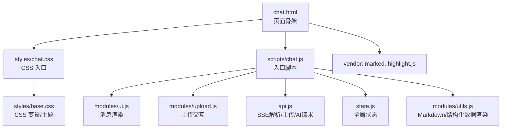
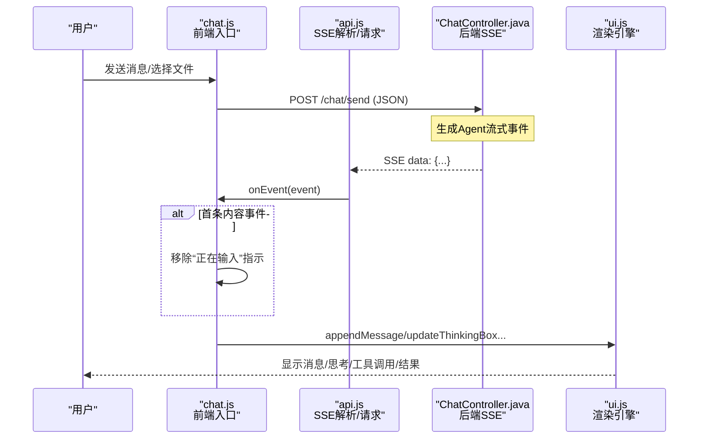
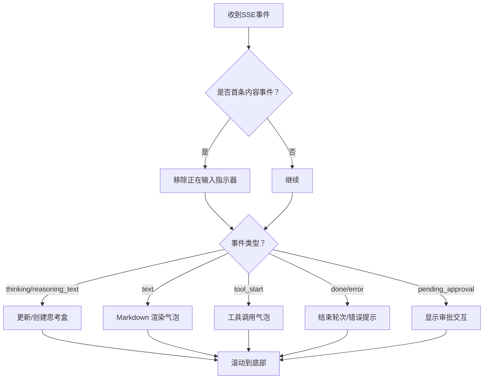
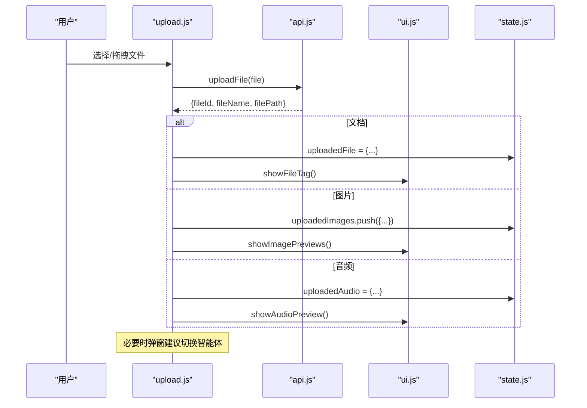
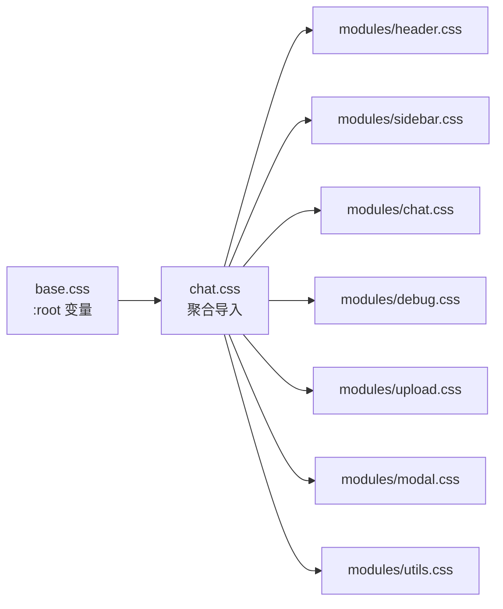
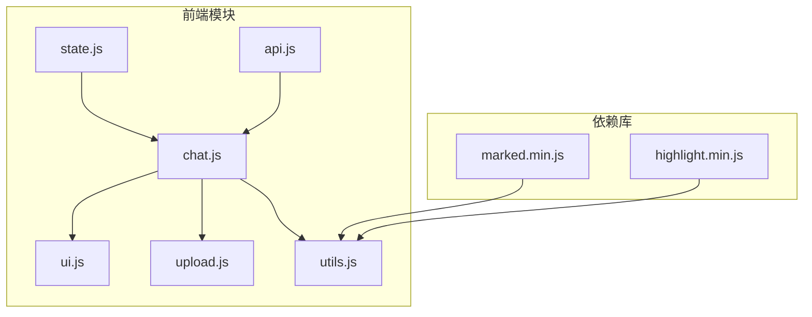

# UI 组件系统

<cite>
**本文引用的文件 **
- [chat.html](file://src/main/resources/templates/chat.html)
- [agui.html](file://src/main/resources/static/agui.html)
- [chat.js](file://src/main/resources/static/scripts/chat.js)
- [state.js](file://src/main/resources/static/scripts/state.js)
- [api.js](file://src/main/resources/static/scripts/api.js)
- [ui.js](file://src/main/resources/static/scripts/modules/ui.js)
- [upload.js](file://src/main/resources/static/scripts/modules/upload.js)
- [utils.js](file://src/main/resources/static/scripts/modules/utils.js)
- [base.css](file://src/main/resources/styles/base.css)
- [chat.css（入口）](file://src/main/resources/styles/chat.css)
- [chat.css（模块）](file://src/main/resources/styles/modules/chat.css)
- [upload.css](file://src/main/resources/styles/modules/upload.css)
- [ChatController.java](file://src/main/java/com/skloda/agentscope/controller/ChatController.java)
</cite>

## 目录
1. [简介](#简介)
2. [项目结构](#项目结构)
3. [核心组件](#核心组件)
4. [架构总览](#架构总览)
5. [详细组件分析](#详细组件分析)
6. [依赖分析](#依赖分析)
7. [性能考虑](#性能考虑)
8. [故障排查指南](#故障排查指南)
9. [结论](#结论)

## 简介
本仓库的 UI 组件系统围绕一个基于 HTML/CSS/JS 的前端聊天界面构建，负责：
- 接收与渲染后端流式事件（SSE），实现即时消息、多模态内容与“思考过程”可视化
- 管理聊天布局与滚动，自适应响应式屏幕
- 实现用户输入区自动高度、快捷键（回车发送）、文件上传与预览（图片、音频、文档）
- 通过 CSS 变量与主题体系支撑深色模式与样式隔离
- 提供基础的可访问性与键盘导航支持

前后端通过 REST + SSE 解耦：前端以 fetch + ReadableStream 消费事件，后端使用 Spring WebFlux 返回 Flux<ServerSentEvent>。

## 项目结构
- 模板页：展示页面骨架、加载 vendor 资源、引入模块化样式与脚本
- 样式体系：CSS 变量定义与模块化样式拆分，确保可维护与主题扩展
- 脚本分层：入口路由与事件分发、UI 渲染、状态集中、API 调用、上传逻辑、工具函数
- 控制器：Spring Controller 暴露 /chat/send、/chat/upload、/chat/approve 等接口并转发为 SSE

图表来源
- [chat.html:1-95](file://src/main/resources/templates/chat.html#L1-L95)
- [chat.css（入口）:1-12](file://src/main/resources/styles/chat.css#L1-L12)
- [chat.js:1-10](file://src/main/resources/static/scripts/chat.js#L1-L10)
- [api.js:1-25](file://src/main/resources/static/scripts/api.js#L1-L25)
- [base.css:1-64](file://src/main/resources/styles/base.css#L1-L64)

章节来源
- [chat.html:1-95](file://src/main/resources/templates/chat.html#L1-L95)
- [chat.css（入口）:1-12](file://src/main/resources/styles/chat.css#L1-L12)
- [chat.js:1-10](file://src/main/resources/static/scripts/chat.js#L1-L10)

## 核心组件
- 消息渲染引擎：根据角色与类型差异化渲染（用户/智能体/错误/待审批），支持 Markdown、代码高亮、结构化数据表格、文件列表与时间戳
- 媒体处理：图片预览、音频播放器、文件标签与可移除；上传后给出智能体切换建议
- 布局管理：三栏布局（Agent侧边栏、聊天区、调试面板），聊天区滚动容器，消息气泡定位（用户右、智能体左）
- 输入与交互：输入框自适应高度、Enter 发送、Shift+Enter 换行、文件拖拽/点击上传、快捷键支持
- 主题系统：CSS 变量控制颜色、发光、字号与间距；深色基调；易于扩展
- 可访问性：语义化节点、aria 属性、键盘导航、焦点可见（基于元素结构与样式约定）

章节来源
- [ui.js:15-115](file://src/main/resources/static/scripts/modules/ui.js#L15-L115)
- [upload.js:1-205](file://src/main/resources/static/scripts/modules/upload.js#L1-L205)
- [chat.css（模块）:31-166](file://src/main/resources/styles/modules/chat.css#L31-L166)
- [upload.css:1-80](file://src/main/resources/styles/modules/upload.css#L1-L80)
- [base.css:8-64](file://src/main/resources/styles/base.css#L8-L64)

## 架构总览
前端通过 chat.js 作为入口，订阅 SSE 事件并根据类型调用 ui.js 中的渲染函数，同时借助 state.js 统一管理会话与运行态。样式由 chat.css 入口聚合各模块 CSS，并通过 base.css 注入 CSS 变量以统一主题。

图表来源
- [chat.js:11-22](file://src/main/resources/static/scripts/chat.js#L11-L22)
- [chat.js:78-176](file://src/main/resources/static/scripts/chat.js#L78-L176)
- [api.js:1-25](file://src/main/resources/static/scripts/api.js#L1-L25)
- [ChatController.java:115-153](file://src/main/java/com/skloda/agentscope/controller/ChatController.java#L115-L153)

章节来源
- [chat.js:78-176](file://src/main/resources/static/scripts/chat.js#L78-L176)
- [ChatController.java:115-153](file://src/main/java/com/skloda/agentscope/controller/ChatController.java#L115-L153)

## 详细组件分析

### 消息渲染引擎
- 角色差异展示
  - 用户：右侧气泡，带头像与文件名/图片/音频标签
  - 智能体：左侧气泡，Markdown 渲染、代码块高亮、结构化数据表（含导出按钮）
  - 错误/审批态：特殊提示样式与操作点
- 媒体内容智能处理
  - 图片：列表容器，点击进入预览模态，使用 fileId 链接下载展示
  - 音频：原生控件播放器，显示文件名标签
  - 文件列表：不同格式图标区分（docx/pdf/xlsx），可移除
- 思考过程（thinking/reasoning_text）
  - “思考盒”实时累积并显示逐步思路，支持折叠/展开与完成后的历史显示
- 关键流程
  - 首次内容事件触发时移除“正在输入”指示器，避免空白闪烁
  - 根据事件类型（text/thinking/tool_start/done/error/pending_approval）决定 UI 行为

图表来源
- [chat.js:152-176](file://src/main/resources/static/scripts/chat.js#L152-L176)
- [ui.js:15-115](file://src/main/resources/static/scripts/modules/ui.js#L15-L115)
- [utils.js:32-46](file://src/main/resources/static/scripts/modules/utils.js#L32-L46)

章节来源
- [chat.js:152-176](file://src/main/resources/static/scripts/chat.js#L152-L176)
- [ui.js:15-115](file://src/main/resources/static/scripts/modules/ui.js#L15-L115)
- [utils.js:32-46](file://src/main/resources/static/scripts/modules/utils.js#L32-L46)

### 媒体内容处理与上传
- 上传流程
  - 用户选择或拖入文件，前端校验类型（文档/图片/音频）
  - 调用 /chat/upload 返回 fileId、fileName、filePath
  - 根据类型更新状态并显示对应标签或预览
  - 若当前智能体不具备相应能力，弹出“智能体切换建议”对话框
- 图片预览
  - 点击图片标签或消息内图片进入模态查看，通过 /chat/download?fileId= 获取资源
- 音频播放
  - 在消息区域嵌入 <audio> 控件，显示文件名
- 关键点
  - 每次发送后将上传状态清空，保证每轮干净状态
  - 对大文件或失败上传进行错误日志输出

图表来源
- [upload.js:22-111](file://src/main/resources/static/scripts/modules/upload.js#L22-L111)
- [api.js:28-41](file://src/main/resources/static/scripts/api.js#L28-L41)
- [ui.js:31-79](file://src/main/resources/static/scripts/modules/ui.js#L31-L79)

章节来源
- [upload.js:22-111](file://src/main/resources/static/scripts/modules/upload.js#L22-L111)
- [api.js:28-41](file://src/main/resources/static/scripts/api.js#L28-L41)
- [ui.js:31-79](file://src/main/resources/static/scripts/modules/ui.js#L31-L79)

### 聊天布局与滚动优化
- 三栏布局：左侧 Agent 选择、中间聊天区、右侧调试/追踪面板
- 消息气泡定位：用户消息右对齐、智能体左对齐，头像固定宽度，内容自适应
- 滚动优化：仅对聊天消息容器启用纵向滚动；新增消息后 scrollToBottom，避免重排抖动
- 空状态：初始未发消息时展示引导图标与文案

章节来源
- [chat.html:17-90](file://src/main/resources/templates/chat.html#L17-L90)
- [chat.css（模块）:1-166](file://src/main/resources/styles/modules/chat.css#L1-L166)
- [ui.js:100-115](file://src/main/resources/static/scripts/modules/ui.js#L100-L115)

### 用户交互组件与快捷键
- 输入框自适应高度：根据 scrollHeight 动态调整最大高度限制
- 快捷键：Enter 发送，Shift+Enter 换行
- 上传：按钮触发隐藏 <input type="file">；监听 change 事件
- 状态管理：isStreaming 阻止重复发送，currentAbortController 支持中断请求
- 调试面板：开关与清空按钮，按轮次记录事件时间线

章节来源
- [chat.js:11-22](file://src/main/resources/static/scripts/chat.js#L11-L22)
- [chat.js:24-70](file://src/main/resources/static/scripts/chat.js#L24-L70)
- [state.js:2-24](file://src/main/resources/static/scripts/state.js#L2-L24)

### 主题定制系统与深色模式
- 通过 :root 下的 CSS 变量集中定义颜色、间距、字体，贯穿所有模块样式
- 渐变、霓虹发光、阴影等效果均由变量组合形成统一的赛博朋克终端风格
- 可扩展浅色主题：仅需覆盖变量集合，无需改动组件类名
- 结构化样式：模块化 import（header/sidebar/chat/debug/upload/modal/utils）便于按需引用与维护

图表来源
- [chat.css（入口）:1-12](file://src/main/resources/styles/chat.css#L1-L12)
- [base.css:8-64](file://src/main/resources/styles/base.css#L8-L64)

章节来源
- [chat.css（入口）:1-12](file://src/main/resources/styles/chat.css#L1-L12)
- [base.css:8-64](file://src/main/resources/styles/base.css#L8-L64)

### 无障碍访问与键盘导航
- 键盘可达：输入框、发送按钮、文件上传均默认可聚焦；Enter/Shift+Enter 有明确语义行为
- 语义化：列表项、标题层级、按钮、表单控件具备原生可访问性语义
- 视觉对比：文本与背景高对比度；滚动条与边框突出显示增强视觉引导
- 注意：如需进一步完善，可为交互控件添加 aria-label、role 及 tabindex，并为关键元素增加 keyboard shortcut 提示

[本节为通用可用性实践说明，不直接分析特定文件]

### AG-UI 简易演示页面
- agui.html 提供独立的 /ag-ui/run 协议测试页面，发送 RunAgentInput 并通过 SSE 读取 AguiEventType，用于验证 AG-UI 协议对接
- 该页面与主聊天页相对独立，适合联调与问题复现

章节来源
- [agui.html:1-135](file://src/main/resources/static/agui.html#L1-L135)

## 依赖分析
- 前端依赖
  - marked.min.js：Markdown 解析
  - highlight.min.js：代码块语法高亮（可结合 language-* 自动/手动识别）
- 运行时状态
  - state.js 将全局对象置于 window.__agentScopeState，并提供读写代理，跨模块共享
- 网络与 SSE
  - api.js 封装了 upload、fetchAgents/fetchSessions/fetchKnowledgeDocs/fetchSkillInfo/fetchToolInfo 等
  - createSSEParser 实现了轻量 SSE 分帧解析与回调分发

图表来源
- [chat.html:8-12](file://src/main/resources/templates/chat.html#L8-L12)
- [state.js:2-24](file://src/main/resources/static/scripts/state.js#L2-L24)
- [api.js:1-25](file://src/main/resources/static/scripts/api.js#L1-L25)
- [chat.js:1-10](file://src/main/resources/static/scripts/chat.js#L1-L10)

章节来源
- [chat.html:8-12](file://src/main/resources/templates/chat.html#L8-L12)
- [api.js:1-25](file://src/main/resources/static/scripts/api.js#L1-L25)
- [state.js:2-24](file://src/main/resources/static/scripts/state.js#L2-L24)

## 性能考虑
- 滚动与重绘
  - 仅对 #chatMessages 启用 overflow-y，避免整页滚动；追加消息后 scrollToBottom，减少滚动抖动
- DOM 操作
  - 批量创建节点后再插入，减少回流；思考盒内容增量拼接而非全量重建
- 媒体渲染
  - 图片延迟懒加载、按需加载详情；音频仅在主消息中渲染控件，列表中以文本标识减少占用
- 事件处理
  - 首条内容事件才移除“正在输入”，防止频繁 UI 切换；对 SSE 事件进行最小化处理再交由渲染函数
- 缓存与复用
  - 结构化数据提取与表格渲染复用；代码高亮采用标记语言自动推断以减少配置

[本节提供通用性能指导]

## 故障排查指南
- 无法显示 Markdown/无高亮
  - 检查 vendor 是否加载成功（marked/highlight）；确认 CSS 引入顺序正确
  - 参考：[chat.html:8-12](file://src/main/resources/templates/chat.html#L8-L12)、[utils.js:32-46](file://src/main/resources/static/scripts/modules/utils.js#L32-L46)
- 消息一直显示“正在输入”不消失
  - 确认首条包含可见内容的事件（text/thinking/reasoning_text/tool_start/done/error）已到达并被处理；见清理逻辑
  - 参考：[chat.js:152-176](file://src/main/resources/static/scripts/chat.js#L152-L176)
- 图片无法预览/音频无法播放
  - 确认 fileId 正确且后端下载接口可用；消息内图片 src 指向 /chat/download?fileId=
  - 参考：[ui.js:46-79](file://src/main/resources/static/scripts/modules/ui.js#L46-L79)
- 上传失败或类型不被接受
  - 前端过滤规则限制 .docx/.pdf/.xlsx/.jpg/.jpeg/.png/.gif/.webp/.wav/.mp3/.m4a/.mp4；失败会输出日志
  - 参考：[upload.js:22-45](file://src/main/resources/static/scripts/modules/upload.js#L22-L45)
- 智能体不具备多模态能力却上传了相关文件
  - 前端会弹出切换建议；可选择切换到支持能力的智能体再继续
  - 参考：[upload.js:61-104](file://src/main/resources/static/scripts/modules/upload.js#L61-L104)

章节来源
- [chat.js:152-176](file://src/main/resources/static/scripts/chat.js#L152-L176)
- [upload.js:22-45](file://src/main/resources/static/scripts/modules/upload.js#L22-L45)
- [ui.js:46-79](file://src/main/resources/static/scripts/modules/ui.js#L46-L79)

## 结论
本 UI 组件系统以“模块化 + 主题变量 + 事件驱动”为核心，清晰分离布局、交互与渲染职责，通过 SSE 流式传输实现高性能的多模态消息体验。其设计兼顾了可访问性、可维护性与可扩展性，可通过覆盖 CSS 变量快速实现新主题，亦可扩展新的媒体类型与事件类型而不破坏现有架构。