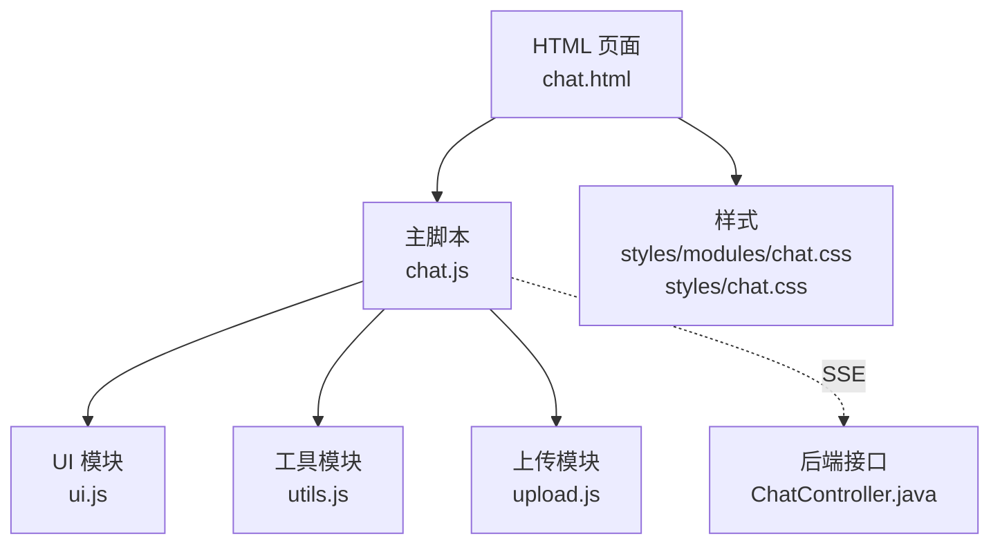
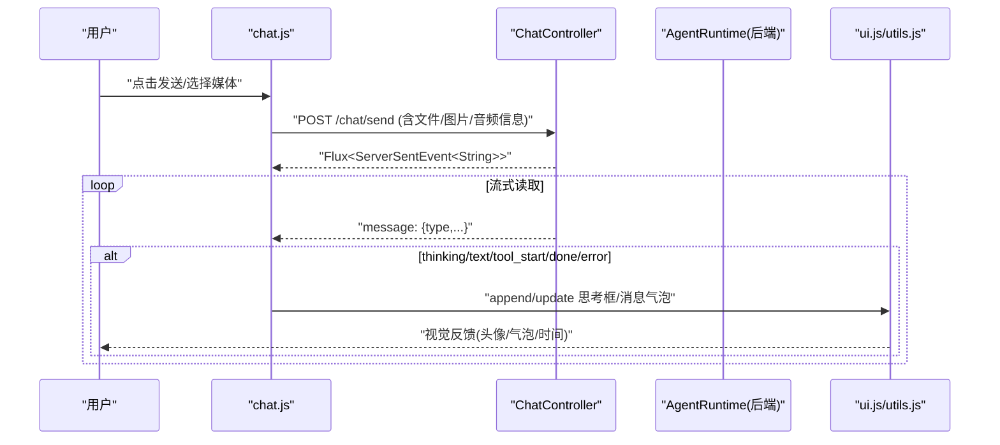
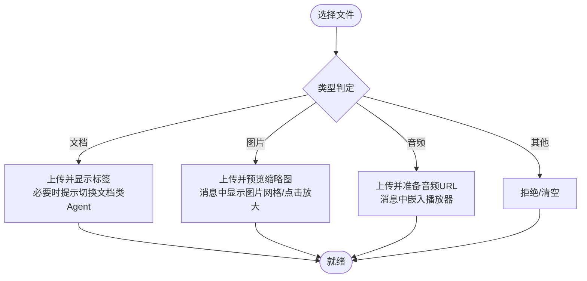
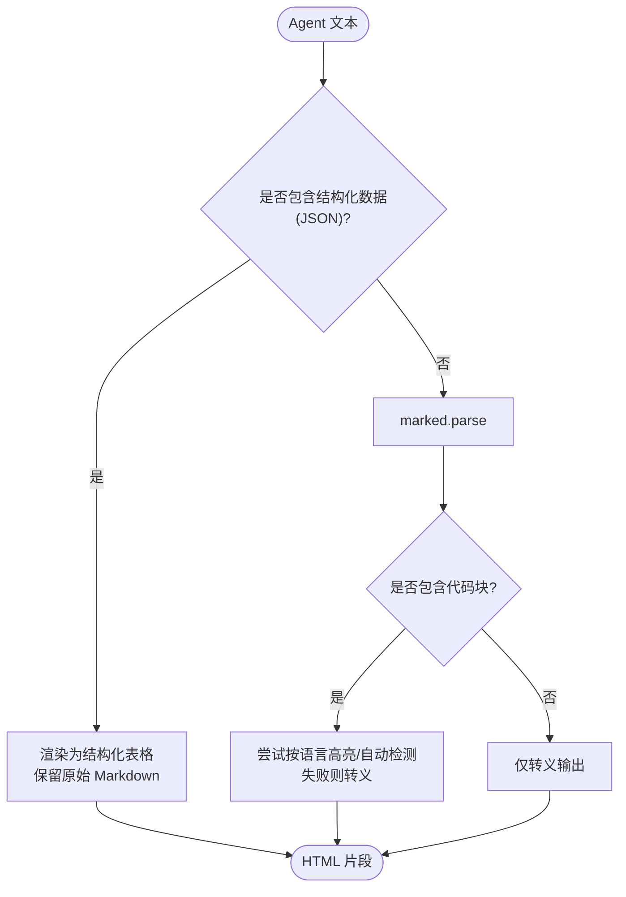
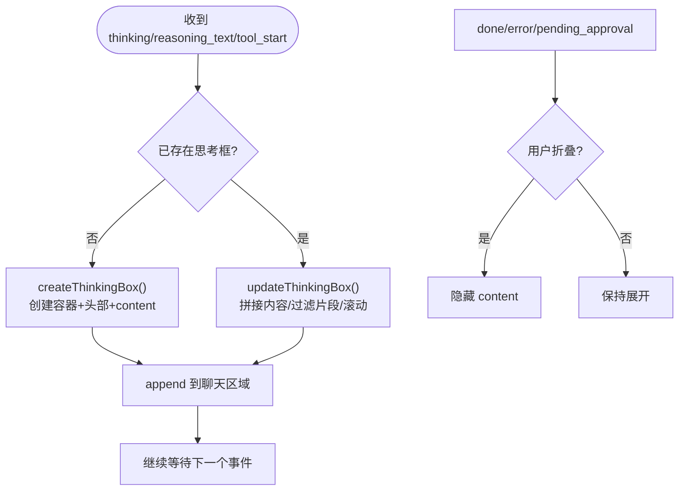
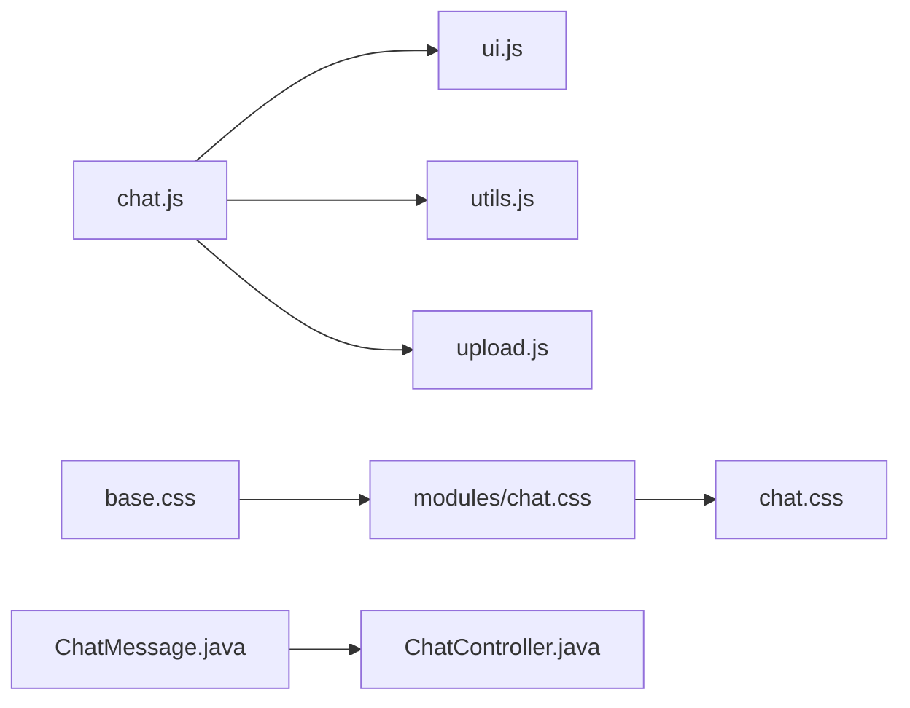

# 消息渲染引擎

<cite>
**本文引用的文件**
- [chat.html](file://src/main/resources/templates/chat.html)
- [chat.js](file://src/main/resources/static/scripts/chat.js)
- [ui.js](file://src/main/resources/static/scripts/modules/ui.js)
- [utils.js](file://src/main/resources/static/scripts/modules/utils.js)
- [upload.js](file://src/main/resources/static/scripts/modules/upload.js)
- [chat.css](file://src/main/resources/styles/chat.css)
- [modules/chat.css](file://src/main/resources/styles/modules/chat.css)
- [ChatController.java](file://src/main/java/com/skloda/agentscope/controller/ChatController.java)
- [ChatMessage.java](file://src/main/java/com/skloda/agentscope/model/ChatMessage.java)
</cite>

## 目录
1. [简介](#简介)
2. [项目结构与入口](#项目结构与入口)
3. [核心组件与职责](#核心组件与职责)
4. [架构总览](#架构总览)
5. [详细组件分析](#详细组件分析)
6. [依赖关系分析](#依赖关系分析)
7. [性能与内存优化](#性能与内存优化)
8. [故障排查与降级](#故障排查与降级)
9. [结论](#结论)
10. [附录](#附录)

## 简介
本文档聚焦“消息渲染引擎”，围绕多角色差异化展示、媒体内容智能处理、Markdown 安全渲染与代码高亮、思考过程盒子的动态生成与折叠、时间戳与滚动定位、以及错误处理与降级策略，系统化地解释前端如何实现高可用、高性能、可维护的对话消息渲染。同时结合后端 SSE 事件流与数据结构，说明前后端协作链路。

## 项目结构与入口
- 页面入口位于服务端模板 chat.html，加载样式 vendor 资源、全局样式以及主脚本 chat.js。
- 主脚本负责：SSE 解析、消息生命周期、调试面板联动、以及调用模块 ui.js / utils.js 完成 DOM 构建与渲染。
- 上传与多媒体管理由 upload.js 提供，UI 模块由 ui.js 实现消息气泡、头像、思考盒子等。
- Markdown 渲染与安全转义由 utils.js 提供；样式集中在 styles/modules/chat.css 与 styles/chat.css。

图表来源
- [chat.html:1-95](file://src/main/resources/templates/chat.html#L1-L95)
- [chat.js:1-9](file://src/main/resources/static/scripts/chat.js#L1-L9)
- [ui.js:15-115](file://src/main/resources/static/scripts/modules/ui.js#L15-L115)
- [utils.js:1-46](file://src/main/resources/static/scripts/modules/utils.js#L1-L46)
- [upload.js:1-45](file://src/main/resources/static/scripts/modules/upload.js#L1-L45)
- [ChatController.java:44-100](file://src/main/java/com/skloda/agentscope/controller/ChatController.java#L44-L100)

章节来源
- [chat.html:1-95](file://src/main/resources/templates/chat.html#L1-L95)
- [chat.js:1-10](file://src/main/resources/static/scripts/chat.js#L1-L10)

## 核心组件与职责
- ChatController（后端）：接收发送消息请求，返回 SSE 事件流，承载序列化异常兜底与统一 event 类型。
- chat.js（前段中枢）：解析 SSE、根据事件类型更新 UI（用户消息、Agent 文本、工具调用、thinking/reasoning_text、done/error 等）。
- ui.js（渲染编排）：创建消息容器、头像、气泡、时间戳；构造思考过程盒子（实时与历史）；图片与音频卡片生成。
- utils.js（渲染工具）：Markdown 安全转换与语法高亮、结构化数据表格化、escapeHtml、时间戳与滚动方法。
- upload.js（媒体输入）：校验与上传文件（文档/图片/音频），提示智能体切换建议，预览管理。
- CSS（样式体系）：定义用户/Agent 气泡、头像、thinking-box、图片网格、音频播放控件、结构化数据表格等主题样式。

章节来源
- [ChatController.java:44-100](file://src/main/java/com/skloda/agentscope/controller/ChatController.java#L44-L100)
- [chat.js:11-177](file://src/main/resources/static/scripts/chat.js#L11-L177)
- [ui.js:15-200](file://src/main/resources/static/scripts/modules/ui.js#L15-L200)
- [utils.js:1-46](file://src/main/resources/static/scripts/modules/utils.js#L1-L46)
- [upload.js:22-110](file://src/main/resources/static/scripts/modules/upload.js#L22-L110)
- [modules/chat.css:169-316](file://src/main/resources/styles/modules/chat.css#L169-L316)

## 架构总览
SSE 驱动的消息渲染管线（端到端流程）：

图表来源
- [chat.js:106-177](file://src/main/resources/static/scripts/chat.js#L106-L177)
- [ChatController.java:77-100](file://src/main/java/com/skloda/agentscope/controller/ChatController.java#L77-L100)

## 详细组件分析

### 1) 不同角色的差异化展示机制
- 用户消息与 Agent 消息通过不同的布局与样式进行区分：
  - 用户消息：气泡靠右（反向排列），拥有绿色调渐变背景与右侧指示边条，头像采用用户图标。
  - Agent 消息：气泡靠左，带有青色渐变背景与左侧指示边条，头像为机器人图标，并对内容进行 Markdown 渲染与代码高亮。
- 时间戳：每条消息底部附带时间字符串。
- 辅助类名与结构：
  - 用户/Agent 包裹层 .message.user/.message.agent
  - 头像 .message-avatar
  - 内容区 .message-content
  - 气泡 .message-bubble（Agent 启用 md-render）
  - 时间 .message-time

章节来源
- [ui.js:15-115](file://src/main/resources/static/scripts/modules/ui.js#L15-L115)
- [modules/chat.css:31-125](file://src/main/resources/styles/modules/chat.css#L31-L125)

### 2) 媒体内容的智能处理
- 文件列表展示：
  - 上传文档后，在前端以标签形式展示文件名并提供移除能力，提交消息时携带 filePath/fileName。
- 图片预览与放大查看：
  - 上传图片后，在输入区域以缩略图/标签形式显示，并在消息气泡内生成图片网格；点击图片触发弹窗放大查看（使用模态交互能力）。
- 音频播放器集成：
  - 上传音频后在消息气泡内注入 HTMLAudioElement，带 controls 属性及文件名标注，可直接在线播放。
- 类型判定与智能体建议：
  - 根据扩展名判断文档/图片/音频；若当前 Agent 不支持对应模态（vision/audio），会弹出建议切换到更合适的 Agent。

图表来源
- [upload.js:22-110](file://src/main/resources/static/scripts/modules/upload.js#L22-L110)
- [ui.js:31-79](file://src/main/resources/static/scripts/modules/ui.js#L31-L79)
- [modules/chat.css:276-316](file://src/main/resources/styles/modules/chat.css#L276-L316)

章节来源
- [upload.js:22-155](file://src/main/resources/static/scripts/modules/upload.js#L22-L155)
- [ui.js:31-79](file://src/main/resources/static/scripts/modules/ui.js#L31-L79)
- [modules/chat.css:276-316](file://src/main/resources/styles/modules/chat.css#L276-L316)

### 3) Markdown 渲染流程（安全与高亮）
- 渲染入口：对 Agent 回复采用 Markdown 解析；对用户消息仅纯文本输出。
- 安全与回退：
  - escapeHtml 用于避免 XSS；
  - 当代码块指定语言且 highlighter 支持时执行高亮；否则自动检测语言；失败回退为转义文本。
- 结构化数据增强：
  - 自动识别 JSON 或对象数组并转换为表格视图，提供导出 JSON 能力。
- 依赖库：marked + highlight.min.js（由 chat.html 引入）。

图表来源
- [utils.js:1-46](file://src/main/resources/static/scripts/modules/utils.js#L1-L46)
- [chat.html:11-12](file://src/main/resources/templates/chat.html#L11-L12)

章节来源
- [utils.js:1-196](file://src/main/resources/static/scripts/modules/utils.js#L1-L196)
- [chat.html:11-12](file://src/main/resources/templates/chat.html#L11-L12)

### 4) 思考过程（thinking）盒子的动态生成与折叠
- 触发条件：
  - 收到 thinking/reasoning_text/tool_start 等事件时，若当前 Agent 启用了 think 能力，创建或更新思考盒子。
- 行为：
  - 初始为空（占位）、带有旋转指示器；随流式内容追加至 content；过滤 __fragment__；末尾滚动到底部。
  - 支持折叠/展开（点击 header）；完成后 spinner 消失，状态样式变化。
  - 历史消息回放时，会将已收集的思考过程作为“已完成”的折叠盒子插入。
- 与打字指示器的协同：首个可见内容事件到达后立即清除打字指示点，避免空白期。

图表来源
- [chat.js:138-177](file://src/main/resources/static/scripts/chat.js#L138-L177)
- [ui.js:117-197](file://src/main/resources/static/scripts/modules/ui.js#L117-L197)
- [modules/chat.css:169-250](file://src/main/resources/styles/modules/chat.css#L169-L250)

章节来源
- [chat.js:138-177](file://src/main/resources/static/scripts/chat.js#L138-L177)
- [ui.js:117-197](file://src/main/resources/static/scripts/modules/ui.js#L117-L197)
- [modules/chat.css:169-250](file://src/main/resources/styles/modules/chat.css#L169-L250)

### 5) 时间戳与滚动定位优化
- 时间戳：每轮消息底部显示 getTimestamp() 的结果，便于阅读溯源。
- 滚动优化：
  - appendMessage/createThinkingBox/updateThinkingBox 等均在插入/更新后调用 scrollToBottom，确保最新内容可见。
  - typing indicator 在首个“真正可见”的内容事件后才移除，避免“抖动/空白”问题。

章节来源
- [ui.js:99-115](file://src/main/resources/static/scripts/modules/ui.js#L99-L115)
- [ui.js:175-197](file://src/main/resources/static/scripts/modules/ui.js#L175-L197)
- [chat.js:152-176](file://src/main/resources/static/scripts/chat.js#L152-L176)

### 6) 后端事件流与渲染桥接
- ChatController 将事件统一封装为 ServerSentEvent，event 名称固定为 message，data 为 JSON 串。
- 前端使用自定义的 createSSEParser 进行事件解析；依据 payload.type 路由到不同分支，处理 agent_start/agent_end/thinking/text/tool_* 等事件。
- 典型的事件流转：
  - user 发送 → server 返回 Flux → 第一个可见内容事件清理 typing → 逐步更新 UI（思考/文本/工具调用/结果）→ done/error 收尾。

章节来源
- [ChatController.java:77-100](file://src/main/java/com/skloda/agentscope/controller/ChatController.java#L77-L100)
- [chat.js:106-177](file://src/main/resources/static/scripts/chat.js#L106-L177)

## 依赖关系分析
- 前端模块解耦：
  - chat.js 依赖 api/state 获取 SSE 与上下文，委托 ui.js 做 DOM 组装，utils.js 负责渲染与工具函数，upload.js 负责媒体管理。
- 样式组织：
  - base/chat.modules.css 形成层次化主题与组件样式；chat.html 中按顺序引入。
- 数据模型：
  - 后端持久化与历史记录使用 ChatMessage（id/role/content/thinkingContent/createdAt），与前端展示一一对应。

图表来源
- [chat.js:1-9](file://src/main/resources/static/scripts/chat.js#L1-L9)
- [chat.css:1-12](file://src/main/resources/styles/chat.css#L1-L12)
- [ChatMessage.java:1-100](file://src/main/java/com/skloda/agentscope/model/ChatMessage.java#L1-L100)
- [ChatController.java:44-100](file://src/main/java/com/skloda/agentscope/controller/ChatController.java#L44-L100)

章节来源
- [chat.js:1-9](file://src/main/resources/static/scripts/chat.js#L1-L9)
- [chat.css:1-12](file://src/main/resources/styles/chat.css#L1-L12)
- [ChatMessage.java:1-100](file://src/main/java/com/skloda/agentscope/model/ChatMessage.java#L1-L100)

## 性能与内存优化
- DOM 操作最小化
  - 增量更新思考框内容，避免整条重写；仅在必要时才重建气泡。
- 渲染优化
  - Markdown 按需高亮，失败直接回退，减少不必要的计算；结构化数据表格化降低长文本排版开销。
- 资源与缓存
  - 静态资源带版本参数（如 v=2.x），浏览器可利用强缓存；图片懒加载可通过延迟 src 实现（当前已基于缩略图模式）。
- 内存回收
  - 上传后及时清空 input value；完成一轮后清理临时对象引用；图片预览仅在活跃会话维持。
- 滚动性能
  - 高频 updateThinkingBox 中使用内部滚动（content 高度自适配），再批量调整视图到底部，减少多次重排。

[本节为通用指导，无需特定文件引用]

## 故障排查与降级
- 网络与解析失败
  - fetch 失败：移除打字指示，appendMessage('error')，结束本轮。
  - SSE JSON 解析失败：记录错误日志并忽略当前片段，避免中断后续事件。
- 后端序列化异常
  - ChatController.sseEvent 捕获异常并返回统一 error 事件类型，前端仍可优雅退出。
- Markdown/高亮失败
  - highlightAuto 抛出异常时回退到 escapeHtml 文本渲染，保障可用性。
- 媒体兼容性与权限
  - 音频/图片依赖浏览器原生能力，若被策略限制，降级为显示文件链接或提示用户允许。
- 思考框状态一致
  - 使用 window._typingIndicatorActive 开关控制打字指示器的显隐时机，确保与首条“真实内容”对齐。

章节来源
- [chat.js:113-177](file://src/main/resources/static/scripts/chat.js#L113-L177)
- [ChatController.java:77-100](file://src/main/java/com/skloda/agentscope/controller/ChatController.java#L77-L100)
- [utils.js:7-29](file://src/main/resources/static/scripts/modules/utils.js#L7-L29)

## 结论
该消息渲染引擎基于事件驱动的 SSE 流，将用户消息与 Agent 消息在视觉上清晰分离，实现了富媒体内容（图片/音频/文档）的智能接入与展示。Markdown 的安全渲染与高亮保证了内容的可读性与安全性。思考过程盒子以渐进方式呈现，增强了可观测性。配合健壮的错误处理与降级策略，整体具备良好鲁棒性。针对大数据量与长会话的场景，建议在滚动虚拟化、图片懒加载、Markdown 渲染批处理等方面进一步演进以提升性能。

[本节为总结性内容，无需特定文件引用]

## 附录
- 相关类与实体
  - ChatMessage：承载 id、role、content、thinkingContent、createdAt 等字段，作为持久化与历史回溯的最小单元。
- 关键样式
  - modules/chat.css 定义了消息气泡、头像、thinking-box、图片网格、音频控件及结构化数据表格等样式族，支撑完整的消息展现。
- 交互与配置
  - 通过 agents 配置决定是否启用 thinking；上传流程会自动检测当前 Agent 的能力并给予切换建议。

章节来源
- [ChatMessage.java:1-100](file://src/main/java/com/skloda/agentscope/model/ChatMessage.java#L1-L100)
- [modules/chat.css:169-818](file://src/main/resources/styles/modules/chat.css#L169-L818)
- [upload.js:56-105](file://src/main/resources/static/scripts/modules/upload.js#L56-L105)