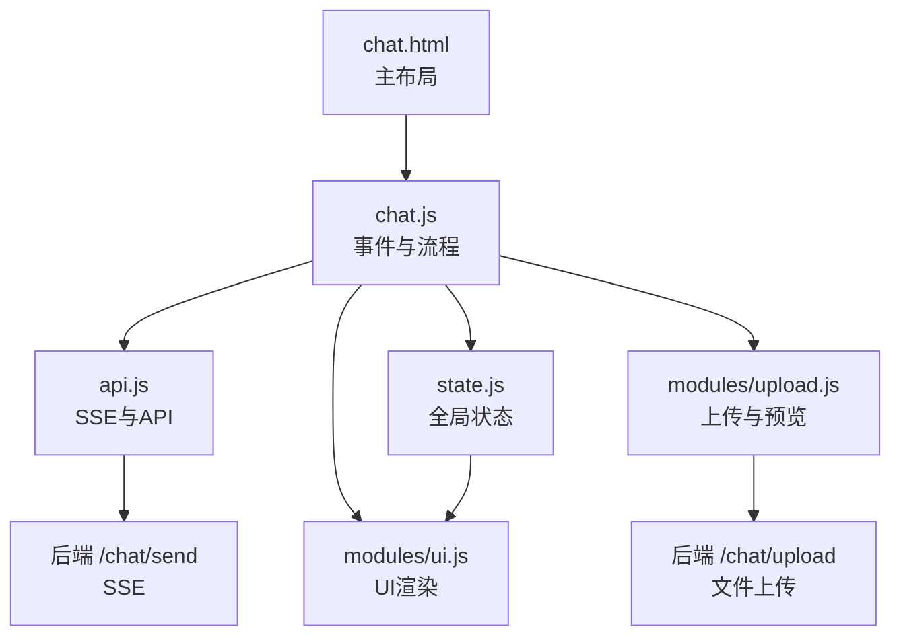
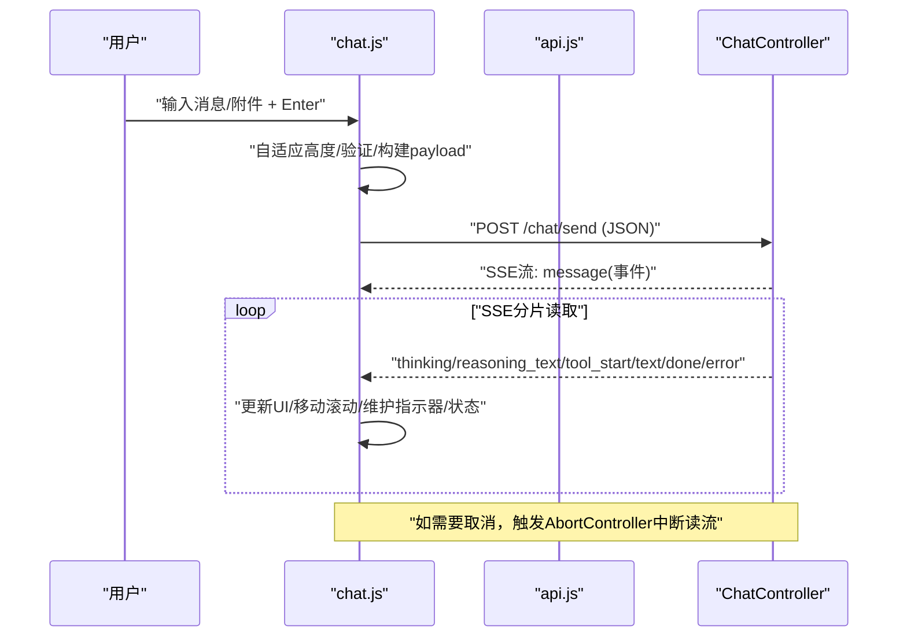
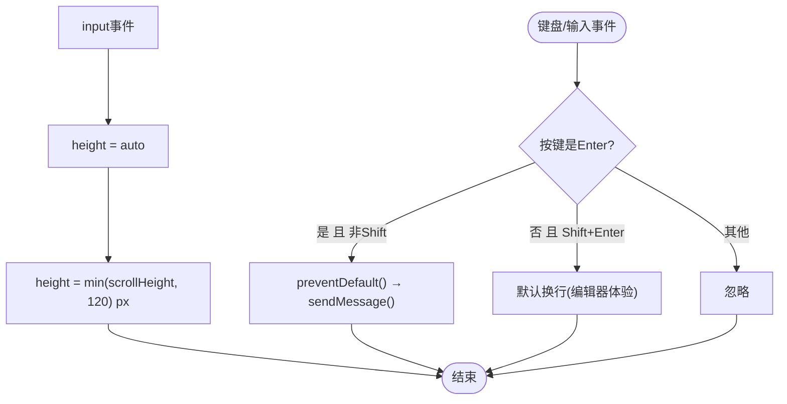
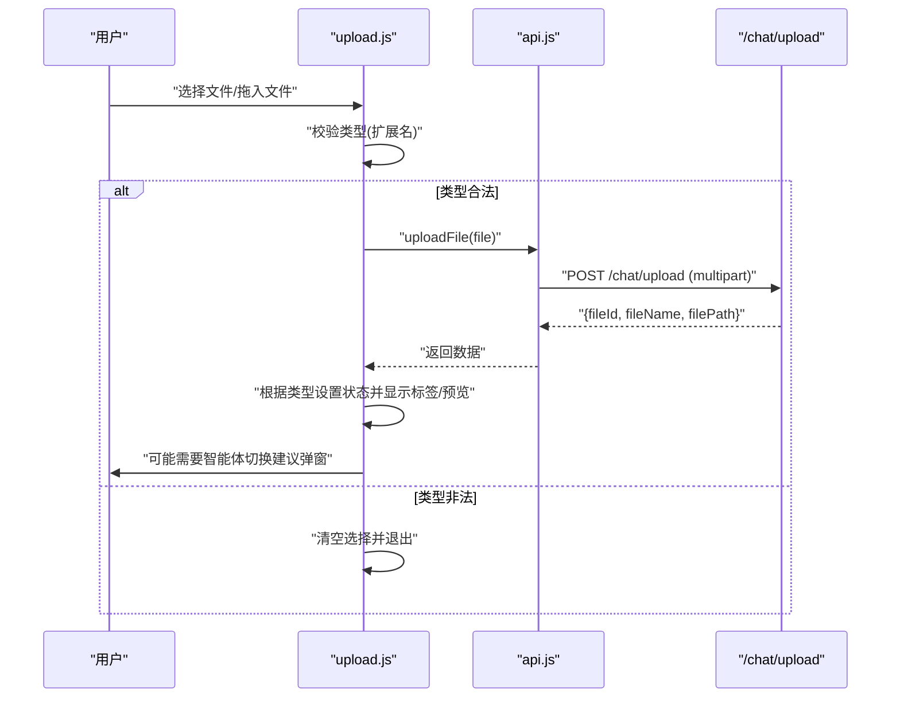
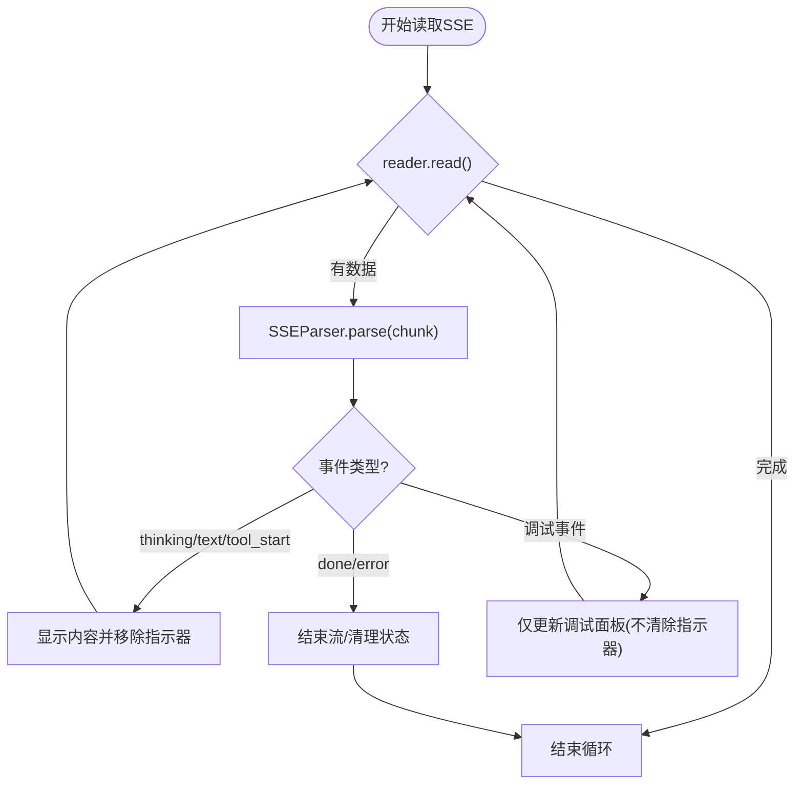
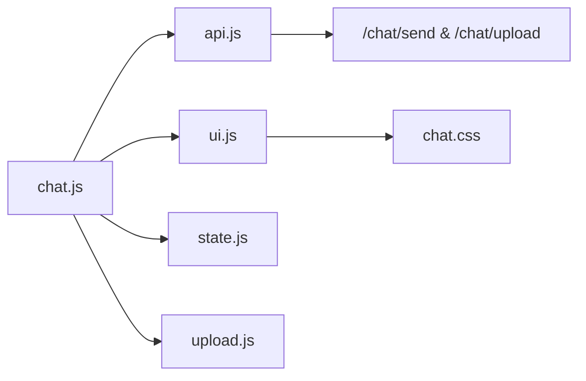

# 用户交互组件

<cite>
**本文引用的文件**
- [chat.html](file://src/main/resources/templates/chat.html)
- [chat.js](file://src/main/resources/static/scripts/chat.js)
- [upload.js](file://src/main/resources/static/scripts/modules/upload.js)
- [state.js](file://src/main/resources/static/scripts/state.js)
- [api.js](file://src/main/resources/static/scripts/api.js)
- [ui.js](file://src/main/resources/static/scripts/modules/ui.js)
- [chat.css](file://src/main/resources/static/styles/modules/chat.css)
- [ChatController.java](file://src/main/java/com/skloda/agentscope/controller/ChatController.java)
</cite>

## 目录
1. [简介](#简介)
2. [项目结构](#项目结构)
3. [核心组件](#核心组件)
4. [架构总览](#架构总览)
5. [详细组件分析](#详细组件分析)
6. [依赖关系分析](#依赖关系分析)
7. [性能考量](#性能考量)
8. [故障排查指南](#故障排查指南)
9. [结论](#结论)

## 简介
本组件文档聚焦前端“用户交互组件”的实现与最佳实践，覆盖以下能力：
- 输入框自适应高度、快捷键（Enter发送、Shift+换行）、防抖与体验优化
- 文件拖拽与上传、多格式校验、进度反馈、错误处理
- 多模态输入处理（图片预览、音频录制/播放、文件选择交互）
- 实时状态管理（流式响应指示器、连接状态监控、取消请求）
- 可访问性保障（屏幕阅读器支持、焦点管理、ARIA属性）
- 错误边界与用户提示机制

## 项目结构
该聊天界面的主体为模板页与一组前端模块脚本：
- 页面入口与布局：chat.html
- 主交互与控制流：chat.js（键盘事件、消息发送、SSE接收、多模态payload组装）
- 上传与预览：modules/upload.js（文件选择、类型校验、上传接口调用、智能体切换建议弹窗）
- 全局状态：state.js（窗口级共享状态、getter/setter封装）
- API抽象：api.js（SSE解析、文件上传、会话与知识文档等接口）
- UI渲染：modules/ui.js（消息气泡、思考框、流式内容更新）
- 样式：styles/modules/chat.css（消息气泡、打字机动画、思考框、滚动行为等）

**图表来源**
- [chat.html:1-95](file://src/main/resources/templates/chat.html#L1-L95)
- [chat.js:11-120](file://src/main/resources/static/scripts/chat.js#L11-L120)
- [api.js:1-41](file://src/main/resources/static/scripts/api.js#L1-L41)
- [upload.js:1-111](file://src/main/resources/static/scripts/modules/upload.js#L1-L111)
- [ChatController.java:117-153](file://src/main/java/com/skloda/agentscope/controller/ChatController.java#L117-L153)

**章节来源**
- [chat.html:18-95](file://src/main/resources/templates/chat.html#L18-L95)
- [chat.js:11-120](file://src/main/resources/static/scripts/chat.js#L11-L120)
- [upload.js:21-111](file://src/main/resources/static/scripts/modules/upload.js#L21-L111)
- [api.js:1-41](file://src/main/resources/static/scripts/api.js#L1-L41)
- [ChatController.java:117-153](file://src/main/java/com/skloda/agentscope/controller/ChatController.java#L117-L153)

## 核心组件
- 输入框与键盘事件
  - Enter发送：当按下Enter且未同时按下Shift时，阻止默认换行并触发发送。[chat.js:12-17]
  - 自适应高度：在input事件中重置高度并按scrollHeight动态扩展，限制最大高度为120px以避免无限增长。[chat.js:19-22]
  - 用户体验优化：在清空输入后恢复初始高度；发送前隐藏空态提示。[chat.js:24-45]
- 实时流式响应
  - SSE解析器：基于文本分片缓存与行分割实现SSE事件提取（event/data）。[api.js:1-25]
  - 打字机指示器：首次SSE读取后保留指示器，直到首个“可见内容”事件出现才移除，避免空白期。[chat.js:121-176]
  - 状态管理：isStreaming标记当前是否处于流式处理中；currentAbortController提供取消能力。[state.js:4-5]
- 文件上传与多模态
  - 文件选择：点击按钮触发隐藏input的click，绑定change事件处理选中文件。[upload.js:5-19]
  - 类型校验：按扩展名判断文档/图片/音频三类，拒绝不合法类型。[upload.js:31-44]
  - 上传流程：调用api.uploadFile()，成功后根据类型设置上传对象并显示标签/预览，必要时弹出“建议切换智能体”弹窗。[upload.js:46-109]
  - 多模态payload：将文件路径、文件名及图片/音频数组附加到发送请求体。[chat.js:81-104]
- 界面与可访问性
  - 消息气泡：区分用户与代理侧视觉样式，富文本使用Markdown渲染。[ui.js:15-115; chat.css:31-118]
  - 时间戳与滚动：为每条消息添加时间信息并自动滚动到底部。[ui.js:100-113]
  - ARIA与辅助：建议为关键控件提供aria-label、role和焦点顺序管理，提升屏幕阅读器友好度。
  - 错误提示：网络或解析异常时在聊天区追加错误消息，终止当前轮次。[chat.js:113-119]

**章节来源**
- [chat.js:12-45](file://src/main/resources/static/scripts/chat.js#L12-L45)
- [api.js:1-25](file://src/main/resources/static/scripts/api.js#L1-L25)
- [state.js:4-5](file://src/main/resources/static/scripts/state.js#L4-L5)
- [upload.js:21-111](file://src/main/resources/static/scripts/modules/upload.js#L21-L111)
- [ui.js:15-115](file://src/main/resources/static/scripts/modules/ui.js#L15-L115)
- [chat.css:31-118](file://src/main/resources/static/styles/modules/chat.css#L31-L118)

## 架构总览
从用户操作到后台处理的端到端时序如下：

**图表来源**
- [chat.js:78-176](file://src/main/resources/static/scripts/chat.js#L78-L176)
- [api.js:1-25](file://src/main/resources/static/scripts/api.js#L1-L25)
- [ChatController.java:117-153](file://src/main/java/com/skloda/agentscope/controller/ChatController.java#L117-L153)

## 详细组件分析

### 输入框自适应高度与快捷键
- 监听input事件，重置高度并基于scrollHeight自适应，使用Math.min限制最大高度以维持界面稳定。[chat.js:19-22]
- 键盘组合键：Enter无修饰触发发送；Shift+Enter用于插入换行符（浏览器默认行为保持），符合常见编辑器交互模型。[chat.js:12-17]
- 体验优化：发送前清空输入与文件占位区，重置textarea高度；发送时禁用发送按钮可避免重复提交（由上层逻辑控制）。[chat.js:24-45]

**图表来源**
- [chat.js:12-22](file://src/main/resources/static/scripts/chat.js#L12-L22)
- [chat.css:127-166](file://src/main/resources/static/styles/modules/chat.css#L127-L166)

**章节来源**
- [chat.js:12-22](file://src/main/resources/static/scripts/chat.js#L12-L22)
- [chat.css:127-166](file://src/main/resources/static/styles/modules/chat.css#L127-L166)

### 文件拖拽与上传全流程
- 触发与绑定：通过按钮触发隐藏的file input点击，并监听change事件进入处理函数。[upload.js:5-19]
- 类型校验：依据扩展名判定doc/pix/audio三类，不匹配则丢弃文件选择并恢复输入状态。[upload.js:31-44]
- 上传调用：构造FormData并POST至/chat/upload，成功返回{fileId, fileName, filePath}。[api.js:27-41; upload.js:46-49]
- 结果处理与提示：
  - 文档：展示文件标签，并检测当前智能体是否具备文档技能，若不具备则弹出“切换建议”弹窗。[upload.js:56-74]
  - 图片：生成缩略/链接预览，并在当前智能体不支持视觉能力时建议切换。[upload.js:75-89]
  - 音频：生成音频控件，并在当前智能体不支持音频时建议切换。[upload.js:90-104]
- 失败处理：捕获并记录服务器错误或网络异常，保持输入框可用。[upload.js:106-110]

**图表来源**
- [upload.js:5-111](file://src/main/resources/static/scripts/modules/upload.js#L5-L111)
- [api.js:27-41](file://src/main/resources/static/scripts/api.js#L27-L41)

**章节来源**
- [upload.js:21-111](file://src/main/resources/static/scripts/modules/upload.js#L21-L111)
- [api.js:27-41](file://src/main/resources/static/scripts/api.js#L27-L41)

### 多模态输入处理
- 图片：上传成功后加入数组并生成列表预览；消息中引用下载URL进行展示；点击可放大查看。[ui.js:47-62]
- 音频：上传完成后生成audio元素与标签；消息区域显示音频播放器，便于回放。[ui.js:64-77]
- 文档：以标签形式展示文件名并提供删除操作；发送时将filePath/fileName随消息一起提交。[upload.js:113-149; chat.js:81-92]
- 智能体适配：根据上传类型检查当前智能体的能力（skills/modality），不支持则提示切换目标智能体，增强交互顺畅度。[upload.js:61-104]

**章节来源**
- [ui.js:47-77](file://src/main/resources/static/scripts/modules/ui.js#L47-L77)
- [upload.js:61-104](file://src/main/resources/static/scripts/modules/upload.js#L61-L104)
- [chat.js:81-92](file://src/main/resources/static/scripts/chat.js#L81-L92)

### 实时状态管理与流式响应
- SSE解析：分块缓冲累积并按行拆分，识别event/data字段，遇到空行即触发回调输出事件对象。[api.js:1-25]
- 指示器生命周期：首次HTTP响应到达后保留三点跳动指示器，直至收到首个可渲染内容事件（thinking/reasoning_text/tool_start/text等）再移除，解决“真空期”。[chat.js:121-176]
- 取消请求：每个请求创建AbortController实例，可通过外部动作中止，释放资源并停止读流。[chat.js:79]
- 会话状态：isStreaming标志保护发送流程不被重复触发，结合messageCount与round追踪保证界面一致。[state.js:4-5; chat.js:24-59]

**图表来源**
- [api.js:1-25](file://src/main/resources/static/scripts/api.js#L1-L25)
- [chat.js:129-176](file://src/main/resources/static/scripts/chat.js#L129-L176)

**章节来源**
- [api.js:1-25](file://src/main/resources/static/scripts/api.js#L1-L25)
- [chat.js:121-176](file://src/main/resources/static/scripts/chat.js#L121-L176)
- [state.js:4-5](file://src/main/resources/static/scripts/state.js#L4-L5)

### 可访问性（A11y）保障
- 屏幕阅读器：为关键交互元素（发送按钮、上传按钮、文件标签关闭等）提供语义化标签（如aria-label、title），确保读屏设备能正确描述用途。[chat.html:70-75; upload.js:113-149]
- 焦点管理：对话框与弹窗出现时聚焦到可控元素，关闭后恢复焦点；输入框在发送后应保持可编辑状态。[upload.js:157-200; chat.js:24-45]
- 对比与可读性：主题色与文案对比度需满足无障碍标准；富文本消息应避免过度颜色滥用。[chat.css:31-118]
- 键盘导航：确保所有功能均可通过键盘完成（Tab、Enter、Esc等），减少鼠标依赖。

[本节为概念性指导，未直接分析特定文件]

### 错误边界与提示
- 请求阶段错误：HTTP响应非2xx时追加错误消息、结束本轮、重置流状态。[chat.js:113-119]
- 上传阶段错误：捕获异步异常并记录日志，保留UI可用性以便重试或重新选择。[upload.js:106-110]
- 解析阶段错误：SSE data解析失败时打印错误并跳过，避免阻断后续事件处理。[chat.js:137-145]
- 服务侧容错：后端对序列化失败等异常情况返回统一的error事件，前端据此给出明确提示。[ChatController.java:77-113]

**章节来源**
- [chat.js:113-145](file://src/main/resources/static/scripts/chat.js#L113-L145)
- [upload.js:106-110](file://src/main/resources/static/scripts/modules/upload.js#L106-L110)
- [ChatController.java:77-113](file://src/main/java/com/skloda/agentscope/controller/ChatController.java#L77-L113)

## 依赖关系分析
- 模块耦合关系
  - chat.js作为编排层，依赖api.js（SSE与API）、modules/ui.js（渲染）、state.js（状态）、modules/upload.js（上传）
  - api.js统一封装SSE解析与网络请求，降低业务逻辑耦合
  - ui.js专注DOM与渲染，职责单一，高内聚
  - state.js集中暴露可跨模块读写的全局状态
- 前后端契约
  - 前端POST /chat/send JSON负载包含消息与多模态信息；后端以SSE流返回事件
  - 前端POST /chat/upload multipart表单，服务端保存文件并返回标识

**图表来源**
- [chat.js:1-9](file://src/main/resources/static/scripts/chat.js#L1-L9)
- [api.js:1-41](file://src/main/resources/static/scripts/api.js#L1-L41)
- [ui.js:1-15](file://src/main/resources/static/scripts/modules/ui.js#L1-L15)
- [state.js:1-24](file://src/main/resources/static/scripts/state.js#L1-L24)
- [upload.js:1-19](file://src/main/resources/static/scripts/modules/upload.js#L1-L19)
- [ChatController.java:117-153](file://src/main/java/com/skloda/agentscope/controller/ChatController.java#L117-L153)

**章节来源**
- [chat.js:1-9](file://src/main/resources/static/scripts/chat.js#L1-L9)
- [api.js:1-41](file://src/main/resources/static/scripts/api.js#L1-L41)
- [ui.js:1-15](file://src/main/resources/static/scripts/modules/ui.js#L1-L15)
- [state.js:1-24](file://src/main/resources/static/scripts/state.js#L1-L24)
- [upload.js:1-19](file://src/main/resources/static/scripts/modules/upload.js#L1-L19)
- [ChatController.java:117-153](file://src/main/java/com/skloda/agentscope/controller/ChatController.java#L117-L153)

## 性能考量
- 输入框高度计算采用最小阈值限制，避免频繁reflow导致的性能问题（限制最大高度120px）。[chat.js:21-22]
- SSE流读取使用TextDecoder与缓存buffer，逐行解析，内存占用线性增长且易于及时释放。[api.js:1-25]
- DOM操作批量化与按需更新：仅在必要的事件触发时更新指示器与消息气泡，减少重排。[chat.js:129-176; ui.js:100-113]
- 文件大小与类型限制在前端预先过滤，降低无效传输。[upload.js:31-44]
- 建议使用节流/防抖避免密集事件导致过多重绘（如快速输入场景）。[通用建议]

[本节提供一般性指导，不直接分析具体代码段]

## 故障排查指南
- 无法发送消息
  - 确认消息非空或附带媒体；检查isStreaming是否被误置为true。[chat.js:24-27]
  - 检查网络连接与后端是否返回非2xx响应。[chat.js:113-119]
- 附件上传失败
  - 确认扩展名是否在允许范围内；查看控制台错误与服务器日志。[upload.js:31-44; 106-110]
- 流卡死或指示器不消失
  - 确认首个“内容类”事件是否到达；观察调试面板时间线是否正常推进。[chat.js:121-176]
- 取消请求
  - 触发AbortController中断读流，确保UI恢复到非流状态。[chat.js:79; state.js:4-5]

**章节来源**
- [chat.js:24-27](file://src/main/resources/static/scripts/chat.js#L24-L27)
- [chat.js:113-119](file://src/main/resources/static/scripts/chat.js#L113-L119)
- [upload.js:31-44](file://src/main/resources/static/scripts/modules/upload.js#L31-L44)
- [upload.js:106-110](file://src/main/resources/static/scripts/modules/upload.js#L106-L110)
- [chat.js:121-176](file://src/main/resources/static/scripts/chat.js#L121-L176)
- [chat.js:79](file://src/main/resources/static/scripts/chat.js#L79)
- [state.js:4-5](file://src/main/resources/static/scripts/state.js#L4-L5)

## 结论
该用户交互组件通过模块化设计与清晰的职责划分，实现了高效的输入处理、稳定的多模态上传与流式响应的可视化呈现。关键点包括：
- 自适应输入框与合理快捷键约定，提升输入效率
- 严格的前端文件类型校验与友好的智能体切换建议，保障工作流顺畅
- 细粒度的SSE事件处理策略，消除“响应真空”，提供良好实时感知
- 完善的状态管理与错误边界，增强鲁棒性与可维护性
- 面向可访问性的改进建议，持续提升产品包容性

建议在后续迭代中补充：
- 更完备的键盘导航与焦点管理
- 可配置化的自定义快捷键映射
- 拖拽事件统一处理与更丰富的上传进度反馈

[本节为总结性内容，不涉及具体文件分析]