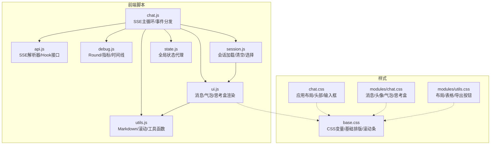
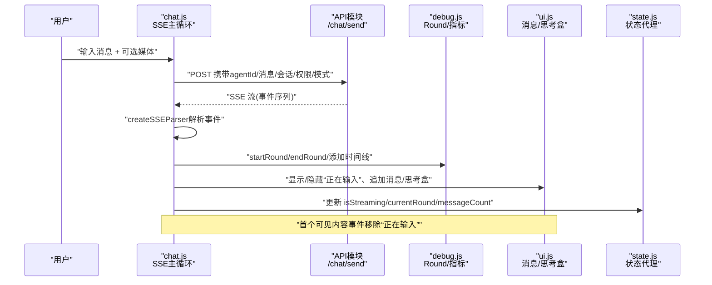
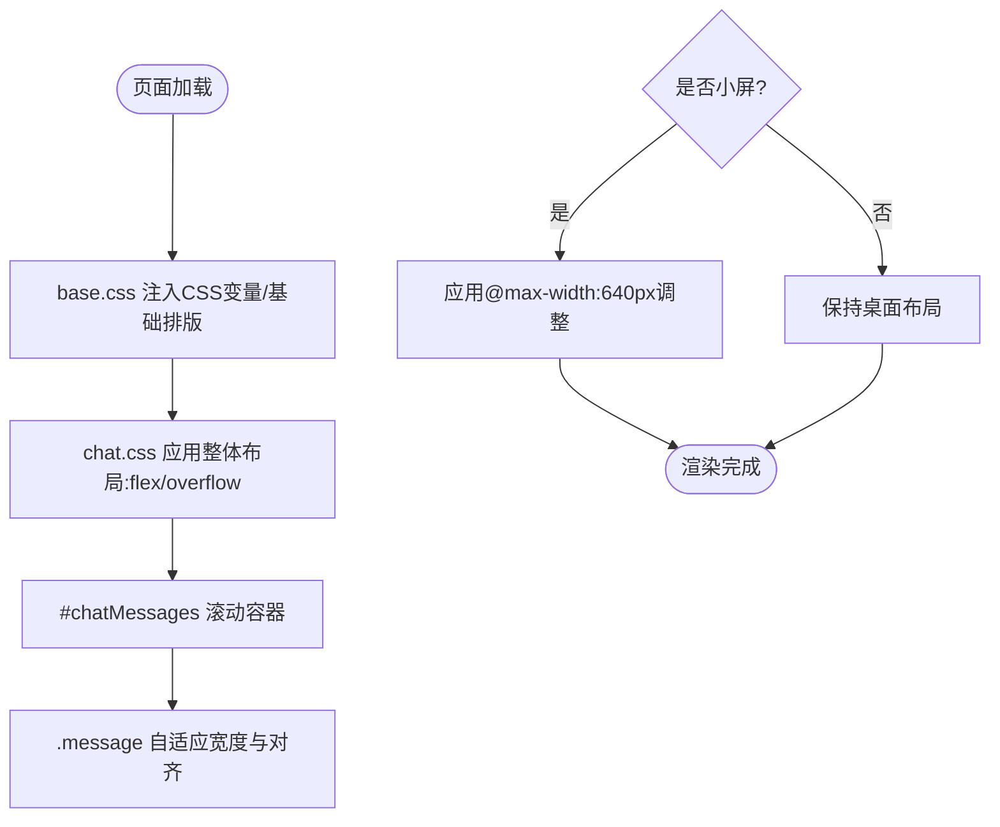
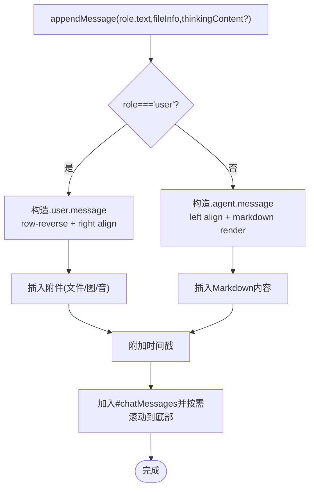
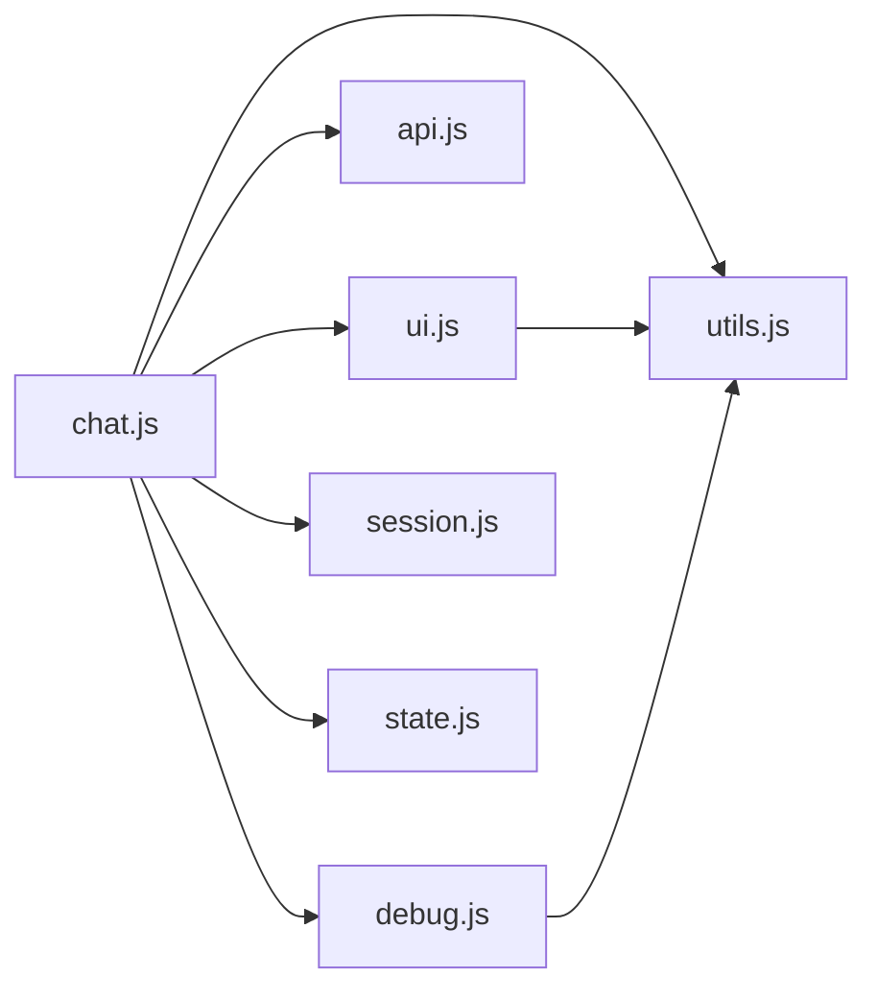

# 聊天界面布局

<cite>
**本文引用的文件**
- [chat.js](file://src/main/resources/static/scripts/chat.js)
- [state.js](file://src/main/resources/static/scripts/state.js)
- [api.js](file://src/main/resources/static/scripts/api.js)
- [utils.js](file://src/main/resources/static/scripts/modules/utils.js)
- [ui.js](file://src/main/resources/static/scripts/modules/ui.js)
- [debug.js](file://src/main/resources/static/scripts/modules/debug.js)
- [session.js](file://src/main/resources/static/scripts/modules/session.js)
- [base.css](file://src/main/resources/static/styles/base.css)
- [chat.css](file://src/main/resources/static/styles/chat.css)
- [modules/chat.css](file://src/main/resources/static/styles/modules/chat.css)
- [modules/utils.css](file://src/main/resources/static/styles/modules/utils.css)
</cite>

## 目录
1. [简介](#简介)
2. [项目结构](#项目结构)
3. [核心组件](#核心组件)
4. [架构总览](#架构总览)
5. [详细组件分析](#详细组件分析)
6. [依赖分析](#依赖分析)
7. [性能考量](#性能考量)
8. [故障排查](#故障排查)
9. [结论](#结论)
10. [附录](#附录)

## 简介
本文件聚焦于本项目前端“聊天界面”的布局系统，覆盖响应式布局适配、消息气泡定位与渲染、滚动与增量渲染、主题系统与深色模式、状态管理与持久化、无障碍访问和键盘导航。文档基于仓库中的前端源码与样式进行结构化梳理，并以图示的方式解释关键流程与数据流。

## 项目结构
聊天界面由以下主要模块构成：
- 主入口脚本：负责接收SSE事件、驱动界面更新、处理多模态输入和会话生命周期
- UI渲染模块：创建消息、头像、时间戳、思考盒、媒体元素等DOM
- 工具模块：Markdown渲染、HTML转义、滚动到底部、时间/时长格式化等
- API模块：封装HTTP与上传调用、SSE解析器
- 调试与可观测性：轮次（round）管理、指标统计、时间线记录
- 样式体系：主题变量、基座样式、模块样式、响应式断点与动画

图表来源
- [chat.js:1-40](file://src/main/resources/static/scripts/chat.js#L1-L40)
- [ui.js:14-115](file://src/main/resources/static/scripts/modules/ui.js#L14-L115)
- [utils.js:1-46](file://src/main/resources/static/scripts/modules/utils.js#L1-L46)
- [api.js:1-25](file://src/main/resources/static/scripts/api.js#L1-L25)
- [debug.js:1-61](file://src/main/resources/static/scripts/modules/debug.js#L1-L61)
- [base.css:8-63](file://src/main/resources/static/styles/base.css#L8-L63)

章节来源
- [chat.js:1-120](file://src/main/resources/static/scripts/chat.js#L1-L120)
- [ui.js:1-181](file://src/main/resources/static/scripts/modules/ui.js#L1-L181)
- [utils.js:1-226](file://src/main/resources/static/scripts/modules/utils.js#L1-L226)
- [api.js:1-124](file://src/main/resources/static/scripts/api.js#L1-L124)
- [debug.js:1-201](file://src/main/resources/static/scripts/modules/debug.js#L1-L201)
- [base.css:1-143](file://src/main/resources/static/styles/base.css#L1-L143)

## 核心组件
- 主事件处理器（chat.js）
  - 负责构建请求体（含会话、用户、执行模式、权限模式、会话类型等上下文），发起POST至后端
  - 建立ReadableStream读取SSE，并使用SSE解析器将数据块转换为事件对象
  - 对消息可见性事件做节流：首次渲染真实内容时移除“正在输入”指示器，避免空白期
  - 统一分派多种业务事件（agent开始/结束、工具调用、推理、文本片段、完成/错误/待批准等）并更新UI或调试面板
- UI渲染（ui.js）
  - appendMessage按角色（user/agent）创建message容器、头像、时间戳和内容气泡
  - 用户消息支持附件列表、图片与音频渲染；agent消息以Markdown渲染，兼容代码高亮与结构化数据展示
  - 思考盒（thinking box）在流式输出期间动态展开/折叠，并自动清理不可见碎片标记
- 工具库（utils.js）
  - Markdown配置与渲染管线，支持JSON结构化数据的表格化和导出
  - 安全转义、滚动到底部、时间/时长格式化
- API层（api.js）
  - createSSEParser维护缓冲与按行解析data/event字段，遇到空行触发onEvent回调
  - 提供uploadFile、fetchAgents、会话CRUD、知识文档管理、技能/工具信息等接口
- 调试与会话（debug.js / session.js）
  - round生命周期：开始、记录指标、时间线节点、收尾与状态收敛
  - 会话管理：加载会话列表、切换会话、清空聊天记录、恢复历史消息到聊天区
- 状态代理（state.js）
  - 通过getter/setter在window上暴露全局状态，集中维护当前agent、是否流式、AbortController、消息计数、媒体引用、Round集合、当前Round等

章节来源
- [chat.js:24-206](file://src/main/resources/static/scripts/chat.js#L24-L206)
- [ui.js:14-248](file://src/main/resources/static/scripts/modules/ui.js#L14-L248)
- [utils.js:32-226](file://src/main/resources/static/scripts/modules/utils.js#L32-L226)
- [api.js:1-124](file://src/main/resources/static/scripts/api.js#L1-L124)
- [debug.js:5-201](file://src/main/resources/static/scripts/modules/debug.js#L5-L201)
- [state.js:2-164](file://src/main/resources/static/scripts/state.js#L2-L164)
- [session.js:6-168](file://src/main/resources/static/scripts/modules/session.js#L6-L168)

## 架构总览
聊天界面采用“主循环 + 模块化渲染 + CSS变量主题”的设计。SSE事件是唯一的实时数据源，事件在chat.js中解复用为语义化动作，驱动UI与调试区域同步更新。样式方面通过CSS变量实现主题与深浅色统一控制。

图表来源
- [chat.js:106-206](file://src/main/resources/static/scripts/chat.js#L106-L206)
- [ui.js:14-181](file://src/main/resources/static/scripts/modules/ui.js#L14-L181)
- [debug.js:5-112](file://src/main/resources/static/scripts/modules/debug.js#L5-L112)
- [state.js:2-164](file://src/main/resources/static/scripts/state.js#L2-L164)

## 详细组件分析

### 响应式设计与布局适配
- 视口与基础尺寸
  - 根容器限制html/body高度与overflow: hidden，确保应用级布局固定，内部使用flex分区布局
  - 标题栏、聊天主体、输入区使用flex分列，保证自适应宽度与可伸缩内容
- 聊天区域与消息容器
  - #chatMessages采用flex纵向堆叠+gap间距，设置overflow-y: auto用于滚动承载长对话
  - .message默认max-width: 80%，配合row-reverse实现用户消息靠右布局
- 移动端优化
  - 仅有一个@media(max-width:640px)的小屏断点，针对小屏幕调整部分布局行为与内边距（依据样式文件断点位置）
  - 输入框高度使用scrollHeight与最大高度钳制，避免在小屏下溢出
- 结构与样式分离
  - base.css定义CSS变量、基础排版与滚动条样式；chat.css组织应用级布局；modules/chat.css细化消息气泡、头像与思考盒样式

图表来源
- [base.css:1-143](file://src/main/resources/static/styles/base.css#L1-L143)
- [chat.css:15-196](file://src/main/resources/static/styles/chat.css#L15-L196)
- [modules/chat.css:1-166](file://src/main/resources/static/styles/modules/chat.css#L1-L166)

章节来源
- [base.css:1-143](file://src/main/resources/static/styles/base.css#L1-L143)
- [chat.css:15-196](file://src/main/resources/static/styles/chat.css#L15-L196)
- [modules/chat.css:1-206](file://src/main/resources/static/styles/modules/chat.css#L1-L206)

### 消息气泡定位与宽度算法
- 左右对齐逻辑
  - 用户消息.message.user使用flex-direction: row-reverse与margin-left: auto实现右侧对齐
  - 助手消息.message.agent默认左对齐
- 自适应宽度与换行
  - .message-bubble设置word-wrap: break-word与white-space: pre-wrap，允许长文本自然换行
  - Markdown渲染后.bubble.md-render重置为normal排版，便于内容正常流动
- 时间与附件
  - message-time置于bubble下方，附加的文件/图片或音频按条件插入到content容器中
- 思考盒协作
  - 当启用“思考”时，先创建thinking-box包装，再追加思考内容与最终结果，交互时可折叠/展开

图表来源
- [ui.js:14-181](file://src/main/resources/static/scripts/modules/ui.js#L14-L181)
- [modules/chat.css:31-118](file://src/main/resources/static/styles/modules/chat.css#L31-L118)
- [base.css:107-130](file://src/main/resources/static/styles/base.css#L107-L130)

章节来源
- [ui.js:14-181](file://src/main/resources/static/scripts/modules/ui.js#L14-L181)
- [modules/chat.css:31-118](file://src/main/resources/static/styles/modules/chat.css#L31-L118)

### 滚动容器的性能策略与内存防护
- 滚动与可视增量更新
  - #chatMessages使用overflow-y: auto；每次新增消息或思考盒内容后调用scrollToBottom以保持最新消息可见
  - 对高频追加场景（流式文本/工具调用）使用滚动至底部策略，未引入虚拟滚动但尽量合并DOM操作
- 增量渲染
  - 思考盒通过逐段追加内容并清理__fragment__标记，逐步呈现内容，减少重排次数
  - 仅在首个包含“可见内容”的事件上移除“正在输入”指示器，提升感知性能
- 内存泄漏防护
  - 会话切换或清空时，clearChatArea会清空聊天DOM、重置状态标志、释放媒体与Round相关引用，防止游离引用累积
  - 中止机制：删除/切换会话时若处于流式中，会尝试中止AbortController并复位isStreaming，避免残留请求持有DOM引用

章节来源
- [ui.js:117-181](file://src/main/resources/static/scripts/modules/ui.js#L117-L181)
- [utils.js:220-226](file://src/main/resources/static/scripts/modules/utils.js#L220-L226)
- [session.js:72-147](file://src/main/resources/static/scripts/modules/session.js#L72-L147)
- [chat.js:24-120](file://src/main/resources/static/scripts/chat.js#L24-L120)

### 主题系统架构与深色模式
- CSS变量为中心的主题体系
  - base.css的:root集中声明背景、文字、霓虹描边、间距、字体等变量
  - 所有模块样式通过var(--xx)消费这些变量，形成统一的视觉语言
- 深色模式
  - 当前实现采用固定的赛博朋克深色系主题（暗底亮色高光），未在JS中实现运行时开关切换
- 自定义主题
  - 通过覆盖:root中的CSS变量即可快速定制整体配色与风格，无需改动组件样式
  - 建议在base.css顶部维护主题块，便于维护与回滚

章节来源
- [base.css:8-63](file://src/main/resources/static/styles/base.css#L8-L63)
- [base.css:107-143](file://src/main/resources/static/styles/base.css#L107-L143)

### 界面状态管理与会话持久化
- 集中状态代理
  - state.js通过Object.defineProperty在window上定义getter/setter，保证多处读取/写入一致性，包含isStreaming、currentRound、rounds、消息计数、媒体等
- 会话状态管理
  - session.js负责会话列表加载、新建、删除、切换与清空，并在切会话时恢复agent历史消息
- 实时同步
  - chat.js根据SSE事件变更窗口状态（如isStreaming、currentRound、消息计数）并通过UI模块立即反映到界面，确保视图与状态一致

章节来源
- [state.js:2-164](file://src/main/resources/static/scripts/state.js#L2-L164)
- [session.js:6-168](file://src/main/resources/static/scripts/modules/session.js#L6-L168)
- [chat.js:24-120](file://src/main/resources/static/scripts/chat.js#L24-L120)

### 可访问性与键盘导航
- 语义元素与焦点
  - 输入框监听Enter键发送消息；按钮具备原生语义，便于键盘访问
- ARIA与无障碍标签
  - 对某些控件使用了aria-hidden等属性标识装饰性图标；对交互项提供可操作的button/div with onclick
- 实践建议
  - 可为关键交互元素增加tabindex与aria-label以提升键盘/读屏体验

章节来源
- [chat.js:11-22](file://src/main/resources/static/scripts/chat.js#L11-L22)
- [modules/chat.css:497-563](file://src/main/resources/static/styles/modules/chat.css#L497-L563)

## 依赖分析
- 模块依赖关系
  - chat.js依赖ui.js、utils.js、api.js、debug.js、session.js与state.js
  - ui.js依赖utils.js
  - debug.js依赖utils.js
  - api.js依赖SSE解析及HTTP接口
  - 样式层面base.css被chat.css与modules/*.css共同引用
- 外部资源
  - marked与highlight.js（通过vendor/js引入）用于Markdown与代码高亮

图表来源
- [chat.js:1-12](file://src/main/resources/static/scripts/chat.js#L1-L12)
- [ui.js:1-3](file://src/main/resources/static/scripts/modules/ui.js#L1-L3)
- [debug.js:1-3](file://src/main/resources/static/scripts/modules/debug.js#L1-L3)

章节来源
- [chat.js:1-206](file://src/main/resources/static/scripts/chat.js#L1-L206)
- [utils.js:1-226](file://src/main/resources/static/scripts/modules/utils.js#L1-L226)

## 性能考量
- 渲染性能
  - 使用单节点追加与批量innerHTML渲染结合的方式，降低频繁reflow影响
  - 思考盒采用增量追加，并过滤不可见的片段标记，提升大文本下的渲染效率
- 网络与I/O
  - SSE流式传输让首字节到达后即可逐步渲染，缩短首屏等待
  - 滚动控制在消息变更后按需滚动至底部，减少不必要的中间滚动抖动
- 内存管理
  - 会话切换/清除时主动清空DOM、重置状态与中断进行中请求，防止内存泄漏
  - 避免长时间持有废弃的AbortController或DOM引用

[本节提供通用指导，不直接分析具体文件]

## 故障排查
- 问题：进入对话后“正在输入”长时间不落
  - 现象：首个内容事件前不会移除指示器；若第一个事件仅为调试面板更新则不清除
  - 定位：chat.js中对“可见内容事件”判定后才移除，属于预期设计
- 问题：切换或删除会话后仍卡在流式状态
  - 现象：isStreaming仍为true
  - 修复：在删除/清空会话中显式中止AbortController并复位isStreaming与按钮状态
- 问题：消息超长导致布局溢出
  - 现象：横向滚动或撑破容器
  - 解决：检查message-bubble的换行规则与父容器宽度约束，确认Markdown内容的pre/code块正确滚动
- 问题：大量历史消息时滚动卡顿
  - 优化方向：考虑分页加载或虚拟滚动；目前实现按完整DOM渲染，适合中等体量对话

章节来源
- [chat.js:121-177](file://src/main/resources/static/scripts/chat.js#L121-L177)
- [session.js:72-119](file://src/main/resources/static/scripts/modules/session.js#L72-L119)
- [modules/chat.css:81-118](file://src/main/resources/static/styles/modules/chat.css#L81-L118)

## 结论
该聊天界面以SSE为核心数据通道，围绕状态代理与模块化渲染构建了可扩展的布局系统。通过CSS变量实现主题一致性，通过分段渲染与状态复位保障性能与内存安全。对于超大对话量场景可进一步优化为虚拟滚动与分页渲染，同时可补充运行时主题切换与更全面的可访问性增强。

[本节总结全文，不直接分析具体文件]

## 附录
- 关键CSS变量说明（节选）
  - 背景：--bg-void/--bg-card/--bg-input等
  - 霓虹强调：--neon-cyan/--neon-green/--neon-magenta等
  - 文本与状态：--text-primary/--text-muted/--status-* 
  - 边框与阴影：--border-dim/--glow-*
- 样式导入顺序
  - base.css为基础，chat.css汇总各模块样式；modules/*提供组件级样式

[本节提供辅助信息，不直接分析具体文件]