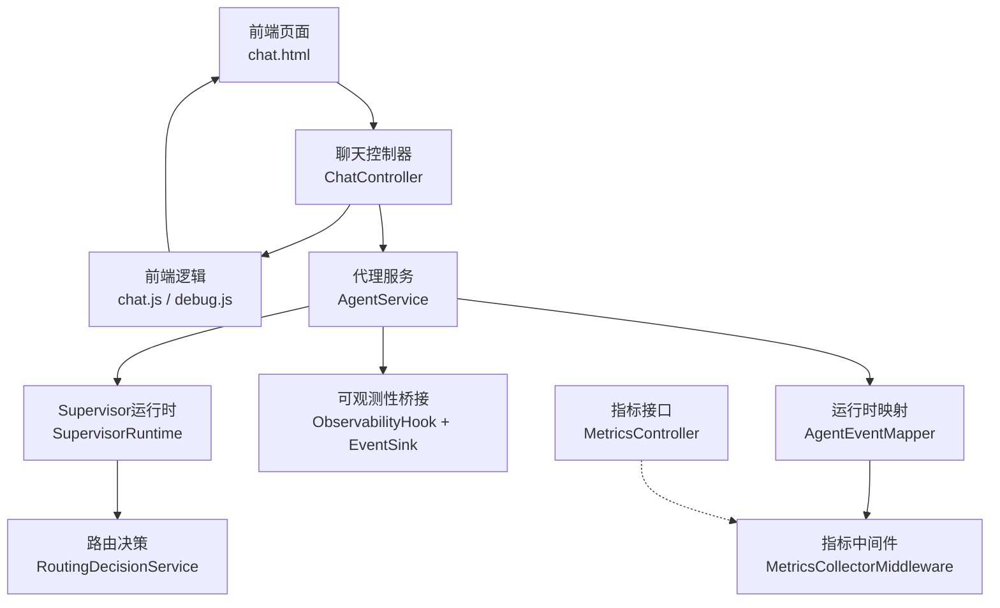
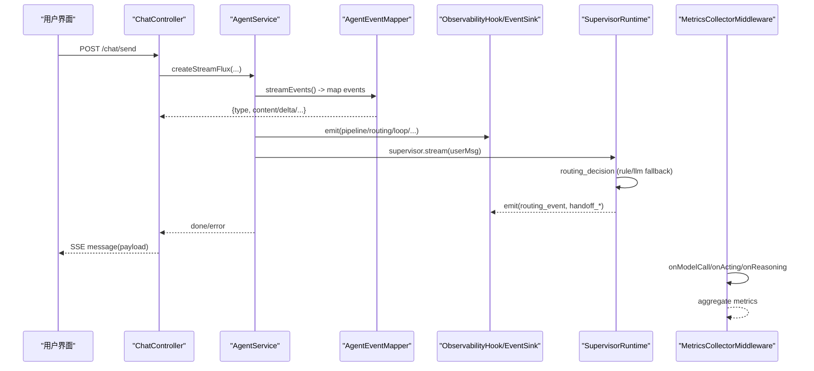
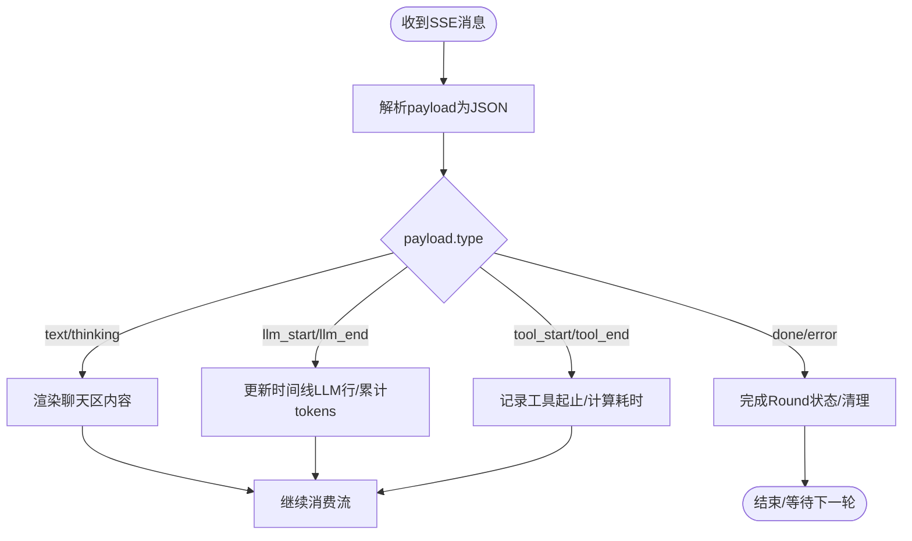
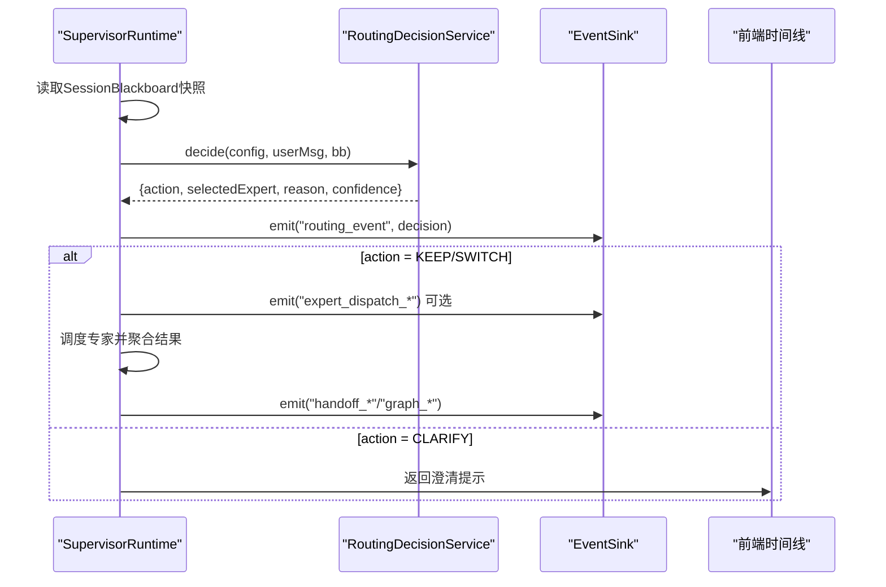
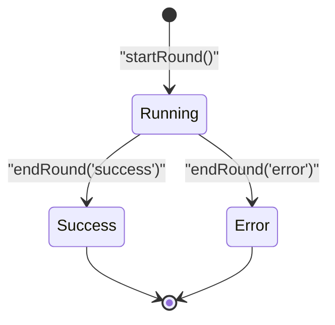
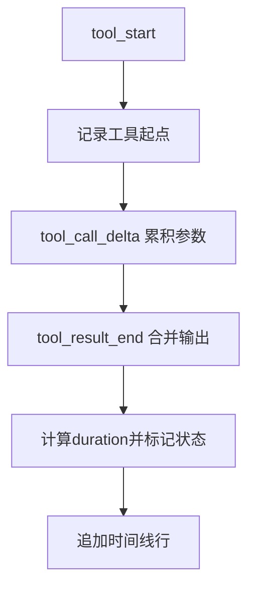
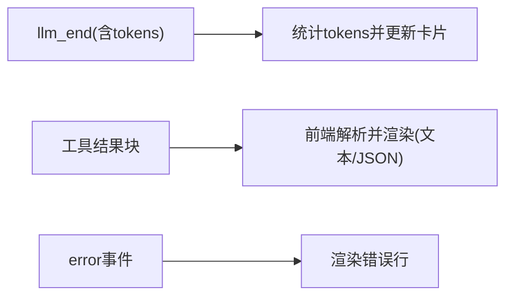
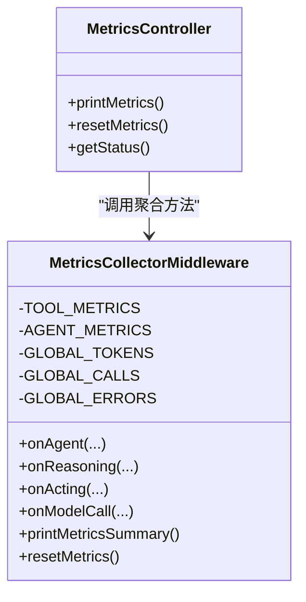
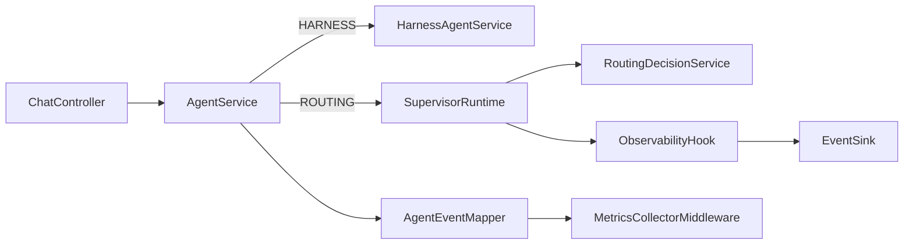

# 调试可视化面板

<cite>
**本文档引用的文件**
- [AgentEventMapper.java](file://src/main/java/com/skloda/agentscope/runtime/AgentEventMapper.java)
- [ChatController.java](file://src/main/java/com/skloda/agentscope/controller/ChatController.java)
- [MetricsCollectorMiddleware.java](file://src/main/java/com/skloda/agentscope/middleware/MetricsCollectorMiddleware.java)
- [ObservabilityHook.java](file://src/main/java/com/skloda/agentscope/hook/ObservabilityHook.java)
- [SupervisorRuntime.java](file://src/main/java/com/skloda/agentscope/blackboard/SupervisorRuntime.java)
- [RoutingDecisionService.java](file://src/main/java/com/skloda/agentscope/blackboard/RoutingDecisionService.java)
- [EventSink.java](file://src/main/java/com/skloda/agentscope/runtime/EventSink.java)
- [AgentService.java](file://src/main/java/com/skloda/agentscope/service/AgentService.java)
- [MetricsController.java](file://src/main/java/com/skloda/agentscope/controller/MetricsController.java)
- [debug.js](file://src/main/resources/static/scripts/modules/debug.js)
- [chat.js](file://src/main/resources/static/scripts/chat.js)
- [debug.css](file://src/main/resources/static/styles/modules/debug.css)
</cite>

## 目录
1. [引言](#引言)
2. [项目结构](#项目结构)
3. [核心组件](#核心组件)
4. [架构总览](#架构总览)
5. [详细组件分析](#详细组件分析)
6. [依赖关系分析](#依赖关系分析)
7. [性能考量](#性能考量)
8. [故障排查指南](#故障排查指南)
9. [结论](#结论)
10. [附录](#附录)（如有需要）

## 引言
本文件系统性梳理项目中“调试可视化面板”的实现原理与前端呈现机制，涵盖如下能力：
- SSE事件解析、分类与时间线展示
- 多智能体协作的可视化：流水线执行图、路由决策树、交接流程图
- Round运行状态的实时监控：开始/结束、时长统计、指标收集
- 工具调用过程的跟踪：参数展示、结果预览、错误堆栈显示
- 结构化输出可视化：JSON格式化、数据表格、图表生成
- 调试信息过滤与搜索：关键字筛选、类型过滤、时间范围选择
- 性能监控数据的采集与展示：响应时间、内存使用、并发数等

## 项目结构
后端以Spring WebFlux提供SSE流，通过AgentRuntime和AgentEventMapper将AgentScope的事件序列化为统一的SSE payload；中间层由Hooks、EventSink和Middleware完成多Agent事件汇聚与指标采集；前端模块以chat.js为核心调度器，结合modules/debug.js维护Round状态、时间线与指标卡片。样式由debug.css定义。

**图示来源**
- [ChatController.java:72-153](file://src/main/java/com/skloda/agentscope/controller/ChatController.java#L72-L153)
- [AgentService.java:120-177](file://src/main/java/com/skloda/agentscope/service/AgentService.java#L120-L177)
- [AgentEventMapper.java:64-104](file://src/main/java/com/skloda/agentscope/runtime/AgentEventMapper.java#L64-L104)
- [ObservabilityHook.java:30-67](file://src/main/java/com/skloda/agentscope/hook/ObservabilityHook.java#L30-L67)
- [SupervisorRuntime.java:134-156](file://src/main/java/com/skloda/agentscope/blackboard/SupervisorRuntime.java#L134-L156)
- [RoutingDecisionService.java:48-63](file://src/main/java/com/skloda/agentscope/blackboard/RoutingDecisionService.java#L48-L63)
- [MetricsCollectorMiddleware.java:50-161](file://src/main/java/com/skloda/agentscope/middleware/MetricsCollectorMiddleware.java#L50-L161)
- [MetricsController.java:19-56](file://src/main/java/com/skloda/agentscope/controller/MetricsController.java#L19-L56)

**章节来源**
- [ChatController.java:72-153](file://src/main/java/com/skloda/agentscope/controller/ChatController.java#L72-L153)
- [AgentService.java:120-177](file://src/main/java/com/skloda/agentscope/service/AgentService.java#L120-L177)
- [AgentEventMapper.java:64-104](file://src/main/java/com/skloda/agentscope/runtime/AgentEventMapper.java#L64-L104)
- [ObservabilityHook.java:30-67](file://src/main/java/com/skloda/agentscope/hook/ObservabilityHook.java#L30-L67)
- [SupervisorRuntime.java:134-156](file://src/main/java/com/skloda/agentscope/blackboard/SupervisorRuntime.java#L134-L156)
- [RoutingDecisionService.java:48-63](file://src/main/java/com/skloda/agentscope/blackboard/RoutingDecisionService.java#L48-L63)
- [MetricsCollectorMiddleware.java:50-161](file://src/main/java/com/skloda/agentscope/middleware/MetricsCollectorMiddleware.java#L50-L161)
- [MetricsController.java:19-56](file://src/main/java/com/skloda/agentscope/controller/MetricsController.java#L19-L56)

## 核心组件
- SSE事件映射：AgentEventMapper负责将AgentScope的原生事件统一成type字段区分的前端消息对象，如llm_start/llm_end、tool_start/tool_end、text、thinking等。
- 会话与流程控制：AgentService根据Agent类型与配置决定单Agent流、Harness流或Supervisor路由流。
- 多智能体协作：SupervisorRuntime串行化执行路由决策、专家调度、黑版块更新，并通过EventSink注入pipeline/routing/handoff/loop/graph等跨Agent事件。
- 可观测性指标：MetricsCollectorMiddleware在模型调用、推理、行动阶段采集耗时、Token、错误率，并提供控制台汇总；MetricsController暴露查询与重置接口。
- 前端渲染：chat.js解析SSE并根据payload.type分发到debug模块；debug.js维护Round生命期、时间线条目与指标卡片；debug.css实现视觉布局与动画。

**章节来源**
- [AgentEventMapper.java:64-204](file://src/main/java/com/skloda/agentscope/runtime/AgentEventMapper.java#L64-L204)
- [AgentService.java:84-177](file://src/main/java/com/skloda/agentscope/service/AgentService.java#L84-L177)
- [SupervisorRuntime.java:134-205](file://src/main/java/com/skloda/agentscope/blackboard/SupervisorRuntime.java#L134-L205)
- [EventSink.java:21-152](file://src/main/java/com/skloda/agentscope/runtime/EventSink.java#L21-L152)
- [MetricsCollectorMiddleware.java:21-161](file://src/main/java/com/skloda/agentscope/middleware/MetricsCollectorMiddleware.java#L21-L161)
- [MetricsController.java:19-56](file://src/main/java/com/skloda/agentscope/controller/MetricsController.java#L19-L56)
- [chat.js:129-177](file://src/main/resources/static/scripts/chat.js#L129-L177)
- [debug.js:1-177](file://src/main/resources/static/scripts/modules/debug.js#L1-L177)

## 架构总览
系统采用“后端SSE事件 + 前端实时渲染”的分层架构：
- 请求入口：ChatController接收用户消息并返回SSE流，流中包含生命周期、文本片段、工具调用、结构化结果等。
- 事件映射：AgentEventMapper将底层Agent事件转换为前端可识别的统一格式，屏蔽内部类型差异。
- 多Agent模式：AgentService路由到Harness或Supervisor；Supervisor基于Blackboard+RoutingDecisionService决定专家切换或澄清，并通过EventSink发布跨Agent事件。
- 指标采集：MetricsCollectorMiddleware监听推理/行动/模型调用，聚合耗时、Token、错误、成本估计，控制台打印并可被外部管理接口调用。
- 前端处理：chat.js维护当前Round状态，依据payload.type更新UI，并在首次可见内容到达时移除输入指示器。

**图示来源**
- [ChatController.java:122-153](file://src/main/java/com/skloda/agentscope/controller/ChatController.java#L122-L153)
- [AgentService.java:120-177](file://src/main/java/com/skloda/agentscope/service/AgentService.java#L120-L177)
- [AgentEventMapper.java:64-104](file://src/main/java/com/skloda/agentscope/runtime/AgentEventMapper.java#L64-L104)
- [ObservabilityHook.java:30-67](file://src/main/java/com/skloda/agentscope/hook/ObservabilityHook.java#L30-L67)
- [SupervisorRuntime.java:134-205](file://src/main/java/com/skloda/agentscope/blackboard/SupervisorRuntime.java#L134-L205)
- [RoutingDecisionService.java:48-137](file://src/main/java/com/skloda/agentscope/blackboard/RoutingDecisionService.java#L48-L137)
- [MetricsCollectorMiddleware.java:50-161](file://src/main/java/com/skloda/agentscope/middleware/MetricsCollectorMiddleware.java#L50-L161)

## 详细组件分析

### 事件追踪系统（SSE事件解析、类型分类、时间线展示）
- 事件源：AgentScope原生事件经AgentEventMapper映射为统一Map，包含type字段驱动前端分支渲染。
- 分类规则：文本/思考/模型调用/工具调用/结果/结束/错误等；部分边界事件（文本块开始/结束）被丢弃，避免干扰UI。
- 前端处理：chat.js对每个payload进行JSON解析，按type进入分支；typing indicator在首次出现对话内容事件时清除，保障首屏反馈。

**图示来源**
- [AgentEventMapper.java:64-104](file://src/main/java/com/skloda/agentscope/runtime/AgentEventMapper.java#L64-L104)
- [chat.js:129-204](file://src/main/resources/static/scripts/chat.js#L129-L204)
- [debug.js:174-204](file://src/main/resources/static/scripts/modules/debug.js#L174-L204)

**章节来源**
- [AgentEventMapper.java:64-204](file://src/main/java/com/skloda/agentscope/runtime/AgentEventMapper.java#L64-L204)
- [chat.js:129-204](file://src/main/resources/static/scripts/chat.js#L129-L204)
- [debug.js:174-204](file://src/main/resources/static/scripts/modules/debug.js#L174-L204)

### 多智能体协作可视化（流水线、路由、交接）
- SupervisorRuntime：以串行锁保证每次请求的路由、专家调度、黑版本块写入不竞态；发射supervisor_start、routing_event、专家调度相关事件至EventSink，进而由前端渲染为多Agent时间线。
- RoutingDecisionService：支持“rule”（默认）与“llm”策略；rule走关键词匹配与优先级（EXPLICIT > INTENT），在无匹配且defaultKeep=true时KEEP当前专家；否则可能CLARIFY或在首轮默认切换到第一个专家。
- EventSink：集中发布pipeline_*、routing_*、handoff_*、loop_*、graph_*、roundtable_*、task_*等事件类型，前端据此绘制执行图与决策树。

**图示来源**
- [SupervisorRuntime.java:134-205](file://src/main/java/com/skloda/agentscope/blackboard/SupervisorRuntime.java#L134-L205)
- [RoutingDecisionService.java:48-137](file://src/main/java/com/skloda/agentscope/blackboard/RoutingDecisionService.java#L48-L137)
- [EventSink.java:65-152](file://src/main/java/com/skloda/agentscope/runtime/EventSink.java#L65-L152)

**章节来源**
- [SupervisorRuntime.java:134-205](file://src/main/java/com/skloda/agentscope/blackboard/SupervisorRuntime.java#L134-L205)
- [RoutingDecisionService.java:48-137](file://src/main/java/com/skloda/agentscope/blackboard/RoutingDecisionService.java#L48-L137)
- [EventSink.java:65-152](file://src/main/java/com/skloda/agentscope/runtime/EventSink.java#L65-L152)

### Round运行状态实时监控（开始/结束、时长、指标）
- 前端Round模型：在debug.js中创建round对象，包含input/output tokens、totalTokens、llmTime、toolTime、status等；endRound完成时间戳、计算速度、关闭活跃状态行、更新指标卡片。
- 指标卡片：每轮摘要含模型名称、总tokens、LLM时长与次数、工具耗时与次数，以及可选speed（tokens/s）。
- 时间线：addTimelineRow系列方法构建一行事件，带connector/icon/label/metrics/status，滚动到底以保持实时感知。

**图示来源**
- [debug.js:1-177](file://src/main/resources/static/scripts/modules/debug.js#L1-L177)

**章节来源**
- [debug.js:1-177](file://src/main/resources/static/scripts/modules/debug.js#L1-L177)

### 工具调用过程跟踪（参数、结果预览、错误堆栈）
- AgentEventMapper工具流：tool_start携带name与id；tool_call_delta可携带增量参数文本；tool_result相关事件组合最终输出。
- 错误处理：当映射异常时，Mapper返回标准error型payload，便于前端统一渲染错误行。
- 前端细节：chat.js对tool_start/tool_end事件打点输出；时间线行可按status标记成功/失败，便于快速定位问题调用。

**图示来源**
- [AgentEventMapper.java:174-204](file://src/main/java/com/skloda/agentscope/runtime/AgentEventMapper.java#L174-L204)
- [chat.js:147-204](file://src/main/resources/static/scripts/chat.js#L147-L204)

**章节来源**
- [AgentEventMapper.java:174-204](file://src/main/java/com/skloda/agentscope/runtime/AgentEventMapper.java#L174-L204)
- [chat.js:147-204](file://src/main/resources/static/scripts/chat.js#L147-L204)

### 结构化输出可视化（JSON、表格、图表）
- 后端：AgentEventMapper在llm_end事件上附带input/output/total tokens，便于前端统计；工具结果可由ToolResult相关事件传递结构化数据片段。
- 前端：chat.js负责将不同payload类型映射到相应可视化区域，例如文本区块用于对话气泡、delta事件用于流式补充、错误事件渲染为错误条。
- 拓展建议：对于更复杂结构化输出，可在前端侧引入轻量级渲染（例如将JSON字符串转为可折叠对象、或解析特定Schema生成表格/简单折线图）。

**图示来源**
- [AgentEventMapper.java:158-170](file://src/main/java/com/skloda/agentscope/runtime/AgentEventMapper.java#L158-L170)
- [chat.js:178-204](file://src/main/resources/static/scripts/chat.js#L178-L204)

**章节来源**
- [AgentEventMapper.java:158-170](file://src/main/java/com/skloda/agentscope/runtime/AgentEventMapper.java#L158-L170)
- [chat.js:178-204](file://src/main/resources/static/scripts/chat.js#L178-L204)

### 调试信息过滤与搜索（关键字、类型、时间范围）
- 当前实现层面：前端维护rounds数组与currentRound，具备clearDebug、toggleDebug等基础能力；日志级别可通过agentStart/agentEnd等事件做最小可见度控制。
- 建议增强：
  - 关键字筛选：对payload.content/payload.toolName/payload.reason字段进行模糊匹配过滤。
  - 类型过滤：增加checkbox组（llm/tool/action/error/lifecycle）仅显示指定类型的事件行。
  - 时间范围：以startTime/endTime为基础实现时间段过滤与高亮慢调用。

**章节来源**
- [debug.js:1-177](file://src/main/resources/static/scripts/modules/debug.js#L1-L177)
- [chat.js:129-204](file://src/main/resources/static/scripts/chat.js#L129-L204)

### 性能监控数据采集与展示（响应时间、内存、并发）
- 指标采集：
  - MetricsCollectorMiddleware捕获onAgent总耗时、onReasoning推理耗时、onActing工具耗时、onModelCall Token统计，并估算成本。
  - 全局原子计数器：GLOBAL_CALLS、GLOBAL_TOKENS、GLOBAL_ERRORS，线程安全更新。
- 接口服务：
  - MetricsController暴露print/reset/status接口，便于外部工具拉取/清零指标或查看说明。
- 展示方式：目前主要输出一到控制台汇总，可在未来扩展为独立仪表盘页或WebSocket推送。

**图示来源**
- [MetricsCollectorMiddleware.java:21-161](file://src/main/java/com/skloda/agentscope/middleware/MetricsCollectorMiddleware.java#L21-L161)
- [MetricsCollectorMiddleware.java:184-204](file://src/main/java/com/skloda/agentscope/middleware/MetricsCollectorMiddleware.java#L184-L204)
- [MetricsController.java:19-56](file://src/main/java/com/skloda/agentscope/controller/MetricsController.java#L19-L56)

**章节来源**
- [MetricsCollectorMiddleware.java:21-161](file://src/main/java/com/skloda/agentscope/middleware/MetricsCollectorMiddleware.java#L21-L161)
- [MetricsController.java:19-56](file://src/main/java/com/skloda/agentscope/controller/MetricsController.java#L19-L56)

## 依赖关系分析
- ChatController依赖AgentService与校验/历史存储；AgentService可选择 HarnessAgentService 或 SupervisorRuntimeFactory；后者依赖BlackboardService、RoutingDecisionService、ObservabilityHook。
- AgentEventMapper作为纯函数，被各运行时复用，保证前后端契约稳定；EventSink作为手动事件的总线，供Supervisor/Pipeline/Loop等跨Agent场景广播。
- MetricsCollectorMiddleware通过AgentScope Middleware框架嵌入执行管线，影响所有Agent调用路径。

**图示来源**
- [ChatController.java:54-70](file://src/main/java/com/skloda/agentscope/controller/ChatController.java#L54-L70)
- [AgentService.java:120-177](file://src/main/java/com/skloda/agentscope/service/AgentService.java#L120-L177)
- [SupervisorRuntime.java:66-99](file://src/main/java/com/skloda/agentscope/blackboard/SupervisorRuntime.java#L66-L99)
- [EventSink.java:21-152](file://src/main/java/com/skloda/agentscope/runtime/EventSink.java#L21-L152)
- [MetricsCollectorMiddleware.java:50-161](file://src/main/java/com/skloda/agentscope/middleware/MetricsCollectorMiddleware.java#L50-L161)

**章节来源**
- [ChatController.java:54-70](file://src/main/java/com/skloda/agentscope/controller/ChatController.java#L54-L70)
- [AgentService.java:120-177](file://src/main/java/com/skloda/agentscope/service/AgentService.java#L120-L177)
- [SupervisorRuntime.java:66-99](file://src/main/java/com/skloda/agentscope/blackboard/SupervisorRuntime.java#L66-L99)
- [EventSink.java:21-152](file://src/main/java/com/skloda/agentscope/runtime/EventSink.java#L21-L152)
- [MetricsCollectorMiddleware.java:50-161](file://src/main/java/com/skloda/agentscope/middleware/MetricsCollectorMiddleware.java#L50-L161)

## 性能考量
- 流式优先：使用WebFlux返回SSE，事件粒度小，减少延迟。
- 事件过滤：AgentEventMapper丢弃无意义的块边界事件，降低前端负载。
- 防抖与节流：建议在前端对高频delta事件进行合并渲染（例如批量appendDOM）。
- 指标采集开销：MetricsCollectorMiddleware使用Atomic与ConcurrentHashMap，保持较低锁竞争。
- UI性能：避免在每条delta事件中创建大量节点；可采用虚拟列表或按需渲染关键行。
- 内存使用：控制Round历史数量，及时清理已完成的timeline节点。

[本节未直接分析具体代码文件，无需“章节来源”]

## 故障排查指南
- SSE解析失败：chat.js捕获JSON解析异常并记录；检查后端序列化是否异常。
- typing indicator不消失：确认首个聊天内容事件是否抵达；若仅为面板元事件不会清掉。
- 路由未生效：查看routing_event是否正确发出；确认Supervisor配置的RoutingConfig与HandoffTriggers。
- 工具调用超时/失败：关注tool_start/tool_end之间的耗时与error事件；必要时启用更细粒度的审计。
- 指标无法获取：调用/api/metrics/status验证端点可用性；POST /api/metrics/reset清空后再观察。

**章节来源**
- [chat.js:137-151](file://src/main/resources/static/scripts/chat.js#L137-L151)
- [MetricsController.java:46-56](file://src/main/java/com/skloda/agentscope/controller/MetricsController.java#L46-L56)
- [AgentEventMapper.java:101-104](file://src/main/java/com/skloda/agentscope/runtime/AgentEventMapper.java#L101-L104)

## 结论
本项目构建了完整的调试可视化面板体系：后端标准化事件流、多Agent协作事件总线、指标埋点，以及前端Round时间线与指标卡片。该体系有效支撑了SSE事件追踪、多智能体流程可视化、工具调用诊断、结构化输出展示以及性能监控的基础能力。建议在现有基础上进一步增强前端过滤搜索、数据结构化渲染与长期指标留存，以提升大规模联调与生产排障的效率。

[本节未直接分析具体代码文件，无需“章节来源”]

## 附录
- 前端资源：
  - chat.html：承载调试面板容器与交互元素。
  - debug.css：定义了调试面板、Round卡片、时间线行的样式与动画。
- 文档参考：
  - 设计与计划文档对调试面板的目标、架构和数据流有清晰描述，可作为扩展实现的指引。

**章节来源**
- [debug.css:1-204](file://src/main/resources/static/styles/modules/debug.css#L1-L204)
- [chat.html:80-86](file://src/main/resources/templates/chat.html#L80-L86)