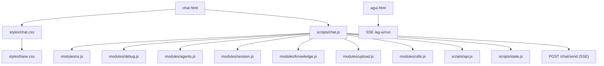
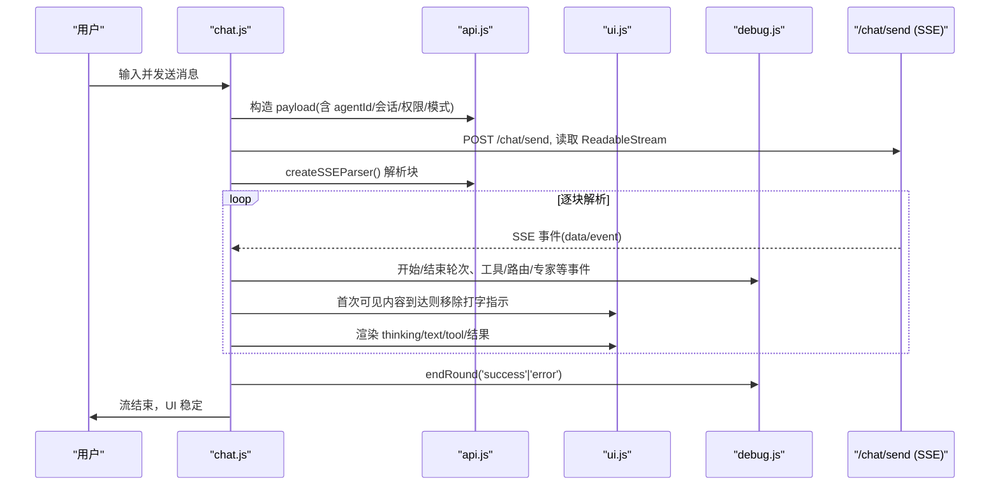
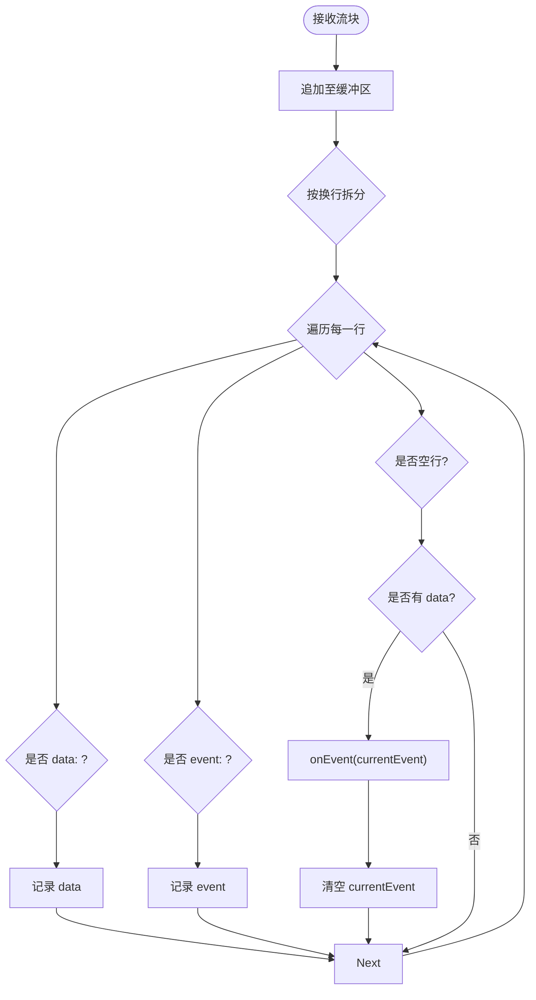
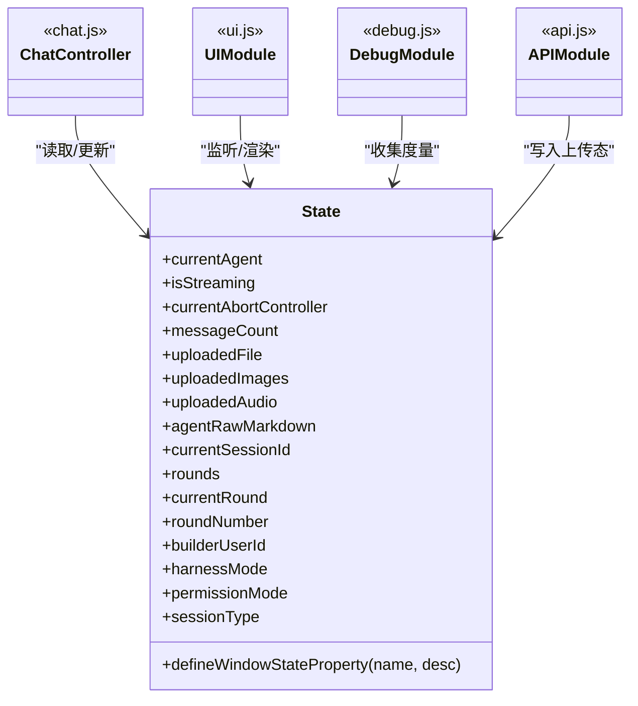
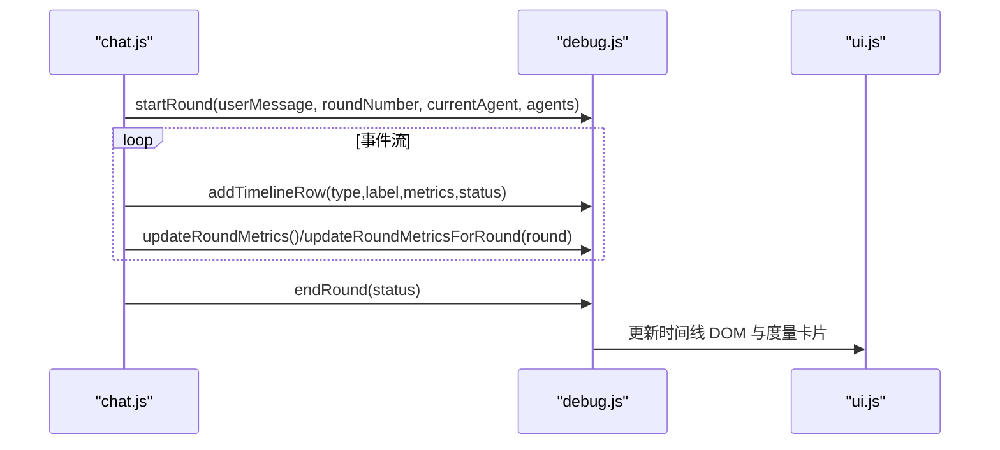
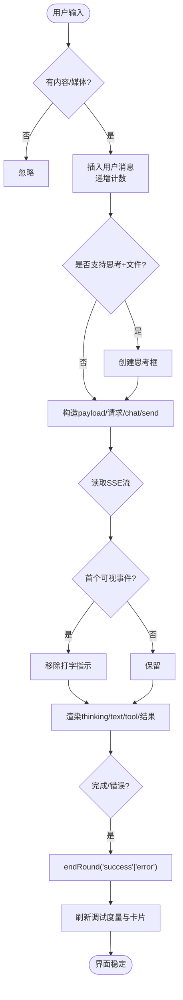
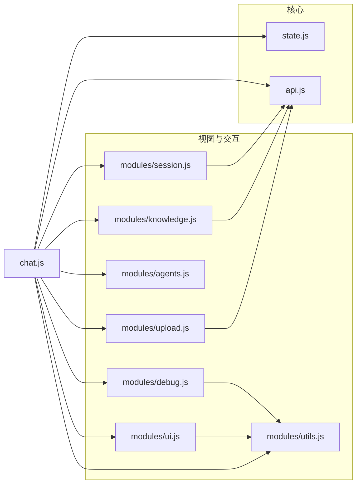

# 前端界面

<cite>
**本文引用的文件**
- [chat.html](file://src/main/resources/templates/chat.html)
- [agui.html](file://src/main/resources/static/agui.html)
- [state.js](file://src/main/resources/static/scripts/state.js)
- [api.js](file://src/main/resources/static/scripts/api.js)
- [chat.js](file://src/main/resources/static/scripts/chat.js)
- [modules/debug.js](file://src/main/resources/static/scripts/modules/debug.js)
- [modules/ui.js](file://src/main/resources/static/scripts/modules/ui.js)
- [modules/agents.js](file://src/main/resources/static/scripts/modules/agents.js)
- [modules/session.js](file://src/main/resources/static/scripts/modules/session.js)
- [modules/knowledge.js](file://src/main/resources/static/scripts/modules/knowledge.js)
- [modules/upload.js](file://src/main/resources/static/scripts/modules/upload.js)
- [modules/utils.js](file://src/main/resources/static/scripts/modules/utils.js)
- [styles/chat.css](file://src/main/resources/static/styles/chat.css)
- [styles/base.css](file://src/main/resources/static/styles/base.css)
- [styles/modules/chat.css](file://src/main/resources/static/styles/modules/chat.css)
- [styles/modules/sidebar.css](file://src/main/resources/static/styles/modules/sidebar.css)
- [styles/modules/debug.css](file://src/main/resources/static/styles/modules/debug.css)
- [styles/modules/header.css](file://src/main/resources/static/styles/modules/header.css)
- [styles/modules/upload.css](file://src/main/resources/static/styles/modules/upload.css)
- [styles/modules/modal.css](file://src/main/resources/static/styles/modules/modal.css)
- [styles/modules/utils.css](file://src/main/resources/static/styles/modules/utils.css)
</cite>

## 更新摘要
**变更内容**
- 完成UI主题从深色赛博朋克风格转换为浅色简洁设计
- 更新基础CSS变量系统，采用现代浅色配色方案
- 重构聊天界面样式，提升可读性和用户体验
- 调整模块特定样式以适配新主题
- 优化视觉层次和对比度，确保无障碍访问

## 目录
1. 引言
2. 项目结构
3. 核心组件
4. 架构总览
5. 详细组件分析
6. 依赖关系分析
7. 性能考量
8. 故障排查指南
9. 结论
10. 附录

## 引言
本技术文档聚焦后端静态资源中的前端界面，面向具备不同技术背景的用户，系统化阐述模块化 JavaScript 架构、SSE 流式通信实现、集中状态管理、调试面板的事件追踪、UI 响应式设计、Markdown 与代码高亮渲染、多语言支持能力边界、无障碍访问建议、用户交互流程与消息渲染机制，并给出主题定制、布局调整、插件开发及性能优化、兼容性、移动端适配与安全注意事项。

**最新更新**：界面已完成从深色赛博朋克风格到浅色简洁设计的全面主题转换，提供更现代、更专业的用户体验。

## 项目结构
前端以单页应用为主，采用分模块的 JavaScript 组织：
- 页面入口与模板
  - chat.html：主会话页面，引入样式、markdown/markdown 高亮库、主脚本
  - agui.html：AG-UI 协议演示页，用于 /ag-ui/run SSE 事件查看
- 脚本模块
  - state.js：全局集中状态容器（window 代理），暴露 getter/setter，供各模块共享
  - api.js：统一 HTTP API 封装（SSE 解析器、会话、知识、上传等）
  - chat.js：主控制器，负责发送消息、处理 SSE 事件分发、调用各子模块
  - modules/
    - ui.js：消息与思考框 DOM 构建、输入区域 UI、调试面板开关
    - debug.js：调试面板"轮次"与时间线管理，聚合 Agent/工具/路由等观测数据
    - agents.js：Agent 列表加载、分类展示、选择与上下文配置切换
    - session.js：会话创建/选择/删除、清空聊天区域并恢复空态
    - knowledge.js：知识库文档列表、上传、删除
    - upload.js：文件上传、预览、智能体推荐模态
    - utils.js：Markdown 渲染配置、结构化数据表格化、工具函数
- 样式
  - styles/chat.css：组合式样式入口，@import 多个模块 CSS
  - styles/base.css：全局变量、主题色、字体与基础布局
  - vendor/*：第三方库（marked、highlight.js、字体、高亮主题样式）

**图表来源**
- [chat.html:1-95](file://src/main/resources/templates/chat.html#L1-L95)
- [chat.js:1-200](file://src/main/resources/static/scripts/chat.js#L1-L200)
- [api.js:1-125](file://src/main/resources/static/scripts/api.js#L1-L125)
- [styles/chat.css:1-13](file://src/main/resources/static/styles/chat.css#L1-L13)

**章节来源**
- [chat.html:1-95](file://src/main/resources/templates/chat.html#L1-L95)
- [styles/chat.css:1-13](file://src/main/resources/static/styles/chat.css#L1-L13)
- [styles/base.css:1-141](file://src/main/resources/static/styles/base.css#L1-L141)

## 核心组件
- 集中状态管理（state.js）
  - 以 window.__agentScopeState 为单一事实源，维护当前 agent、流式标志、消息计数、上传附件、当前轮次、观察指标等
  - 通过 defineWindowStateProperty 对关键属性暴露 get/set，确保跨模块同步读写且安全
- API 层（api.js）
  - createSSEParser：轻量级 SSE 行缓冲解析器，按 data:/event: 分隔输出事件对象
  - 统一封装文件上传、会话管理、知识文档、Skill/Tool 信息查询等 fetch 调用
- 主控制器（chat.js）
  - 发送消息：构造 payload（含 agentId、message、会话/权限/模式扩展字段），发起 /chat/send
  - 使用 ReadableStream + TextDecoder 消费流，并通过 createSSEParser 将 SSE 片段转为结构化事件
  - 依据 payload.type 分派至调试与 UI（agent_start/end、tool 调用、thinking、文本增量、错误、完成等）
- UI 模块（modules/ui.js）
  - appendMessage：根据角色渲染气泡、头像、时间与 Markdown 内容，支持历史思考框
  - 思考框：createThinkingBox/updateThinkingBox/collapseThinkingBox，用于文件处理时的中间过程展示
  - 打字指示器：显示/移除与首次可见内容清除时机控制
- 调试面板（modules/debug.js）
  - startRound/endRound：基于轮次的数据结构与卡片生命周期
  - addTimelineRow*：按阶段生成时间线条目，聚合 token、耗时、调用次数等指标
- 辅助模块
  - agents.js：按分类渲染 Agent 卡片，自动选择首项，切换时清理/复位状态
  - session.js：会话 CRUD、清空聊天区域（保留 empty 占位）、断流后强制复位发送按钮
  - knowledge.js：列出/上传/删除知识库文档
  - upload.js：校验类型、上传、展示标签/图片/音频预览、触发智能体建议弹窗
  - utils.js：marked 配置（gfm/breaks）、highlight 集成、结构化 JSON 提取为表格、导出 JSON

**章节来源**
- [state.js:1-165](file://src/main/resources/static/scripts/state.js#L1-L165)
- [api.js:1-125](file://src/main/resources/static/scripts/api.js#L1-L125)
- [chat.js:1-220](file://src/main/resources/static/scripts/chat.js#L1-L220)
- [modules/ui.js:1-210](file://src/main/resources/static/scripts/modules/ui.js#L1-L210)
- [modules/debug.js:1-200](file://src/main/resources/static/scripts/modules/debug.js#L1-L200)
- [modules/agents.js:1-200](file://src/main/resources/static/scripts/modules/agents.js#L1-L200)
- [modules/session.js:1-169](file://src/main/resources/static/scripts/modules/session.js#L1-L169)
- [modules/knowledge.js:1-60](file://src/main/resources/static/scripts/modules/knowledge.js#L1-L60)
- [modules/upload.js:1-200](file://src/main/resources/static/scripts/modules/upload.js#L1-L200)
- [modules/utils.js:1-200](file://src/main/resources/static/scripts/modules/utils.js#L1-L200)

## 架构总览
从用户输入到 SSE 事件渲染的整体时序如下：

**图表来源**
- [chat.js:24-200](file://src/main/resources/static/scripts/chat.js#L24-L200)
- [api.js:1-25](file://src/main/resources/static/scripts/api.js#L1-L25)
- [modules/debug.js:5-177](file://src/main/resources/static/scripts/modules/debug.js#L5-L177)
- [modules/ui.js:14-115](file://src/main/resources/static/scripts/modules/ui.js#L14-L115)

**章节来源**
- [chat.js:24-200](file://src/main/resources/static/scripts/chat.js#L24-L200)
- [api.js:1-25](file://src/main/resources/static/scripts/api.js#L1-L25)
- [modules/debug.js:5-177](file://src/main/resources/static/scripts/modules/debug.js#L5-L177)
- [modules/ui.js:14-115](file://src/main/resources/static/scripts/modules/ui.js#L14-L115)

## 详细组件分析

### 模块化 JavaScript 架构设计
- 职责划分清晰：入口控制器（chat.js）仅负责流驱动与事件派发；UI/调试/会话/上传/知识等能力各自独立模块，降低耦合度
- 状态集中在 state.js，避免分散全局变量造成竞争条件；提供安全 get/set 保障跨模块一致性
- API 抽象屏蔽网络细节，便于未来替换传输方式或增加重试/鉴权逻辑
- 样式以模块化合入 chat.css，便于按需裁剪与主题切换

**章节来源**
- [state.js:1-165](file://src/main/resources/static/scripts/state.js#L1-L165)
- [modules/agents.js:16-99](file://src/main/resources/static/scripts/modules/agents.js#L16-L99)
- [modules/session.js:99-147](file://src/main/resources/static/scripts/modules/session.js#L99-L147)
- [styles/chat.css:1-13](file://src/main/resources/static/styles/chat.css#L1-L13)

### 实时通信的 SSE 客户端实现
- 使用浏览器原生 ReadableStream 读取响应体，TextDecoder(stream:true) 保证按字符集连续解码
- createSSEParser 维护缓冲区按换行切分，识别 data:/event:，遇到空行即发射完整事件对象
- 在首次产生"可视内容事件"时才移除打字指示器，避免空白期导致的不友好体验
- AG-UI 模式（agui.html）复用相同思路：fetch('/ag-ui/run') 配合 Accept: text/event-stream，自行解析 event/data

**图表来源**
- [api.js:1-25](file://src/main/resources/static/scripts/api.js#L1-L25)
- [chat.js:127-176](file://src/main/resources/static/scripts/chat.js#L127-L176)
- [agui.html:61-132](file://src/main/resources/static/agui.html#L61-L132)

**章节来源**
- [api.js:1-25](file://src/main/resources/static/scripts/api.js#L1-L25)
- [chat.js:127-176](file://src/main/resources/static/scripts/chat.js#L127-L176)
- [agui.html:61-132](file://src/main/resources/static/agui.html#L61-L132)

### 状态管理的集中化处理
- 所有运行时状态（当前 agent、流标志、会话、上传介质、轮次、调试度量等）集中于 state.js
- 通过 Object.defineProperty 包装 window 属性，允许其他模块直接读写并保持内部状态一致
- 典型场景：切换到新 agent 时中断当前流（abortController.abort）、重置 round、清空调试区

**图表来源**
- [state.js:1-165](file://src/main/resources/static/scripts/state.js#L1-L165)
- [chat.js:24-116](file://src/main/resources/static/scripts/chat.js#L24-L116)
- [modules/ui.js:1-20](file://src/main/resources/static/scripts/modules/ui.js#L1-L20)
- [modules/debug.js:5-31](file://src/main/resources/static/scripts/modules/debug.js#L5-L31)
- [api.js:27-41](file://src/main/resources/static/scripts/api.js#L27-L41)

**章节来源**
- [state.js:1-165](file://src/main/resources/static/scripts/state.js#L1-L165)
- [chat.js:24-116](file://src/main/resources/static/scripts/chat.js#L24-L116)
- [modules/debug.js:5-31](file://src/main/resources/static/scripts/modules/debug.js#L5-L31)

### 调试面板的事件追踪能力
- 每轮请求创建一个 round 卡片，包含摘要、模型名、折叠详情（token/LLM/工具耗时、调用次数、速度）
- 通过 addTimelineRow* 持续添加阶段条（phase/tool/routing/handoff/supervisor/blackboard 等）
- endRound 关闭运行中条目并标记整体成功/错误，滚动到底部保持可观测性

**图表来源**
- [modules/debug.js:5-60](file://src/main/resources/static/scripts/modules/debug.js#L5-L60)
- [modules/debug.js:63-177](file://src/main/resources/static/scripts/modules/debug.js#L63-L177)
- [chat.js:180-220](file://src/main/resources/static/scripts/chat.js#L180-L220)

**章节来源**
- [modules/debug.js:5-177](file://src/main/resources/static/scripts/modules/debug.js#L5-L177)
- [chat.js:180-220](file://src/main/resources/static/scripts/chat.js#L180-L220)

### UI 组件的响应式设计与视觉风格

**更新** 界面已完成从深色赛博朋克风格到浅色简洁设计的全面主题转换，提供更现代、更专业的用户体验。

#### 新主题特性
- **浅色背景系统**：采用 `#f4f6fa` 作为主背景色，搭配 `#edf1f7` 和 `#ffffff` 创建层次感
- **柔和阴影替代霓虹发光**：使用 `box-shadow` 替代原有的 `text-shadow` 和 `filter: drop-shadow`
- **改进的对比度**：深色文字 `#1e293b` 在浅色背景上提供更好的可读性
- **现代化色彩方案**：保留品牌色彩但调整为更适合浅色主题的饱和度

#### 主题变量系统
- **基础颜色**：`--bg-void`, `--bg-card`, `--bg-input` 等语义化背景变量
- **强调色**：`--neon-cyan`, `--neon-green`, `--neon-magenta` 等品牌色彩
- **状态颜色**：`--status-thinking`, `--status-tool`, `--status-error` 等状态指示
- **边框和阴影**：统一的边框和阴影变量系统

#### 组件样式更新
- **聊天气泡**：采用渐变背景和柔和阴影，区分用户和AI消息
- **侧边栏**：浅灰色背景配合微妙的边框和悬停效果
- **调试面板**：保持功能性的同时提升视觉舒适度
- **按钮和交互元素**：现代化的圆角设计和平滑过渡动画

**章节来源**
- [styles/base.css:1-141](file://src/main/resources/static/styles/base.css#L1-L141)
- [styles/chat.css:1-434](file://src/main/resources/static/styles/chat.css#L1-L434)
- [styles/modules/chat.css:1-876](file://src/main/resources/static/styles/modules/chat.css#L1-L876)
- [styles/modules/sidebar.css:1-566](file://src/main/resources/static/styles/modules/sidebar.css#L1-L566)
- [styles/modules/debug.css:1-734](file://src/main/resources/static/styles/modules/debug.css#L1-L734)

### 多语言支持与无障碍访问
- 页面 lang 设置中文，标题与部分文案使用硬编码中文；如需国际化，建议在模板/字符串中抽取翻译键
- 无障碍要点：
  - 输入区、按钮需确保语义标签与键盘可达
  - 动态生成的内容添加适当 aria-* 描述（如计时指示、错误提示）
  - 颜色对比度满足 WCAG（新浅色主题已优化对比度，确保文本可读性）

**章节来源**
- [chat.html:1-15](file://src/main/resources/templates/chat.html#L1-L15)

### 用户交互流程
- 键盘回车发送、输入自适应高度
- 发送时先插入用户消息与元信息，开启流标志与打字指示，启动新轮次
- 若启用思考能力且携带文件，即时创建思考框展示过程
- 首个可视内容事件移除打字指示，提升首帧感知
- 切换智能体会终止当前请求、清理轮次与调试面板，保证状态一致
- 会话切换会清空消息区并恢复空状态

**图表来源**
- [chat.js:24-116](file://src/main/resources/static/scripts/chat.js#L24-L116)
- [chat.js:127-176](file://src/main/resources/static/scripts/chat.js#L127-L176)
- [modules/debug.js:63-106](file://src/main/resources/static/scripts/modules/debug.js#L63-L106)

**章节来源**
- [chat.js:24-176](file://src/main/resources/static/scripts/chat.js#L24-L176)
- [modules/debug.js:63-106](file://src/main/resources/static/scripts/modules/debug.js#L63-L106)

### 消息渲染机制、Markdown 支持与代码高亮
- 消息气泡：用户为纯文本，Agent 为 Markdown，时间戳位于底部
- Markdown：借助 marked，配置 gfm/breaks；代码块使用 highlight.js 进行语言检测与高亮，失败降级为转义文本
- 结构化数据：若检测到 JSON，则以表格展示并支持导出下载
- 思考过程：当开启 enableThinking 且传入文件时，以可折叠框渐进显示中间过程

**章节来源**
- [modules/ui.js:14-115](file://src/main/resources/static/scripts/modules/ui.js#L14-L115)
- [modules/ui.js:117-210](file://src/main/resources/static/scripts/modules/ui.js#L117-L210)
- [modules/utils.js:1-46](file://src/main/resources/static/scripts/modules/utils.js#L1-L46)
- [modules/utils.js:48-196](file://src/main/resources/static/scripts/modules/utils.js#L48-L196)

### 插件开发与可扩展点
- 事件扩展点：在 chat.js 的事件分支中添加新的 payload.type 分支，即可接入新的业务事件并联动 UI/调试
- 主题扩展：基于 base.css 中的 CSS 变量新增或覆盖变量，无需重构现有类名
- 功能模块：新增 modules/*.js 并在 chat.js 导入，遵循现有命名空间与接口
- 自定义表单：通过扩展 payload 字段（如权限/会话类型/自定义标签）对接后端契约

**章节来源**
- [chat.js:178-220](file://src/main/resources/static/scripts/chat.js#L178-L220)
- [styles/base.css:8-63](file://src/main/resources/static/styles/base.css#L8-L63)

## 依赖关系分析
- 模块导入关系
  - chat.js 作为装配者，导入 state、api、utils、ui、debug、agents、session、knowledge、upload 等模块
  - 各模块通过相对路径导入 api.js，统一网络入口
- 外部依赖
  - 第三方库：marked.min.js、highlight.min.js
  - 字体与主题：vendor/fonts/fonts.css、vendor/css/highlight.css
- 运行时依赖
  - 现代浏览器 Fetch API、ReadableStream、TextDecoder

**图表来源**
- [chat.js:1-10](file://src/main/resources/static/scripts/chat.js#L1-L10)
- [modules/ui.js:1-2](file://src/main/resources/static/scripts/modules/ui.js#L1-L2)
- [modules/debug.js:1-2](file://src/main/resources/static/scripts/modules/debug.js#L1-L2)
- [modules/agents.js:1-5](file://src/main/resources/static/scripts/modules/agents.js#L1-L5)
- [modules/session.js:1-3](file://src/main/resources/static/scripts/modules/session.js#L1-L3)
- [modules/knowledge.js:1-3](file://src/main/resources/static/scripts/modules/knowledge.js#L1-L3)
- [modules/upload.js:1-3](file://src/main/resources/static/scripts/modules/upload.js#L1-L3)

**章节来源**
- [chat.js:1-10](file://src/main/resources/static/scripts/chat.js#L1-L10)

## 性能考量
- 流式渲染与增量计算
  - 使用 ReadableStream 增量读取，减少首屏等待
  - 仅在首个可见事件时移除打字指示，避免频繁 DOM 操作闪烁
- Markdown/高亮开销
  - 大段 Markdown 渲染前可考虑分页/延迟渲染或虚拟滚动
  - highlight.js 在高语料场景下可尝试按需加载或限制自动检测范围
- DOM 操作
  - 批量拼接 HTML 后一次性注入，减少重排
  - 调试面板只渲染必要字段，避免过多节点
- 缓存策略
  - URL 加版本号后缀（?v=...）利于 CDN/浏览器缓存
- 内存管理
  - 切换 agent/会话时彻底清理状态与 DOM，避免残留引用

[本节为通用指导，不直接分析具体文件]

## 故障排查指南
- 连接/解析问题
  - SSE 事件未触发：检查服务器是否返回 Server-Sent Events，控制台查看 parser 是否收到 data 片段
  - JSON 解析失败：查看 console 打印的错误日志，确认 payload 是否为合法 JSON
- 状态不一致
  - 长时间 isStreaming=true：调用 abortController.abort()，手动置 false，必要时 endRound 兜底
  - 轮次未结束：检查 endRound 调用路径是否覆盖异常分支
- 渲染异常
  - Markdown 乱码/高亮失效：确认 marked/hljs 已加载且版本兼容，异常回退逻辑生效
  - 表格/结构化数据：检查 extractStructuredData 匹配规则
- 文件上传失败
  - 校验文件格式、服务端大小限制与路径权限，查看后端返回的 error 字段

**章节来源**
- [chat.js:112-120](file://src/main/resources/static/scripts/chat.js#L112-L120)
- [modules/upload.js:46-110](file://src/main/resources/static/scripts/modules/upload.js#L46-L110)
- [modules/session.js:72-119](file://src/main/resources/static/scripts/modules/session.js#L72-L119)
- [modules/utils.js:1-46](file://src/main/resources/static/scripts/modules/utils.js#L1-L46)

## 结论
前端以模块化与 SSE 为核心构建，状态集中管理、调试面板提供强可观测性，Markdown 与代码高亮保障了高质量的信息呈现。结合新主题的浅色简洁设计，实现了更专业、更易用的用户界面。通过主题系统与组件化样式，可实现灵活的主题与布局定制；通过扩展事件与模块接口，可平滑叠加新功能。

[本节为总结，不直接分析具体文件]

## 附录

### 组件自定义指南
- 主题定制
  - 修改 base.css 的 CSS 变量（色彩、阴影、字体），快速切换主题
  - 在新浅色主题基础上，可通过覆盖变量实现个性化定制
  - 在 chat.css 中添加/覆盖模块样式，不影响主结构
- 布局调整
  - 通过 .app-body 的 flex 布局与侧边栏显隐，适配不同屏幕尺寸
  - 小屏设备建议在媒体查询中折叠 side/debug 面板，优先展示 chat-area
- 插件开发
  - 新增 events.handler(payload.type) 分支，实现自定义事件渲染
  - 封装新的 modules/xxx.js 并在 chat.js 导入，保持职责单一
- 性能优化
  - 大批量消息分页渲染或虚拟滚动
  - 针对长文本 Markdown，采用懒加载/分段解析
  - 合理使用 requestAnimationFrame 或 setTimeout 分批更新 DOM

[本节为通用指导，不直接分析具体文件]

### 浏览器兼容性与移动端适配
- 特性需求
  - Fetch API、ReadableStream、TextDecoder、FileReader（若后续需要本地预览）等现代 Web API
- 移动端适配
  - 媒体查询：隐藏 side/debug，增大点击热区，输入区自适应
  - 触摸友好：大图放大、语音播放控件自带手势
- 新主题优势
  - 浅色主题在移动设备上提供更好的电池续航和阅读体验
  - 优化的对比度确保在各种光照条件下的可读性

[本节为通用指导，不直接分析具体文件]

### 安全考虑
- XSS 防护
  - 渲染 Markdown 前的内容需清洗或限制；当前通过 escapeHtml 与 marked 默认白名单过滤
  - 外链图片/链接需限制域名或使用 CSP
- 内容安全策略（CSP）
  - 限制内联脚本与远端资源，避免注入攻击
- 资源限制
  - 文件大小/类型校验在前端进行，并在服务端严格复核

[本节为通用指导，不直接分析具体文件]

### 主题迁移指南

**更新** 从深色赛博朋克主题迁移到浅色简洁主题的步骤：

#### 主要变更
1. **背景色系统**：从深色背景 `#0a0a0f` 迁移到浅色背景 `#f4f6fa`
2. **文字颜色**：从亮色文字 `#e2e8f0` 迁移到深色文字 `#1e293b`
3. **阴影效果**：从霓虹发光效果迁移到柔和阴影
4. **边框样式**：从发光边框迁移到标准边框

#### 迁移步骤
1. 更新 CSS 变量定义
2. 调整组件样式以适配新主题
3. 测试所有交互元素的可见性
4. 验证无障碍访问标准

#### 回滚支持
- 保留原有深色主题变量作为备份
- 支持通过CSS类名切换主题
- 提供主题切换API

**章节来源**
- [styles/base.css:8-63](file://src/main/resources/static/styles/base.css#L8-L63)
- [styles/chat.css:24-434](file://src/main/resources/static/styles/chat.css#L24-L434)