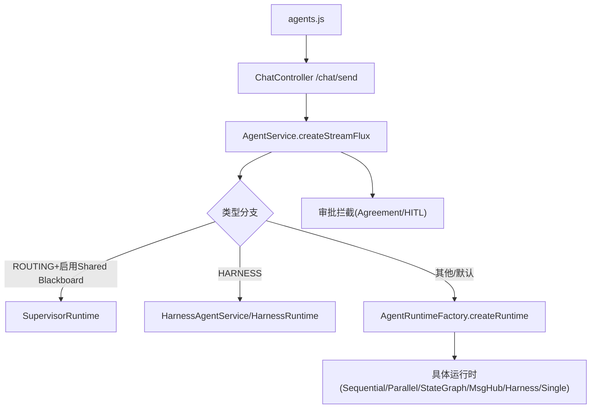
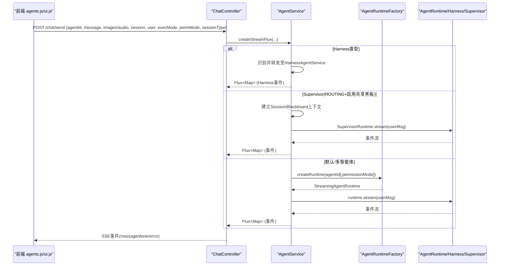
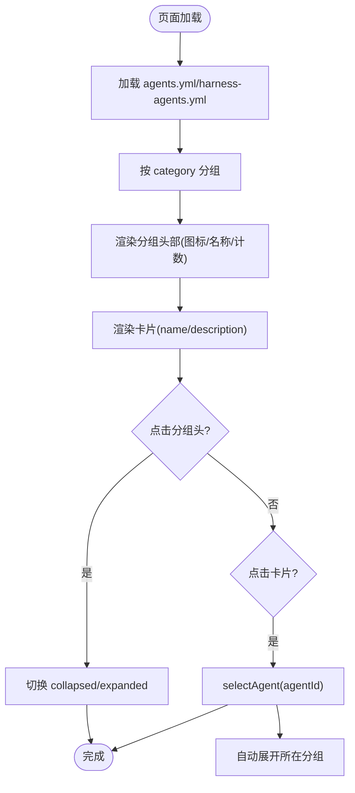
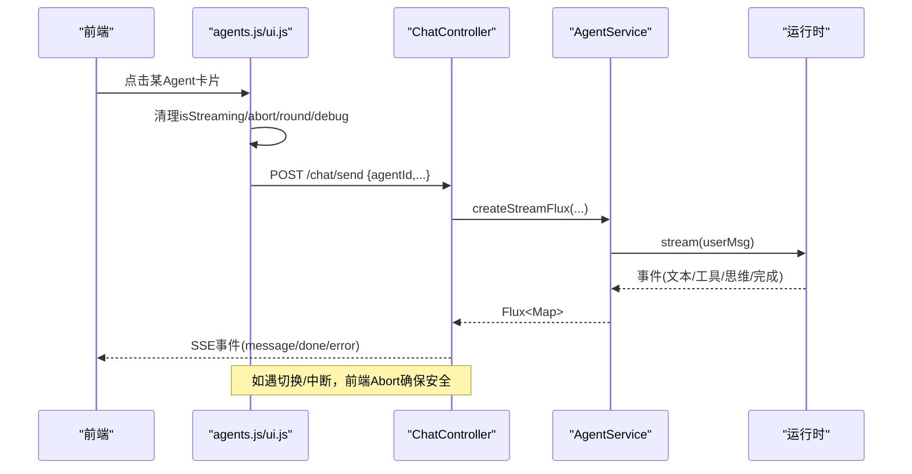
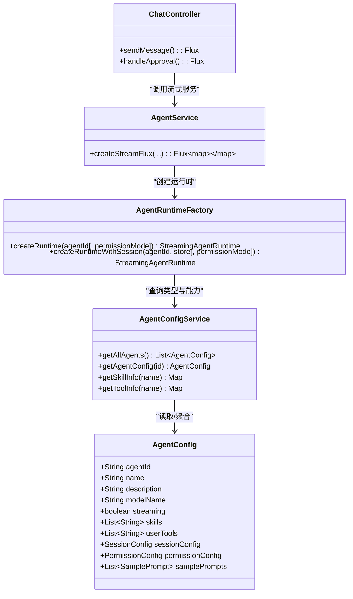

# Agent管理模块

<cite>
**本文件引用的源文件**
- [AgentConfig.java](file://src/main/java/com/skloda/agentscope/agent/AgentConfig.java)
- [AgentConfigService.java](file://src/main/java/com/skloda/agentscope/agent/AgentConfigService.java)
- [AgentFactory.java](file://src/main/java/com/skloda/agentscope/agent/AgentFactory.java)
- [AgentType.java](file://src/main/java/com/skloda/agentscope/agent/AgentType.java)
- [AgentRuntimeFactory.java](file://src/main/java/com/skloda/agentscope/runtime/AgentRuntimeFactory.java)
- [AgentService.java](file://src/main/java/com/skloda/agentscope/service/AgentService.java)
- [ChatController.java](file://src/main/java/com/skloda/agentscope/controller/ChatController.java)
- [agents.yml](file://src/main/resources/config/agents.yml)
- [harness-agents.yml](file://src/main/resources/config/harness-agents.yml)
- [agents.js](file://src/main/static/scripts/modules/agents.js)
- [ui.js](file://src/main/static/scripts/modules/ui.js)
- [state.js](file://src/main/static/scripts/state.js)
</cite>

## 目录
1. [简介](#简介)
2. [项目结构](#项目结构)
3. [核心组件](#核心组件)
4. [架构总览](#架构总览)
5. [组件详解](#组件详解)
6. [依赖关系分析](#依赖关系分析)
7. [性能考虑](#性能考虑)
8. [故障排查指南](#故障排查指南)
9. [结论](#结论)
10. [附录：自定义Agent添加与配置指南](#附录：自定义agent添加与配置指南)

## 简介
本模块围绕“动态加载、分组展示、选择流程、能力检测、配置编辑”等方面，对Agent管理进行端到端的技术说明。前端按分类展示并支持折叠/展开；选择切换时清理流式状态、重置调试面板；后端基于YAML配置实现热插拔式的Agent加载，并通过类型路由到不同运行时（含Harness、Multi-Agent等）；同时提供示例提示、权限模式与会话类型选择器，以及技能/视觉/音频能力信息的查询接口与展示逻辑。

## 项目结构
- 配置层
  - agents.yml/harness-agents.yml：声明式定义Agent及特性、示例提示、类别与执行参数
  - AgentConfigService：启动时解析所有YAML，合并为内存映射
- 工厂/运行层
  - AgentFactory / AgentRuntimeFactory：根据类型创建ReActAgent或Composite/Harness运行时，装配模型、工具、中间件、状态存储、权限上下文等
  - AgentService：统一入口，处理会话、SSE流、HITL批准、Supervisor路由与Harness分流
  - ChatController：对外暴露SSE发送、批准等接口
- 前端交互
  - agents.js：按分类分组渲染、折叠展开、选Agent、显示示例提示、挂载权限与会话选择器
  - ui.js：消息气泡、思考框、媒体渲染
  - state.js：全局状态（当前Agent、流式标志、Round/调试面板状态等）

图表来源
- [ChatController.java:122-153](file://src/main/java/com/skloda/agentscope/controller/ChatController.java#L122-L153)
- [AgentService.java:120-177](file://src/main/java/com/skloda/agentscope/service/AgentService.java#L120-L177)
- [AgentRuntimeFactory.java:41-83](file://src/main/java/com/skloda/agentscope/runtime/AgentRuntimeFactory.java#L41-L83)

章节来源
- [agents.yml:1-200](file://src/main/resources/config/agents.yml#L1-L200)
- [harness-agents.yml:1-87](file://src/main/resources/config/harness-agents.yml#L1-L87)
- [AgentConfigService.java:24-76](file://src/main/java/com/skloda/agentscope/agent/AgentConfigService.java#L24-L76)

## 核心组件
- AgentConfig：承载Agent的所有可选能力开关（流式、thinking、技能、工具、RAG、权限、计划任务、多智能体、Supervisor共享黑板、Harness配置、MCP工具组、示例提示、中间件与会话存储类型等），并以枚举类型和嵌套配置组织。
- AgentConfigService：应用启动时从classpath读取agents.yml与harness-agents.yml，去重加载，提供获取列表与单个配置的API，并能检索技能与工具的元信息（名称、描述、参数等）。
- AgentFactory：负责构建单Agent实例（包括持久化与非持久化）、注册工具与MCP、配置长短期记忆、计划工作簿、中间件与权限上下文。
- AgentRuntimeFactory：根据AgentType分派到对应的运行时（单智能体、多智能体编排、Harness等），支持会话型与权限模式的注入。
- AgentService：统一聚合会话管理、工作流记录、Supervisor路由判断、HITL处理、错误恢复与SSE封装。
- ChatController：将HTTP请求接入SSE流，支持空消息校验、错误事件、完成事件以及批准继续/拒绝路径。
- agents.js：前端按分类加载Agent、分组渲染、折叠/展开、选中切换时清理状态、显示示例提示、渲染权限与会话选择器。
- ui.js 与 state.js：消息渲染、思考过程展示、全局状态管理（流式中断、调试面板Round计数与状态、当前Agent等）。

章节来源
- [AgentConfig.java:13-186](file://src/main/java/com/skloda/agentscope/agent/AgentConfig.java#L13-L186)
- [AgentConfigService.java:41-88](file://src/main/java/com/skloda/agentscope/agent/AgentConfigService.java#L41-L88)
- [AgentFactory.java:36-200](file://src/main/java/com/skloda/agentscope/agent/AgentFactory.java#L36-L200)
- [AgentRuntimeFactory.java:21-127](file://src/main/java/com/skloda/agentscope/runtime/AgentRuntimeFactory.java#L21-L127)
- [AgentService.java:80-177](file://src/main/java/com/skloda/agentscope/service/AgentService.java#L80-L177)
- [ChatController.java:117-153](file://src/main/java/com/skloda/agentscope/controller/ChatController.java#L117-L153)
- [agents.js:16-99](file://src/main/static/scripts/modules/agents.js#L16-L99)
- [ui.js:14-115](file://src/main/static/scripts/modules/ui.js#L14-L115)
- [state.js:1-164](file://src/main/static/scripts/state.js#L1-L164)

## 架构总览
Agent管理在前后端之间通过SSE进行实时通信。配置驱动加载Agent，类型驱动创建运行时，策略路由将特定场景进入Supervisor/Harness路径。前端UI按照分类渲染，并在选择Agent时同步更新演示提示、权限与会话类型选择器，且保证流式切换的安全性。

图表来源
- [ChatController.java:122-153](file://src/main/java/com/skloda/agentscope/controller/ChatController.java#L122-L153)
- [AgentService.java:120-177](file://src/main/java/com/skloda/agentscope/service/AgentService.java#L120-L177)
- [AgentRuntimeFactory.java:41-127](file://src/main/java/com/skloda/agentscope/runtime/AgentRuntimeFactory.java#L41-L127)

## 组件详解

### 动态加载Agent列表（分类、折叠、卡片）
- 配置解析
  - AgentConfigService在启动时加载agents.yml与harness-agents.yml，去重并填充内存列表。每个Agent包含category字段用于分组。
- 前端分组与渲染
  - agents.js定义CATEGORIES常量（如 Single Agent、Expert Agent、Multi-Agent、Harness Agent、2.0 Feature Demo、消保客服三线两GAP），并按agent.category归类生成分组标题与数量。
  - 首次仅展开第一个分组，点击分组头切换collapsed类以折叠/展开。
  - 卡片内显示Agent名、描述，并携带配置信息；点击后触发selectAgent(agentId)。
- 自动选择与高亮
  - 初次加载自动选中首个Agent并高亮卡片；选中后自动展开所在分组以便可见。

图表来源
- [agents.yml:1-200](file://src/main/resources/config/agents.yml#L1-L200)
- [agents.js:6-99](file://src/main/static/scripts/modules/agents.js#L6-L99)

章节来源
- [AgentConfigService.java:41-76](file://src/main/java/com/skloda/agentscope/agent/AgentConfigService.java#L41-L76)
- [agents.js:6-99](file://src/main/static/scripts/modules/agents.js#L6-L99)

### Agent选择流程（状态清理、流中断、调试面板重置）
- 切换Agent时的前端清理
  - selectAgent中若存在正在进行的流式请求（window.isStreaming=true），则标记中止、Abort当前fetch、结束当前Round为interrupted并清理debugRounds。
  - 清空消息区、重置Round计数器与currentRound。
  - 如果是Harness Agent，显示相应控制（执行模式切换、用户选择框）。
  - 根据Agent配置渲染权限模式选择器与会话类型选择器，并显示示例提示。
- 后端SSE生命周期
  - ChatController将AgentService返回的流式事件封装为SSE，错误与完成事件均被包装为统一事件类型。
  - AgentService在会话模式下使用缓存Agent（状态持久化到共享AgentStateStore），非会话模式创建无状态Agent。
  - Supervisor/Harness分支由AgentService判断并分发到对应运行时。

图表来源
- [agents.js:102-189](file://src/main/static/scripts/modules/agents.js#L102-L189)
- [ChatController.java:122-153](file://src/main/java/com/skloda/agentscope/controller/ChatController.java#L122-L153)
- [AgentService.java:120-177](file://src/main/java/com/skloda/agentscope/service/AgentService.java#L120-L177)
- [state.js:1-164](file://src/main/static/scripts/state.js#L1-L164)

章节来源
- [agents.js:102-189](file://src/main/static/scripts/modules/agents.js#L102-L189)
- [ChatController.java:122-153](file://src/main/java/com/skloda/agentscope/controller/ChatController.java#L122-L153)
- [AgentService.java:120-177](file://src/main/java/com/skloda/agentscope/service/AgentService.java#L120-L177)
- [state.js:1-164](file://src/main/static/scripts/state.js#L1-L164)

### 示例提示（Sample Prompts）
- 配置方式
  - 每个Agent可在agents.yml/harness-agents.yml中定义samplePrompts（prompt/expectedBehavior），作为前端示例问题。
- 前端行为
  - 当selectAgent后，会调用相关接口（agents.js中引用了fetchSamplePrompt）加载对应Agent的预设问题并展示，帮助用户快速尝试。

章节来源
- [agents.yml:1-200](file://src/main/resources/config/agents.yml#L1-L200)
- [harness-agents.yml:1-87](file://src/main/resources/config/harness-agents.yml#L1-L87)
- [agents.js:1-189](file://src/main/static/scripts/modules/agents.js#L1-L189)

### 权限与会话选择器
- 权限模式
  - AgentConfig中包含PermissionConfig（默认权限模式、denyTools、askTools），AgentService在选择运行时可传入permissionMode；运行时在调用工具前会根据权限上下文中断并触发审批流程（可通过ApprovalMiddleware集成）。
- 会话类型
  - AgentConfig.SessionConfig定义默认会话类型（如memory）与存储路径；前端通过renderSessionTypeSelector展示并根据所选Agent的配置决定是否允许修改与取值。
- 前端联动
  - agents.js在选择Agent时，根据配置渲染权限模式选择器与会话类型选择器，便于用户即时调整行为。

章节来源
- [AgentConfig.java:92-113](file://src/main/java/com/skloda/agentscope/agent/AgentConfig.java#L92-L113)
- [AgentService.java:120-177](file://src/main/java/com/skloda/agentscope/service/AgentService.java#L120-L177)
- [agents.js:181-189](file://src/main/static/scripts/modules/agents.js#L181-L189)

### 能力检测机制（技能、视觉、音频）
- 技能检测
  - AgentConfig.skills声明可用技能；AgentConfigService能从ToolRegistry获取技能的描述与关联工具，供前端详情查看。
- 视觉与音频
  - AgentConfig.modality可用于标识主要模态（text/vision/audio）；前端在发送消息时可通过ui.js与state.js支持图像/音频上传并构造包含图片/音频的请求体（ChatRequest支持MultiModalMessage）。
- 工具与参数反射
  - AgentConfigService.getToolInfo通过反射遍历工具方法的@Tool/@ToolParam注解，收集参数描述与类型，为配置审查和能力展示提供依据。

章节来源
- [AgentConfig.java:42-46](file://src/main/java/com/skloda/agentscope/agent/AgentConfig.java#L42-L46)
- [AgentConfigService.java:110-173](file://src/main/java/com/skloda/agentscope/agent/AgentConfigService.java#L110-L173)
- [ui.js:14-79](file://src/main/static/scripts/modules/ui.js#L14-L79)
- [ChatController.java:122-153](file://src/main/java/com/skloda/agentscope/controller/ChatController.java#L122-L153)

### 对话界面与渲染（卡片、思考框、媒体）
- 消息卡片
  - ui.js负责将用户消息与Agent响应组装为消息卡片，包含头像、时间戳、内容气泡。
- 思考过程
  - 当存在Thinking内容时，渲染可折叠的“Thinking”框，逐步增量刷新并最终关闭折叠。
- 多模态输入
  - 用户在消息输入中上传图片或音频，ui.js会将图片缩略图/音频控件插入气泡中，并将fileId/filePath等元数据随消息一起发送。

章节来源
- [ui.js:14-115](file://src/main/static/scripts/modules/ui.js#L14-L115)
- [ui.js:117-200](file://src/main/static/scripts/modules/ui.js#L117-L200)
- [ChatController.java:122-153](file://src/main/java/com/skloda/agentscope/controller/ChatController.java#L122-L153)

## 依赖关系分析
- 前后端解耦
  - 前端不感知Agent内部类型，只依赖配置加载与SSE事件；后端按AgentType分派至不同运行时。
- 配置与能力
  - YAML配置驱动Agent可用性；Skill/Tool通过ToolRegistry聚合，AgentFactory装配时注入到具体Agent。
- 会话与状态
  - AgentService结合SessionManager与AgentStateStore提供会话级状态隔离；调试面板（Round/事件）由前端状态维护。

图表来源
- [AgentConfig.java:13-186](file://src/main/java/com/skloda/agentscope/agent/AgentConfig.java#L13-L186)
- [AgentConfigService.java:90-173](file://src/main/java/com/skloda/agentscope/agent/AgentConfigService.java#L90-L173)
- [AgentRuntimeFactory.java:41-127](file://src/main/java/com/skloda/agentscope/runtime/AgentRuntimeFactory.java#L41-L127)
- [AgentService.java:80-177](file://src/main/java/com/skloda/agentscope/service/AgentService.java#L80-L177)
- [ChatController.java:117-153](file://src/main/java/com/skloda/agentscope/controller/ChatController.java#L117-L153)

章节来源
- [AgentRuntimeFactory.java:41-127](file://src/main/java/com/skloda/agentscope/runtime/AgentRuntimeFactory.java#L41-L127)
- [AgentService.java:80-177](file://src/main/java/com/skloda/agentscope/service/AgentService.java#L80-L177)
- [AgentConfigService.java:90-173](file://src/main/java/com/skloda/agentscope/agent/AgentConfigService.java#L90-L173)

## 性能考虑
- 流式传输优化
  - 使用WebFlux Server-Sent Events直传事件，减少缓冲；前端及时Abort以避免残留连接。
- 状态共享与隔离
  - 会话型Agent通过共享AgentStateStore复用状态，避免重复初始化成本；区分agent_state与shared_blackboard键空间，降低串扰。
- 资源释放
  - 切换Agent时主动中止旧请求、清空调试Round，防止内存泄漏与悬挂事件。

[本节为通用指导，不涉及特定文件]

## 故障排查指南
- 流式中断与死锁
  - 现象：切换Agent后仍有事件堆积
  - 检查：前端Abort是否生效；isStreaming与currentAbortController状态
  - 参考：[agents.js:102-129](file://src/main/static/scripts/modules/agents.js#L102-L129)、[state.js:1-164](file://src/main/static/scripts/state.js#L1-L164)
- SSE错误与终止
  - 现象：SSE未正确关闭或报序列化错误
  - 检查：ChatController errorAndDone与onErrorResume分支
  - 参考：[ChatController.java:111-153](file://src/main/java/com/skloda/agentscope/controller/ChatController.java#L111-L153)
- 审批卡住
  - 现象：工具调用等待审批但未恢复
  - 检查：/chat/approve是否被调用；ApprovalService是否成功resume
  - 参考：[ChatController.java:155-186](file://src/main/java/com/skloda/agentscope/controller/ChatController.java#L155-L186)
- 配置冲突或重复Agent
  - 现象：新增Agent未生效或出现重复agentId
  - 检查：AgentConfigService中的重复处理与警告日志
  - 参考：[AgentConfigService.java:55-66](file://src/main/java/com/skloda/agentscope/agent/AgentConfigService.java#L55-L66)

章节来源
- [agents.js:102-129](file://src/main/static/scripts/modules/agents.js#L102-L129)
- [ChatController.java:111-186](file://src/main/java/com/skloda/agentscope/controller/ChatController.java#L111-L186)
- [AgentConfigService.java:55-66](file://src/main/java/com/skloda/agentscope/agent/AgentConfigService.java#L55-L66)

## 结论
该模块通过“配置文件驱动 + 类型路由 + 流式交互”的组合，实现了Agent的动态发现、分组展示与灵活编排。前端保证了切换时的状态清理与调试可视性，后端提供了可扩展的运行时与权限/会话机制。配合示例提示与能力展示，用户可以快速定位并体验合适的Agent。

[本节为总结，不涉及特定文件]

## 附录：自定义Agent添加与配置指南
- 步骤概览
  1) 在agents.yml或harness-agents.yml中添加新Agent条目，设置agentId/name/description/systemPrompt/modelName/streaming等，按需配置skills/userTools/systemTools、permissionConfig、sessionConfig、samplePrompts等。
  2) 如使用新工具，需在ToolRegistry中注册；如使用新技能，需在skills下准备SKILL.md并确保能被工具系统识别。
  3) 对于Harness Agent，配置harnessConfig（执行模式、文件系统模式、压缩/记忆、子Agent等），并注意defaultMode（示例中为bypass规避HITL缺陷的路径）。
  4) 重启应用，新Agent会自动出现在前端分组列表中（按category分组）。
- 关键注意事项
  - agentId唯一性：重复会被忽略并报警告。
  - 权限与会话：合理设置defaultMode与sessionType，避免权限冲突或会话不一致。
  - 能力与媒体：如需视觉/音频能力，确保传入模型与前端上传流程正常。
  - 流式与调试：保持streaming为true以获得更好的用户体验；调试面板Round/事件有助于问题定位。

章节来源
- [agents.yml:1-200](file://src/main/resources/config/agents.yml#L1-L200)
- [harness-agents.yml:1-87](file://src/main/resources/config/harness-agents.yml#L1-L87)
- [AgentConfig.java:13-186](file://src/main/java/com/skloda/agentscope/agent/AgentConfig.java#L13-L186)
- [AgentConfigService.java:41-76](file://src/main/java/com/skloda/agentscope/agent/AgentConfigService.java#L41-L76)