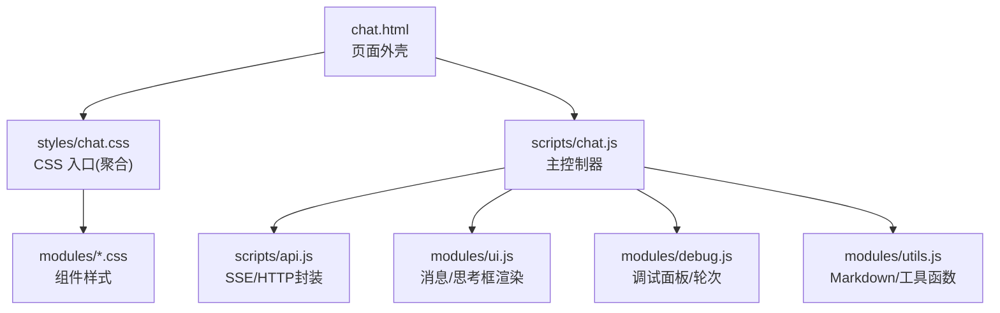
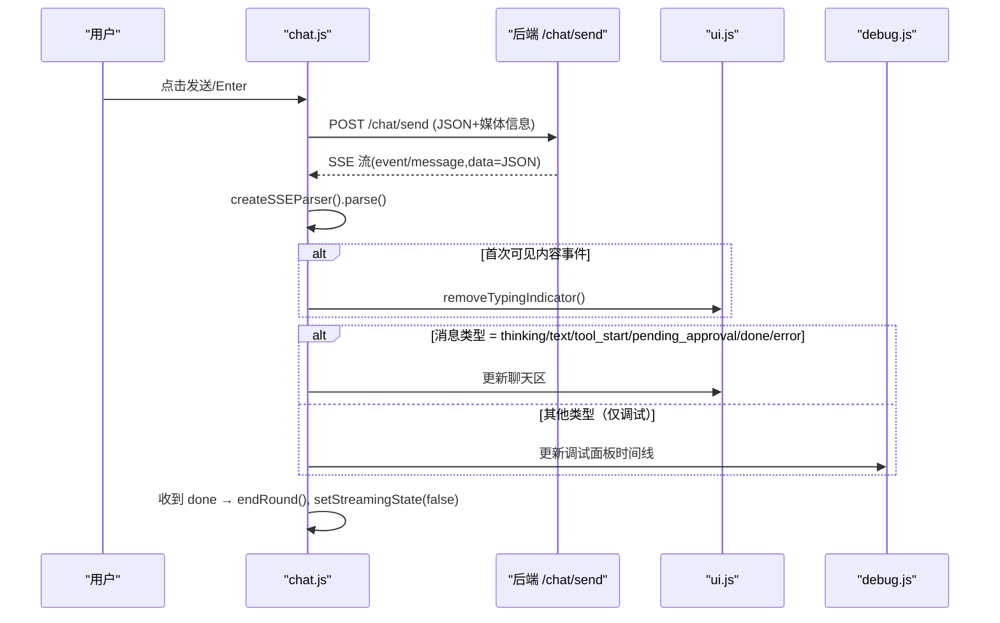
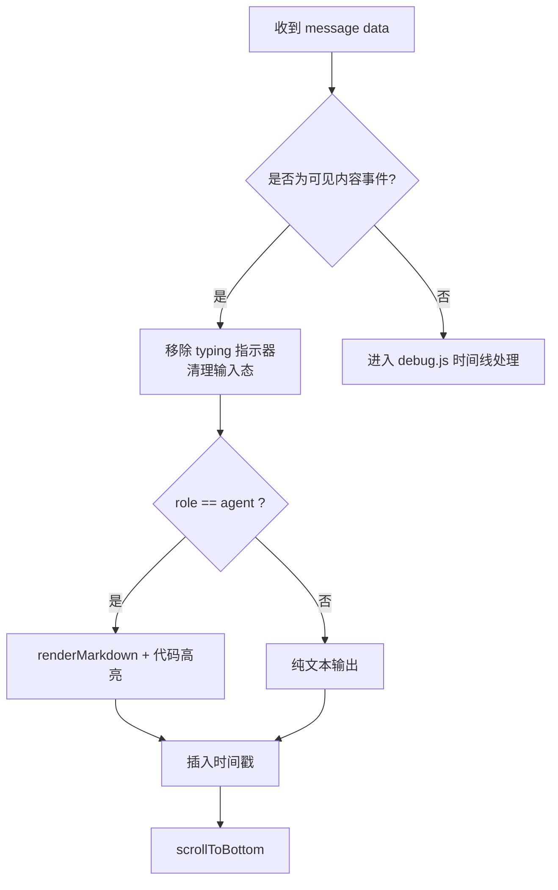
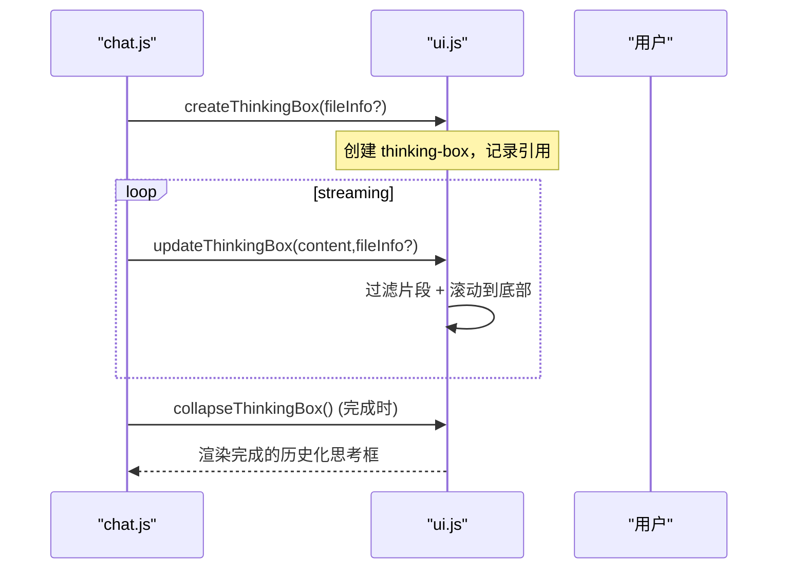
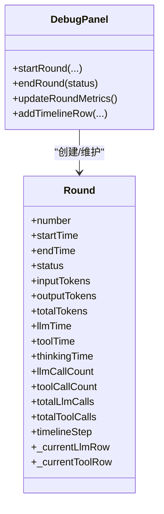
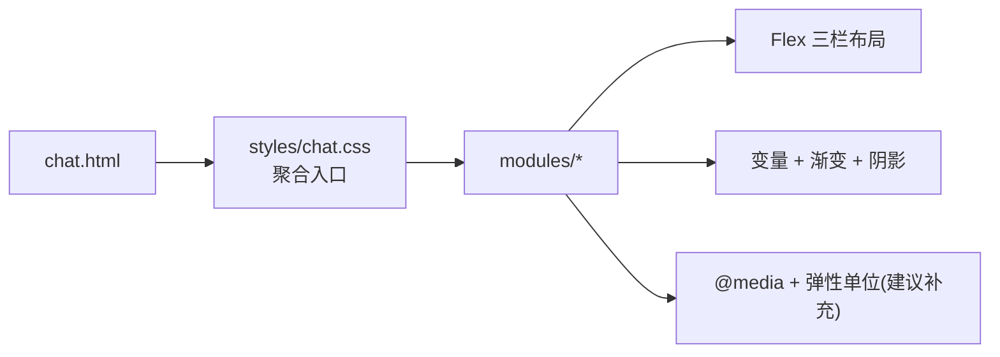
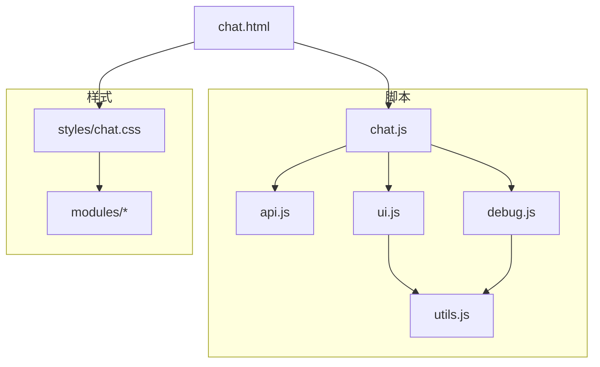

# UI组件模块

<cite>
**本文引用的文件**
- [chat.html](file://src/main/resources/templates/chat.html)
- [chat.css（聚合入口）](file://src/main/resources/static/styles/chat.css)
- [modules/chat.css](file://src/main/resources/static/styles/modules/chat.css)
- [modules/debug.css](file://src/main/resources/static/styles/modules/debug.css)
- [modules/header.css](file://src/main/resources/static/styles/modules/header.css)
- [modules/sidebar.css](file://src/main/resources/static/styles/modules/sidebar.css)
- [modules/upload.css](file://src/main/resources/static/styles/modules/upload.css)
- [modules/modal.css](file://src/main/resources/static/styles/modules/modal.css)
- [modules/utils.css](file://src/main/resources/static/styles/modules/utils.css)
- [base.css](file://src/main/resources/static/styles/base.css)
- [chat.js](file://src/main/resources/static/scripts/chat.js)
- [api.js](file://src/main/resources/static/scripts/api.js)
- [modules/ui.js](file://src/main/resources/static/scripts/modules/ui.js)
- [modules/debug.js](file://src/main/resources/static/scripts/modules/debug.js)
- [modules/utils.js](file://src/main/resources/static/scripts/modules/utils.js)
</cite>

## 目录
1. [简介](#简介)
2. [项目结构与职责划分](#项目结构与职责划分)
3. [核心组件](#核心组件)
4. [架构总览](#架构总览)
5. [详细组件分析](#详细组件分析)
6. [依赖关系分析](#依赖关系分析)
7. [性能与优化](#性能与优化)
8. [故障排查](#故障排查)
9. [结论](#结论)
10. [附录：扩展指南](#附录扩展指南)

## 简介
本模块是 AgentScope Demo 的前端 UI，基于原生 HTML/CSS/JS 和 Thymeleaf，使用 SSE（Server-Sent Events）进行实时流式交互。其目标是提供三栏式聊天界面、可折叠调试面板、富文本 Markdown 渲染、媒体附件上传预览、结构化数据展示、以及响应式设计适配多种屏幕尺寸。

该文档围绕以下主题展开：消息渲染系统（用户/助手样式、头像、时间戳、Markdown）、思考框管理（动态创建/更新/折叠/历史查看）、调试面板（轮次管理/指标统计/时间线可视化/性能监控）、响应式适配、DOM 操作优化（事件委托、元素复用、内存管理），并给出工具函数设计与通用能力说明，以及 UI 扩展开发方法。

## 项目结构与职责划分
- 模板页：定义应用外壳、头部、侧边 Agent 列表、聊天区域、输入区、右侧调试面板及脚本引入。
- 样式体系：采用模块化 CSS，统一在聚合入口中导入基础样式与组件模块样式；包含主题变量、布局、滚动条、组件等。
- 脚本模块：以 ES module 组织核心逻辑：
  - chat.js：主控制器，负责消息发送、SSE 解析分发、渲染协调。
  - api.js：网络层封装（SSE 解析器、Agent/Session/知识库/Skill/Tool 接口）。
  - modules/ui.js：消息气泡、头像、媒体、时间戳、思考框、滚动等 UI 操作。
  - modules/debug.js：轮次（Round）与调试面板的状态管理和渲染。
  - modules/utils.js：Markdown 渲染配置、结构化数据表渲染、HTML 转义、时间/时长格式化、滚动定位等。

图示来源
- [chat.html:1-95](file://src/main/resources/templates/chat.html#L1-L95)
- [chat.css（聚合入口）:1-13](file://src/main/resources/static/styles/chat.css#L1-L13)
- [chat.js:1-9](file://src/main/resources/static/scripts/chat.js#L1-L9)

章节来源
- [chat.html:1-95](file://src/main/resources/templates/chat.html#L1-L95)
- [chat.css（聚合入口）:1-13](file://src/main/resources/static/styles/chat.css#L1-L13)

## 核心组件
- 消息系统：区分用户/助手消息样式，头像 SVG 生成，媒体附件展示（图片/音频/文档标签），时间戳显示，Markdown 内容渲染与代码高亮。
- 思考框系统：根据是否启用 thinking 模式动态创建“Thinking”容器，支持实时更新流内容、自动滚动、折叠展开、完成后转为历史记录查看。
- 调试面板：按轮次组织运行轨迹，维护轮次状态（running/success/error），汇总 Token 数、LLM 耗时、工具调用次数与耗时、速度估算，并以时间线条目可视化 LLM/工具/推理等阶段。
- 样式与响应式：通过 CSS 变量与模块化样式实现暗色主题、光晕边框、渐变背景；利用 flex 布局与相对单位支撑多屏幕尺寸。

章节来源
- [modules/ui.js:15-115](file://src/main/resources/static/scripts/modules/ui.js#L15-L115)
- [modules/debug.js:5-61](file://src/main/resources/static/scripts/modules/debug.js#L5-L61)
- [modules/utils.js:1-46](file://src/main/resources/static/scripts/modules/utils.js#L1-L46)
- [chat.js:24-77](file://src/main/resources/static/scripts/chat.js#L24-L77)

## 架构总览
前端主循环：
1. 用户在输入框键入并发送，chat.js 构建 JSON payload（支持文件、图片、音频、会话上下文、执行/权限模式）。
2. 发起 POST /chat/send，后端以流式返回 ServerSentEvent。
3. 使用自定义 SSE 解析器将流切分事件，逐条转发给 UI/调试子系统。
4. UI 子系统按消息类型决定渲染到聊天区或调试面板。

图示来源
- [chat.js:106-176](file://src/main/resources/static/scripts/chat.js#L106-L176)
- [api.js:1-25](file://src/main/resources/static/scripts/api.js#L1-L25)
- [modules/ui.js:15-115](file://src/main/resources/static/scripts/modules/ui.js#L15-L115)
- [modules/debug.js:5-61](file://src/main/resources/static/scripts/modules/debug.js#L5-L61)

## 详细组件分析

### 消息渲染系统
- 用户消息：
  - 左侧头像为用户图标，文本原样显示。
  - 支持附加文件标签、图片缩略图（点击可查看大图）、音频播放器与名称标签。
  - 右侧时间戳标识发送时间。
- 助手消息：
  - 左侧为机器人图标，消息主体为 Markdown 渲染结果，代码块启用 highlight.js 自动/指定语言高亮。
  - 当存在 thinking 内容时，消息上方会嵌入历史化的 Thinking Box，并在最终落盘到消息气泡后隐藏流式内容。
- Markdown 渲染：
  - 预配置 marked 选项，支持 gfm、换行。
  - 对结构化数据（JSON/对象数组）检测并转换为表格视图，保留原始 Markdown 作为备用。
  - 提供导出按钮，便于将结构化数据下载为 .json。
- 事件与滚动：
  - appendMessage 完成 DOM 插入后，调用 scrollToBottom 保证最新内容可视。
  - first visible content event（如 thinking/reasoning_text/text/tool_start/pending_approval/done/error）触发移除“正在输入”动画，避免视觉真空。

图示来源
- [chat.js:152-176](file://src/main/resources/static/scripts/chat.js#L152-L176)
- [modules/utils.js:33-46](file://src/main/resources/static/scripts/modules/utils.js#L33-L46)
- [modules/ui.js:15-115](file://src/main/resources/static/scripts/modules/ui.js#L15-L115)

章节来源
- [modules/ui.js:15-115](file://src/main/resources/static/scripts/modules/ui.js#L15-L115)
- [modules/utils.js:33-46](file://src/main/resources/static/scripts/modules/utils.js#L33-L46)
- [chat.js:152-176](file://src/main/resources/static/scripts/chat.js#L152-L176)

### 思考框管理（Thinking Box）
- 生命周期：
  - 开始：若当前 Agent 启用 enableThinking，且存在附件，则在发送前调用 createThinkingBox(fileInfo)，创建 Thinking 容器，记录当前 wrapper/box 引用。
  - 更新：streaming 期间通过 updateThinkingBox 追加文本，过滤空行与占位片段，并自动滚动到最新内容；同时维持聊天区底部滚动。
  - 折叠：完成时可通过 collapseThinkingBox 将其置为折叠态。
  - 历史：完成后的 thinking 将以“completed collapsed”形态嵌入消息体，点击 header 展开/折叠。
- 交互细节：
  - 首次出现思考框时保持自动聚焦与滚动，确保用户立刻感知“已在思考”。
  - 当收到首个可见内容事件时，优先移除 typing 动画，避免闪烁或长时间空白。
  

图示来源
- [chat.js:71-77](file://src/main/resources/static/scripts/chat.js#L71-L77)
- [modules/ui.js:139-200](file://src/main/resources/static/scripts/modules/ui.js#L139-L200)

章节来源
- [chat.js:71-77](file://src/main/resources/static/scripts/chat.js#L71-L77)
- [modules/ui.js:139-200](file://src/main/resources/static/scripts/modules/ui.js#L139-L200)

### 调试面板（轮次管理、指标、时间线、性能监控）
- 轮次（Round）：
  - startRound(userMessage, number, agent, agents) 新建卡片并初始化数据结构（开始/结束时间、token计数、LLM/工具耗时、状态、时间线步骤索引等），附加到右侧面板并可滚动。
  - endRound(status) 更新结束时间、状态、刷新指标、终止所有运行中的时间线条目，并为轮次卡片添加 success/error 类。
- 指标面板：
  - 一行摘要：总 token、LLM 耗时、工具调用次数；详细信息默认折叠，含模型名、输入/输出 token、各阶段耗时、速率估算。
  - 通过 updateRoundMetrics/updateRoundMetricsForRound 渲染对应 metrics 节点。
- 时间线：
  - addTimelineRow/addTimelineRowForRound(type, label, metrics, status) 生成带连接符/图标/状态的时间条；支持 phase/tool_start/tool_end/llm_start/llm_end 等语义化类别。
  - 针对 supervisor/roundtable/loop/graph/routing/handoff 等多智能体事件，有专门的转发处理器在 debug.js 中实现。
- 性能观测：
  - 累计 llmTime、toolTime、llmCallCount、toolCallCount、totalTokens 等，计算 tokens/s 供观察。

图示来源
- [modules/debug.js:5-61](file://src/main/resources/static/scripts/modules/debug.js#L5-L61)
- [modules/debug.js:63-111](file://src/main/resources/static/scripts/modules/debug.js#L63-L111)
- [modules/debug.js:113-177](file://src/main/resources/static/scripts/modules/debug.js#L113-L177)

章节来源
- [modules/debug.js:5-177](file://src/main/resources/static/scripts/modules/debug.js#L5-L177)

### 样式与响应式适配
- 模块化样式：聚合入口按序引入 base.css、header、sidebar、chat、upload、modal、utils 等模块样式，便于单独调整。
- 布局：采用 flexbox 三栏布局（左 Agent 列表、中聊天区、右调试面板）；聊天区高度自适应，输入区固定底部并支持自动增高的文本域。
- 主题：大量 CSS 变量控制色彩、间距、边框与阴影；暗黑配色与霓虹高光增强可读性与科技感。
- 滚动条与容器：聊天区/调试区均设为 overflow:hidden/scroll，配合滚动优化，确保长对话流畅。
- 响应式：
  - 页面头部与输入区在不同宽度下通过相对单位和弹性盒自适应。
  - 调试面板支持折叠切换（由 JS 控制 class），减少窄屏干扰。
  - 建议使用 max-width/min-width 与断点逐步细化移动端体验。

图示来源
- [chat.css（聚合入口）:1-13](file://src/main/resources/static/styles/chat.css#L1-L13)
- [chat.html:17-91](file://src/main/resources/templates/chat.html#L17-L91)

章节来源
- [chat.css（聚合入口）:1-13](file://src/main/resources/static/styles/chat.css#L1-L13)
- [chat.html:17-91](file://src/main/resources/templates/chat.html#L17-L91)

## 依赖关系分析
- 模块耦合：
  - chat.js 依赖 api.js（SSE/HTTP）、ui.js（消息渲染与状态）、debug.js（轮次/时间线）、agents/session/knowledge/upload 等辅助模块。
  - ui.js 依赖 utils.js（Markdown/工具函数）。
  - debug.js 依赖 utils.js（escapeHtml/formatDuration/scrollToBottom）。
  - 样式方面，chat.css 聚合入口依赖各模块样式，确保组件呈现一致。
- 外部库：
  - marked（Markdown 渲染）、highlight.js（代码高亮）在页面头加载并预配置。
- 数据流边界：
  - 网络数据经过 createSSEParser 标准化后再分派；业务层只消费结构化 JSON 事件，屏蔽底层传输差异。

图示来源
- [chat.js:1-9](file://src/main/resources/static/scripts/chat.js#L1-L9)
- [api.js:1-25](file://src/main/resources/static/scripts/api.js#L1-L25)
- [chat.css（聚合入口）:1-13](file://src/main/resources/static/styles/chat.css#L1-L13)

章节来源
- [chat.js:1-9](file://src/main/resources/static/scripts/chat.js#L1-L9)
- [api.js:1-25](file://src/main/resources/static/scripts/api.js#L1-L25)
- [chat.css（聚合入口）:1-13](file://src/main/resources/static/styles/chat.css#L1-L13)

## 性能与优化
- 事件委托：
  - 调试面板与聊天区的交互式动作大多通过内联 onclick 或事件冒泡触发；建议在大量子节点时改用父容器事件委托降低事件监听开销（例如为 .message-bubble 或 .rtl-row 设置单一监听）。
- 元素复用：
  - 消息构造时使用 document.createElement 按需生成节点；对于高频渲染（如 streaming text），建议合并多次 innerHTML 操作，或使用 DocumentFragment 批量插入以减少重排。
- 滚动优化：
  - scrollToBottom 仅在内容更新时调用；streaming 过程中节流或仅在关键节点滚动，可降低频繁滚动的计算代价。
- DOM 最小化变更：
  - 先计算完整内容再进行替换；对 Markdown 渲染结果做缓存，避免重复解析相同内容。
- 内存管理：
  - 关闭 EventSource/停止读取 reader 后，应及时清理全局引用（如 currentAbortController、currentRound 引用）以避免悬挂回调。
  - 大型历史消息可在分页或虚拟滚动方案中按需挂载。

[本节为通用优化建议]

## 故障排查
- “正在输入”一直不消失：
  - 检查首个可见内容事件条件（thinking/reasoning_text/text/tool_start/pending_approval/done/error）是否正确命中；确认 window._typingIndicatorActive 标志未被误覆盖。
- 思考框内容为空或被截断：
  - 检查 updateThinkingBox 的过滤逻辑（空行与 __fragment__ 标记）；确认当前窗口状态变量（currentThinkingBox、thinkingContent）正确写入。
- 调试面板未新增时间线：
  - 确认 startRound/endRound 成对执行；检查 round-body id 是否存在；核实 addTimelineRow 的参数与状态类名。
- Markdown 未高亮或表格异常：
  - 检查 marked/hljs 是否成功加载；结构化数据解析失败时会回退到普通 Markdown；确认 exportStructuredData 的数据源。
- SSE 解析异常：
  - 查看 console.log 的 parse 错误；确保后端事件格式规范（event/data 行分隔符、空行终止事件）。

章节来源
- [chat.js:129-176](file://src/main/resources/static/scripts/chat.js#L129-L176)
- [api.js:1-25](file://src/main/resources/static/scripts/api.js#L1-L25)
- [modules/debug.js:63-111](file://src/main/resources/static/scripts/modules/debug.js#L63-L111)
- [modules/ui.js:130-137](file://src/main/resources/static/scripts/modules/ui.js#L130-L137)

## 结论
本 UI 模块以简单清晰的分层实现了从消息渲染、思考框管理到调试观测的全链路能力。借助模块化 CSS 与 ES module 的脚本结构，具备良好的可维护性与扩展性。后续可按需增强响应式断点、完善事件委托、引入虚拟滚动与缓存策略，进一步改善大规模对话场景的体验。

[本节为总结，无需具体文件来源]

## 附录：扩展指南
- 新增消息类型：
  - 在 chat.js 的事件分发中添加新的 type 分支，调用 ui.js 相应渲染函数（如 renderFilePreview/renderAudio/renderImage 等），或在 debug.js 增加对应时间线条目。
  - 若涉及新样式，请在相关 modules/*.css 中添加规则，并在 chat.css 聚合入口中确保已引入。
- 自定义组件样式：
  - 在对应的 modules/*.css 内新增样式；遵循现有命名约定（BEM 风格或现有前缀），并通过 CSS 变量保持一致主题。
- 交互行为改造：
  - 在 ui.js 中暴露新的方法以供 chat.js 调用；保持对外 API 稳定，内部实现可迭代优化。
  - 谨慎修改全局状态（如 currentRound、rounds、window._typingIndicatorActive），必要时增加防御性校验。
- 调试面板扩展：
  - 在 debug.js 中为新事件类型注册 handler，完善 updateRoundMetrics 或时间线样式；注意与轮次生命周期的绑定关系。
- 工具函数复用：
  - 在 modules/utils.js 中新增通用方法（如字符串处理、时间格式化、滚动定位等），在 ui.js/debug.js 中按需引用。

[本节为概念性指导，不包含具体文件代码引用]