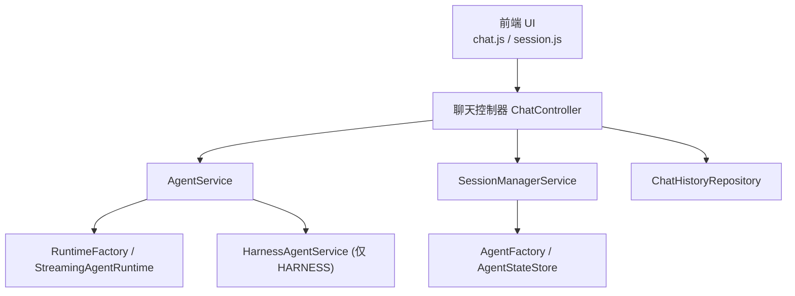
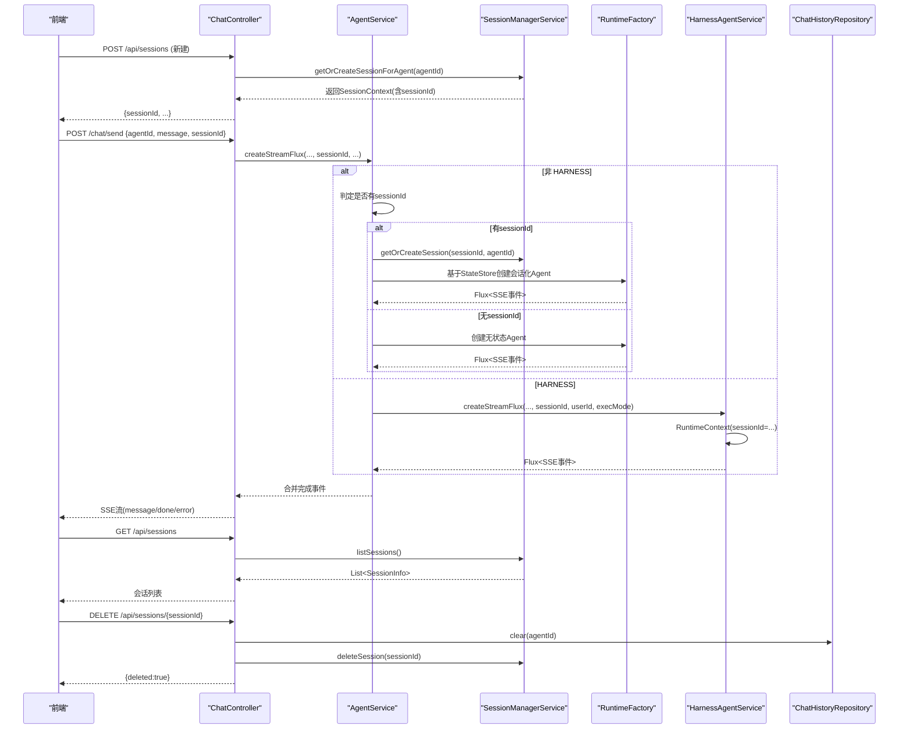
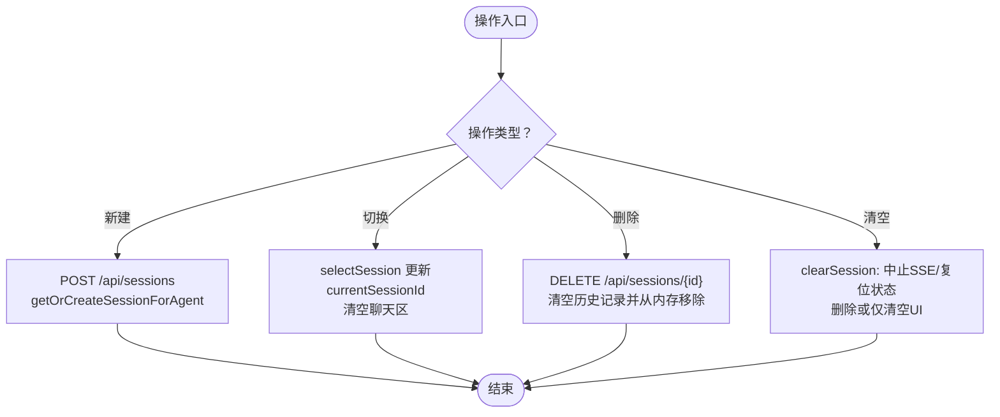
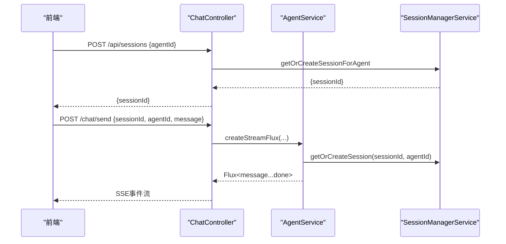
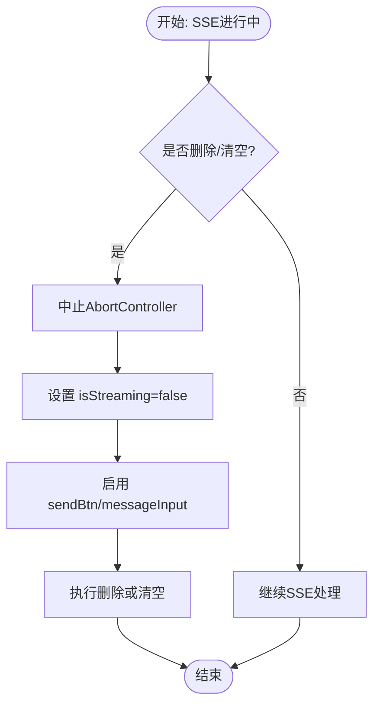
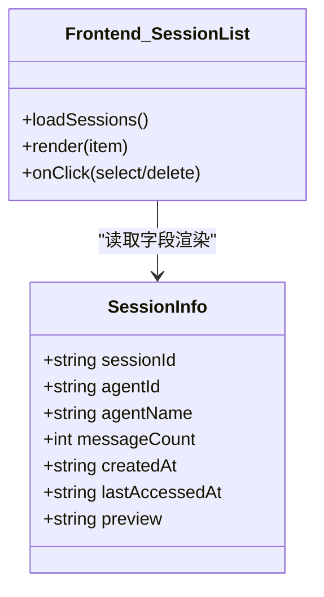
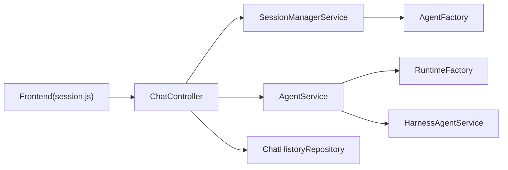

# 会话管理模块

<cite>
**本文引用的文件**
- [SessionManagerService.java](file://src/main/java/com/skloda/agentscope/service/SessionManagerService.java)
- [SessionInfo.java](file://src/main/java/com/skloda/agentscope/model/SessionInfo.java)
- [ChatController.java](file://src/main/java/com/skloda/agentscope/controller/ChatController.java)
- [AgentService.java](file://src/main/java/com/skloda/agentscope/service/AgentService.java)
- [HarnessAgentService.java](file://src/main/java/com/skloda/agentscope/harness/HarnessAgentService.java)
- [session.js](file://src/main/resources/static/scripts/modules/session.js)
- [chat.js](file://src/main/resources/static/scripts/chat.js)
</cite>

## 目录
1. [简介](#简介)
2. [项目结构](#项目结构)
3. [核心组件](#核心组件)
4. [架构总览](#架构总览)
5. [详细组件分析](#详细组件分析)
6. [依赖关系分析](#依赖关系分析)
7. [性能考虑](#性能考虑)
8. [故障排除指南](#故障排除指南)
9. [结论](#结论)
10. [附录](#附录)

## 简介
本技术文档聚焦于“会话管理模块”，覆盖从会话生命周期管理（创建、切换、删除、清空）到多会话支持机制（会话ID管理、消息历史加载、实时状态同步）、持久化策略（后端API调用、错误处理、状态恢复）、流式传输中的会话兼容性（在SSE连接中执行删除与清空），以及前端会话列表渲染与数据隔离等主题。目标是帮助读者快速理解端到端流程，并在实践中正确设计、使用与调试该能力。

## 项目结构
会话管理涉及前后端协作：
- 后端控制器暴露会话API，并通过会话管理器维护活跃会话与Agent上下文。
- Agent服务根据是否带sessionId决定走无状态流或有状态流；HARNESS类型会路由至Harness路径并注入RuntimeContext以承载sessionId。
- 前端通过session模块进行会话列表渲染与操作，并在聊天过程中携带或监听sessionId实现上下文绑定。

图表来源
- [ChatController.java:117-153](file://src/main/java/com/skloda/agentscope/controller/ChatController.java#L117-L153)
- [AgentService.java:131-177](file://src/main/java/com/skloda/agentscope/service/AgentService.java#L131-L177)
- [HarnessAgentService.java:37-63](file://src/main/java/com/skloda/agentscope/harness/HarnessAgentService.java#L37-L63)
- [SessionManagerService.java:75-145](file://src/main/java/com/skloda/agentscope/service/SessionManagerService.java#L75-L145)

章节来源
- [ChatController.java:117-153](file://src/main/java/com/skloda/agentscope/controller/ChatController.java#L117-L153)
- [AgentService.java:131-177](file://src/main/java/com/skloda/agentscope/service/AgentService.java#L131-L177)

## 核心组件
- SessionManagerService：维护活跃会话表、会话上下文（含Agent实例与StateStore）、会话迁移、会话列表、删除与会话命中（getOrCreate）。
- SessionInfo：会话列表展示用DTO（包含会话ID、代理ID、名称、消息数、访问时间等）。
- ChatController：提供对话发送与会话管理API（/chat/send、/api/sessions 列表、新增、删除、清理）。
- AgentService：统一流入口，负责在无状态与会话感知的流之间分支，并将sessionId透传到Agent/Supervisor/Harness的上下文中。
- HarnessAgentService：针对HARNESS类型构建RuntimeContext，并将sessionId注入其中，使Harness子流程保持会话一致性。
- 前端 session.js：承担会话列表渲染、创建/选择/删除、清空操作，以及在流进行中仍允许销毁/清空的安全防护。

章节来源
- [SessionManagerService.java:23-198](file://src/main/java/com/skloda/agentscope/service/SessionManagerService.java#L23-L198)
- [SessionInfo.java:1-21](file://src/main/java/com/skloda/agentscope/model/SessionInfo.java#L1-L21)
- [ChatController.java:213-258](file://src/main/java/com/skloda/agentscope/controller/ChatController.java#L213-L258)
- [AgentService.java:131-204](file://src/main/java/com/skloda/agentscope/service/AgentService.java#L131-L204)
- [HarnessAgentService.java:37-63](file://src/main/java/com/skloda/agentscope/harness/HarnessAgentService.java#L37-L63)
- [session.js:1-168](file://src/main/resources/static/scripts/modules/session.js#L1-L168)

## 架构总览
下图展示了会话管理的整体交互：前端发起会话操作和发送消息，后端控制器协调会话管理与Agent流式处理，会话上下文由会话管理器统一持有并与AgentStateStore关联，消息历史通过存储库访问。

图表来源
- [ChatController.java:117-153](file://src/main/java/com/skloda/agentscope/controller/ChatController.java#L117-L153)
- [AgentService.java:131-204](file://src/main/java/com/skloda/agentscope/service/AgentService.java#L131-L204)
- [HarnessAgentService.java:37-63](file://src/main/java/com/skloda/agentscope/harness/HarnessAgentService.java#L37-L63)
- [ChatController.java:213-258](file://src/main/java/com/skloda/agentscope/controller/ChatController.java#L213-L258)
- [SessionManagerService.java:75-145](file://src/main/java/com/skloda/agentscope/service/SessionManagerService.java#L75-L145)

## 详细组件分析

### 会话生命周期管理（创建、切换、删除、清空）
- 创建会话
  - 前端调用 /api/sessions，携带agentId。
  - 后端调用 getOrCreateSessionForAgent，若存在则touch并返回，否则 createNewSession 生成新sessionId与AgentStateStore，并放入内存会话表。
  - AgentService在有sessionId时走会话感知流；否则为无状态流。
- 切换会话
  - 前端 selectSession 更新当前sessionId并清空聊天区域。必要时动态选择对应agent。
  - 若切换后发送消息，将在payload中携带新的sessionId以保持上下文。
- 删除会话
  - 前端 DELETE /api/sessions/{sessionId}。
  - 后端先查询上下文获取agentId，清空历史记录，再从内存移除会话；前端即使异常也会清当前界面，保证用户体验一致。
- 清空当前会话
  - 前端 clearSession 支持“正在流式传输”的状态下也能中断并复位输入框与发送按钮，然后调用删除或直接清空UI。

图表来源
- [session.js:39-97](file://src/main/resources/static/scripts/modules/session.js#L39-L97)
- [ChatController.java:213-258](file://src/main/java/com/skloda/agentscope/controller/ChatController.java#L213-L258)
- [SessionManagerService.java:75-145](file://src/main/java/com/skloda/agentscope/service/SessionManagerService.java#L75-L145)

章节来源
- [session.js:39-97](file://src/main/resources/static/scripts/modules/session.js#L39-L97)
- [ChatController.java:213-258](file://src/main/java/com/skloda/agentscope/controller/ChatController.java#L213-L258)
- [SessionManagerService.java:75-145](file://src/main/java/com/skloda/agentscope/service/SessionManagerService.java#L75-L145)

### 多会话支持机制（会话ID管理、消息历史加载、实时状态同步）
- 会话ID管理
  - 会话ID由会话管理器生成（随机字符串片段），并存入内存ConcurrentHashMap用于快速访问与排序。
  - AgentService在有sessionId时请求会话上下文并透传至AgentRuntime或Supervisor/Harness上下文。
- 消息历史加载
  - 创建会话后，前端可选拉取消息历史；当前实现会在创建会话时尝试加载代理消息列表并渲染。
- 实时状态同步
  - SSE流中的事件包括message与done（错误时error），控制器将Map序列化为事件数据；AgentService合并工具调用、人工审批等多源事件。

图表来源
- [AgentService.java:131-177](file://src/main/java/com/skloda/agentscope/service/AgentService.java#L131-L177)
- [ChatController.java:117-153](file://src/main/java/com/skloda/agentscope/controller/ChatController.java#L117-L153)
- [SessionManagerService.java:75-129](file://src/main/java/com/skloda/agentscope/service/SessionManagerService.java#L75-L129)

章节来源
- [SessionManagerService.java:23-145](file://src/main/java/com/skloda/agentscope/service/SessionManagerService.java#L23-L145)
- [AgentService.java:131-177](file://src/main/java/com/skloda/agentscope/service/AgentService.java#L131-L177)
- [ChatController.java:117-153](file://src/main/java/com/skloda/agentscope/controller/ChatController.java#L117-L153)

### 会话持久化策略（后端API调用、错误处理、状态恢复）
- 后端API
  - /api/sessions：列表、新增、删除。
  - /chat/send：在会话模式下按sessionId获取已有上下文，确保对话延续。
- 错误处理
  - 控制器对异常序列化与SSE错误封装；AgentService在流上错误时返回error+done以便前端识别。
  - 前端在删除/清空流程中兜底清理界面，避免状态不一致。
- 状态恢复
  - 当前会话管理器使用内存缓存与会话类型迁移逻辑；若后续接入外部状态存储（如持久化StateStore），可通过配置生效并确保跨进程存活。

章节来源
- [ChatController.java:117-153](file://src/main/java/com/skloda/agentscope/controller/ChatController.java#L117-L153)
- [ChatController.java:213-258](file://src/main/java/com/skloda/agentscope/controller/ChatController.java#L213-L258)
- [SessionManagerService.java:95-108](file://src/main/java/com/skloda/agentscope/service/SessionManagerService.java#L95-L108)

### 流式传输中的会话操作兼容性（SSE连接中删除与清空）
- 在SSE进行中，用户仍可触发删除或清空，前端会立即中止当前Fetch AbortController，重置isStreaming并恢复按钮输入框可操作状态，再安全地执行删除或清空逻辑。
- 这样做避免了SSE断流导致界面“只能聊一次”的问题，并保障前端状态与后端删除一致。

图表来源
- [session.js:72-119](file://src/main/resources/static/scripts/modules/session.js#L72-L119)

章节来源
- [session.js:72-119](file://src/main/resources/static/scripts/modules/session.js#L72-L119)

### 会话列表渲染逻辑（会话信息展示、消息计数、最后访问时间显示）
- 后端列表接口返回会话ID、代理ID与名称、消息数量（来自历史记录仓库统计）、最后访问时间。
- 前端渲染每一项，显示预览（名称+消息数）、时间戳，并提供删除按钮。
- 切换会话时高亮当前会话项。

图表来源
- [SessionInfo.java:1-21](file://src/main/java/com/skloda/agentscope/model/SessionInfo.java#L1-L21)
- [ChatController.java:213-221](file://src/main/java/com/skloda/agentscope/controller/ChatController.java#L213-L221)
- [SessionManagerService.java:164-183](file://src/main/java/com/skloda/agentscope/service/SessionManagerService.java#L164-L183)
- [session.js:6-37](file://src/main/resources/static/scripts/modules/session.js#L6-L37)

章节来源
- [SessionInfo.java:1-21](file://src/main/java/com/skloda/agentscope/model/SessionInfo.java#L1-L21)
- [ChatController.java:213-221](file://src/main/java/com/skloda/agentscope/controller/ChatController.java#L213-L221)
- [SessionManagerService.java:164-183](file://src/main/java/com/skloda/agentscope/service/SessionManagerService.java#L164-L183)
- [session.js:6-37](file://src/main/resources/static/scripts/modules/session.js#L6-L37)

### 会话间的数据隔离机制与上下文切换过程
- 数据隔离
  - 每个会话拥有独立会话ID，对应独立的ReActAgent实例与AgentStateStore（会话模式），从而天然隔离不同会话的对话上下文与状态。
  - HARNESS路径通过RuntimeContext传递sessionId，使得子流程在同一会话内共享上下文。
- 上下文切换
  - 前端selectSession切换currentSessionId并清空聊天区，随后发消息时携带新sessionId进入新上下文。
  - 后端根据sessionId获取已存在的SessionContext或迁移/新建，确保后续消息进入正确上下文。

章节来源
- [SessionManagerService.java:45-145](file://src/main/java/com/skloda/agentscope/service/SessionManagerService.java#L45-L145)
- [AgentService.java:131-177](file://src/main/java/com/skloda/agentscope/service/AgentService.java#L131-L177)
- [HarnessAgentService.java:37-63](file://src/main/java/com/skloda/agentscope/harness/HarnessAgentService.java#L37-L63)
- [session.js:53-69](file://src/main/resources/static/scripts/modules/session.js#L53-L69)

## 依赖关系分析
- 控制器依赖会话管理器进行CRUD，同时依赖AgentService驱动流式交互与历史记录仓库进行删除时的历史清理。
- 会话管理器依赖AgentFactory构造不同状态的Agent与StateStore，并受AgentConfigService配置驱动（默认类型、存储路径）。
- 前端依赖API模块发起HTTP请求并监听SSE事件，session模块封装了复杂的UI状态机与中断处理。

图表来源
- [ChatController.java:117-153](file://src/main/java/com/skloda/agentscope/controller/ChatController.java#L117-L153)
- [ChatController.java:213-258](file://src/main/java/com/skloda/agentscope/controller/ChatController.java#L213-L258)
- [SessionManagerService.java:75-145](file://src/main/java/com/skloda/agentscope/service/SessionManagerService.java#L75-L145)
- [session.js:1-37](file://src/main/resources/static/scripts/modules/session.js#L1-L37)

章节来源
- [ChatController.java:117-153](file://src/main/java/com/skloda/agentscope/controller/ChatController.java#L117-L153)
- [ChatController.java:213-258](file://src/main/java/com/skloda/agentscope/controller/ChatController.java#L213-L258)
- [SessionManagerService.java:75-145](file://src/main/java/com/skloda/agentscope/service/SessionManagerService.java#L75-L145)
- [session.js:1-37](file://src/main/resources/static/scripts/modules/session.js#L1-L37)

## 性能考虑
- 内存会话表使用并发容器，支持多客户端并发读写。
- 会话列表按最后访问时间降序排列，提升最近使用体验。
- 在流中禁用重复任务（如重复启动轮次、清空旧上下文），避免竞争条件与冗余开销。
- SSE流完成后及时关闭EventSink，避免悬挂导致资源占用。

## 故障排除指南
- 现象：点击删除/清空后发送框一直不可用
  - 排查：确认前端在删除/清空前是否中断了SSE（AbortController）并将isStreaming置回false。见[删除/清空]逻辑。
  - 参考：[session.js:72-119](file://src/main/resources/static/scripts/modules/session.js#L72-L119)
- 现象：同一sessionId在不同agent间切换后上下文错乱
  - 排查：确认createSession返回了新sessionId，且后续发送均带上该sessionId；查看会话管理器是否在类型变化时进行了迁移。
  - 参考：[会话迁移]与[创建/选择会话]
  - 参考：[SessionManagerService.java:95-108](file://src/main/java/com/skloda/agentscope/service/SessionManagerService.java#L95-L108)
- 现象：HARNESS模式丢失sessionId
  - 排查：确认AgentService路由到HarnessAgentService，后者构建了带sessionId的RuntimeContext。
  - 参考：[HarnessAgentService.java:37-63](file://src/main/java/com/skloda/agentscope/harness/HarnessAgentService.java#L37-L63)
- 现象：会话列表不刷新或不显示消息数
  - 排查：确认后端list接口已填充messageCount；前端渲染使用了最新数据。
  - 参考：[会话列表渲染]
  - 参考：[ChatController.java:213-221](file://src/main/java/com/skloda/agentscope/controller/ChatController.java#L213-L221)

章节来源
- [session.js:72-119](file://src/main/resources/static/scripts/modules/session.js#L72-L119)
- [SessionManagerService.java:95-108](file://src/main/java/com/skloda/agentscope/service/SessionManagerService.java#L95-L108)
- [HarnessAgentService.java:37-63](file://src/main/java/com/skloda/agentscope/harness/HarnessAgentService.java#L37-L63)
- [ChatController.java:213-221](file://src/main/java/com/skloda/agentscope/controller/ChatController.java#L213-L221)

## 结论
本模块通过清晰的职责划分与前后端协同，实现了健壮的会话管理能力：支持多会话并发、上下文隔离、流式操作中稳定删除与清空、并可扩展持久化。建议在后续版本中结合分布式StateStore与集中式历史记录数据库进一步提升可靠性，同时在API层增加更细粒度的鉴权与会话级审计。

## 附录
- 关键API
  - GET /api/sessions：列出会话（会话ID、代理ID、名称、消息数、最后访问时间）
  - POST /api/sessions：为指定agent创建会话（返回sessionId）
  - DELETE /api/sessions/{sessionId}：删除会话并清理历史
  - POST /chat/send：发送消息（可选择携带sessionId进入会话模式）
- 前端要点
  - 流中进行删除/清空需中止SSE、复位状态后再操作，避免界面锁死
  - 会话选择应清空聊天区域并切换到对应agent（如需）
- 最佳实践
  - 发送前确保currentSessionId有效；若无则新建
  - 遇到网络异常或服务端错误，前端要容错并提示
  - 对HARNESS模式，校验apiKey配置，避免运行时失败