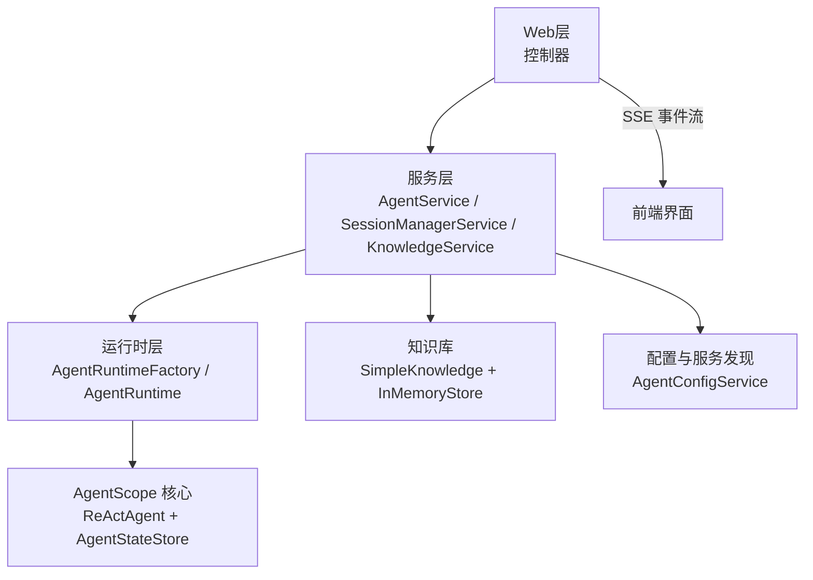
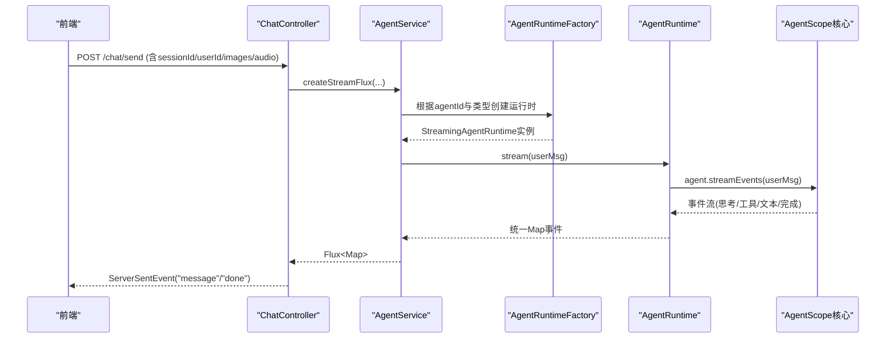
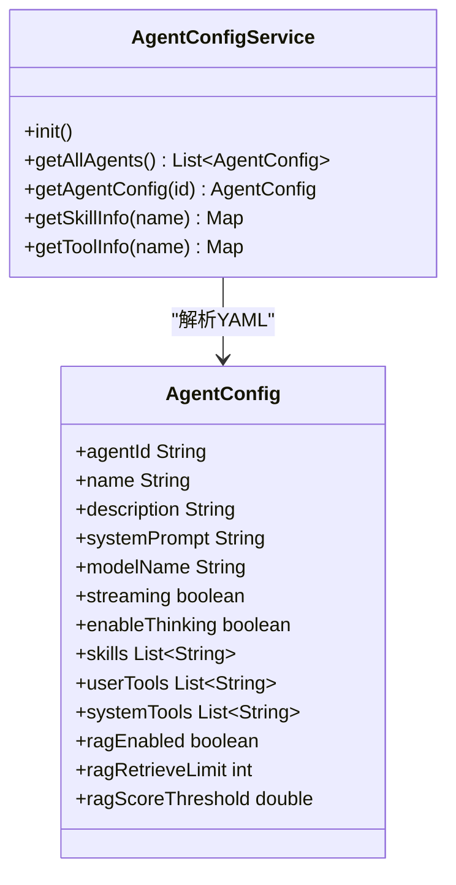
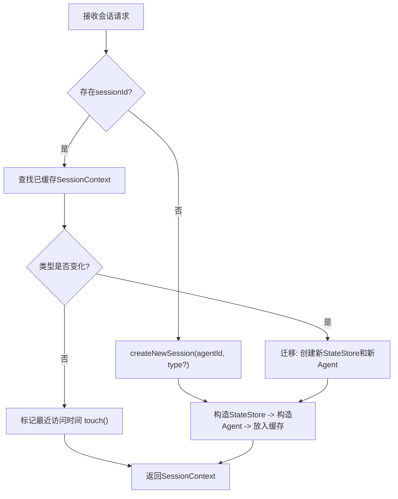
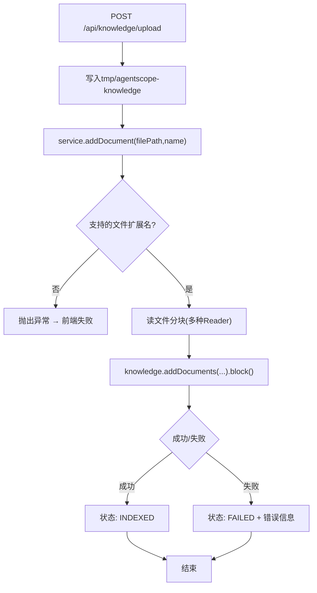
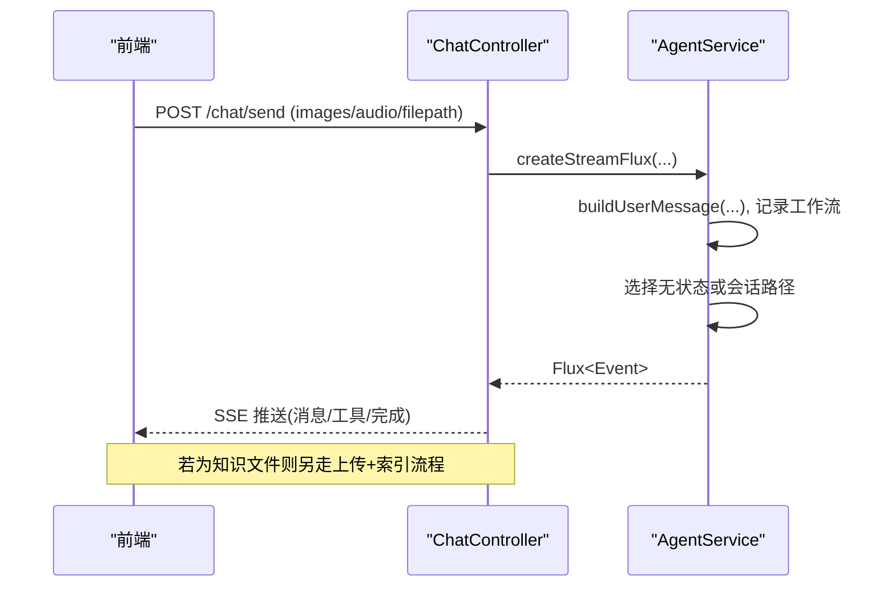
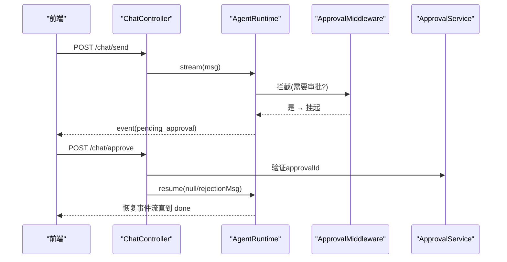
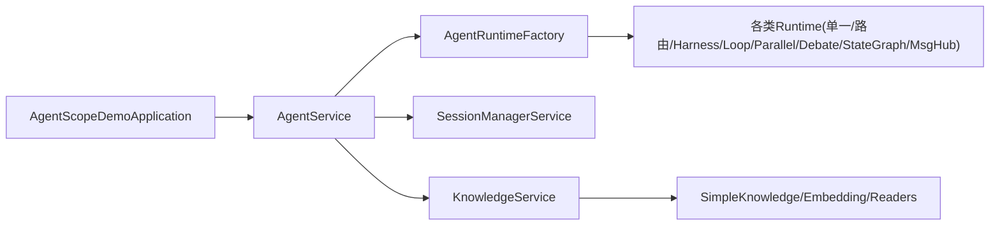

# 功能模块详解

<cite>
**本文引用的文件列表**
- [application.yml](file://src/main/resources/application.yml)
- [AgentScopeDemoApplication.java](file://src/main/java/com/skloda/agentscope/AgentScopeDemoApplication.java)
- [ChatController.java](file://src/main/java/com/skloda/agentscope/controller/ChatController.java)
- [KnowledgeController.java](file://src/main/java/com/skloda/agentscope/controller/KnowledgeController.java)
- [SessionManagerService.java](file://src/main/java/com/skloda/agentscope/service/SessionManagerService.java)
- [KnowledgeService.java](file://src/main/java/com/skloda/agentscope/service/KnowledgeService.java)
- [AgentConfigService.java](file://src/main/java/com/skloda/agentscope/agent/AgentConfigService.java)
- [agents.yml](file://src/main/resources/config/agents.yml)
- [harness-agents.yml](file://src/main/resources/config/harness-agents.yml)
- [AgentService.java](file://src/main/java/com/skloda/agentscope/service/AgentService.java)
- [AgentRuntimeFactory.java](file://src/main/java/com/skloda/agentscope/runtime/AgentRuntimeFactory.java)
- [AgentRuntime.java](file://src/main/java/com/skloda/agentscope/runtime/AgentRuntime.java)
- [SessionInfo.java](file://src/main/java/com/skloda/agentscope/model/SessionInfo.java)
- [KnowledgeIndexStatus.java](file://src/main/java/com/skloda/agentscope/model/KnowledgeIndexStatus.java)
</cite>

## 目录
1. [简介](#简介)
2. [项目结构](#项目结构)
3. [核心组件](#核心组件)
4. [架构总览](#架构总览)
5. [详细组件分析](#详细组件分析)
6. [依赖关系分析](#依赖关系分析)
7. [性能与扩展性考量](#性能与扩展性考量)
8. [故障排查指南](#故障排查指南)
9. [结论](#结论)
10. [附录：配置与定制开发指南](#附录：配置与定制开发指南)

## 简介
本仓库是一个基于 AgentScope 的 Java 演示应用，实现了以下功能：
- 动态加载并展示 Agent 列表、技能信息，支持对话与工具调用。
- 会话管理：多会话切换、会话持久化（通过 AgentStateStore）、历史消息加载能力接入点。
- 知识库（RAG）：本地知识目录自动索引、上传文件、相似度检索。
- 文件上传：多格式文件处理、状态跟踪、预览下载入口。
- 模块通信：通过控制器与 Spring Service 协作，SSE 流式事件贯穿前端至后端；黑版共享黑板用于多智能体协作。

该文档面向工程师，按“架构→模块→数据流→可扩展性→配置”逐层展开，并在相应位置提供源码引用和 Mermaid 图，便于快速定位与二次开发。

## 项目结构
项目采用典型的 Spring Boot 分层：
- Web 层：控制器接收请求，返回 SSE 流或 JSON。
- 服务层：封装 Agent 路由、会话、知识库等核心逻辑。
- 运行时：基于 AgentScope 2.0 的事件流、状态存储、可观测性钩子。
- 配置：YAML/Properties 驱动行为、启用特性开关。

**图示来源**
- [ChatController.java:122-153](file://src/main/java/com/skloda/agentscope/controller/ChatController.java#L122-L153)
- [AgentService.java:140-177](file://src/main/java/com/skloda/agentscope/service/AgentService.java#L140-L177)
- [AgentRuntimeFactory.java:41-60](file://src/main/java/com/skloda/agentscope/runtime/AgentRuntimeFactory.java#L41-L60)
- [AgentRuntime.java:68-142](file://src/main/java/com/skloda/agentscope/runtime/AgentRuntime.java#L68-L142)
- [KnowledgeService.java:73-89](file://src/main/java/com/skloda/agentscope/service/KnowledgeService.java#L73-L89)

**章节来源**
- [AgentScopeDemoApplication.java:11-34](file://src/main/java/com/skloda/agentscope/AgentScopeDemoApplication.java#L11-L34)
- [application.yml:26-80](file://src/main/resources/application.yml#L26-L80)

## 核心组件
- 控制器：负责 HTTP/SSE 收发、会话上下文注入、审批流集成。
- 服务层：
  - AgentService：根据 Agent 类型路由到普通、Harness、Supervisor/Blackboard 等执行路径，并统一记录工作流。
  - SessionManagerService：维护多会话生命周期（创建/获取/删除/迁移），支撑 AgentStateStore 的会话持久化。
  - KnowledgeService：启动扫描本地知识目录、上传文档索引、相似度检索、索引状态查询。
- 运行时层：AgentRuntimeFactory 按 Agent 类型创建运行时；AgentRuntime 合并事件流、审批恢复、完成关闭等。
- 配置加载：AgentConfigService 从 YAML 读取 Agent/技能元数据、描述，供前端 UI 展示。

**章节来源**
- [ChatController.java:47-70](file://src/main/java/com/skloda/agentscope/controller/ChatController.java#L47-L70)
- [AgentService.java:26-60](file://src/main/java/com/skloda/agentscope/service/AgentService.java#L26-L60)
- [SessionManagerService.java:23-44](file://src/main/java/com/skloda/agentscope/service/SessionManagerService.java#L23-L44)
- [KnowledgeService.java:39-89](file://src/main/java/com/skloda/agentscope/service/KnowledgeService.java#L39-L89)
- [AgentRuntimeFactory.java:21-60](file://src/main/java/com/skloda/agentscope/runtime/AgentRuntimeFactory.java#L21-L60)
- [AgentRuntime.java:26-65](file://src/main/java/com/skloda/agentscope/runtime/AgentRuntime.java#L26-L65)
- [AgentConfigService.java:23-76](file://src/main/java/com/skloda/agentscope/agent/AgentConfigService.java#L23-L76)

## 架构总览
整体由“控制器→服务→运行时→框架核心”四级组成，并通过 SSE 将底层事件回推前端：

**图示来源**
- [ChatController.java:122-153](file://src/main/java/com/skloda/agentscope/controller/ChatController.java#L122-L153)
- [AgentService.java:140-177](file://src/main/java/com/skloda/agentscope/service/AgentService.java#L140-L177)
- [AgentRuntimeFactory.java:41-60](file://src/main/java/com/skloda/agentscope/runtime/AgentRuntimeFactory.java#L41-L60)
- [AgentRuntime.java:68-142](file://src/main/java/com/skloda/agentscope/runtime/AgentRuntime.java#L68-L142)

## 详细组件分析

### 模块一：Agent 管理（动态列表、配置对话框、技能信息）
- 动态列表与能力展示
  - AgentConfigService 启动时加载 agents.yml 与 harness-agents.yml，构建 AgentConfig 集合。
  - getSkillInfo/getToolInfo 反射解析 Tool/@ToolParam，生成前端可用的技能与工具清单。
- 配置对话框
  - 由 AgentConfig 中的字段驱动（系统提示、模型名、是否流式、是否开启思考等）。
  - 可通过分类 category、skills、userTools/systemTools 进行编排。
- 典型 Agent
  - 简单对话、工具调用、任务文档分析、银行发票生成、RAG Chat。

**图示来源**
- [AgentConfigService.java:23-76](file://src/main/java/com/skloda/agentscope/agent/AgentConfigService.java#L23-L76)
- [AgentConfigService.java:110-173](file://src/main/java/com/skloda/agentscope/agent/AgentConfigService.java#L110-L173)
- [agents.yml:1-200](file://src/main/resources/config/agents.yml#L1-L200)
- [harness-agents.yml:1-87](file://src/main/resources/config/harness-agents.yml#L1-L87)

**章节来源**
- [AgentConfigService.java:23-76](file://src/main/java/com/skloda/agentscope/agent/AgentConfigService.java#L23-L76)
- [AgentConfigService.java:90-173](file://src/main/java/com/skloda/agentscope/agent/AgentConfigService.java#L90-L173)
- [agents.yml:1-200](file://src/main/resources/config/agents.yml#L1-L200)
- [harness-agents.yml:1-87](file://src/main/resources/config/harness-agents.yml#L1-L87)

### 模块二：会话管理（多会话切换、持久化、历史消息）
- 多会话切换与缓存
  - SessionManagerService 以 ConcurrentHashMap 维护活跃会话上下文（包含 ReActAgent、AgentStateStore、sessionType）。
  - 支持按 sessionId 复用，按 agentId 一键切换到对应 Agent 的会话。
- 会话持久化
  - 构造阶段通过 AgentConfig 中的 sessionConfig 决定默认类型与存储路径，调用 AgentRuntimeFactory.createStateStore 获得状态存储器。
  - 类型变更时自动迁移：新建新的 StateStore 与 Agent，覆盖旧上下文。
- 历史消息加载
  - 在 AgentScope 2.0 中，历史对话由 AgentStateStore 保存，后续相同 sessionId 的消息会接续上下文；本项目未实现显式的“历史消息拉取接口”，但已具备接入点（可在此基础上增加分页查询等）。

**图示来源**
- [SessionManagerService.java:75-149](file://src/main/java/com/skloda/agentscope/service/SessionManagerService.java#L75-L149)

**章节来源**
- [SessionManagerService.java:23-198](file://src/main/java/com/skloda/agentscope/service/SessionManagerService.java#L23-L198)
- [SessionInfo.java:1-21](file://src/main/java/com/skloda/agentscope/model/SessionInfo.java#L1-L21)
- [AgentRuntimeFactory.java:85-104](file://src/main/java/com/skloda/agentscope/runtime/AgentRuntimeFactory.java#L85-L104)

### 模块三：知识库（索引、上传、相似度搜索）
- 索引策略
  - ApplicationReady 事件触发后台单线程扫描 local knowledge 路径（可由配置控制是否自动索引）。
  - 使用 SimpleKnowledge + DashScope Embedding + InMemoryStore。
- 上传管理
  - KnowledgeController.uploadDocument 校验后缀（pdf/docx/txt/md），写入 tmp 目录后再调用 service.addDocument。
  - addDocument 内部同步地读取切片（Reader），调用 knowledge.addDocuments(blocking)，更新每个文件的索引状态（INDEXING→INDEXED/FAILED）。
- 相似度搜索
  - KnowledgeController.search 接收 query/limit/threshold，调用 knowledge.retrieve 返回列表，转换为轻量 JSON 响应。

**图示来源**
- [KnowledgeController.java:40-78](file://src/main/java/com/skloda/agentscope/controller/KnowledgeController.java#L40-L78)
- [KnowledgeService.java:99-178](file://src/main/java/com/skloda/agentscope/service/KnowledgeService.java#L99-L178)

**章节来源**
- [KnowledgeService.java:39-178](file://src/main/java/com/skloda/agentscope/service/KnowledgeService.java#L39-L178)
- [KnowledgeController.java:40-130](file://src/main/java/com/skloda/agentscope/controller/KnowledgeController.java#L40-L130)
- [KnowledgeIndexStatus.java:1-59](file://src/main/java/com/skloda/agentscope/model/KnowledgeIndexStatus.java#L1-L59)

### 模块四：文件上传（多格式、进度、预览）
- 聊天文件上传
  - ChatController.sendMessage 接受 images/audio/filePath/fileName，将其组装成 Msg（含图文/音频块），进入 Agent 流式处理。
- 知识文件上传
  - KnowledgeController.uploadDocument 仅支持 pdf/docx/txt/md，上传后即刻索引，返回“已索引”状态。
- 进度与预览
  - 知识索引在内存维护每文件的状态表（INDEXING/INDEXED/FAILED），前端可通过 GET /api/knowledge/status 轮询。
  - 聊天附件暂态存储在 tmp 目录；下载可通过 /chat/download?fileId=... 实现（本实现依赖服务侧暴露下载端点或使用其他下载中间件）。

**图示来源**
- [ChatController.java:122-153](file://src/main/java/com/skloda/agentscope/controller/ChatController.java#L122-L153)
- [KnowledgeController.java:80-130](file://src/main/java/com/skloda/agentscope/controller/KnowledgeController.java#L80-L130)

**章节来源**
- [ChatController.java:122-153](file://src/main/java/com/skloda/agentscope/controller/ChatController.java#L122-L153)
- [KnowledgeController.java:80-130](file://src/main/java/com/skloda/agentscope/controller/KnowledgeController.java#L80-L130)

### 模块间通信机制与数据共享策略
- 请求链路
  - 控制器仅做协议转换（HTTP↔SSE），核心逻辑在 Service/Factory/Runtime。
- 事件传播
  - AgentRuntime 将 AgentScope 原生事件流（streamEvents）与手动 EventSink（多智能体/路由/交接）合并，保证前后端事件一致性。
- 审批流
  - AgentRuntime 结束时检查 ApprovalMiddleware 是否触发；如触发，返回 pending_approval 事件；前端调用 /chat/approve 携带 approvalId 恢复流执行。
- 会话与上下文
  - SessionManagerService 统一维护 sessionId ↔ (Agent, StateStore) 映射；多智能体场景通过 SupervisorRuntime/BlackboardService 在会话内共享黑板数据。

**图示来源**
- [AgentRuntime.java:68-183](file://src/main/java/com/skloda/agentscope/runtime/AgentRuntime.java#L68-L183)
- [ChatController.java:155-186](file://src/main/java/com/skloda/agentscope/controller/ChatController.java#L155-L186)

**章节来源**
- [AgentRuntime.java:68-183](file://src/main/java/com/skloda/agentscope/runtime/AgentRuntime.java#L68-L183)
- [ChatController.java:155-186](file://src/main/java/com/skloda/agentscope/controller/ChatController.java#L155-L186)
- [AgentService.java:140-177](file://src/main/java/com/skloda/agentscope/service/AgentService.java#L140-L177)

## 依赖关系分析
- 入口与应用装配
  - 主类启用配置属性并监听启动事件输出端口。
- 运行期依赖
  - AgentService 依赖 AgentRuntimeFactory、SessionManagerService、WorkflowRunService、ChatHistoryRepository、HarnessAgentService、SupervisorRuntimeFactory（可选）。
  - AgentRuntimeFactory 根据 Agent 类型分发到不同运行时（单智能体/路由/流水线/循环/并行/辩论/Harness等）。
  - KnowledgeService 依赖 AgentScope RAG 组件（DashScope 嵌入、InMemoryStore、读写器）。

**图示来源**
- [AgentScopeDemoApplication.java:11-34](file://src/main/java/com/skloda/agentscope/AgentScopeDemoApplication.java#L11-L34)
- [AgentService.java:26-60](file://src/main/java/com/skloda/agentscope/service/AgentService.java#L26-L60)
- [AgentRuntimeFactory.java:21-60](file://src/main/java/com/skloda/agentscope/runtime/AgentRuntimeFactory.java#L21-L60)
- [KnowledgeService.java:39-89](file://src/main/java/com/skloda/agentscope/service/KnowledgeService.java#L39-L89)

**章节来源**
- [AgentService.java:26-177](file://src/main/java/com/skloda/agentscope/service/AgentService.java#L26-L177)
- [AgentRuntimeFactory.java:21-180](file://src/main/java/com/skloda/agentscope/runtime/AgentRuntimeFactory.java#L21-L180)
- [KnowledgeService.java:39-178](file://src/main/java/com/skloda/agentscope/service/KnowledgeService.java#L39-L178)

## 性能与扩展性考量
- 流式处理
  - 全程基于 Reactor Flux 与 AgentScope 2.0 事件流，避免阻塞，适合实时交互。
- 索引与扫描
  - 知识库索引采用单线程后台作业，避免主线程阻塞；大目录批量索引建议调整线程策略或引入批大小限制。
- 内存占用
  - InMemoryStore 随向量增长而增大，生产环境应替换为持久化向量库；会话存储可根据 AgentConfig 切换数据库或分布式存储。
- 并发与安全
  - 上传目录受系统临时目录保护，需限制文件类型、大小与权限；长会话需注意上下文膨胀与压缩策略。

[本节为通用建议，不直接分析具体文件]

## 故障排查指南
- 无法接收到 done 事件
  - 检查 AgentRuntime.doFinally 是否正确完成 EventSink，确保事件合并可正常终止。
- 知识库索引失败
  - 查看 upload/document 返回值与 /api/knowledge/status，确认文件格式、分片大小、嵌入模型配置。
- 审批流卡住
  - 确认 /chat/approve 传入的 approvalId 有效且未被重复消费；必要时重试并清空挂起的 ToolUseBlock。

**章节来源**
- [AgentRuntime.java:112-183](file://src/main/java/com/skloda/agentscope/runtime/AgentRuntime.java#L112-L183)
- [KnowledgeController.java:40-130](file://src/main/java/com/skloda/agentscope/controller/KnowledgeController.java#L40-L130)
- [ChatController.java:155-186](file://src/main/java/com/skloda/agentscope/controller/ChatController.java#L155-L186)

## 结论
该实现以清晰的边界划分了“控制器—服务—运行时—框架核心”，并通过 YAML 驱动的 Agent 配置体系达到“动态加载与展示”。知识库以插件化的 Reader/Embedding/Store 组合提供了扩展空间；会话层抽象了不同的 StateStore 以实现持久化与迁移；审批流与多智能体黑板进一步增强了工程落地能力。

[本节为总结，不直接分析具体文件]

## 附录：配置与定制开发指南
- 关键配置项（application.yml）
  - agentscope.model.dashscope.*：模型提供商、API Key、模型名、流式、思考模式、预算。
  - agentscope.memory.type：记忆类型（in-memory/redis/mysql/postgresql 等，由 profile 控制）。
  - agentscope.session.enabled/storag e-path：会话能力开关与基础路径。
  - agentscope.knowledge.*：启用、路径、embedding模型/维度、分片参数、是否启动自动索引。
  - spring.servlet.multipart.*：上传文件大小限制。
- 新增 Agent
  - 在 agents.yml 或 harness-agents.yml 中添加条目；如需新工具则注册至 ToolRegistry；如需技能则在 skills/* 下准备 SKILL.md。
  - 重启应用即可在前端出现该 Agent。
- 会话持久化
  - 将 memory 或 state store 切换为 redis/mysql/postgresql（通过 profiles 与 DistributedStateStoreConfig），并确保连接可用；SessionManagerService 会根据 AgentConfig 创建对应 StateStore。
- 知识库定制
  - 修改 KnowledgeService 的 embedding 模型/维度/分片策略；按需替换 InMemoryStore 为持久化向量存储。
  - 扩展文件类型：在上载与读取处增加支持的后缀与 Reader。

**章节来源**
- [application.yml:26-80](file://src/main/resources/application.yml#L26-L80)
- [agents.yml:1-200](file://src/main/resources/config/agents.yml#L1-L200)
- [harness-agents.yml:1-87](file://src/main/resources/config/harness-agents.yml#L1-L87)
- [AgentConfigService.java:23-76](file://src/main/java/com/skloda/agentscope/agent/AgentConfigService.java#L23-L76)
- [KnowledgeService.java:73-89](file://src/main/java/com/skloda/agentscope/service/KnowledgeService.java#L73-L89)