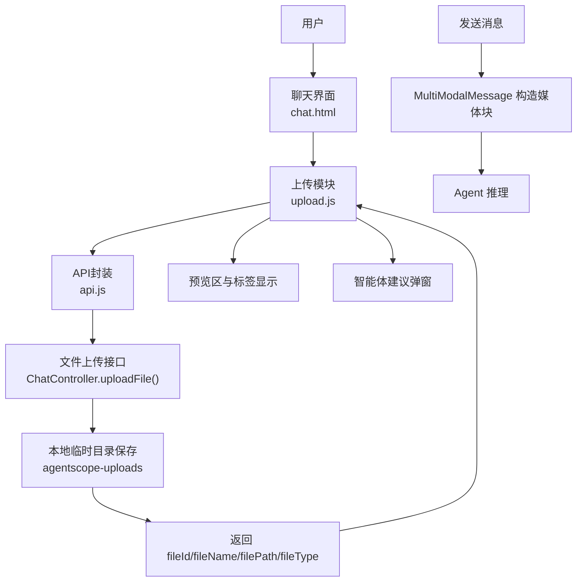
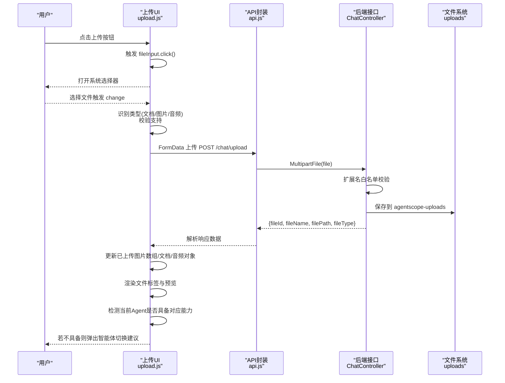
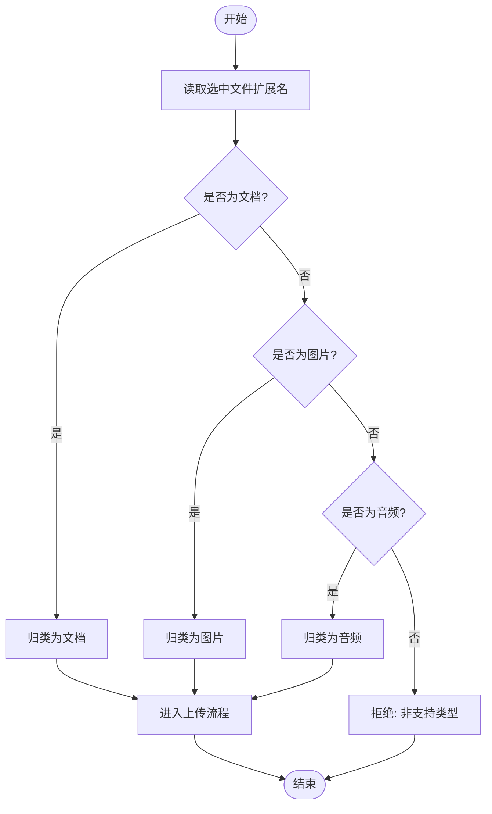
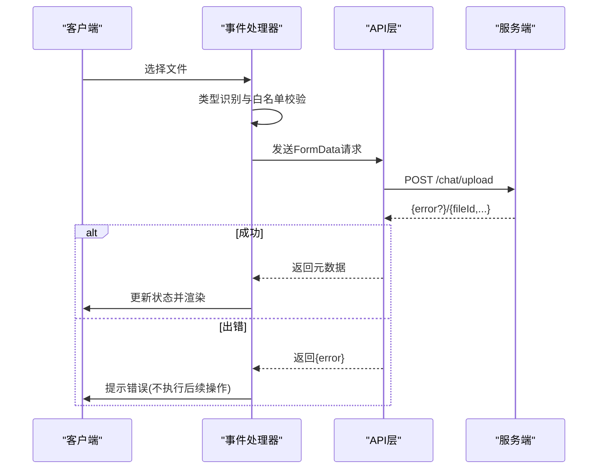
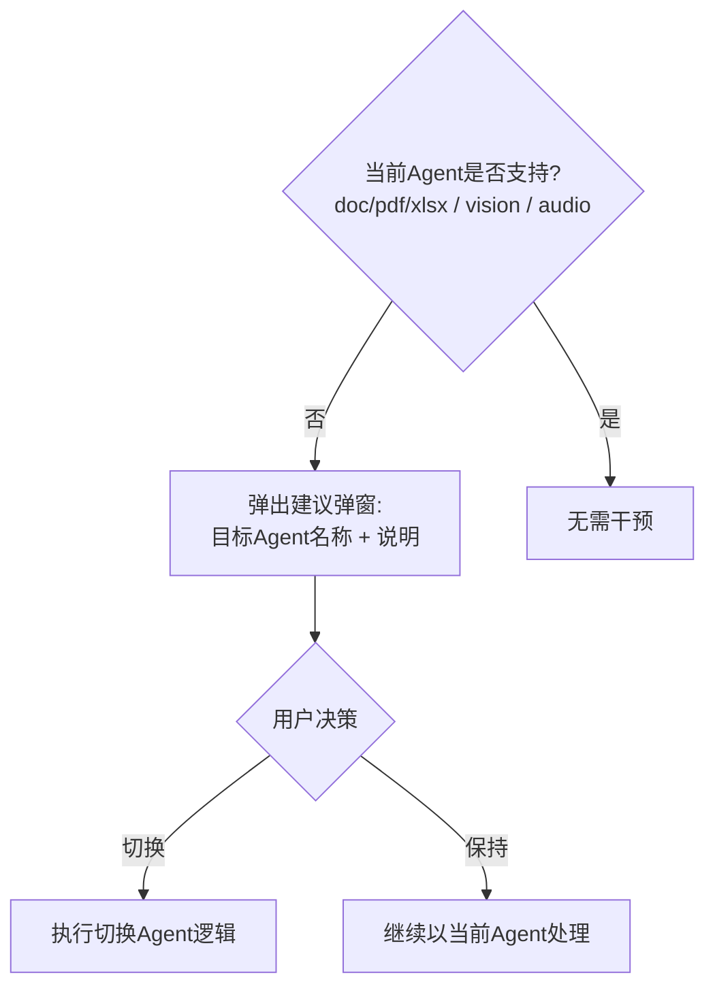
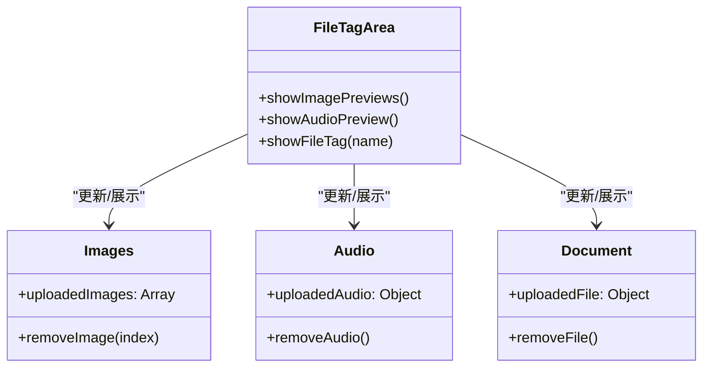
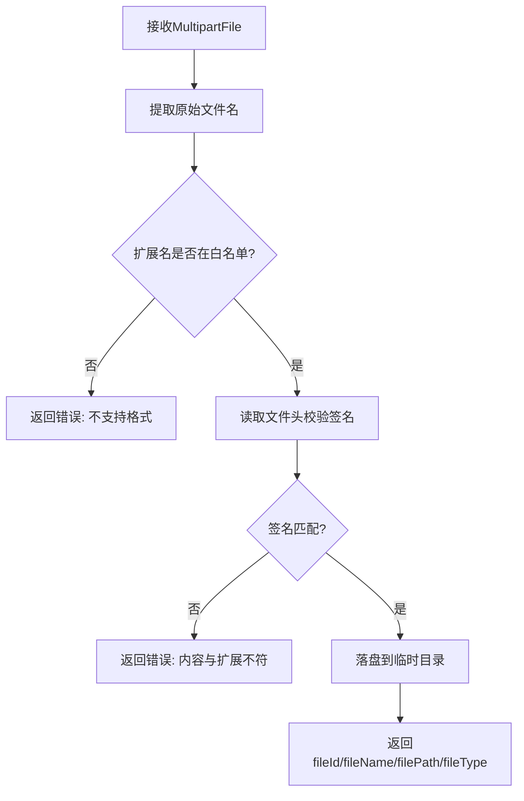
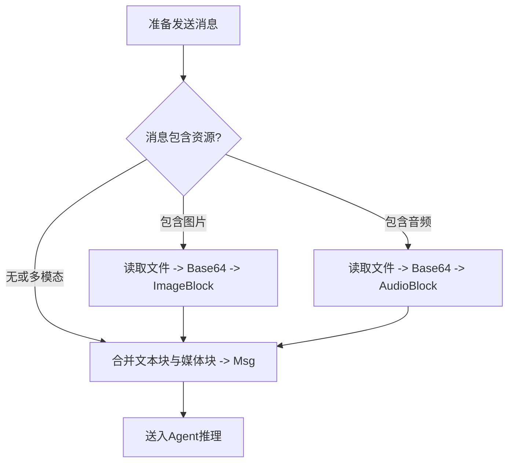
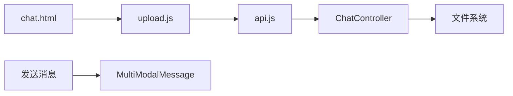

# 文件上传模块

<cite>
**本文引用的文件**
- [upload.js](file://src/main/resources/static/scripts/modules/upload.js)
- [api.js](file://src/main/resources/static/scripts/api.js)
- [chat.html](file://src/main/resources/templates/chat.html)
- [upload.css](file://src/main/resources/static/styles/modules/upload.css)
- [ChatController.java](file://src/main/java/com/skloda/agentscope/controller/ChatController.java)
- [MultiModalMessage.java](file://src/main/java/com/skloda/agentscope/model/MultiModalMessage.java)
</cite>

## 目录
1. 简介
2. 项目结构
3. 核心组件
4. 架构总览
5. 详细组件分析
6. 依赖关系分析
7. 性能与限制
8. 故障排查
9. 结论
10. 附录

## 简介
本模块提供多格式文件的上传、校验、预览与智能体适配建议能力，支持文档（DOCX、PDF、XLSX）、图片（JPG、JPEG、PNG、GIF、WEBP）和音频（WAV、MP3、M4A、MP4）。前端负责文件选择、类型识别、上传进度交互与预览；后端提供安全上传、内容签名校验和媒体消息封装，将文件路径与类型注入会话消息流。当检测当前智能体不支持特定模态时，会弹出确认框建议切换至合适的智能体，确保“选对工具”后再处理文件。

## 项目结构
文件上传涉及前后端协作：
- 前端：事件绑定、类型识别、上传调用、状态与预览渲染、模态弹窗与智能体建议。
- 后端：文件接收、白名单校验、内容签名验证、落盘、返回统一结果。
- 消息层：将图片或音频以 Base64 的 MediaBlock 形式注入 AgentScope Msg，供下游模型消费。

**图示来源**
- [upload.js:5-111](file://src/main/resources/static/scripts/modules/upload.js#L5-L111)
- [api.js:27-41](file://src/main/resources/static/scripts/api.js#L27-L41)
- [ChatController.java:419-471](file://src/main/java/com/skloda/agentscope/controller/ChatController.java#L419-L471)
- [MultiModalMessage.java:24-172](file://src/main/java/com/skloda/agentscope/model/MultiModalMessage.java#L24-L172)

**章节来源**
- [chat.html:49-73](file://src/main/resources/templates/chat.html#L49-L73)
- [upload.js:5-111](file://src/main/resources/static/scripts/modules/upload.js#L5-L111)
- [api.js:27-41](file://src/main/resources/static/scripts/api.js#L27-L41)
- [ChatController.java:419-471](file://src/main/java/com/skloda/agentscope/controller/ChatController.java#L419-L471)
- [MultiModalMessage.java:24-172](file://src/main/java/com/skloda/agentscope/model/MultiModalMessage.java#L24-L172)

## 核心组件
- 前端上传流程
  - 按钮与 input 事件绑定，change 时触发类型识别与上传。
  - 按扩展名分类并校验支持的文档/图片/音频类型。
  - 通过 fetch 调用 /chat/upload，处理响应并在标签区渲染。
- 后端上传控制器
  - 参数校验、扩展名白名单、内容签名验证、落盘、统一返回。
- 多媒体消息构建
  - 在发送阶段将图片或音频以 Base64 MediaBlock 打包到 Msg，传递给 Agent。
- 预览与状态
  - 图片点击预览放大、音频标签展示、文档标签展示。
  - 内存数组/对象承载已上传图片列表、当前文档与当前音频。

**章节来源**
- [upload.js:22-154](file://src/main/resources/static/scripts/modules/upload.js#L22-L154)
- [api.js:27-41](file://src/main/resources/static/scripts/api.js#L27-L41)
- [ChatController.java:419-471](file://src/main/java/com/skloda/agentscope/controller/ChatController.java#L419-L471)
- [MultiModalMessage.java:31-157](file://src/main/java/com/skloda/agentscope/model/MultiModalMessage.java#L31-L157)

## 架构总览
下图展示了从前端选择文件到后端保存与返回、再到预览与智能体建议的完整时序。

**图示来源**
- [upload.js:5-111](file://src/main/resources/static/scripts/modules/upload.js#L5-L111)
- [api.js:27-41](file://src/main/resources/static/scripts/api.js#L27-L41)
- [ChatController.java:419-471](file://src/main/java/com/skloda/agentscope/controller/ChatController.java#L419-L471)

**章节来源**
- [upload.js:5-111](file://src/main/resources/static/scripts/modules/upload.js#L5-L111)
- [api.js:27-41](file://src/main/resources/static/scripts/api.js#L27-L41)
- [ChatController.java:419-471](file://src/main/java/com/skloda/agentscope/controller/ChatController.java#L419-L471)

## 详细组件分析

### 文件类型识别与分类
- 识别规则基于文件扩展名（小写），分为三类：
  - 文档：.docx、.pdf、.xlsx
  - 图片：.jpg、.jpeg、.png、.gif、.webp
  - 音频：.wav、.mp3、.m4a、.mp4
- 不在白名单中的类型将被拒绝，清空输入控件。
- 后端同时做二次白名单检查和内容签名验证，防止“改名伪装”。

**图示来源**
- [upload.js:30-44](file://src/main/resources/static/scripts/modules/upload.js#L30-L44)
- [ChatController.java:431-449](file://src/main/java/com/skloda/agentscope/controller/ChatController.java#L431-L449)

**章节来源**
- [upload.js:30-44](file://src/main/resources/static/scripts/modules/upload.js#L30-L44)
- [ChatController.java:431-449](file://src/main/java/com/skloda/agentscope/controller/ChatController.java#L431-L449)

### 上传流程控制
- 事件绑定
  - 通过 id 绑定按钮 click 与 hidden input change 事件，统一入口处理。
- 上传调用
  - 使用 FormData 提交 /chat/upload，解析 JSON 响应。
- 错误处理
  - 若后端返回 error 字段，停止后续逻辑并记录日志。
- 重试机制
  - 当前未实现自动重试；可在业务层基于失败码或网络异常添加指数退避重试。

**图示来源**
- [upload.js:12-18](file://src/main/resources/static/scripts/modules/upload.js#L12-L18)
- [upload.js:22-111](file://src/main/resources/static/scripts/modules/upload.js#L22-L111)
- [api.js:27-41](file://src/main/resources/static/scripts/api.js#L27-L41)
- [ChatController.java:419-471](file://src/main/java/com/skloda/agentscope/controller/ChatController.java#L419-L471)

**章节来源**
- [upload.js:12-18](file://src/main/resources/static/scripts/modules/upload.js#L12-L18)
- [upload.js:22-111](file://src/main/resources/static/scripts/modules/upload.js#L22-L111)
- [api.js:27-41](file://src/main/resources/static/scripts/api.js#L27-L41)
- [ChatController.java:419-471](file://src/main/java/com/skloda/agentscope/controller/ChatController.java#L419-L471)

### 智能体建议系统
- 规则
  - 文档：检测当前 Agent 是否有 docx/pdf/xlsx 技能；无则建议切换到“task-document-analysis”。
  - 图片：检测当前 Agent 是否具有 vision/multi 模式；无且存在视觉助手则建议切换到“vision-analyzer”。
  - 音频：检测当前 Agent 是否具有 audio/multi 模式；无且存在语音助手则建议切换到“voice-assistant”。
- 交互
  - 动态生成模态框，提供“切换”和“保持当前”两个按钮；确认后调用切换逻辑并关闭弹窗。

**图示来源**
- [upload.js:56-105](file://src/main/resources/static/scripts/modules/upload.js#L56-L105)
- [upload.js:157-199](file://src/main/resources/static/scripts/modules/upload.js#L157-L199)

**章节来源**
- [upload.js:56-105](file://src/main/resources/static/scripts/modules/upload.js#L56-L105)
- [upload.js:157-199](file://src/main/resources/static/scripts/modules/upload.js#L157-L199)

### 多格式预览
- 图片
  - 点击图片文件名可触发预览（由全局函数控制）；上传后推入已上传图片数组并刷新标签区。
- 音频
  - 渲染为音频标签；由音频播放器控件承载播放。
- 文档
  - 展示文件名与删除按钮；用于后续发送时附加文件路径。

**图示来源**
- [upload.js:113-154](file://src/main/resources/static/scripts/modules/upload.js#L113-L154)

**章节来源**
- [upload.js:113-154](file://src/main/resources/static/scripts/modules/upload.js#L113-L154)

### 文件状态管理
- 内存数据结构
  - 图片：uploadedImages 数组，包含每个图片的元信息，便于多选图一并发送。
  - 音频：uploadedAudio 单一对象，存储最近一次上传的音频元信息。
  - 文档：uploadedFile 单一对象，存储最近一次上传的文档元信息。
- 同步策略
  - 每次上传成功后立即设置/更新上述对象，然后渲染标签区以保持视图与状态一致。

**章节来源**
- [upload.js:56-105](file://src/main/resources/static/scripts/modules/upload.js#L56-L105)
- [upload.js:121-154](file://src/main/resources/static/scripts/modules/upload.js#L121-L154)

### 后端处理与安全验证
- 白名单校验
  - 仅允许文档(.docx/.pdf/.xlsx)、图片(.jpg/.jpeg/.png/.gif/.webp)和音频(.wav/.mp3/.m4a/.mp4)。
- 内容签名校验
  - 读取文件头字节进行签名匹配，防止扩展名伪造。
- 落盘与下载
  - 保存至 ${java.io.tmpdir}/agentscope-uploads，并提供下载接口防路径穿越。

**图示来源**
- [ChatController.java:419-471](file://src/main/java/com/skloda/agentscope/controller/ChatController.java#L419-L471)

**章节来源**
- [ChatController.java:419-471](file://src/main/java/com/skloda/agentscope/controller/ChatController.java#L419-L471)

### 发送时的多模态消息组装
- 图片
  - 将图片以 Base64 与媒体类型打包为 ImageBlock，再组合到 Msg。
- 音频
  - 将音频以 Base64 与媒体类型打包为 AudioBlock，再组合到 Msg。
- 文档
  - 通过上传返回的文件路径作为上下文附件传入（交由下游工具或Agent使用）。

**图示来源**
- [MultiModalMessage.java:31-157](file://src/main/java/com/skloda/agentscope/model/MultiModalMessage.java#L31-L157)

**章节来源**
- [MultiModalMessage.java:31-157](file://src/main/java/com/skloda/agentscope/model/MultiModalMessage.java#L31-L157)

## 依赖关系分析
- 前端
  - upload.js 依赖 api.js 提供的 uploadFile；依赖 chat.html 注入的事件源元素。
  - 样式来自 upload.css，用于标签与列表可视化。
- 后端
  - ChatController 提供 /chat/upload 与 /chat/download；MultiModalMessage 为消息层工具类。

**图示来源**
- [chat.html:49-73](file://src/main/resources/templates/chat.html#L49-L73)
- [upload.js:5-111](file://src/main/resources/static/scripts/modules/upload.js#L5-L111)
- [api.js:27-41](file://src/main/resources/static/scripts/api.js#L27-L41)
- [ChatController.java:419-471](file://src/main/java/com/skloda/agentscope/controller/ChatController.java#L419-L471)
- [MultiModalMessage.java:31-157](file://src/main/java/com/skloda/agentscope/model/MultiModalMessage.java#L31-L157)

**章节来源**
- [upload.css:1-80](file://src/main/resources/static/styles/modules/upload.css#L1-L80)
- [upload.js:5-111](file://src/main/resources/static/scripts/modules/upload.js#L5-L111)
- [api.js:27-41](file://src/main/resources/static/scripts/api.js#L27-L41)
- [ChatController.java:419-471](file://src/main/java/com/skloda/agentscope/controller/ChatController.java#L419-L471)
- [MultiModalMessage.java:31-157](file://src/main/java/com/skloda/agentscope/model/MultiModalMessage.java#L31-L157)

## 性能与限制
- 文件大小限制
  - 可通过 Spring Boot 配置调整 multipart 最大文件体积（默认示例为较大上限，可按需调整）。
- I/O 与网络
  - 前端基于浏览器 Fetch 异步上传，避免页面阻塞；建议在后端或网关处启用超时与限速。
- 内存占用
  - 图片/音频以 Base64 参与消息组装会增加消息体积；对于超大媒体，建议采用外链或分片策略。
- 并发
  - 同一会话并发上传可能竞争临时目录，建议在上传前加锁或使用带序列化的队列。

[本节为通用指导，不直接引用具体源码]

## 故障排查
- 上传失败
  - 检查后端 /chat/upload 是否返回错误字段；确认扩展名白名单是否与真实后缀一致。
- 文件被拒“内容与扩展不符”
  - 后端会对文件头进行签名校验，请确认文件头与后缀匹配。
- 预览不显示
  - 确认 uploadedImages 数组是否正确填充；检查标签区 DOM 是否存在并正常渲染。
- 智能体建议未出现
  - 检查当前 agent 配置是否包含所需模态或技能；确认 window.agents/window.currentAgent 上下文是否就绪。
- 无法下载
  - 检查 download 接口参数与路径规范化防护；确认临时目录中存在该文件。

**章节来源**
- [ChatController.java:419-471](file://src/main/java/com/skloda/agentscope/controller/ChatController.java#L419-L471)
- [upload.js:56-111](file://src/main/resources/static/scripts/modules/upload.js#L56-L111)
- [api.js:27-41](file://src/main/resources/static/scripts/api.js#L27-L41)

## 结论
该模块实现了安全的文件上传、严格的类型与内容校验、可视化的多格式预览以及智能体自适应建议。通过前后端协同，将文件生命周期与 Agent 能力对齐，提升了用户体验与任务成功率。针对企业场景，可在现有基础上增强重试、配额与审计等特性。

## 附录
- 前端模板中隐藏的 file input 接受多种扩展名，确保只允许预期类型进入上传流程。
- 样式文件定义了不同文件类型的标签配色与交互反馈。
- 智能体建议弹窗为轻量 DOM 注入，不依赖额外库即可工作。

**章节来源**
- [chat.html:49-73](file://src/main/resources/templates/chat.html#L49-L73)
- [upload.css:1-80](file://src/main/resources/static/styles/modules/upload.css#L1-L80)