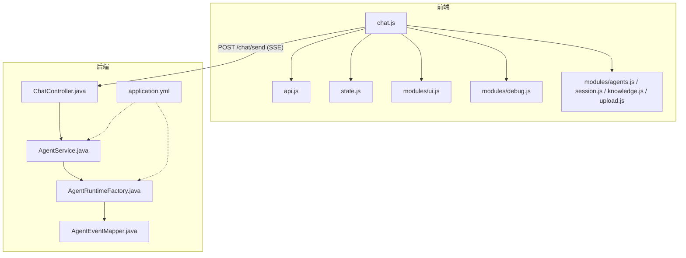
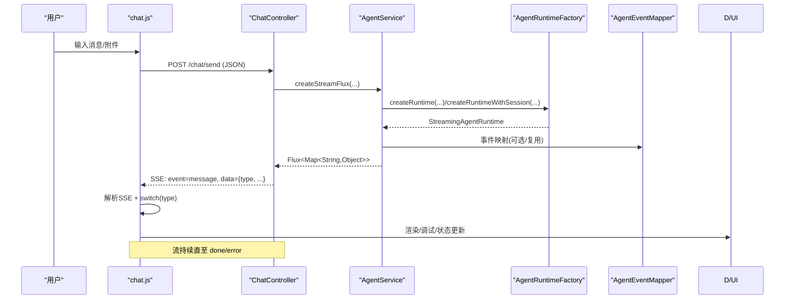
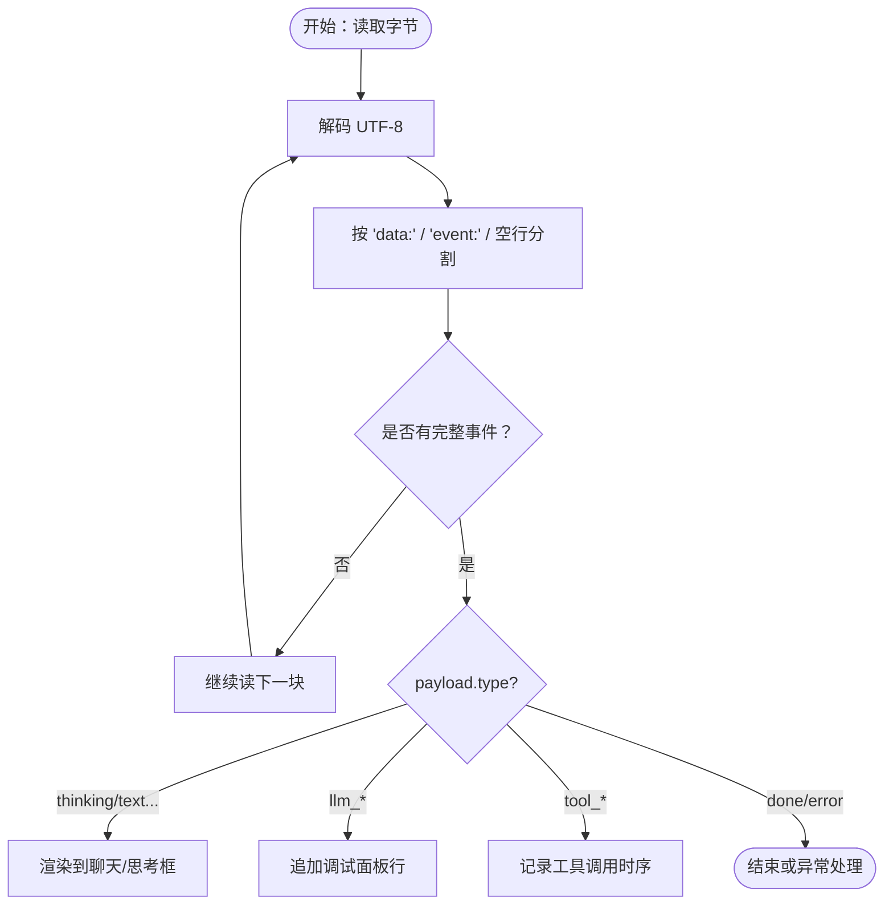
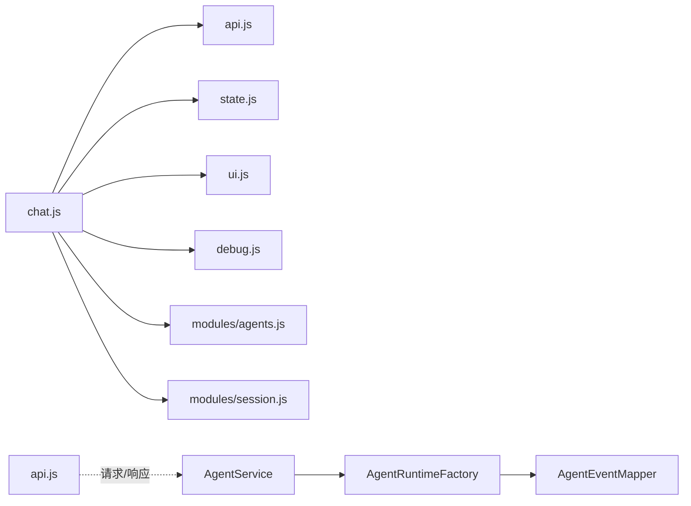

# 模块通信机制

<cite>
**本文引用的文件列表**
- [api.js](file://src/main/resources/static/scripts/api.js)
- [state.js](file://src/main/resources/static/scripts/state.js)
- [chat.js](file://src/main/resources/static/scripts/chat.js)
- [ui.js](file://src/main/resources/static/scripts/modules/ui.js)
- [debug.js](file://src/main/resources/static/scripts/modules/debug.js)
- [utils.js](file://src/main/resources/static/scripts/modules/utils.js)
- [agents.js](file://src/main/resources/static/scripts/modules/agents.js)
- [session.js](file://src/main/resources/static/scripts/modules/session.js)
- [ChatController.java](file://src/main/java/com/skloda/agentscope/controller/ChatController.java)
- [AgentEventMapper.java](file://src/main/java/com/skloda/agentscope/runtime/AgentEventMapper.java)
- [AgentService.java](file://src/main/java/com/skloda/agentscope/service/AgentService.java)
- [AgentRuntimeFactory.java](file://src/main/java/com/skloda/agentscope/runtime/AgentRuntimeFactory.java)
- [application.yml](file://src/main/resources/application.yml)
</cite>

## 目录
1. [简介](#简介)
2. [项目结构与角色分工](#项目结构与角色分工)
3. [核心组件总览](#核心组件总览)
4. [架构总览（前端 + 后端 SSE）](#架构总览前端--后端-sse)
5. [详细组件分析](#详细组件分析)
6. [依赖与耦合分析](#依赖与耦合分析)
7. [性能与稳定性考量](#性能与稳定性考量)
8. [故障排查指南](#故障排查指南)
9. [最佳实践建议](#最佳实践建议)
10. [结论](#结论)

## 简介
本文件系统性说明本项目的前端模块通信机制、全局状态共享、SSE 事件驱动流式通信、API 封装设计、跨域与网络层抽象，以及后端运行时编排、事件映射、会话与依赖注入等。目标是帮助读者以较低成本理解“从浏览器到 Agent 运行”的完整数据通路和可观测性。

## 项目结构与角色分工
- 前端脚本模块化：
  - API 层：统一暴露网络请求函数，封装文件上传、会话管理、知识文档、工具信息获取等接口调用。
  - 状态层：集中维护 window 上的全局状态变量（如当前 agent、是否流式传输中、会话 id、消息计数等），通过 getter/setter 暴露给其它模块。
  - UI 层：负责聊天消息渲染、思考框、调试面板、滚动、时间戳等。
  - 业务模块：agents/session/knowledge/upload 等功能模块，分别负责加载资源、选择会话、知识文档管理等。
  - 调度主流程：chat.js 串联以上模块与 SSE 处理逻辑，组织发送消息、建立读取流、分发事件到 UI/调试。
- 后端服务：
  - ChatController：HTTP 入口，聚合 AgentService，转发为 Reactor SSE。
  - AgentService：根据会话、Agent类型、权限模式路由到普通或 Supervisor/Harness 流，记录工作流与对话历史。
  - AgentRuntimeFactory：按配置构建不同运行态（单 Agent、流水线、并行、顺序、循环等）。
  - AgentEventMapper：将 AgentScope 内部事件转换为前端可消费的 JSON payload。
  - application.yml：提供模型、内存、MCP、端口等全局配置。

**图表来源**
- [chat.js](file://src/main/resources/static/scripts/chat.js)
- [api.js](file://src/main/resources/static/scripts/api.js)
- [state.js](file://src/main/resources/static/scripts/state.js)
- [ui.js](file://src/main/resources/static/scripts/modules/ui.js)
- [debug.js](file://src/main/resources/static/scripts/modules/debug.js)
- [agents.js](file://src/main/resources/static/scripts/modules/agents.js)
- [session.js](file://src/main/resources/static/scripts/modules/session.js)
- [ChatController.java](file://src/main/java/com/skloda/agentscope/controller/ChatController.java)
- [AgentService.java](file://src/main/java/com/skloda/agentscope/service/AgentService.java)
- [AgentRuntimeFactory.java](file://src/main/java/com/skloda/agentscope/runtime/AgentRuntimeFactory.java)
- [AgentEventMapper.java](file://src/main/java/com/skloda/agentscope/runtime/AgentEventMapper.java)
- [application.yml](file://src/main/resources/application.yml)

## 核心组件总览
- 全局状态管理（window.__agentScopeState）
  - 定义当前 agent、流式标记、AbortController、会话 id、媒体信息等；通过 Object.defineProperty 暴露同步 getter/setter，确保多模块读写一致性。
- 模块导入导出
  - 各模块通过 ES 模块 import/export 明确对外接口，避免隐式全局污染。
- 事件驱动通信（SSE）
  - 前端使用 TextDecoder + ReadableStream + 自研 SSE 解析器处理 chunk 分片。
  - 后端基于 Reactor Flux + ServerSentEvent 输出标准化事件流，包含 agent 生命周期、LLM 调用、工具调用、结果等。
- API 层封装
  - 统一的 fetch 调用、JSON/FormData 转换、错误提示、枚举化端点。
- 后端运行时编排
  - 依据 agent 类型创建对应 runtime（SINGLE/SEQUENTIAL/PARALLEL/LOOP/DEBATE/HARNESS/MSG_HUB 等）。
  - 支持会话级 stateStore，使同 session 的多轮交互共享上下文。
- 事件映射与协议
  - AgentEventMapper 覆盖 30+ AgentEventType 到 type: xxx 的统一 JSON 结构，便于前端 switch-case 渲染。
- 配置与初始化
  - application.yml 集中配置端口、多模态上传限制、model/stream/thinking、知识库、MCP 等。

**章节来源**
- [state.js:1-165](file://src/main/resources/static/scripts/state.js#L1-L165)
- [chat.js:1-220](file://src/main/resources/static/scripts/chat.js#L1-L220)
- [api.js:1-125](file://src/main/resources/static/scripts/api.js#L1-L125)
- [ChatController.java:115-190](file://src/main/java/com/skloda/agentscope/controller/ChatController.java#L115-L190)
- [AgentService.java:80-177](file://src/main/java/com/skloda/agentscope/service/AgentService.java#L80-L177)
- [AgentRuntimeFactory.java:21-127](file://src/main/java/com/skloda/agentscope/runtime/AgentRuntimeFactory.java#L21-L127)
- [AgentEventMapper.java:39-105](file://src/main/java/com/skloda/agentscope/runtime/AgentEventMapper.java#L39-L105)
- [application.yml:3-88](file://src/main/resources/application.yml#L3-L88)

## 架构总览（前端 + 后端 SSE）
前端通过 chat.js 发起 POST /chat/send，建立 ReadableStream 读取后端 SSE；使用 SSE 解析器将 data: xxx 分段拼出完整事件并回调 onEvent；在回调中解析 JSON，按 payload.type 路由到 UI/调试/状态更新。后端 ChatController 接收请求，构造用户消息并交由 AgentService 返回 Flux，最终映射为 ServerSentEvent 输出。

**图表来源**
- [chat.js:106-200](file://src/main/resources/static/scripts/chat.js#L106-L200)
- [Api.createSSEParser](file://src/main/resources/static/scripts/api.js#L1-L25)
- [ChatController.sendMessage](file://src/main/java/com/skloda/agentscope/controller/ChatController.java#L122-L153)
- [AgentService.createStreamFlux](file://src/main/java/com/skloda/agentscope/service/AgentService.java#L84-L177)
- [AgentRuntimeFactory](file://src/main/java/com/skloda/agentscope/runtime/AgentRuntimeFactory.java#L41-L127)
- [AgentEventMapper.apply](file://src/main/java/com/skloda/agentscope/runtime/AgentEventMapper.java#L64-L105)

## 详细组件分析

### 全局状态管理模式（window 对象属性共享）
- 状态容器：state.js 维护 window.__agentScopeState，含当前 agent、isStreaming、AbortController、会话 ID、媒体信息、rounds、thinking 内容等。
- 访问方式：定义 defineWindowStateProperty，利用 Object.defineProperty 为关键属性提供 getter/setter，实现同步双写（window 与局部缓存），避免多模块间状态不一致。
- 设计要点：
  - isStreaming 作为“防重入”锁，防止并发请求导致界面错乱。
  - currentAbortController 用于取消进行中请求，支持切换 Agent/会话时清理。
  - 媒体数组/对象（uploadedImages/uploadedAudio）结构化存储，方便后续拼装消息体。

**章节来源**
- [state.js:1-24](file://src/main/resources/static/scripts/state.js#L1-L24)
- [state.js:49-165](file://src/main/resources/static/scripts/state.js#L49-L165)

### 模块导入导出与模块化原则
- api.js：只暴露纯函数（fetchAgents/createSession/uploadFile 等），无副作用，便于测试和复用。
- ui.js：导出 UI 操作函数（appendMessage/createThinkingBox/updateThinkingBox 等），将 DOM 访问集中在该层。
- debug.js：导出调试跟踪方法（startRound/endRound/addTimelineRow 等），与 UI 解耦。
- agents.js / session.js / knowledge.js / upload.js：按功能职责导出业务操作函数。
- chat.js：作为“装配器”，组合各模块能力，完成业务编排。

模块化优势：
- 单一职责、内聚性高、易于定位问题。
- 避免全局变量滥用，减少耦合面。
- 通过显式 import/export 约束接口契约，稳定演进。

**章节来源**
- [api.js:28-124](file://src/main/resources/static/scripts/api.js#L28-L124)
- [ui.js:3-15](file://src/main/resources/static/scripts/modules/ui.js#L3-L15)
- [debug.js:5-61](file://src/main/resources/static/scripts/modules/debug.js#L5-L61)
- [agents.js:17-38](file://src/main/resources/static/scripts/modules/agents.js#L17-L38)
- [session.js:6-51](file://src/main/resources/static/scripts/modules/session.js#L6-L51)

### 事件驱动通信（SSE）
- 前端 SSE 解析器：按行累积 buffer，遇到空行即发射一个 event（携带 event/data），onEvent 回调传入解析结果。
- 消息发送与流读取：chat.js 组装 JSON 负载后发起 fetch，用 response.body.getReader() 流式读取，TextDecoder 解码字节流。
- 事件分流：payload.type 包括 thinking/reasoning_text/text/llm_start/llm_end/tool_start/tool_end/done/error/pending_approval 等；根据类型更新 UI、调试面板或终止流。
- 体验优化：首次有实际可见内容（非调试面板）才移除打字指示器，避免空白真空期。

**图表来源**
- [Api.createSSEParser](file://src/main/resources/static/scripts/api.js#L1-L25)
- [chat.js:129-177](file://src/main/resources/static/scripts/chat.js#L129-L177)

**章节来源**
- [api.js:1-25](file://src/main/resources/static/scripts/api.js#L1-L25)
- [chat.js:78-177](file://src/main/resources/static/scripts/chat.js#L78-L177)

### API 模块封装设计（请求/响应/错误/CORS 等）
- 请求拦截与载荷：统一组装 headers/body，文件上传采用 FormData，多模态（图像/音频）路径拼接于 JSON 体。
- 响应处理：统一 await response.json() 并返回 Promise；对失败响应抛 Error，上层捕获后显示错误并恢复状态。
- 错误统一管理：对部分 API（如 fetchSamplePrompt、fetchSkillInfo、fetchToolInfo）进行响应码检查，抛出语义化错误。
- CORS/鉴权：本项目以静态页面直连同一域名后端为主，未展示特殊拦截头；跨域可在网关或 Spring Security/CorsConfiguration 处扩展。
- 可扩展点：可在此层加入重试、退避、埋点、请求 ID 传递、签名认证等横切能力。

**章节来源**
- [api.js:28-124](file://src/main/resources/static/scripts/api.js#L28-L124)
- [chat.js:106-119](file://src/main/resources/static/scripts/chat.js#L106-L119)

### 依赖注入机制（初始化顺序、循环依赖规避、懒加载）
- 后端注入：Spring @Component/@Service/@Controller 自动装配，如 ChatController 依赖 AgentService、ApprovalService；AgentService 依赖 AgentRuntimeFactory、HarnessAgentService、SupervisorRuntimeFactory（可选注入 required=false）。
- 运行时装配：AgentService 根据 agentId 配置判断路由/监督者/普通/流水线分支，按需创建相应 runtime，避免无关初始化。
- 循环依赖规避：
  - 前端：通过动态 import('./agents.js') 在会话选择时按需加载，避免初始化即循环依赖。
  - 后端：Service/Factories 之间职责清晰，通过接口/工厂构造化解耦。
- 懒加载策略：UI/调试仅在需要时更新；SSE 事件按需渲染；Agent 实例缓存（AgentService/HarnessAgentService）避免重复创建。

**章节来源**
- [AgentService.java:46-77](file://src/main/java/com/skloda/agentscope/service/AgentService.java#L46-L77)
- [AgentService.java:140-177](file://src/main/java/com/skloda/agentscope/service/AgentService.java#L140-L177)
- [AgentRuntimeFactory.java:41-127](file://src/main/java/com/skloda/agentscope/runtime/AgentRuntimeFactory.java#L41-L127)
- [session.js:60-68](file://src/main/resources/static/scripts/modules/session.js#L60-L68)

### 跨域通信与流处理方案
- SSE 流：前端以 ReadableStream 拉取数据，后端以 Flux<ServerSentEvent> 推送，天然支持增量式文本/思考/工具结果。
- WebSocket：本仓库未发现内置 WS 客户端；如需双向实时，可在前端新增 ws://wss://连接并封装事件通道。
- SSE vs Fetch：SSE 更适合单向大流量推送；小查询用 fetch 简单可靠；二者可按场景并存。
- CORS：默认同域开发无需额外配置；生产部署可通过网关/Nginx/CrossOrigin 注解控制白名单。

**章节来源**
- [ChatController.java:122-153](file://src/main/java/com/skloda/agentscope/controller/ChatController.java#L122-L153)
- [chat.js:106-177](file://src/main/resources/static/scripts/chat.js#L106-L177)

## 依赖与耦合分析
- 前端依赖关系
  - chat.js 依赖 api/state/ui/debug/agents/session 等模块。
  - modules/* 之间弱耦合，通常仅依赖 utils、DOM 元素引用由 ui.js 提供。
  - 会话切换时按需动态 import agents.js，降低冷启动开销与循环依赖风险。
- 后端依赖关系
  - Controller -> Service -> Factory/Runtime -> Mapper/Tools。
  - 通过 AgentType 枚举分支选择运行时，扩展性强。
- 潜在风险
  - 过多全局状态会增加复杂度，需严格通过 state.js 暴露的访问器更新。
  - SSE 事件增多易导致 UI 卡顿，应做去抖/节流/分批合并渲染。

**图表来源**
- [chat.js:1-12](file://src/main/resources/static/scripts/chat.js#L1-L12)
- [agents.js:1-4](file://src/main/resources/static/scripts/modules/agents.js#L1-L4)
- [session.js:1-4](file://src/main/resources/static/scripts/modules/session.js#L1-L4)
- [AgentService.java:84-177](file://src/main/java/com/skloda/agentscope/service/AgentService.java#L84-L177)
- [AgentRuntimeFactory.java:41-127](file://src/main/java/com/skloda/agentscope/runtime/AgentRuntimeFactory.java#L41-L127)
- [AgentEventMapper.java:39-105](file://src/main/java/com/skloda/agentscope/runtime/AgentEventMapper.java#L39-L105)

## 性能与稳定性考量
- 流式渲染与心智模型
  - 延迟最小化：边收边渲，减少首屏等待。
  - 打字指示器只在出现真正“可见内容”时清除，改善观感。
- 资源释放
  - 切换 Agent/会话时中断当前请求（AbortController）、重置 isStreaming、清空 rounds，防止串扰。
- 序列化安全
  - 后端统一 ObjectMapper 序列化，失败兜底为 error 事件，提升鲁棒性。
- 配置调优
  - 文件大小限制、模型流式开关、thinking 预算均可在 application.yml 调整。
  - 日志级别可打开 io.agentscope DEBUG 便于排障。

**章节来源**
- [chat.js:113-177](file://src/main/resources/static/scripts/chat.js#L113-L177)
- [ChatController.java:77-113](file://src/main/java/com/skloda/agentscope/controller/ChatController.java#L77-L113)
- [application.yml:10-12](file://src/main/resources/application.yml#L10-L12)
- [application.yml:26-43](file://src/main/resources/application.yml#L26-L43)
- [application.yml:81-89](file://src/main/resources/application.yml#L81-L89)

## 故障排查指南
- 常见前端问题
  - 流不结束：检查后端是否返回 done/error；确认 response.ok 且 reader.read 退出。
  - 点击无效/isStreaming 卡死：切换 Agent 或会话前应 abort + 复位 isStreaming。
  - 首帧白屏：确认首个有内容的 payload 能触发 removeTypingIndicator。
- 常见后端问题
  - 事件序列乱序：关注 AgentEventMapper 的 case 分支与 AgentScope 事件顺序。
  - 序列化异常：查看 sseError/toJsonString 兜底；必要时放开 io.agentscope 日志。
  - 路由不正确：核对 AgentType 与 YAML 配置，确认 Supervisor/Harness 路由条件。

**章节来源**
- [chat.js:78-119](file://src/main/resources/static/scripts/chat.js#L78-L119)
- [session.js:72-118](file://src/main/resources/static/scripts/modules/session.js#L72-L118)
- [ChatController.java:122-153](file://src/main/java/com/skloda/agentscope/controller/ChatController.java#L122-L153)
- [AgentEventMapper.java:101-105](file://src/main/java/com/skloda/agentscope/runtime/AgentEventMapper.java#L101-L105)

## 最佳实践建议
- 接口规范
  - 所有 SSE 事件必须含 type 字段，保持前后端合约稳定；新增类型需兼顾前端的 switch 分支。
  - 错误事件统一携带 message/堆栈摘要，便于端到端追踪。
- 错误传播
  - 前端在 API 层校验状态码并抛出明确错误；上层捕获后反馈 UI，同时保证 isStreaming 复位。
- 性能优化
  - 对密集事件（如 tool_call_delta）做合并节流；批量更新 DOM。
  - 合理使用 AbortController 与惰性模块加载。
- 可扩展性
  - 在前端可加事件总线（本地发布订阅）解耦更广泛模块。
  - 在后端可在 Middleware/Observer 层增加审计、限流、指标采集。
- 跨域与运维
  - 生产建议使用反向代理统一管理 cors/cert/header；统一日志接入 OTEL/日志平台。

[本节为通用指导，不直接引用特定源码]

## 结论
本项目采用“前端模块化 + 全局轻量状态 + SSE 事件流 + 后端运行时编排 + 统一事件映射”的模式，实现了可扩展、可观测、低延迟的多 Agent 协作与 Harness 能力演示。其优点在于：清晰的接口边界、一致的流式体验、灵活的运行时选择。建议在后续迭代中进一步收敛事件协议、完善错误统一治理，并按需引入 WebSocket/A2A/AG-UI 等增强能力以提升互操作性与生态兼容。