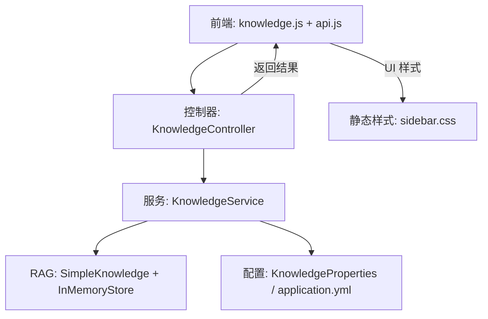
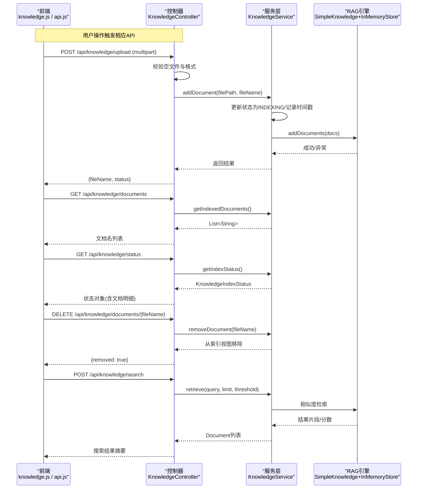
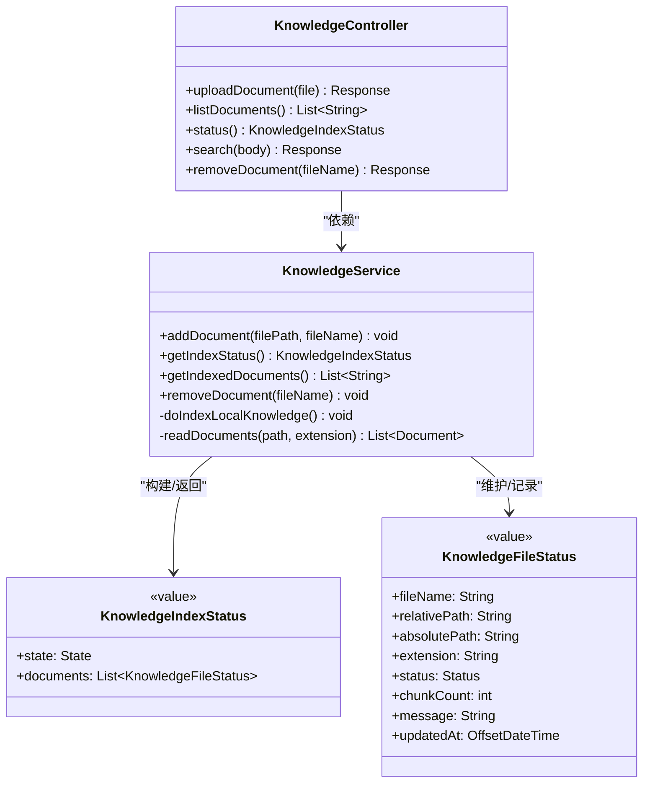
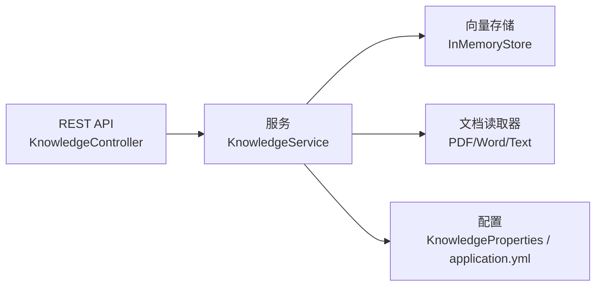

# 知识库模块

<cite>
**本文引用的文件**
- [KnowledgeController.java](file://src/main/java/com/skloda/agentscope/controller/KnowledgeController.java)
- [KnowledgeService.java](file://src/main/java/com/skloda/agentscope/service/KnowledgeService.java)
- [KnowledgeIndexStatus.java](file://src/main/java/com/skloda/agentscope/model/KnowledgeIndexStatus.java)
- [KnowledgeFileStatus.java](file://src/main/java/com/skloda/agentscope/model/KnowledgeFileStatus.java)
- [KnowledgeProperties.java](file://src/main/java/com/skloda/agentscope/service/KnowledgeProperties.java)
- [application.yml](file://src/main/resources/application.yml)
- [api.js](file://src/main/resources/static/scripts/api.js)
- [knowledge.js](file://src/main/resources/static/scripts/modules/knowledge.js)
- [sidebar.css](file://src/main/resources/static/styles/modules/sidebar.css)
- [ChatController.java](file://src/main/java/com/skloda/agentscope/controller/ChatController.java)
</cite>

## 目录
1. [简介](#简介)
2. [项目结构](#项目结构)
3. [核心组件](#核心组件)
4. [架构总览](#架构总览)
5. [详细组件分析](#详细组件分析)
6. [依赖关系分析](#依赖关系分析)
7. [性能考量](#性能考量)
8. [故障排查指南](#故障排查指南)
9. [结论](#结论)
10. [附录：配置与扩展开发指南](#附录：配置与扩展开发指南)

## 简介
本模块提供基于 AgentScope RAG 的知识库管理能力，包括文档列表获取、上传、删除与检索，支持在对话过程中对已索引的知识进行相似性搜索。前端提供文档列表渲染、上传入口、状态查看等交互能力；后端通过 Spring Boot REST 暴露接口并封装服务层，利用 SimpleKnowledge + InMemoryStore 完成向量化索引和相似度检索。

## 项目结构
本模块涉及前后端协作：
- 前端资源位于静态目录，负责发起 API、渲染 UI、管理本地展示状态
- 后端以 Controller 暴露 REST 接口，Service 层封装 RAG 知识与文件处理逻辑，模型描述状态结构，配置文件启用/关闭知识索引特性

图表来源
- [KnowledgeController.java:20-131](file://src/main/java/com/skloda/agentscope/controller/KnowledgeController.java#L20-L131)
- [KnowledgeService.java:60-89](file://src/main/java/com/skloda/agentscope/service/KnowledgeService.java#L60-L89)
- [KnowledgeProperties.java:1-21](file://src/main/java/com/skloda/agentscope/service/KnowledgeProperties.java#L1-L21)
- [api.js:82-105](file://src/main/resources/static/scripts/api.js#L82-L105)
- [knowledge.js:1-59](file://src/main/resources/static/scripts/modules/knowledge.js#L1-L59)
- [sidebar.css:545-570](file://src/main/resources/static/styles/modules/sidebar.css#L545-L570)

章节来源
- [KnowledgeController.java:20-131](file://src/main/java/com/skloda/agentscope/controller/KnowledgeController.java#L20-L131)
- [KnowledgeService.java:60-89](file://src/main/java/com/skloda/agentscope/service/KnowledgeService.java#L60-L89)
- [KnowledgeProperties.java:1-21](file://src/main/java/com/skloda/agentscope/service/KnowledgeProperties.java#L1-L21)
- [api.js:82-105](file://src/main/resources/static/scripts/api.js#L82-L105)
- [knowledge.js:1-59](file://src/main/resources/static/scripts/modules/knowledge.js#L1-L59)

## 核心组件
- 控制器 KnowledgeController：对外暴露知识库相关 REST 接口，负责入参校验、保存临时文件、调用服务层与返回统一响应
- 服务层 KnowledgeService：管理知识库生命周期，包含启动时后台扫描索引、文件读取分块、添加到向量存储、查询检索、删除文档（从索引视图）等
- 数据模型 KnowledgeIndexStatus / KnowledgeFileStatus：记录整体状态与各文档明细状态
- 配置项 KnowledgeProperties 与 application.yml：控制是否启用、本地知识目录、嵌入模型与维度、分块策略、是否在启动时自动索引等
- 前端集成：api.js 提供知识库 API 方法；knowledge.js 负责列表渲染、上传、删除事件处理

章节来源
- [KnowledgeController.java:20-131](file://src/main/java/com/skloda/agentscope/controller/KnowledgeController.java#L20-L131)
- [KnowledgeService.java:140-196](file://src/main/java/com/skloda/agentscope/service/KnowledgeService.java#L140-L196)
- [KnowledgeIndexStatus.java:9-59](file://src/main/java/com/skloda/agentscope/model/KnowledgeIndexStatus.java#L9-L59)
- [KnowledgeFileStatus.java:8-28](file://src/main/java/com/skloda/agentscope/model/KnowledgeFileStatus.java#L8-L28)
- [KnowledgeProperties.java:1-21](file://src/main/java/com/skloda/agentscope/service/KnowledgeProperties.java#L1-L21)
- [application.yml:61-71](file://src/main/resources/application.yml#L61-L71)
- [api.js:82-105](file://src/main/resources/static/scripts/api.js#L82-L105)
- [knowledge.js:1-59](file://src/main/resources/static/scripts/modules/knowledge.js#L1-L59)

## 架构总览
下图展示了从前端到后端的完整请求流：上传、列表获取、状态查询、删除、检索。同时标注了 Service 内部状态机流转和 RAG 对接点。

图表来源
- [KnowledgeController.java:40-131](file://src/main/java/com/skloda/agentscope/controller/KnowledgeController.java#L40-L131)
- [KnowledgeService.java:140-196](file://src/main/java/com/skloda/agentscope/service/KnowledgeService.java#L140-L196)
- [KnowledgeService.java:271-285](file://src/main/java/com/skloda/agentscope/service/KnowledgeService.java#L271-L285)

## 详细组件分析

### 控制器 KnowledgeController
职责：
- 接收并验证上传的 multipart 文件（空值检查、允许的文件类型限制）
- 将文件写入系统临时目录并按名称保留扩展名
- 调用服务层添加文档到知识库索引，返回统一 JSON
- 暴露文档列表、当前状态、按关键词检索、删除等接口

关键实现点：
- 上传接口：仅支持 .pdf/.docx/.txt/.md；非支持类型直接返回错误提示
- 检索接口：参数化支持 query、limit、threshold，并在响应中截断内容前缀用于预览

错误与反馈：
- 空文件或文件名缺失、不支持格式均会返回 bad request 及错误消息
- 服务端异常统一捕获并记录日志，返回 500 及具体错误消息

章节来源
- [KnowledgeController.java:40-78](file://src/main/java/com/skloda/agentscope/controller/KnowledgeController.java#L40-L78)
- [KnowledgeController.java:80-131](file://src/main/java/com/skloda/agentscope/controller/KnowledgeController.java#L80-L131)

### 服务层 KnowledgeService
职责：
- 应用启动后根据配置决定是否执行“后台扫描本地知识库目录”任务
- 提供单线程后台执行器确保索引任务不阻塞主流程
- 维护文件级状态映射 fileStatuses（有序），并暴露快照方法
- 负责读取不同文件类型（PDF/DOCX/TEXT）到 Document 列表，写入向量库
- 提供删除文档（仅从本地状态视图移除；InMemoryStore 无删除能力）

关键数据与状态：
- 全局状态 state 枚举：EMPTY、PENDING、INDEXING、READY、READY_WITH_ERRORS、FAILED
- 文档状态 status 枚举：PENDING、INDEXING、INDEXED、SKIPPED、FAILED
- 每个文件的更新时间、相对路径、绝对路径、扩展名、分块数量、错误消息等

处理流程：
- 启动事件监听 ApplicationReadyEvent → 触发后台索引（受 enabled/autoIndexOnStartup 控制）
- addDocument：设置状态 → 解析文件 → 写入文档 → 更新为 INDEXED/FAILED → 重新计算总体状态
- removeDocument：仅从 fileStatuses 移除对应条目，更新状态为最终态

索引策略：
- 使用 agentscope 的 Reader 系列（PDFReader/WordReader/TextReader），将文件读成 Documents
- 写入 InMemoryStore 向量库；当前版本不支持向量删除

章节来源
- [KnowledgeService.java:91-125](file://src/main/java/com/skloda/agentscope/service/KnowledgeService.java#L91-L125)
- [KnowledgeService.java:140-196](file://src/main/java/com/skloda/agentscope/service/KnowledgeService.java#L140-L196)
- [KnowledgeService.java:214-285](file://src/main/java/com/skloda/agentscope/service/KnowledgeService.java#L214-L285)

#### 类图（代码级）

图表来源
- [KnowledgeController.java:20-131](file://src/main/java/com/skloda/agentscope/controller/KnowledgeController.java#L20-L131)
- [KnowledgeService.java:60-196](file://src/main/java/com/skloda/agentscope/service/KnowledgeService.java#L60-L196)
- [KnowledgeIndexStatus.java:9-59](file://src/main/java/com/skloda/agentscope/model/KnowledgeIndexStatus.java#L9-L59)
- [KnowledgeFileStatus.java:8-28](file://src/main/java/com/skloda/agentscope/model/KnowledgeFileStatus.java#L8-L28)

### 前端集成（列表渲染、上传、删除与状态）
- 列表获取：api.js 提供 fetchKnowledgeDocs，knowledge.js 拉取并渲染为空状态或文档条目
- 上传集成：通过 FormData 提交到 /api/knowledge/upload，完成后刷新列表
- 删除功能：调用 /api/knowledge/documents/{fileName}，成功后刷新列表
- 空状态处理：当接口返回空数组时显示“无文档”
- 错误提示：前端打印控制台错误；如需用户可见的错误提示可复用通用对话框机制（现有逻辑主要记录控制台错误）

UI 交互设计要点：
- 文档条目带删除按钮，点击调用删除并刷新
- 列表容器使用 .knowledge-doc-item 与 .knowledge-doc-name 样式渲染条目
- 空文本使用 .knowledge-empty 占位提示

章节来源
- [api.js:82-105](file://src/main/resources/static/scripts/api.js#L82-L105)
- [knowledge.js:1-59](file://src/main/resources/static/scripts/modules/knowledge.js#L1-L59)
- [sidebar.css:545-570](file://src/main/resources/static/styles/modules/sidebar.css#L545-L570)

### Agent 集成交互（对话中的相似性检索）
RAG 检索能力由后端提供，Agent 可在业务侧调用该能力，例如在 ChatController 收到消息后可选择：
- 直接使用 Agent 内置工具访问 /api/knowledge/search 获取上下文
- 或将检索到的片段作为系统上下文注入 Agent

当前项目中存在 ChatController 与 WebSearchTool，便于在对话中补充外部信息；结合知识库 search 接口可实现知识驱动的增强回答。若需要更紧耦合，可将检索逻辑封装为 Tool 并注册到工具注册中心。

章节来源
- [KnowledgeController.java:96-121](file://src/main/java/com/skloda/agentscope/controller/KnowledgeController.java#L96-L121)
- [ChatController.java](file://src/main/java/com/skloda/agentscope/controller/ChatController.java)
- [WebSearchTool.java](file://src/main/java/com/skloda/agentscope/tool/WebSearchTool.java)

## 依赖关系分析
- 控制器与服务层解耦：控制器仅做协议适配与入参校验，核心业务在 Service
- 服务与 RAG：通过 agentscope 的 SimpleKnowledge 与 Reader/Store 抽象对接，当前默认使用 InMemoryStore
- 配置驱动行为：是否启用知识、是否启动自动索引、嵌入模型与分块策略均可配置
- 前端依赖稳定 API：列表/上传/删除/状态/检索均有固定路径与契约

图表来源
- [KnowledgeController.java:20-131](file://src/main/java/com/skloda/agentscope/controller/KnowledgeController.java#L20-L131)
- [KnowledgeService.java:60-89](file://src/main/java/com/skloda/agentscope/service/KnowledgeService.java#L60-L89)
- [KnowledgeProperties.java:1-21](file://src/main/java/com/skloda/agentscope/service/KnowledgeProperties.java#L1-L21)
- [application.yml:61-71](file://src/main/resources/application.yml#L61-L71)

章节来源
- [KnowledgeController.java:20-131](file://src/main/java/com/skloda/agentscope/controller/KnowledgeController.java#L20-L131)
- [KnowledgeService.java:60-89](file://src/main/java/com/skloda/agentscope/service/KnowledgeService.java#L60-L89)
- [KnowledgeProperties.java:1-21](file://src/main/java/com/skloda/agentscope/service/KnowledgeProperties.java#L1-L21)
- [application.yml:61-71](file://src/main/resources/application.yml#L61-L71)

## 性能考量
- 索引串行化：后台索引采用单线程执行器避免资源争用
- 同步写向量库：addDocuments.block() 保证写入完成后再更新状态，便于前端正确反映进度
- 内存向量库：InMemoryStore 轻量且无需持久化，适合演示环境；生产环境建议替换为磁盘/分布式存储以提升容量与稳定性
- 分块策略：可通过 split-strategy/chunk-size/overlap-size 调整，平衡召回与开销
- 删除语义：当前删除仅移除了本地视图映射；若需从向量库也清理，需引入支持删除的 Store 实现
- 并发上传：上传接口是单文件处理，未实现批传；高吞吐场景可扩展为异步队列处理并暴露批量接口

[本节为通用指导，不引用具体文件]

## 故障排查指南
常见问题与定位建议：
- 上传失败（Unsupported formats）：确认文件扩展名是否为 .pdf/.docx/.txt/.md；检查大小限制（max-file-size）
- 索引失败：查看服务日志输出，常见原因包括文档解析异常、向量模型初始化失败（API Key 或缺省）、权限问题
- 列表为空：确认已至少有一个文档状态为 INDEXED；注意 InMemoryStore 重启后会丢失索引
- 删除无效：当前删除仅移除本地状态，并非真正从向量库删除；如需彻底删除，请更换支持删除的向量存储

定位步骤：
- 开启 DEBUG 级别日志观察服务启动与索引流程
- 通过 /api/knowledge/status 查看当前状态与每个文档的状态、错误信息
- 针对上传错误，优先在控制器返回消息中读取错误信息

章节来源
- [KnowledgeController.java:40-78](file://src/main/java/com/skloda/agentscope/controller/KnowledgeController.java#L40-L78)
- [KnowledgeService.java:160-178](file://src/main/java/com/skloda/agentscope/service/KnowledgeService.java#L160-L178)
- [KnowledgeService.java:281-285](file://src/main/java/com/skloda/agentscope/service/KnowledgeService.java#L281-L285)

## 结论
本知识库模块以简洁清晰的职责分层实现了 RAG 文档管理的基础能力：上传、列表、删除、检索与状态展示。服务层提供了后台自动索引与细粒度的文件级状态跟踪；前端具备基本的交互能力。面向生产，建议在存储层替换为可持久化的向量库，完善删除语义、增加重试/限流/分页等能力，并结合 Agent 工具链把检索过程内化为可编排的步骤。

[本节总结性说明，不引用具体文件]

## 附录：配置与扩展开发指南

### 配置文件要点
- 启用/禁用知识库
  - agentscope.knowledge.enabled 控制功能开关
  - agentscope.knowledge.auto-index-on-startup 控制启动时自动扫描并索引本地知识库目录
- 嵌入模型与维度
  - agentscope.knowledge.embedding-model
  - agentscope.knowledge.dimensions
- 分块与分割
  - agentscope.knowledge.chunk-size
  - agentscope.knowledge.overlap-size
  - agentscope.knowledge.split-strategy（如 PARAGRAPH）
- 本地知识库目录
  - agentscope.knowledge.path（后台扫描根目录）

这些属性会被 KnowledgeProperties 绑定并通过 @Value 注入构造 KnowledgeService。

章节来源
- [KnowledgeProperties.java:1-21](file://src/main/java/com/skloda/agentscope/service/KnowledgeProperties.java#L1-L21)
- [application.yml:61-71](file://src/main/resources/application.yml#L61-L71)
- [KnowledgeService.java:73-89](file://src/main/java/com/skloda/agentscope/service/KnowledgeService.java#L73-L89)

### 新增文档格式支持
扩展方向：
- 在服务层的读取链路中添加新的 Reader 分支，参考 PDF/Word/Text 的读取方式
- 在控制器层允许的扩展名白名单中新增对应后缀
- 可选地，为新增类型定义专门的解析质量策略（如合并表格行、跳过特定区块）

关键位置参考：
- 控制器中允许的扩展名判断逻辑
- 服务层中读文件与解析成 Document 列表的路径

章节来源
- [KnowledgeController.java:50-56](file://src/main/java/com/skloda/agentscope/controller/KnowledgeController.java#L50-L56)
- [KnowledgeService.java:160-165](file://src/main/java/com/skloda/agentscope/service/KnowledgeService.java#L160-L165)

### 定制索引策略
可通过 KnowledgeProperties 调整：
- 分块大小与重叠大小影响召回精度与冗余度
- 分割策略决定按段落还是其他粒度切分
- 若需持久化或分布式向量库，可替换 InMemoryStore 为支持的后端实现，并保持维度一致

章节来源
- [KnowledgeProperties.java:1-21](file://src/main/java/com/skloda/agentscope/service/KnowledgeProperties.java#L1-L21)
- [KnowledgeService.java:82-89](file://src/main/java/com/skloda/agentscope/service/KnowledgeService.java#L82-L89)

### 检索 API 与 Agent 集成建议
- 使用 POST /api/knowledge/search 传入 query、limit、threshold，获得 Top-K 结果（包含片段文本与相似度分）
- 在对话过程中可：
  - 通过 ChatController 调用知识库检索工具，将检索片段注入提示上下文
  - 或通过独立工具封装此接口，以便 Agent 自行决策何时检索
- 对敏感内容，可在检索后进行二次过滤或脱敏

章节来源
- [KnowledgeController.java:96-121](file://src/main/java/com/skloda/agentscope/controller/KnowledgeController.java#L96-L121)
- [ChatController.java](file://src/main/java/com/skloda/agentscope/controller/ChatController.java)