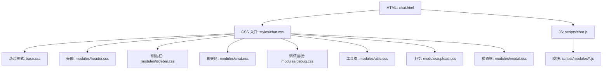
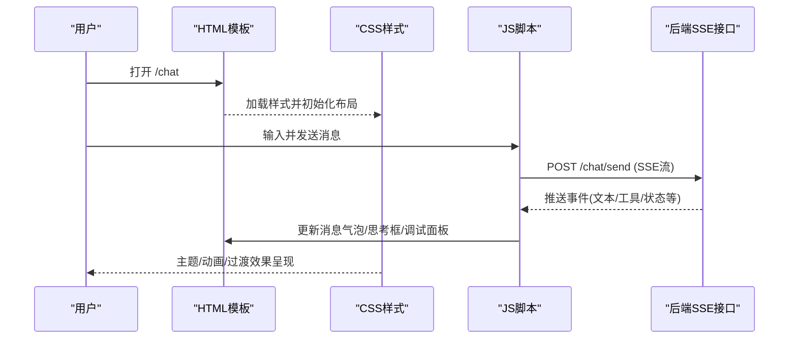
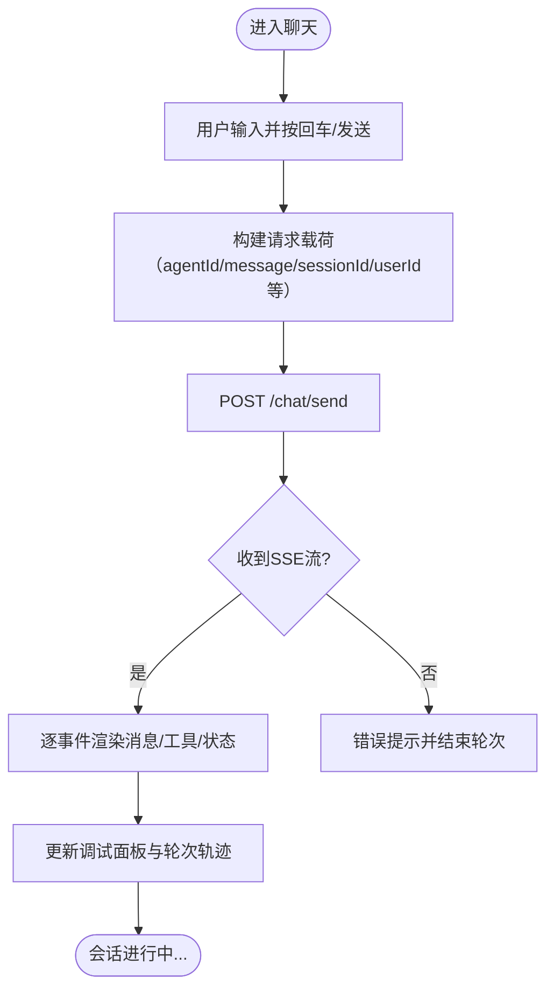
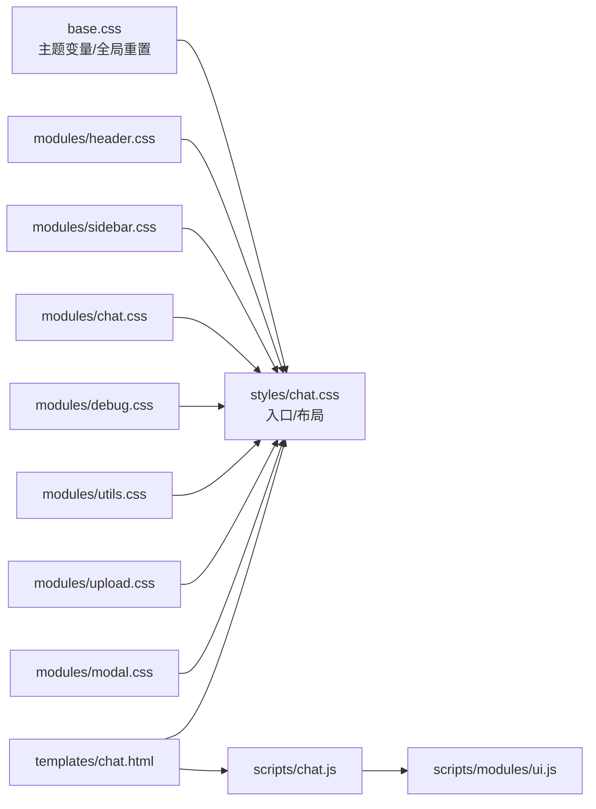

# 响应式设计

<cite>
**本文引用的文件列表**
- [base.css](file://src/main/resources/static/styles/base.css)
- [chat.css（入口）](file://src/main/resources/static/styles/chat.css)
- [sidebar.css](file://src/main/resources/static/styles/modules/sidebar.css)
- [chat.css（聊天区样式）](file://src/main/resources/static/styles/modules/chat.css)
- [header.css](file://src/main/resources/static/styles/modules/header.css)
- [debug.css](file://src/main/resources/static/styles/modules/debug.css)
- [utils.css](file://src/main/resources/static/styles/modules/utils.css)
- [upload.css](file://src/main/resources/static/styles/modules/upload.css)
- [modal.css](file://src/main/resources/static/styles/modules/modal.css)
- [chat.html](file://src/main/resources/templates/chat.html)
- [agui.html](file://src/main/resources/static/agui.html)
- [chat.js](file://src/main/resources/static/scripts/chat.js)
- [ui.js](file://src/main/resources/static/scripts/modules/ui.js)
</cite>

## 目录
1. [简介](#简介)
2. [项目结构](#项目结构)
3. [核心组件](#核心组件)
4. [架构总览](#架构总览)
5. [详细组件分析](#详细组件分析)
6. [依赖关系分析](#依赖关系分析)
7. [性能考虑](#性能考虑)
8. [故障排查指南](#故障排查指南)
9. [结论](#结论)
10. [附录](#附录)

## 简介
本文件系统性梳理前端响应式设计的实现，覆盖移动优先的CSS架构、断点与媒体查询现状、弹性布局与网格策略、侧边栏自适应行为、调试面板折叠、多设备适配思路、触摸与动画体验、以及浏览器兼容性与测试调试方法。当前代码库以桌面端为主，移动端支持处于“基础可用”阶段；通过后续优化可平滑演进为完整的多端自适应方案。

## 项目结构
前端资源组织清晰：CSS按主题根变量集中管理，模块样式分文件拆分并通过统一入口聚合；HTML提供应用壳与关键语义标签；JS负责SSE消息处理、UI渲染与交互逻辑。

**图示来源**
- [chat.html:17-90](file://src/main/resources/templates/chat.html#L17-L90)
- [chat.css（入口）:1-12](file://src/main/resources/static/styles/chat.css#L1-L12)
- [base.css:8-75](file://src/main/resources/static/styles/base.css#L8-L75)

**章节来源**
- [chat.html:17-90](file://src/main/resources/templates/chat.html#L17-L90)
- [chat.css（入口）:1-12](file://src/main/resources/static/styles/chat.css#L1-L12)

## 核心组件
- 主题与全局容器：通过CSS自定义属性构建统一的暗色赛博风格主题，包括霓虹光晕、边框、间距、字体等；html/body设置全局尺寸与禁用滚动，整体采用Flex纵向布局，页面主体在相对定位的背景上呈现。
- 布局：应用头部+主内容+侧边区域的三栏Flex布局，聊天主区域使用纵向Flext占据剩余空间；调试面板具备宽度折叠状态。
- 组件：侧边栏含Agent选择卡片与Tab；聊天区包含消息气泡、用户/机器人头像、输入区；调试面板提供运行轮次轨迹；上传区提供文件标签展示；模态框用于配置视图。

**章节来源**
- [base.css:8-75](file://src/main/resources/static/styles/base.css#L8-L75)
- [chat.css（入口）:15-99](file://src/main/resources/static/styles/chat.css#L15-L99)
- [sidebar.css:1-109](file://src/main/resources/static/styles/modules/sidebar.css#L1-L109)
- [chat.css（聊天区样式）:1-166](file://src/main/resources/static/styles/modules/chat.css#L1-L166)
- [debug.css:1-113](file://src/main/resources/static/styles/modules/debug.css#L1-L113)
- [upload.css:1-80](file://src/main/resources/static/styles/modules/upload.css#L1-L80)
- [modal.css:1-68](file://src/main/resources/static/styles/modules/modal.css#L1-L68)

## 架构总览
基于CSS模块化与主题变量的响应式基座已搭建完成；当前未见显式的@media或断点规则，主要依靠弹性布局自适应缩放；交互层由JS驱动事件与SSE渲染；HTML定义清晰的区域划分（侧边栏、主聊天、调试面板）。

**图示来源**
- [chat.html:93-93](file://src/main/resources/templates/chat.html#L93-L93)
- [chat.js:106-176](file://src/main/resources/static/scripts/chat.js#L106-L176)
- [chat.css（入口）:15-99](file://src/main/resources/static/styles/chat.css#L15-L99)

## 详细组件分析

### 弹性布局与网格策略
- 应用级：app容器高度100%，头部固定，主体flex:1，左右侧边用aside固定宽度，中间main占比自适应；这种组合使内容随视口宽度伸缩，但在极窄屏幕时可能产生横向溢出。
- 聊天区：消息气泡最大宽度限制为百分比，保证长文本不撑破容器；图片与音频以独立区块展示；输入区行内按钮与textarea使用flex排列，textarea最小高度保障触控点击面积。
- 网格与工具类：部分区域使用CSS Grid进行双列布局（如模态字段），并封装了flex、gap、间距等工具类便于复用。

建议引入以移动端为中心的媒体查询与断点，对以下位置做渐进增强：
- 侧边栏在小屏下切换为抽屉式面板（从左侧滑入/滑出）。
- 主聊天区在超窄屏时隐藏调试面板或将其转为底部滑动面板。
- 输入区在横屏手机环境下增大触达区域，提升可访问性。
- 表格/结构化数据区域启用水平滚动与合适的字重/行高。

**章节来源**
- [chat.css（入口）:83-99](file://src/main/resources/static/styles/chat.css#L83-L99)
- [chat.css（聊天区样式）:31-125](file://src/main/resources/static/styles/modules/chat.css#L31-L125)
- [utils.css:8-23](file://src/main/resources/static/styles/modules/utils.css#L8-L23)
- [modal.css:63-72](file://src/main/resources/static/styles/modules/modal.css#L63-L72)

### 侧边栏与调试面板的自适应
- 侧边栏当前固定宽度、纵向滚动，适合桌面端列出Agent卡片；未检测到移动端手势或断点逻辑。
- 调试面板提供折叠能力（class.collapsed收缩至窄条），通过按钮控制显示/隐藏。此模式可作为移动端抽屉的基础。

改进方向：
- 在小屏默认收起侧边栏/调试面板，并提供可见的“展开/收起”触发按钮。
- 为折叠面板增加过渡动画与遮罩层，提高操作反馈与视觉层次。
- 在小屏下优先保留聊天主区域，将调试信息移至底部面板或通过模态查看。

**章节来源**
- [sidebar.css:2-109](file://src/main/resources/static/styles/modules/sidebar.css#L2-L109)
- [debug.css:1-33](file://src/main/resources/static/styles/modules/debug.css#L1-L33)
- [chat.html:79-89](file://src/main/resources/templates/chat.html#L79-L89)

### 移动端优先的断点系统设计（建议）
尽管当前未定义断点，推荐以移动端优先的策略制定规范：
- 建议断点：sm≤480px、md≤768px、lg≤1024px、xl>1200px。
- 规则优先级：先定义单列、垂直堆叠的基本样式，再逐步叠加列数与并行布局。
- 组件适配：
  - header保持紧凑图标与短标题，次要信息隐藏在“更多”中。
  - sidebar作为覆盖抽屉，打开时遮罩全屏，关闭返回原位。
  - debug panel在小屏下改为底部浮层，支持左右滑动关闭。
  - 输入区增大字号与行高，满足手指触控精度。
  - 图片与文档预览在小屏下全宽显示并提供缩略图点击放大。

[本节为规划与建议，无源码映射]

### 多设备适配方案
- 视口与元信息：页面包含viewport meta，确保缩放行为符合预期；但未见density相关逻辑（例如dpr检测、矢量图形适配）。
- 横竖屏切换：CSS可监听orientation变化调整布局（如将两侧面板隐藏或改置底栏）。
- 密度适配：建议使用现代字体格式与SVG图标以提升清晰度；如需位图则提供多种密度资源。
- 可访问性：焦点顺序、键盘导航与对比度检查需在多设备上验证；为可点击元素提供足够尺寸与间距。

[本节为通用方案说明，无源码映射]

### 用户体验优化
- 触摸反馈：按钮与卡片已具备悬停与按下动效；移动端需补充按压态与涟漪反馈。
- 过渡与动画：消息进入、思考框旋转、面板折叠均使用CSS过渡与关键帧；应优先硬件加速属性并避免过度阴影带来的重绘。
- 性能注意：长列表滚动区域应合理设置overflow；SSE处理函数密集时应尽量减少DOM操作频率，合并渲染批次。

**章节来源**
- [chat.css（聊天区样式）:128-166](file://src/main/resources/static/styles/modules/chat.css#L128-L166)
- [debug.css:115-163](file://src/main/resources/static/styles/modules/debug.css#L115-L163)
- [sidebar.css:95-135](file://src/main/resources/static/styles/modules/sidebar.css#L95-L135)

### 交互流程图：发送消息与SSE流渲染

**图示来源**
- [chat.js:12-176](file://src/main/resources/static/scripts/chat.js#L12-L176)

## 依赖关系分析
样式组织通过一个入口CSS聚合所有模块，运行时由HTML引用入口与JS模块；主题变量集中于基础样式中，各模块按需消费，耦合松散、扩展性强。

**图示来源**
- [chat.css（入口）:1-12](file://src/main/resources/static/styles/chat.css#L1-L12)
- [chat.html:8-11](file://src/main/resources/templates/chat.html#L8-L11)
- [chat.js:1-9](file://src/main/resources/static/scripts/chat.js#L1-L9)
- [ui.js:1-13](file://src/main/resources/static/scripts/modules/ui.js#L1-L13)

**章节来源**
- [chat.css（入口）:1-12](file://src/main/resources/static/styles/chat.css#L1-L12)
- [chat.html:8-11](file://src/main/resources/templates/chat.html#L8-L11)

## 性能考虑
- 减少重排与重绘：大量消息场景下应分批渲染或使用虚拟滚动策略；尽量避免在热路径中频繁读取几何信息。
- 动画与滤镜：box-shadow与text-shadow过多会引发性能开销，可在小屏上降级为轻量阴影或关闭。
- 资源加载：字体与第三方脚本应延迟加载或按需引入；SSE连接建立后应避免阻塞主线程的计算。
- 输入区自动增长：当前按高度计算限制最大值以避免过大输入框。

**章节来源**
- [chat.js:19-22](file://src/main/resources/static/scripts/chat.js#L19-L22)
- [chat.css（入口）:164-200](file://src/main/resources/static/styles/chat.css#L164-L200)
- [base.css:28-34](file://src/main/resources/static/styles/base.css#L28-L34)

## 故障排查指南
- 样式未生效：确认HTML是否正确引入styles/chat.css入口与必要的vendor资源；核对版本号缓存是否导致旧样式生效。
- 侧边栏遮挡：在小屏上若存在溢出，可临时为app-body设置横向滚动观察问题区域。
- 调试面板异常折叠：检查toggle按钮事件是否添加/移除collapsed类。
- SSE流中断：确认网络状况与后端服务可用性；在开发者工具Network面板中观察Server-Sent Events通道。

**章节来源**
- [chat.html:10-11](file://src/main/resources/templates/chat.html#L10-L11)
- [debug.css:15-33](file://src/main/resources/static/styles/modules/debug.css#L15-L33)
- [chat.js:129-176](file://src/main/resources/static/scripts/chat.js#L129-L176)

## 结论
该前端工程已具备良好的响应式基座：统一的主题变量、清晰的模块划分与Flex布局使得桌面端体验稳定可靠。要实现真正的“移动优先”，建议在现有基础上系统性地引入媒体查询与断点体系，为侧边栏与调试面板设计抽屉式交互，强化小屏下的可读性与触控体验，并配套完善的动画、性能与可访问性策略。

[本节为总结性陈述，无源码映射]

## 附录

### 兼容性建议
- 现代浏览器对CSS变量、Flex、Grid、SSE、Canvas等均有良好支持；对老旧浏览器可使用特性检测与回退策略（如不使用高级渐变与模糊背景）。
- 对于需要绝对一致的视觉表现的场景，可考虑在低版本环境中降级动画与光晕效果。

[本节为通用建议，无源码映射]

### 渐进增强清单（建议落地）
- 添加mobile-first媒体查询与断点
- 侧边栏与调试面板在小屏转为抽屉/底栏
- 输入区增大触控面积与行高
- 表格与结构化数据水平滚动友好
- 图片预览在小屏采用自适应宽高比
- 关键动画仅在高配设备上启用

[本节为实施清单，无源码映射]