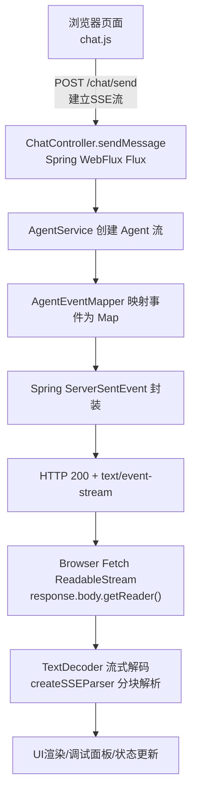
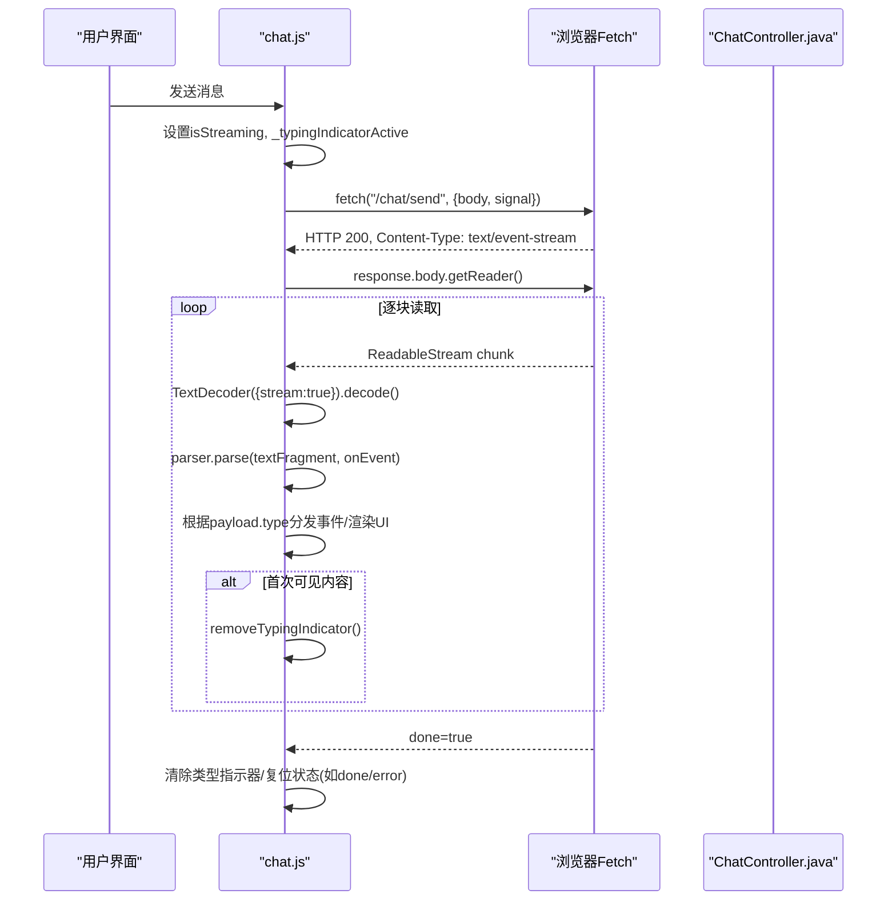
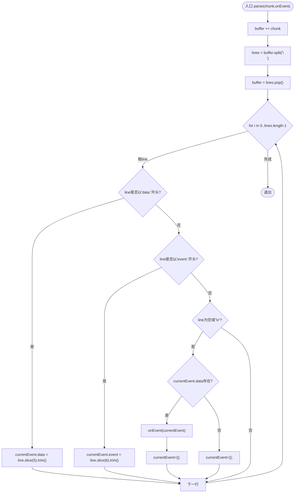
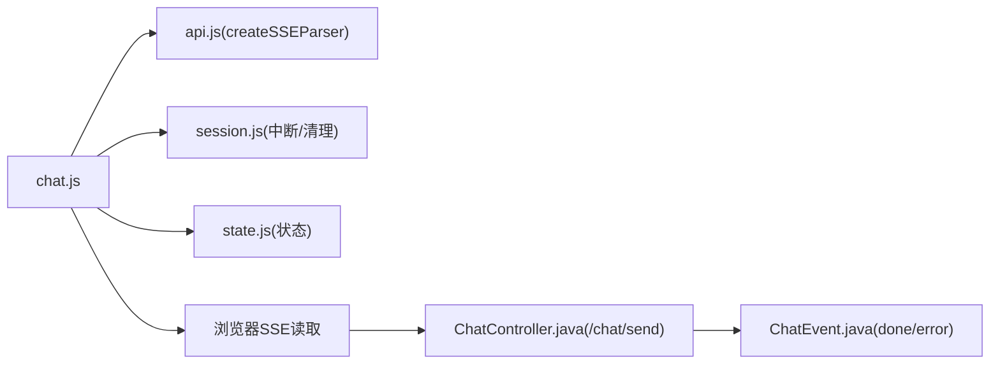

# SSE连接管理

<cite>
**本文引用的文件**
- [chat.js](file://src/main/resources/static/scripts/chat.js)
- [api.js](file://src/main/resources/static/scripts/api.js)
- [session.js](file://src/main/resources/static/scripts/modules/session.js)
- [state.js](file://src/main/resources/static/scripts/state.js)
- [ChatController.java](file://src/main/java/com/skloda/agentscope/controller/ChatController.java)
- [ChatEvent.java](file://src/main/java/com/skloda/agentscope/model/ChatEvent.java)
- [agui.html](file://src/main/resources/static/agui.html)
</cite>

## 目录
1. [简介](#简介)
2. [项目结构](#项目结构)
3. [核心组件](#核心组件)
4. [架构总览](#架构总览)
5. [详细组件分析](#详细组件分析)
6. [依赖关系分析](#依赖关系分析)
7. [性能考虑](#性能考虑)
8. [故障排查指南](#故障排查指南)
9. [结论](#结论)
10. [附录：WebSocket对比与迁移建议](#附录websocket对比与迁移建议)

## 简介
本文档聚焦前端 SSE（Server-Sent Events）连接管理与解析，系统剖析 createSSEParser() 的实现原理、fetch('/chat/send') 的响应处理流程（response.body.getReader、TextDecoder 流式解码、AbortController 取消机制）、连接生命周期（超时、重试、内存清理）、网络异常与代理兼容性处理，以及监控调试工具的使用。并给出与 WebSocket 的对比和迁移建议。

## 项目结构
前端位于 static 资源目录下，核心实现分布在 chat.js、api.js、modules 中的 session.js 与 state.js。后端通过 Spring WebFlux 提供 /chat/send SSE 流。下图展示了前后端的主要交互路径与数据流向。

图表来源
- [chat.js:106-147](file://src/main/resources/static/scripts/chat.js#L106-L147)
- [ChatController.java:122-153](file://src/main/java/com/skloda/agentscope/controller/ChatController.java#L122-L153)

章节来源
- [chat.js:106-147](file://src/main/resources/static/scripts/chat.js#L106-L147)
- [api.js:1-25](file://src/main/resources/static/scripts/api.js#L1-L25)
- [session.js:53-119](file://src/main/resources/static/scripts/modules/session.js#L53-L119)
- [state.js:2-24](file://src/main/resources/static/scripts/state.js#L2-L24)
- [ChatController.java:122-153](file://src/main/java/com/skloda/agentscope/controller/ChatController.java#L122-L153)

## 核心组件
- createSSEParser：负责接收字符串片段，按行缓冲与拆分，识别 data: 与 event: 行，在空行时发射当前事件并重置缓冲区。
- SSE读取循环：使用 response.body.getReader() 持续读取字节块，TextDecoder({stream:true}) 增量解码为 UTF-8 文本后传入 parse(chunk)。
- AbortController：每个发送请求都创建一个控制器，用于会话切换、删除会话或 UI 操作时主动中断流。
- 状态与回调：chat.js 内部维护 isStreaming、currentRound、_typingIndicatorActive 等状态；事件处理器根据 payload.type 分支处理。

章节来源
- [api.js:1-25](file://src/main/resources/static/scripts/api.js#L1-L25)
- [chat.js:24-147](file://src/main/resources/static/scripts/chat.js#L24-L147)
- [session.js:72-119](file://src/main/resources/static/scripts/modules/session.js#L72-L119)

## 架构总览
下图展示从前端发起 POST /chat/send 到流结束的全链路时序：包含请求构造、服务端返回 SSE、客户端读取与解析、事件分发与 UI 更新。

图表来源
- [chat.js:106-147](file://src/main/resources/static/scripts/chat.js#L106-L147)
- [ChatController.java:122-153](file://src/main/java/com/skloda/agentscope/controller/ChatController.java#L122-L153)

章节来源
- [chat.js:106-147](file://src/main/resources/static/scripts/chat.js#L106-L147)
- [ChatController.java:122-153](file://src/main/java/com/skloda/agentscope/controller/ChatController.java#L122-L153)

## 详细组件分析

### createSSEParser 实现原理
- 数据缓冲机制：维护 buffer 字符串，append 新片段后进行 split('\n')，弹出最后一个元素重新赋给 buffer，已完整行遍历处理。
- 事件流解析算法：行以 'event:' 开头则提取事件类型，以 'data:' 开头则提取事件数据；遇到空行或 '\r' 表示一个事件结束，若 currentEvent.data 非空则通过 onEvent(currentEvent) 触发回调，随后重置 currentEvent。
- 断线检测逻辑：函数本身无心跳/保活；断线由 reader.read() 返回 done=true 或由外部 catch 捕获异常。需在上层补充超时与重连策略。

图表来源
- [api.js:1-25](file://src/main/resources/static/scripts/api.js#L1-L25)

章节来源
- [api.js:1-25](file://src/main/resources/static/scripts/api.js#L1-L25)

### /chat/send 响应处理流程（getReader、TextDecoder、AbortController）
- response.body.getReader()：获取可读字节流迭代器；循环调用 read()，直到 result.done 为 true 结束。
- TextDecoder 流式解码：new TextDecoder() 配合 decode(value, {stream:true}) 将二进制块增量转 UTF-8，避免重复前缀问题。
- AbortController 取消机制：每次发送构建新的 AbortController，并通过 signal 传递给 fetch；在会话切换、清空或错误场景可调用 abort() 立即停止读取循环与释放资源。

关键要点
- 首字节到达不等于有 SSE 事件，因此在首次收到可视内容前不隐藏“正在输入”指示器，避免闪烁空白。
- 事件分发基于 payload.type，包括 thinking/reasoning_text/tool_start/text/done/error/pending_approval 等，不同分支执行不同的 UI 与调试面板行为。

章节来源
- [chat.js:24-147](file://src/main/resources/static/scripts/chat.js#L24-L147)
- [session.js:72-119](file://src/main/resources/static/scripts/modules/session.js#L72-L119)
- [state.js:2-24](file://src/main/resources/static/scripts/state.js#L2-L24)

### 连接生命周期管理
- 超时设置：当前代码未显式设置 fetch 超时；可通过引入 timeout AbortSignal 或包装 Promise.race 方式增加超时控制。
- 重试策略：当前代码未实现自动重试；可在外层根据 error 类型（网络错误或服务器错误码）实施指数退避重试。
- 内存清理：
  - 正常结束：reader 读尽 done 后循环退出，parser、decoder 引用被回收。
  - 异常或中止：catch 捕获后应确保移除类型指示器、重置 isStreaming、清理当前 Round/Thinking Box 等中间态。
  - 会话切换/删除：调用 AbortController.abort() 并在 finally/清理路径中重置 window 级别状态。

章节来源
- [chat.js:24-147](file://src/main/resources/static/scripts/chat.js#L24-L147)
- [session.js:72-119](file://src/main/resources/static/scripts/modules/session.js#L72-L119)

### 网络异常处理与代理兼容性
- 非 200 响应：if (!response.ok) 路径下移除类型指示器、上报错误、结束轮次并停止流式处理。
- 运行时异常：外层 try/catch 捕获 fetch 或 read 异常，确保 UI 恢复可用状态。
- 代理/网关兼容：某些代理可能缓冲整段响应后再下发，导致 getReader() 无法真正流式。建议：
  - 保持合理分片大小（浏览器默认驱动），必要时降低并发。
  - 对超时敏感的场景可配置较短的初始超时，快速失败。
  - 检查响应头确保 content-type 为 text/event-stream。

章节来源
- [chat.js:106-147](file://src/main/resources/static/scripts/chat.js#L106-L147)

### 监控与调试工具
- Network 面板：确认 /chat/send 为 SSE 流（text/event-stream），跟踪首字节、时间线、事件帧数量。
- Console 日志：chat.js 中对 tool_start/tool_end 等有专门 log；可通过过滤 “[SSE]”、“upload”、“endRound” 等关键字定位问题。
- 调试面板：debug.js 模块会随事件更新侧边栏时间线与回合卡片，辅助观察 pipeline/routing/handoff 等多智能体过程。
- 指标收集：可基于 Performance API 收集流开启至首个可视事件耗时、吞吐率等（当前仓库未内置采集，建议自行扩展）。

章节来源
- [chat.js:137-147](file://src/main/resources/static/scripts/chat.js#L137-L147)
- [session.js:142-147](file://src/main/resources/static/scripts/modules/session.js#L142-L147)

## 依赖关系分析
前端各模块职责划分清晰：
- chat.js：SSE 读写、事件分发与 UI 交互
- api.js：暴露 createSSEParser 及通用 REST API 函数
- session.js：会话生命周期管理，含中止/清理事件流的状态保护
- state.js：集中状态容器，提供全局访问

后端：
- ChatController：统一暴露 /chat/send 接口，使用 WebFlux Flux 返回 ServerSentEvent 流
- ChatEvent：定义 done/error 等基础事件类型

图表来源
- [chat.js:106-147](file://src/main/resources/static/scripts/chat.js#L106-L147)
- [api.js:1-25](file://src/main/resources/static/scripts/api.js#L1-L25)
- [session.js:72-119](file://src/main/resources/static/scripts/modules/session.js#L72-L119)
- [state.js:2-24](file://src/main/resources/static/scripts/state.js#L2-L24)
- [ChatController.java:122-153](file://src/main/java/com/skloda/agentscope/controller/ChatController.java#L122-L153)
- [ChatEvent.java:6-39](file://src/main/java/com/skloda/agentscope/model/ChatEvent.java#L6-L39)

章节来源
- [chat.js:106-147](file://src/main/resources/static/scripts/chat.js#L106-L147)
- [api.js:1-25](file://src/main/resources/static/scripts/api.js#L1-L25)
- [session.js:72-119](file://src/main/resources/static/scripts/modules/session.js#L72-L119)
- [state.js:2-24](file://src/main/resources/static/scripts/state.js#L2-L24)
- [ChatController.java:122-153](file://src/main/java/com/skloda/agentscope/controller/ChatController.java#L122-L153)
- [ChatEvent.java:6-39](file://src/main/java/com/skloda/agentscope/model/ChatEvent.java#L6-L39)

## 性能考虑
- 流式解码：使用 TextDecoder({stream:true}) 实现增量解码，避免全量拼接导致的内存峰值。
- 事件分派：仅在产生可见内容的 events（thinking/reasoning_text/text/tool_start/done/error/pending_approval）时关闭“正在输入”提示，减少误刷。
- 长连接资源：应在 done/error/abort 后及时解绑/清空引用，防止残留闭包引用 DOM，造成内存泄漏。
- 大消息：避免一次性拼出超大 HTML；可采用虚拟滚动或分页渲染提升首屏速度。

[本节为通用指导，不直接分析具体文件，故无“章节来源”]

## 故障排查指南
常见问题与定位方法
- 404 响应：说明路由不存在或路径变更；确认 /chat/send 在后端是否正确注册为 @PostMapping 且 produces=text/event-stream。
- 500 响应：后端序列化或流构建异常；服务端会在 onErrorResume 中转为错误 SSE，并附带 error 事件类型。
- 流悬挂：read() 一直不 done；可能为代理层缓冲或未正确关闭；可添加超时与日志。
- 代理/企业防火墙：部分环境禁用 SSE；可降级为轮询（long polling）或改用 WebSocket。
- 会话中断：切换会话/删除会话时未正确中止，导致旧流仍写入 UI；请在中断路径调用 AbortController.abort() 并复位状态。

章节来源
- [ChatController.java:122-153](file://src/main/java/com/skloda/agentscope/controller/ChatController.java#L122-L153)
- [ChatEvent.java:21-35](file://src/main/java/com/skloda/agentscope/model/ChatEvent.java#L21-L35)
- [session.js:72-119](file://src/main/resources/static/scripts/modules/session.js#L72-L119)

## 结论
该工程的 SSE 实现简洁高效：前端采用原生 Fetch+ReadableStream+TextDecoder，配合轻量级的 createSSEParser 进行事件流解析；后端基于 Spring WebFlux 以 ServerSentEvent 推送事件流。建议在现有基础上补充统一的超时、重试与错误恢复策略，完善连接级指标采集，增强在复杂代理环境的兼容性。对于高实时性、双向通信场景，可评估迁移至 WebSocket 的收益与成本。

[本节总结性陈述，无需“章节来源”]

## 附录：WebSocket对比与迁移建议
- 适用场景
  - SSE：服务端单向推送到前端；适合聊天生成、日志流、监控看板等。
  - WebSocket：全双工实时通信；适合即时协作、多人互动、需要频繁上行下行数据的场景。
- 迁移考量
  - 鉴权与会话：SSE 通常依赖 URL/Token；WebSocket 需在握手阶段处理认证与会话绑定。
  - 可靠性：SSE 无官方重连机制；WebSocket 具备 reconnection 能力更强。
  - 代理/防火墙：两者都可能被企业代理拦截；需考虑降级方案。
  - 复杂度：迁移到 WebSocket 需要新增客户端管理器与服务端连接池/广播能力。
- 渐进迁移路径
  - 先在 SSE 上补齐超时、重试、指标；再在新特性中试点 WebSocket。
  - 提供协议适配层：相同业务语义对上保持一致的 API。
  - 多协议共存：旧端点保留，逐步切流；灰度发布与回滚预案完备。

[本节为概念性对比，不涉及具体源码，故无“图表来源”与“章节来源”]