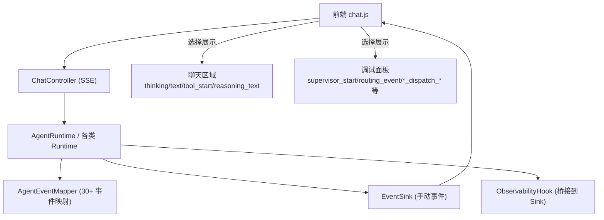
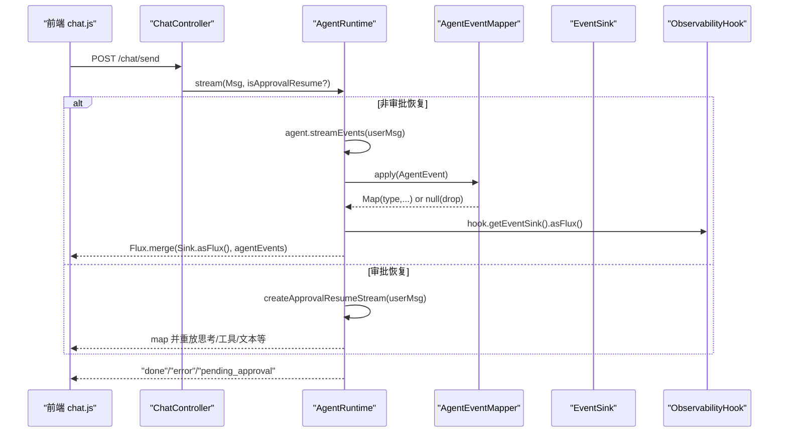
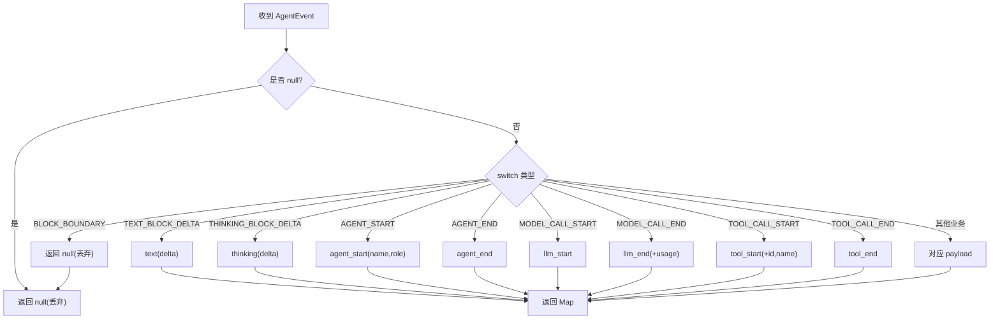
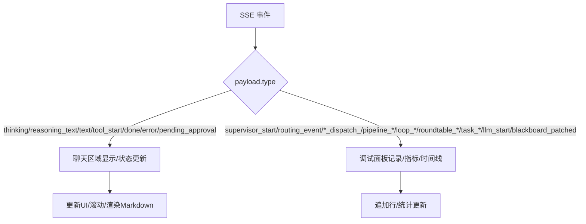
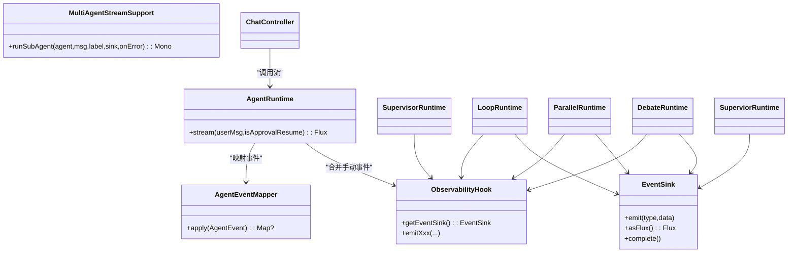

# 事件处理系统

<cite>
**本文引用的文件 **
- [ChatEvent.java](file://src/main/java/com/skloda/agentscope/model/ChatEvent.java)
- [AgentRuntime.java](file://src/main/java/com/skloda/agentscope/runtime/AgentRuntime.java)
- [StreamingAgentRuntime.java](file://src/main/java/com/skloda/agentscope/runtime/StreamingAgentRuntime.java)
- [AgentEventMapper.java](file://src/main/java/com/skloda/agentscope/runtime/AgentEventMapper.java)
- [MultiAgentStreamSupport.java](file://src/main/java/com/skloda/agentscope/runtime/MultiAgentStreamSupport.java)
- [ObservabilityHook.java](file://src/main/java/com/skloda/agentscope/hook/ObservabilityHook.java)
- [EventSink.java](file://src/main/java/com/skloda/agentscope/runtime/EventSink.java)
- [SupervisorRuntime.java](file://src/main/java/com/skloda/agentscope/blackboard/SupervisorRuntime.java)
- [LoopRuntime.java](file://src/main/java/com/skloda/agentscope/runtime/LoopRuntime.java)
- [DebateRuntime.java](file://src/main/java/com/skloda/agentscope/runtime/DebateRuntime.java)
- [ParallelRuntime.java](file://src/main/java/com/skloda/agentscope/runtime/ParallelRuntime.java)
- [ChatController.java](file://src/main/java/com/skloda/agentscope/controller/ChatController.java)
- [chat.js](file://src/main/resources/static/scripts/chat.js)
- [debug.js](file://src/main/resources/static/scripts/modules/debug.js)
</cite>

## 目录
1. 引言
2. 项目结构
3. 核心组件
4. 架构总览
5. 详细组件分析
6. 依赖关系分析
7. 性能与并发特性
8. 故障排查指南
9. 结论
10. 附录

## 引言
本文件系统性地梳理并文档化事件处理管线，覆盖 AgentScope 原生事件、多智能体协作事件与前端渲染链路。重点包括：
- 30+ 种 AgentScope 事件类型的统一映射与过滤规则
- 聊天区域显示事件（thinking/reasoning_text/text/tool_start）与调试面板事件（supervisor_start/routing_event/expert_dispatch_* 等）的明确区分
- switch-case 分支驱动的状态转换与 UI 更新
- 事件队列管理、异步流式处理机制、事件优先级控制
- 多智能体协作事件的特殊处理：pipeline_*、handoff_*、loop_*、debate_* 等复杂场景
- 事件调试工具与常见问题排查（丢失、乱序、重复渲染）

## 项目结构
本仓库的事件处理贯穿后端控制器、运行时、事件映射器与前端解析渲染：
- 控制器层：SSE 接口封装、错误与完成语义
- 运行时层：单 Agent、并行/顺序/循环/辩论/监督者等多种编排
- 事件映射层：AgentEvent → SSE Map（30+ 类型）
- 事件总线：手动多智能体事件的发射通道
- 前端解析：SSE 事件解析、渲染到聊天区与调试面板

图表来源
- [ChatController.java:117-153](file://src/main/java/com/skloda/agentscope/controller/ChatController.java#L117-L153)
- [AgentRuntime.java:67-142](file://src/main/java/com/skloda/agentscope/runtime/AgentRuntime.java#L67-L142)
- [AgentEventMapper.java:64-105](file://src/main/java/com/skloda/agentscope/runtime/AgentEventMapper.java#L64-L105)
- [EventSink.java:15-62](file://src/main/java/com/skloda/agentscope/runtime/EventSink.java#L15-L62)
- [ObservabilityHook.java:45-67](file://src/main/java/com/skloda/agentscope/hook/ObservabilityHook.java#L45-L67)
- [chat.js:178-210](file://src/main/resources/static/scripts/chat.js#L178-L210)

章节来源
- [ChatController.java:47-153](file://src/main/java/com/skloda/agentscope/controller/ChatController.java#L47-L153)
- [StreamingAgentRuntime.java:9-20](file://src/main/java/com/skloda/agentscope/runtime/StreamingAgentRuntime.java#L9-L20)
- [AgentEventMapper.java:39-105](file://src/main/java/com/skloda/agentscope/runtime/AgentEventMapper.java#L39-L105)

## 核心组件
- ChatController：将后端 Flux<Map<String,Object>> 转为 ServerSentEvent，负责错误包装、done 终止、HITL 审批恢复路径
- AgentRuntime：单一 Agent 会话 Stream，合并自动 AgentEvent 流与 EventSink 的手动事件；支持“审批后恢复”重新流式执行
- AgentEventMapper：纯函数映射器，将 AgentScope 30+ 事件转换为带 type 前缀的 SSE payload，对不需要渲染的事件返回 null 丢弃
- MultiAgentStreamSupport：为管道/路由/委托等编排提供 runSubAgent，将每个子 Agent 的流式事件转发给外部 sink，并追踪最终文本
- ObservabilityHook + EventSink：通过 Sinks.Many 广播手动事件，所有 Runtime 均可 emit pipeline/handoff/loop/routing 等业务事件
- SupervisorRuntime、LoopRuntime、DebateRuntime、ParallelRuntime：不同协作模式的运行时实现，均遵循统一的 stream() 契约并复用上述组件
- 前端 chat.js：解析 SSE，按类型分派到聊天或调试面板；维护轮次（round）状态，计算指标，更新时间线
- debug.js：调试面板辅助能力，创建 round 卡片、时间线行、指标聚合等

章节来源
- [AgentRuntime.java:67-142](file://src/main/java/com/skloda/agentscope/runtime/AgentRuntime.java#L67-L142)
- [AgentEventMapper.java:64-105](file://src/main/java/com/skloda/agentscope/runtime/AgentEventMapper.java#L64-L105)
- [MultiAgentStreamSupport.java:43-118](file://src/main/java/com/skloda/agentscope/runtime/MultiAgentStreamSupport.java#L43-L118)
- [ObservabilityHook.java:11-67](file://src/main/java/com/skloda/agentscope/hook/ObservabilityHook.java#L11-L67)
- [EventSink.java:15-152](file://src/main/java/com/skloda/agentscope/runtime/EventSink.java#L15-L152)
- [chat.js:1-12](file://src/main/resources/static/scripts/chat.js#L1-L12)
- [debug.js:5-61](file://src/main/resources/static/scripts/modules/debug.js#L5-L61)

## 架构总览
事件从两条主要路径汇入前端：
- AgentScope 原生流：Agent.streamEvents() → AgentEventMapper.map → SSE
- 手动事件：Runtime 通过 ObservabilityHook/EventSink 发出 pipeline/routing/handoff/loop/debate 等事件

在 AgentRuntime 中，两者使用 Flux.merge 合并，确保下游能同时消费自动与手动事件。完成后端统一以 "done" 事件结束流。

图表来源
- [AgentRuntime.java:67-142](file://src/main/java/com/skloda/agentscope/runtime/AgentRuntime.java#L67-L142)
- [AgentEventMapper.java:64-105](file://src/main/java/com/skloda/agentscope/runtime/AgentEventMapper.java#L64-L105)
- [ObservabilityHook.java:45-67](file://src/main/java/com/skloda/agentscope/hook/ObservabilityHook.java#L45-L67)
- [EventSink.java:15-62](file://src/main/java/com/skloda/agentscope/runtime/EventSink.java#L15-L62)
- [ChatController.java:117-153](file://src/main/java/com/skloda/agentscope/controller/ChatController.java#L117-L153)

## 详细组件分析

### AgentEventMapper：30+ 事件映射表与过滤策略
- 覆盖全部 AgentEventType，采用 switch 分类处理
- 需要渲染的事件（如 text/thinking/agent_start/llm_start/tool_start 等）生成带 type 的 Map 并下发
- 块边界类事件（TEXT_BLOCK_START/END、THINKING_BLOCK_START/END、DATA_BLOCK_START/END）返回 null 被丢弃
- 异常兜底：捕获异常并返回 error 事件，避免中断整个流

图表来源
- [AgentEventMapper.java:64-105](file://src/main/java/com/skloda/agentscope/runtime/AgentEventMapper.java#L64-L105)

章节来源
- [AgentEventMapper.java:39-205](file://src/main/java/com/skloda/agentscope/runtime/AgentEventMapper.java#L39-L205)

### AgentRuntime：单 Agent 流式协调与审批恢复
- 合并两个源：EventSink 的手动事件（来自各 Runtime 的 hook.emit*）与 agent.streamEvents() 的自动事件
- 审批恢复模式：若为 HITL 恢复，则使用 userMsg 或空列表调用 streamEvents 来重放中间事件（thinking/tool_start/tool_end/text），保证前端一致体验
- 完成后清理：doFinally 完成 EventSink，触发外层 Flux 完成，确保 done 可送达
- tool_start 增强：注入 MCP 溯源字段（isMcp/mcpName）

章节来源
- [AgentRuntime.java:67-142](file://src/main/java/com/skloda/agentscope/runtime/AgentRuntime.java#L67-L142)
- [AgentRuntime.java:144-183](file://src/main/java/com/skloda/agentscope/runtime/AgentRuntime.java#L144-L183)

### MultiAgentStreamSupport：子 Agent 流式转发与结果聚合
- runSubAgent(agent,msg,sourceLabel,sink,onError)
- 转发每条映射后的事件，附加 source 标签便于前端归因
- 收集 finalText：优先 AGENT_RESULT，否则回退到累积 text 增量
- 错误时向 sink 发送 error 并继续

章节来源
- [MultiAgentStreamSupport.java:43-118](file://src/main/java/com/skloda/agentscope/runtime/MultiAgentStreamSupport.java#L43-L118)

### 多智能体协作运行时
- LoopRuntime（写-审循环）
  - 每次 writer→critic 迭代，emit loop_writer_output、loop_iteration_result
  - 达到最大迭代时，仍输出最后一次 writer 内容
  - 最终 emit loop_end 与 done
- ParallelRuntime（并行专家）
  - 并发运行多个子 Agent，分别标注 source
  - 汇总各子 Agent 输出为 text，emit pipeline_step_result
- DebateRuntime（多方辩论+裁判总结）
  - 逐轮邀请专家发言，collect 参数，最终 judge 输出 roundtable_summary 和 final text
- SupervisorRuntime（基于共享黑板的路由/监督）
  - 发射 supervisor_start、routing_event、expert_dispatch_start/end、blackboard_patched 等
  - 屏蔽 expert 的 text/agent_start/agent_end/agent_result_text，防止原始 JSON 污染对话

章节来源
- [LoopRuntime.java:52-166](file://src/main/java/com/skloda/agentscope/runtime/LoopRuntime.java#L52-L166)
- [ParallelRuntime.java:38-106](file://src/main/java/com/skloda/agentscope/runtime/ParallelRuntime.java#L38-L106)
- [DebateRuntime.java:44-141](file://src/main/java/com/skloda/agentscope/runtime/DebateRuntime.java#L44-L141)
- [SupervisorRuntime.java:129-205](file://src/main/java/com/skloda/agentscope/blackboard/SupervisorRuntime.java#L129-L205)

### 观察性与事件总线
- ObservabilityHook：桥接旧 hook API 至新的 EventSink，暴露 emitPipeline*/emitRouting*/emitHandoff*/emitLoop*/emitGraph*/emitRoundtable*/emitTask* 等方法
- EventSink：基于 Sinks.Many 的广播事件总线，提供 typed emit 方法与常量

章节来源
- [ObservabilityHook.java:11-67](file://src/main/java/com/skloda/agentscope/hook/ObservabilityHook.java#L11-L67)
- [EventSink.java:15-152](file://src/main/java/com/skloda/agentscope/runtime/EventSink.java#L15-L152)

### 控制器与 SSE 通道
- ChatController.sendMessage：参数校验、构造会话上下文、调用服务层获取 Flux<Map>、封装为 SSE、takeUntil(done)、错误容错
- Approval 回调：根据批准/拒绝构造消息恢复 Agent 流，保证后续事件完整回放

章节来源
- [ChatController.java:117-153](file://src/main/java/com/skloda/agentscope/controller/ChatController.java#L117-L153)
- [ChatController.java:155-200](file://src/main/java/com/skloda/agentscope/controller/ChatController.java#L155-L200)

### 前端渲染与事件分流
聊天区域可见事件（清除输入框禁用点/构建消息气泡）：
- thinking、reasoning_text（作为推理文本显示）、text、tool_start、done、error、pending_approval

调试面板事件（仅记录时间线/度量/图元，不清除输入指示器）：
- supervisor_start、routing_event、expert_dispatch_start、expert_dispatch_end、pipeline_start/step_start/end/end、roundtable_*、task_*、loop_* 以及 llm_start、blackboard_patched 等

图表来源
- [chat.js:152-176](file://src/main/resources/static/scripts/chat.js#L152-L176)
- [chat.js:178-210](file://src/main/resources/static/scripts/chat.js#L178-L210)
- [debug.js:5-61](file://src/main/resources/static/scripts/modules/debug.js#L5-L61)

章节来源
- [chat.js:178-210](file://src/main/resources/static/scripts/chat.js#L178-L210)
- [debug.js:5-61](file://src/main/resources/static/scripts/modules/debug.js#L5-L61)

## 依赖关系分析
- AgentRuntime 依赖 AgentEventMapper 与 ObservabilityHook，用于统一事件映射与手动事件合并
- 所有编排 Runtime（Loop/Parallel/Debate/Supervisor）复用 MultiAgentStreamSupport.runSubAgent 与 EventSink
- 前端强依赖 chat.js 的事件分发逻辑，需与后端事件命名保持严格一致
- ChatController 不关心具体事件细节，只负责通道化与安全封装

图表来源
- [AgentRuntime.java:67-142](file://src/main/java/com/skloda/agentscope/runtime/AgentRuntime.java#L67-L142)
- [AgentEventMapper.java:64-105](file://src/main/java/com/skloda/agentscope/runtime/AgentEventMapper.java#L64-L105)
- [ObservabilityHook.java:45-67](file://src/main/java/com/skloda/agentscope/hook/ObservabilityHook.java#L45-L67)
- [EventSink.java:15-152](file://src/main/java/com/skloda/agentscope/runtime/EventSink.java#L15-L152)
- [MultiAgentStreamSupport.java:74-118](file://src/main/java/com/skloda/agentscope/runtime/MultiAgentStreamSupport.java#L74-L118)
- [ChatController.java:117-153](file://src/main/java/com/skloda/agentscope/controller/ChatController.java#L117-L153)

## 性能与并发特性
- 响应式背压：EventSink 使用 onBackpressureBuffer，前端订阅慢不会导致内存泄漏（但需注意合理缓冲阈值）
- 合并流：Flux.merge(sinkEvents, agentEvents) 使两类事件无差别到达前端，无需额外同步
- 阻塞转非阻塞：SupervisorRuntime 在 boundedElastic 上执行专家调度，避免阻塞主事件循环
- 资源释放：onCancel/ onComplete/ doFinally 都确保 EventSink.complete()，避免悬挂流
- 文本聚合：runSubAgent 先尝试 AGENT_RESULT，再回退累积 text，提高鲁棒性

[本节为通用性能讨论，不直接引用具体文件]

## 故障排查指南
常见问题与解决要点：

- 事件丢失
  - 检查 EventSink 是否未 complete 导致前端无法关闭连接
  - 检查 AgentEventMapper 是否返回 null 丢弃事件（如块边界事件）
  - 确认 chat.js 的 case 分支是否遗漏新事件类型
- 顺序错乱
  - 确认 Flux.merge 的顺序稳定且不被并发打断（runSubAgent 已对事件加 source 标记）
  - 核对前端 round 生命周期，避免跨轮事件误入
- 重复渲染
  - 注意 Supervisor 对 expert 流中的 text/agent_start/agent_end/agent_result_text 会屏蔽，防止重复显示
  - 审批恢复路径必须走 createApprovalResumeStream，避免只接收最终文本而丢失中间事件
- 输入框长时间不可用
  - 首次聊天时，typing indicator 应在第一个显示内容事件（thinking/reasoning_text/text/tool_start 等）才移除
  - done/error/pending_approval 应重置 streaming 状态
- HITL 审批卡住
  - 检查 ChatController.handleApproval 是否正确重建 AgentRuntime 并调用 stream(null | rejectionMsg, true)

章节来源
- [AgentRuntime.java:67-142](file://src/main/java/com/skloda/agentscope/runtime/AgentRuntime.java#L67-L142)
- [AgentRuntime.java:144-183](file://src/main/java/com/skloda/agentscope/runtime/AgentRuntime.java#L144-L183)
- [SupervisorRuntime.java:72-88](file://src/main/java/com/skloda/agentscope/blackboard/SupervisorRuntime.java#L72-L88)
- [chat.js:152-176](file://src/main/resources/static/scripts/chat.js#L152-L176)
- [ChatController.java:155-200](file://src/main/java/com/skloda/agentscope/controller/ChatController.java#L155-L200)

## 结论
该事件处理系统以响应式流为核心，统一了 AgentScope 原生事件与多智能体业务事件的分发与渲染。通过严格的映射器、健壮的事件总线与清晰的前端分流策略，既保障了用户体验（聊天区域即时反馈），也提供了充分的可观测性（调试面板详尽时间线与度量）。在复杂编排场景中（循环/辩论/监督/并行），系统保持一致的事件语义与状态机，便于扩展与维护。

## 附录

### 事件类型与用途速览
- 聊天区域：thinking、reasoning_text、text、tool_start、done、error、pending_approval
- 调试面板：supervisor_start、routing_event、expert_dispatch_start/end、pipeline_start/step_start/end/end、loop_start/end/iteration_result、roundtable_start/start/end/message/summary、task_delegate/start/end/aggregate、llm_start、blackboard_patched

章节来源
- [chat.js:152-176](file://src/main/resources/static/scripts/chat.js#L152-L176)
- [EventSink.java:40-62](file://src/main/java/com/skloda/agentscope/runtime/EventSink.java#L40-L62)
- [SupervisorRuntime.java:139-194](file://src/main/java/com/skloda/agentscope/blackboard/SupervisorRuntime.java#L139-L194)
- [AgentEventMapper.java:71-99](file://src/main/java/com/skloda/agentscope/runtime/AgentEventMapper.java#L71-L99)