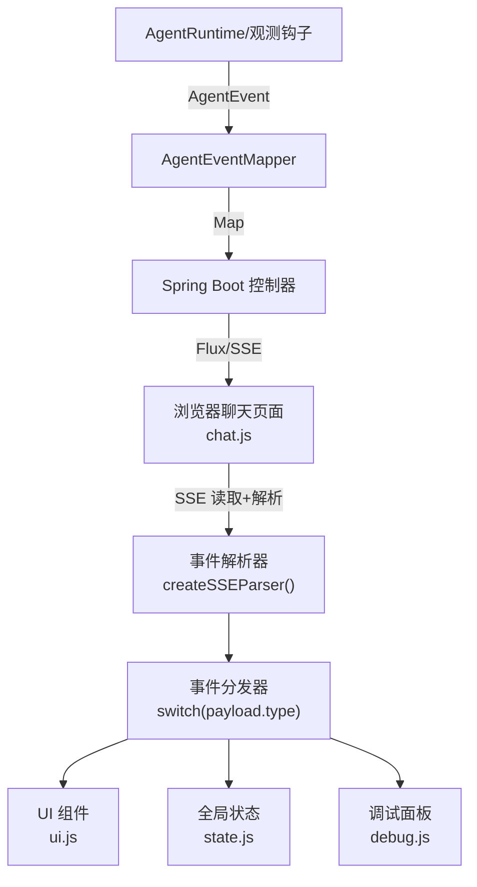
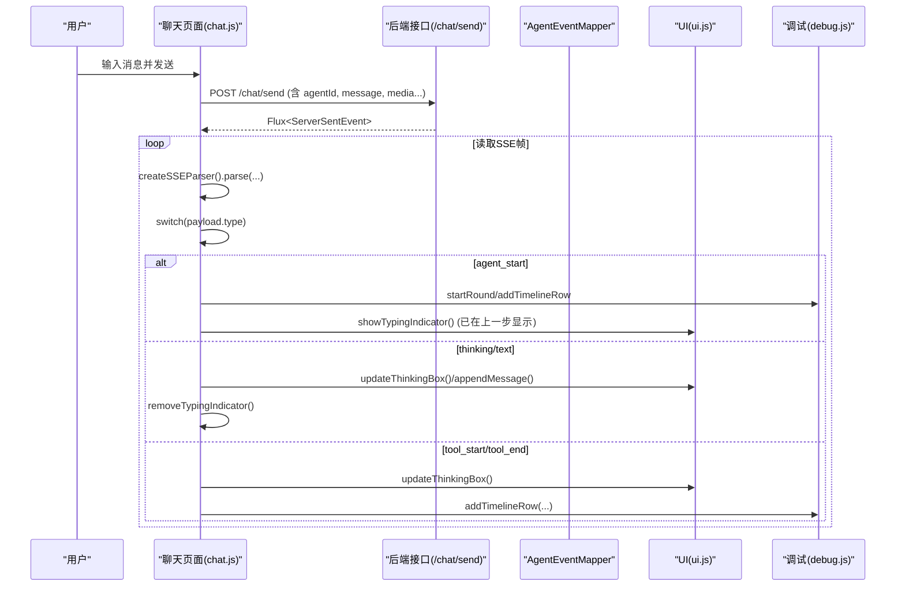
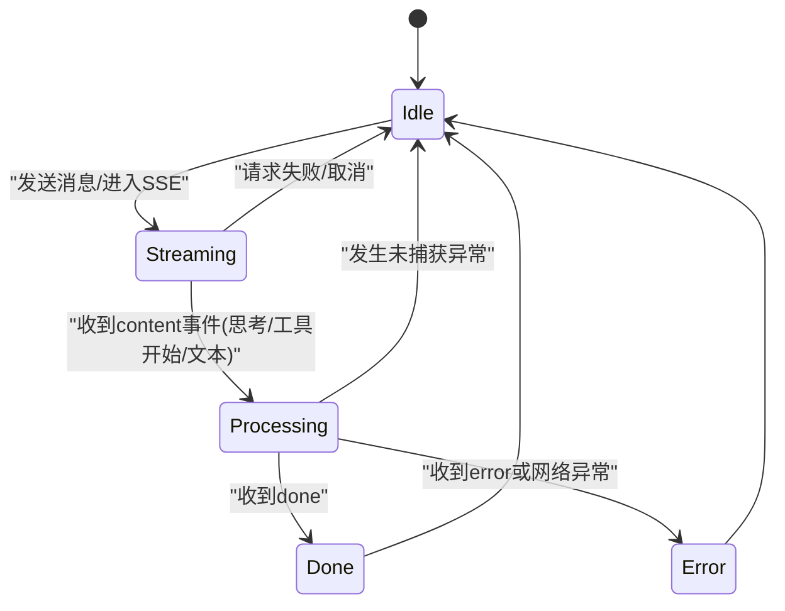

# 基础事件处理器

<cite>
**本文引用的文件列表**
- [chat.js](file://src/main/resources/static/scripts/chat.js)
- [ui.js](file://src/main/resources/static/scripts/modules/ui.js)
- [utils.js](file://src/main/resources/static/scripts/modules/utils.js)
- [state.js](file://src/main/resources/static/scripts/state.js)
- [debug.js](file://src/main/resources/static/scripts/modules/debug.js)
- [AgentEventMapper.java](file://src/main/java/com/skloda/agentscope/runtime/AgentEventMapper.java)
- [ChatEvent.java](file://src/main/java/com/skloda/agentscope/model/ChatEvent.java)
- [ChatMessage.java](file://src/main/java/com/skloda/agentscope/model/ChatMessage.java)
</cite>

## 目录
1. [简介](#简介)
2. [项目结构与角色定位](#项目结构与角色定位)
3. [核心组件与数据流总览](#核心组件与数据流总览)
4. [详细组件分析：前端事件处理核心](#详细组件分析：前端事件处理核心)
5. [类型化事件与生命周期映射（后端到前端）](#类型化事件与生命周期映射后端到前端)
6. [状态机与会话上下文管理](#状态机与会话上下文管理)
7. [消息渲染、去重与 DOM 优化](#消息渲染去重与-dom-优化)
8. [性能与内存防护](#性能与内存防护)
9. [测试方法与调试技巧](#测试方法与调试技巧)
10. [常见问题排查](#常见问题排查)
11. [结论](#结论)

## 简介
本文件系统性地梳理了“基础事件处理器”在对话型 Agent 应用中的设计与实现：从后端事件到前端 SSE 消费，再到 UI 增量渲染与状态同步。重点围绕以下类型的事件展开：
- agent_start / agent_end：会话轮次的生命周期锚点
- tool_start / tool_end：工具调用过程的可见性展示
- thinking/reasoning_text：推理过程的可视化
- text：最终文本的增量渲染
并解释这些事件如何驱动打字指示器的显示/隐藏、思考框的动态创建/更新/收起、消息气泡的创建与样式控制，同时保证会话状态的可靠切换、输入锁定、防抖与去重、DOM 操作优化与内存泄漏防护。最后给出测试与调试的实践建议。

## 项目结构与角色定位
- 后端职责：将 AgentScope 2.0 的 AgentEvent 映射为统一的 SSE payload（type + content/name/toolName 等），供前端消费。
- 前端职责：建立 SSE 连接，解析事件并根据 type 路由到不同的处理器，联动 UI 与全局状态。

图表来源
- [chat.js:129-178](file://src/main/resources/static/scripts/chat.js#L129-L178)
- [AgentEventMapper.java:64-105](file://src/main/java/com/skloda/agentscope/runtime/AgentEventMapper.java#L64-L105)
- [ui.js:15-180](file://src/main/resources/static/scripts/modules/ui.js#L15-L180)

章节来源
- [chat.js:129-178](file://src/main/resources/static/scripts/chat.js#L129-L178)
- [AgentEventMapper.java:64-105](file://src/main/java/com/skloda/agentscope/runtime/AgentEventMapper.java#L64-L105)

## 核心组件与数据流总览
- AgentEventMapper：把 AgentScope 的 AGENT_START/AGENT_END/TEXT_BLOCK_DELTA/THINKING_BLOCK_DELTA/TOOL_CALL_START/TOOL_CALL_END 等统一转换为前端可识别的 type 字段，如 agent_start、agent_end、text、thinking、tool_start、tool_end 等。对于不需要展示的块边界事件，返回 null（被丢弃）。
- chat.js：维护 SSE 读写循环与事件分派；负责首次内容出现时移除打字指示器；根据 payload.type 更新思考框、消息气泡、调试面板与指标。
- ui.js：提供 appendMessage、createThinkingBox、updateThinkingBox、showTypingIndicator/removeTypingIndicator 等 UI 函数。
- state.js：集中管理 currentRound、roundNumber、isStreaming、currentThinkingBox、currentFileInfo 等跨模块共享状态。
- debug.js：维护 rounds/timeline，统计 tokens/耗时/调用次数等指标。

图表来源
- [chat.js:129-279](file://src/main/resources/static/scripts/chat.js#L129-L279)
- [ui.js:15-197](file://src/main/resources/static/scripts/modules/ui.js#L15-L197)
- [debug.js:5-60](file://src/main/resources/static/scripts/modules/debug.js#L5-L60)

章节来源
- [chat.js:129-279](file://src/main/resources/static/scripts/chat.js#L129-L279)
- [ui.js:15-197](file://src/main/resources/static/scripts/modules/ui.js#L15-L197)
- [debug.js:5-60](file://src/main/resources/static/scripts/modules/debug.js#L5-L60)

## 详细组件分析：前端事件处理核心

### 事件入口与流水线
- chat.js 内以 while(reader.read()) 不断读取字节流，通过 TextDecoder + SSE 解析器得到 event，再 JSON 解析 payload。
- 对首个会改变聊天区可见内容的 payload（thinking/reasoning_text/text/tool_start/done/error/pending_approval），才移除打字指示器；避免“空白期”。

章节来源
- [chat.js:129-178](file://src/main/resources/static/scripts/chat.js#L129-L178)
- [chat.js:178-279](file://src/main/resources/static/scripts/chat.js#L178-L279)

### 关键 UI 抽象与调用路径
- 显示输入锁定与反馈：sendMessage 中 setStreamingState(true)、showTypingIndicator()，并在错误分支及时恢复。
- 思考过程可视化：createThinkingBox -> updateThinkingBox（增量追加）、折叠/完成后拼接进消息气泡。
- 文本消息增量渲染：appendMessage(md 渲染)，支持图片/音频/文档。

章节来源
- [ui.js:15-197](file://src/main/resources/static/scripts/modules/ui.js#L15-L197)
- [ui.js:199-220](file://src/main/resources/static/scripts/modules/ui.js#L199-L220)
- [ui.js:284-350](file://src/main/resources/static/scripts/modules/ui.js#L284-L350)
- [chat.js:24-79](file://src/main/resources/static/scripts/chat.js#L24-L79)

### 状态变量与变更节点
- currentRound、roundNumber、rounds：用于每个“问答轮次”的生命周期与指标收集。
- isStreaming、messageCount、currentThinkingBox、currentAgentMessageWrapper、thinkingContent、currentFileInfo：控制 UI 渲染与中间态。
- window.__agentScopeState 作为单一可信源，并通过 getter/setter 暴露给其他模块使用，确保多模块状态一致。

章节来源
- [state.js:1-165](file://src/main/resources/static/scripts/state.js#L1-L165)

### 调试与指标面板
- debug.js 提供 startRound/endRound/updateRoundMetrics/addTimelineRow 等功能，支撑 side-panel 的时序和度量。
- 针对 agent_start、agent_end、tool_*、llm_* 等时间线节点，记录状态与指标（tokens 计数、LLM 耗时、工具调用数等）。

章节来源
- [debug.js:5-177](file://src/main/resources/static/scripts/modules/debug.js#L5-L177)

## 类型化事件与生命周期映射（后端到前端）

### 事件来源与映射表
- AgentEventMapper 将底层 AgentEvent 映射为统一的前端 payload，关键字段包括：
  - type：前端 switch 的路由键
  - content/text/thinking/toolName/toolCallId 等：承载业务语义

- 典型映射关系：
  - TEXT_BLOCK_DELTA → {type:"text", content}
  - THINKING_BLOCK_DELTA → {type:"thinking", content}
  - AGENT_START → {type:"agent_start", name, role}
  - AGENT_END → {type:"agent_end"}
  - TOOL_CALL_START → {type:"tool_start", name, toolName, toolCallId}
  - TOOL_CALL_END → {type:"tool_end", name, toolName, toolCallId}
  - MODEL_CALL_START → {type:"llm_start"}
  - MODEL_CALL_END → {type:"llm_end", inputTokens, outputTokens, totalTokens}
  - 块边界（如 TEXT_BLOCK_START/END、THINKING_BLOCK_START/END、DATA_BLOCK_START/END）→ 丢弃（null）

章节来源
- [AgentEventMapper.java:64-105](file://src/main/java/com/skloda/agentscope/runtime/AgentEventMapper.java#L64-L105)
- [AgentEventMapper.java:107-185](file://src/main/java/com/skloda/agentscope/runtime/AgentEventMapper.java#L107-L185)

### 会话终态与异常
- ChatEvent 封装了完成(done)与错误(error)两类统一终止信号；当需要时，前端会据此停止流转、清理状态并释放资源。

章节来源
- [ChatEvent.java:9-39](file://src/main/java/com/skloda/agentscope/model/ChatEvent.java#L9-L39)

## 状态机与会话上下文管理

- 流转关键点
  - 进入 Streaming：sendMessage 触发，置 isStreaming=true，显示打字指示器，准备 currentRound。
  - 切换到 Processing：首个 visible content 到来（thinking/reasoning_text/text/tool_start/done/error/pending_approval），移除打字指示器。
  - 结束于 Done/Error：重置 currentRound/rounds、恢复 isStreaming=false、清理临时状态。

章节来源
- [chat.js:24-79](file://src/main/resources/static/scripts/chat.js#L24-L79)
- [chat.js:178-279](file://src/main/resources/static/scripts/chat.js#L178-L279)
- [state.js:1-165](file://src/main/resources/static/scripts/state.js#L1-L165)

## 消息渲染、去重与 DOM 优化

### 渲染策略
- 文本消息：appendMessage 创建消息气泡，若角色为 agent 则启用 md 渲染；携带附件（文件/图片/音频）时动态渲染媒体容器。
- 思考框：
  - createThinkingBox：首次创建包含头部、旋转图标的思考面板，并写入当前窗口句柄（window.currentThinkingBox）。
  - updateThinkingBox：按行增量累积 thinkingContent，过滤空行与 __fragment__ 标记，滚动到底部。
  - 历史回放：completed 状态时，将 thinkingContent 整合进消息气泡（createHistoricalThinkingBox）。
- Markdown 渲染：通过 utils.js 中 renderMarkdown（内置 marked/highlight.js 集成），并对代码块与结构化数据进行二次处理。

章节来源
- [ui.js:15-197](file://src/main/resources/static/scripts/modules/ui.js#L15-L197)
- [ui.js:199-220](file://src/main/resources/static/scripts/modules/ui.js#L199-L220)
- [utils.js:32-113](file://src/main/resources/static/scripts/modules/utils.js#L32-L113)

### 去重机制
- 当前代码在前端层面未引入基于 id 的消息去重。由于每条文本增量来自 stream delta，且最终聚合为一次 appendMessage，因此天然不存在重复气泡。
- 对思考内容去重：在 updateThinkingBox/filter 中跳过空行与 __fragment__ 片段，避免重复/无用信息影响显示。

章节来源
- [ui.js:183-197](file://src/main/resources/static/scripts/modules/ui.js#L183-L197)

### DOM 操作优化
- 尽可能通过 appendChild/bulk innerHTML 构建一次性结构，减少频繁 reflow。
- 仅在必要时 scrollToBottom，避免每帧滚动抖动。
- 图片/音频等资源采用懒加载（img src/a href），点击仅打开弹窗/播放，降低初次渲染压力。
- 对 MD 渲染后的富文本进行局部注入（bubble.innerHTML），不重建整个消息树。

章节来源
- [ui.js:15-115](file://src/main/resources/static/scripts/modules/ui.js#L15-L115)
- [ui.js:140-180](file://src/main/resources/static/scripts/modules/ui.js#L140-L180)

## 性能与内存防护

- 流式增量渲染：通过 ThinkingBlockDelta/TextBlockDelta 的增量 content 推送，保持长响应时的首包体验。
- 最小化计算：思考内容按行过滤后再 join，避免无意义的字符串拼接开销。
- 资源回收：
  - 每次新 round 前，显式清空 currentThinkingBox/currentAgentMessageWrapper/thinkingContent/currentFileInfo，防止上一次残留干扰。
  - AbortController 配合 abort 标签，用于取消长时间任务或错误中断后清理。
- 避免过度渲染：typing indicator 仅在第一个可见内容到来时移除，避免闪烁；SSE 回调尽量轻量。

章节来源
- [chat.js:53-69](file://src/main/resources/static/scripts/chat.js#L53-L69)
- [chat.js:79-119](file://src/main/resources/static/scripts/chat.js#L79-L119)
- [ui.js:183-197](file://src/main/resources/static/scripts/modules/ui.js#L183-L197)

## 测试方法与调试技巧

- 事件监听调试
  - 在 SSE 回调中对 tool_start/tool_end 与所有 payload 打日志，观察类型与顺序。
  - 利用控制台查看 window.__agentScopeState 的关键字段变化：currentRound、isStreaming、rounds.length 等。
- 状态变更追踪
  - 断言 startRound/endRound 成对出现，观察 round status 从 running 到 success/error。
  - 验证 timeline 节点与 metric 指标是否正确刷新（tokens、耗时、调用次数）。
- 性能分析
  - 使用浏览器 Performance/Recording 工具录制 SSE 处理过程，关注长任务与布局抖动。
  - 观察 Markdown 渲染成本与图片懒加载效果。
- 端到端用例参考
  - 发送带文件的多模态消息，预期生成思考框并最终合并到消息气泡。
  - 触发工具调用链，观察 tool_start/tool_end 对思考框的影响以及调试面板的时间线条目。

章节来源
- [chat.js:147-178](file://src/main/resources/static/scripts/chat.js#L147-L178)
- [debug.js:5-177](file://src/main/resources/static/scripts/modules/debug.js#L5-L177)
- [ui.js:140-197](file://src/main/resources/static/scripts/modules/ui.js#L140-L197)

## 常见问题排查

- 打字指示器不消失
  - 检查首个可见内容事件是否到达（thinking/text/tool_start/done/error/pending_approval）。
  - 核对前端开关 window._typingIndicatorActive 的赋值与清除逻辑。
- 思考框内容为空或乱序
  - 确认 backend 的 THINKING_BLOCK_DELTA 事件正常产生，并且前端 updateThinkingBox 能正确累计。
- 消息重复或丢失
  - 确认每条 text 的增量内容正确拼接，最终由一次 appendMessage 输出。
- 指标面板不准确
  - 检查 llm_start/llm_end 成对出现，并核对 token 数值更新逻辑。

章节来源
- [chat.js:164-178](file://src/main/resources/static/scripts/chat.js#L164-L178)
- [ui.js:183-197](file://src/main/resources/static/scripts/modules/ui.js#L183-L197)
- [debug.js:113-177](file://src/main/resources/static/scripts/modules/debug.js#L113-L177)

## 结论
基础事件处理器通过将后端 AgentEvent 统一映射为前端可消费的 SSE payload，并利用模块化 UI 与状态管理，实现了从“开始→推理→工具→正文→结束”的全链路可视化。其设计遵循流式增量渲染原则，兼顾用户体验与性能；通过严格的状态机管理和稳健的错误恢复机制，保障交互的稳定性。未来可按需扩展新的事件类型（例如计划/任务、RAG 检索、结构化数据呈现），复用现有事件分发与 UI 抽象即可平滑演进。