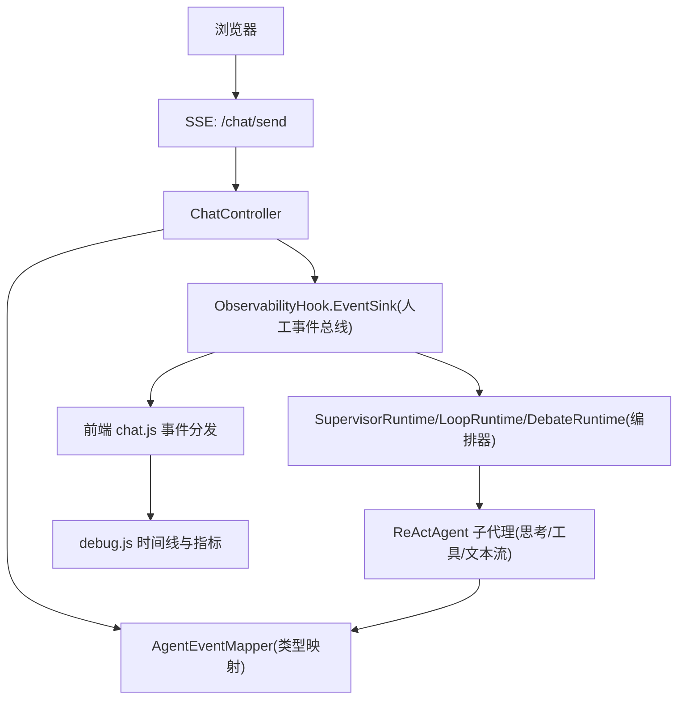
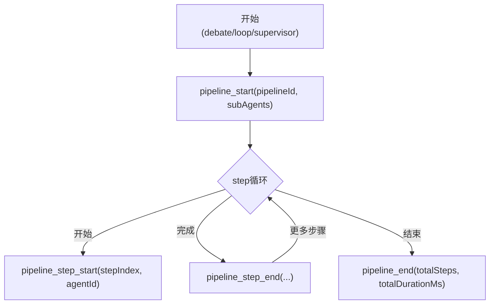
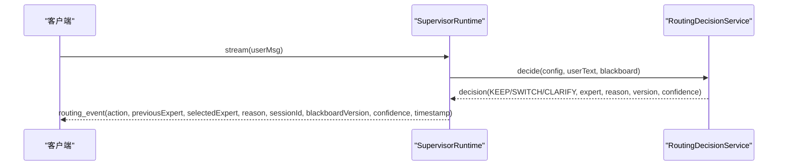
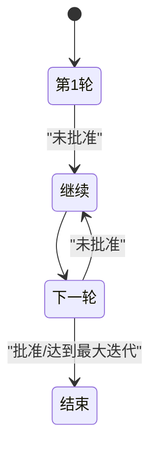
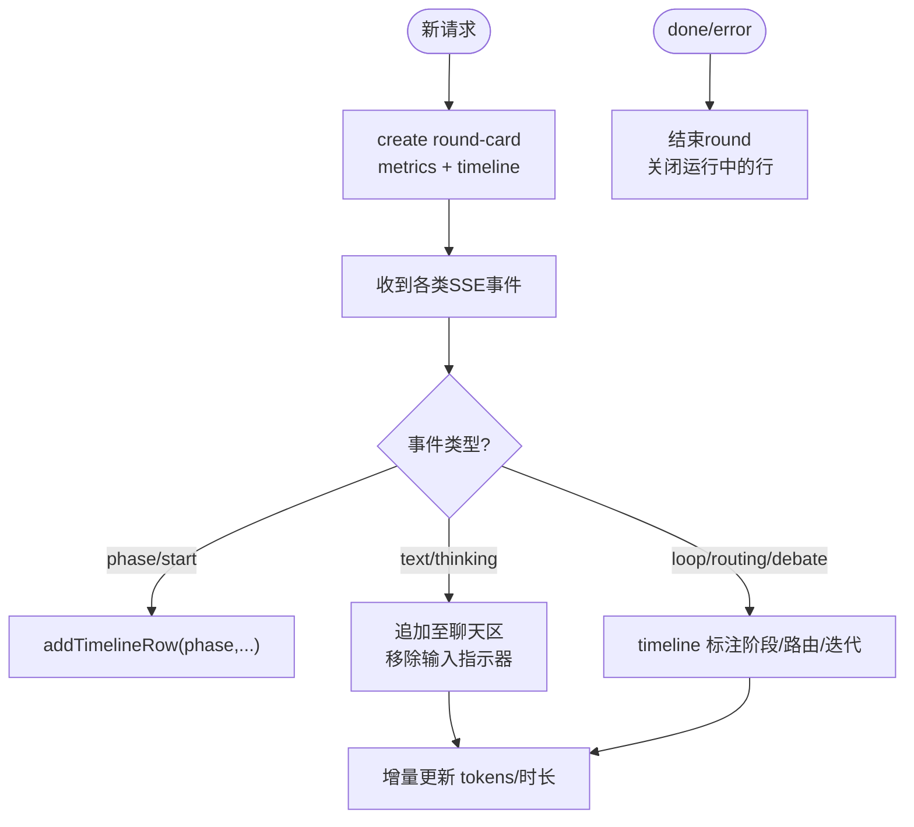

# 高级协作事件

<cite>
**本文引用的文件**
- [AgentEventMapper.java](file://src/main/java/com/skloda/agentscope/runtime/AgentEventMapper.java)
- [ObservabilityHook.java](file://src/main/java/com/skloda/agentscope/hook/ObservabilityHook.java)
- [MultiAgentStreamSupport.java](file://src/main/java/com/skloda/agentscope/runtime/MultiAgentStreamSupport.java)
- [SupervisorRuntime.java](file://src/main/java/com/skloda/agentscope/blackboard/SupervisorRuntime.java)
- [LoopRuntime.java](file://src/main/java/com/skloda/agentscope/runtime/LoopRuntime.java)
- [DebateRuntime.java](file://src/main/java/com/skloda/agentscope/runtime/DebateRuntime.java)
- [SessionBlackboard.java](file://src/main/java/com/skloda/agentscope/blackboard/SessionBlackboard.java)
- [RoutingDecisionService.java](file://src/main/java/com/skloda/agentscope/blackboard/RoutingDecisionService.java)
- [ChatController.java](file://src/main/java/com/skloda/agentscope/controller/ChatController.java)
- [chat.js](file://src/main/resources/static/scripts/chat.js)
- [debug.js](file://src/main/resources/static/scripts/modules/debug.js)
</cite>

## 目录
1. [简介](#简介)
2. [项目结构](#项目结构)
3. [核心组件](#核心组件)
4. [架构总览](#架构总览)
5. [详细组件分析](#详细组件分析)
6. [依赖关系分析](#依赖关系分析)
7. [性能与内存优化](#性能与内存优化)
8. [故障排查指南](#故障排查指南)
9. [测试用例设计与性能调优](#测试用例设计与性能调优)
10. [结论](#结论)

## 简介
本文面向高级协作场景，系统梳理多智能体事件在运行时如何产生、映射与在前端渲染：流水线执行、路由决策、专家分发、交接、循环迭代与辩论模式事件。重点解释它们对前端状态（当前 Agent 切换、工作流进度、结果聚合）的影响；详述调试面板的时间线渲染机制（phase 标记、timeline 行、状态颜色与折叠展开）；给出超大型对话的内存优化策略与测试设计方法，覆盖大数据量、长时运行和资源监控等关键指标。

## 项目结构
本仓库采用“后端运行时 + 可观测桥接 + 前端 SSE 消费”的分层设计：
- 运行时编排：SupervisorRuntime、LoopRuntime、DebateRuntime 等将多个 ReActAgent 组织成复杂执行图，并在执行中通过 EventSink 发布 pipeline/routing/handoff/loop/debate 事件。
- 事件映射：AgentEventMapper 统一将 AgentScope 2.0 的原生事件映射为 SSE JSON payload（含 type 字段），被前端直接消费。
- 前后端桥梁：ObservabilityHook 封装 EventSink 并提供 addConsumer 订阅；ChatController 将 Agent 原生流与 EventSink 合并后以 SSE 输出到浏览器。
- 前端交互：chat.js 作为 SSE 主处理器，将事件分发到各类 UI 处理函数；debug.js 维护 rounds/timeline/metrics 并实现折叠展开等交互。



图表来源
- [ChatController.java](file://src/main/java/com/skloda/agentscope/controller/ChatController.java)
- [AgentEventMapper.java](file://src/main/java/com/skloda/agentscope/runtime/AgentEventMapper.java)
- [ObservabilityHook.java](file://src/main/java/com/skloda/agentscope/hook/ObservabilityHook.java)
- [SupervisorRuntime.java](file://src/main/java/com/skloda/agentscope/blackboard/SupervisorRuntime.java)
- [LoopRuntime.java](file://src/main/java/com/skloda/agentscope/runtime/LoopRuntime.java)
- [DebateRuntime.java](file://src/main/java/com/skloda/agentscope/runtime/DebateRuntime.java)

章节来源
- [AgentEventMapper.java:64-104](file://src/main/java/com/skloda/agentscope/runtime/AgentEventMapper.java#L64-L104)
- [ObservabilityHook.java:22-67](file://src/main/java/com/skloda/agentscope/hook/ObservabilityHook.java#L22-L67)
- [ChatController.java:入口SSE处理](file://src/main/java/com/skloda/agentscope/controller/ChatController.java)

## 核心组件
- AgentEventMapper：将 AgentScope 2.0 的 AgentEvent 映射到前端可消费的 Map<String,Object> 事件对象，type 字段用于前端分支选择；屏蔽边界事件，错误路径返回 error 提示，避免中断流。
- ObservabilityHook：封装 EventSink，对外暴露 emitPipelineStart/emitPipelineStepStart/... 等方法，向下游统一发送人工构造的多智能体事件；支持订阅与完成（complete）。
- MultiAgentStreamSupport：抽象出 runSubAgent，使任何子代理的 streaming events（thinking/text/tool_call_delta 等）透明转发到上层 sink，并保留最终文本以便后续步骤使用。
- SupervisorRuntime：基于共享黑板（Shared Blackboard）的协调者。串行化路由、调度专家、应用补丁；对外发射 routing_event 与专家事件（过滤危险的前端事件如 agent_start/agent_end/agent_result_text）。
- LoopRuntime：写-审循环。每轮 writer→critic 均通过 streamEvents 透传，失败或达到最大迭代次数时确保有最佳内容可见；并发安全地结束流。
- DebateRuntime：多专家轮次辩论+裁判汇总。统一使用 MultiAgentStreamSupport 转发每个参与者的中间态与最终总结；结束时汇聚为 pipeline 完整序列。
- SessionBlackboard：跨专家会话状态容器，包含 activeExpert、currentIntent、收集事实、业务状态、专家发现项等；版本化且不可变快照保护。

章节来源
- [AgentEventMapper.java:39-104](file://src/main/java/com/skloda/agentscope/runtime/AgentEventMapper.java#L39-L104)
- [ObservabilityHook.java:11-67](file://src/main/java/com/skloda/agentscope/hook/ObservabilityHook.java#L11-L67)
- [MultiAgentStreamSupport.java:17-119](file://src/main/java/com/skloda/agentscope/runtime/MultiAgentStreamSupport.java#L17-L119)
- [SupervisorRuntime.java:29-156](file://src/main/java/com/skloda/agentscope/blackboard/SupervisorRuntime.java#L29-L156)
- [LoopRuntime.java:14-166](file://src/main/java/com/skloda/agentscope/runtime/LoopRuntime.java#L14-L166)
- [DebateRuntime.java:16-141](file://src/main/java/com/skloda/agentscope/runtime/DebateRuntime.java#L16-L141)
- [SessionBlackboard.java:15-200](file://src/main/java/com/skloda/agentscope/blackboard/SessionBlackboard.java#L15-L200)

## 架构总览
多智能体协作的关键事件由三类源头共同构成：
- AgentScope 原生事件（llm_start/llm_end/tool_call_start/tool_call_delta/tool_call_end/text/thinking 等）：经 AgentEventMapper 转换后进入 SSE。
- 人工构造的事件（pipeline_*、routing_event、handoff_*、loop_*、debate_*、expert_dispatch_*）：由运行时通过 ObservabilityHook.EventSink 发射。
- Supervisor 专有事件（supervisor_start/routing_event/blackboard_patched 等）：由 SupervisorRuntime 控制，用于流程跟踪与状态可视化。

```mermaid
sequenceDiagram
    participant FE as "前端"
    participant CC as "ChatController"
    participant OM as "ObservabilityHook.EventSink"
    participant SR as "SupervisorRuntime"
    participant RS as "RoutingDecisionService"
    participant MA as "MultiAgentStreamSupport"

    FE->>CC: POST /chat/send
    CC->>SR: stream(userMsg)
    SR->>RS: decide(userMsg, blackboard)
    RS-->>SR: RoutingDecision
    SR-->>CC: routing_event(action, expert, reason, version, timestamp)
    SR->>MA: runSubAgent(expert, msg, sourceLabel, sink)
    MA-->>CC: 转发所有子代理事件(text/tool/thinking/...)
    CC-->>FE: SSE event payloads
    Note over SR,RS: 若需交接则继续 handoff_* 事件; 若循环则 loop_*; 若辩论则 debate_*
```

图表来源
- [SupervisorRuntime.java:134-195](file://src/main/java/com/skloda/agentscope/blackboard/SupervisorRuntime.java#L134-L195)
- [RoutingDecisionService.java:48-160](file://src/main/java/com/skloda/agentscope/blackboard/RoutingDecisionService.java#L48-L160)
- [MultiAgentStreamSupport.java:59-119](file://src/main/java/com/skloda/agentscope/runtime/MultiAgentStreamSupport.java#L59-L119)
- [ObservabilityHook.java:45-67](file://src/main/java/com/skloda/agentscope/hook/ObservabilityHook.java#L45-L67)

## 详细组件分析

### 流水线执行事件 pipeline_*
- 触发点：DebateRuntime 在启动时广播 pipeline_start，并在汇总结束后 pipeline_end；LoopRuntime/SupervisorRuntime 也可按模式使用类似事件描述流程阶段。
- 数据模型：包含 pipelineId、subAgents 列表、步数、耗时等；frontend 据此创建 phase 与进度条。
- 渲染影响：创建“流水线阶段卡片”，为每一步生成 timeline 行；结束时更新成功/错误状态。



图表来源
- [DebateRuntime.java:44-106](file://src/main/java/com/skloda/agentscope/runtime/DebateRuntime.java#L44-L106)
- [ObservabilityHook.java:45-48](file://src/main/java/com/skloda/agentscope/hook/ObservabilityHook.java#L45-L48)

章节来源
- [DebateRuntime.java:44-106](file://src/main/java/com/skloda/agentscope/runtime/DebateRuntime.java#L44-L106)
- [ObservabilityHook.java:45-48](file://src/main/java/com/skloda/agentscope/hook/ObservabilityHook.java#L45-L48)

### 路由决策事件 routing_event
- 触发点：SupervisorRuntime 在每次收到用户消息后计算路由决策，发出 routing_event，携带 action(previousExpert, selectedExpert, reason)、sessionId、blackboardVersion、timestamp 与 confidence。
- 状态联动：改变 activeExpert、决定下一跳目标专家；若 CLARIFY 则不派发专家调用，而回显澄清问题。
- 黑板同步：blackboard_version 反映当前版本，避免脏读/覆盖；事件中也带上该版本供前端展示上下文一致性。



图表来源
- [SupervisorRuntime.java:134-195](file://src/main/java/com/skloda/agentscope/blackboard/SupervisorRuntime.java#L134-L195)
- [RoutingDecisionService.java:48-160](file://src/main/java/com/skloda/agentscope/blackboard/RoutingDecisionService.java#L48-L160)

章节来源
- [SupervisorRuntime.java:134-195](file://src/main/java/com/skloda/agentscope/blackboard/SupervisorRuntime.java#L134-L195)
- [RoutingDecisionService.java:48-160](file://src/main/java/com/skloda/agentscope/blackboard/RoutingDecisionService.java#L48-L160)
- [SessionBlackboard.java:40-160](file://src/main/java/com/skloda/agentscope/blackboard/SessionBlackboard.java#L40-L160)

### 专家分发事件 expert_dispatch_*
- 触发点：SupervisorRuntime 在路由后根据决策分派专家实例，并通过 EventSink 发射 expert_dispatch_start/end 及 blackboard_patched 等事件，辅助 UI 呈现“专家接力”。
- 行为约束：为避免重复渲染和提前关闭 round，SupervisorRuntime 会过滤掉某些敏感事件类型（如 agent_start/agent_end/agent_result_text），只转发必要的结构化结果与元信息。
- 状态变更：blackboard_patched 携带新增事实/意图/问题列表等信息；UI 可在侧边栏同步显示“黑板”变化。

章节来源
- [SupervisorRuntime.java:60-89](file://src/main/java/com/skloda/agentscope/blackboard/SupervisorRuntime.java#L60-L89)
- [SupervisorRuntime.java:134-195](file://src/main/java/com/skloda/agentscope/blackboard/SupervisorRuntime.java#L134-L195)

### 交接事件 handoff_*
- 触发点：当路由决策为 SWITCH 或专家内部决定换人时，SupervisorRuntime/Orchestrator 发出 handoff_start/handoff_complete，标明 from/to/reason。
- 渲染效果：UI 用不同的 connector/icon 区分交接行为，并在 timeline 上插入带状态的交接行；activeAgent 切换，便于定位“谁在处理下一步”。

章节来源
- [ObservabilityHook.java:51-52](file://src/main/java/com/skloda/agentscope/hook/ObservabilityHook.java#L51-L52)
- [SupervisorRuntime.java:134-195](file://src/main/java/com/skloda/agentscope/blackboard/SupervisorRuntime.java#L134-L195)

### 循环迭代事件 loop_*
- 触发点：LoopRuntime 每轮 writer 产出与 critic 审核完毕即发 loop_iteration_result；在结束处发出 loop_end（totalIterations, approved）。
- 鲁棒性：即使达到最大迭代但未获批，也会输出最后一版 Writer 结果给前端可见。
- 状态推进：approved 布尔值驱动是否提前终止；UI 以折叠卡片展现每轮的 feedback 与最终结论。



图表来源
- [LoopRuntime.java:52-166](file://src/main/java/com/skloda/agentscope/runtime/LoopRuntime.java#L52-L166)

章节来源
- [LoopRuntime.java:52-166](file://src/main/java/com/skloda/agentscope/runtime/LoopRuntime.java#L52-L166)

### 辩论模式事件 debate_*
- 触发点：DebateRuntime 每轮为每个专家构造上下文，收集论据；最后由 judge 做综合总结，发射 round_message、roundtable_summary，并以 pipeline_* 收尾。
- 用户体验：每个专家发言都以独立的 timeline 行展示，结尾汇总高亮；适合“多角度评估”的场景（如合同评审、策略对比）。

章节来源
- [DebateRuntime.java:44-106](file://src/main/java/com/skloda/agentscope/runtime/DebateRuntime.java#L44-L106)

### 调试面板时间与渲染机制（phase/行/颜色/折叠）
- Round 管理：每次请求创建一个 round-card，内含 metrics 与 timeline 容器；startRound/endRound 负责生命周期。
- Timeline 行：addTimelineRow/addTimelineRowForRound 创建 row，设置类名 type-* 与可选 status-*；connector/icon/label/metrics/status 通过 CSS 渲染差异。
- 颜色编码：running → status-running；ok → status-ok；error → status-error；UI 通过 class 切换样式。
- 折叠展开：metrics-details 默认 collapsed，点击开关 toggleRoundMetrics；body 也支持折叠/展开，提升可读性。
- 首字节视觉优化：chat.js 移除输入指示器的逻辑仅在真正可见的内容事件（thinking/text/tool_start/done/error/pending_approval）触发，避免“空白期”。



图表来源
- [debug.js:5-199](file://src/main/resources/static/scripts/modules/debug.js#L5-L199)
- [chat.js:129-180](file://src/main/resources/static/scripts/chat.js#L129-L180)

章节来源
- [debug.js:5-199](file://src/main/resources/static/scripts/modules/debug.js#L5-L199)
- [chat.js:129-180](file://src/main/resources/static/scripts/chat.js#L129-L180)

## 依赖关系分析
- 耦合度
  - SupervisorRuntime 强依赖 RoutingDecisionService 与 BlackboardService，保证“唯一写入者”语义（通过 per-session 锁）。
  - MultiAgentStreamSupport 是横切能力，被多个 Runtime（Supervisor/Loop/Debate）复用，降低复制代码导致的漂移。
  - AgentEventMapper 被多处复用，保持前后端契约稳定。
- 直接依赖链
  - ChatController → 事件流合并 → AgentEventMapper/ObservabilityHook
  - SupervisorRuntime → RoutingDecisionService + BlackboardService + ObservabilityHook
  - LoopRuntime/DebateRuntime → ObservabilityHook + MultiAgentStreamSupport
- 循环依赖风险：无显式循环；黑板读写通过 Service 与 StateStore SPI，解耦持久化。

章节来源
- [SupervisorRuntime.java:60-127](file://src/main/java/com/skloda/agentscope/blackboard/SupervisorRuntime.java#L60-L127)
- [MultiAgentStreamSupport.java:17-39](file://src/main/java/com/skloda/agentscope/runtime/MultiAgentStreamSupport.java#L17-L39)
- [ObservabilityHook.java:11-39](file://src/main/java/com/skloda/agentscope/hook/ObservabilityHook.java#L11-L39)

## 性能与内存优化
针对超大对话与长时间运行的协作场景：
- 旧消息清理（前端）
  - 限制每页历史消息数量，滚动加载时裁剪 DOM；对长时间对话定期回收非活跃消息 DOM 引用。
- 定时器清理
  - 为每条 timeline 行与计时节点存储定时器句柄，在 endRound/页面卸载时统一 clearInterval/clearTimeout，避免悬挂定时任务。
- 事件监听器管理
  - SSE reader.abort() 在取消或错误路径及时释放网络流；removeEventListener/onclose 清理事件回调；防止内存泄漏。
- 后端事件节流
  - EventSink 背压：利用 Reactor FluxSink 的容量与 backpressure，必要时降采样高频 delta（例如 tool_call_delta）。
- 大对象缓存与共享
  - 复用 AgentEventMapper 实例；复用 ObservabilityHook；减少字符串拼接的中间对象。
- LLM/Tool 调用成本治理
  - LoopRuntime 限制 maxIterations，并尽早判定 Approved；DebateRuntime 限制 rounds/experts 规模。
- 资源监控
  - 结合 MetricsCollectorMiddleware 采集 QPS、P95、Token/Tool 耗时；对接 OTel 链路追踪关联 SSE 与 debug panel 条目。

[本节提供通用建议，无需具体代码引用]

## 故障排查指南
- 常见问题
  - 前段未收到 routing_event：确认 SupervisorRuntime 已正确发射并且未被阻塞；检查 EventSink 是否完成。
  - 循环无最终输出：核查 LoopRuntime 的最大迭代退出分支是否正确输出了 lastWriterOutput。
  - 讨论模式卡住：检查 DebateRuntime 内 for-loop 的 Mono 链是否被正常 resolve；确认 doFinally/close 执行。
  - timeline 行缺失：确认 debug.js 中的 addTimelineRowForRound 是否能命中对应 container；验证前端 type 分支匹配。
- 日志与定位
  - 查看 AgentEventMapper.apply 的错误分支，是否捕获并重定向为 error 事件。
  - 在 SupervisorRuntime 中检查路由决策耗时与异常路径；打印 blackboardVersion 一致性。
  - 前端 console 保留 SSE 载荷日志（如 tool_start/end），对照后端事件类型。

章节来源
- [AgentEventMapper.java:64-104](file://src/main/java/com/skloda/agentscope/runtime/AgentEventMapper.java#L64-L104)
- [LoopRuntime.java:118-135](file://src/main/java/com/skloda/agentscope/runtime/LoopRuntime.java#L118-L135)
- [DebateRuntime.java:79-106](file://src/main/java/com/skloda/agentscope/runtime/DebateRuntime.java#L79-L106)
- [debug.js:174-199](file://src/main/resources/static/scripts/modules/debug.js#L174-L199)

## 测试用例设计与性能调优
- 单元测试（后端）
  - AgentEventMapper：覆盖所有 30+ 事件类型的映射与错误分支；验证非法/null 输入的行为。
  - RoutingDecisionService：规则与 LLM 策略下的多种 case（explicit/intent/no match/first turn）断言 action/expert/reason/version。
  - LoopRuntime：审批通过路径、达到最大迭代路径、异常恢复路径；断言 text 最终输出与 loop_end 参数。
  - DebateRuntime：多轮回合事件顺序与 final summary；错误恢复确保 done。
  - SupervisorRuntime：并发安全（per-session lock）、blackboard 版本一致性、专家隔离。
  - ObservabilityHook：EventSink 订阅、发射与完成语义；asFlux 流终止。
- 集成测试（端到端）
  - 从 POST /chat/send 到前端收到完整 pipeline/routing/loop/debate 事件序列，校验 order 与终态 done。
  - 注入大 token/长对话压力：验证内存峰值、GC 频率与 CPU 占用；评估是否需要启用压缩或限流。
- 性能调优
  - SSE 吞吐：增大后端线程池与背压水位；前端合理 chunk 解析与防抖渲染。
  - 事件粒度：对 tool_call_delta、text delta 做采样阈值，降低 UI 刷新开销。
  - 资源配额：maxIterations、rounds、expert 数量、工具超时；开启限流/熔断。
  - 可观测性：OTel 贯穿 SSE 与 debug panel 条目；指标接入 Prometheus/Grafana 进行长期观察。

[本节为方法论与实践建议，不直接引用具体代码片段]

## 结论
本项目通过 AgentEventMapper + ObservabilityHook + 多运行时编排构建了完整的高级协作事件体系：既可支撑流水线、路由、交接、循环与辩论等多模式组合，又在前端提供了稳定的 timeline、度量与可视化交互。通过对 SessionBlackboard 的版本化管理、严格的运行时边界与事件收敛，系统在可扩展性与可观测性之间取得了良好平衡。面向更大规模与更长时间的协作任务，建议在前后端两端引入事件节流、消息回收、背压控制与完善监控，以获得更稳健的线上表现。