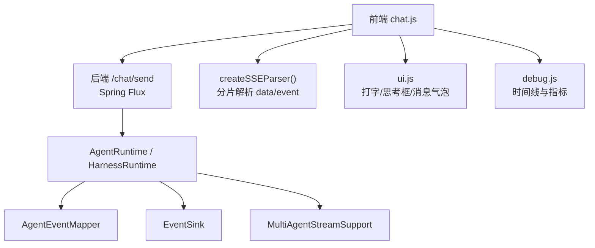
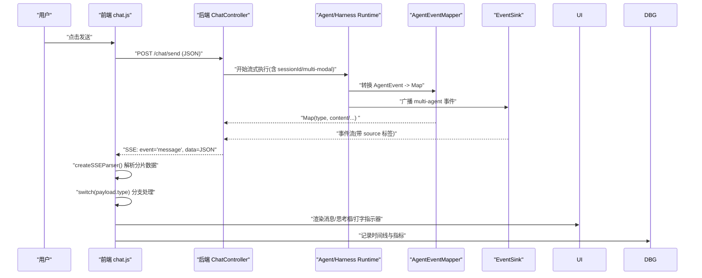
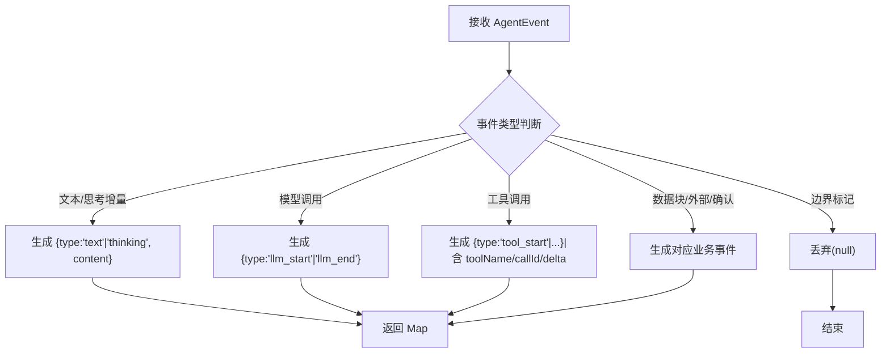
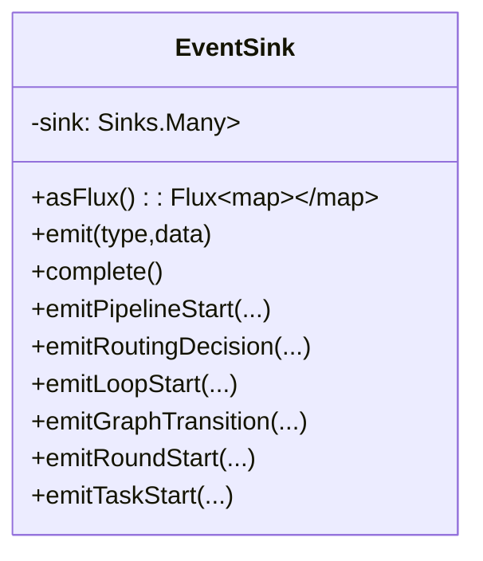
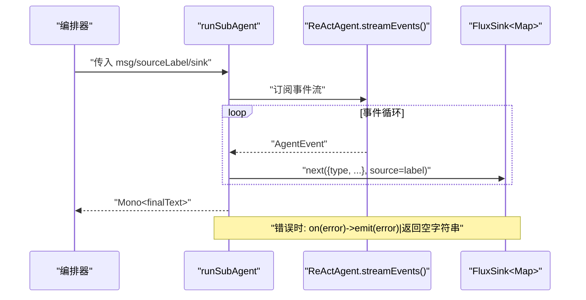
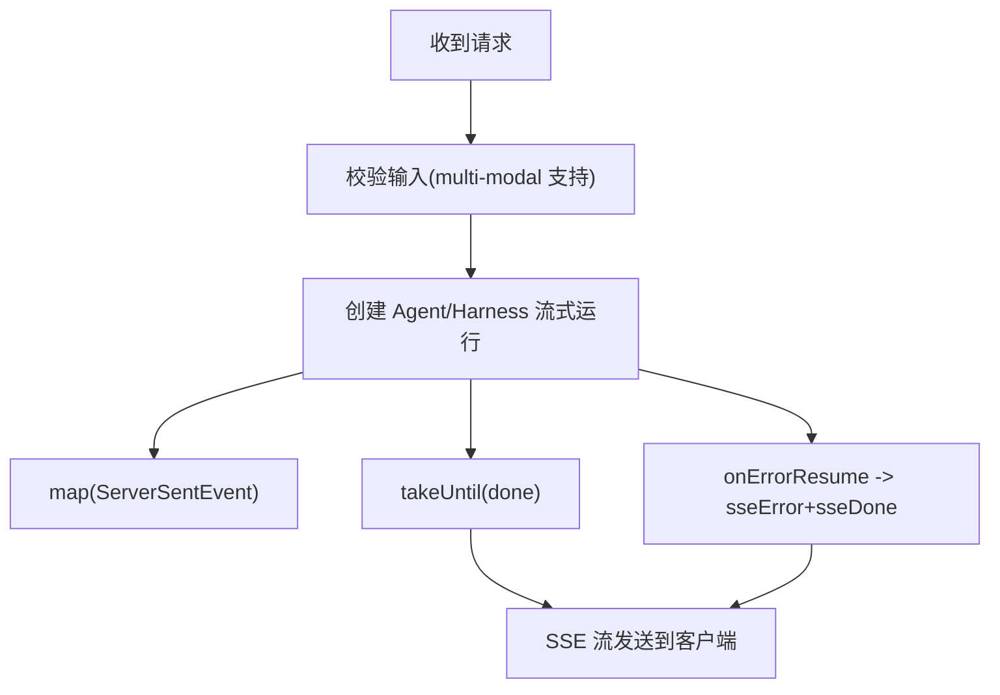
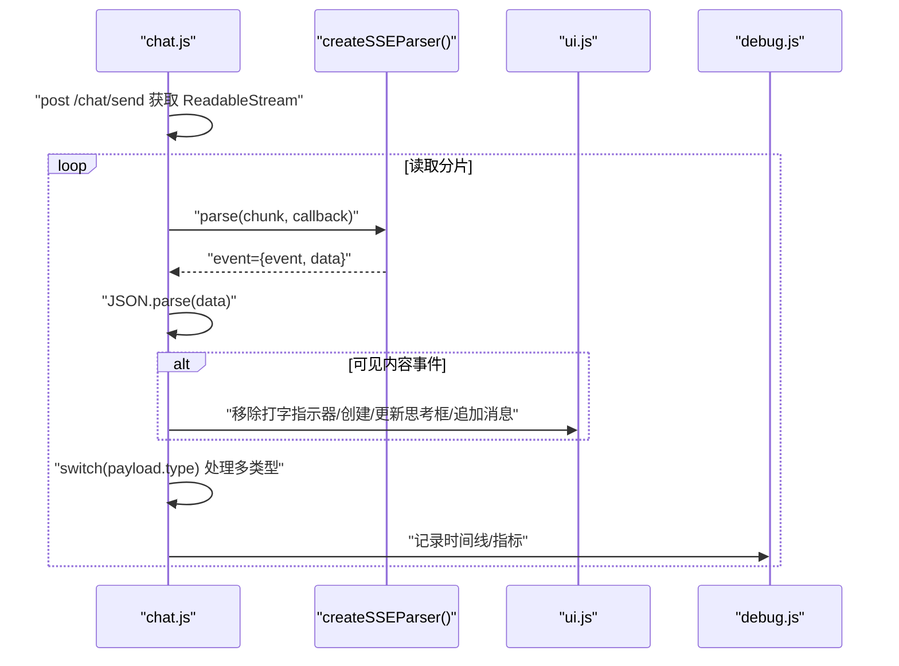
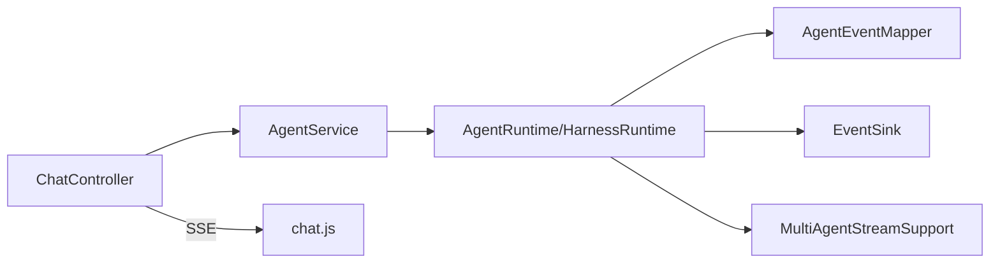

# 实时通信机制

<cite>
**本文档引用的文件**
- [ChatController.java](file://src/main/java/com/skloda/agentscope/controller/ChatController.java)
- [StreamingAgentRuntime.java](file://src/main/java/com/skloda/agentscope/runtime/StreamingAgentRuntime.java)
- [MultiAgentStreamSupport.java](file://src/main/java/com/skloda/agentscope/runtime/MultiAgentStreamSupport.java)
- [EventSink.java](file://src/main/java/com/skloda/agentscope/runtime/EventSink.java)
- [AgentEventMapper.java](file://src/main/java/com/skloda/agentscope/runtime/AgentEventMapper.java)
- [ChatEvent.java](file://src/main/java/com/skloda/agentscope/model/ChatEvent.java)
- [chat.js](file://src/main/resources/static/scripts/chat.js)
- [session.js](file://src/main/resources/static/scripts/modules/session.js)
- [api.js](file://src/main/resources/static/scripts/api.js)
- [ui.js](file://src/main/resources/static/scripts/modules/ui.js)
- [debug.js](file://src/main/resources/static/scripts/modules/debug.js)
</cite>

## 目录
1. [简介](#简介)
2. [项目结构](#项目结构)
3. [核心组件](#核心组件)
4. [架构总览](#架构总览)
5. [详细组件分析](#详细组件分析)
6. [依赖关系分析](#依赖关系分析)
7. [性能与可靠性](#性能与可靠性)
8. [故障排查指南](#故障排查指南)
9. [结论](#结论)
10. [附录](#附录)（如有）

## 简介
本技术文档聚焦于该仓库中的“基于 Server-Sent Events (SSE) 的实时通信机制”。内容包括：
- SSE 客户端实现（连接建立、消息解析、错误处理、断开后的自动重连策略建议）
- createSSEParser() 的事件流处理能力，以及对 30+ 种事件类型的映射与渲染
- 实时消息渲染生命周期（打字指示器显隐、思考框动态创建/更新、流式内容增量更新）
- 网络异常处理、连接超时管理、内存泄漏防护
- 调试工具使用方法与常见问题排查
- 与 WebSocket 对比分析及迁移建议

本仓库的后端基于 Spring WebFlux 提供 `Flux<ServerSentEvent<String>>`，前端使用原生 `fetch` + `ReadableStream` 配合自实现的 createSSEParser() 完成分片 SSE 解析，并通过 switch-case 分支将 30+ 后端事件驱动 UI。

## 项目结构
- 后端暴露 `/chat/send` SSE 接口，将 AgentScope agent 的流式事件与多智能体编排事件统一推送给前端
- 前端 chat.js 维护会话级状态、发起请求、流式消费事件、调用 UI/DOM 更新渲染，并结合 modules/ 下的 ui.js、debug.js 等模块进行可视化呈现
- 运行时中间层由 EventSink、AgentEventMapper、MultiAgentStreamSupport 组成，将底层框架的细粒度事件标准化为前端可消费的 JSON 事件对象

图表来源
- [ChatController.java:117-153](file://src/main/java/com/skloda/agentscope/controller/ChatController.java#L117-L153)
- [agent_event_mapper_source.md:56-105](file://src/main/java/com/skloda/agentscope/runtime/AgentEventMapper.java#L56-L105)
- [event_sink_source.md:15-62](file://src/main/java/com/skloda/agentscope/runtime/EventSink.java#L15-L62)
- [multi_agent_stream_support.md:74-118](file://src/main/java/com/skloda/agentscope/runtime/MultiAgentStreamSupport.java#L74-L118)
- [chat_js.md:24-178](file://src/main/resources/static/scripts/chat.js#L24-L178)

章节来源
- [ChatController.java:117-186](file://src/main/java/com/skloda/agentscope/controller/ChatController.java#L117-L186)
- [chat.js:24-178](file://src/main/resources/static/scripts/chat.js#L24-L178)

## 核心组件
- 控制器与响应封装：ChatController 将后端事件序列化为标准 SSE 负载；统一 done/error 语义
- 运行时抽象：StreamingAgentRuntime 定义统一的流式接口
- 事件转换器：AgentEventMapper 将 AgentScope 2.0 的 30+ AgentEvent 类型映射为标准 JSON 载荷（type 字段驱动前端 switch）
- 多智能体事件总线：EventSink 以 Reactor Sinks.Many 广播 pipeline/routing/handoff/loop/graph/roundtable/task 等多类事件
- 子代理流式桥接：MultiAgentStreamSupport.runSubAgent 转发 sub-agent 的生命周期/文本/工具调用并聚合最终结果
- 前端 SSE 客户端：createSSEParser() 做增量解析，chat.js 负责 UI 更新、思考框管理与调试面板联动
- UI/调试：ui.js 管理消息气泡、思考框与打字指示器；debug.js 维护 round 卡片、时间线与指标

章节来源
- [ChatController.java:79-113](file://src/main/java/com/skloda/agentscope/controller/ChatController.java#L79-L113)
- [StreamingAgentRuntime.java:9-20](file://src/main/java/com/skloda/agentscope/runtime/StreamingAgentRuntime.java#L9-L20)
- [AgentEventMapper.java:39-105](file://src/main/java/com/skloda/agentscope/runtime/AgentEventMapper.java#L39-L105)
- [EventSink.java:15-62](file://src/main/java/com/skloda/agentscope/runtime/EventSink.java#L15-L62)
- [MultiAgentStreamSupport.java:17-39](file://src/main/java/com/skloda/agentscope/runtime/MultiAgentStreamSupport.java#L17-L39)
- [api.js:1-25](file://src/main/resources/static/scripts/api.js#L1-L25)
- [ui.js:15-181](file://src/main/resources/static/scripts/modules/ui.js#L15-L181)
- [debug.js:5-177](file://src/main/resources/static/scripts/modules/debug.js#L5-L177)

## 架构总览
后端通过 Reactive Streams 产生事件，前端以 ReadableStream + 自研 SSE 解析器消费事件，并将事件分发到对应处理器，驱动渲染与调试信息。

图表来源
- [ChatController.java:122-153](file://src/main/java/com/skloda/agentscope/controller/ChatController.java#L122-L153)
- [AgentEventMapper.java:64-105](file://src/main/java/com/skloda/agentscope/runtime/AgentEventMapper.java#L64-L105)
- [EventSink.java:21-62](file://src/main/java/com/skloda/agentscope/runtime/EventSink.java#L21-L62)
- [api.js:1-25](file://src/main/resources/static/scripts/api.js#L1-L25)
- [chat.js:78-178](file://src/main/resources/static/scripts/chat.js#L78-L178)

章节来源
- [ChatController.java:122-186](file://src/main/java/com/skloda/agentscope/controller/ChatController.java#L122-L186)
- [chat.js:78-178](file://src/main/resources/static/scripts/chat.js#L78-L178)

## 详细组件分析

### SSE 事件转换与 30+ 事件类型映射（AgentEventMapper）
- 职责：将 AgentScope 2.0 的 AgentEvent 转换为前端可消费的 JSON 对象，保留 type 字段用于前端分流
- 覆盖事件：text/thinking delta、model 调用起止、tool 调用/结果、data block、外部执行/确认、提示块、全拒绝、自定义事件、超迭代、结束/请求停止等
- 设计要点：对边界型事件（如 TEXT_BLOCK_START/END 等）返回 null 不落地 SSE；错误时降级为 error 事件而非抛异常

图表来源
- [AgentEventMapper.java:64-105](file://src/main/java/com/skloda/agentscope/runtime/AgentEventMapper.java#L64-L105)
- [AgentEventMapper.java:109-200](file://src/main/java/com/skloda/agentscope/runtime/AgentEventMapper.java#L109-L200)

章节来源
- [AgentEventMapper.java:39-200](file://src/main/java/com/skloda/agentscope/runtime/AgentEventMapper.java#L39-L200)

### 多智能体事件总线（EventSink）
- 职责：以 Flux 广播形式提供 pipeline/routing/handoff/loop/debate/graph/roundtable/task 等多维度事件
- 特点：每个事件携带 timestamp、source/pipelineId/iteration 等业务维度键；支持 typed emit 方法提升可读性
- 与 SSE：事件经 Agent/Harness 运行时合并进同一 Flux，最终由控制器输出为 SSE

图表来源
- [EventSink.java:15-62](file://src/main/java/com/skloda/agentscope/runtime/EventSink.java#L15-L62)
- [EventSink.java:64-151](file://src/main/java/com/skloda/agentscope/runtime/EventSink.java#L64-L151)

章节来源
- [EventSink.java:15-151](file://src/main/java/com/skloda/agentscope/runtime/EventSink.java#L15-L151)

### 子代理流式桥接（MultiAgentStreamSupport.runSubAgent）
- 作用：以同步方式链式编排多个 agent/stream，转发每步事件至 sink，并以 Mono 返回最终文本
- 策略：优先采用 AGENT_RESULT 的结果；否则回退到累积 text delta
- 错误处理：捕获错误并通过 onError 回调；向 sink 发出 error 事件以保证前端可见

图表来源
- [MultiAgentStreamSupport.java:74-118](file://src/main/java/com/skloda/agentscope/runtime/MultiAgentStreamSupport.java#L74-L118)

章节来源
- [MultiAgentStreamSupport.java:17-118](file://src/main/java/com/skloda/agentscope/runtime/MultiAgentStreamSupport.java#L17-L118)

### 后端 SSE 输出（ChatController）
- 入口：POST /chat/send，返回 Flux<ServerSentEvent<String>>
- 序列化：统一封装为 {type, message, content}，done/error 固定 payload
- 容错：takeUntil 遇到 done 即关闭流；onErrorResume 捕获异常输出 error 后 close

图表来源
- [ChatController.java:122-153](file://src/main/java/com/skloda/agentscope/controller/ChatController.java#L122-L153)
- [ChatEvent.java:21-35](file://src/main/java/com/skloda/agentscope/model/ChatEvent.java#L21-L35)

章节来源
- [ChatController.java:79-186](file://src/main/java/com/skloda/agentscope/controller/ChatController.java#L79-L186)
- [ChatEvent.java:9-35](file://src/main/java/com/skloda/agentscope/model/ChatEvent.java#L9-L35)

### 前端 SSE 客户端与事件渲染（chat.js + api.js）
- createSSEParser()：按行解析 data:/event: 以及空行作为事件结束分隔；支持跨 chunk 缓冲
- 连接与消费：fetch('/chat/send') + response.body.getReader()，逐块解码送入 parser
- 打字指示器：首次渲染可见内容（thinking/reasoning_text/text/tool_start/done/error/pending_approval）时清除
- 事件分发：根据 payload.type 在 switch 中路由到不同 UI/Debug 操作
- 断网/错误：HTTP 非 2xx 立即显示错误并结束轮次；可配合 AbortController 中止

图表来源
- [api.js:1-25](file://src/main/resources/static/scripts/api.js#L1-L25)
- [chat.js:106-178](file://src/main/resources/static/scripts/chat.js#L106-L178)

章节来源
- [api.js:1-25](file://src/main/resources/static/scripts/api.js#L1-L25)
- [chat.js:24-178](file://src/main/resources/static/scripts/chat.js#L24-L178)

### 实时消息渲染生命周期（ui.js）
- 打字指示器：首次进入发送流程置位，首个“可见内容”事件清除
- 思考框：根据 enableThinking 及文件上传情况动态创建；updateThinkingBox 累计 thinking 内容并滚动到底部；支持折叠/历史恢复
- 消息气泡：appendMessage 统一处理用户/助手消息、媒体附件、Markdown 渲染

章节来源
- [chat.js:61-77](file://src/main/resources/static/scripts/chat.js#L61-L77)
- [chat.js:164-176](file://src/main/resources/static/scripts/chat.js#L164-L176)
- [ui.js:15-181](file://src/main/resources/static/scripts/modules/ui.js#L15-L181)

### 调试与可观测性（debug.js）
- Round 管理：startRound/endRound/completeRoundTrace 管理单轮生命期
- 时间线与指标：addTimelineRow/ForRound 将 pipeline/stage/tool/llm/思考等行为绘制为时间线；计算 token/速度/耗时

章节来源
- [debug.js:5-177](file://src/main/resources/static/scripts/modules/debug.js#L5-L177)

## 依赖关系分析
- 控制器依赖运行时：ChatController → AgentService → Agent/Harness Runtime → AgentEventMapper / EventSink
- 多智能体协作：Sequential/Parallel/Debate/Loop/StateGraph 均复用 MultiAgentStreamSupport 和 EventSink
- 前后端契约：type 字段是关键契约；前端大量 switch 分支与后端 30+ 事件一一对应

图表来源
- [ChatController.java:122-153](file://src/main/java/com/skloda/agentscope/controller/ChatController.java#L122-L153)
- [StreamingAgentRuntime.java:9-20](file://src/main/java/com/skloda/agentscope/runtime/StreamingAgentRuntime.java#L9-L20)
- [MultiAgentStreamSupport.java:74-118](file://src/main/java/com/skloda/agentscope/runtime/MultiAgentStreamSupport.java#L74-L118)

章节来源
- [ChatController.java:117-186](file://src/main/java/com/skloda/agentscope/controller/ChatController.java#L117-L186)

## 性能与可靠性
- 背压与缓冲
  - EventSink 使用 onBackpressureBuffer 缓存事件，避免突发流量导致丢消息；但需结合上游速率限制控制内存峰值
  - 前端 parser 基于缓冲区和分片解析，减少大 JSON 阻塞渲染
- 内存泄漏防护
  - 聊天窗口清理：clearSession/switchAgent 会清空当前思考框、DOM 引用与 rounds 列表，避免长时间页面常驻造成的引用滞留
  - 流式消费：使用 abortController.signal 支持取消请求并退出循环，避免悬挂 reader.read() 造成内存占用
- 可用性
  - 后端 takeUntil("done") 保证流正常关闭；onErrorResume 兜底 error + done，确保前端一定看到终态
  - 前端对 HTTP 非 2xx 即时报错并结束轮次

章节来源
- [session.js:72-147](file://src/main/resources/static/scripts/modules/session.js#L72-L147)
- [chat.js:113-119](file://src/main/resources/static/scripts/chat.js#L113-L119)
- [EventSink.java:19-37](file://src/main/java/com/skloda/agentscope/runtime/EventSink.java#L19-L37)
- [ChatController.java:146-153](file://src/main/java/com/skloda/agentscope/controller/ChatController.java#L146-L153)

## 故障排查指南
- SSE 数据解析失败
  - 现象：控制台打印 parse 失败；可能由于后端序列化异常或网络分片切错
  - 检查：查看 ChatController 的异常日志；确认 payload 是否为合法 JSON
  - 参考：[chat.js:137-145](file://src/main/resources/static/scripts/chat.js#L137-L145)
- 打字指示器不消失
  - 现象：一直展示三点动画
  - 触发条件：首次可见内容事件未到达；检查事件分支是否有 thinking/text/tool_start 等
  - 参考：[chat.js:152-176](file://src/main/resources/static/scripts/chat.js#L152-L176)
- 思考框不出现或内容不更新
  - 现象：无“思考”折叠框或内容静止
  - 检查：是否开启 enableThinking；确认 incoming 类型为 reasoning_text/thinking，且 updateThinkingBox 被调用
  - 参考：[chat.js:71-76](file://src/main/resources/static/scripts/chat.js#L71-L76)，[ui.js:183-196](file://src/main/resources/static/scripts/modules/ui.js#L183-L196)
- 多智能体时间线不完整
  - 现象：pipeline/loop/handoff 步骤缺失
  - 检查：EventSink 的 emit 是否在相应运行时调用；debug.js 的 timeline row 是否被追加
  - 参考：[EventSink.java:64-151](file://src/main/java/com/skloda/agentscope/runtime/EventSink.java#L64-L151)，[debug.js:174-177](file://src/main/resources/static/scripts/modules/debug.js#L174-L177)
- 流未结束（hung）
  - 现象：界面一直加载
  - 排查：是否收到 done；若异常，是否落入 onErrorResume；前端是否因中断而未清理 isStreaming
  - 修复：确保控制器 always 发出 done；必要时前端增加超时重试/重置逻辑
  - 参考：[ChatController.java:146-153](file://src/main/java/com/skloda/agentscope/controller/ChatController.java#L146-L153)，[session.js:99-113](file://src/main/resources/static/scripts/modules/session.js#L99-L113)

章节来源
- [chat.js:113-176](file://src/main/resources/static/scripts/chat.js#L113-L176)
- [ui.js:183-196](file://src/main/resources/static/scripts/modules/ui.js#L183-L196)
- [EventSink.java:64-151](file://src/main/java/com/skloda/agentscope/runtime/EventSink.java#L64-L151)
- [debug.js:174-177](file://src/main/resources/static/scripts/modules/debug.js#L174-L177)
- [session.js:99-113](file://src/main/resources/static/scripts/modules/session.js#L99-L113)
- [ChatController.java:146-153](file://src/main/java/com/skloda/agentscope/controller/ChatController.java#L146-L153)

## 结论
本项目实现了完整的“后端事件驱动 + 前端流式渲染”的实时通信链路：后端使用 Spring WebFlux 提供稳定、高效的 SSE 管道，中间通过 AgentEventMapper 和 EventSink 将底层细粒度事件规范化为统一的 JSON 事件；前端通过轻量级的 createSSEParser() 与模块化 UI/调试逻辑，完成 30+ 事件的精细渲染与可观测性展示。整体架构解耦良好、扩展性强，适合多智能体协作与复杂人机协同场景的实时交互。

## 附录

### 与 WebSocket 的对比与建议
- 传输模型
  - SSE：单向（服务器→客户端），天然幂等、便于缓存与代理；本项目已充分实现并验证稳定性
  - WebSocket：双向长连接，适合高频互传、需要客户端主动下发指令的场景
- 迁移建议
  - 若无需高并发双向交互，保持 SSE 即可降低复杂度
  - 如需强一致的状态回写、游戏/实时对战类场景，可考虑逐步引入 WebSocket（建议保留 SSE 兼容通道）
  - 若迁移至 WebSocket，建议沿用现有事件类型与载荷结构（type/content/source），平滑兼容前端分支逻辑

[本节为概念性说明，不直接分析具体文件]

### 自动重连策略（建议在客户端补充）
- 触发条件：网络异常、SSE 连接中断、连续读空等
- 策略建议：指数退避重试 + 最大重试次数；保留 lastCursor（如最后收到的 done 或 messageId），以便断点续推（需后端配合）
- 资源清理：重连前务必释放 AbortController、reader 与 DOM 定时器，避免内存泄漏

[本节为实现建议，不直接分析具体文件]