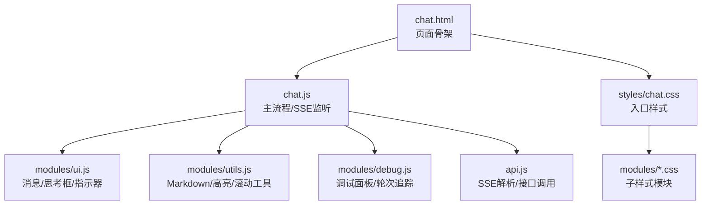
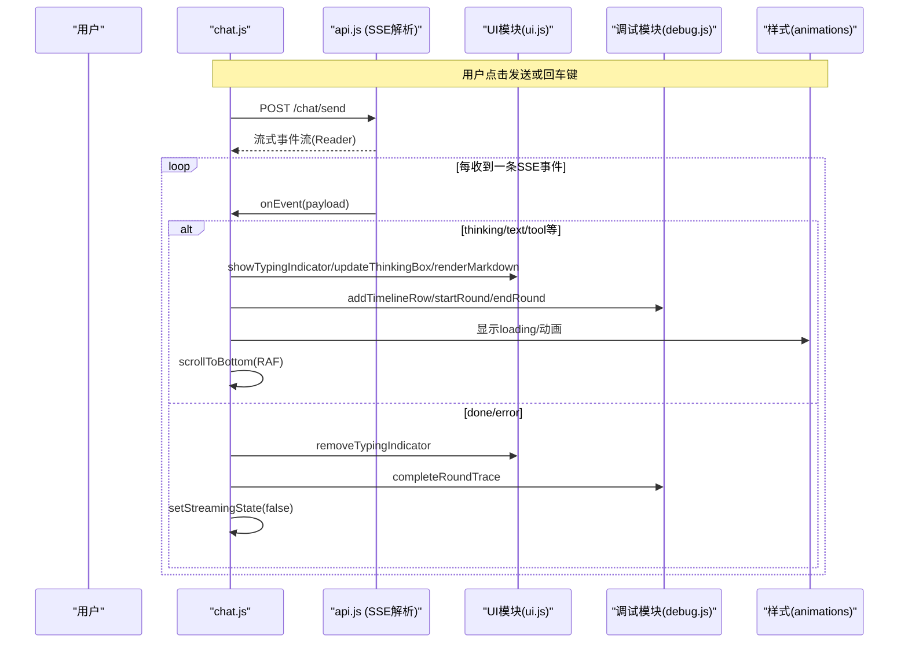
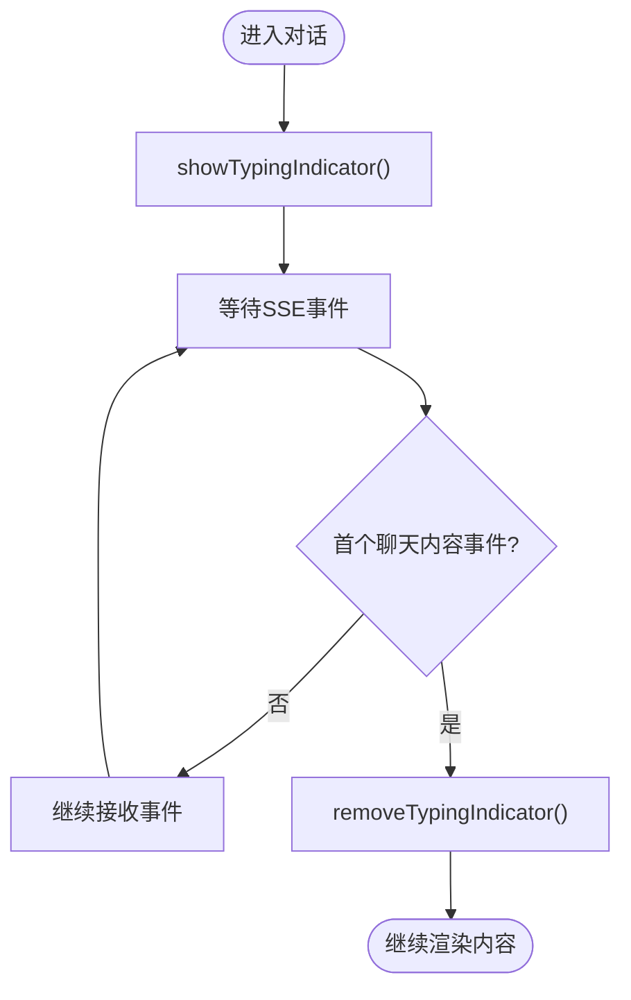
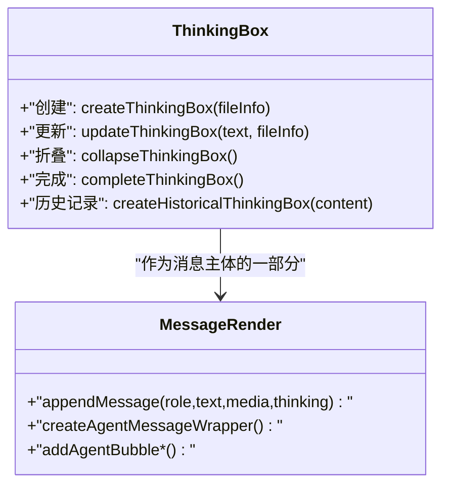
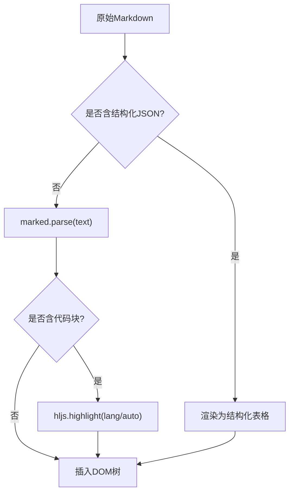
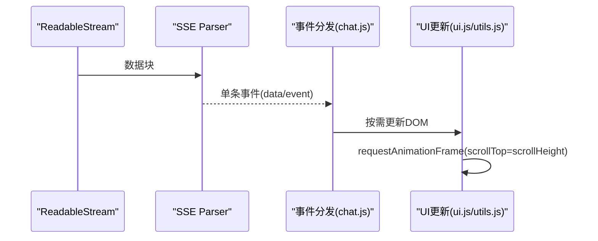
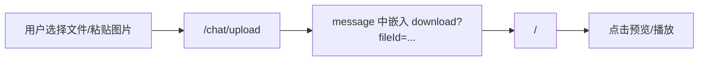
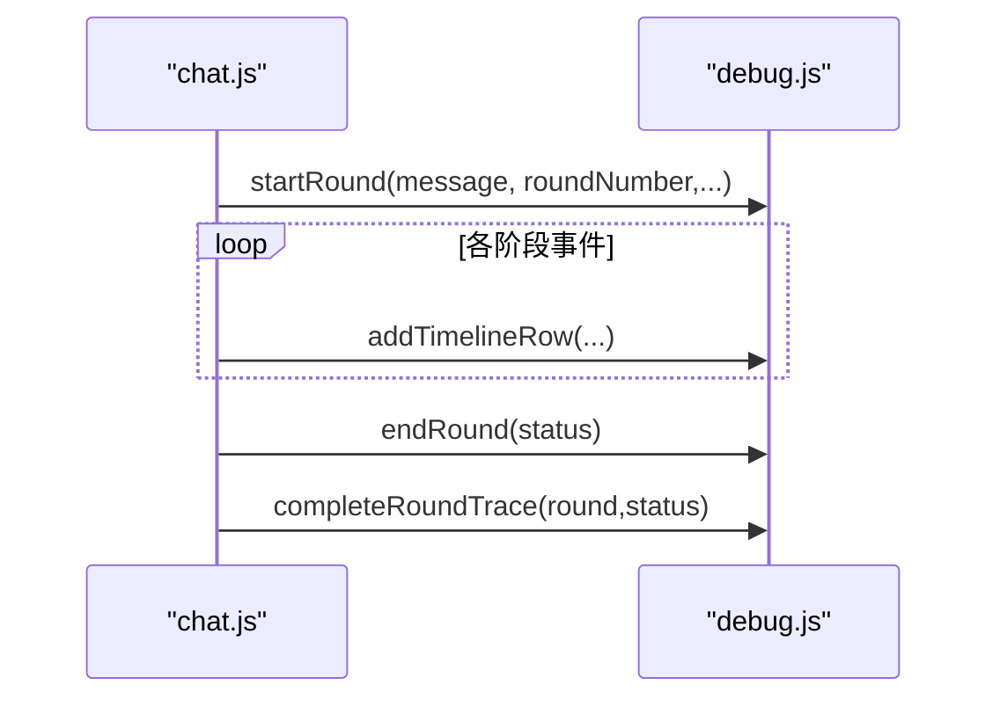
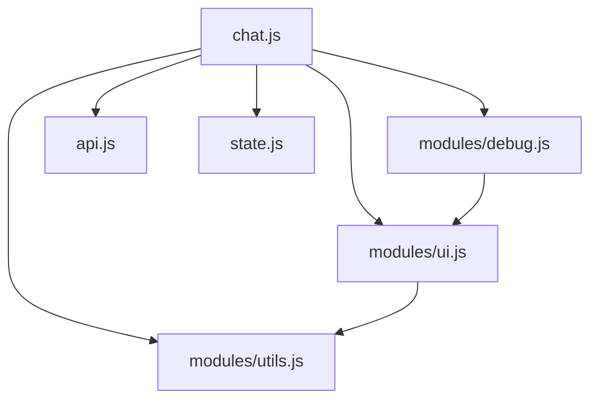

# 流式UI渲染

<cite>
**本文档引用的文件**
- [chat.html](file://src/main/resources/templates/chat.html)
- [chat.js](file://src/main/resources/static/scripts/chat.js)
- [api.js](file://src/main/resources/static/scripts/api.js)
- [state.js](file://src/main/resources/static/scripts/state.js)
- [ui.js](file://src/main/resources/static/scripts/modules/ui.js)
- [utils.js](file://src/main/resources/static/scripts/modules/utils.js)
- [debug.js](file://src/main/resources/static/scripts/modules/debug.js)
- [base.css](file://src/main/resources/static/styles/base.css)
- [chat.css（入口）](file://src/main/resources/static/styles/chat.css)
- [chat模块样式](file://src/main/resources/static/styles/modules/chat.css)
- [debug模块样式](file://src/main/resources/static/styles/modules/debug.css)
</cite>

## 目录
1. [引言](#引言)
2. [项目结构](#项目结构)
3. [核心组件](#核心组件)
4. [架构总览](#架构总览)
5. [详细组件分析](#详细组件分析)
6. [依赖关系分析](#依赖关系分析)
7. [性能考量](#性能考量)
8. [故障排查指南](#故障排查指南)
9. [结论](#结论)
10. [附录：多媒体与可访问性](#附录多媒体与可访问性)

## 引言
本技术文档聚焦前端流式UI渲染系统，围绕以下主题展开：打字指示器（光标/三点跳动）、思考框的创建与管理、Markdown与代码高亮、滚动定位策略、请求级SSE流式渲染、多媒体内容（图片预览、音频播放、文件下载）、响应式布局与交互、以及性能监控和优化。所有实现均来源于前端资源中的HTML模板、JavaScript模块与CSS样式。

## 项目结构
前端由页面模板承载应用骨架，脚本模块负责事件流转与UI更新，样式模块采用“统一入口 + 多模块引入”的CSS组织方式，视觉风格为赛博朋克深色主题并带霓虹效果。

**图表来源**
- [chat.html:1-95](file://src/main/resources/templates/chat.html#L1-L95)
- [chat.css（入口）:1-13](file://src/main/resources/static/styles/chat.css#L1-L13)

**章节来源**
- [chat.html:1-95](file://src/main/resources/templates/chat.html#L1-L95)
- [chat.css（入口）:1-13](file://src/main/resources/static/styles/chat.css#L1-L13)

## 核心组件
- 消息与会话容器：DOM节点引用集中在UI模块，供增删改查消息、插入思考框和状态反馈使用。
- SSE解析与事件分发：独立解析器按行读取SSE块并回调事件处理器。
- Markdown与代码高亮：基于第三方库配置render函数进行语法高亮与结构化数据呈现。
- 状态中心：window状态对象统一管理当前agent、消息计数、上传媒体等全局状态。
- 调试面板：轮次卡片、时间线事件、指标汇总。

**章节来源**
- [ui.js:1-12](file://src/main/resources/static/scripts/modules/ui.js#L1-L12)
- [api.js:1-25](file://src/main/resources/static/scripts/api.js#L1-L25)
- [utils.js:1-46](file://src/main/resources/static/scripts/modules/utils.js#L1-L46)
- [state.js:1-24](file://src/main/resources/static/scripts/state.js#L1-L24)
- [debug.js:5-60](file://src/main/resources/static/scripts/modules/debug.js#L5-L60)

## 架构总览
用户输入触发消息发送；后端以SSE返回类型化事件（如thinking/text/tool_start/done等），前端在浏览器侧逐条处理，动态更新聊天区域、思考框与调试面板。整个渲染过程强调“首内容可见后隐藏加载态”、“批量化滚动调整”、“低开销动画”。

**图表来源**
- [chat.js:24-178](file://src/main/resources/static/scripts/chat.js#L24-L178)
- [api.js:1-25](file://src/main/resources/static/scripts/api.js#L1-L25)
- [ui.js:284-354](file://src/main/resources/static/scripts/modules/ui.js#L284-L354)
- [utils.js:220-224](file://src/main/resources/static/scripts/modules/utils.js#L220-L224)
- [debug.js:5-60](file://src/main/resources/static/scripts/modules/debug.js#L5-L60)

## 详细组件分析

### 打字指示器：原理、条件与自动隐藏
- 展示时机
  - 发起请求后立即显示，避免“空白等待期”。
  - 通过showTypingIndicator注入带有三点跳动动画的节点（使用CSS keyframes）。
- 隐藏时机与逻辑
  - 首次出现“真正聊天内容事件”时移除：包括thinking/reasoning_text/text/tool_start，以及结束态done/error/pending_approval。
  - 设计原则：仅当第一个可感知聊天内容到达时才移除指示器，防止误清导致空白感。
- 动画与样式
  - 三个小圆点交错延迟的bounce动效，颜色采用主题色，符合赛博朋克主题。
  - 标签支持updateTypingIndicator动态追加（例如专家调度提示），但不会重复插入同名label。

**图表来源**
- [chat.js:61-76](file://src/main/resources/static/scripts/chat.js#L61-L76)
- [chat.js:164-175](file://src/main/resources/static/scripts/chat.js#L164-L175)
- [ui.js:326-354](file://src/main/resources/static/scripts/modules/ui.js#L326-L354)
- [chat模块样式:128-166](file://src/main/resources/static/styles/modules/chat.css#L128-L166)

**章节来源**
- [chat.js:61-76](file://src/main/resources/static/scripts/chat.js#L61-L76)
- [chat.js:164-175](file://src/main/resources/static/scripts/chat.js#L164-L175)
- [ui.js:284-354](file://src/main/resources/static/scripts/modules/ui.js#L284-L354)
- [chat模块样式:128-166](file://src/main/resources/static/styles/modules/chat.css#L128-L166)

### 思考框：创建、更新与折叠
- 创建机制
  - createThinkingBox动态构建头像+包裹容器+可折叠的思考框；必要时附带上传文件信息。
  - 思考框头部包含一个四分之一圆弧旋转的spinner（conic-gradient实现），完成态停止旋转并用对勾替代。
- 实时更新
  - updateThinkingBox累积text片段（过滤__fragment__占位），设置content文本内容并内部滚动至底部。
- 历史回溯
  - appendMessage支持传入thinkingContent，以历史思考盒形式完整展示，且保持折叠能力。
- 交互行为
  - 头部点击可折叠/展开；完成态切换文案与图标。
- 样式与状态
  - collapsed/completed类控制内容与动画；主题配色与阴影保持一致。

**图表来源**
- [ui.js:117-181](file://src/main/resources/static/scripts/modules/ui.js#L117-L181)
- [ui.js:183-202](file://src/main/resources/static/scripts/modules/ui.js#L183-L202)
- [chat模块样式:169-249](file://src/main/resources/static/styles/modules/chat.css#L169-L249)

**章节来源**
- [ui.js:117-181](file://src/main/resources/static/scripts/modules/ui.js#L117-L181)
- [ui.js:183-202](file://src/main/resources/static/scripts/modules/ui.js#L183-L202)
- [chat模块样式:169-249](file://src/main/resources/static/styles/modules/chat.css#L169-L249)

### Markdown渲染与代码高亮
- Markdown渲染
  - 使用marked并自定义renderer，优先尝试指定语言高亮，否则自动识别，回退为纯文本转义。
  - 对特定结构化数据尝试提取JSON表格输出并提供导出按钮。
- 代码高亮
  - 引入highlight.min.js，按语言类名着色；pre/code样式已适配深色主题。
- 安全与兼容性
  - 所有用户文本渲染前先escape，降低XSS风险；标记错误路径降级处理以保证稳定。

**图表来源**
- [utils.js:1-46](file://src/main/resources/static/scripts/modules/utils.js#L1-L46)
- [utils.js:49-196](file://src/main/resources/static/scripts/modules/utils.js#L49-L196)
- [base.css:107-130](file://src/main/resources/static/styles/base.css#L107-L130)

**章节来源**
- [utils.js:1-46](file://src/main/resources/static/scripts/modules/utils.js#L1-L46)
- [utils.js:49-196](file://src/main/resources/static/scripts/modules/utils.js#L49-L196)
- [base.css:107-130](file://src/main/resources/static/styles/base.css#L107-L130)

### 流式渲染与滚动定位
- SSE接收
  - ReadableStream分片读取，配合轻量SSE解析器将data字段按行拆分并触发回调。
- 事件分支
  - 针对30+种事件类型分别处理，典型如agent生命周期、token流、tool调用、管道/路由事件、审批等。
- 批量滚动
  - 每次DOM变更后调用scrollToBottom封装在requestAnimationFrame中，减少重排次数。
- 首字节到首内容的过渡
  - 明确区分“调试面板事件”与“聊天区事件”，只有后者才清除打字指示器，避免中间空白。

**图表来源**
- [api.js:1-25](file://src/main/resources/static/scripts/api.js#L1-L25)
- [chat.js:129-178](file://src/main/resources/static/scripts/chat.js#L129-L178)
- [utils.js:220-224](file://src/main/resources/static/scripts/modules/utils.js#L220-L224)

**章节来源**
- [api.js:1-25](file://src/main/resources/static/scripts/api.js#L1-L25)
- [chat.js:129-178](file://src/main/resources/static/scripts/chat.js#L129-L178)
- [utils.js:220-224](file://src/main/resources/static/scripts/modules/utils.js#L220-L224)

### 多媒体内容渲染
- 图片
  - 用户上传与消息内嵌图片通过download接口展示；消息气泡中生成可点击缩略图，点击图片弹出全屏模态。
- 音频
  - 支持原生audio控件加载播放，文件名显示于控件下方。
- 文件下载
  - uploadFile上传至服务端；消息中可附带文件标签，后续通过文件ID下载。

**图表来源**
- [api.js:27-41](file://src/main/resources/static/scripts/api.js#L27-L41)
- [ui.js:30-79](file://src/main/resources/static/scripts/modules/ui.js#L30-L79)
- [ui.js:298-323](file://src/main/resources/static/scripts/modules/ui.js#L298-L323)

**章节来源**
- [api.js:27-41](file://src/main/resources/static/scripts/api.js#L27-L41)
- [ui.js:30-79](file://src/main/resources/static/scripts/modules/ui.js#L30-L79)
- [ui.js:298-323](file://src/main/resources/static/scripts/modules/ui.js#L298-L323)

### 调试面板与运行轨迹
- 轮次管理
  - startRound创建轮次卡片，记录时间、模型名称、指标；endRound收尾并关闭运行态行。
- 时间线
  - addTimelineRow系列方法按步骤追加可视化事件行（阶段、LLM、工具、错误等）。
- 指标
  - 计算并展示tokens、时长、工具调用次数、速度估算等信息。

**图表来源**
- [debug.js:5-60](file://src/main/resources/static/scripts/modules/debug.js#L5-L60)
- [debug.js:118-172](file://src/main/resources/static/scripts/modules/debug.js#L118-L172)

**章节来源**
- [debug.js:5-60](file://src/main/resources/static/scripts/modules/debug.js#L5-L60)
- [debug.js:118-172](file://src/main/resources/static/scripts/modules/debug.js#L118-L172)

## 依赖关系分析
- 模块耦合
  - chat.js聚合导入多个模块，承担协调职责；对ui/utils/debug依赖度高，对api提供能力解耦良好。
  - ui.js强依赖utils.js中的工具函数；debug.js依赖ui.js暴露的面板容器。
- 样式组织
  - chat.css入口集中引入各模块样式，确保主题一致性与覆盖顺序可控。
- 运行时状态
  - state.js将全局变量挂载window并以get/set形式保障一致性，便于跨模块同步读取与写入。

**图表来源**
- [chat.js:1-9](file://src/main/resources/static/scripts/chat.js#L1-L9)
- [ui.js:1-1](file://src/main/resources/static/scripts/modules/ui.js#L1-L1)
- [utils.js:1-1](file://src/main/resources/static/scripts/modules/utils.js#L1-L1)
- [debug.js:1-2](file://src/main/resources/static/scripts/modules/debug.js#L1-L2)
- [state.js:1-24](file://src/main/resources/static/scripts/state.js#L1-L24)

**章节来源**
- [chat.js:1-9](file://src/main/resources/static/scripts/chat.js#L1-L9)
- [ui.js:1-1](file://src/main/resources/static/scripts/modules/ui.js#L1-L1)
- [utils.js:1-1](file://src/main/resources/static/scripts/modules/utils.js#L1-L1)
- [debug.js:1-2](file://src/main/resources/static/scripts/modules/debug.js#L1-L2)
- [state.js:1-24](file://src/main/resources/static/scripts/state.js#L1-L24)

## 性能考量
- 滚动优化
  - 所有滚动操作统一通过requestAnimationFrame包裹的scrollToBottom执行，合并视图更新，降低重绘抖动。
- 首内容可见性优化
  - 打字指示器在首个聊天内容事件出现后才移除，避免无意义空窗与反复重排。
- Markdown与高亮
  - 代码块优先尝试lang匹配高亮，失败回退auto模式；异常捕获兜底保证不阻塞渲染。
- 内存与DOM
  - 思考内容以增量拼接并过滤空行/占位符；历史思考盒仅在需要时渲染，减小常驻DOM。
- 未来改进建议
  - 虚拟滚动：对超长会话列表采用只渲染可视区内的消息项；可按距离视口阈值懒加载。
  - 批处理：对频繁的小段消息合并成一次batchUpdate，减少DOM写入频次。
  - 观测指标：在浏览器控制台增加FPS采样、内存快照对比与DOM深度统计，辅助定位瓶颈。

[本节为通用性能指导，不直接分析具体代码文件]

## 故障排查指南
- SSE解析问题
  - 现象：控制台打印解析失败的日志，可能为数据格式非预期。
  - 排查：检查服务端SSE是否遵循“data:... \n\n”规范，确认分隔符与编码（TextDecoder流式）。
- 打字指示器未消失
  - 现象：发送请求后一直显示三点跳动。
  - 原因：首个聊天内容事件未命中清理条件（thinking/text/tool_start/done/error等）或被屏蔽。
  - 处理：检查事件类型映射与清理逻辑分支。
- 滚动错位
  - 现象：新消息添加后未自动滚到底部。
  - 原因：未调用scrollToBottom或在布局变化前立即滚动。
  - 处理：确保在所有DOM变更结束后调用scrollToBottom。
- 图片/音频无法显示
  - 现象：缩略图为空或音频无声音。
  - 原因：download接口未返回或路径不对。
  - 处理：核对fileId与后端存储路径、CORS限制与服务器静态资源映射。

**章节来源**
- [api.js:1-25](file://src/main/resources/static/scripts/api.js#L1-L25)
- [chat.js:164-178](file://src/main/resources/static/scripts/chat.js#L164-L178)
- [utils.js:220-224](file://src/main/resources/static/scripts/modules/utils.js#L220-L224)

## 结论
该流式UI渲染系统以SSE为数据总线，结合模块化JS与主题化CSS，实现了可靠的打字指示器、思考框、Markdown与代码高亮、多媒体展示与调试面板。其关键性能特性体现在首内容可见性管理与基于RAF的批量滚动。建议在长会话场景下引入虚拟滚动与批量DOM更新策略，并补充前端自监控以持续评估流畅度与稳定性。

[本节为总结性内容，不直接分析具体文件]

## 附录：多媒体与可访问性
- 图片预览
  - 点击缩略图弹出模态查看大图，支持背景遮罩与关闭按钮。
- 音频播放
  - 原生< audio >控件提供基础播放能力，适合短音频快速预览。
- 键盘导航
  - 支持Enter发送与Shift+Enter换行；建议为关键按钮增加Tab索引与aria标签，提升键盘可达性。
- 色彩与对比度
  - 整体使用高对比度霓虹深色主题，但注意文字可读性与焦点态可见性，必要时提供浅色模式或增强对比度开关。

**章节来源**
- [ui.js:298-323](file://src/main/resources/static/scripts/modules/ui.js#L298-L323)
- [ui.js:30-79](file://src/main/resources/static/scripts/modules/ui.js#L30-L79)
- [chat.html:70-75](file://src/main/resources/templates/chat.html#L70-L75)