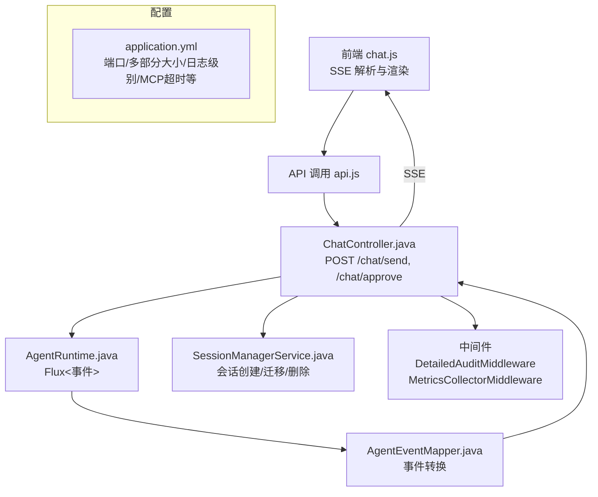
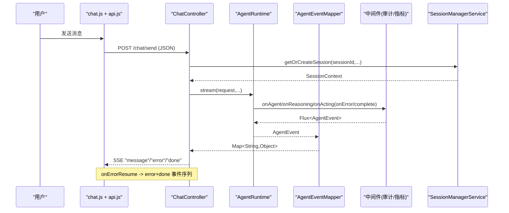
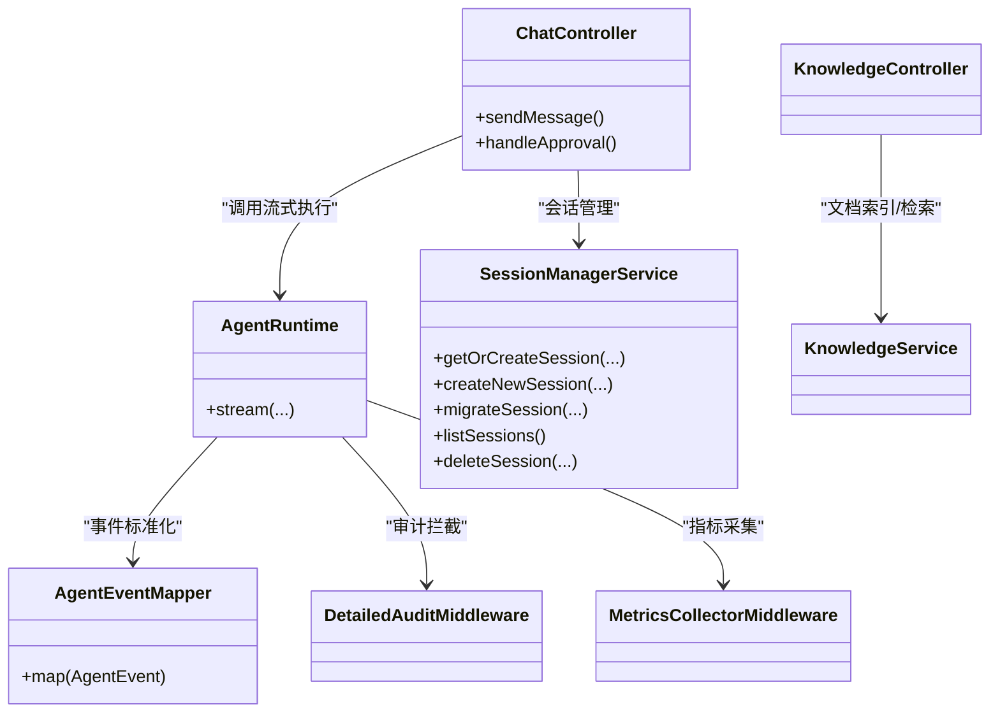

# 错误处理与恢复

<cite>
**本文引用的文件**
- [ChatController.java](file://src/main/java/com/skloda/agentscope/controller/ChatController.java)
- [KnowledgeController.java](file://src/main/java/com/skloda/agentscope/controller/KnowledgeController.java)
- [DetailedAuditMiddleware.java](file://src/main/java/com/skloda/agentscope/middleware/DetailedAuditMiddleware.java)
- [MetricsCollectorMiddleware.java](file://src/main/java/com/skloda/agentscope/middleware/MetricsCollectorMiddleware.java)
- [SessionManagerService.java](file://src/main/java/com/skloda/agentscope/service/SessionManagerService.java)
- [AgentRuntime.java](file://src/main/java/com/skloda/agentscope/runtime/AgentRuntime.java)
- [AgentEventMapper.java](file://src/main/java/com/skloda/agentscope/runtime/AgentEventMapper.java)
- [ChatEvent.java](file://src/main/java/com/skloda/agentscope/model/ChatEvent.java)
- [api.js](file://src/main/resources/static/scripts/api.js)
- [chat.js](file://src/main/resources/static/scripts/chat.js)
- [debug.js](file://src/main/resources/static/scripts/modules/debug.js)
- [application.yml](file://src/main/resources/application.yml)
- [agent-harness/AGENTSCOPE.md](file://agent-harness/AGENTSCOPE.md)
</cite>

## 目录
1. [简介](#简介)
2. [项目结构（与错误处理相关的模块）](#项目结构与错误处理相关模块)
3. [核心组件总览](#核心组件总览)
4. [架构概览（端到端流式与异常路径）](#架构概览端到端流式与异常路径)
5. [详细组件分析](#详细组件分析)
6. [依赖关系分析](#依赖关系分析)
7. [性能考虑](#性能考虑)
8. [故障排查指南](#故障排查指南)
9. [结论](#结论)
10. [附录：测试与监控建议](#附录测试与监控建议)

## 简介
本文面向本项目的“错误处理与恢复”机制，覆盖以下方面：
- HTTP 层错误处理：网络异常捕获、超时重试策略、服务端错误的友好提示
- SSE 流式传输异常：连接中断、数据解析错误、格式不兼容处理
- 用户友好的错误反馈：消息文案、操作步骤引导、重新尝试按钮
- 会话状态一致性：损坏会话自动修复、数据同步、回滚策略
- 开发调试支持：堆栈跟踪、日志级别控制、断点调试技巧
- 生产监控集成：错误上报、性能指标收集、告警配置
- 常见错误模式诊断方法与自动化测试用例设计思路

## 项目结构与错误处理相关模块
与本主题紧密相关的代码分布在控制器（HTTP）、运行时（SSE 流与事件映射）、中间件（审计与指标）、服务（会话管理）、前端脚本（SSE 解析与错误展示）以及配置中。

**图示来源**
- [ChatController.java:122-153](file://src/main/java/com/skloda/agentscope/controller/ChatController.java#L122-L153)
- [AgentRuntime.java](file://src/main/java/com/skloda/agentscope/runtime/AgentRuntime.java)
- [AgentEventMapper.java](file://src/main/java/com/skloda/agentscope/runtime/AgentEventMapper.java)
- [SessionManagerService.java:75-113](file://src/main/java/com/skloda/agentscope/service/SessionManagerService.java#L75-L113)
- [DetailedAuditMiddleware.java:45-108](file://src/main/java/com/skloda/agentscope/middleware/DetailedAuditMiddleware.java#L45-L108)
- [MetricsCollectorMiddleware.java:50-91](file://src/main/java/com/skloda/agentscope/middleware/MetricsCollectorMiddleware.java#L50-L91)
- [application.yml:72-89](file://src/main/resources/application.yml#L72-L89)

**章节来源**
- [application.yml:3-12](file://src/main/resources/application.yml#L3-L12)
- [agent-harness/AGENTSCOPE.md](file://agent-harness/AGENTSCOPE.md)

## 核心组件总览
- ChatController：负责 HTTP/SSE 入口、参数校验、SSE 包装、错误流封装与完成事件；对 Agent 流进行统一 onErrorResume
- KnowledgeController：提供知识库上传与查询接口，包含入参校验与内/外错误返回
- SessionManagerService：会话获取/创建/迁移、保存、删除与列表；具备会话类型变更的迁移能力
- AgentRuntime / AgentEventMapper：执行引擎与事件标准化映射（包含工具调用、文本、思考、结束等事件）
- DetailedAuditMiddleware / MetricsCollectorMiddleware：详细审计与指标收集，输出完整链路信息与错误计数
- 前端 script：SSE 解析器、错误分支处理、UI 提示与调试面板

**章节来源**
- [ChatController.java:122-153](file://src/main/java/com/skloda/agentscope/controller/ChatController.java#L122-L153)
- [KnowledgeController.java:40-77](file://src/main/java/com/skloda/agentscope/controller/KnowledgeController.java#L40-L77)
- [SessionManagerService.java:75-113](file://src/main/java/com/skloda/agentscope/service/SessionManagerService.java#L75-L113)
- [AgentEventMapper.java](file://src/main/java/com/skloda/agentscope/runtime/AgentEventMapper.java)
- [DetailedAuditMiddleware.java:45-108](file://src/main/java/com/skloda/agentscope/middleware/DetailedAuditMiddleware.java#L45-L108)
- [MetricsCollectorMiddleware.java:50-91](file://src/main/java/com/skloda/agentscope/middleware/MetricsCollectorMiddleware.java#L50-L91)

## 架构概览（端到端流式与异常路径）

**图示来源**
- [ChatController.java:122-153](file://src/main/java/com/skloda/agentscope/controller/ChatController.java#L122-L153)
- [SessionManagerService.java:75-113](file://src/main/java/com/skloda/agentscope/service/SessionManagerService.java#L75-L113)
- [DetailedAuditMiddleware.java:45-108](file://src/main/java/com/skloda/agentscope/middleware/DetailedAuditMiddleware.java#L45-L108)
- [MetricsCollectorMiddleware.java:50-91](file://src/main/java/com/skloda/agentscope/middleware/MetricsCollectorMiddleware.java#L50-L91)
- [ChatEvent.java:21-35](file://src/main/java/com/skloda/agentscope/model/ChatEvent.java#L21-L35)

## 详细组件分析

### 1. HTTP 层错误处理
- ChatController.sendMessage
  - 空消息校验并直接以 error+done 响应，避免无效进入后端流程
  - 通过 onErrorResume 捕获流上游异常，记录日志并输出 user-friendly 错误事件，随后发出 done 关闭流
  - JSON 序列化失败在 sseEvent/toJsonString 内部兜底为 error 事件
- KnowledgeController.uploadDocument
  - 文件空、文件名为空、扩展名不支持时返回 bad request
  - try/catch 捕获上层异常，返回 500，并打印详细错误日志
- 其他 REST 接口
  - 未找到资源/对象时使用 404 + 清晰错误信息
  - 使用 ResponseEntity 明确 HTTP 状态码与结构化错误体

**章节来源**
- [ChatController.java:122-153](file://src/main/java/com/skloda/agentscope/controller/ChatController.java#L122-L153)
- [ChatController.java:79-113](file://src/main/java/com/skloda/agentscope/controller/ChatController.java#L79-L113)
- [KnowledgeController.java:40-77](file://src/main/java/com/skloda/agentscope/controller/KnowledgeController.java#L40-L77)
- [application.yml:10-12](file://src/main/resources/application.yml#L10-L12)

### 2. SSE 流式传输异常处理
- 后端
  - ChatController.sseEvent/json 序列失败均降级为 error 事件并记录日志
  - errorAndDone 将错误与完成事件串联，确保前端能正常终结流
- 前端
  - api.js 的 createSSEParser 维护缓冲与行分割，按 data: 和 event: 拆分事件片段
  - chat.js 使用 reader.read() 逐块读取，解析后通过 switch 分发不同 payload.type；对无法解析的 JSON 记录错误日志
  - 对用户可见内容的事件（如 thinking/reasoning_text/text/pending_approval/done/error）移除加载指示，避免“白屏真空期”
  - 对于 fetch 失败或非 2xx 状态，弹出错误并终止轮次

**章节来源**
- [api.js:1-25](file://src/main/resources/static/scripts/api.js#L1-L25)
- [chat.js:106-176](file://src/main/resources/static/scripts/chat.js#L106-L176)
- [ChatController.java:79-113](file://src/main/java/com/skloda/agentscope/controller/ChatController.java#L79-L113)

### 3. 用户友好的错误反馈机制
- 后端：统一的 ChatEvent 类型化事件（done/error），便于前端按类型渲染
- 前端：错误态会显示操作失败提示，并在调试面板输出详细事件（包括工具调用、路由、专家调度等）
- 体验优化：首条“可见内容”事件到达时才清除“正在输入”动画，减少空白等待感；错误/完成事件作为安全网清理 UI

**章节来源**
- [ChatEvent.java:21-35](file://src/main/java/com/skloda/agentscope/model/ChatEvent.java#L21-L35)
- [chat.js:152-176](file://src/main/resources/static/scripts/chat.js#L152-L176)

### 4. 会话状态一致性保证
- 会话存在性与更新：getOrCreateSession 复用活跃会话，touch 更新时间戳；listSessions 按最近访问时间排序
- 会话类型迁移：若请求 sessionType 与缓存不同，则新建对应 state store 并迁移到新的上下文（migrateSession）
- 会话持久化标记：saveSession 仅作时间戳刷新，当前实现为内存会话存储
- 删除与会话查找：deleteSession 从并发集合移除；getSession 可查找指定会话

注：当前默认会话存储在进程内存（concurrentHashMap），如需分布式一致性需结合外部状态存储（如 Redis/MySQL/PostgreSQL）。

**章节来源**
- [SessionManagerService.java:75-113](file://src/main/java/com/skloda/agentscope/service/SessionManagerService.java#L75-L113)
- [SessionManagerService.java:126-145](file://src/main/java/com/skloda/agentscope/service/SessionManagerService.java#L126-L145)
- [SessionManagerService.java:157-198](file://src/main/java/com/skloda/agentscope/service/SessionManagerService.java#L157-L198)
- [application.yml:57-60](file://src/main/resources/application.yml#L57-L60)

### 5. 开发环境调试支持
- 详细审计中间件
  - 生成 traceId，记录 agent 名称、输入摘要、工具调用、推理轮数、文本块等，并在异常路径输出错误堆栈
  - 提供执行开始/结束的完整统计，帮助定位耗时热点
- 指标收集中间件
  - 记录工具调用次数与时延、模型 token 用量与估算成本、全局错误计数
  - 提供 printMetricsSummary 输出汇总
- 日志级别
  - application.yml 定义 root、io.agentscope、METRICS 等日志级别；MCP 启动超时可配置
- 前端调试面板
  - debug.js 支持“轮次”与时间线可视化，聚合 LLM/tool/thinking 阶段信息，便于快速发现问题

**章节来源**
- [DetailedAuditMiddleware.java:45-108](file://src/main/java/com/skloda/agentscope/middleware/DetailedAuditMiddleware.java#L45-L108)
- [DetailedAuditMiddleware.java:110-179](file://src/main/java/com/skloda/agentscope/middleware/DetailedAuditMiddleware.java#L110-L179)
- [DetailedAuditMiddleware.java:181-208](file://src/main/java/com/skloda/agentscope/middleware/DetailedAuditMiddleware.java#L181-L208)
- [MetricsCollectorMiddleware.java:50-91](file://src/main/java/com/skloda/agentscope/middleware/MetricsCollectorMiddleware.java#L50-L91)
- [MetricsCollectorMiddleware.java:184-200](file://src/main/java/com/skloda/agentscope/middleware/MetricsCollectorMiddleware.java#L184-L200)
- [application.yml:81-89](file://src/main/resources/application.yml#L81-L89)
- [debug.js:5-61](file://src/main/resources/static/scripts/modules/debug.js#L5-L61)

### 6. 生产环境的监控集成方案
- 错误上报
  - 通过 MetricsCollectorMiddleware 的全局计数器 GLOBAL_ERRORS、工具/Agent 级错误率，接入外部指标系统（如 Prometheus + Alertmanager 或 APM）
  - 对关键错误（如 500、工具解析失败）配合 structured logging（traceId）提升跨系统关联分析能力
- 性能指标采集
  - 工具调用时延分布、平均耗时、最小/最大耗时统计
  - Token 消耗与成本估算用于费用核算与预算告警
- 告警配置建议
  - 错误率超过阈值触发告警（如 1 分钟内错误计数突增）
  - 高延迟 P95/P99 工具/Agent 告警
  - MCP/外部服务启动或连接超时告警（参考 MCP 超时配置）

**章节来源**
- [MetricsCollectorMiddleware.java:39-45](file://src/main/java/com/skloda/agentscope/middleware/MetricsCollectorMiddleware.java#L39-L45)
- [MetricsCollectorMiddleware.java:86-90](file://src/main/java/com/skloda/agentscope/middleware/MetricsCollectorMiddleware.java#L86-L90)
- [MetricsCollectorMiddleware.java:120-142](file://src/main/java/com/skloda/agentscope/middleware/MetricsCollectorMiddleware.java#L120-L142)
- [MetricsCollectorMiddleware.java:187-200](file://src/main/java/com/skloda/agentscope/middleware/MetricsCollectorMiddleware.java#L187-L200)
- [application.yml:72-80](file://src/main/resources/application.yml#L72-L80)

## 依赖关系分析

**图示来源**
- [ChatController.java:54-69](file://src/main/java/com/skloda/agentscope/controller/ChatController.java#L54-L69)
- [SessionManagerService.java:75-113](file://src/main/java/com/skloda/agentscope/service/SessionManagerService.java#L75-L113)
- [DetailedAuditMiddleware.java:45-108](file://src/main/java/com/skloda/agentscope/middleware/DetailedAuditMiddleware.java#L45-L108)
- [MetricsCollectorMiddleware.java:50-91](file://src/main/java/com/skloda/agentscope/middleware/MetricsCollectorMiddleware.java#L50-L91)

**章节来源**
- [agent-harness/AGENTSCOPE.md](file://agent-harness/AGENTSCOPE.md)

## 性能考虑
- 大文件上传限制：spring.servlet.multipart.max-file-size/max-request-size 影响知识文档上传上限
- SSE 流控：onErrorResume 及时降级与完成事件避免悬挂连接；前端按“首可见事件”清除 loading 提升感知速度
- 指标粒度：中间件在 onAgent/onReasoning/onActing/onModelCall 等阶段累计耗时，有助于识别瓶颈工具/环节
- 会话内存：当前默认内存会话，高并发下应评估内存占用并结合外部状态存储做横向扩展

**章节来源**
- [application.yml:10-12](file://src/main/resources/application.yml#L10-L12)
- [MetricsCollectorMiddleware.java:120-142](file://src/main/java/com/skloda/agentscope/middleware/MetricsCollectorMiddleware.java#L120-L142)
- [SessionManagerService.java:23-43](file://src/main/java/com/skloda/agentscope/service/SessionManagerService.java#L23-L43)

## 故障排查指南
- 常见问题定位步骤
  1) 确认 HTTP 层是否返回 4xx/5xx：查看 KnowledgeController/ChatController 的错误响应逻辑
  2) 检查 SSE 流是否持续：如果收到 error 事件但未收到 done，可能是上游异常未正确闭环
  3) 使用 DetailedAuditMiddleware 中的 traceId，跨前后端与中间件关联日志
  4) 检查 MetricsCollectorMiddleware 的工具/Agent 耗时与错误计数，定位慢路径与高频失败点
  5) 前端控制台查看 parse JSON 失败与 fetch 失败的错误信息，对照 chat.js 的分发分支
- 断点调试技巧
  - 在后端 ChatController.onErrorResume、sseEvent/json 抛出处打点，观察错误路径
  - 在 DetailedAuditMiddleware 的 doOnError 处观察异常堆栈与执行时长
  - 在前端 chat.js 的 reader.read()/parse(JSON) 处设置断点，观察原始事件流
- 日志级别调整
  - 临时提高 io.agentscope 至 DEBUG 以便更详细的代理事件日志
  - 关注 METRICS 日志输出的汇总信息

**章节来源**
- [KnowledgeController.java:40-77](file://src/main/java/com/skloda/agentscope/controller/KnowledgeController.java#L40-L77)
- [ChatController.java:122-153](file://src/main/java/com/skloda/agentscope/controller/ChatController.java#L122-L153)
- [DetailedAuditMiddleware.java:99-108](file://src/main/java/com/skloda/agentscope/middleware/DetailedAuditMiddleware.java#L99-L108)
- [MetricsCollectorMiddleware.java:86-90](file://src/main/java/com/skloda/agentscope/middleware/MetricsCollectorMiddleware.java#L86-L90)
- [chat.js:137-146](file://src/main/resources/static/scripts/chat.js#L137-L146)
- [application.yml:81-89](file://src/main/resources/application.yml#L81-L89)

## 结论
本项目在 HTTP/SSE 层已建立完善的错误捕获与降级输出，并以类型化的 error/done 事件确保客户端能够稳定处理异常情况。借助详细的审计中间件与指标采集，可以在开发与生产环境中迅速定位问题、评估性能与成本。会话层具备类型迁移能力以应对配置不一致场景。未来可进一步增强错误上报、分布式会话一致性保障与前端的本地化提示。

[无“章节来源”标注说明]

## 附录：测试与监控建议
- 自动化测试建议
  - 单元测试：验证空消息拒绝、非法文件格式/大小、已知 4xx 分支、5xx 转 error/done
  - 流式测试：校验 error/done 成对出现；检测流异常时是否触发 onErrorResume
  - 会话测试：重复创建相同 sessionId 的行为、sessionType 变更后的迁移、list/delete/get 的一致性
  - 中间件测试：统计错误计数、工具耗时范围、token 计数合理性
- 监控与告警建议
  - 指标：qps、错误率、P95/P99 延时、token 用量、成本估算
  - 告警：错误率飙升、长尾耗时工具暴露、模型调用失败率异常、MCP 启动超时
  - 采样：对敏感日志脱敏后再上报；集中追踪 id 打通前后端

[无“章节来源”标注说明]