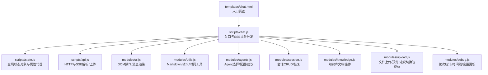
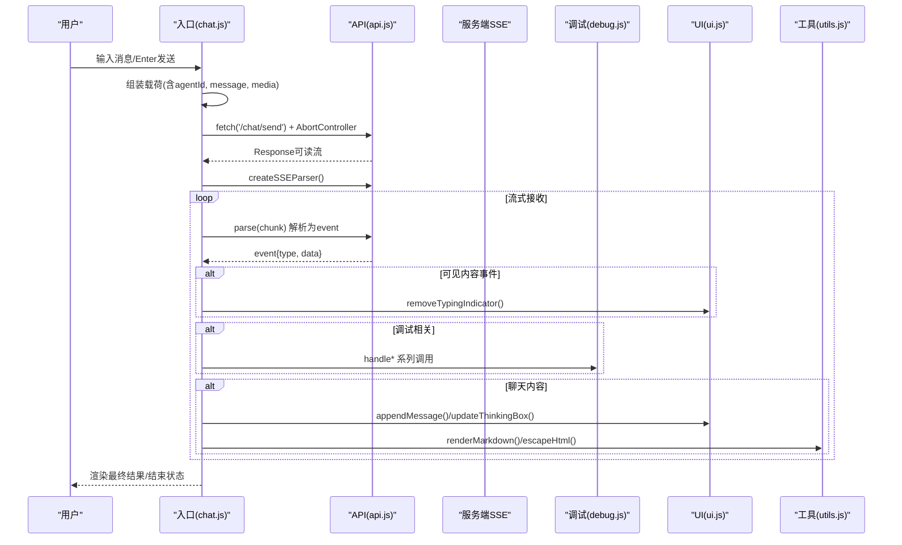
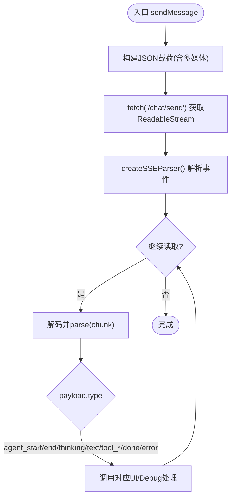
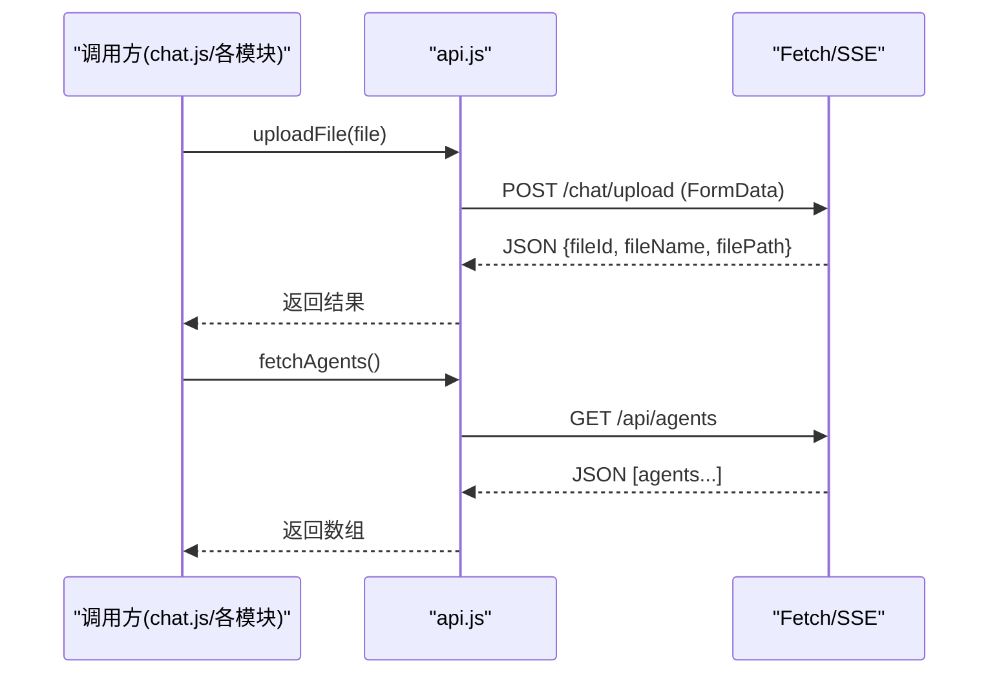
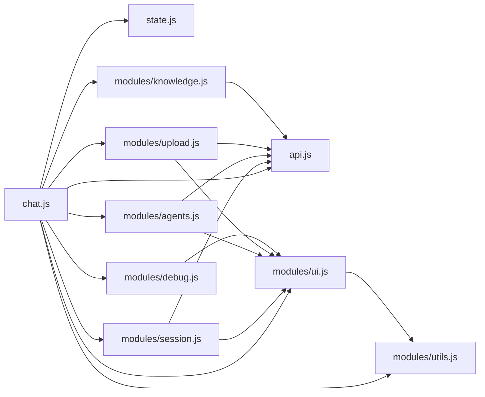

# 核心架构设计

<cite>
**本文引用的文件列表**
- [chat.html](file://src/main/resources/templates/chat.html)
- [chat.js](file://src/main/resources/static/scripts/chat.js)
- [state.js](file://src/main/resources/static/scripts/state.js)
- [api.js](file://src/main/resources/static/scripts/api.js)
- [modules/ui.js](file://src/main/resources/static/scripts/modules/ui.js)
- [modules/utils.js](file://src/main/resources/static/scripts/modules/utils.js)
- [modules/agents.js](file://src/main/resources/static/scripts/modules/agents.js)
- [modules/session.js](file://src/main/resources/static/scripts/modules/session.js)
- [modules/knowledge.js](file://src/main/resources/static/scripts/modules/knowledge.js)
- [modules/upload.js](file://src/main/resources/static/scripts/modules/upload.js)
- [modules/debug.js](file://src/main/resources/static/scripts/modules/debug.js)
</cite>

## 目录
1. [引言](#引言)
2. [项目结构](#项目结构)
3. [核心组件](#核心组件)
4. [架构总览](#架构总览)
5. [详细组件分析](#详细组件分析)
6. [依赖关系分析](#依赖关系分析)
7. [性能考虑](#性能考虑)
8. [故障排查指南](#故障排查指南)
9. [结论](#结论)

## 引言
本技术文档聚焦前端模块化 JavaScript 架构设计，围绕以下目标展开：模块化与命名空间组织、模块依赖管理、事件驱动架构、集中式状态管理、入口初始化流程、SSE 流式处理与事件总线模式、API 封装层设计与请求/响应策略、组件间通信最佳实践以及性能优化与命名规范建议。所有分析与图示均基于仓库中的前端源码文件。

## 项目结构
前端资源位于 resources/static 下，以模块化 JS 组织：入口 chat.js 负责初始化与服务端 SSE 事件分发；state.js 提供全局状态及同步访问；api.js 封装全部 HTTP 请求（包括 SSE 解析器与上传）；modules 下按职责划分 UI、工具、Agent/会话/知识/上传/调试等能力；HTML 模板通过 script type="module" 引入入口脚本，静态资源按需加载。

图表来源
- [chat.html:1-95](file://src/main/resources/templates/chat.html#L1-L95)
- [chat.js:1-9](file://src/main/resources/static/scripts/chat.js#L1-L9)

章节来源
- [chat.html:1-95](file://src/main/resources/templates/chat.html#L1-L95)
- [chat.js:1-9](file://src/main/resources/static/scripts/chat.js#L1-L9)

## 核心组件
- 入口与事件分发：chat.js 负责用户输入、构建请求载荷、发起 SSE 请求、解析事件并路由到对应处理器（如 agent_start/thinking/text/done/error 等）。
- 全局状态：state.js 定义 window.__agentScopeState，并通过 Object.defineProperty 暴露只读/双向同步的属性，使多个模块共享同一状态。
- API 层：api.js 提供 SSE 分块解析器、上传、Agent/Session/Knowledge/Skill&Tool 信息查询接口，并对错误进行统一抛出或返回。
- UI 组件：modules/ui.js 专注 DOM 操作（消息气泡、头像、媒体附件显示、滚动对齐）、“思考”框创建/更新与历史回显。
- 工具函数：modules/utils.js 提供 Markdown 渲染增强（结构化数据识别为表格导出）、HTML 转义、时间戳与格式化等。
- Agent 管理：modules/agents.js 获取 Agent 列表并按分类渲染、选择 Agent、切换执行模式、展示示例提示。
- 会话管理：modules/session.js 管理 Session 的创建/切换/删除/清空，支持流中断时清理状态与恢复界面。
- 知识库：modules/knowledge.js 管理知识库文档列表的加载、上传、删除。
- 文件上传：modules/upload.js 校验类型、上传后维护已选文件集合与预览，并智能建议切换到具备多模态能力的 Agent。
- 调试面板：modules/debug.js 跟踪每轮“Round”的指标与时间线，辅助观测多 Agent/管道/路由/专家事件。

章节来源
- [chat.js:1-9](file://src/main/resources/static/scripts/chat.js#L1-L9)
- [state.js:1-24](file://src/main/resources/static/scripts/state.js#L1-L24)
- [api.js:1-124](file://src/main/resources/static/scripts/api.js#L1-L124)
- [modules/ui.js:1-200](file://src/main/resources/static/scripts/modules/ui.js#L1-L200)
- [modules/utils.js:1-200](file://src/main/resources/static/scripts/modules/utils.js#L1-L200)
- [modules/agents.js:1-200](file://src/main/resources/static/scripts/modules/agents.js#L1-L200)
- [modules/session.js:1-168](file://src/main/resources/static/scripts/modules/session.js#L1-L168)
- [modules/knowledge.js:1-60](file://src/main/resources/static/scripts/modules/knowledge.js#L1-L60)
- [modules/upload.js:1-200](file://src/main/resources/static/scripts/modules/upload.js#L1-L200)
- [modules/debug.js:1-200](file://src/main/resources/static/scripts/modules/debug.js#L1-L200)

## 架构总览
前端采用“单入口 + 模块解耦 + 中心化状态 + 事件驱动”的架构：
- 入口文件初始化模块并注册事件（如 input/keydown），随后进入主循环处理 SSE。
- 全局状态对象集中管理跨模块数据，各模块仅读写 state 提供的属性，避免隐式耦合。
- 使用“事件驱动的处理器分支”对后端推来的事件类型做路由处理（agent_start/end、thinking、tool_*、text、done、error 等），体现发布-订阅的思想（虽未实现独立 Bus，但以 switch 派发作为内部事件总线等价物）。
- API 层屏蔽网络细节，SSE 解析器将文本流拆解为事件单元，确保增量渲染与用户体验连贯性。

图表来源
- [chat.js:24-177](file://src/main/resources/static/scripts/chat.js#L24-L177)
- [api.js:1-25](file://src/main/resources/static/scripts/api.js#L1-L25)
- [modules/ui.js:14-115](file://src/main/resources/static/scripts/modules/ui.js#L14-L115)
- [modules/utils.js:32-46](file://src/main/resources/static/scripts/modules/utils.js#L32-L46)
- [modules/debug.js:5-61](file://src/main/resources/static/scripts/modules/debug.js#L5-L61)

## 详细组件分析

### 入口文件 chat.js：初始化、模块加载与事件总线
- 初始化顺序：先导入 state、api、utils、ui、debug、agents、session、knowledge、upload；再绑定输入事件；最后等待用户触发发送。
- 模块加载顺序：chat.js 首行 import state 保证后续逻辑可访问全局状态；紧接着导入 api（SSE 解析与上传），然后导入 UI/工具/调试等功能模块，确保依赖就绪。
- 事件总线模式：SSE 解析得到的 event.data 被 JSON.parse 后，依据 payload.type 分支路由至不同处理路径（agent_start/end/thinking/text/tool_start/end/done/error/pending_approval），体现了“中心路由”的事件驱动机制。为保证首次内容可见性，打字指示器仅在到达“可见内容”类事件才移除，避免空白真空期。

图表来源
- [chat.js:24-177](file://src/main/resources/static/scripts/chat.js#L24-L177)

章节来源
- [chat.js:1-9](file://src/main/resources/static/scripts/chat.js#L1-L9)
- [chat.js:24-177](file://src/main/resources/static/scripts/chat.js#L24-L177)

### 状态管理 state.js：全局状态对象与同步访问
- 集中化：通过 window.__agentScopeState 统一定义当前 Agent、流式状态、AbortController、消息计数、媒体信息、会话ID、Agents 缓存、轮次数组、思考框等关键状态。
- 同步访问：使用 defineWindowStateProperty 在 window 上为每个字段定义 getter/setter，并在 setter 中同时更新本地变量，确保多个模块可直接通过 window.xxx 读写状态且保持一致。
- 可观察性：状态变更发生在 UI/调试/会话/上传等多处，但均由 state 单点持有，避免分散状态带来的不一致性。

章节来源
- [state.js:1-165](file://src/main/resources/static/scripts/state.js#L1-L165)

### API 层 api.js：SSE 解析、请求封装与错误策略
- SSE 解析器：createSSEParser 维护 buffer 并逐行拆分 data:/event:，空行触发 onEvent 回调；chat.js 用 TextDecoder 与 reader.read() 增量消费。
- 请求封装：uploadFile、fetchAgents/create/delete/fetchSessions、Knowledge、Skill/Tool 等接口统一集中；对非 2xx 或特定语义的响应，部分接口抛出错误，便于调用方捕获。
- 响应处理：SSE 为流式响应，其他接口采用 Promise 返回值；调用方结合 catch 处理异常。

图表来源
- [api.js:28-47](file://src/main/resources/static/scripts/api.js#L28-L47)
- [api.js:83-124](file://src/main/resources/static/scripts/api.js#L83-L124)

章节来源
- [api.js:1-124](file://src/main/resources/static/scripts/api.js#L1-L124)

### UI 组件 modules/ui.js：消息渲染与“思考”交互
- 消息渲染：根据 role 区分用户/助手，插入头像与内容气泡；助手内容通过 utils.renderMarkdown 渲染；用户消息附带文件/图片/音频标签与播放器/预览。
- 思考框：createThinkingBox/updateThinkingBox 用于 LLM “Thinking/Reasoning” 流式内容实时展现；历史思考内容在回显时通过 createHistoricalThinkingBox 呈现。
- 滚动对齐：每次插入后自动 scrollToBottom，保持对话可视区域最新。

章节来源
- [modules/ui.js:14-115](file://src/main/resources/static/scripts/modules/ui.js#L14-L115)
- [modules/ui.js:139-197](file://src/main/resources/static/scripts/modules/ui.js#L139-L197)

### 工具模块 modules/utils.js：Markdown/结构化数据/转义
- Markdown：优先使用 marked，并为代码高亮兼容 hljs；自定义 renderer 输出 <pre><code class="hljs ...">。
- 结构化数据：检测 code block 或裸 JSON，将其渲染为表格并提供“导出 JSON”按钮。
- 辅助函数：escapeHtml/getTimestamp/formatDuration 等供 UI 和其他模块复用。

章节来源
- [modules/utils.js:1-46](file://src/main/resources/static/scripts/modules/utils.js#L1-L46)
- [modules/utils.js:72-113](file://src/main/resources/static/scripts/modules/utils.js#L72-L113)

### Agent 管理 modules/agents.js：分组渲染与选择逻辑
- 分组：按 category 将 agents 分组并渲染可折叠的组头与卡片。
- 选择：selectAgent 会重置运行状态、切换当前 Agent、展示其元信息与可选 Harness 模式、隐藏或展示权限/会话类型选择器、清空聊天区等。
- 扩展：自动展开选中 Agent 所在分组，并支持查看 Agent 配置与示例 Prompt。

章节来源
- [modules/agents.js:16-99](file://src/main/resources/static/scripts/modules/agents.js#L16-L99)
- [modules/agents.js:101-200](file://src/main/resources/static/scripts/modules/agents.js#L101-L200)

### 会话管理 modules/session.js：生命周期与一致性保障
- 生命周期：loadSessions 拉取列表渲染；createNewSession 建立新会话并恢复消息；deleteSession/clearSession 在中断流的情况下也能正确中止请求并复位 UI。
- 一致性：在切换/删除会话时清理聊天区域与调试轮次，并恢复 empty 占位，防止状态残留。

章节来源
- [modules/session.js:6-97](file://src/main/resources/static/scripts/modules/session.js#L6-L97)
- [modules/session.js:99-168](file://src/main/resources/static/scripts/modules/session.js#L99-L168)

### 文件上传 modules/upload.js：校验、上传与会话联动
- 校验：限制文件格式（doc/pdf/xlsx/jpg/png/gif/webp/wav/mp3/m4a/mp4），不符合则直接忽略。
- 上传：调用 api.uploadFile，成功后更新 window.uploadedFile/Images/Audio，并显示预览标签。
- 建议切换：若当前 Agent 不支持当前媒体的处理能力，弹出弹窗建议切换到具备相应能力的 Agent（如文档分析/视觉识别/语音助手）。

章节来源
- [modules/upload.js:5-111](file://src/main/resources/static/scripts/modules/upload.js#L5-L111)
- [modules/upload.js:156-200](file://src/main/resources/static/scripts/modules/upload.js#L156-L200)

### 调试模块 modules/debug.js：轮次与时间线
- Round 模型：startRound 构造轮次对象并绘制卡片，聚合 token/耗时/调用次数等指标。
- 时间线：addTimelineRow/addTimelineRowForRound 注入步骤节点（phase、LLM、工具等），endRound/completeRoundTrace 收尾并关闭运行状态。
- 度量：updateRoundMetrics/ForRound 实时刷新摘要与详情。

章节来源
- [modules/debug.js:5-61](file://src/main/resources/static/scripts/modules/debug.js#L5-L61)
- [modules/debug.js:63-172](file://src/main/resources/static/scripts/modules/debug.js#L63-L172)
- [modules/debug.js:174-200](file://src/main/resources/static/scripts/modules/debug.js#L174-L200)

### 知识管理 modules/knowledge.js：文档浏览与维护
- 加载：从后端拉取文档名列表并渲染，为空时展示占位文案。
- 上传/删除：上传成功后刷新列表；删除时确认成功即更新视图。

章节来源
- [modules/knowledge.js:4-59](file://src/main/resources/static/scripts/modules/knowledge.js#L4-L59)

## 依赖关系分析
前端模块间的依赖方向明确，形成入口 -> 子模块 + 公共依赖的结构，减少环路风险并确保加载顺序可控。

图表来源
- [chat.js:1-9](file://src/main/resources/static/scripts/chat.js#L1-L9)
- [modules/session.js:1-4](file://src/main/resources/static/scripts/modules/session.js#L1-L4)
- [modules/agents.js:1-5](file://src/main/resources/static/scripts/modules/agents.js#L1-L5)
- [modules/upload.js:1-3](file://src/main/resources/static/scripts/modules/upload.js#L1-L3)
- [modules/knowledge.js:1-3](file://src/main/resources/static/scripts/modules/knowledge.js#L1-L3)
- [modules/debug.js:1-2](file://src/main/resources/static/scripts/modules/debug.js#L1-L2)

章节来源
- [chat.js:1-9](file://src/main/resources/static/scripts/chat.js#L1-L9)
- [modules/session.js:1-4](file://src/main/resources/static/scripts/modules/session.js#L1-L4)
- [modules/agents.js:1-5](file://src/main/resources/static/scripts/modules/agents.js#L1-L5)
- [modules/upload.js:1-3](file://src/main/resources/static/scripts/modules/upload.js#L1-L3)
- [modules/knowledge.js:1-3](file://src/main/resources/static/scripts/modules/knowledge.js#L1-L3)
- [modules/debug.js:1-2](file://src/main/resources/static/scripts/modules/debug.js#L1-L2)

## 性能考虑
- 流式渲染与防抖：SSE 增量解析避免整段阻塞渲染；仅对包含“可见内容”的事件移除输入状态，提高初次反馈感知速度。
- 最小 DOM 操作：appendMessage/updateThinkingBox 仅在必要时修改 DOM，并统一滚动控制，减少重排。
- 结构化数据表格：对 JSON 等大段落采用专用渲染与导出，降低浏览器重绘压力。
- 模块懒/动态引用：如 session.js 中选择会话可能按需 import agents.js，避免初始包过大带来的首屏延迟。
- 取消与中断：sendMessage 使用 AbortController，切换 Agent/会话时主动中止请求，避免无用网络开销。
- 媒体预缓存：图片/音频通过 fileId 懒加载，不立即全量请求大资源。

[本节为通用性能建议，无需引用具体文件]

## 故障排查指南
- 打字指示器悬停/不消失：检查事件类型是否命中“可见内容”判断分支（thinking/reasoning_text/text/tool_start/done/error/pending_approval），确保 first content event 能触发 removeTypingIndicator。
- SSE 解析失败：确认 chunk 文本是否包含有效 data:/event:/分隔符；解析错误日志指向 console.error('[SSE] Failed to parse payload:')。
- 请求超时或状态异常：检查 response.ok，失败路径会记录 status 并 endRound('error')。
- 流未复位导致按钮永久禁用：在 clearSession/deleteSession/selectAgent 中确保 isStreaming 被复位并 abort Controller，避免卡顿。
- 文件上传失败：校验服务器上传接口返回值；检查文件名与类型过滤；关注控制台上传流程日志定位问题阶段。
- 会话切换后历史不恢复：确认 loadAgentMessages 是否正确调用、messages 是否为数组、role 映射是否符合预期。

章节来源
- [chat.js:137-177](file://src/main/resources/static/scripts/chat.js#L137-L177)
- [modules/session.js:72-119](file://src/main/resources/static/scripts/modules/session.js#L72-L119)
- [modules/upload.js:21-111](file://src/main/resources/static/scripts/modules/upload.js#L21-L111)

## 结论
本项目前端采用清晰的分层与模块化设计：入口单一、状态集中、API 抽象、事件驱动分发。通过 SSE 与流式 UI 实现良好的交互体验，借助调试模块提升可观测性。未来可在以下方面进一步增强：
- 正式引入事件总线以替换集中式 switch 路由，便于单元测试与插件扩展。
- 增加请求重试、降级与离线缓存策略，提升鲁棒性。
- 对大文件传输增加进度反馈与并发限制。
- 进一步细化类型约束与静态检查（TS/ESLint/Prettier），强化代码质量。