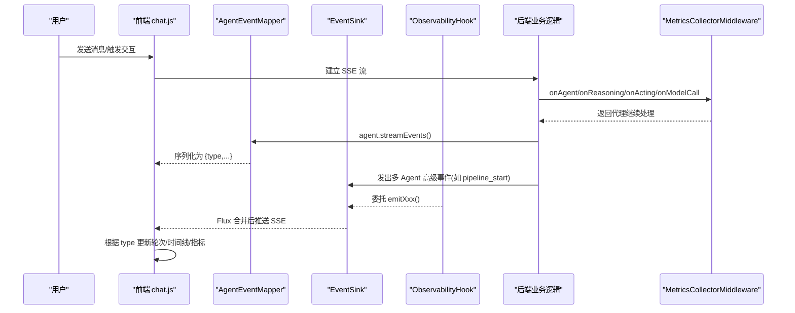
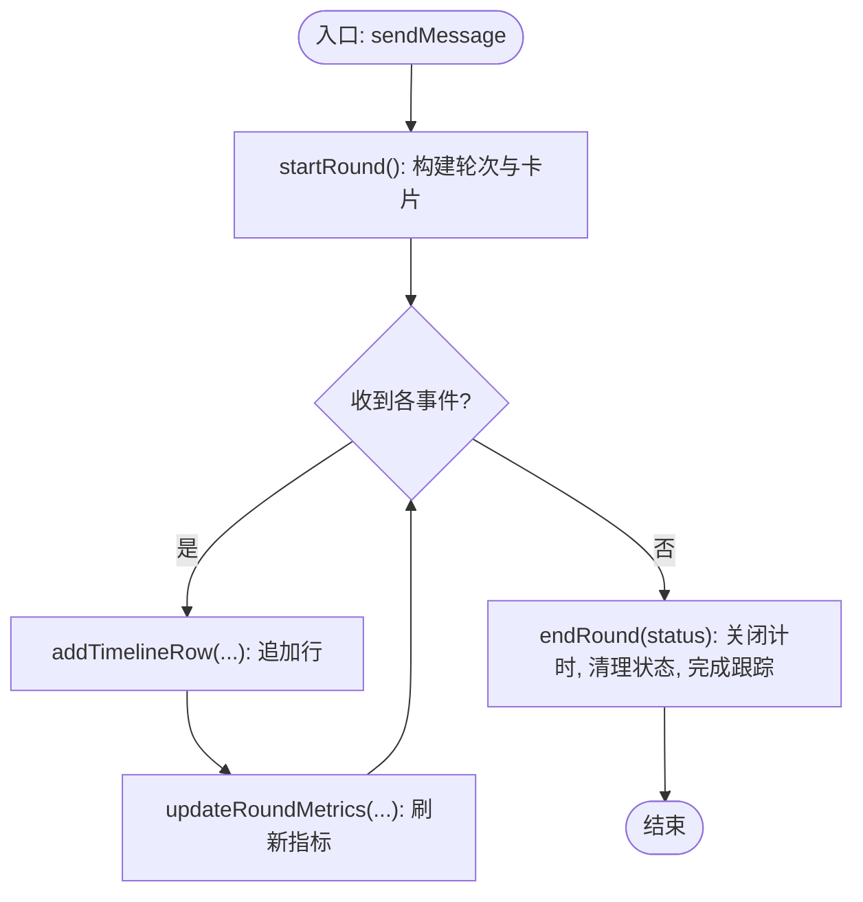
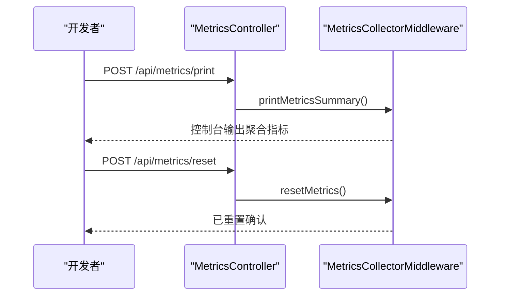
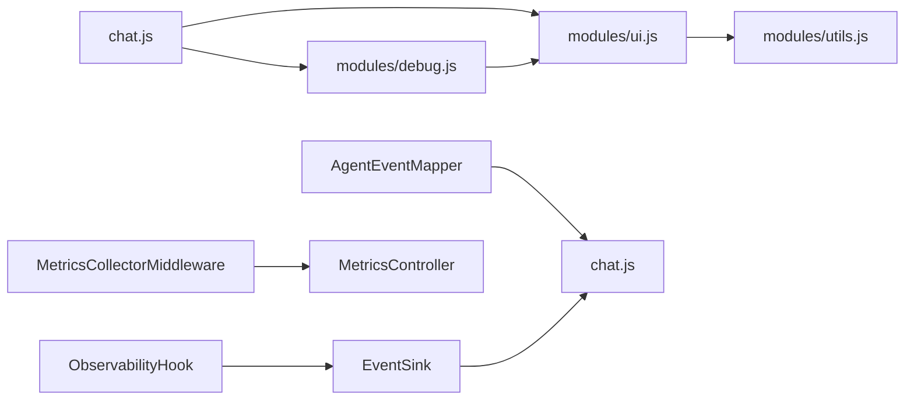

# 调试面板功能

<cite>
**本文引用的文件**
- [debug.js](file://src/main/resources/static/scripts/modules/debug.js)
- [debug.css](file://src/main/resources/static/styles/modules/debug.css)
- [chat.js](file://src/main/resources/static/scripts/chat.js)
- [ui.js](file://src/main/resources/static/scripts/modules/ui.js)
- [AgentEventMapper.java](file://src/main/java/com/skloda/agentscope/runtime/AgentEventMapper.java)
- [ObservabilityHook.java](file://src/main/java/com/skloda/agentscope/hook/ObservabilityHook.java)
- [EventSink.java](file://src/main/java/com/skloda/agentscope/runtime/EventSink.java)
- [MetricsCollectorMiddleware.java](file://src/main/java/com/skloda/agentscope/middleware/MetricsCollectorMiddleware.java)
- [MetricsController.java](file://src/main/java/com/skloda/agentscope/controller/MetricsController.java)
</cite>

## 目录
1. [简介](#简介)
2. [项目结构](#项目结构)
3. [核心组件](#核心组件)
4. [架构总览](#架构总览)
5. [详细组件分析](#详细组件分析)
6. [依赖关系分析](#依赖关系分析)
7. [性能考虑](#性能考虑)
8. [故障诊断指南](#故障诊断指南)
9. [结论](#结论)
10. [附录](#附录)（必要时）

## 简介
本文围绕“调试面板”能力进行系统化的技术说明，重点覆盖：
- Round 管理机制：轮次生命周期、状态推进、指标统计（tokens、耗时、调用次数）
- 时间线渲染系统：多事件类型可视化（Agent 生命周期、工具调用、路由决策、流水线执行）
- 调试数据实时链路：后端事件到前端 DOM 更新的优化策略
- 交互能力：展开/折叠、搜索过滤、数据导出
- 扩展与诊断：调试接口扩展方法、问题定位与性能监控方案

该文档基于源码分析形成，避免臆测；如需扩展能力，遵循“后端事件 + 前端映射”的扩展点设计。

## 项目结构
调试面板由前后端协同实现：
- 前端
  - 轮次与时间线 DOM 管理：modules/debug.js
  - 交互与 UI 控制（面板开关、滚动等）：modules/ui.js
  - SSE 事件接入与分发：chat.js
  - 样式与动画：styles/modules/debug.css
- 后端
  - 事件映射为 SSE payload：runtime/AgentEventMapper.java
  - 多 Agent 事件桥接与统一总线：hook/ObservabilityHook.java, runtime/EventSink.java
  - 性能指标采集：middleware/MetricsCollectorMiddleware.java（日志型）+ 控制器暴露统计 API：controller/MetricsController.java

```mermaid
graph TB
    FE["前端<br/>chat.js / modules/*.js"] --> SSE["SSE 流"]
    SSE -> Mapper["AgentEventMapper<br/>事件→JSON"]
    SSE -> Sink["EventSink<br/>统一事件总线"]
    Sink -> Hook["ObservabilityHook<br/>桥接"]
    Backend["业务运行时<br/>多 Agent/流水线/路由/循环"] --> Sink
    Backend --> Mapper
    Metrics["MetricsCollectorMiddleware<br/>收集指标"] --> Controller["MetricsController<br/>查询/重置"]
```

图表来源
- [chat.js:133-200](file://src/main/resources/static/scripts/chat.js#L133-L200)
- [AgentEventMapper.java:64-105](file://src/main/java/com/skloda/agentscope/runtime/AgentEventMapper.java#L64-L105)
- [EventSink.java:19-37](file://src/main/java/com/skloda/agentscope/runtime/EventSink.java#L19-L37)
- [MetricsController.java:17-57](file://src/main/java/com/skloda/agentscope/controller/MetricsController.java#L17-L57)

章节来源
- [chat.js:133-200](file://src/main/resources/static/scripts/chat.js#L133-L200)
- [debug.js:1-200](file://src/main/resources/static/scripts/modules/debug.js#L1-L200)
- [debug.css:1-200](file://src/main/resources/static/styles/modules/debug.css#L1-L200)

## 核心组件
- 轮次管理与指标
  - startRound/endRound：创建/结束一个“轮次”，维护 startTime、endTime、status、token 数、各类耗时、调用计数，以及行级时间线与状态追踪字段
  - updateRoundMetrics/updateRoundMetricsForRound：按当前轮次计算并更新汇总行与详细指标（包括 tokens、LLM 耗时、Tool 耗时、速度估算）
- 时间线渲染
  - addTimelineRow/addTimelineRowForRound：根据事件类型绘制一行轨迹（图标、连接符、标签、指标、状态），支持 running/ok/error 三类状态
- 事件映射与转发
  - AgentEventMapper：将框架 AgentEvent 转换为统一 JSON 负载，前端以 type 分发处理
  - EventSink/ObservabilityHook：提供 pipeline/routing/handoff/loop/graph/roundtable 等高级工作流的统一事件出口
- 指标采集
  - MetricsCollectorMiddleware：线程安全地累计 Token、Agent/Tool 调用时长、错误数、费用估算等，并通过日志输出
  - MetricsController：暴露打印/重置/状态查询的简单 REST 接口，用于人工排查与自动化校验

章节来源
- [debug.js:1-200](file://src/main/resources/static/scripts/modules/debug.js#L1-L200)
- [AgentEventMapper.java:64-105](file://src/main/java/com/skloda/agentscope/runtime/AgentEventMapper.java#L64-L105)
- [EventSink.java:19-37](file://src/main/java/com/skloda/agentscope/runtime/EventSink.java#L19-L37)
- [ObservabilityHook.java:16-67](file://src/main/java/com/skloda/agentscope/hook/ObservabilityHook.java#L16-L67)
- [MetricsCollectorMiddleware.java:31-200](file://src/main/java/com/skloda/agentscope/middleware/MetricsCollectorMiddleware.java#L31-L200)
- [MetricsController.java:17-57](file://src/main/java/com/skloda/agentscope/controller/MetricsController.java#L17-L57)

## 架构总览
下图展示了从事件产生、流式传输到前端渲染的全链路，以及指标采集的旁路通道。



图表来源
- [chat.js:133-200](file://src/main/resources/static/scripts/chat.js#L133-L200)
- [AgentEventMapper.java:64-105](file://src/main/java/com/skloda/agentscope/runtime/AgentEventMapper.java#L64-L105)
- [EventSink.java:65-151](file://src/main/java/com/skloda/agentscope/runtime/EventSink.java#L65-L151)
- [ObservabilityHook.java:45-67](file://src/main/java/com/skloda/agentscope/hook/ObservabilityHook.java#L45-L67)
- [MetricsCollectorMiddleware.java:93-162](file://src/main/java/com/skloda/agentscope/middleware/MetricsCollectorMiddleware.java#L93-L162)

## 详细组件分析

### 轮次管理机制（Round）
- 生命周期
  - 开始：startRound(userMessage, roundNumber, currentAgent, agents) 创建轮次对象与 UI 卡片，初始化计时器、Token、耗时与调用计数，加入 window.rounds，设置当前轮次
  - 运行：addTimelineRow/addTimelineRowForRound 追加事件行（phase/tool/llm 等），可带 status（running/ok/error）
  - 结束：endRound(status) 完成计时、清理 running 类名、写入最终状态，并调用 completeRoundTrace
- 指标更新
  - updateRoundMetrics/updateRoundMetricsForRound 计算并刷新摘要（tokens、LLM 耗时、tool 次数）与详情区域（Model、Tokens、Speed 等）
- 数据结构要点
  - round: number, startTime, endTime, userMessage, inputTokens, outputTokens, totalTokens, llmTime, toolTime, thinkingTime, llmCallCount, toolCallCount, totalLlmCalls, totalToolCalls, status, timelineStep, _currentLlmRow/_currentToolRow 等辅助字段
- 复杂度与健壮性
  - O(1) 增改索引字段，UI 增量 append
  - endRound 中多重空值保护与查找失败日志，降低崩溃风险



图表来源
- [debug.js:5-61](file://src/main/resources/static/scripts/modules/debug.js#L5-L61)
- [debug.js:63-172](file://src/main/resources/static/scripts/modules/debug.js#L63-L172)
- [debug.js:174-200](file://src/main/resources/static/scripts/modules/debug.js#L174-L200)

章节来源
- [debug.js:5-200](file://src/main/resources/static/scripts/modules/debug.js#L5-L200)
- [debug.css:116-200](file://src/main/resources/static/styles/modules/debug.css#L116-L200)

### 时间线渲染系统
- 事件类型与视觉
  - Agent 生命周期：agent_start/agent_end → phase 类型，展示名称与角色
  - 模型调用：model_call_start/model_call_end → llm 类型，含 usage tokens
  - 工具调用：tool_* 系列 → tool 类型，含 name、toolCallId、delta/result
  - 多 Agent 流程：pipeline_*、routing_*、handoff_*、loop_*、graph_*、roundtable_*、task_* 等 → 统一通过 EventSink 广播
- 渲染方式
  - 每一行包含：连接线、图标、标签、指标、状态文本
  - 支持 running/ok/error 三类状态；自动滚动到底部保持可见
- 与前端分发
  - chat.js 在收到 SSE event 时，依据 type 进入对应分支，调用 debug.js 提供的 API 来追加/更新行与指标

```mermaid
classDiagram
    class DebugJS {
        +startRound(...)
        +endRound(...)
        +updateRoundMetrics(...)
        +addTimelineRow(type,label,metrics,status)
        +addTimelineRowForRound(round,type,label,metrics,status)
        +completeRoundTrace(...)
    }
    class ChatJS {
        +parseSSE()
        +switch(type){...}
        +onAgentLifecycle()
        +onToolCall()
        +onMultiAgentEvents()
    }
    class AgentEventMapper {
        +apply(event) Map
        +toolStart()/toolEnd()/modelCallStart()/modelCallEnd()
    }
    class EventSink {
        +asFlux() Flux
        +emitPipelineStart(...)
        +emitRoutingDecision(...)
        +emitHandoffStart(...)
        +emitLoopStart(...)
        +emitGraphTransition(...)
        +emitRoundtableStart(...)
        +emitTaskDelegate(...)
    }

    ChatJS --> DebugJS : "调用"
    ChatJS --> AgentEventMapper : "消费类型"
    ChatJS --> EventSink : "消费多Agent事件"
```

图表来源
- [debug.js:174-200](file://src/main/resources/static/scripts/modules/debug.js#L174-L200)
- [chat.js:178-240](file://src/main/resources/static/scripts/chat.js#L178-L240)
- [AgentEventMapper.java:107-200](file://src/main/java/com/skloda/agentscope/runtime/AgentEventMapper.java#L107-L200)
- [EventSink.java:65-151](file://src/main/java/com/skloda/agentscope/runtime/EventSink.java#L65-L151)

章节来源
- [AgentEventMapper.java:64-200](file://src/main/java/com/skloda/agentscope/runtime/AgentEventMapper.java#L64-L200)
- [EventSink.java:65-151](file://src/main/java/com/skloda/agentscope/runtime/EventSink.java#L65-L151)
- [chat.js:178-240](file://src/main/resources/static/scripts/chat.js#L178-L240)

### 调试数据实时更新机制
- 事件源
  - 框架事件经 AgentEventMapper 标准化为 {type, ...payload}，通过 SSE 推送到前端
  - 多 Agent 高级事件经 ObservabilityHook 委托至 EventSink，统一推送
- 前端接收与渲染
  - chat.js 使用 ReadableStream 读取响应体，结合自定义 SSE 解析器，按事件类型分发到模块函数
  - 首次内容事件清除“输入态”指示器，保证聊天区有实质反馈
  - 对调试面板事件与聊天区内容事件的区分，避免误清状态
- DOM 操作优化
  - 仅追加行或切换类名，避免整表重绘；必要时 scrollToBottom 保证焦点
- 内存管理
  - 轮次结束后清理状态与引用（window.currentRound = null）
  - 行级临时变量 (_currentLlmRow 等) 按需使用
- 大列表虚拟化
  - 当前实现采用追加 DOM 节点方式，未见显式虚拟滚动；若数据量增长，可在 debugRounds 容器上引入分页或虚拟列表机制

章节来源
- [chat.js:133-200](file://src/main/resources/static/scripts/chat.js#L133-L200)
- [chat.js:178-240](file://src/main/resources/static/scripts/chat.js#L178-L240)
- [debug.js:63-172](file://src/main/resources/static/scripts/modules/debug.js#L63-L172)

### 展开/折叠、搜索过滤、数据导出
- 展开/折叠
  - 面板整体可通过 CSS 类 .collapsed 切换宽度与显示区域（title、rounds、clear）；头部按钮用于切换
- 搜索过滤
  - 未发现代码中内置全局搜索过滤；可通过浏览器 Ctrl+F 或在扩展中增强过滤器
- 数据导出
  - 未实现直接导出；可基于 window.rounds 快照进行 JSON 导出或 CSV 导出（作为增强建议）

章节来源
- [debug.css:1-120](file://src/main/resources/static/styles/modules/debug.css#L1-L120)
- [debug.js:113-154](file://src/main/resources/static/scripts/modules/debug.js#L113-L154)

### 调试接口自定义扩展方法与诊断工具
- 扩展点
  - 新事件类型：在后端 AgentEventMapper 增加分支映射；或通过 ObservabilityHook 调用 EventSink.emitXxx() 注入自定义类型
  - 新指标：在 MetricsCollectorMiddleware 中追加维度或计数器，并以日志/REST 形式暴露
- 诊断工具
  - MetricsController
    - POST /api/metrics/print：打印聚合指标到控制台
    - POST /api/metrics/reset：重置指标
    - GET /api/metrics/status：获取可用端点描述
  - 日志定位：关键流程均有日志输出（例如 endRound、EventSink 写入、MetricsCollector 异常路径），便于快速定位



图表来源
- [MetricsController.java:17-57](file://src/main/java/com/skloda/agentscope/controller/MetricsController.java#L17-L57)
- [MetricsCollectorMiddleware.java:186-200](file://src/main/java/com/skloda/agentscope/middleware/MetricsCollectorMiddleware.java#L186-L200)

章节来源
- [MetricsController.java:17-57](file://src/main/java/com/skloda/agentscope/controller/MetricsController.java#L17-L57)
- [MetricsCollectorMiddleware.java:186-200](file://src/main/java/com/skloda/agentscope/middleware/MetricsCollectorMiddleware.java#L186-L200)
- [ObservabilityHook.java:45-67](file://src/main/java/com/skloda/agentscope/hook/ObservabilityHook.java#L45-L67)
- [EventSink.java:65-151](file://src/main/java/com/skloda/agentscope/runtime/EventSink.java#L65-L151)

## 依赖关系分析
- 前端
  - chat.js 依赖 modules/debug.js、modules/ui.js、utils.js
  - debug.js 依赖 ui.js（DOM 引用）与 utils.js（工具函数）
- 后端
  - AgentEventMapper 不依赖其他业务模块，纯转换层
  - ObservabilityHook 依赖 EventSink
  - MetricsCollectorMiddleware 作为拦截器，被框架中间件链包裹，不影响主线流程
  - MetricsController 与 MetricsCollectorMiddleware 协作
- 耦合度
  - 前后端契约集中在 SSE 事件类型定义；新增事件需同时约定双方行为
  - EventSink 解耦了多 Agent 事件的产生与消费



图表来源
- [chat.js:1-10](file://src/main/resources/static/scripts/chat.js#L1-L10)
- [debug.js:1-5](file://src/main/resources/static/scripts/modules/debug.js#L1-L5)
- [ui.js:1-12](file://src/main/resources/static/scripts/modules/ui.js#L1-L12)
- [EventSink.java:19-37](file://src/main/java/com/skloda/agentscope/runtime/EventSink.java#L19-L37)
- [MetricsController.java:17-57](file://src/main/java/com/skloda/agentscope/controller/MetricsController.java#L17-L57)

章节来源
- [chat.js:1-10](file://src/main/resources/static/scripts/chat.js#L1-L10)
- [debug.js:1-5](file://src/main/resources/static/scripts/modules/debug.js#L1-L5)
- [ui.js:1-12](file://src/main/resources/static/scripts/modules/ui.js#L1-L12)

## 性能考虑
- 事件映射开销
  - AgentEventMapper 单事件转换代价低，注意避免异常路径频繁抛错
- SSE 传输
  - 小片段高频推送（text/thinking/tool delta）应控制 chunk 大小与频率
- DOM 插入
  - 使用 appendChild 追加行，批量更新前可暂时隐藏容器提升吞吐
- 指标采集
  - MetricsCollectorMiddleware 使用原子计数与并发 Map，避免锁竞争；CPU 开销随事件量线性增长
- 内存
  - 及时清空 per-round 暂存引用，防止长期累积

[本节为通用性能建议，未直接分析具体文件]

## 故障诊断指南
- 常见问题
  - endRound 找不到 round card：检查 DOM id 匹配与元素存在性
  - 无 agent_start/agent_end：核查 AgentEventMapper 映射与 SSE 是否正常
  - 指标未增长：检查 ModelCallEnd 是否携带 usage，以及 MetricsCollectorMiddleware 是否生效
- 排障步骤
  - 使用 /api/metrics/status 查看接口可用性
  - 调用 /api/metrics/print 验证后台指标是否落地
  - 查阅服务端日志关键字：METRICS-COLLECTOR、EventSink error、endRound warnings
- 回归与隔离
  - 针对新增事件类型先在本地复现并添加断言（类型、payload 必填字段）
  - 使用最小 Agent 配置验证链路通畅

章节来源
- [MetricsCollectorMiddleware.java:31-162](file://src/main/java/com/skloda/agentscope/middleware/MetricsCollectorMiddleware.java#L31-L162)
- [MetricsController.java:17-57](file://src/main/java/com/skloda/agentscope/controller/MetricsController.java#L17-L57)
- [debug.js:63-172](file://src/main/resources/static/scripts/modules/debug.js#L63-L172)

## 结论
调试面板以“事件驱动 + 轮次化视角”提供了可视化的运行时观测能力：
- Round 管理将一次对话切分为可独立追踪的单位，支撑精确指标统计
- 时间线系统通过统一的 type 约定与丰富的 UI 呈现，帮助快速定位瓶颈和异常
- 事件映射与中间件组合既保证低耦合又具备可扩展性
- 后续可根据实际需求补充搜索过滤、虚拟列表、导出与成本建模等功能

[本节总结性内容，无需具体文件分析]

## 附录
- 关键事件类型参考
  - LLM：llm_start/llm_end（包含 input/output/totalTokens）
  - 工具：tool_start/tool_result(tool_call_delta/tool_result_text_delta/tool_result_data_delta/tool_result_end 等）
  - 多 Agent：pipeline_*/routing_*/handoff_*/loop_*/graph_*/roundtable_*/task_*
  - 其他：thinking/text/agent_start/agent_end/request_stop 等

[本节列举性内容，无需具体文件分析]