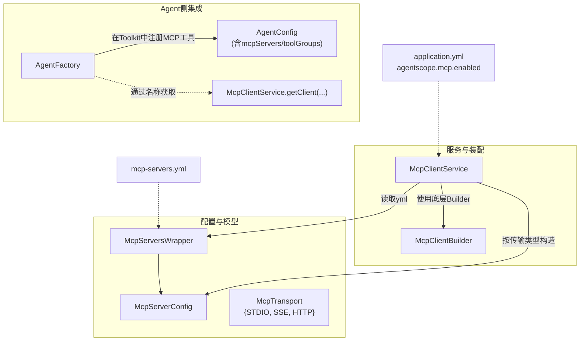
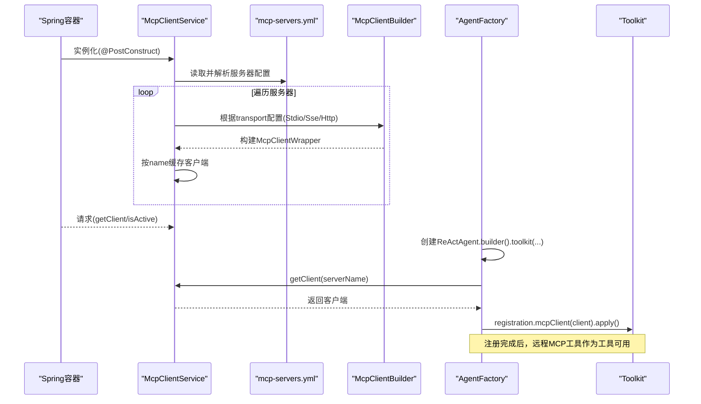
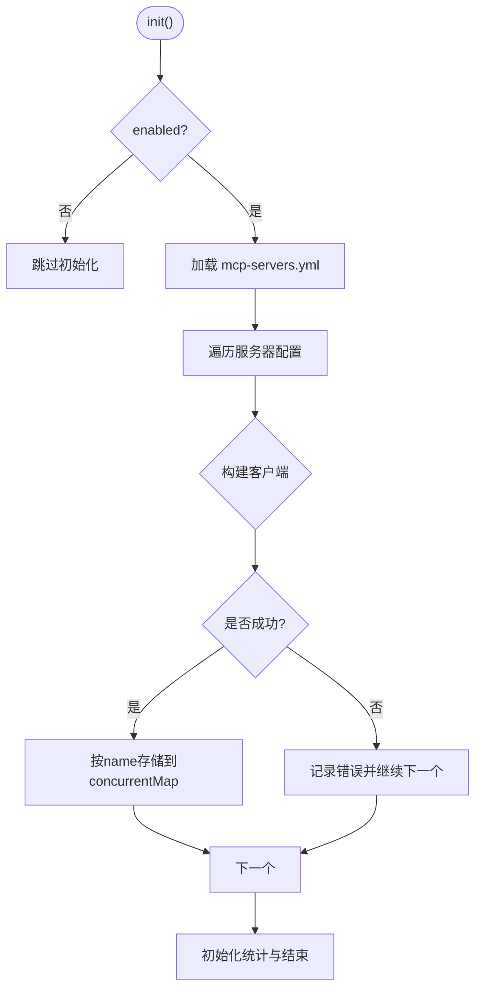
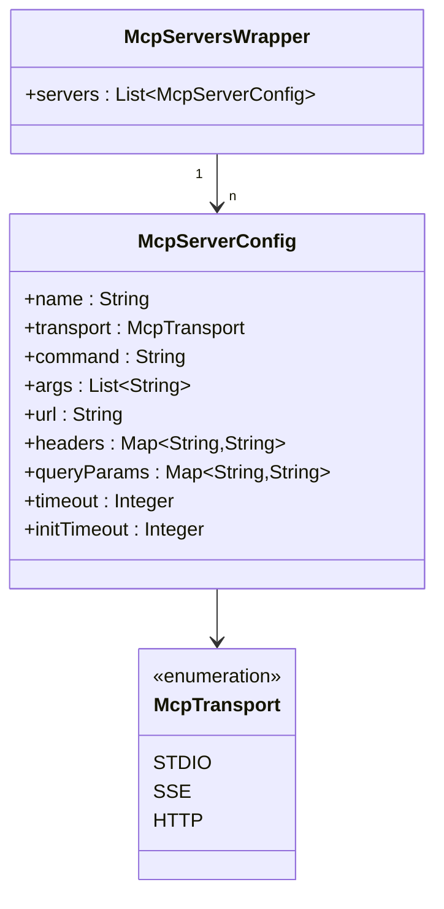
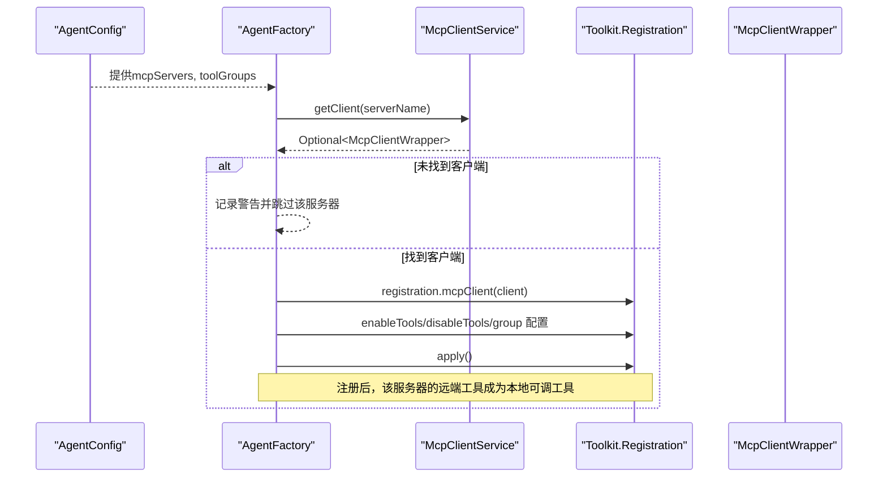
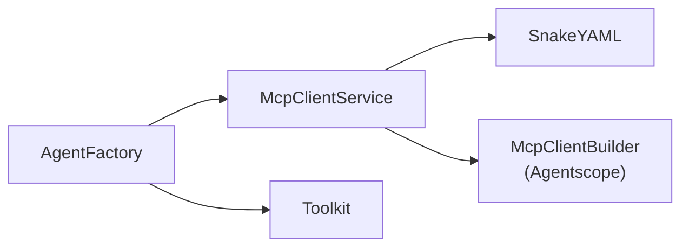

# MCP客户端集成

<cite>
**本文引用的文件**
- [McpClientService.java](file://src/main/java/com/skloda/agentscope/mcp/McpClientService.java)
- [McpServerConfig.java](file://src/main/java/com/skloda/agentscope/mcp/McpServerConfig.java)
- [McpServersWrapper.java](file://src/main/java/com/skloda/agentscope/mcp/McpServersWrapper.java)
- [McpTransport.java](file://src/main/java/com/skloda/agentscope/mcp/McpTransport.java)
- [mcp-servers.yml](file://src/main/resources/config/mcp-servers.yml)
- [AgentFactory.java](file://src/main/java/com/skloda/agentscope/agent/AgentFactory.java)
- [AgentConfig.java](file://src/main/java/com/skloda/agentscope/agent/AgentConfig.java)
- [ToolRegistry.java](file://src/main/java/com/skloda/agentscope/tool/ToolRegistry.java)
- [Application主类（入口）.java](file://src/main/java/com/skloda/agentscope/AgentScopeDemoApplication.java)
- [pom.xml](file://pom.xml)
</cite>

## 目录
1. 引言
2. 项目结构
3. 核心组件
4. 架构总览
5. 详细组件分析
6. 依赖关系分析
7. 性能与连接池
8. 安全与合规
9. 故障排查
10. 结论
11. 附录：配置示例与最佳实践

## 引言
本文件聚焦项目中实现“MCP（Model Context Protocol）客户端”的集成能力，系统梳理基于 McpClientService 的多传输支持（STDIO、SSE、HTTP Streamable）、配置加载与占位符解析、客户端生命周期管理、工具发现与调用流程、错误处理与可观测性建议。并给出不同传输方式的配置方法与调试技巧。

## 项目结构
围绕MCP的相关代码位于包 com.skloda.agentscope.mcp，包含配置模型、传输枚举与服务装配；Agent层负责在构建Agent时将MCP工具注册进工具集；资源目录中包含服务器配置文件 mcp-servers.yml。

图表来源
- [McpClientService.java:22-77](file://src/main/java/com/skloda/agentscope/mcp/McpClientService.java#L22-L77)
- [McpServersWrapper.java:1-13](file://src/main/java/com/skloda/agentscope/mcp/McpServersWrapper.java#L1-L13)
- [McpServerConfig.java:11-31](file://src/main/java/com/skloda/agentscope/mcp/McpServerConfig.java#L11-L31)
- [McpTransport.java:1-7](file://src/main/java/com/skloda/agentscope/mcp/McpTransport.java#L1-L7)
- [AgentFactory.java:150-160](file://src/main/java/com/skloda/agentscope/agent/AgentFactory.java#L150-L160)
- [AgentFactory.java:340-384](file://src/main/java/com/skloda/agentscope/agent/AgentFactory.java#L340-L384)

章节来源
- [McpClientService.java:22-77](file://src/main/java/com/skloda/agentscope/mcp/McpClientService.java#L22-L77)
- [mcp-servers.yml:1-29](file://src/main/resources/config/mcp-servers.yml#L1-L29)

## 核心组件
- McpClientService：Spring Service，应用启动时从 classpath:/config/mcp-servers.yml 加载配置，为每个服务器构建对应的MCP客户端，按名称缓存并提供获取接口；支持关闭开关 agentscope.mcp.enabled。
- McpServerConfig / McpServersWrapper：YAML反序列化的配置载体，承载多个服务器配置的列表。
- McpTransport：定义支持的三种传输协议 STDIO、SSE、HTTP（Streamable）。
- AgentFactory：在创建/构建ReActAgent时，将MCP工具根据Agent配置注册到全局 Toolkit，支持启用/禁用具体工具和工具分组。
- ToolRegistry：本地工具的注册中心（MCP通过AgentFactory在Toolkit上注册后不再走ToolRegistry）。

章节来源
- [McpClientService.java:22-144](file://src/main/java/com/skloda/agentscope/mcp/McpClientService.java#L22-L144)
- [McpServerConfig.java:11-31](file://src/main/java/com/skloda/agentscope/mcp/McpServerConfig.java#L11-L31)
- [McpServersWrapper.java:1-13](file://src/main/java/com/skloda/agentscope/mcp/McpServersWrapper.java#L1-L13)
- [McpTransport.java:1-7](file://src/main/java/com/skloda/agentscope/mcp/McpTransport.java#L1-L7)
- [AgentFactory.java:340-384](file://src/main/java/com/skloda/agentscope/agent/AgentFactory.java#L340-L384)

## 架构总览
MCP客户端的生命周期由Spring容器管理，启动时初始化，按需构建，结束时清理。配置驱动三种传输通道，均通过统一的客户端构造器完成最终绑定。Agent侧将发现的远程工具视作工具集中的一组“MCP工具”，通过工具分组和黑白名单精细控制暴露范围。

图表来源
- [McpClientService.java:43-77](file://src/main/java/com/skloda/agentscope/mcp/McpClientService.java#L43-L77)
- [AgentFactory.java:340-384](file://src/main/java/com/skloda/agentscope/agent/AgentFactory.java#L340-L384)

## 详细组件分析

### McpClientService：多传输支持与配置解析
- 初始化流程
  - 从 classpath:config/mcp-servers.yml 加载 YAML，解析成 McpServersWrapper → List<McpServerConfig>。
  - 如果 disabled（agentscope.mcp.enabled=false），直接跳过初始化。
  - 对每个服务器配置，根据 transport 分支选择 stdioTransport / sseTransport / streamableHttpTransport，设置 timeout/initTimeout，最终构建异步客户端并以 name 为键缓存。
- 环境变量占位符解析
  - 针对SSE/HTTP的 headers/queryParam，支持 ${VAR} 与 ${VAR:default} 语法，运行时替换为环境变量值或默认值。
- 生命周期
  - @PostConstruct：初始化并记录活跃客户端数。
  - @PreDestroy：逐个 close，防止句柄泄漏；异常不会中断销毁过程，仅日志警告。

图表来源
- [McpClientService.java:43-77](file://src/main/java/com/skloda/agentscope/mcp/McpClientService.java#L43-L77)

章节来源
- [McpClientService.java:22-144](file://src/main/java/com/skloda/agentscope/mcp/McpClientService.java#L22-L144)
- [McpClientService.java:170-225](file://src/main/java/com/skloda/agentscope/mcp/McpClientService.java#L170-L225)

#### 三种传输方式的实现要点
- STDIO
  - 需要 command 及可选 args；用于启动本地进程式MCP服务器（例如文件系统MCP服务器）。
  - 参数校验缺失会抛出明确异常，便于快速定位配置问题。
- SSE
  - 需要 url；支持在 header/queryParam 中进行变量替换。
- HTTP (Streamable)
  - 使用 streamableHttpTransport 与 url；同样支持 head/query 解析。

章节来源
- [McpClientService.java:118-168](file://src/main/java/com/skloda/agentscope/mcp/McpClientService.java#L118-L168)

### 配置装载与数据结构
- 顶层封装类 McpServersWrapper 提供 servers 列表，YAML 中通过该节点描述全部MCP服务器。
- McpServerConfig 字段覆盖：
  - name（必填，用作缓存键与引用标识）
  - transport（STDIO/SSE/HTTP）
  - STDIO专用：command, args
  - 网络传输：url, headers, queryParams
  - 通用：timeout, initTimeout

图表来源
- [McpServersWrapper.java:1-13](file://src/main/java/com/skloda/agentscope/mcp/McpServersWrapper.java#L1-L13)
- [McpServerConfig.java:11-31](file://src/main/java/com/skloda/agentscope/mcp/McpServerConfig.java#L11-L31)
- [McpTransport.java:1-7](file://src/main/java/com/skloda/agentscope/mcp/McpTransport.java#L1-L7)

章节来源
- [McpServersWrapper.java:1-13](file://src/main/java/com/skloda/agentscope/mcp/McpServersWrapper.java#L1-L13)
- [McpServerConfig.java:11-31](file://src/main/java/com/skloda/agentscope/mcp/McpServerConfig.java#L11-L31)
- [mcp-servers.yml:1-29](file://src/main/resources/config/mcp-servers.yml#L1-L29)

### 工具发现与调用流程（Agent侧）
- AgentConfig 声明 mcpServers 引用与 toolGroups。
- AgentFactory 构建 ReActAgent.Builder 时：
  - 先注册本地工具与技能。
  - 随后 registerMcpTools(config, toolkit)：
    - 若存在 toolGroups，创建工具组并在后面分配。
    - 对于每个 McpServerRef，通过 McpClientService 获取已初始化客户端。
    - 使用 Toolkit.registration().mcpClient(client) 进行注册：
      - 支持 enableTools / disableTools 精确筛选。
      - 可通过 group 指定工具归属分组，便于管理与开关。
    - 调用 apply() 生效。

图表来源
- [AgentFactory.java:340-384](file://src/main/java/com/skloda/agentscope/agent/AgentFactory.java#L340-L384)
- [AgentConfig.java:84-86](file://src/main/java/com/skloda/agentscope/agent/AgentConfig.java#L84-L86)

章节来源
- [AgentFactory.java:340-384](file://src/main/java/com/skloda/agentscope/agent/AgentFactory.java#L340-L384)
- [AgentConfig.java:84-86](file://src/main/java/com/skloda/agentscope/agent/AgentConfig.java#L84-L86)

### 错误处理与健壮性
- YAML 解析异常：记录 warn 并整体跳过MCP初始化，不影响其他功能。
- 单个客户端构建异常：记录错误，继续构建其他服务器配置。
- 客户端销毁：逐个close，异常以 warn 记录且不阻断后续销毁。
- STDIO必需项校验：缺少必要字段时抛非法参数异常，明确失败原因。

章节来源
- [McpClientService.java:43-90](file://src/main/java/com/skloda/agentscope/mcp/McpClientService.java#L43-L90)
- [McpClientService.java:118-168](file://src/main/java/com/skloda/agentscope/mcp/McpClientService.java#L118-L168)

## 依赖关系分析
- Spring/Boot：Service 由容器管理生命周期；@Value 注入配置项。
- SnakeYAML：加载 YAML 到 McpServersWrapper → McpServerConfig。
- AgentScope Client：底层 McpClientBuilder/Wrapper 提供实际的网络与流式通信。
- Agent侧通过 AgentFactory 与 Toolkit 集成，使MCP工具融入工具链。

图表来源
- [McpClientService.java:22-77](file://src/main/java/com/skloda/agentscope/mcp/McpClientService.java#L22-L77)
- [AgentFactory.java:340-384](file://src/main/java/com/skloda/agentscope/agent/AgentFactory.java#L340-L384)

章节来源
- [pom.xml:28-55](file://pom.xml#L28-L55)
- [AgentFactory.java:340-384](file://src/main/java/com/skloda/agentscope/agent/AgentFactory.java#L340-L384)

## 性能与连接池
- 连接复用：当前实现以 server name 为key持有单例 McpClientWrapper。同一客户端被多次使用时复用底层连接（具体行为取决于底层SDK的实现细节）。建议不要在每次请求时重复构建客户端。
- 超时控制：可通过 McpServerConfig.timeout 与 initializationTimeout 限制调用和初始化阶段的等待时间，避免慢链路拖垮流程。
- 并发与内存：ConcurrentHashMap 保存客户端，线程安全；确保服务器数量合理，避免过多长连接导致资源压力。
- 批调用场景：若同一代理频繁并发调用同一MCP工具，建议利用工具组的启停策略或本地缓存降低网络开销。

[本节为通用建议，不直接分析具体文件]

## 安全与合规
- 敏感信息注入：建议使用 ${ENV_VAR} 或 ${ENV_VAR:default} 在 headers 与 queryParams 中传入认证令牌，避免明文硬编码。
- 最小权限原则：通过 enableTools/disableTools 精确暴露所需工具，降低误用风险。
- 分组隔离：借助 toolGroups 区分不同职责的工具集合，方便在UI或策略侧做统一治理。
- 传输安全：SSE/HTTP 建议在生产环境使用HTTPS；必要时配合反向代理或网关鉴权。
- 启动开关：通过 agentscope.mcp.enabled 控制是否启用整个MCP模块，便于灰度与环境隔离。

[本节为通用建议，不直接分析具体文件]

## 故障排查
- 症状：MCP未可用或未加载
  - 检查 agentscope.mcp.enabled 是否为true。
  - 检查 classpath:config/mcp-servers.yml 是否可读且格式正确。
  - 查看日志中的 “Initialized ... active client(s)” 确认实际创建的客户端数量。
- 症状：STDIO连接失败
  - 确认 command 存在且可执行；确认运行环境中具备相关命令（如Node/npx）。
- 症状：SSE/HTTP连接失败或鉴权失败
  - 检查 url、headers、queryParams 是否正确；环境变量是否注入成功；网络可达性。
  - 若使用自定义header携带令牌，确认占位符解析结果不为空。
- 症状：工具不可见
  - 检查 AgentConfig.mcpServers 是否引用了正确的 server 名称；enableTools/disablesTools 是否过滤过度；toolGroups 是否正确应用到。
- 常见定位位置
  - 初始化与构建日志、异常堆栈位置：McpClientService 的对应分支。
  - 注册阶段告警：AgentFactory.registerMcpTools 的“未找到客户端”警告。

章节来源
- [McpClientService.java:43-90](file://src/main/java/com/skloda/agentscope/mcp/McpClientService.java#L43-L90)
- [AgentFactory.java:340-384](file://src/main/java/com/skloda/agentscope/agent/AgentFactory.java#L340-L384)

## 结论
本项目实现了基于配置的MCP客户端统一接入，以最少配置支撑STDIO、SSE、HTTP（Streamable）三套传输方式；通过环境变量占位符提升安全性与可移植性；Agent层以工具形式无缝集成MCP能力，并通过工具组与黑白名单控制作用域。遵循上述安全与排障指南，可在本地开发到生产部署各阶段稳定扩展MCP工具生态。

## 附录：配置示例与最佳实践

### 配置总览（mcp-servers.yml）
文件中定义了四种示例服务器：本地文件系统（STDIO）、远程SSE服务、两个HTTP Streamable服务。可按需增删条目。

- 本地文件系统（STDIO）
  - command：调用 npx 运行 @modelcontextprotocol/server-filesystem
  - args：指定工作目录参数
  - 适合本地开发与演示场景

- 远程SSE服务
  - url：服务端SSE端点
  - headers：可使用 Authorization=Bearer ${MCP_API_TOKEN:} 动态注入令牌
  - queryParams：version=v1 等查询参数

- HTTP Streamable服务
  - url：/mcp 或类似路径
  - headers：可附加 X-Agent-Role 等业务头

提示：不要将真实密钥写入YAML，统一通过环境变量注入。

章节来源
- [mcp-servers.yml:1-29](file://src/main/resources/config/mcp-servers.yml#L1-L29)
- [McpClientService.java:170-225](file://src/main/java/com/skloda/agentscope/mcp/McpClientService.java#L170-L225)

### 应用级开关
- 开启/关闭MCP模块：应用属性 agentscope.mcp.enabled=true/false，关闭时完全跳过初始化，减少资源占用。

章节来源
- [McpClientService.java:35-47](file://src/main/java/com/skloda/agentscope/mcp/McpClientService.java#L35-L47)

### Agent侧启用MCP工具
- 在 AgentConfig 中：
  - mcpServers：列举要接入的服务名称与工具白/黑名单，以及所属工具组
  - toolGroups：定义分组名称、描述与是否激活，供MCP工具归类
- AgentFactory 会在构建阶段注册MCP工具，使其与普通工具一致地参与工具链调用。

章节来源
- [AgentConfig.java:84-86](file://src/main/java/com/skloda/agentscope/agent/AgentConfig.java#L84-L86)
- [AgentFactory.java:340-384](file://src/main/java/com/skloda/agentscope/agent/AgentFactory.java#L340-L384)

### 调试技巧
- 日志级别
  - 将 io.agentscope 日志调至 DEBUG，获取更多MCP交互线索（构建、注册、调用时机）。
- 逐步验证
  - 先在最小化配置下只启用一个服务器（例如STDIO本地文件系统），确认连通性后再逐步叠加。
- 环境变量核对
  - 通过打印或临时日志验证占位符解析后的最终值（尤其敏感头与Token）。
- 断点定位
  - 关键断点：McpClientService.init()/buildClient()/configure*，AgentFactory.registerMcpTools。

[本节为通用建议，不直接分析具体文件]